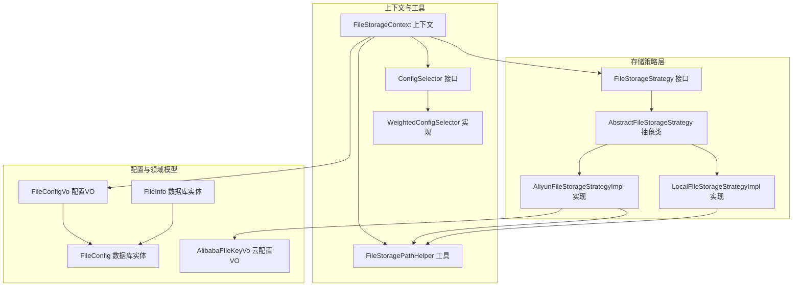
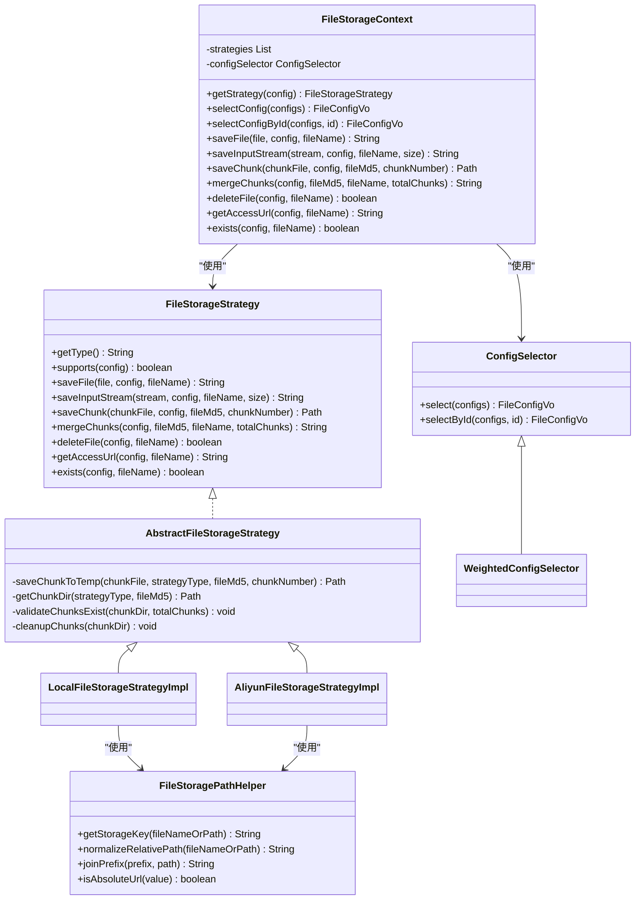
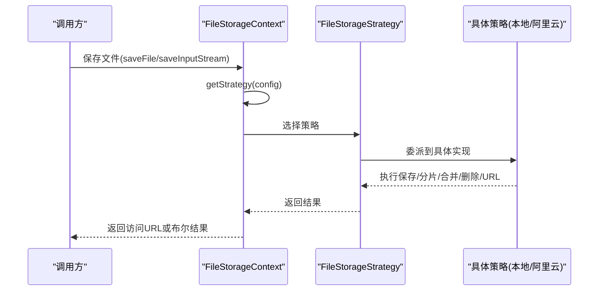
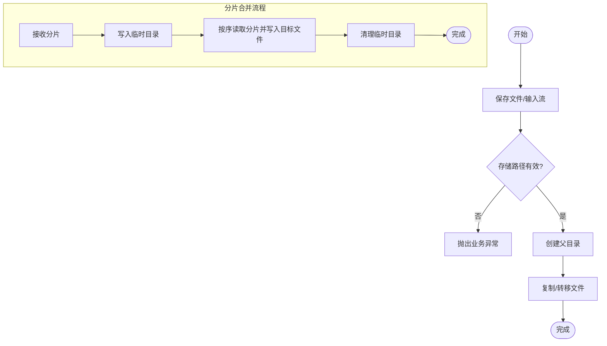
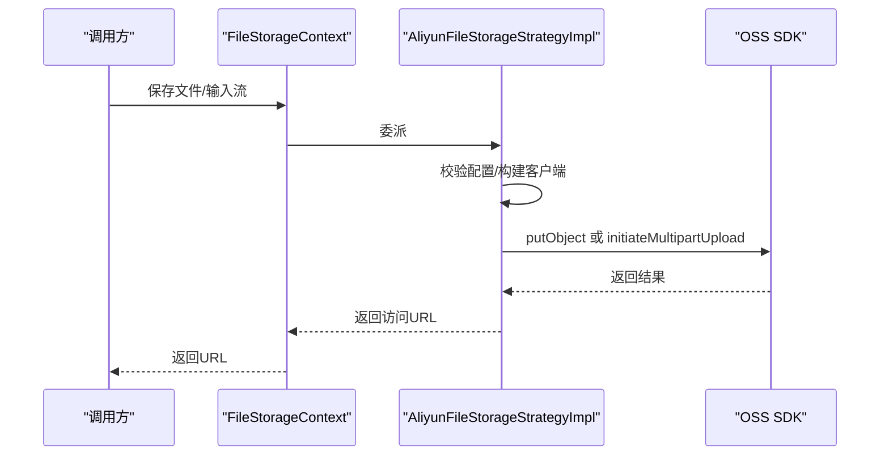
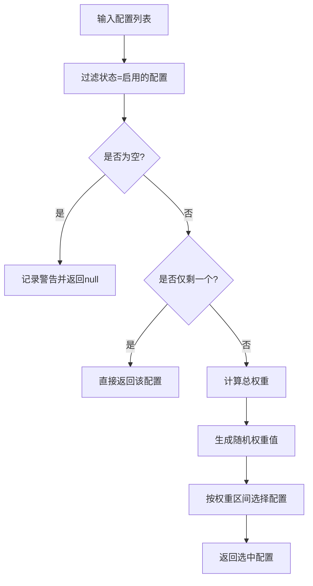
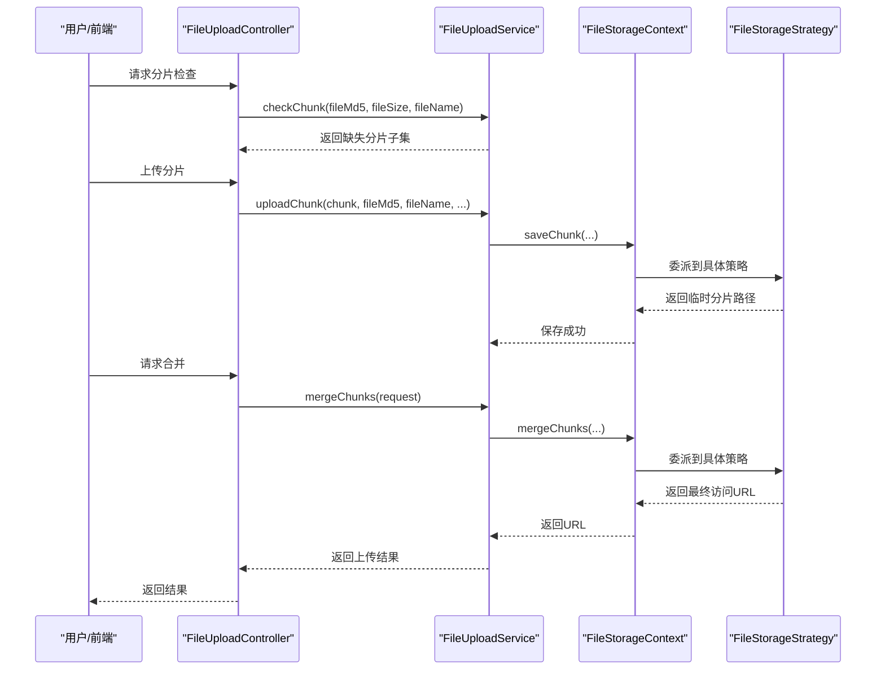
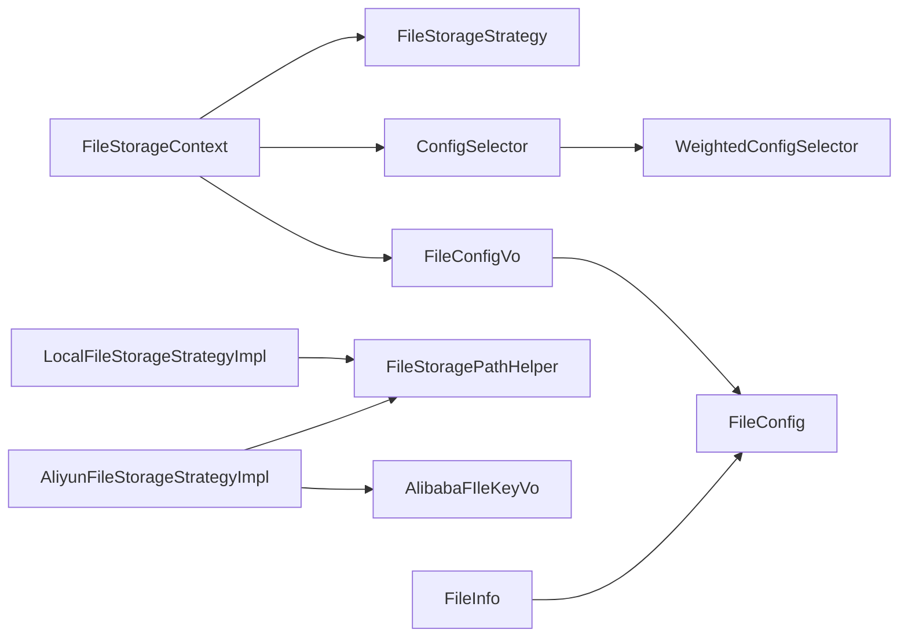

# 文件管理模块

<cite>
**本文引用的文件**
- [FileStorageStrategy.java](file://file-module/src/main/java/com/fastproject/file/storage/FileStorageStrategy.java)
- [AbstractFileStorageStrategy.java](file://file-module/src/main/java/com/fastproject/file/storage/AbstractFileStorageStrategy.java)
- [LocalFileStorageStrategyImpl.java](file://file-module/src/main/java/com/fastproject/file/storage/impl/LocalFileStorageStrategyImpl.java)
- [AliyunFileStorageStrategyImpl.java](file://file-module/src/main/java/com/fastproject/file/storage/impl/AliyunFileStorageStrategyImpl.java)
- [FileStorageContext.java](file://file-module/src/main/java/com/fastproject/file/storage/FileStorageContext.java)
- [ConfigSelector.java](file://file-module/src/main/java/com/fastproject/file/storage/ConfigSelector.java)
- [WeightedConfigSelector.java](file://file-module/src/main/java/com/fastproject/file/storage/WeightedConfigSelector.java)
- [FileStoragePathHelper.java](file://file-module/src/main/java/com/fastproject/file/storage/FileStoragePathHelper.java)
- [FileConfigVo.java](file://file-module/src/main/java/com/fastproject/file/vo/config/FileConfigVo.java)
- [AlibabaFIleKeyVo.java](file://file-module/src/main/java/com/fastproject/file/storage/vo/AlibabaFIleKeyVo.java)
- [FileConfig.java](file://file-module/src/main/java/com/fastproject/file/domain/FileConfig.java)
- [FileInfo.java](file://file-module/src/main/java/com/fastproject/file/domain/FileInfo.java)
- [FileInfoService.java](file://file-module/src/main/java/com/fastproject/file/service/FileInfoService.java)
- [FileUploadService.java](file://file-module/src/main/java/com/fastproject/file/service/FileUploadService.java)
</cite>

## 目录
1. [简介](#简介)
2. [项目结构](#项目结构)
3. [核心组件](#核心组件)
4. [架构总览](#架构总览)
5. [详细组件分析](#详细组件分析)
6. [依赖关系分析](#依赖关系分析)
7. [性能考量](#性能考量)
8. [故障排查指南](#故障排查指南)
9. [结论](#结论)
10. [附录](#附录)

## 简介
本文件管理模块围绕“文件上传、下载、分类与权限管理”展开，覆盖以下关键能力：
- 存储策略选择机制：本地存储与云存储（以阿里云 OSS 为例）的统一抽象与动态选择。
- 分片上传与断点续传：基于临时分片目录的可靠合并与清理。
- 访问 URL 解析与域名绑定：支持自定义域名、远程地址与私有桶预签名链接。
- 文件信息与分类：通过文件元数据与类型字段进行分类与统计。
- 权限与安全：私有桶访问控制与凭证校验。

## 项目结构
文件管理模块位于 file-module 中，采用“接口 + 策略实现 + 上下文 + 辅助工具”的分层设计：
- storage 层：定义统一的存储策略接口与抽象基类，提供本地与阿里云 OSS 的具体实现。
- storage/vo：云存储配置模型（如阿里云密钥等）。
- vo/config：存储配置 VO，承载存储路径、域名、权重、类型等。
- domain：数据库实体，包括文件配置与文件信息。
- service：对外暴露上传与文件信息服务接口。
- storage 工具：路径规范化、URL 组装、配置选择器等。

图表来源
- [FileStorageStrategy.java](file://file-module/src/main/java/com/fastproject/file/storage/FileStorageStrategy.java#L1-L105)
- [AbstractFileStorageStrategy.java](file://file-module/src/main/java/com/fastproject/file/storage/AbstractFileStorageStrategy.java#L1-L59)
- [LocalFileStorageStrategyImpl.java](file://file-module/src/main/java/com/fastproject/file/storage/impl/LocalFileStorageStrategyImpl.java#L1-L170)
- [AliyunFileStorageStrategyImpl.java](file://file-module/src/main/java/com/fastproject/file/storage/impl/AliyunFileStorageStrategyImpl.java#L1-L284)
- [FileStorageContext.java](file://file-module/src/main/java/com/fastproject/file/storage/FileStorageContext.java#L1-L128)
- [FileStoragePathHelper.java](file://file-module/src/main/java/com/fastproject/file/storage/FileStoragePathHelper.java#L1-L50)
- [ConfigSelector.java](file://file-module/src/main/java/com/fastproject/file/storage/ConfigSelector.java#L1-L38)
- [WeightedConfigSelector.java](file://file-module/src/main/java/com/fastproject/file/storage/WeightedConfigSelector.java#L1-L66)
- [FileConfigVo.java](file://file-module/src/main/java/com/fastproject/file/vo/config/FileConfigVo.java#L1-L61)
- [AlibabaFIleKeyVo.java](file://file-module/src/main/java/com/fastproject/file/storage/vo/AlibabaFIleKeyVo.java#L1-L41)
- [FileConfig.java](file://file-module/src/main/java/com/fastproject/file/domain/FileConfig.java#L1-L66)
- [FileInfo.java](file://file-module/src/main/java/com/fastproject/file/domain/FileInfo.java#L1-L79)

章节来源
- [FileStorageStrategy.java](file://file-module/src/main/java/com/fastproject/file/storage/FileStorageStrategy.java#L1-L105)
- [FileStorageContext.java](file://file-module/src/main/java/com/fastproject/file/storage/FileStorageContext.java#L1-L128)

## 核心组件
- 存储策略接口与抽象基类：定义统一的保存、分片、合并、删除、URL 获取与存在性检查等方法，并提供分片临时目录与校验、清理等通用能力。
- 本地存储策略：基于文件系统，负责本地路径拼接、目录创建、分片合并与 URL 构建。
- 阿里云 OSS 存储策略：封装 OSS SDK，支持直传、分片上传、合并、私有桶预签名 URL 生成与存在性检查。
- 存储上下文：根据配置选择具体策略，统一封装保存、分片、合并、删除、URL 获取与存在性检查。
- 配置选择器：按权重随机选择可用配置，支持按 ID 强制选择。
- 路径与 URL 工具：标准化存储键、相对路径与前缀拼接，判断绝对 URL。
- 配置与领域模型：FileConfigVo/AlibabaFIleKeyVo/AlibabaFIleKeyVo 与数据库实体 FileConfig/FileInfo。

章节来源
- [AbstractFileStorageStrategy.java](file://file-module/src/main/java/com/fastproject/file/storage/AbstractFileStorageStrategy.java#L1-L59)
- [LocalFileStorageStrategyImpl.java](file://file-module/src/main/java/com/fastproject/file/storage/impl/LocalFileStorageStrategyImpl.java#L1-L170)
- [AliyunFileStorageStrategyImpl.java](file://file-module/src/main/java/com/fastproject/file/storage/impl/AliyunFileStorageStrategyImpl.java#L1-L284)
- [FileStorageContext.java](file://file-module/src/main/java/com/fastproject/file/storage/FileStorageContext.java#L1-L128)
- [ConfigSelector.java](file://file-module/src/main/java/com/fastproject/file/storage/ConfigSelector.java#L1-L38)
- [WeightedConfigSelector.java](file://file-module/src/main/java/com/fastproject/file/storage/WeightedConfigSelector.java#L1-L66)
- [FileStoragePathHelper.java](file://file-module/src/main/java/com/fastproject/file/storage/FileStoragePathHelper.java#L1-L50)
- [FileConfigVo.java](file://file-module/src/main/java/com/fastproject/file/vo/config/FileConfigVo.java#L1-L61)
- [AlibabaFIleKeyVo.java](file://file-module/src/main/java/com/fastproject/file/storage/vo/AlibabaFIleKeyVo.java#L1-L41)
- [FileConfig.java](file://file-module/src/main/java/com/fastproject/file/domain/FileConfig.java#L1-L66)
- [FileInfo.java](file://file-module/src/main/java/com/fastproject/file/domain/FileInfo.java#L1-L79)

## 架构总览
文件管理模块采用策略模式与上下文封装，实现“多存储后端 + 统一接口 + 智能选择”的架构。

图表来源
- [FileStorageStrategy.java](file://file-module/src/main/java/com/fastproject/file/storage/FileStorageStrategy.java#L1-L105)
- [AbstractFileStorageStrategy.java](file://file-module/src/main/java/com/fastproject/file/storage/AbstractFileStorageStrategy.java#L1-L59)
- [LocalFileStorageStrategyImpl.java](file://file-module/src/main/java/com/fastproject/file/storage/impl/LocalFileStorageStrategyImpl.java#L1-L170)
- [AliyunFileStorageStrategyImpl.java](file://file-module/src/main/java/com/fastproject/file/storage/impl/AliyunFileStorageStrategyImpl.java#L1-L284)
- [FileStorageContext.java](file://file-module/src/main/java/com/fastproject/file/storage/FileStorageContext.java#L1-L128)
- [ConfigSelector.java](file://file-module/src/main/java/com/fastproject/file/storage/ConfigSelector.java#L1-L38)
- [WeightedConfigSelector.java](file://file-module/src/main/java/com/fastproject/file/storage/WeightedConfigSelector.java#L1-L66)
- [FileStoragePathHelper.java](file://file-module/src/main/java/com/fastproject/file/storage/FileStoragePathHelper.java#L1-L50)

## 详细组件分析

### 存储策略接口与上下文
- FileStorageStrategy：定义统一的存储能力，包括保存、分片、合并、删除、URL 获取与存在性检查。
- AbstractFileStorageStrategy：提供分片临时目录创建、分片存在性校验、分片清理等通用逻辑。
- FileStorageContext：根据配置选择策略，统一封装调用；同时提供配置选择与缓存。

图表来源
- [FileStorageContext.java](file://file-module/src/main/java/com/fastproject/file/storage/FileStorageContext.java#L68-L118)
- [FileStorageStrategy.java](file://file-module/src/main/java/com/fastproject/file/storage/FileStorageStrategy.java#L31-L103)

章节来源
- [FileStorageStrategy.java](file://file-module/src/main/java/com/fastproject/file/storage/FileStorageStrategy.java#L1-L105)
- [AbstractFileStorageStrategy.java](file://file-module/src/main/java/com/fastproject/file/storage/AbstractFileStorageStrategy.java#L1-L59)
- [FileStorageContext.java](file://file-module/src/main/java/com/fastproject/file/storage/FileStorageContext.java#L1-L128)

### 本地存储策略
- 能力范围：本地文件保存、输入流保存、分片保存、分片合并、删除、URL 构建、存在性检查。
- 关键点：
  - 存储路径必须以斜杠结尾，确保路径拼接正确。
  - URL 优先使用配置中的访问域名，否则回退到默认前缀。
  - 分片合并使用随机读写文件逐块写入，最后清理临时目录。

图表来源
- [LocalFileStorageStrategyImpl.java](file://file-module/src/main/java/com/fastproject/file/storage/impl/LocalFileStorageStrategyImpl.java#L44-L119)

章节来源
- [LocalFileStorageStrategyImpl.java](file://file-module/src/main/java/com/fastproject/file/storage/impl/LocalFileStorageStrategyImpl.java#L1-L170)

### 阿里云 OSS 存储策略
- 能力范围：OSS 直传、分片上传、合并、删除、URL 构建（含私有桶预签名）、存在性检查。
- 关键点：
  - 使用配置中的密钥、区域、Bucket、Endpoint 构建客户端。
  - 私有桶时返回预签名 URL；公有桶时优先使用配置域名，其次远程地址，最后默认前缀。
  - 分片合并使用初始化多部分上传、逐块上传、完成合并的完整流程。

图表来源
- [AliyunFileStorageStrategyImpl.java](file://file-module/src/main/java/com/fastproject/file/storage/impl/AliyunFileStorageStrategyImpl.java#L64-L148)

章节来源
- [AliyunFileStorageStrategyImpl.java](file://file-module/src/main/java/com/fastproject/file/storage/impl/AliyunFileStorageStrategyImpl.java#L1-L284)

### 配置选择器与权重策略
- ConfigSelector：定义选择接口，默认提供按 ID 选择的便捷方法。
- WeightedConfigSelector：按权重随机选择可用配置（状态为启用），权重越大被选中概率越高；若无可用配置则返回空。

图表来源
- [WeightedConfigSelector.java](file://file-module/src/main/java/com/fastproject/file/storage/WeightedConfigSelector.java#L21-L64)

章节来源
- [ConfigSelector.java](file://file-module/src/main/java/com/fastproject/file/storage/ConfigSelector.java#L1-L38)
- [WeightedConfigSelector.java](file://file-module/src/main/java/com/fastproject/file/storage/WeightedConfigSelector.java#L1-L66)

### 路径与 URL 工具
- 规范化存储键：去除首尾空白与反斜杠，统一为正斜杠。
- 相对路径拼接：自动添加前导斜杠，保证 URL 正确性。
- 前缀拼接：移除末尾多余斜杠，避免重复。
- 绝对 URL 判断：识别 http/https 开头的绝对地址。

章节来源
- [FileStoragePathHelper.java](file://file-module/src/main/java/com/fastproject/file/storage/FileStoragePathHelper.java#L1-L50)

### 文件配置与领域模型
- FileConfigVo：对外配置 VO，包含存储路径、访问域名、状态、类型、描述、远程地址、远程令牌、权重、配置 JSON。
- AlibabaFIleKeyVo：云存储密钥与端点等配置对象。
- FileConfig：数据库实体，对应存储配置表，包含存储路径、访问域名、状态、类型、描述、远程地址、远程令牌、权重、配置 JSON。
- FileInfo：数据库实体，包含文件名、大小、类型、MD5、状态、存储位置、访问路径、文件路径、配置ID、类型ID。

章节来源
- [FileConfigVo.java](file://file-module/src/main/java/com/fastproject/file/vo/config/FileConfigVo.java#L1-L61)
- [AlibabaFIleKeyVo.java](file://file-module/src/main/java/com/fastproject/file/storage/vo/AlibabaFIleKeyVo.java#L1-L41)
- [FileConfig.java](file://file-module/src/main/java/com/fastproject/file/domain/FileConfig.java#L1-L66)
- [FileInfo.java](file://file-module/src/main/java/com/fastproject/file/domain/FileInfo.java#L1-L79)

### 文件上传与分片处理
- FileUploadService：对外提供简单上传、分片检查、分片上传、分片合并与可用配置查询。
- 流程要点：
  - 分片检查：根据文件 MD5、大小与名称判断是否需要上传及缺失分片。
  - 分片上传：将分片保存至临时目录，记录分片序号。
  - 分片合并：按序读取临时分片并写入最终文件，清理临时目录。
  - 可用配置：通过配置选择器返回可用配置列表。

图表来源
- [FileUploadService.java](file://file-module/src/main/java/com/fastproject/file/service/FileUploadService.java#L1-L68)
- [FileStorageContext.java](file://file-module/src/main/java/com/fastproject/file/storage/FileStorageContext.java#L86-L102)

章节来源
- [FileUploadService.java](file://file-module/src/main/java/com/fastproject/file/service/FileUploadService.java#L1-L68)
- [FileStorageContext.java](file://file-module/src/main/java/com/fastproject/file/storage/FileStorageContext.java#L1-L128)

### 文件访问控制与安全策略
- 私有桶访问：当配置为私有桶时，返回预签名 URL，URL 有效期可配置，默认一小时。
- 公有桶访问：优先使用配置域名，其次远程地址，最后默认前缀。
- 存在性检查：本地策略直接检测文件存在，OSS 策略通过 HEAD 请求判断对象是否存在。
- 凭证校验：OSS 策略在执行操作前校验配置完整性，缺失关键字段将抛出业务异常。

章节来源
- [AliyunFileStorageStrategyImpl.java](file://file-module/src/main/java/com/fastproject/file/storage/impl/AliyunFileStorageStrategyImpl.java#L168-L204)
- [LocalFileStorageStrategyImpl.java](file://file-module/src/main/java/com/fastproject/file/storage/impl/LocalFileStorageStrategyImpl.java#L139-L153)

### 文件类型识别、大小限制与格式验证
- 文件类型识别：FileInfo 中包含 fileType 字段，可在入库时根据扩展名或 MIME 类型解析并写入。
- 大小限制：可通过配置项与业务层参数控制（例如分片大小、总大小），并在上传前进行校验。
- 格式验证：结合文件扩展名与 MIME 类型进行白名单/黑名单校验，防止非法格式上传。

[本节为通用实现建议，未直接分析具体文件，故不附加章节来源]

## 依赖关系分析
- FileStorageContext 依赖多种 FileStorageStrategy 实现与 ConfigSelector。
- LocalFileStorageStrategyImpl 与 AliyunFileStorageStrategyImpl 均依赖 FileStoragePathHelper。
- AliyunFileStorageStrategyImpl 依赖 AlibabaFIleKeyVo 与 OSS SDK。
- 配置选择器 WeightedConfigSelector 依赖 FileConfigVo 的状态与权重字段。

图表来源
- [FileStorageContext.java](file://file-module/src/main/java/com/fastproject/file/storage/FileStorageContext.java#L24-L28)
- [WeightedConfigSelector.java](file://file-module/src/main/java/com/fastproject/file/storage/WeightedConfigSelector.java#L17-L19)
- [LocalFileStorageStrategyImpl.java](file://file-module/src/main/java/com/fastproject/file/storage/impl/LocalFileStorageStrategyImpl.java#L32)
- [AliyunFileStorageStrategyImpl.java](file://file-module/src/main/java/com/fastproject/file/storage/impl/AliyunFileStorageStrategyImpl.java#L45)
- [AlibabaFIleKeyVo.java](file://file-module/src/main/java/com/fastproject/file/storage/vo/AlibabaFIleKeyVo.java#L1-L41)
- [FileConfigVo.java](file://file-module/src/main/java/com/fastproject/file/vo/config/FileConfigVo.java#L1-L61)
- [FileConfig.java](file://file-module/src/main/java/com/fastproject/file/domain/FileConfig.java#L1-L66)
- [FileInfo.java](file://file-module/src/main/java/com/fastproject/file/domain/FileInfo.java#L1-L79)

章节来源
- [FileStorageContext.java](file://file-module/src/main/java/com/fastproject/file/storage/FileStorageContext.java#L1-L128)
- [WeightedConfigSelector.java](file://file-module/src/main/java/com/fastproject/file/storage/WeightedConfigSelector.java#L1-L66)
- [LocalFileStorageStrategyImpl.java](file://file-module/src/main/java/com/fastproject/file/storage/impl/LocalFileStorageStrategyImpl.java#L1-L170)
- [AliyunFileStorageStrategyImpl.java](file://file-module/src/main/java/com/fastproject/file/storage/impl/AliyunFileStorageStrategyImpl.java#L1-L284)
- [AlibabaFIleKeyVo.java](file://file-module/src/main/java/com/fastproject/file/storage/vo/AlibabaFIleKeyVo.java#L1-L41)
- [FileConfigVo.java](file://file-module/src/main/java/com/fastproject/file/vo/config/FileConfigVo.java#L1-L61)
- [FileConfig.java](file-module/src/main/java/com/fastproject/file/domain/FileConfig.java#L1-L66)
- [FileInfo.java](file://file-module/src/main/java/com/fastproject/file/domain/FileInfo.java#L1-L79)

## 性能考量
- 分片大小与并发：合理设置分片大小与并发度，避免过小导致过多网络开销，过大导致内存压力。
- 临时目录清理：确保分片合并完成后及时清理临时目录，避免磁盘占用。
- URL 生成：私有桶预签名 URL 生成应考虑缓存与过期时间，减少重复生成成本。
- 配置选择：权重选择器在高并发场景下需注意线程安全与日志输出频率。

[本节提供通用指导，不直接分析具体文件，故不附加章节来源]

## 故障排查指南
- 本地存储路径错误：确认配置中的存储路径以斜杠结尾，父目录可写。
- OSS 配置缺失：检查配置 JSON 是否包含密钥、区域、Bucket、Endpoint 等关键字段。
- 分片缺失：检查临时分片目录是否存在对应编号的分片文件，确保按序上传。
- 私有桶访问失败：确认私有桶标志位与预签名 URL 有效期配置正确。
- 文件存在性检查：OSS 场景下 404/NoSuchKey 等异常会被识别为不存在，其他异常需查看日志。

章节来源
- [LocalFileStorageStrategyImpl.java](file://file-module/src/main/java/com/fastproject/file/storage/impl/LocalFileStorageStrategyImpl.java#L155-L167)
- [AliyunFileStorageStrategyImpl.java](file://file-module/src/main/java/com/fastproject/file/storage/impl/AliyunFileStorageStrategyImpl.java#L219-L237)
- [AliyunFileStorageStrategyImpl.java](file://file-module/src/main/java/com/fastproject/file/storage/impl/AliyunFileStorageStrategyImpl.java#L279-L282)

## 结论
文件管理模块通过策略模式实现了本地与云存储的统一抽象，配合配置选择器与路径/URL 工具，提供了稳定可靠的文件上传、分片合并与访问控制能力。模块具备良好的扩展性，便于后续接入更多存储后端与增强安全策略。

[本节为总结性内容，不直接分析具体文件，故不附加章节来源]

## 附录
- 文件信息与分类：通过 FileInfo 的 fileType、fileTypeId 等字段进行分类统计与查询。
- 文件服务接口：FileInfoService 提供新增、修改、删除、批量删除、分页查询与按 MD5 查询等能力。

章节来源
- [FileInfoService.java](file://file-module/src/main/java/com/fastproject/file/service/FileInfoService.java#L1-L62)
- [FileInfo.java](file://file-module/src/main/java/com/fastproject/file/domain/FileInfo.java#L1-L79)