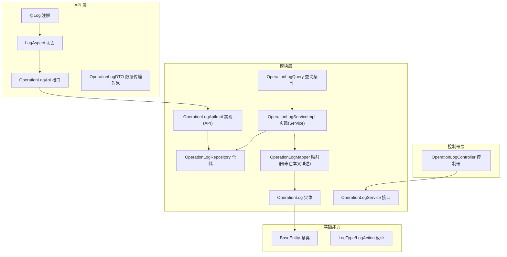
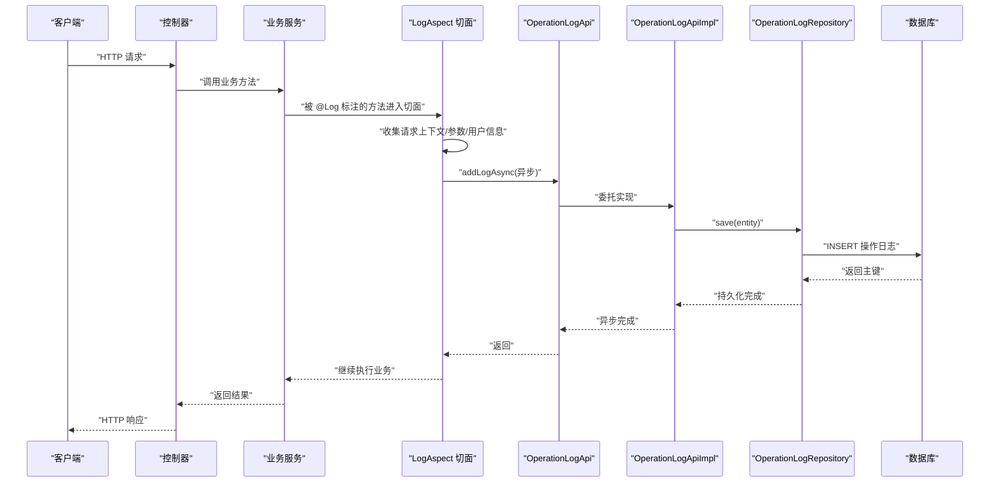
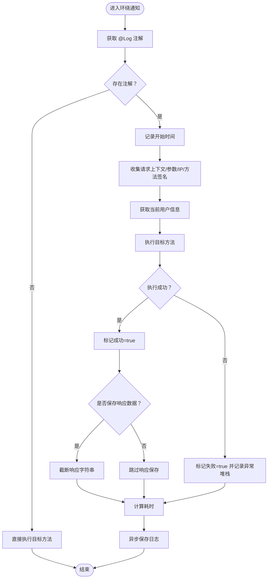
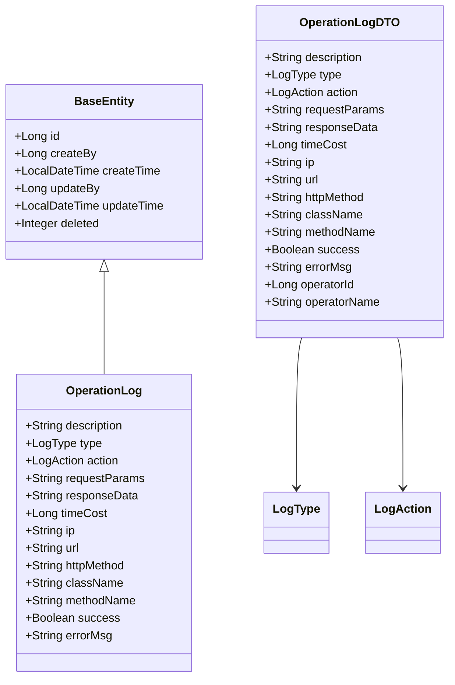
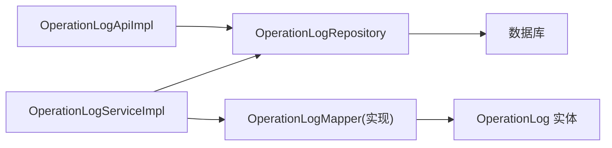
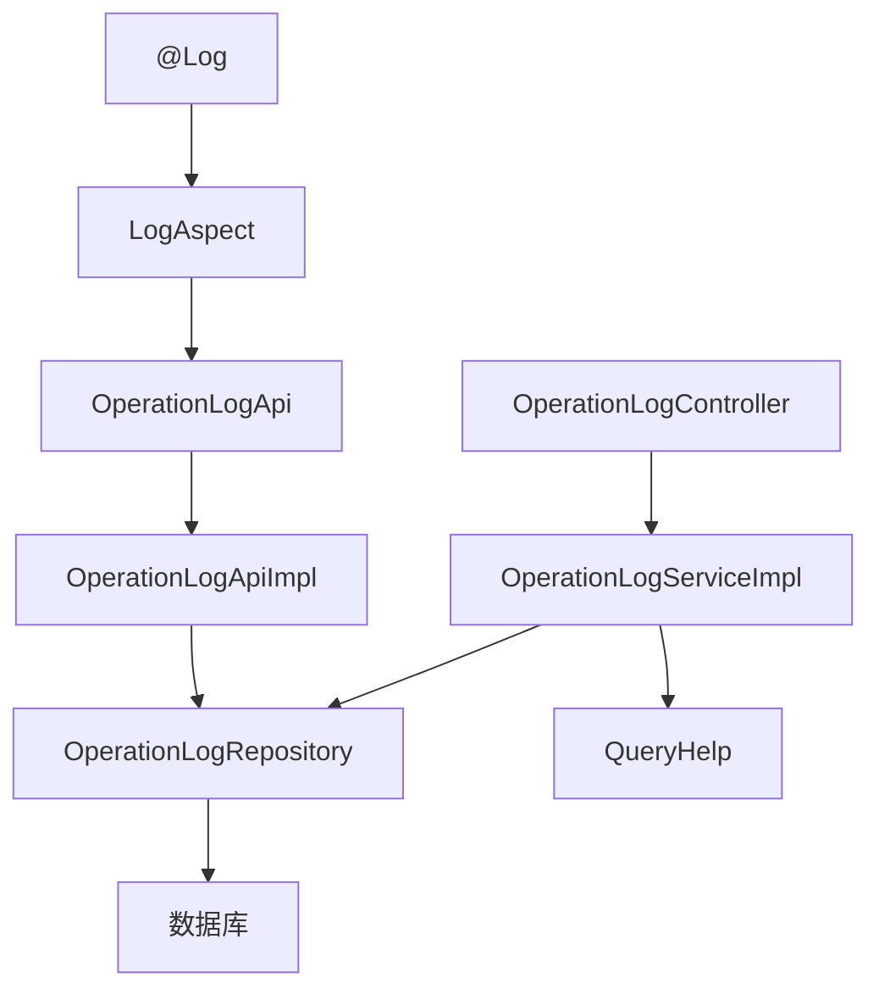
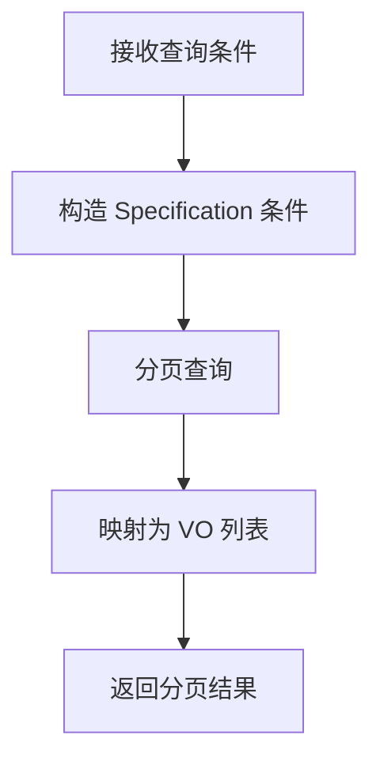

# 日志管理模块

<cite>
**本文引用的文件**
- [Log.java](file://logs-api/src/main/java/com/fastproject/logs/annotation/Log.java)
- [LogAspect.java](file://logs-api/src/main/java/com/fastproject/logs/aspect/LogAspect.java)
- [OperationLogApi.java](file://logs-api/src/main/java/com/fastproject/logs/api/OperationLogApi.java)
- [OperationLogDTO.java](file://logs-api/src/main/java/com/fastproject/logs/dto/OperationLogDTO.java)
- [LogAction.java](file://logs-api/src/main/java/com/fastproject/logs/enums/LogAction.java)
- [LogType.java](file://logs-api/src/main/java/com/fastproject/logs/enums/LogType.java)
- [OperationLog.java](file://logs-module/src/main/java/com/fastproject/logs/domain/OperationLog.java)
- [OperationLogRepository.java](file://logs-module/src/main/java/com/fastproject/logs/repository/OperationLogRepository.java)
- [OperationLogService.java](file://logs-module/src/main/java/com/fastproject/logs/service/OperationLogService.java)
- [OperationLogApiImpl.java](file://logs-module/src/main/java/com/fastproject/logs/service/impl/OperationLogApiImpl.java)
- [OperationLogServiceImpl.java](file://logs-module/src/main/java/com/fastproject/logs/service/impl/OperationLogServiceImpl.java)
- [OperationLogQuery.java](file://logs-module/src/main/java/com/fastproject/logs/vo/OperationLogQuery.java)
- [OperationLogController.java](file://run-admin/src/main/java/com/fastproject/module/logs/controller/OperationLogController.java)
- [BaseEntity.java](file://common/src/main/java/com/fastproject/db/BaseEntity.java)
</cite>

## 目录
1. [简介](#简介)
2. [项目结构](#项目结构)
3. [核心组件](#核心组件)
4. [架构总览](#架构总览)
5. [详细组件分析](#详细组件分析)
6. [依赖关系分析](#依赖关系分析)
7. [性能与异步处理](#性能与异步处理)
8. [查询与统计分析](#查询与统计分析)
9. [配置与运维](#配置与运维)
10. [故障排查指南](#故障排查指南)
11. [结论](#结论)

## 简介
本文件面向“日志管理模块”的技术文档，覆盖操作日志记录、查询统计与审计追踪的完整实现架构。重点包括：
- @Log 注解的使用方式与语义
- 日志切面的拦截机制与执行流程
- 日志数据的异步处理与持久化
- 日志查询的条件筛选、时间范围与关键字搜索
- 统计报表、趋势分析与性能监控指标
- 日志配置的级别、过滤规则与存储策略
- 清理、归档与备份的自动化方案建议

## 项目结构
日志模块采用“API 层 + 模块层 + 控制器层”的分层设计，结合 AOP 切面自动采集操作日志，并通过异步线程池落库，保证对业务主流程的低侵入性与高性能。

图表来源
- [Log.java](file://logs-api/src/main/java/com/fastproject/logs/annotation/Log.java#L1-L46)
- [LogAspect.java](file://logs-api/src/main/java/com/fastproject/logs/aspect/LogAspect.java#L1-L242)
- [OperationLogApi.java](file://logs-api/src/main/java/com/fastproject/logs/api/OperationLogApi.java#L1-L25)
- [OperationLogDTO.java](file://logs-api/src/main/java/com/fastproject/logs/dto/OperationLogDTO.java#L1-L88)
- [OperationLog.java](file://logs-module/src/main/java/com/fastproject/logs/domain/OperationLog.java#L1-L93)
- [OperationLogRepository.java](file://logs-module/src/main/java/com/fastproject/logs/repository/OperationLogRepository.java#L1-L14)
- [OperationLogService.java](file://logs-module/src/main/java/com/fastproject/logs/service/OperationLogService.java#L1-L46)
- [OperationLogApiImpl.java](file://logs-module/src/main/java/com/fastproject/logs/service/impl/OperationLogApiImpl.java#L1-L70)
- [OperationLogServiceImpl.java](file://logs-module/src/main/java/com/fastproject/logs/service/impl/OperationLogServiceImpl.java#L1-L125)
- [OperationLogQuery.java](file://logs-module/src/main/java/com/fastproject/logs/vo/OperationLogQuery.java#L1-L63)
- [OperationLogController.java](file://run-admin/src/main/java/com/fastproject/module/logs/controller/OperationLogController.java#L1-L83)
- [BaseEntity.java](file://common/src/main/java/com/fastproject/db/BaseEntity.java#L1-L48)
- [LogType.java](file://logs-api/src/main/java/com/fastproject/logs/enums/LogType.java#L1-L33)
- [LogAction.java](file://logs-api/src/main/java/com/fastproject/logs/enums/LogAction.java#L1-L53)

章节来源
- [Log.java](file://logs-api/src/main/java/com/fastproject/logs/annotation/Log.java#L1-L46)
- [LogAspect.java](file://logs-api/src/main/java/com/fastproject/logs/aspect/LogAspect.java#L1-L242)
- [OperationLogApi.java](file://logs-api/src/main/java/com/fastproject/logs/api/OperationLogApi.java#L1-L25)
- [OperationLogDTO.java](file://logs-api/src/main/java/com/fastproject/logs/dto/OperationLogDTO.java#L1-L88)
- [OperationLog.java](file://logs-module/src/main/java/com/fastproject/logs/domain/OperationLog.java#L1-L93)
- [OperationLogRepository.java](file://logs-module/src/main/java/com/fastproject/logs/repository/OperationLogRepository.java#L1-L14)
- [OperationLogService.java](file://logs-module/src/main/java/com/fastproject/logs/service/OperationLogService.java#L1-L46)
- [OperationLogApiImpl.java](file://logs-module/src/main/java/com/fastproject/logs/service/impl/OperationLogApiImpl.java#L1-L70)
- [OperationLogServiceImpl.java](file://logs-module/src/main/java/com/fastproject/logs/service/impl/OperationLogServiceImpl.java#L1-L125)
- [OperationLogQuery.java](file://logs-module/src/main/java/com/fastproject/logs/vo/OperationLogQuery.java#L1-L63)
- [OperationLogController.java](file://run-admin/src/main/java/com/fastproject/module/logs/controller/OperationLogController.java#L1-L83)
- [BaseEntity.java](file://common/src/main/java/com/fastproject/db/BaseEntity.java#L1-L48)
- [LogType.java](file://logs-api/src/main/java/com/fastproject/logs/enums/LogType.java#L1-L33)
- [LogAction.java](file://logs-api/src/main/java/com/fastproject/logs/enums/LogAction.java#L1-L53)

## 核心组件
- 注解与切面
  - @Log：用于标注需要记录操作日志的方法，支持描述、类型、动作、是否保存请求/响应、是否记录耗时等细粒度控制。
  - LogAspect：定义切入点与环绕通知，统一采集请求上下文、用户信息、方法参数、异常堆栈、执行耗时，并异步写入数据库。
- API 与服务
  - OperationLogApi：对外暴露同步/异步写日志能力。
  - OperationLogApiImpl：实现同步与异步写入，异步基于线程池执行。
  - OperationLogService/Impl：提供 CRUD、分页查询、条件过滤等能力。
- 数据模型与查询
  - OperationLog 实体：持久化字段覆盖描述、类型、动作、请求/响应、耗时、IP、URL、方法签名、成功标记与错误信息等。
  - OperationLogQuery：支持按描述、类型、动作、IP、URL、成功与否、创建人、时间范围等条件查询。
- 控制器
  - OperationLogController：提供新增、修改、删除、批量删除、分页查询、详情查看等接口。

章节来源
- [Log.java](file://logs-api/src/main/java/com/fastproject/logs/annotation/Log.java#L1-L46)
- [LogAspect.java](file://logs-api/src/main/java/com/fastproject/logs/aspect/LogAspect.java#L1-L242)
- [OperationLogApi.java](file://logs-api/src/main/java/com/fastproject/logs/api/OperationLogApi.java#L1-L25)
- [OperationLogApiImpl.java](file://logs-module/src/main/java/com/fastproject/logs/service/impl/OperationLogApiImpl.java#L1-L70)
- [OperationLogService.java](file://logs-module/src/main/java/com/fastproject/logs/service/OperationLogService.java#L1-L46)
- [OperationLogServiceImpl.java](file://logs-module/src/main/java/com/fastproject/logs/service/impl/OperationLogServiceImpl.java#L1-L125)
- [OperationLog.java](file://logs-module/src/main/java/com/fastproject/logs/domain/OperationLog.java#L1-L93)
- [OperationLogQuery.java](file://logs-module/src/main/java/com/fastproject/logs/vo/OperationLogQuery.java#L1-L63)
- [OperationLogController.java](file://run-admin/src/main/java/com/fastproject/module/logs/controller/OperationLogController.java#L1-L83)

## 架构总览
下图展示从方法调用到日志落库的端到端流程，包括注解识别、切面拦截、DTO 构造、异步入库与查询统计。

图表来源
- [LogAspect.java](file://logs-api/src/main/java/com/fastproject/logs/aspect/LogAspect.java#L47-L119)
- [OperationLogApi.java](file://logs-api/src/main/java/com/fastproject/logs/api/OperationLogApi.java#L17-L24)
- [OperationLogApiImpl.java](file://logs-module/src/main/java/com/fastproject/logs/service/impl/OperationLogApiImpl.java#L38-L41)
- [OperationLogRepository.java](file://logs-module/src/main/java/com/fastproject/logs/repository/OperationLogRepository.java#L12-L13)

## 详细组件分析

### 注解与切面组件
- @Log 注解
  - 支持设置日志描述、类型、动作、是否保存请求参数/响应数据、是否记录耗时。
  - 默认值合理：请求参数默认保存，响应数据默认不保存以控制体量，耗时默认记录。
- LogAspect 切面
  - 切点：拦截带 @Log 的方法。
  - 环绕通知：捕获开始时间、请求信息、用户信息、方法签名；执行目标方法；异常时记录堆栈；最终计算耗时并异步写入。
  - 参数与异常处理：对参数进行截断与敏感信息过滤；异常堆栈同样截断，避免超长文本。
  - IP 解析：兼容多级代理头，取首个有效 IP。
  - 用户解析：通过 TokenUtils 获取当前用户，填充操作人 ID/名称。

图表来源
- [LogAspect.java](file://logs-api/src/main/java/com/fastproject/logs/aspect/LogAspect.java#L47-L119)
- [Log.java](file://logs-api/src/main/java/com/fastproject/logs/annotation/Log.java#L15-L46)

章节来源
- [Log.java](file://logs-api/src/main/java/com/fastproject/logs/annotation/Log.java#L1-L46)
- [LogAspect.java](file://logs-api/src/main/java/com/fastproject/logs/aspect/LogAspect.java#L1-L242)

### 数据模型与映射
- OperationLog 实体
  - 字段覆盖全面：描述、类型、动作、请求/响应、耗时、IP、URL、HTTP 方法、类名、方法名、成功标记、错误信息。
  - 使用枚举：LogType、LogAction。
  - 继承 BaseEntity：具备创建人、创建时间、更新人、更新时间、逻辑删除字段。
- DTO 与 VO
  - OperationLogDTO：跨模块传输载体，字段与实体一致。
  - OperationLogQuery：查询条件扩展，支持时间范围、关键字模糊匹配、布尔过滤等。
- Mapper（实现文件存在但本文不展开代码细节）

图表来源
- [OperationLog.java](file://logs-module/src/main/java/com/fastproject/logs/domain/OperationLog.java#L1-L93)
- [BaseEntity.java](file://common/src/main/java/com/fastproject/db/BaseEntity.java#L1-L48)
- [OperationLogDTO.java](file://logs-api/src/main/java/com/fastproject/logs/dto/OperationLogDTO.java#L1-L88)
- [LogType.java](file://logs-api/src/main/java/com/fastproject/logs/enums/LogType.java#L1-L33)
- [LogAction.java](file://logs-api/src/main/java/com/fastproject/logs/enums/LogAction.java#L1-L53)

章节来源
- [OperationLog.java](file://logs-module/src/main/java/com/fastproject/logs/domain/OperationLog.java#L1-L93)
- [OperationLogDTO.java](file://logs-api/src/main/java/com/fastproject/logs/dto/OperationLogDTO.java#L1-L88)
- [BaseEntity.java](file://common/src/main/java/com/fastproject/db/BaseEntity.java#L1-L48)
- [LogType.java](file://logs-api/src/main/java/com/fastproject/logs/enums/LogType.java#L1-L33)
- [LogAction.java](file://logs-api/src/main/java/com/fastproject/logs/enums/LogAction.java#L1-L53)

### 服务与仓储
- OperationLogApiImpl
  - 提供同步 addLog 与异步 addLogAsync；异步通过线程池执行，避免阻塞主业务。
- OperationLogServiceImpl
  - 基于 JPA Specification 动态拼接查询条件，支持描述、类型、动作、IP、URL、成功与否、创建人、时间范围等。
  - 分页排序按 id 倒序，便于审计回溯。
- OperationLogRepository
  - 继承 JpaRepository 与 JpaSpecificationExecutor，提供基础 CRUD 与复杂查询能力。

图表来源
- [OperationLogServiceImpl.java](file://logs-module/src/main/java/com/fastproject/logs/service/impl/OperationLogServiceImpl.java#L82-L123)
- [OperationLogRepository.java](file://logs-module/src/main/java/com/fastproject/logs/repository/OperationLogRepository.java#L12-L13)
- [OperationLogApiImpl.java](file://logs-module/src/main/java/com/fastproject/logs/service/impl/OperationLogApiImpl.java#L24-L41)

章节来源
- [OperationLogApiImpl.java](file://logs-module/src/main/java/com/fastproject/logs/service/impl/OperationLogApiImpl.java#L1-L70)
- [OperationLogServiceImpl.java](file://logs-module/src/main/java/com/fastproject/logs/service/impl/OperationLogServiceImpl.java#L1-L125)
- [OperationLogRepository.java](file://logs-module/src/main/java/com/fastproject/logs/repository/OperationLogRepository.java#L1-L14)

### 控制器与权限
- OperationLogController
  - 提供新增、修改、删除、批量删除、分页查询、详情查看接口。
  - 使用 Spring Security 注解鉴权，确保后台管理操作的安全性。

章节来源
- [OperationLogController.java](file://run-admin/src/main/java/com/fastproject/module/logs/controller/OperationLogController.java#L1-L83)

## 依赖关系分析
- 注解与切面
  - @Log 作用于方法级别；LogAspect 通过注解反射获取元数据，构建 OperationLogDTO。
- 切面与 API
  - LogAspect 依赖 OperationLogApi.addLogAsync；实现位于 OperationLogApiImpl。
- 服务与仓储
  - OperationLogServiceImpl 依赖 Repository 与 QueryHelp 完成动态查询；Mapper 负责实体与 VO 的转换。
- 控制器与服务
  - Controller 直接依赖 Service 接口，实现前后台分离与职责清晰。

图表来源
- [Log.java](file://logs-api/src/main/java/com/fastproject/logs/annotation/Log.java#L1-L46)
- [LogAspect.java](file://logs-api/src/main/java/com/fastproject/logs/aspect/LogAspect.java#L34-L42)
- [OperationLogApi.java](file://logs-api/src/main/java/com/fastproject/logs/api/OperationLogApi.java#L1-L25)
- [OperationLogApiImpl.java](file://logs-module/src/main/java/com/fastproject/logs/service/impl/OperationLogApiImpl.java#L1-L70)
- [OperationLogServiceImpl.java](file://logs-module/src/main/java/com/fastproject/logs/service/impl/OperationLogServiceImpl.java#L1-L125)
- [OperationLogController.java](file://run-admin/src/main/java/com/fastproject/module/logs/controller/OperationLogController.java#L1-L83)

## 性能与异步处理
- 异步写入
  - LogAspect 在 finally 中调用异步方法，避免阻塞主业务线程。
  - OperationLogApiImpl.addLogAsync 使用线程池执行，提高吞吐。
- 参数与响应截断
  - 对请求参数与异常堆栈进行长度限制，防止超大数据写入数据库。
- 耗时统计
  - 默认开启执行时间统计，便于性能监控与慢查询定位。
- 事务与幂等
  - 写入操作无事务需求，读取使用分页与条件过滤，避免全表扫描。

章节来源
- [LogAspect.java](file://logs-api/src/main/java/com/fastproject/logs/aspect/LogAspect.java#L108-L116)
- [OperationLogApiImpl.java](file://logs-module/src/main/java/com/fastproject/logs/service/impl/OperationLogApiImpl.java#L38-L41)
- [OperationLogDTO.java](file://logs-api/src/main/java/com/fastproject/logs/dto/OperationLogDTO.java#L35-L41)

## 查询与统计分析
- 查询条件
  - 关键字：描述、IP、URL 支持模糊匹配。
  - 枚举：类型、动作精确匹配。
  - 布尔：成功与否。
  - 时间范围：起止时间精确到秒。
  - 其他：创建人。
- 分页与排序
  - 默认按 id 倒序，便于审计与回溯。
- 统计与报表
  - 可基于查询结果进行聚合统计（例如按类型/动作/日期分布），生成趋势图与报表。
  - 性能监控指标可基于 timeCost 字段进行统计分析。

图表来源
- [OperationLogServiceImpl.java](file://logs-module/src/main/java/com/fastproject/logs/service/impl/OperationLogServiceImpl.java#L82-L123)
- [OperationLogQuery.java](file://logs-module/src/main/java/com/fastproject/logs/vo/OperationLogQuery.java#L16-L62)

章节来源
- [OperationLogServiceImpl.java](file://logs-module/src/main/java/com/fastproject/logs/service/impl/OperationLogServiceImpl.java#L82-L123)
- [OperationLogQuery.java](file://logs-module/src/main/java/com/fastproject/logs/vo/OperationLogQuery.java#L1-L63)

## 配置与运维
- 日志级别与过滤
  - 切面内部使用 SLF4J 输出调试/错误日志，便于问题定位。
  - 建议在生产环境将切面日志级别调整为 INFO 或更高，避免过多调试输出。
- 过滤规则
  - 请求参数与异常堆栈默认截断；可按需调整阈值。
  - 响应数据默认不保存，避免大对象写库。
- 存储策略
  - 建议对高频操作日志建立索引：create_time、type、action、success、create_by。
  - 对超长字段（描述、请求/响应、错误信息）使用 TEXT 类型，注意数据库大小限制。
- 清理、归档与备份
  - 清理：定期清理历史日志（如超过 90 天），保留必要审计数据。
  - 归档：将历史日志导出至离线存储或冷数据平台。
  - 备份：数据库层面定期备份，确保可恢复性。

章节来源
- [LogAspect.java](file://logs-api/src/main/java/com/fastproject/logs/aspect/LogAspect.java#L222-L240)
- [OperationLog.java](file://logs-module/src/main/java/com/fastproject/logs/domain/OperationLog.java#L26-L92)

## 故障排查指南
- 切面未生效
  - 确认方法被 @Log 标注且处于可被 AOP 代理的上下文中。
  - 检查 Spring AOP 代理配置与组件扫描路径。
- 异步写入失败
  - 查看线程池配置与队列容量；检查日志输出确认异步执行。
  - 若出现异常，切面会记录堆栈，可据此定位。
- 查询结果为空
  - 检查查询条件是否正确（如时间范围、关键字是否匹配）。
  - 确认数据库中是否存在对应记录。
- 性能问题
  - 关注 timeCost 字段，结合慢查询日志定位热点接口。
  - 调整参数截断阈值与响应数据保存策略。

章节来源
- [LogAspect.java](file://logs-api/src/main/java/com/fastproject/logs/aspect/LogAspect.java#L124-L128)
- [OperationLogApiImpl.java](file://logs-module/src/main/java/com/fastproject/logs/service/impl/OperationLogApiImpl.java#L31-L34)

## 结论
该日志管理模块通过注解驱动与切面拦截实现了对业务操作的无侵入式记录，结合异步写入与完善的查询条件，满足日常审计与性能监控需求。配合合理的存储策略与自动化清理/归档/备份方案，可在保证系统性能的同时满足合规与审计要求。