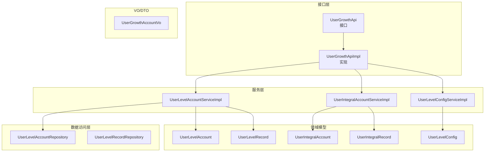
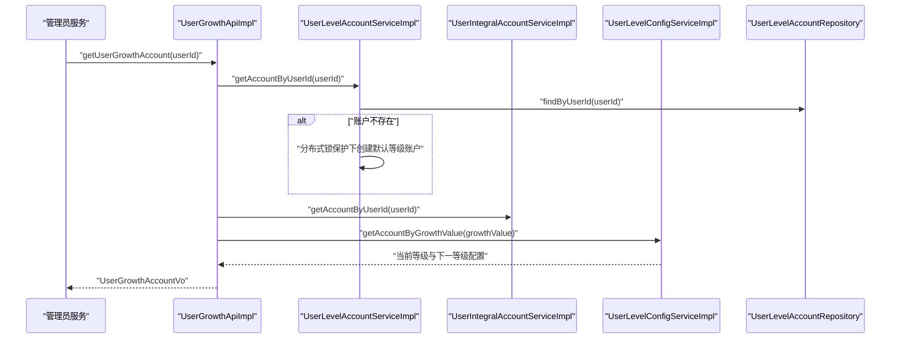
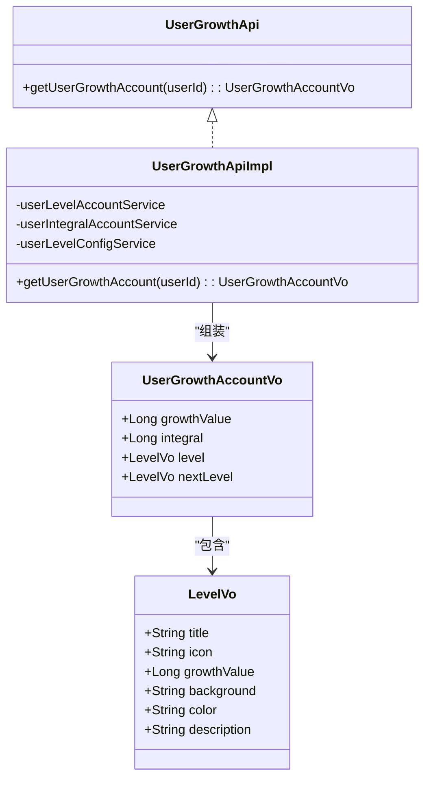
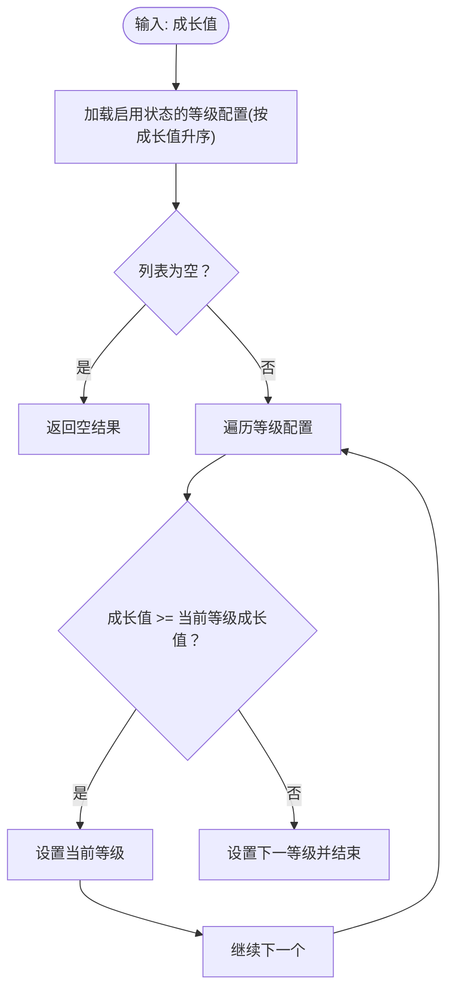
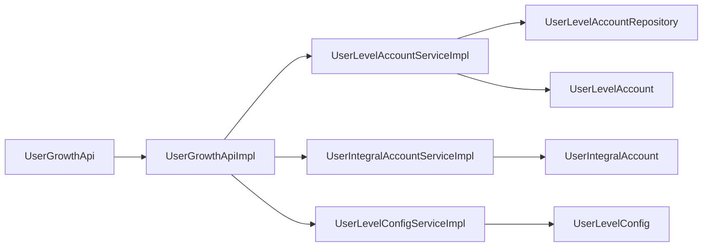

# 用户成长模块

<cite>
**本文引用的文件**
- [user-growth-api/src/main/java/com/fastproject/usergrowth/api/UserGrowthApi.java](file://user-growth-api/src/main/java/com/fastproject/usergrowth/api/UserGrowthApi.java)
- [user-growth-module/src/main/java/com/fastproject/usergrowth/api/UserGrowthApiImpl.java](file://user-growth-module/src/main/java/com/fastproject/usergrowth/api/UserGrowthApiImpl.java)
- [user-growth-api/src/main/java/com/fastproject/usergrowth/vo/UserGrowthAccountVo.java](file://user-growth-api/src/main/java/com/fastproject/usergrowth/vo/UserGrowthAccountVo.java)
- [user-growth-module/src/main/java/com/fastproject/usergrowth/domain/UserLevelAccount.java](file://user-growth-module/src/main/java/com/fastproject/usergrowth/domain/UserLevelAccount.java)
- [user-growth-module/src/main/java/com/fastproject/usergrowth/domain/UserIntegralAccount.java](file://user-growth-module/src/main/java/com/fastproject/usergrowth/domain/UserIntegralAccount.java)
- [user-growth-module/src/main/java/com/fastproject/usergrowth/domain/UserLevelConfig.java](file://user-growth-module/src/main/java/com/fastproject/usergrowth/domain/UserLevelConfig.java)
- [user-growth-module/src/main/java/com/fastproject/usergrowth/domain/UserIntegralRecord.java](file://user-growth-module/src/main/java/com/fastproject/usergrowth/domain/UserIntegralRecord.java)
- [user-growth-module/src/main/java/com/fastproject/usergrowth/domain/UserLevelRecord.java](file://user-growth-module/src/main/java/com/fastproject/usergrowth/domain/UserLevelRecord.java)
- [user-growth-module/src/main/java/com/fastproject/usergrowth/service/impl/UserLevelAccountServiceImpl.java](file://user-growth-module/src/main/java/com/fastproject/usergrowth/service/impl/UserLevelAccountServiceImpl.java)
- [user-growth-module/src/main/java/com/fastproject/usergrowth/service/impl/UserIntegralAccountServiceImpl.java](file://user-growth-module/src/main/java/com/fastproject/usergrowth/service/impl/UserIntegralAccountServiceImpl.java)
- [user-growth-module/src/main/java/com/fastproject/usergrowth/service/impl/UserLevelConfigServiceImpl.java](file://user-growth-module/src/main/java/com/fastproject/usergrowth/service/impl/UserLevelConfigServiceImpl.java)
- [user-growth-module/src/main/java/com/fastproject/usergrowth/repository/db/UserLevelAccountRepository.java](file://user-growth-module/src/main/java/com/fastproject/usergrowth/repository/db/UserLevelAccountRepository.java)
- [user-growth-module/src/main/java/com/fastproject/usergrowth/repository/db/UserLevelRecordRepository.java](file://user-growth-module/src/main/java/com/fastproject/usergrowth/repository/db/UserLevelRecordRepository.java)
- [user-growth-module/src/main/java/com/fastproject/usergrowth/mapper/UserLevelConfigMapper.java](file://user-growth-module/src/main/java/com/fastproject/usergrowth/mapper/UserLevelConfigMapper.java)
- [run-admin/src/main/java/com/fastproject/module/system/service/impl/AdminProfileServiceImpl.java](file://run-admin/src/main/java/com/fastproject/module/system/service/impl/AdminProfileServiceImpl.java)
</cite>

## 目录
1. [简介](#简介)
2. [项目结构](#项目结构)
3. [核心组件](#核心组件)
4. [架构总览](#架构总览)
5. [详细组件分析](#详细组件分析)
6. [依赖关系分析](#依赖关系分析)
7. [性能与并发特性](#性能与并发特性)
8. [配置与规则管理](#配置与规则管理)
9. [统计与监控](#统计与监控)
10. [故障排查指南](#故障排查指南)
11. [结论](#结论)

## 简介
本文件面向“用户成长模块”的技术实现，围绕积分系统、等级体系与权益管理展开，系统性梳理以下能力：
- 积分获取与消费的配置化规则、实时余额更新与流水记录
- 等级升级条件、等级特权与升级提醒机制
- 等级配置的动态调整、等级记录的历史追踪
- 权益发放的自动化流程（通过头像/头像框等个性化资源）
- 统计分析、活跃度监控与留存评估的扩展建议
- 系统的可扩展性与个性化定制方案

## 项目结构
用户成长模块采用典型的分层架构：
- 接口层：对外暴露用户成长数据聚合接口
- 服务层：封装账户、等级配置、记录等业务逻辑
- 数据访问层：基于Spring Data JPA的Repository
- 领域模型：用户等级账户、积分账户、等级配置、流水记录
- VO/DTO：用于接口返回与跨模块传输

图表来源
- [user-growth-api/src/main/java/com/fastproject/usergrowth/api/UserGrowthApi.java](file://user-growth-api/src/main/java/com/fastproject/usergrowth/api/UserGrowthApi.java#L1-L13)
- [user-growth-module/src/main/java/com/fastproject/usergrowth/api/UserGrowthApiImpl.java](file://user-growth-module/src/main/java/com/fastproject/usergrowth/api/UserGrowthApiImpl.java#L1-L30)
- [user-growth-module/src/main/java/com/fastproject/usergrowth/service/impl/UserLevelAccountServiceImpl.java](file://user-growth-module/src/main/java/com/fastproject/usergrowth/service/impl/UserLevelAccountServiceImpl.java#L1-L216)
- [user-growth-module/src/main/java/com/fastproject/usergrowth/service/impl/UserIntegralAccountServiceImpl.java](file://user-growth-module/src/main/java/com/fastproject/usergrowth/service/impl/UserIntegralAccountServiceImpl.java#L1-L149)
- [user-growth-module/src/main/java/com/fastproject/usergrowth/service/impl/UserLevelConfigServiceImpl.java](file://user-growth-module/src/main/java/com/fastproject/usergrowth/service/impl/UserLevelConfigServiceImpl.java#L1-L138)
- [user-growth-module/src/main/java/com/fastproject/usergrowth/repository/db/UserLevelAccountRepository.java](file://user-growth-module/src/main/java/com/fastproject/usergrowth/repository/db/UserLevelAccountRepository.java#L1-L12)
- [user-growth-module/src/main/java/com/fastproject/usergrowth/repository/db/UserLevelRecordRepository.java](file://user-growth-module/src/main/java/com/fastproject/usergrowth/repository/db/UserLevelRecordRepository.java#L1-L10)
- [user-growth-module/src/main/java/com/fastproject/usergrowth/domain/UserLevelAccount.java](file://user-growth-module/src/main/java/com/fastproject/usergrowth/domain/UserLevelAccount.java#L1-L45)
- [user-growth-module/src/main/java/com/fastproject/usergrowth/domain/UserIntegralAccount.java](file://user-growth-module/src/main/java/com/fastproject/usergrowth/domain/UserIntegralAccount.java#L1-L34)
- [user-growth-module/src/main/java/com/fastproject/usergrowth/domain/UserLevelConfig.java](file://user-growth-module/src/main/java/com/fastproject/usergrowth/domain/UserLevelConfig.java#L1-L57)
- [user-growth-module/src/main/java/com/fastproject/usergrowth/domain/UserIntegralRecord.java](file://user-growth-module/src/main/java/com/fastproject/usergrowth/domain/UserIntegralRecord.java#L1-L70)
- [user-growth-module/src/main/java/com/fastproject/usergrowth/domain/UserLevelRecord.java](file://user-growth-module/src/main/java/com/fastproject/usergrowth/domain/UserLevelRecord.java#L1-L71)
- [user-growth-api/src/main/java/com/fastproject/usergrowth/vo/UserGrowthAccountVo.java](file://user-growth-api/src/main/java/com/fastproject/usergrowth/vo/UserGrowthAccountVo.java#L1-L70)

章节来源
- [user-growth-api/src/main/java/com/fastproject/usergrowth/api/UserGrowthApi.java](file://user-growth-api/src/main/java/com/fastproject/usergrowth/api/UserGrowthApi.java#L1-L13)
- [user-growth-module/src/main/java/com/fastproject/usergrowth/api/UserGrowthApiImpl.java](file://user-growth-module/src/main/java/com/fastproject/usergrowth/api/UserGrowthApiImpl.java#L1-L30)
- [user-growth-api/src/main/java/com/fastproject/usergrowth/vo/UserGrowthAccountVo.java](file://user-growth-api/src/main/java/com/fastproject/usergrowth/vo/UserGrowthAccountVo.java#L1-L70)

## 核心组件
- 用户成长聚合接口：统一返回成长值、积分、当前等级与下一等级信息
- 等级账户服务：负责等级账户的创建、查询与分布式锁保护
- 积分账户服务：负责积分账户的创建、查询与分布式锁保护
- 等级配置服务：负责等级配置的增删改查与按成长值匹配等级
- 记录服务：沉淀积分与等级变更流水，支持分页查询
- VO/DTO：标准化对外输出与跨模块传输

章节来源
- [user-growth-api/src/main/java/com/fastproject/usergrowth/api/UserGrowthApi.java](file://user-growth-api/src/main/java/com/fastproject/usergrowth/api/UserGrowthApi.java#L1-L13)
- [user-growth-module/src/main/java/com/fastproject/usergrowth/api/UserGrowthApiImpl.java](file://user-growth-module/src/main/java/com/fastproject/usergrowth/api/UserGrowthApiImpl.java#L1-L30)
- [user-growth-module/src/main/java/com/fastproject/usergrowth/service/impl/UserLevelAccountServiceImpl.java](file://user-growth-module/src/main/java/com/fastproject/usergrowth/service/impl/UserLevelAccountServiceImpl.java#L1-L216)
- [user-growth-module/src/main/java/com/fastproject/usergrowth/service/impl/UserIntegralAccountServiceImpl.java](file://user-growth-module/src/main/java/com/fastproject/usergrowth/service/impl/UserIntegralAccountServiceImpl.java#L1-L149)
- [user-growth-module/src/main/java/com/fastproject/usergrowth/service/impl/UserLevelConfigServiceImpl.java](file://user-growth-module/src/main/java/com/fastproject/usergrowth/service/impl/UserLevelConfigServiceImpl.java#L1-L138)
- [user-growth-module/src/main/java/com/fastproject/usergrowth/domain/UserIntegralRecord.java](file://user-growth-module/src/main/java/com/fastproject/usergrowth/domain/UserIntegralRecord.java#L1-L70)
- [user-growth-module/src/main/java/com/fastproject/usergrowth/domain/UserLevelRecord.java](file://user-growth-module/src/main/java/com/fastproject/usergrowth/domain/UserLevelRecord.java#L1-L71)

## 架构总览
用户成长模块通过接口层聚合等级账户、积分账户与等级配置，形成统一的用户成长视图；服务层对账户进行懒创建与并发保护，记录层沉淀所有变更轨迹。

图表来源
- [user-growth-module/src/main/java/com/fastproject/usergrowth/api/UserGrowthApiImpl.java](file://user-growth-module/src/main/java/com/fastproject/usergrowth/api/UserGrowthApiImpl.java#L1-L30)
- [user-growth-module/src/main/java/com/fastproject/usergrowth/service/impl/UserLevelAccountServiceImpl.java](file://user-growth-module/src/main/java/com/fastproject/usergrowth/service/impl/UserLevelAccountServiceImpl.java#L118-L167)
- [user-growth-module/src/main/java/com/fastproject/usergrowth/service/impl/UserIntegralAccountServiceImpl.java](file://user-growth-module/src/main/java/com/fastproject/usergrowth/service/impl/UserIntegralAccountServiceImpl.java#L99-L147)
- [user-growth-module/src/main/java/com/fastproject/usergrowth/service/impl/UserLevelConfigServiceImpl.java](file://user-growth-module/src/main/java/com/fastproject/usergrowth/service/impl/UserLevelConfigServiceImpl.java#L113-L136)
- [user-growth-module/src/main/java/com/fastproject/usergrowth/repository/db/UserLevelAccountRepository.java](file://user-growth-module/src/main/java/com/fastproject/usergrowth/repository/db/UserLevelAccountRepository.java#L1-L12)

## 详细组件分析

### 用户成长聚合接口与VO
- 接口职责：对外提供统一的成长数据查询入口
- 返回对象：包含成长值、积分、当前等级与下一等级的可视化属性（标题、图标、背景、颜色、描述）

图表来源
- [user-growth-api/src/main/java/com/fastproject/usergrowth/api/UserGrowthApi.java](file://user-growth-api/src/main/java/com/fastproject/usergrowth/api/UserGrowthApi.java#L1-L13)
- [user-growth-module/src/main/java/com/fastproject/usergrowth/api/UserGrowthApiImpl.java](file://user-growth-module/src/main/java/com/fastproject/usergrowth/api/UserGrowthApiImpl.java#L1-L30)
- [user-growth-api/src/main/java/com/fastproject/usergrowth/vo/UserGrowthAccountVo.java](file://user-growth-api/src/main/java/com/fastproject/usergrowth/vo/UserGrowthAccountVo.java#L1-L70)

章节来源
- [user-growth-api/src/main/java/com/fastproject/usergrowth/api/UserGrowthApi.java](file://user-growth-api/src/main/java/com/fastproject/usergrowth/api/UserGrowthApi.java#L1-L13)
- [user-growth-module/src/main/java/com/fastproject/usergrowth/api/UserGrowthApiImpl.java](file://user-growth-module/src/main/java/com/fastproject/usergrowth/api/UserGrowthApiImpl.java#L1-L30)
- [user-growth-api/src/main/java/com/fastproject/usergrowth/vo/UserGrowthAccountVo.java](file://user-growth-api/src/main/java/com/fastproject/usergrowth/vo/UserGrowthAccountVo.java#L1-L70)

### 等级账户与账户懒创建（含分布式锁）
- 功能要点：
  - 按用户ID查询等级账户，若不存在则在分布式锁保护下创建默认等级账户（初始成长值为0）
  - 支持头像与头像框的文件ID到URL映射装配
- 并发控制：使用Redis分布式锁避免同一用户并发创建重复账户

```mermaid
flowchart TD
Start(["开始"]) --> Find["按userId查询等级账户"]
Find --> Exists{"是否存在？"}
Exists --> |是| Return["返回账户VO"]
Exists --> |否| Lock["生成锁键并尝试获取分布式锁"]
Lock --> Got{"获取成功？"}
Got --> |否| Retry["等待并重试或直接查询"] --> Find
Got --> |是| DoubleCheck["二次检查是否已存在"]
DoubleCheck --> Exists2{"仍不存在？"}
Exists2 --> |否| Return2["返回账户VO"]
Exists2 --> |是| Create["创建默认等级账户(成长值=0)"]
Create --> Unlock["释放分布式锁"]
Unlock --> Return3["返回账户VO"]
```

图表来源
- [user-growth-module/src/main/java/com/fastproject/usergrowth/service/impl/UserLevelAccountServiceImpl.java](file://user-growth-module/src/main/java/com/fastproject/usergrowth/service/impl/UserLevelAccountServiceImpl.java#L118-L167)

章节来源
- [user-growth-module/src/main/java/com/fastproject/usergrowth/service/impl/UserLevelAccountServiceImpl.java](file://user-growth-module/src/main/java/com/fastproject/usergrowth/service/impl/UserLevelAccountServiceImpl.java#L1-L216)
- [user-growth-module/src/main/java/com/fastproject/usergrowth/repository/db/UserLevelAccountRepository.java](file://user-growth-module/src/main/java/com/fastproject/usergrowth/repository/db/UserLevelAccountRepository.java#L1-L12)

### 积分账户与账户懒创建
- 功能要点：
  - 按用户ID查询积分账户，若不存在则在分布式锁保护下创建默认积分账户（初始积分为0）
- 并发控制：同等级账户的分布式锁策略一致

章节来源
- [user-growth-module/src/main/java/com/fastproject/usergrowth/service/impl/UserIntegralAccountServiceImpl.java](file://user-growth-module/src/main/java/com/fastproject/usergrowth/service/impl/UserIntegralAccountServiceImpl.java#L1-L149)

### 等级配置与等级匹配
- 功能要点：
  - 等级配置按成长值升序排列，按给定成长值匹配当前等级与下一等级
  - 支持分页查询与多字段过滤
  - 文本内容经XSS清理后入库

图表来源
- [user-growth-module/src/main/java/com/fastproject/usergrowth/service/impl/UserLevelConfigServiceImpl.java](file://user-growth-module/src/main/java/com/fastproject/usergrowth/service/impl/UserLevelConfigServiceImpl.java#L113-L136)

章节来源
- [user-growth-module/src/main/java/com/fastproject/usergrowth/service/impl/UserLevelConfigServiceImpl.java](file://user-growth-module/src/main/java/com/fastproject/usergrowth/service/impl/UserLevelConfigServiceImpl.java#L1-L138)
- [user-growth-module/src/main/java/com/fastproject/usergrowth/mapper/UserLevelConfigMapper.java](file://user-growth-module/src/main/java/com/fastproject/usergrowth/mapper/UserLevelConfigMapper.java#L1-L28)

### 流水记录与变更历史
- 积分流水：记录交易前后积分、变更值、业务标识与描述
- 等级流水：记录交易前后成长值、变更值、业务标识与描述
- 查询能力：支持按用户ID、状态、业务类型等维度分页查询

章节来源
- [user-growth-module/src/main/java/com/fastproject/usergrowth/domain/UserIntegralRecord.java](file://user-growth-module/src/main/java/com/fastproject/usergrowth/domain/UserIntegralRecord.java#L1-L70)
- [user-growth-module/src/main/java/com/fastproject/usergrowth/domain/UserLevelRecord.java](file://user-growth-module/src/main/java/com/fastproject/usergrowth/domain/UserLevelRecord.java#L1-L71)
- [user-growth-module/src/main/java/com/fastproject/usergrowth/repository/db/UserLevelRecordRepository.java](file://user-growth-module/src/main/java/com/fastproject/usergrowth/repository/db/UserLevelRecordRepository.java#L1-L10)

### 权益管理与个性化
- 个性化资源：等级账户支持头像与头像框字段，服务层会将文件ID映射为可访问URL
- 权益发放：可通过更新等级账户的头像/头像框字段实现权益发放，后续由文件系统统一解析

章节来源
- [user-growth-module/src/main/java/com/fastproject/usergrowth/domain/UserLevelAccount.java](file://user-growth-module/src/main/java/com/fastproject/usergrowth/domain/UserLevelAccount.java#L1-L45)
- [user-growth-module/src/main/java/com/fastproject/usergrowth/service/impl/UserLevelAccountServiceImpl.java](file://user-growth-module/src/main/java/com/fastproject/usergrowth/service/impl/UserLevelAccountServiceImpl.java#L174-L214)

## 依赖关系分析
- 接口与实现：UserGrowthApi定义对外能力，UserGrowthApiImpl组合三个子服务完成聚合
- 服务与仓储：各服务通过Repository访问数据库，遵循JPA规范
- 并发与外部依赖：服务层使用Redis分布式锁保证幂等创建；文件URL映射依赖文件服务

图表来源
- [user-growth-api/src/main/java/com/fastproject/usergrowth/api/UserGrowthApi.java](file://user-growth-api/src/main/java/com/fastproject/usergrowth/api/UserGrowthApi.java#L1-L13)
- [user-growth-module/src/main/java/com/fastproject/usergrowth/api/UserGrowthApiImpl.java](file://user-growth-module/src/main/java/com/fastproject/usergrowth/api/UserGrowthApiImpl.java#L1-L30)
- [user-growth-module/src/main/java/com/fastproject/usergrowth/service/impl/UserLevelAccountServiceImpl.java](file://user-growth-module/src/main/java/com/fastproject/usergrowth/service/impl/UserLevelAccountServiceImpl.java#L1-L216)
- [user-growth-module/src/main/java/com/fastproject/usergrowth/service/impl/UserIntegralAccountServiceImpl.java](file://user-growth-module/src/main/java/com/fastproject/usergrowth/service/impl/UserIntegralAccountServiceImpl.java#L1-L149)
- [user-growth-module/src/main/java/com/fastproject/usergrowth/service/impl/UserLevelConfigServiceImpl.java](file://user-growth-module/src/main/java/com/fastproject/usergrowth/service/impl/UserLevelConfigServiceImpl.java#L1-L138)
- [user-growth-module/src/main/java/com/fastproject/usergrowth/repository/db/UserLevelAccountRepository.java](file://user-growth-module/src/main/java/com/fastproject/usergrowth/repository/db/UserLevelAccountRepository.java#L1-L12)
- [user-growth-module/src/main/java/com/fastproject/usergrowth/domain/UserLevelAccount.java](file://user-growth-module/src/main/java/com/fastproject/usergrowth/domain/UserLevelAccount.java#L1-L45)
- [user-growth-module/src/main/java/com/fastproject/usergrowth/domain/UserIntegralAccount.java](file://user-growth-module/src/main/java/com/fastproject/usergrowth/domain/UserIntegralAccount.java#L1-L34)
- [user-growth-module/src/main/java/com/fastproject/usergrowth/domain/UserLevelConfig.java](file://user-growth-module/src/main/java/com/fastproject/usergrowth/domain/UserLevelConfig.java#L1-L57)

章节来源
- [run-admin/src/main/java/com/fastproject/module/system/service/impl/AdminProfileServiceImpl.java](file://run-admin/src/main/java/com/fastproject/module/system/service/impl/AdminProfileServiceImpl.java#L1-L23)

## 性能与并发特性
- 懒创建与分布式锁：避免重复创建与并发冲突，提升初始化稳定性
- 分页查询：基于JPA Specification与Pageable，支持多字段过滤，适合大数据量场景
- 文件URL映射批量化：对多个文件ID进行一次请求映射，减少网络往返

章节来源
- [user-growth-module/src/main/java/com/fastproject/usergrowth/service/impl/UserLevelAccountServiceImpl.java](file://user-growth-module/src/main/java/com/fastproject/usergrowth/service/impl/UserLevelAccountServiceImpl.java#L118-L167)
- [user-growth-module/src/main/java/com/fastproject/usergrowth/service/impl/UserIntegralAccountServiceImpl.java](file://user-growth-module/src/main/java/com/fastproject/usergrowth/service/impl/UserIntegralAccountServiceImpl.java#L99-L147)
- [user-growth-module/src/main/java/com/fastproject/usergrowth/service/impl/UserLevelConfigServiceImpl.java](file://user-growth-module/src/main/java/com/fastproject/usergrowth/service/impl/UserLevelConfigServiceImpl.java#L77-L111)

## 配置与规则管理
- 等级配置：按成长值升序排列，自动匹配当前与下一等级
- 规则存储：等级配置表包含标题、图标、背景、颜色、描述与状态
- 安全处理：描述字段经XSS清理后入库
- 动态调整：支持分页查询与多字段过滤，便于后台管理与灰度发布

章节来源
- [user-growth-module/src/main/java/com/fastproject/usergrowth/domain/UserLevelConfig.java](file://user-growth-module/src/main/java/com/fastproject/usergrowth/domain/UserLevelConfig.java#L1-L57)
- [user-growth-module/src/main/java/com/fastproject/usergrowth/service/impl/UserLevelConfigServiceImpl.java](file://user-growth-module/src/main/java/com/fastproject/usergrowth/service/impl/UserLevelConfigServiceImpl.java#L113-L136)
- [user-growth-module/src/main/java/com/fastproject/usergrowth/mapper/UserLevelConfigMapper.java](file://user-growth-module/src/main/java/com/fastproject/usergrowth/mapper/UserLevelConfigMapper.java#L1-L28)

## 统计与监控
- 建议指标：
  - 成长值分布与等级转化率
  - 积分获取与消耗趋势
  - 活跃用户与等级晋升人数
  - 权益发放命中率与覆盖范围
- 建议来源：
  - 等级流水与积分流水作为统计基础
  - 等级配置表用于等级边界与阈值校验
  - 管理端调用链路日志用于异常定位

章节来源
- [user-growth-module/src/main/java/com/fastproject/usergrowth/domain/UserLevelRecord.java](file://user-growth-module/src/main/java/com/fastproject/usergrowth/domain/UserLevelRecord.java#L1-L71)
- [user-growth-module/src/main/java/com/fastproject/usergrowth/domain/UserIntegralRecord.java](file://user-growth-module/src/main/java/com/fastproject/usergrowth/domain/UserIntegralRecord.java#L1-L70)
- [user-growth-module/src/main/java/com/fastproject/usergrowth/domain/UserLevelConfig.java](file://user-growth-module/src/main/java/com/fastproject/usergrowth/domain/UserLevelConfig.java#L1-L57)

## 故障排查指南
- 账户未创建或重复创建
  - 检查分布式锁是否正确释放
  - 核对懒创建分支与二次检查逻辑
- 查询不到账户
  - 确认用户ID是否正确
  - 检查软删除与状态过滤
- 文件URL为空
  - 核对文件ID是否有效
  - 检查文件服务可用性与权限

章节来源
- [user-growth-module/src/main/java/com/fastproject/usergrowth/service/impl/UserLevelAccountServiceImpl.java](file://user-growth-module/src/main/java/com/fastproject/usergrowth/service/impl/UserLevelAccountServiceImpl.java#L118-L167)
- [user-growth-module/src/main/java/com/fastproject/usergrowth/service/impl/UserIntegralAccountServiceImpl.java](file://user-growth-module/src/main/java/com/fastproject/usergrowth/service/impl/UserIntegralAccountServiceImpl.java#L99-L147)

## 结论
用户成长模块以清晰的分层与稳定的并发控制为基础，实现了等级与积分的双轨体系，并通过流水记录沉淀了完整的变更历史。模块具备良好的可扩展性与可维护性，可在不破坏现有结构的前提下引入新的权益类型与统计维度，满足持续演进的业务需求。