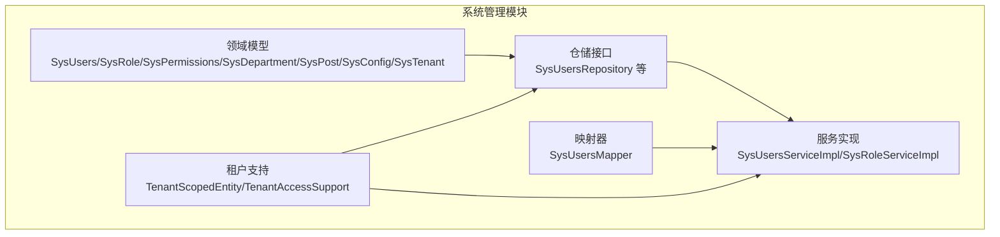
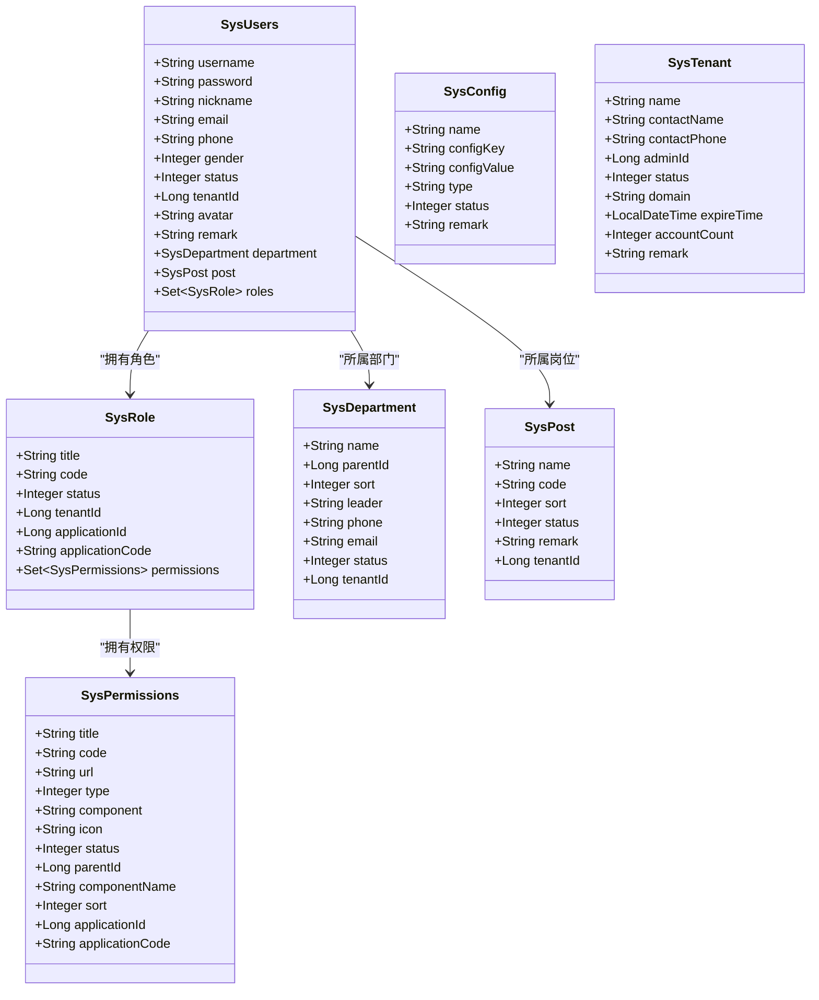
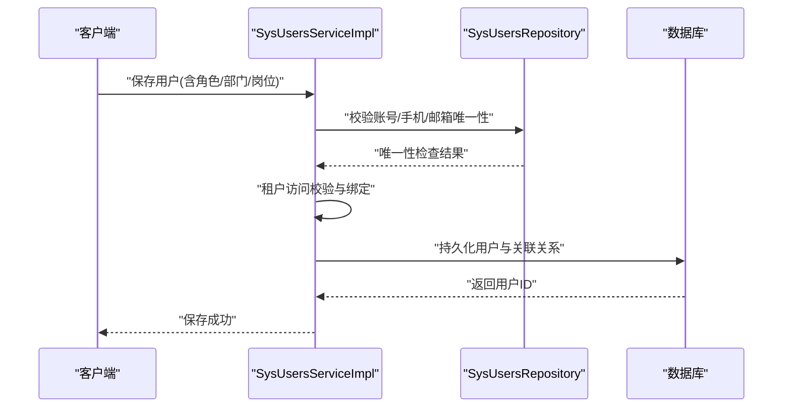
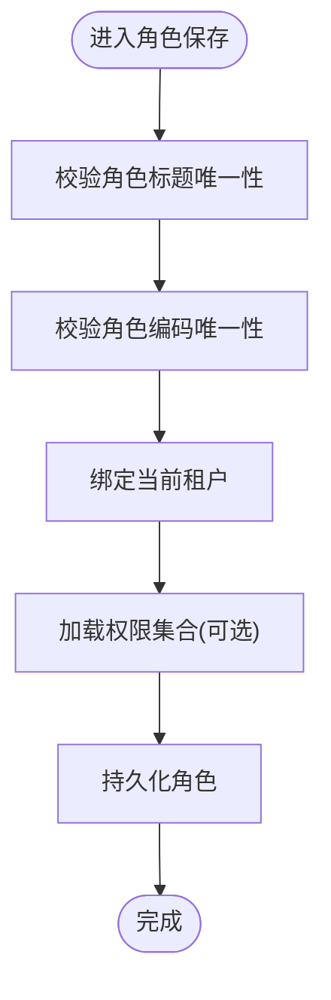
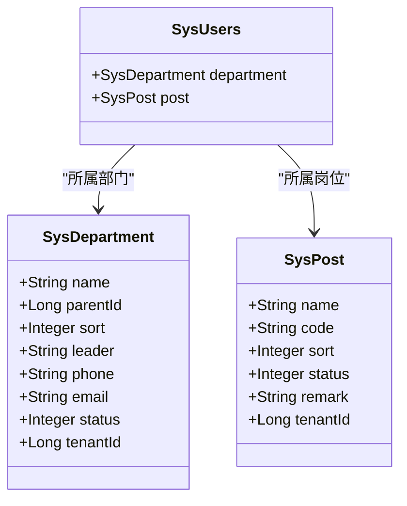
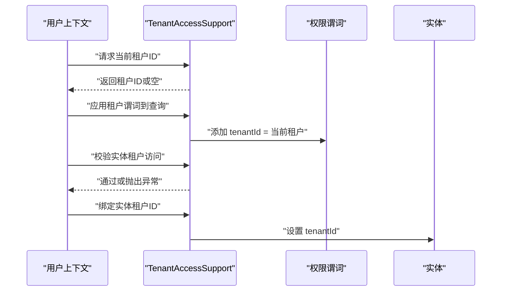
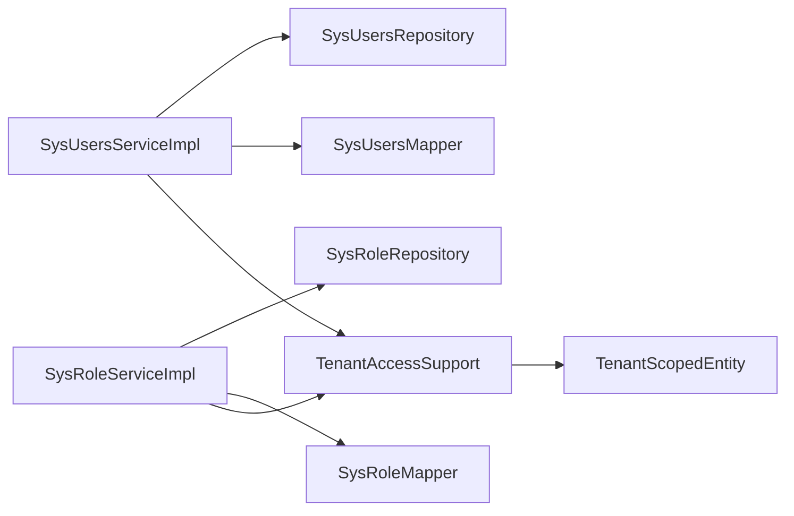

# 系统管理模块

<cite>
**本文引用的文件**
- [SysUsers.java](file://system-module/src/main/java/com/fastproject/system/domain/SysUsers.java)
- [SysRole.java](file://system-module/src/main/java/com/fastproject/system/domain/SysRole.java)
- [SysDepartment.java](file://system-module/src/main/java/com/fastproject/system/domain/SysDepartment.java)
- [SysPost.java](file://system-module/src/main/java/com/fastproject/system/domain/SysPost.java)
- [SysPermissions.java](file://system-module/src/main/java/com/fastproject/system/domain/SysPermissions.java)
- [SysConfig.java](file://system-module/src/main/java/com/fastproject/system/domain/SysConfig.java)
- [SysTenant.java](file://system-module/src/main/java/com/fastproject/system/domain/SysTenant.java)
- [SysUsersServiceImpl.java](file://system-module/src/main/java/com/fastproject/system/service/impl/SysUsersServiceImpl.java)
- [SysRoleServiceImpl.java](file://system-module/src/main/java/com/fastproject/system/service/impl/SysRoleServiceImpl.java)
- [SysUsersMapper.java](file://system-module/src/main/java/com/fastproject/system/mapper/SysUsersMapper.java)
- [SysUsersRepository.java](file://system-module/src/main/java/com/fastproject/system/repository/db/SysUsersRepository.java)
- [SysUsersService.java](file://system-module/src/main/java/com/fastproject/system/service/SysUsersService.java)
- [TenantScopedEntity.java](file://system-module/src/main/java/com/fastproject/system/tenant/TenantScopedEntity.java)
- [TenantAccessSupport.java](file://system-module/src/main/java/com/fastproject/system/tenant/TenantAccessSupport.java)
</cite>

## 目录
1. [引言](#引言)
2. [项目结构](#项目结构)
3. [核心组件](#核心组件)
4. [架构总览](#架构总览)
5. [详细组件分析](#详细组件分析)
6. [依赖分析](#依赖分析)
7. [性能考虑](#性能考虑)
8. [故障排查指南](#故障排查指南)
9. [结论](#结论)
10. [附录](#附录)

## 引言
本技术文档聚焦系统管理模块，围绕用户管理、角色权限、部门岗位、租户配置与系统配置等核心能力，系统性阐述数据模型、权限控制机制、状态管理、树形组织架构与岗位关联、动态参数管理以及租户隔离实现方案，并总结权限验证、数据校验与异常处理的最佳实践。

## 项目结构
系统管理模块采用分层架构：领域模型(domain)、仓储(repository)、服务(service)、映射器(mapper)、控制器(controller)与多租户支持(tenant)。核心对象包括用户、角色、权限、部门、岗位、配置与租户，均实现软删除与租户隔离。

图表来源
- [SysUsers.java](file://system-module/src/main/java/com/fastproject/system/domain/SysUsers.java#L1-L95)
- [SysRole.java](file://system-module/src/main/java/com/fastproject/system/domain/SysRole.java#L1-L59)
- [SysDepartment.java](file://system-module/src/main/java/com/fastproject/system/domain/SysDepartment.java#L1-L60)
- [SysPost.java](file://system-module/src/main/java/com/fastproject/system/domain/SysPost.java#L1-L50)
- [SysPermissions.java](file://system-module/src/main/java/com/fastproject/system/domain/SysPermissions.java#L1-L78)
- [SysConfig.java](file://system-module/src/main/java/com/fastproject/system/domain/SysConfig.java#L1-L52)
- [SysTenant.java](file://system-module/src/main/java/com/fastproject/system/domain/SysTenant.java#L1-L69)
- [SysUsersRepository.java](file://system-module/src/main/java/com/fastproject/system/repository/db/SysUsersRepository.java#L1-L62)
- [SysUsersServiceImpl.java](file://system-module/src/main/java/com/fastproject/system/service/impl/SysUsersServiceImpl.java#L1-L200)
- [SysRoleServiceImpl.java](file://system-module/src/main/java/com/fastproject/system/service/impl/SysRoleServiceImpl.java#L1-L185)
- [SysUsersMapper.java](file://system-module/src/main/java/com/fastproject/system/mapper/SysUsersMapper.java#L1-L30)
- [TenantScopedEntity.java](file://system-module/src/main/java/com/fastproject/system/tenant/TenantScopedEntity.java#L1-L12)
- [TenantAccessSupport.java](file://system-module/src/main/java/com/fastproject/system/tenant/TenantAccessSupport.java#L1-L106)

章节来源
- [SysUsers.java](file://system-module/src/main/java/com/fastproject/system/domain/SysUsers.java#L1-L95)
- [SysRole.java](file://system-module/src/main/java/com/fastproject/system/domain/SysRole.java#L1-L59)
- [SysDepartment.java](file://system-module/src/main/java/com/fastproject/system/domain/SysDepartment.java#L1-L60)
- [SysPost.java](file://system-module/src/main/java/com/fastproject/system/domain/SysPost.java#L1-L50)
- [SysPermissions.java](file://system-module/src/main/java/com/fastproject/system/domain/SysPermissions.java#L1-L78)
- [SysConfig.java](file://system-module/src/main/java/com/fastproject/system/domain/SysConfig.java#L1-L52)
- [SysTenant.java](file://system-module/src/main/java/com/fastproject/system/domain/SysTenant.java#L1-L69)
- [SysUsersRepository.java](file://system-module/src/main/java/com/fastproject/system/repository/db/SysUsersRepository.java#L1-L62)
- [SysUsersServiceImpl.java](file://system-module/src/main/java/com/fastproject/system/service/impl/SysUsersServiceImpl.java#L1-L200)
- [SysRoleServiceImpl.java](file://system-module/src/main/java/com/fastproject/system/service/impl/SysRoleServiceImpl.java#L1-L185)
- [SysUsersMapper.java](file://system-module/src/main/java/com/fastproject/system/mapper/SysUsersMapper.java#L1-L30)
- [TenantScopedEntity.java](file://system-module/src/main/java/com/fastproject/system/tenant/TenantScopedEntity.java#L1-L12)
- [TenantAccessSupport.java](file://system-module/src/main/java/com/fastproject/system/tenant/TenantAccessSupport.java#L1-L106)

## 核心组件
- 用户管理：用户CRUD、登录查询、个人中心、密码修改、分页与条件查询、软删除与租户隔离。
- 角色权限：角色CRUD、权限集合、选择列表、分页查询、软删除与租户隔离。
- 部门岗位：部门树形结构字段、岗位管理、用户与部门/岗位关联。
- 系统配置：动态参数存储与查询、按键检索、状态管理。
- 租户配置：租户实体、租户属性与多租户访问控制。

章节来源
- [SysUsersService.java](file://system-module/src/main/java/com/fastproject/system/service/SysUsersService.java#L1-L75)
- [SysUsersServiceImpl.java](file://system-module/src/main/java/com/fastproject/system/service/impl/SysUsersServiceImpl.java#L1-L200)
- [SysRoleServiceImpl.java](file://system-module/src/main/java/com/fastproject/system/service/impl/SysRoleServiceImpl.java#L1-L185)
- [SysDepartment.java](file://system-module/src/main/java/com/fastproject/system/domain/SysDepartment.java#L1-L60)
- [SysPost.java](file://system-module/src/main/java/com/fastproject/system/domain/SysPost.java#L1-L50)
- [SysConfig.java](file://system-module/src/main/java/com/fastproject/system/domain/SysConfig.java#L1-L52)
- [SysTenant.java](file://system-module/src/main/java/com/fastproject/system/domain/SysTenant.java#L1-L69)

## 架构总览
系统管理模块遵循“领域驱动+分层”的设计模式，通过MapStruct进行DTO与实体映射，使用Spring Data JPA进行数据访问，结合租户支持实现多租户隔离与权限控制。

图表来源
- [SysUsers.java](file://system-module/src/main/java/com/fastproject/system/domain/SysUsers.java#L1-L95)
- [SysRole.java](file://system-module/src/main/java/com/fastproject/system/domain/SysRole.java#L1-L59)
- [SysPermissions.java](file://system-module/src/main/java/com/fastproject/system/domain/SysPermissions.java#L1-L78)
- [SysDepartment.java](file://system-module/src/main/java/com/fastproject/system/domain/SysDepartment.java#L1-L60)
- [SysPost.java](file://system-module/src/main/java/com/fastproject/system/domain/SysPost.java#L1-L50)
- [SysConfig.java](file://system-module/src/main/java/com/fastproject/system/domain/SysConfig.java#L1-L52)
- [SysTenant.java](file://system-module/src/main/java/com/fastproject/system/domain/SysTenant.java#L1-L69)

## 详细组件分析

### 用户管理
- 数据模型：用户实体包含基础信息、状态、租户标识、头像、部门与岗位关联及角色集合；采用软删除与租户隔离。
- CRUD流程：服务层执行业务校验（账号/手机/邮箱唯一性）、租户访问检查、角色/部门/岗位绑定与持久化。
- 查询与分页：支持按条件分页、带角色权限的详情查询、登录用户查询、个人中心信息与密码修改。
- 安全与校验：密码加密、头像URL转换、输入参数校验、事务与异常处理。

图表来源
- [SysUsersServiceImpl.java](file://system-module/src/main/java/com/fastproject/system/service/impl/SysUsersServiceImpl.java#L50-L84)
- [SysUsersRepository.java](file://system-module/src/main/java/com/fastproject/system/repository/db/SysUsersRepository.java#L17-L62)

章节来源
- [SysUsers.java](file://system-module/src/main/java/com/fastproject/system/domain/SysUsers.java#L1-L95)
- [SysUsersServiceImpl.java](file://system-module/src/main/java/com/fastproject/system/service/impl/SysUsersServiceImpl.java#L50-L132)
- [SysUsersRepository.java](file://system-module/src/main/java/com/fastproject/system/repository/db/SysUsersRepository.java#L17-L62)
- [SysUsersMapper.java](file://system-module/src/main/java/com/fastproject/system/mapper/SysUsersMapper.java#L1-L30)
- [SysUsersService.java](file://system-module/src/main/java/com/fastproject/system/service/SysUsersService.java#L1-L75)

### 角色权限
- 角色模型：角色包含标题、编码、状态、应用信息与权限集合；支持选择列表与分页查询。
- 权限模型：权限包含标题、代码、URL、类型、组件、图标、排序、应用信息等；支持树形查询。
- 角色权限分配：保存/更新时加载权限集合并持久化；查询时返回权限ID列表与权限明细。
- 租户隔离：角色与权限均支持按租户过滤与绑定。

图表来源
- [SysRoleServiceImpl.java](file://system-module/src/main/java/com/fastproject/system/service/impl/SysRoleServiceImpl.java#L65-L88)
- [SysRole.java](file://system-module/src/main/java/com/fastproject/system/domain/SysRole.java#L1-L59)
- [SysPermissions.java](file://system-module/src/main/java/com/fastproject/system/domain/SysPermissions.java#L1-L78)

章节来源
- [SysRole.java](file://system-module/src/main/java/com/fastproject/system/domain/SysRole.java#L1-L59)
- [SysPermissions.java](file://system-module/src/main/java/com/fastproject/system/domain/SysPermissions.java#L1-L78)
- [SysRoleServiceImpl.java](file://system-module/src/main/java/com/fastproject/system/service/impl/SysRoleServiceImpl.java#L51-L183)

### 部门与岗位
- 部门模型：支持父级ID、排序、负责人、联系方式、状态与租户隔离；用于构建树形组织架构。
- 岗位模型：支持编码、排序、状态与租户隔离；用户与岗位为多对一关联。
- 关联关系：用户实体同时关联部门与岗位，服务层在保存/更新时进行租户访问校验与绑定。

图表来源
- [SysDepartment.java](file://system-module/src/main/java/com/fastproject/system/domain/SysDepartment.java#L1-L60)
- [SysPost.java](file://system-module/src/main/java/com/fastproject/system/domain/SysPost.java#L1-L50)
- [SysUsers.java](file://system-module/src/main/java/com/fastproject/system/domain/SysUsers.java#L69-L93)

章节来源
- [SysDepartment.java](file://system-module/src/main/java/com/fastproject/system/domain/SysDepartment.java#L1-L60)
- [SysPost.java](file://system-module/src/main/java/com/fastproject/system/domain/SysPost.java#L1-L50)
- [SysUsers.java](file://system-module/src/main/java/com/fastproject/system/domain/SysUsers.java#L69-L93)

### 系统配置
- 配置模型：包含配置名称、键、值、类型、状态与备注；支持按键查询与分页查询。
- 动态参数管理：通过配置键读取配置值，支持状态管理与备注说明。

章节来源
- [SysConfig.java](file://system-module/src/main/java/com/fastproject/system/domain/SysConfig.java#L1-L52)

### 租户配置与多租户隔离
- 租户模型：包含租户名称、联系人、管理员ID、状态、域名、过期时间、账号额度与备注。
- 租户隔离：所有租户相关实体实现租户范围接口；服务层在保存/更新/查询时应用租户谓词与访问校验；支持超级管理员绕过租户限制。

图表来源
- [TenantAccessSupport.java](file://system-module/src/main/java/com/fastproject/system/tenant/TenantAccessSupport.java#L41-L104)
- [TenantScopedEntity.java](file://system-module/src/main/java/com/fastproject/system/tenant/TenantScopedEntity.java#L6-L11)
- [SysUsers.java](file://system-module/src/main/java/com/fastproject/system/domain/SysUsers.java#L61-L61)
- [SysRole.java](file://system-module/src/main/java/com/fastproject/system/domain/SysRole.java#L39-L39)
- [SysDepartment.java](file://system-module/src/main/java/com/fastproject/system/domain/SysDepartment.java#L58-L58)
- [SysPost.java](file://system-module/src/main/java/com/fastproject/system/domain/SysPost.java#L48-L48)
- [SysConfig.java](file://system-module/src/main/java/com/fastproject/system/domain/SysConfig.java#L1-L52)
- [SysTenant.java](file://system-module/src/main/java/com/fastproject/system/domain/SysTenant.java#L1-L69)

章节来源
- [SysTenant.java](file://system-module/src/main/java/com/fastproject/system/domain/SysTenant.java#L1-L69)
- [TenantAccessSupport.java](file://system-module/src/main/java/com/fastproject/system/tenant/TenantAccessSupport.java#L1-L106)
- [TenantScopedEntity.java](file://system-module/src/main/java/com/fastproject/system/tenant/TenantScopedEntity.java#L1-L12)

## 依赖分析
- 组件耦合：服务层依赖仓储接口与映射器；租户支持贯穿服务与仓储层；实体间通过JPA注解建立关联。
- 外部依赖：Spring Data JPA提供查询与分页；MapStruct提供DTO与实体映射；BCrypt进行密码加密；文件服务用于头像URL解析。
- 循环依赖：未发现循环依赖迹象；各层职责清晰。

图表来源
- [SysUsersServiceImpl.java](file://system-module/src/main/java/com/fastproject/system/service/impl/SysUsersServiceImpl.java#L34-L48)
- [SysRoleServiceImpl.java](file://system-module/src/main/java/com/fastproject/system/service/impl/SysRoleServiceImpl.java#L40-L49)
- [SysUsersRepository.java](file://system-module/src/main/java/com/fastproject/system/repository/db/SysUsersRepository.java#L17-L62)
- [SysUsersMapper.java](file://system-module/src/main/java/com/fastproject/system/mapper/SysUsersMapper.java#L1-L30)
- [TenantAccessSupport.java](file://system-module/src/main/java/com/fastproject/system/tenant/TenantAccessSupport.java#L1-L106)
- [TenantScopedEntity.java](file://system-module/src/main/java/com/fastproject/system/tenant/TenantScopedEntity.java#L1-L12)

章节来源
- [SysUsersServiceImpl.java](file://system-module/src/main/java/com/fastproject/system/service/impl/SysUsersServiceImpl.java#L34-L48)
- [SysRoleServiceImpl.java](file://system-module/src/main/java/com/fastproject/system/service/impl/SysRoleServiceImpl.java#L40-L49)
- [SysUsersRepository.java](file://system-module/src/main/java/com/fastproject/system/repository/db/SysUsersRepository.java#L17-L62)
- [SysUsersMapper.java](file://system-module/src/main/java/com/fastproject/system/mapper/SysUsersMapper.java#L1-L30)
- [TenantAccessSupport.java](file://system-module/src/main/java/com/fastproject/system/tenant/TenantAccessSupport.java#L1-L106)
- [TenantScopedEntity.java](file://system-module/src/main/java/com/fastproject/system/tenant/TenantScopedEntity.java#L1-L12)

## 性能考虑
- 查询优化：使用JPA Specification组合谓词，避免N+1问题；在用户详情查询中使用JOIN FETCH加载角色与权限。
- 分页与排序：统一使用PageRequest进行分页与降序排序，减少前端压力。
- 缓存策略：建议对常用字典、配置项与权限树进行缓存；对频繁查询的角色/部门/岗位进行本地缓存。
- 并发控制：事务边界明确，避免长事务；批量删除与更新使用一次性提交。
- 索引建议：在用户表的username、phone、email上建立唯一索引；在角色表的title/code与tenantId上建立索引；在部门/岗位/配置表的关键字段建立索引。

## 故障排查指南
- 业务异常：当重复提交或越权访问时，服务层会抛出业务异常；请检查唯一性约束与租户访问校验逻辑。
- 租户异常：若当前用户未绑定租户或租户功能未启用，租户支持会抛出相应异常；请确认租户开关与用户上下文。
- 文件URL：头像URL解析失败时，回退到原始值；请检查文件服务可用性与URL生成规则。
- 权限缺失：角色权限未正确分配会导致菜单/按钮/API不可见；请核对权限集合与应用信息。

章节来源
- [SysUsersServiceImpl.java](file://system-module/src/main/java/com/fastproject/system/service/impl/SysUsersServiceImpl.java#L54-L62)
- [SysRoleServiceImpl.java](file://system-module/src/main/java/com/fastproject/system/service/impl/SysRoleServiceImpl.java#L94-L106)
- [TenantAccessSupport.java](file://system-module/src/main/java/com/fastproject/system/tenant/TenantAccessSupport.java#L80-L104)

## 结论
系统管理模块通过清晰的分层设计与租户隔离机制，实现了用户、角色、权限、部门、岗位与配置的全生命周期管理。结合MapStruct映射与JPA查询，具备良好的扩展性与可维护性。建议在生产环境中进一步完善缓存策略与监控告警，确保高并发场景下的稳定性与性能。

## 附录
- 最佳实践清单
  - 严格使用租户访问支持进行数据隔离与权限校验。
  - 对外暴露的接口统一进行参数校验与异常捕获。
  - 使用事务边界明确的业务方法，避免跨层事务传播。
  - 对热点数据进行缓存，降低数据库压力。
  - 对权限树与选择列表进行预计算与缓存，提升前端渲染效率。