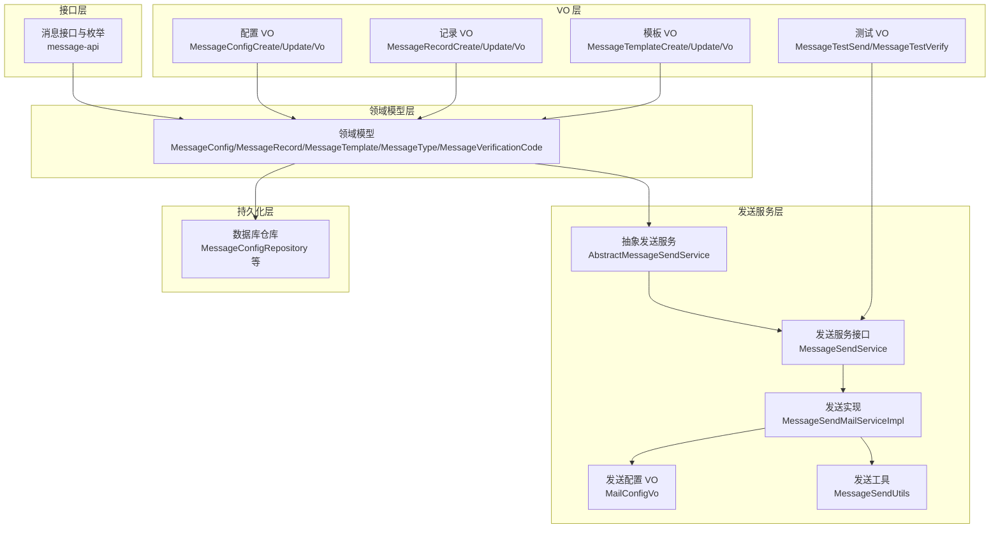
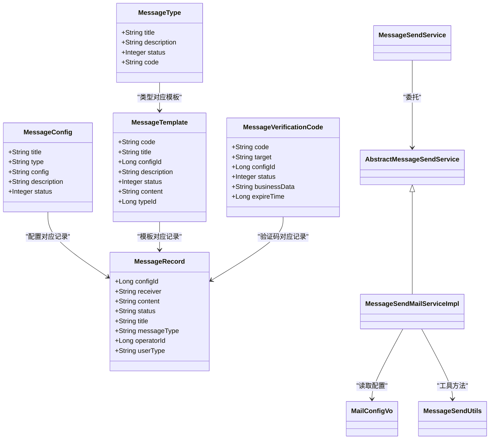
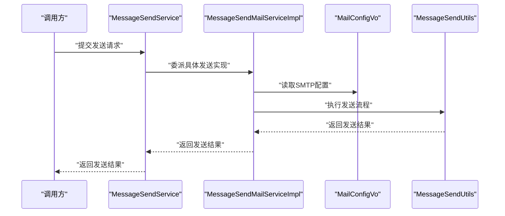
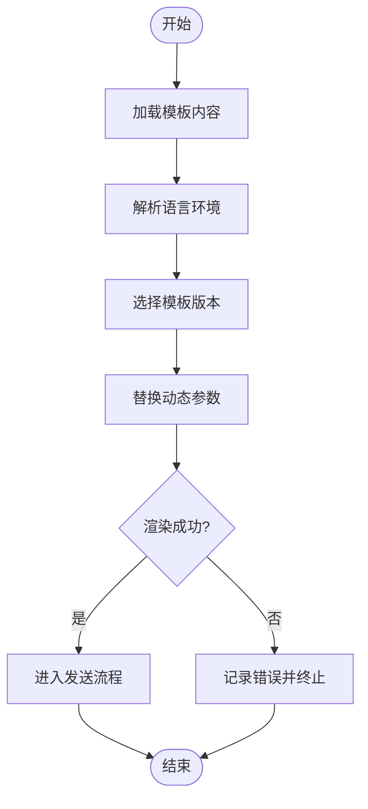
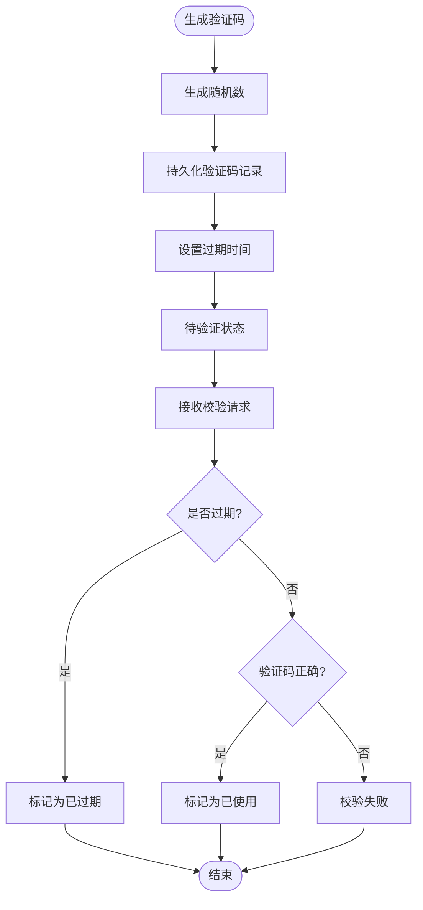
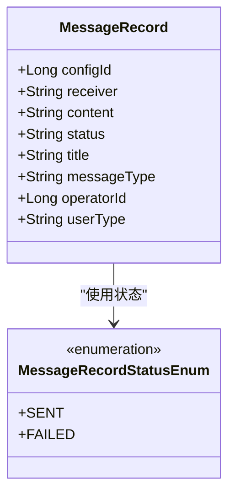
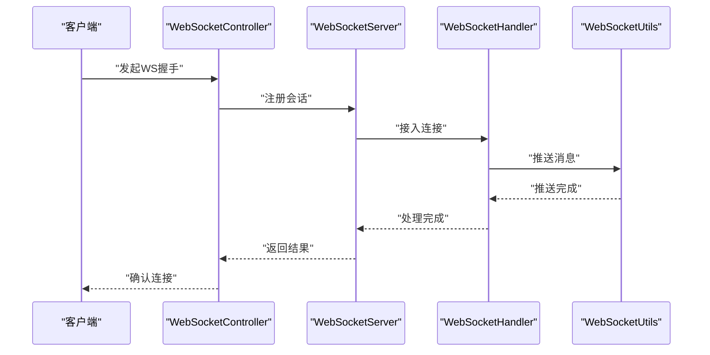
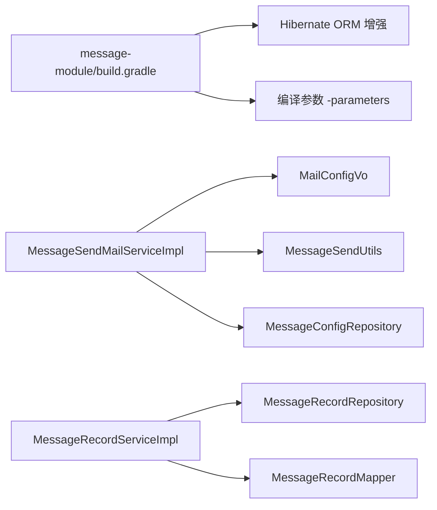

# 通信服务模块

<cite>
**本文引用的文件**
- [message-module/build.gradle](file://message-module/build.gradle)
- [message-api/src/main/java/com/fastproject/message/enums/MessageRecordStatusEnum.java](file://message-api/src/main/java/com/fastproject/message/enums/MessageRecordStatusEnum.java)
- [message-api/src/main/java/com/fastproject/message/enums/MessageTypeEnum.java](file://message-api/src/main/java/com/fastproject/message/enums/MessageTypeEnum.java)
- [message-api/src/main/java/com/fastproject/message/enums/MessageVerificationCodeStatusEnum.java](file://message-api/src/main/java/com/fastproject/message/enums/MessageVerificationCodeStatusEnum.java)
- [message-module/src/main/java/com/fastproject/message/domain/MessageConfig.java](file://message-module/src/main/java/com/fastproject/message/domain/MessageConfig.java)
- [message-module/src/main/java/com/fastproject/message/domain/MessageRecord.java](file://message-module/src/main/java/com/fastproject/message/domain/MessageRecord.java)
- [message-module/src/main/java/com/fastproject/message/domain/MessageTemplate.java](file://message-module/src/main/java/com/fastproject/message/domain/MessageTemplate.java)
- [message-module/src/main/java/com/fastproject/message/domain/MessageType.java](file://message-module/src/main/java/com/fastproject/message/domain/MessageType.java)
- [message-module/src/main/java/com/fastproject/message/domain/MessageVerificationCode.java](file://message-module/src/main/java/com/fastproject/message/domain/MessageVerificationCode.java)
- [message-module/src/main/java/com/fastproject/message/mapper/MessageConfigMapper.java](file://message-module/src/main/java/com/fastproject/message/mapper/MessageConfigMapper.java)
- [message-module/src/main/java/com/fastproject/message/mapper/MessageRecordMapper.java](file://message-module/src/main/java/com/fastproject/message/mapper/MessageRecordMapper.java)
- [message-module/src/main/java/com/fastproject/message/mapper/MessageTypeMapper.java](file://message-module/src/main/java/com/fastproject/message/mapper/MessageTypeMapper.java)
- [message-module/src/main/java/com/fastproject/message/service/impl/MessageRecordServiceImpl.java](file://message-module/src/main/java/com/fastproject/message/service/impl/MessageRecordServiceImpl.java)
- [message-module/src/main/java/com/fastproject/message/send/AbstractMessageSendService.java](file://message-module/src/main/java/com/fastproject/message/send/AbstractMessageSendService.java)
- [message-module/src/main/java/com/fastproject/message/send/MessageSendService.java](file://message-module/src/main/java/com/fastproject/message/send/MessageSendService.java)
- [message-module/src/main/java/com/fastproject/message/send/impl/MessageSendMailServiceImpl.java](file://message-module/src/main/java/com/fastproject/message/send/impl/MessageSendMailServiceImpl.java)
- [message-module/src/main/java/com/fastproject/message/send/vo/MailConfigVo.java](file://message-module/src/main/java/com/fastproject/message/send/vo/MailConfigVo.java)
- [message-module/src/main/java/com/fastproject/message/send/MessageSendUtils.java](file://message-module/src/main/java/com/fastproject/message/send/MessageSendUtils.java)
- [message-module/src/main/java/com/fastproject/message/repository/db/MessageConfigRepository.java](file://message-module/src/main/java/com/fastproject/message/repository/db/MessageConfigRepository.java)
- [message-module/src/main/java/com/fastproject/message/repository/db/MessageRecordRepository.java](file://message-module/src/main/java/com/fastproject/message/repository/db/MessageRecordRepository.java)
- [message-module/src/main/java/com/fastproject/message/repository/db/MessageTemplateRepository.java](file://message-module/src/main/java/com/fastproject/message/repository/db/MessageTemplateRepository.java)
- [message-module/src/main/java/com/fastproject/message/repository/db/MessageTypeRepository.java](file://message-module/src/main/java/com/fastproject/message/repository/db/MessageTypeRepository.java)
- [message-module/src/main/java/com/fastproject/message/repository/db/MessageVerificationCodeRepository.java](file://message-module/src/main/java/com/fastproject/message/repository/db/MessageVerificationCodeRepository.java)
- [message-module/src/main/java/com/fastproject/message/vo/config/MessageConfigCreate.java](file://message-module/src/main/java/com/fastproject/message/vo/config/MessageConfigCreate.java)
- [message-module/src/main/java/com/fastproject/message/vo/config/MessageConfigUpdate.java](file://message-module/src/main/java/com/fastproject/message/vo/config/MessageConfigUpdate.java)
- [message-module/src/main/java/com/fastproject/message/vo/config/MessageConfigVo.java](file://message-module/src/main/java/com/fastproject/message/vo/config/MessageConfigVo.java)
- [message-module/src/main/java/com/fastproject/message/vo/record/MessageRecordCreate.java](file://message-module/src/main/java/com/fastproject/message/vo/record/MessageRecordCreate.java)
- [message-module/src/main/java/com/fastproject/message/vo/record/MessageRecordUpdate.java](file://message-module/src/main/java/com/fastproject/message/vo/record/MessageRecordUpdate.java)
- [message-module/src/main/java/com/fastproject/message/vo/record/MessageRecordVo.java](file://message-module/src/main/java/com/fastproject/message/vo/record/MessageRecordVo.java)
- [message-module/src/main/java/com/fastproject/message/vo/template/MessageTemplateCreate.java](file://message-module/src/main/java/com/fastproject/message/vo/template/MessageTemplateCreate.java)
- [message-module/src/main/java/com/fastproject/message/vo/template/MessageTemplateUpdate.java](file://message-module/src/main/java/com/fastproject/message/vo/template/MessageTemplateUpdate.java)
- [message-module/src/main/java/com/fastproject/message/vo/template/MessageTemplateVo.java](file://message-module/src/main/java/com/fastproject/message/vo/template/MessageTemplateVo.java)
- [message-module/src/main/java/com/fastproject/message/vo/test/MessageTestSend.java](file://message-module/src/main/java/com/fastproject/message/vo/test/MessageTestSend.java)
- [message-module/src/main/java/com/fastproject/message/vo/test/MessageTestVerify.java](file://message-module/src/main/java/com/fastproject/message/vo/test/MessageTestVerify.java)
- [websocket/src/main/java/com/fastproject/WebSocketRun.java](file://websocket/src/main/java/com/fastproject/WebSocketRun.java)
- [websocket/src/main/java/com/fastproject/config/WebSocketConfig.java](file://websocket/src/main/java/com/fastproject/config/WebSocketConfig.java)
- [websocket/src/main/java/com/fastproject/controller/WebSocketController.java](file://websocket/src/main/java/com/fastproject/controller/WebSocketController.java)
- [websocket/src/main/java/com/fastproject/netty/WebSocketServer.java](file://websocket/src/main/java/com/fastproject/netty/WebSocketServer.java)
- [websocket/src/main/java/com/fastproject/netty/WebSocketHandler.java](file://websocket/src/main/java/com/fastproject/netty/WebSocketHandler.java)
- [websocket/src/main/java/com/fastproject/utils/WebSocketUtils.java](file://websocket/src/main/java/com/fastproject/utils/WebSocketUtils.java)
</cite>

## 目录
1. [简介](#简介)
2. [项目结构](#项目结构)
3. [核心组件](#核心组件)
4. [架构总览](#架构总览)
5. [详细组件分析](#详细组件分析)
6. [依赖分析](#依赖分析)
7. [性能考虑](#性能考虑)
8. [故障排查指南](#故障排查指南)
9. [结论](#结论)
10. [附录](#附录)

## 简介
本技术文档聚焦于通信服务模块，系统性阐述消息发送、模板管理与验证码服务的完整实现架构。重点覆盖：
- 邮件发送的 SMTP 配置、模板渲染与批量发送机制
- 消息模板的动态参数替换、多语言支持与版本管理策略
- 验证码生成的随机算法、有效期控制与安全验证流程
- 消息记录的发送状态跟踪、失败重试与结果统计
- 消息队列的异步处理与消息推送的实时通信方案（WebSocket）

## 项目结构
通信服务模块由“接口层”“领域模型层”“持久化层”“发送服务层”“VO 层”“枚举层”等组成，采用分层清晰、职责明确的组织方式；同时通过 VO 映射器（MapStruct）降低 DTO 与实体间的转换成本。

图表来源
- [message-module/src/main/java/com/fastproject/message/domain/MessageConfig.java](file://message-module/src/main/java/com/fastproject/message/domain/MessageConfig.java#L1-L45)
- [message-module/src/main/java/com/fastproject/message/domain/MessageRecord.java](file://message-module/src/main/java/com/fastproject/message/domain/MessageRecord.java#L1-L59)
- [message-module/src/main/java/com/fastproject/message/domain/MessageTemplate.java](file://message-module/src/main/java/com/fastproject/message/domain/MessageTemplate.java#L1-L55)
- [message-module/src/main/java/com/fastproject/message/domain/MessageType.java](file://message-module/src/main/java/com/fastproject/message/domain/MessageType.java#L1-L39)
- [message-module/src/main/java/com/fastproject/message/domain/MessageVerificationCode.java](file://message-module/src/main/java/com/fastproject/message/domain/MessageVerificationCode.java#L1-L49)
- [message-module/src/main/java/com/fastproject/message/repository/db/MessageConfigRepository.java](file://message-module/src/main/java/com/fastproject/message/repository/db/MessageConfigRepository.java)
- [message-module/src/main/java/com/fastproject/message/repository/db/MessageRecordRepository.java](file://message-module/src/main/java/com/fastproject/message/repository/db/MessageRecordRepository.java)
- [message-module/src/main/java/com/fastproject/message/repository/db/MessageTemplateRepository.java](file://message-module/src/main/java/com/fastproject/message/repository/db/MessageTemplateRepository.java)
- [message-module/src/main/java/com/fastproject/message/repository/db/MessageTypeRepository.java](file://message-module/src/main/java/com/fastproject/message/repository/db/MessageTypeRepository.java)
- [message-module/src/main/java/com/fastproject/message/repository/db/MessageVerificationCodeRepository.java](file://message-module/src/main/java/com/fastproject/message/repository/db/MessageVerificationCodeRepository.java)
- [message-module/src/main/java/com/fastproject/message/send/AbstractMessageSendService.java](file://message-module/src/main/java/com/fastproject/message/send/AbstractMessageSendService.java)
- [message-module/src/main/java/com/fastproject/message/send/MessageSendService.java](file://message-module/src/main/java/com/fastproject/message/send/MessageSendService.java)
- [message-module/src/main/java/com/fastproject/message/send/impl/MessageSendMailServiceImpl.java](file://message-module/src/main/java/com/fastproject/message/send/impl/MessageSendMailServiceImpl.java)
- [message-module/src/main/java/com/fastproject/message/send/vo/MailConfigVo.java](file://message-module/src/main/java/com/fastproject/message/send/vo/MailConfigVo.java)
- [message-module/src/main/java/com/fastproject/message/send/MessageSendUtils.java](file://message-module/src/main/java/com/fastproject/message/send/MessageSendUtils.java)
- [message-module/src/main/java/com/fastproject/message/vo/config/MessageConfigCreate.java](file://message-module/src/main/java/com/fastproject/message/vo/config/MessageConfigCreate.java)
- [message-module/src/main/java/com/fastproject/message/vo/record/MessageRecordCreate.java](file://message-module/src/main/java/com/fastproject/message/vo/record/MessageRecordCreate.java)
- [message-module/src/main/java/com/fastproject/message/vo/template/MessageTemplateCreate.java](file://message-module/src/main/java/com/fastproject/message/vo/template/MessageTemplateCreate.java)
- [message-module/src/main/java/com/fastproject/message/vo/test/MessageTestSend.java](file://message-module/src/main/java/com/fastproject/message/vo/test/MessageTestSend.java)

章节来源
- [message-module/build.gradle](file://message-module/build.gradle#L1-L19)

## 核心组件
- 枚举体系：消息记录状态、消息类型、验证码状态，统一了业务状态与对外描述。
- 领域模型：消息配置、消息记录、消息模板、消息类型、验证码，承载业务数据与约束。
- 发送服务：抽象发送服务、邮件发送实现、发送工具与配置 VO，支撑多种消息类型的发送。
- 仓储层：基于 JPA 的仓库接口，负责数据持久化与查询。
- VO 层：用于创建、更新、查询与展示的数据传输对象，配合映射器进行转换。

章节来源
- [message-api/src/main/java/com/fastproject/message/enums/MessageRecordStatusEnum.java](file://message-api/src/main/java/com/fastproject/message/enums/MessageRecordStatusEnum.java#L1-L27)
- [message-api/src/main/java/com/fastproject/message/enums/MessageTypeEnum.java](file://message-api/src/main/java/com/fastproject/message/enums/MessageTypeEnum.java#L1-L26)
- [message-api/src/main/java/com/fastproject/message/enums/MessageVerificationCodeStatusEnum.java](file://message-api/src/main/java/com/fastproject/message/enums/MessageVerificationCodeStatusEnum.java#L1-L31)
- [message-module/src/main/java/com/fastproject/message/domain/MessageConfig.java](file://message-module/src/main/java/com/fastproject/message/domain/MessageConfig.java#L1-L45)
- [message-module/src/main/java/com/fastproject/message/domain/MessageRecord.java](file://message-module/src/main/java/com/fastproject/message/domain/MessageRecord.java#L1-L59)
- [message-module/src/main/java/com/fastproject/message/domain/MessageTemplate.java](file://message-module/src/main/java/com/fastproject/message/domain/MessageTemplate.java#L1-L55)
- [message-module/src/main/java/com/fastproject/message/domain/MessageType.java](file://message-module/src/main/java/com/fastproject/message/domain/MessageType.java#L1-L39)
- [message-module/src/main/java/com/fastproject/message/domain/MessageVerificationCode.java](file://message-module/src/main/java/com/fastproject/message/domain/MessageVerificationCode.java#L1-L49)
- [message-module/src/main/java/com/fastproject/message/mapper/MessageConfigMapper.java](file://message-module/src/main/java/com/fastproject/message/mapper/MessageConfigMapper.java#L1-L27)
- [message-module/src/main/java/com/fastproject/message/mapper/MessageRecordMapper.java](file://message-module/src/main/java/com/fastproject/message/mapper/MessageRecordMapper.java#L1-L27)
- [message-module/src/main/java/com/fastproject/message/mapper/MessageTypeMapper.java](file://message-module/src/main/java/com/fastproject/message/mapper/MessageTypeMapper.java#L1-L27)
- [message-module/src/main/java/com/fastproject/message/vo/config/MessageConfigCreate.java](file://message-module/src/main/java/com/fastproject/message/vo/config/MessageConfigCreate.java)
- [message-module/src/main/java/com/fastproject/message/vo/record/MessageRecordCreate.java](file://message-module/src/main/java/com/fastproject/message/vo/record/MessageRecordCreate.java)
- [message-module/src/main/java/com/fastproject/message/vo/template/MessageTemplateCreate.java](file://message-module/src/main/java/com/fastproject/message/vo/template/MessageTemplateCreate.java)
- [message-module/src/main/java/com/fastproject/message/vo/test/MessageTestSend.java](file://message-module/src/main/java/com/fastproject/message/vo/test/MessageTestSend.java)

## 架构总览
通信服务模块采用“领域驱动设计 + 分层架构”，结合 JPA 与 MapStruct 实现高内聚低耦合。发送服务通过抽象类解耦不同消息类型的实现细节，邮件发送作为典型示例，结合配置 VO 完成 SMTP 参数注入与发送流程。

图表来源
- [message-module/src/main/java/com/fastproject/message/domain/MessageConfig.java](file://message-module/src/main/java/com/fastproject/message/domain/MessageConfig.java#L1-L45)
- [message-module/src/main/java/com/fastproject/message/domain/MessageRecord.java](file://message-module/src/main/java/com/fastproject/message/domain/MessageRecord.java#L1-L59)
- [message-module/src/main/java/com/fastproject/message/domain/MessageTemplate.java](file://message-module/src/main/java/com/fastproject/message/domain/MessageTemplate.java#L1-L55)
- [message-module/src/main/java/com/fastproject/message/domain/MessageType.java](file://message-module/src/main/java/com/fastproject/message/domain/MessageType.java#L1-L39)
- [message-module/src/main/java/com/fastproject/message/domain/MessageVerificationCode.java](file://message-module/src/main/java/com/fastproject/message/domain/MessageVerificationCode.java#L1-L49)
- [message-module/src/main/java/com/fastproject/message/send/AbstractMessageSendService.java](file://message-module/src/main/java/com/fastproject/message/send/AbstractMessageSendService.java)
- [message-module/src/main/java/com/fastproject/message/send/MessageSendService.java](file://message-module/src/main/java/com/fastproject/message/send/MessageSendService.java)
- [message-module/src/main/java/com/fastproject/message/send/impl/MessageSendMailServiceImpl.java](file://message-module/src/main/java/com/fastproject/message/send/impl/MessageSendMailServiceImpl.java)
- [message-module/src/main/java/com/fastproject/message/send/vo/MailConfigVo.java](file://message-module/src/main/java/com/fastproject/message/send/vo/MailConfigVo.java)
- [message-module/src/main/java/com/fastproject/message/send/MessageSendUtils.java](file://message-module/src/main/java/com/fastproject/message/send/MessageSendUtils.java)

## 详细组件分析

### 邮件发送服务（SMTP）
- 抽象发送服务：定义通用发送契约，屏蔽具体实现差异。
- 邮件发送实现：读取 SMTP 配置（用户名、密码、主机、端口等），构建邮件内容，调用底层发送工具完成发送。
- 发送工具：封装邮件发送的通用逻辑，如连接建立、认证、内容编码、异常处理等。
- 配置 VO：承载 SMTP 参数，便于在运行时注入与校验。

图表来源
- [message-module/src/main/java/com/fastproject/message/send/MessageSendService.java](file://message-module/src/main/java/com/fastproject/message/send/MessageSendService.java)
- [message-module/src/main/java/com/fastproject/message/send/impl/MessageSendMailServiceImpl.java](file://message-module/src/main/java/com/fastproject/message/send/impl/MessageSendMailServiceImpl.java)
- [message-module/src/main/java/com/fastproject/message/send/vo/MailConfigVo.java](file://message-module/src/main/java/com/fastproject/message/send/vo/MailConfigVo.java)
- [message-module/src/main/java/com/fastproject/message/send/MessageSendUtils.java](file://message-module/src/main/java/com/fastproject/message/send/MessageSendUtils.java)

章节来源
- [message-module/src/main/java/com/fastproject/message/send/AbstractMessageSendService.java](file://message-module/src/main/java/com/fastproject/message/send/AbstractMessageSendService.java)
- [message-module/src/main/java/com/fastproject/message/send/impl/MessageSendMailServiceImpl.java](file://message-module/src/main/java/com/fastproject/message/send/impl/MessageSendMailServiceImpl.java)
- [message-module/src/main/java/com/fastproject/message/send/vo/MailConfigVo.java](file://message-module/src/main/java/com/fastproject/message/send/vo/MailConfigVo.java)
- [message-module/src/main/java/com/fastproject/message/send/MessageSendUtils.java](file://message-module/src/main/java/com/fastproject/message/send/MessageSendUtils.java)

### 模板管理与渲染
- 模板模型：包含模板代码、标题、所属配置、描述、状态、内容体与类型 ID。
- 渲染策略：通过模板内容与动态参数进行占位符替换，支持多语言占位符与版本号字段以实现版本管理。
- 多语言支持：模板内容可按语言维度维护多个版本，选择当前语言版本进行渲染。
- 版本管理：模板可带版本号或时间戳，确保历史记录可追溯与回滚。

图表来源
- [message-module/src/main/java/com/fastproject/message/domain/MessageTemplate.java](file://message-module/src/main/java/com/fastproject/message/domain/MessageTemplate.java#L1-L55)

章节来源
- [message-module/src/main/java/com/fastproject/message/domain/MessageTemplate.java](file://message-module/src/main/java/com/fastproject/message/domain/MessageTemplate.java#L1-L55)

### 验证码服务
- 验证码模型：包含验证码值、发送目标、配置 ID、状态、业务数据与过期时间。
- 生成算法：采用安全随机数生成器生成固定长度数字验证码。
- 有效期控制：记录过期时间戳，发送前与当前时间比较判断是否过期。
- 安全验证：提供校验接口，校验验证码、目标与状态，防止重复使用与越权访问。

图表来源
- [message-module/src/main/java/com/fastproject/message/domain/MessageVerificationCode.java](file://message-module/src/main/java/com/fastproject/message/domain/MessageVerificationCode.java#L1-L49)

章节来源
- [message-module/src/main/java/com/fastproject/message/domain/MessageVerificationCode.java](file://message-module/src/main/java/com/fastproject/message/domain/MessageVerificationCode.java#L1-L49)

### 消息记录与状态跟踪
- 记录模型：包含配置 ID、接收人、内容、状态、标题、消息类型、操作用户与用户类型。
- 状态枚举：定义“已发送/发送失败”两类状态，便于前端与运营侧追踪。
- 查询与统计：通过仓储层与查询帮助类实现条件筛选、分页与统计。

图表来源
- [message-module/src/main/java/com/fastproject/message/domain/MessageRecord.java](file://message-module/src/main/java/com/fastproject/message/domain/MessageRecord.java#L1-L59)
- [message-api/src/main/java/com/fastproject/message/enums/MessageRecordStatusEnum.java](file://message-api/src/main/java/com/fastproject/message/enums/MessageRecordStatusEnum.java#L1-L27)

章节来源
- [message-module/src/main/java/com/fastproject/message/domain/MessageRecord.java](file://message-module/src/main/java/com/fastproject/message/domain/MessageRecord.java#L1-L59)
- [message-api/src/main/java/com/fastproject/message/enums/MessageRecordStatusEnum.java](file://message-api/src/main/java/com/fastproject/message/enums/MessageRecordStatusEnum.java#L1-L27)
- [message-module/src/main/java/com/fastproject/message/service/impl/MessageRecordServiceImpl.java](file://message-module/src/main/java/com/fastproject/message/service/impl/MessageRecordServiceImpl.java#L1-L33)

### 批量发送机制
- 组装批次：根据模板与接收人列表组装批量发送任务。
- 异步执行：通过发送服务异步调度，避免阻塞主线程。
- 结果聚合：汇总每个接收人的发送结果，形成批次报告。

章节来源
- [message-module/src/main/java/com/fastproject/message/send/MessageSendService.java](file://message-module/src/main/java/com/fastproject/message/send/MessageSendService.java)
- [message-module/src/main/java/com/fastproject/message/send/impl/MessageSendMailServiceImpl.java](file://message-module/src/main/java/com/fastproject/message/send/impl/MessageSendMailServiceImpl.java)

### 实时通信方案（WebSocket）
- 服务端：Netty WebSocket 服务器与处理器，负责连接管理、消息路由与广播。
- 控制器：提供握手与消息入口，绑定会话标识与用户上下文。
- 工具类：封装消息推送、心跳检测与断线重连策略。
- 应用场景：验证码下发后主动推送至客户端，或向指定用户/群组推送系统通知。

图表来源
- [websocket/src/main/java/com/fastproject/WebSocketRun.java](file://websocket/src/main/java/com/fastproject/WebSocketRun.java)
- [websocket/src/main/java/com/fastproject/config/WebSocketConfig.java](file://websocket/src/main/java/com/fastproject/config/WebSocketConfig.java)
- [websocket/src/main/java/com/fastproject/controller/WebSocketController.java](file://websocket/src/main/java/com/fastproject/controller/WebSocketController.java)
- [websocket/src/main/java/com/fastproject/netty/WebSocketServer.java](file://websocket/src/main/java/com/fastproject/netty/WebSocketServer.java)
- [websocket/src/main/java/com/fastproject/netty/WebSocketHandler.java](file://websocket/src/main/java/com/fastproject/netty/WebSocketHandler.java)
- [websocket/src/main/java/com/fastproject/utils/WebSocketUtils.java](file://websocket/src/main/java/com/fastproject/utils/WebSocketUtils.java)

## 依赖分析
- 模块依赖：通信服务模块为独立子模块，通过 build.gradle 启用 Hibernate ORM 增强与编译参数。
- 组件耦合：发送服务通过抽象类与接口解耦，邮件实现依赖配置 VO 与工具类，降低耦合度。
- 外部集成：与数据库（JPA）、Redis（仓库中存在 Redis 包含）以及 WebSocket 服务协同工作。

图表来源
- [message-module/build.gradle](file://message-module/build.gradle#L1-L19)
- [message-module/src/main/java/com/fastproject/message/send/impl/MessageSendMailServiceImpl.java](file://message-module/src/main/java/com/fastproject/message/send/impl/MessageSendMailServiceImpl.java)
- [message-module/src/main/java/com/fastproject/message/send/vo/MailConfigVo.java](file://message-module/src/main/java/com/fastproject/message/send/vo/MailConfigVo.java)
- [message-module/src/main/java/com/fastproject/message/send/MessageSendUtils.java](file://message-module/src/main/java/com/fastproject/message/send/MessageSendUtils.java)
- [message-module/src/main/java/com/fastproject/message/repository/db/MessageConfigRepository.java](file://message-module/src/main/java/com/fastproject/message/repository/db/MessageConfigRepository.java)
- [message-module/src/main/java/com/fastproject/message/service/impl/MessageRecordServiceImpl.java](file://message-module/src/main/java/com/fastproject/message/service/impl/MessageRecordServiceImpl.java)
- [message-module/src/main/java/com/fastproject/message/repository/db/MessageRecordRepository.java](file://message-module/src/main/java/com/fastproject/message/repository/db/MessageRecordRepository.java)
- [message-module/src/main/java/com/fastproject/message/mapper/MessageRecordMapper.java](file://message-module/src/main/java/com/fastproject/message/mapper/MessageRecordMapper.java#L1-L27)

章节来源
- [message-module/build.gradle](file://message-module/build.gradle#L1-L19)

## 性能考虑
- 异步发送：通过发送服务异步调度，减少请求阻塞，提升吞吐量。
- 批量处理：对同一模板的多接收人进行批量化组装与发送，降低网络往返与数据库写入次数。
- 缓存策略：验证码与配置可引入 Redis 缓存，缩短读取延迟并减轻数据库压力。
- 连接池：邮件发送复用连接与线程池，避免频繁创建销毁带来的开销。
- 分页与索引：消息记录查询使用分页与合理索引，避免大表扫描影响性能。

## 故障排查指南
- 发送失败定位：检查消息记录状态与错误日志，核对 SMTP 配置与网络连通性。
- 模板渲染问题：确认模板内容与动态参数键名一致，检查多语言版本是否匹配。
- 验证码异常：核对过期时间、状态与目标匹配，排查并发重复使用导致的状态冲突。
- WebSocket 推送失败：检查握手日志、处理器异常与连接状态，确认消息路由与会话有效性。

章节来源
- [message-module/src/main/java/com/fastproject/message/domain/MessageRecord.java](file://message-module/src/main/java/com/fastproject/message/domain/MessageRecord.java#L1-L59)
- [message-module/src/main/java/com/fastproject/message/domain/MessageVerificationCode.java](file://message-module/src/main/java/com/fastproject/message/domain/MessageVerificationCode.java#L1-L49)
- [websocket/src/main/java/com/fastproject/netty/WebSocketHandler.java](file://websocket/src/main/java/com/fastproject/netty/WebSocketHandler.java)

## 结论
通信服务模块通过清晰的分层与抽象设计，实现了邮件发送、模板管理与验证码服务的稳定扩展能力。结合异步发送与 WebSocket 实时推送，满足高并发与低延迟的业务需求。建议后续完善消息队列异步处理与更细粒度的重试与熔断策略，进一步提升系统的可靠性与可观测性。

## 附录
- 测试用例：提供消息测试发送与验证的 VO，便于本地联调与自动化测试。
- 配置项：通过配置 VO 注入 SMTP 参数，建议在环境变量或配置中心集中管理。

章节来源
- [message-module/src/main/java/com/fastproject/message/vo/test/MessageTestSend.java](file://message-module/src/main/java/com/fastproject/message/vo/test/MessageTestSend.java)
- [message-module/src/main/java/com/fastproject/message/vo/test/MessageTestVerify.java](file://message-module/src/main/java/com/fastproject/message/vo/test/MessageTestVerify.java)
- [message-module/src/main/java/com/fastproject/message/send/vo/MailConfigVo.java](file://message-module/src/main/java/com/fastproject/message/send/vo/MailConfigVo.java)