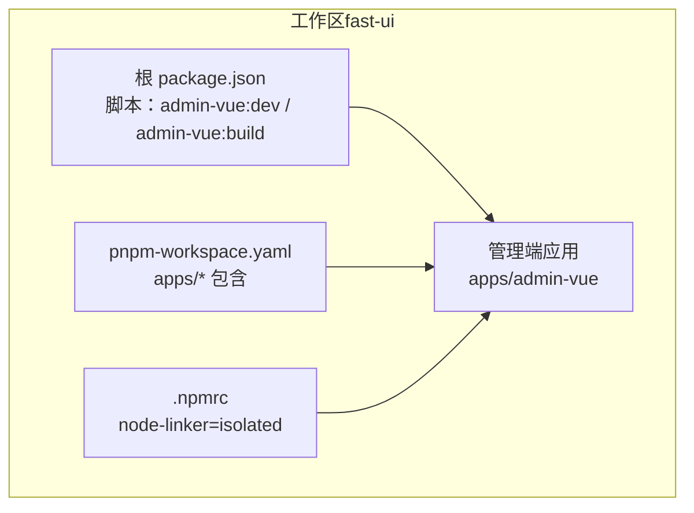
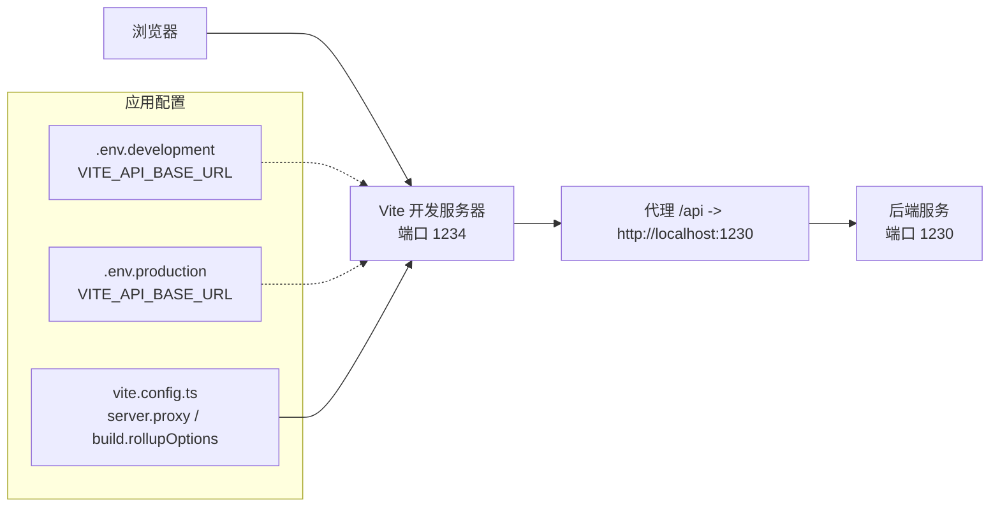
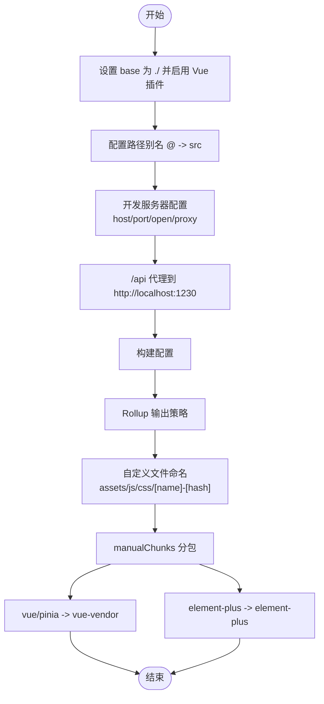
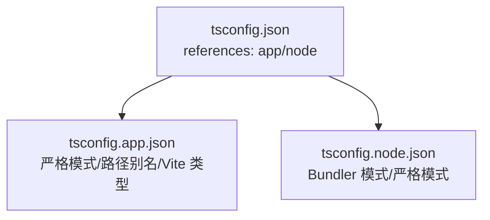
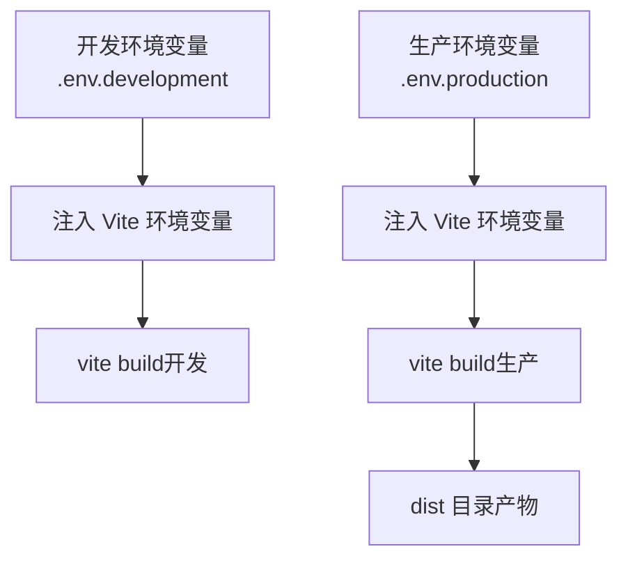
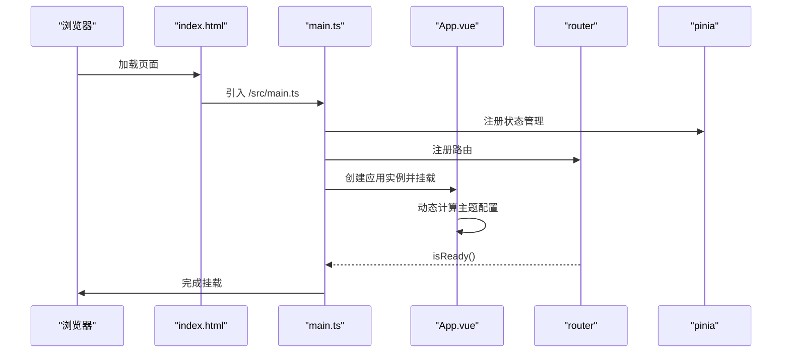
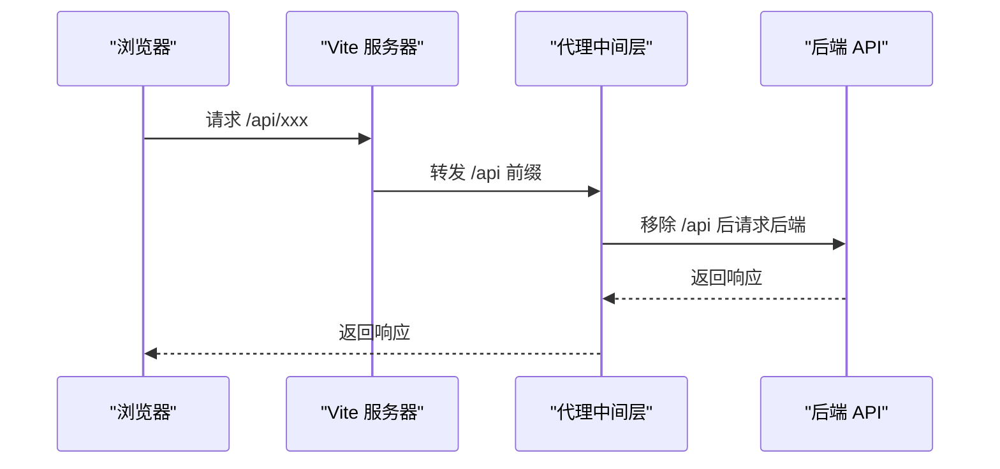
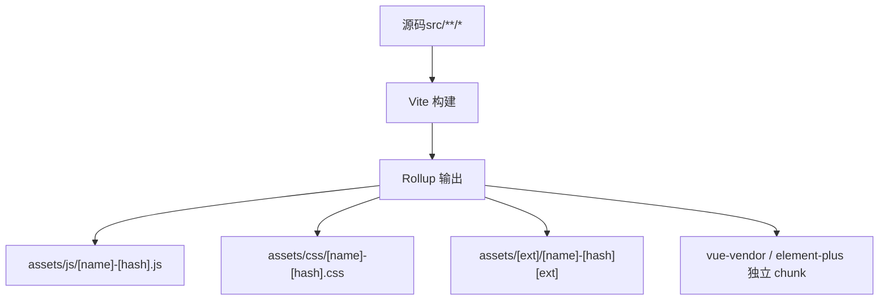
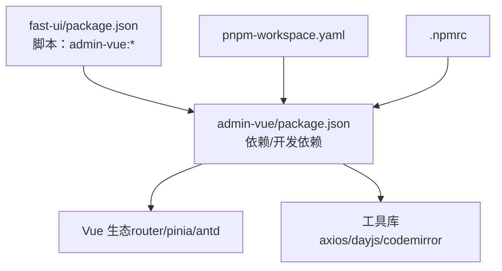

# 开发指南

<cite>
**本文引用的文件**
- [vite.config.ts](file://fast-ui/apps/admin-vue/vite.config.ts)
- [package.json（管理端）](file://fast-ui/apps/admin-vue/package.json)
- [.env.development（管理端）](file://fast-ui/apps/admin-vue/.env.development)
- [.env.production（管理端）](file://fast-ui/apps/admin-vue/.env.production)
- [tsconfig.json（管理端）](file://fast-ui/apps/admin-vue/tsconfig.json)
- [tsconfig.app.json（管理端）](file://fast-ui/apps/admin-vue/tsconfig.app.json)
- [tsconfig.node.json（管理端）](file://fast-ui/apps/admin-vue/tsconfig.node.json)
- [main.ts（管理端）](file://fast-ui/apps/admin-vue/src/main.ts)
- [App.vue（管理端）](file://fast-ui/apps/admin-vue/src/App.vue)
- [index.html（管理端）](file://fast-ui/apps/admin-vue/index.html)
- [package.json（工作区）](file://fast-ui/package.json)
- [pnpm-workspace.yaml](file://fast-ui/pnpm-workspace.yaml)
- [.npmrc](file://fast-ui/.npmrc)
</cite>

## 目录
1. [简介](#简介)
2. [项目结构](#项目结构)
3. [核心组件](#核心组件)
4. [架构总览](#架构总览)
5. [详细组件分析](#详细组件分析)
6. [依赖关系分析](#依赖关系分析)
7. [性能考量](#性能考量)
8. [故障排查指南](#故障排查指南)
9. [结论](#结论)
10. [附录](#附录)

## 简介
本指南面向管理端 Vue 应用的开发与运维团队，系统阐述开发环境配置、构建与部署策略、TypeScript 规范、代码质量工具（ESLint、Prettier）、Vite 配置与优化、热重载与代理、资源打包策略、调试与性能分析、以及团队协作与 CI 建议。内容基于仓库中实际配置文件进行提炼与落地，帮助新成员快速上手并保持高质量交付。

## 项目结构
管理端应用位于 fast-ui/apps/admin-vue，采用 pnpm 工作区组织多包结构，根级脚本统一调度各应用的开发与构建。

图表来源
- [package.json（工作区）](file://fast-ui/package.json#L6-L10)
- [pnpm-workspace.yaml](file://fast-ui/pnpm-workspace.yaml#L1-L4)
- [.npmrc](file://fast-ui/.npmrc#L1-L2)

章节来源
- [package.json（工作区）](file://fast-ui/package.json#L1-L15)
- [pnpm-workspace.yaml](file://fast-ui/pnpm-workspace.yaml#L1-L4)
- [.npmrc](file://fast-ui/.npmrc#L1-L2)

## 核心组件
- Vite 构建与开发服务器：提供热重载、代理、路径别名与产物分包策略。
- TypeScript 编译配置：区分应用与 Node 工具链编译目标，启用严格模式与未使用项检查。
- 环境变量：通过 .env.* 文件注入运行期配置，支持开发与生产差异化。
- 应用入口与主题：在入口注册路由、状态管理与 UI 组件库；在根组件提供主题与本地化配置。

章节来源
- [vite.config.ts](file://fast-ui/apps/admin-vue/vite.config.ts#L1-L56)
- [tsconfig.app.json（管理端）](file://fast-ui/apps/admin-vue/tsconfig.app.json#L1-L21)
- [tsconfig.node.json（管理端）](file://fast-ui/apps/admin-vue/tsconfig.node.json#L1-L27)
- [.env.development（管理端）](file://fast-ui/apps/admin-vue/.env.development#L1-L9)
- [.env.production（管理端）](file://fast-ui/apps/admin-vue/.env.production#L1-L3)
- [main.ts（管理端）](file://fast-ui/apps/admin-vue/src/main.ts#L1-L16)
- [App.vue（管理端）](file://fast-ui/apps/admin-vue/src/App.vue#L1-L41)

## 架构总览
下图展示从浏览器到后端接口的请求链路，以及开发服务器如何通过代理转发 API 请求。

图表来源
- [vite.config.ts](file://fast-ui/apps/admin-vue/vite.config.ts#L9-L20)
- [.env.development（管理端）](file://fast-ui/apps/admin-vue/.env.development#L1-L9)
- [.env.production（管理端）](file://fast-ui/apps/admin-vue/.env.production#L1-L3)

## 详细组件分析

### Vite 配置与优化
- 基础路径与插件：设置相对 base，启用 Vue 插件；解析别名 @ 指向 src。
- 开发服务器：允许局域网访问、指定端口、关闭自动打开浏览器；配置 /api 代理至后端服务。
- 资源打包：自定义产物命名策略，按类型分类输出；手动拆分第三方依赖为独立 chunk，提升缓存命中率。
- 产物分包策略：对 vue 与 pinia、element-plus 进行单独分包，减少重复依赖体积。

图表来源
- [vite.config.ts](file://fast-ui/apps/admin-vue/vite.config.ts#L6-L55)

章节来源
- [vite.config.ts](file://fast-ui/apps/admin-vue/vite.config.ts#L1-L56)

### TypeScript 编译配置
- 根 tsconfig：聚合 app 与 node 两套配置。
- 应用层 tsconfig：启用严格模式、未使用项检查、DOM 类型与 Vite 环境类型；路径别名与 include 规则。
- Node 层 tsconfig：Bundler 模式、ESNext 模块解析、严格模式与未使用项检查；仅包含 vite.config.ts。

图表来源
- [tsconfig.json（管理端）](file://fast-ui/apps/admin-vue/tsconfig.json#L1-L8)
- [tsconfig.app.json（管理端）](file://fast-ui/apps/admin-vue/tsconfig.app.json#L1-L21)
- [tsconfig.node.json（管理端）](file://fast-ui/apps/admin-vue/tsconfig.node.json#L1-L27)

章节来源
- [tsconfig.json（管理端）](file://fast-ui/apps/admin-vue/tsconfig.json#L1-L8)
- [tsconfig.app.json（管理端）](file://fast-ui/apps/admin-vue/tsconfig.app.json#L1-L21)
- [tsconfig.node.json（管理端）](file://fast-ui/apps/admin-vue/tsconfig.node.json#L1-L27)

### 环境变量与部署策略
- 开发环境：定义 API 基础地址、默认账号密码、应用标题等，便于本地联调。
- 生产环境：定义 API 地址、应用标题与图标路径，确保构建产物正确加载静态资源。
- 部署建议：生产构建后将 dist 目录部署至 Nginx 或静态托管，确保 base 与资源路径一致。

图表来源
- [.env.development（管理端）](file://fast-ui/apps/admin-vue/.env.development#L1-L9)
- [.env.production（管理端）](file://fast-ui/apps/admin-vue/.env.production#L1-L3)
- [vite.config.ts](file://fast-ui/apps/admin-vue/vite.config.ts#L6-L55)

章节来源
- [.env.development（管理端）](file://fast-ui/apps/admin-vue/.env.development#L1-L9)
- [.env.production（管理端）](file://fast-ui/apps/admin-vue/.env.production#L1-L3)

### 应用入口与主题配置
- 入口注册：创建应用实例，挂载路由、状态管理与 UI 组件库；等待路由就绪后再挂载。
- 根组件主题：根据应用状态动态组合算法，支持深色/紧凑模式；统一本地化与主题令牌。

图表来源
- [index.html（管理端）](file://fast-ui/apps/admin-vue/index.html#L1-L14)
- [main.ts（管理端）](file://fast-ui/apps/admin-vue/src/main.ts#L1-L16)
- [App.vue（管理端）](file://fast-ui/apps/admin-vue/src/App.vue#L1-L41)

章节来源
- [index.html（管理端）](file://fast-ui/apps/admin-vue/index.html#L1-L14)
- [main.ts（管理端）](file://fast-ui/apps/admin-vue/src/main.ts#L1-L16)
- [App.vue（管理端）](file://fast-ui/apps/admin-vue/src/App.vue#L1-L41)

### 代码质量：TypeScript、ESLint、Prettier
- TypeScript：已启用严格模式与未使用项检查，建议在团队内统一遵循。
- ESLint：建议在项目中添加规则集（如 @antfu/eslint-config），并配置提交前检查。
- Prettier：建议与 ESLint 配合，统一格式化风格，避免格式化分歧。

[本节为通用实践建议，不直接分析具体文件，故无“章节来源”]

### 热重载机制与代理配置
- 热重载：Vite 基于 ES 模块原生支持，无需额外配置即可实现模块级热更新。
- 代理：开发阶段通过 /api 前缀代理到后端服务，避免跨域；生产环境由后端或网关处理跨域。

图表来源
- [vite.config.ts](file://fast-ui/apps/admin-vue/vite.config.ts#L13-L19)

章节来源
- [vite.config.ts](file://fast-ui/apps/admin-vue/vite.config.ts#L1-L56)

### 资源打包策略
- 文件命名：JS/CSS/静态资源分别归类到 assets/js、assets/css 与 assets/[ext]，并带哈希后缀。
- 手动分包：将 vue、pinia、element-plus 独立拆分，降低缓存失效范围。
- 路径别名：统一 @ 指向 src，简化导入路径。

图表来源
- [vite.config.ts](file://fast-ui/apps/admin-vue/vite.config.ts#L26-L54)

章节来源
- [vite.config.ts](file://fast-ui/apps/admin-vue/vite.config.ts#L1-L56)

## 依赖关系分析
- 工作区与包管理：根级 package.json 提供统一脚本，pnpm-workspace.yaml 声明包范围，.npmrc 使用 isolated 模式保证可复现安装。
- 管理端依赖：Vue 3、Vue Router、Pinia、Ant Design Vue、Axios、CodeMirror、Day.js 等生态库。
- 开发依赖：Vite、@vitejs/plugin-vue、TypeScript、vue-tsc、@vue/tsconfig 等。

图表来源
- [package.json（工作区）](file://fast-ui/package.json#L6-L10)
- [package.json（管理端）](file://fast-ui/apps/admin-vue/package.json#L1-L50)
- [pnpm-workspace.yaml](file://fast-ui/pnpm-workspace.yaml#L1-L4)
- [.npmrc](file://fast-ui/.npmrc#L1-L2)

章节来源
- [package.json（工作区）](file://fast-ui/package.json#L1-L15)
- [package.json（管理端）](file://fast-ui/apps/admin-vue/package.json#L1-L50)
- [pnpm-workspace.yaml](file://fast-ui/pnpm-workspace.yaml#L1-L4)
- [.npmrc](file://fast-ui/.npmrc#L1-L2)

## 性能考量
- 构建优化：启用手动分包，将核心依赖拆分为独立 chunk，提升浏览器缓存命中率。
- 资源分类：按类型输出到不同目录，便于 CDN 缓存策略与压缩优化。
- 严格模式：开启 TypeScript 严格模式与未使用项检查，减少运行时隐患与包体冗余。
- 代理与网络：开发阶段使用本地代理，避免跨域带来的额外握手成本；生产环境由网关统一处理。

[本节提供通用指导，不直接分析具体文件，故无“章节来源”]

## 故障排查指南
- 端口占用：若 1234 端口被占用，可在开发配置中调整端口；或在启动前释放端口。
- 代理失败：确认 /api 代理目标与后端服务端口一致；检查 changeOrigin 与路径重写规则。
- 资源 404：核对 base 设置与静态资源路径；生产构建后确保部署目录与 index.html 中的资源路径匹配。
- 环境变量未生效：确认 .env.* 文件命名与作用域；注意 Vite 环境变量以 VITE_ 前缀注入。
- 路由挂载异常：确认 router.isReady() 已完成再挂载应用，避免首屏空白。

章节来源
- [vite.config.ts](file://fast-ui/apps/admin-vue/vite.config.ts#L9-L20)
- [.env.development（管理端）](file://fast-ui/apps/admin-vue/.env.development#L1-L9)
- [.env.production（管理端）](file://fast-ui/apps/admin-vue/.env.production#L1-L3)
- [index.html（管理端）](file://fast-ui/apps/admin-vue/index.html#L1-L14)
- [main.ts（管理端）](file://fast-ui/apps/admin-vue/src/main.ts#L13-L15)

## 结论
本指南基于仓库现有配置，给出了管理端 Vue 应用的开发与部署最佳实践。通过明确的 Vite 配置、严格的 TypeScript 规范、清晰的环境变量管理与合理的资源分包策略，能够有效提升开发效率与产物质量。建议团队补充 ESLint/Prettier 规则与 CI 流水线，进一步固化质量门禁。

## 附录
- 团队协作规范建议
  - 提交信息规范：约定 type(scope): subject 的格式。
  - 分支策略：主干保护、功能分支、PR 审查与合并策略。
  - 代码审查：关注可读性、可维护性、性能与安全性。
- 持续集成建议
  - 构建与预览：在 CI 中执行构建与预览命令，验证产物可用性。
  - 代码检查：在 CI 中执行 ESLint 与 Prettier 校验。
  - 安全扫描：定期扫描依赖漏洞。

[本节为通用建议，不直接分析具体文件，故无“章节来源”]