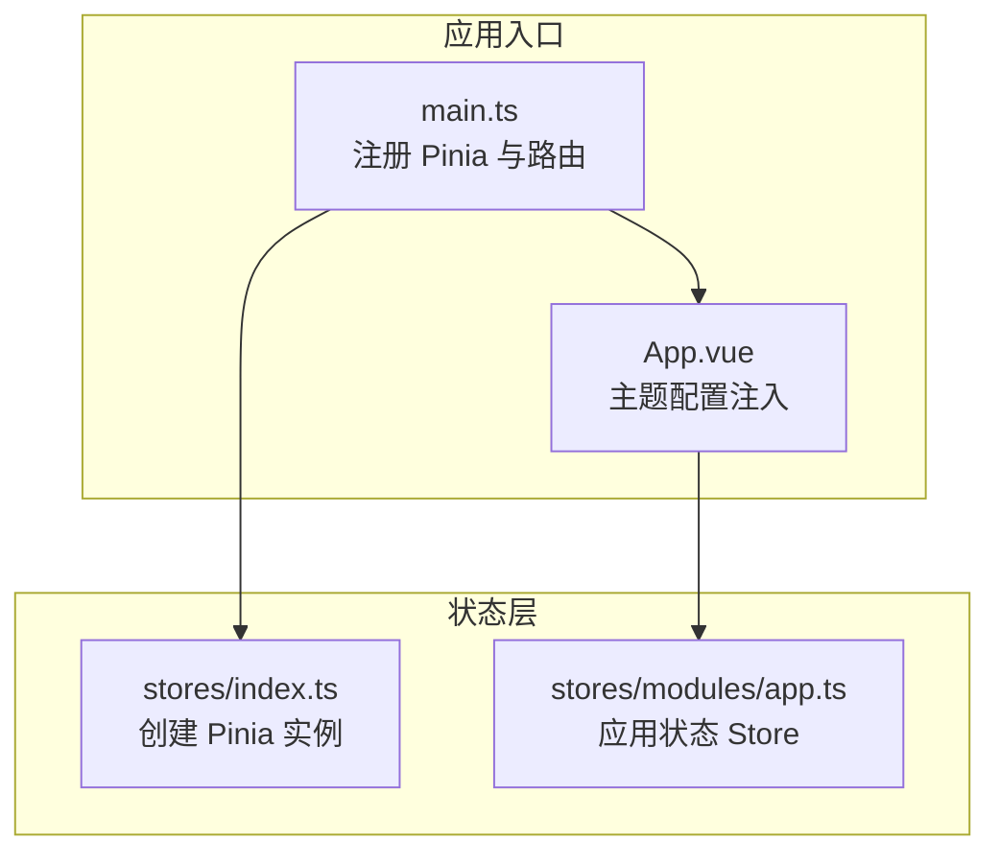
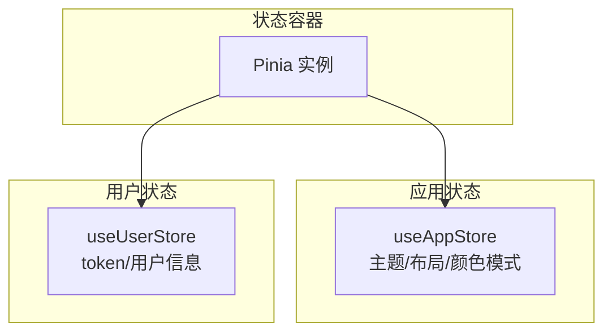
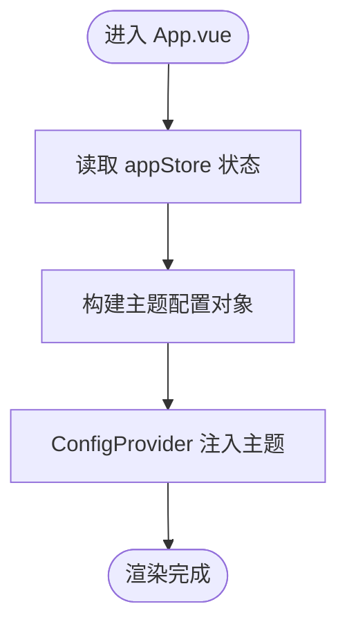
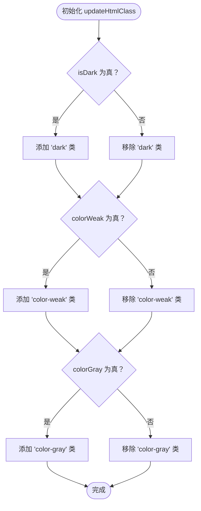
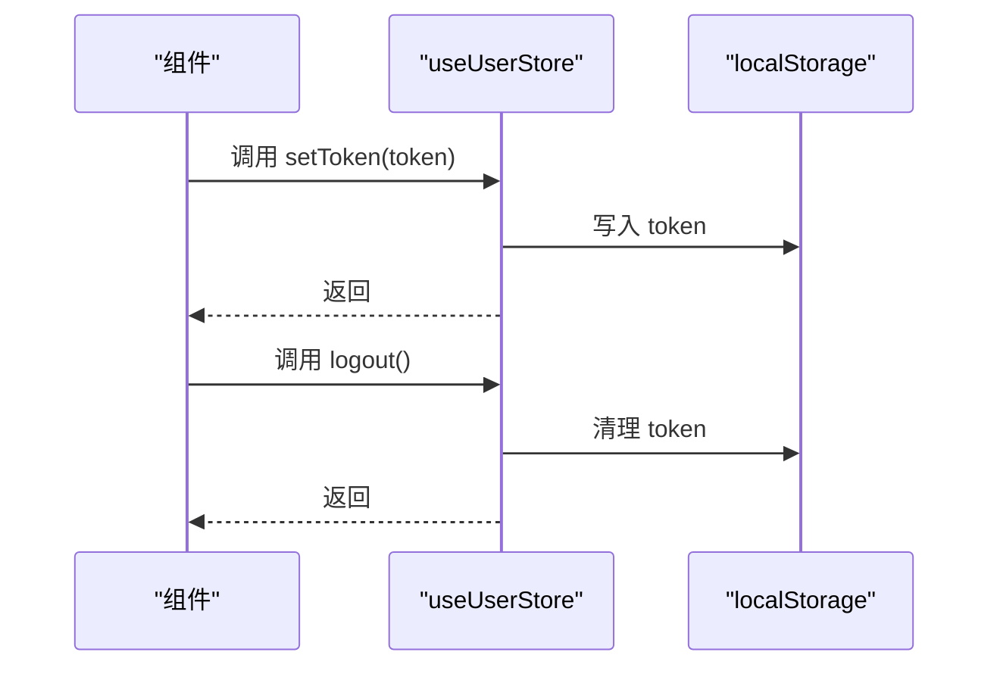
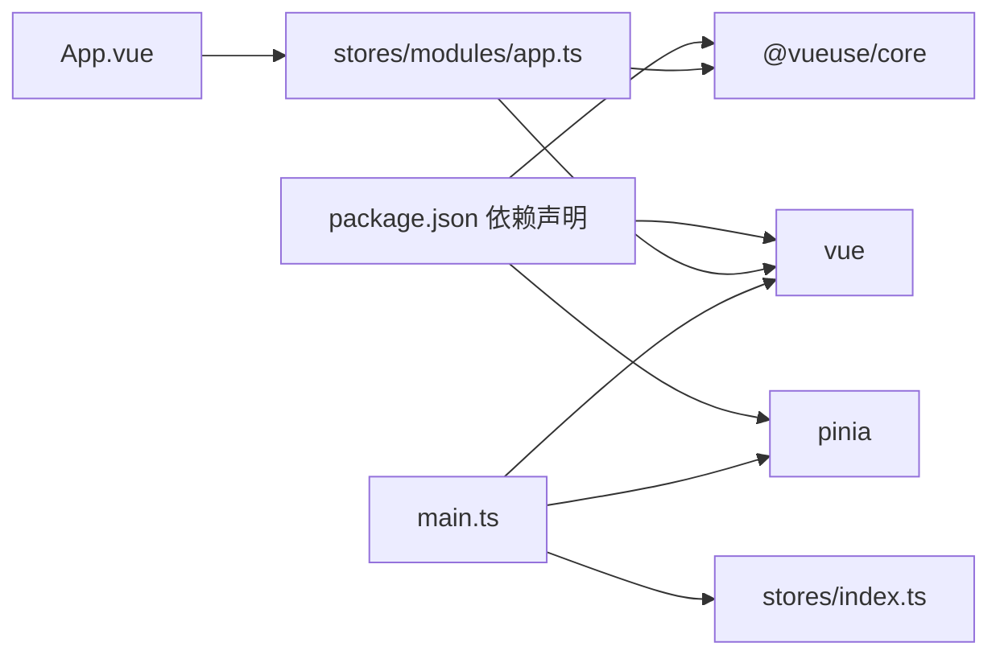

# 状态管理

<cite>
**本文引用的文件**
- [package.json](file://fast-ui/apps/admin-vue/package.json)
- [main.ts](file://fast-ui/apps/admin-vue/src/main.ts)
- [App.vue](file://fast-ui/apps/admin-vue/src/App.vue)
- [stores/index.ts](file://fast-ui/apps/admin-vue/src/stores/index.ts)
- [stores/modules/app.ts](file://fast-ui/apps/admin-vue/src/stores/modules/app.ts)
- [stores/user.ts](file://fast-ui/apps/customer-service-vue/src/stores/user.ts)
</cite>

## 目录
1. [简介](#简介)
2. [项目结构](#项目结构)
3. [核心组件](#核心组件)
4. [架构总览](#架构总览)
5. [详细组件分析](#详细组件分析)
6. [依赖分析](#依赖分析)
7. [性能考虑](#性能考虑)
8. [故障排查指南](#故障排查指南)
9. [结论](#结论)
10. [附录](#附录)

## 简介
本文件面向管理端 Vue 应用的状态管理，系统性解析基于 Pinia 的状态架构与实现，重点覆盖以下方面：
- Store 模块设计与职责划分
- 状态持久化与本地存储策略
- 状态同步机制与响应式更新
- 应用状态、字典数据与权限状态的管理策略
- Store 间的依赖关系、状态更新流程与副作用处理
- 状态恢复与跨组件共享
- 最佳实践、性能优化与调试技巧

## 项目结构
管理端前端位于 fast-ui/apps/admin-vue，状态管理通过 Pinia 提供，入口在 main.ts 中注册全局 Pinia 实例；应用主题与布局等通用状态由 stores/modules/app.ts 统一管理；App.vue 将主题配置注入到 UI 组件库。

**图表来源**
- [main.ts](file://fast-ui/apps/admin-vue/src/main.ts#L1-L16)
- [App.vue](file://fast-ui/apps/admin-vue/src/App.vue#L1-L41)
- [stores/index.ts](file://fast-ui/apps/admin-vue/src/stores/index.ts#L1-L6)
- [stores/modules/app.ts](file://fast-ui/apps/admin-vue/src/stores/modules/app.ts#L1-L93)

**章节来源**
- [main.ts](file://fast-ui/apps/admin-vue/src/main.ts#L1-L16)
- [App.vue](file://fast-ui/apps/admin-vue/src/App.vue#L1-L41)
- [stores/index.ts](file://fast-ui/apps/admin-vue/src/stores/index.ts#L1-L6)

## 核心组件
- Pinia 实例创建与挂载：在 stores/index.ts 创建 Pinia 实例，并在 main.ts 中全局注册，确保全应用可用。
- 应用状态 Store（app）：集中管理主题、布局、颜色模式、紧凑模式、标签页与面包屑显示等 UI 状态，并通过本地存储持久化。
- 用户状态 Store（customer-service-vue 示例）：演示用户登录态与本地存储的典型用法，可作为权限状态管理的参考实现。

**章节来源**
- [stores/index.ts](file://fast-ui/apps/admin-vue/src/stores/index.ts#L1-L6)
- [stores/modules/app.ts](file://fast-ui/apps/admin-vue/src/stores/modules/app.ts#L1-L93)
- [stores/user.ts](file://fast-ui/apps/customer-service-vue/src/stores/user.ts#L1-L25)

## 架构总览
Pinia 在本项目中的定位是“轻量、直观、类型安全”的状态容器。应用状态 Store 负责 UI 主题与布局偏好，用户状态 Store 负责登录态与用户信息。二者通过 Pinia 共享，避免跨组件重复请求与状态漂移。

**图表来源**
- [stores/index.ts](file://fast-ui/apps/admin-vue/src/stores/index.ts#L1-L6)
- [stores/modules/app.ts](file://fast-ui/apps/admin-vue/src/stores/modules/app.ts#L1-L93)
- [stores/user.ts](file://fast-ui/apps/customer-service-vue/src/stores/user.ts#L1-L25)

## 详细组件分析

### 应用状态 Store（app）
- 设计要点
  - 使用 @vueuse/core 的 useStorage 实现自动本地持久化，键名统一前缀以避免冲突。
  - 通过 watch 监听主题色变化，动态更新 HTML 的 CSS 变量，实现主题色即时生效。
  - 初始化时调用 updateHtmlClass，确保页面加载即具备正确的暗色/色弱/灰色模式类。
  - 提供切换暗色模式与更新 HTML 类的方法，便于视图层直接调用。
- 关键字段与行为
  - 主题相关：isDark、themeColor、siderTheme
  - 视觉与布局：colorWeak、colorGray、compactMode、layout、showTabs、showBreadcrumb
  - 方法：toggleDark、updateHtmlClass、updateCssVariables
- 响应式与副作用
  - 通过 ref 与 useStorage 返回的响应式值，配合 watch 实现主题色到 CSS 变量的映射。
  - 在 App.vue 中读取 appStore 的状态，动态生成 ConfigProvider 的主题配置。

**图表来源**
- [App.vue](file://fast-ui/apps/admin-vue/src/App.vue#L9-L33)

**图表来源**
- [stores/modules/app.ts](file://fast-ui/apps/admin-vue/src/stores/modules/app.ts#L34-L57)

**章节来源**
- [stores/modules/app.ts](file://fast-ui/apps/admin-vue/src/stores/modules/app.ts#L1-L93)
- [App.vue](file://fast-ui/apps/admin-vue/src/App.vue#L1-L41)

### 用户状态 Store（user，customer-service-vue 示例）
- 设计要点
  - 使用 ref 定义 token 与 userInfo，结合 localStorage 进行持久化。
  - 提供 setToken 与 logout 方法，统一写入与清理逻辑。
- 关键字段与行为
  - 字段：token、userInfo
  - 方法：setToken(newToken)、logout()
- 与权限状态的关系
  - 该 Store 展示了登录态与用户信息的持久化范式，可作为权限状态管理的基础模型。

**图表来源**
- [stores/user.ts](file://fast-ui/apps/customer-service-vue/src/stores/user.ts#L1-L25)

**章节来源**
- [stores/user.ts](file://fast-ui/apps/customer-service-vue/src/stores/user.ts#L1-L25)

### 字典数据与权限状态管理策略
- 字典数据
  - 建议在 app Store 或新增 dictionary Store 中维护字典缓存与版本控制，结合 useStorage 实现持久化。
  - 对于远程字典，采用“内存缓存 + 本地存储 + 过期时间”策略，避免频繁请求。
- 权限状态
  - 登录后拉取权限树/列表，写入用户 Store 或新建 permission Store。
  - 结合路由守卫与菜单渲染，按权限过滤不可见项。
  - 建议使用 computed 或派生状态，根据用户角色动态计算可访问资源集合。

[本节为概念性指导，不直接分析具体文件，故无“章节来源”]

## 依赖分析
- 外部依赖
  - Pinia：状态容器与 Store 定义
  - @vueuse/core：提供 useStorage 等组合式工具，简化本地持久化
  - vue：响应式系统与生命周期钩子
- 内部依赖
  - main.ts 依赖 stores/index.ts 创建的 Pinia 实例
  - App.vue 依赖 useAppStore 读取主题与布局状态
  - stores/modules/app.ts 依赖 @vueuse/core 与 vue 的响应式能力

**图表来源**
- [package.json](file://fast-ui/apps/admin-vue/package.json#L11-L40)
- [main.ts](file://fast-ui/apps/admin-vue/src/main.ts#L1-L16)
- [stores/index.ts](file://fast-ui/apps/admin-vue/src/stores/index.ts#L1-L6)
- [stores/modules/app.ts](file://fast-ui/apps/admin-vue/src/stores/modules/app.ts#L1-L93)

**章节来源**
- [package.json](file://fast-ui/apps/admin-vue/package.json#L11-L40)
- [main.ts](file://fast-ui/apps/admin-vue/src/main.ts#L1-L16)
- [stores/index.ts](file://fast-ui/apps/admin-vue/src/stores/index.ts#L1-L6)
- [stores/modules/app.ts](file://fast-ui/apps/admin-vue/src/stores/modules/app.ts#L1-L93)

## 性能考虑
- 响应式粒度
  - 将大对象拆分为细粒度状态，减少无关重渲染
- 持久化策略
  - 仅对必要字段做本地持久化，避免存储过大数据
  - 对频繁变更的状态使用防抖/节流
- 主题与样式
  - 通过 CSS 变量与 HTML 类切换实现主题切换，避免频繁重绘
- 计算属性与派生状态
  - 使用 computed 缓存派生结果，降低重复计算成本

[本节提供一般性建议，不直接分析具体文件，故无“章节来源”]

## 故障排查指南
- 主题不生效
  - 检查 appStore.updateHtmlClass 是否被调用，确认 HTML 上是否正确添加/移除类
  - 确认 watch 对 themeColor 的监听是否触发 updateCssVariables
- 主题色未持久化
  - 确认 useStorage 的键名是否正确，浏览器本地存储是否存在对应条目
- 登录态异常
  - 检查用户 Store 的 setToken 与 logout 是否正确写入/清理 localStorage
  - 确认组件中是否从 Store 读取 token，而非直接从本地存储读取

**章节来源**
- [stores/modules/app.ts](file://fast-ui/apps/admin-vue/src/stores/modules/app.ts#L34-L77)
- [stores/user.ts](file://fast-ui/apps/customer-service-vue/src/stores/user.ts#L1-L25)

## 结论
本项目采用 Pinia + @vueuse/core 的组合，实现了简洁而强大的状态管理：应用状态集中在 app Store，通过本地存储持久化并在运行时与 UI 主题联动；用户状态以 ref + localStorage 的方式管理，便于扩展为权限状态。建议后续在权限与字典层面补充专用 Store，并完善持久化与恢复策略，以提升可维护性与用户体验。

[本节为总结性内容，不直接分析具体文件，故无“章节来源”]

## 附录

### 状态持久化与恢复最佳实践
- 键名规范：统一前缀（如 app_）避免命名冲突
- 版本控制：对复杂结构增加版本号，支持迁移
- 异常处理：读取失败时回退默认值，保证应用可用
- 恢复顺序：先恢复基础状态，再执行副作用（如更新 HTML 类）

**章节来源**
- [stores/modules/app.ts](file://fast-ui/apps/admin-vue/src/stores/modules/app.ts#L6-L27)

### 跨组件状态共享与订阅模式
- 在组件中通过 useAppStore/useUserStore 获取状态与方法
- 通过 computed/computed-like 行为在模板中直接消费状态
- 对需要全局一致性的状态，优先放在 Pinia Store 中，避免局部重复

**章节来源**
- [App.vue](file://fast-ui/apps/admin-vue/src/App.vue#L5-L33)
- [stores/modules/app.ts](file://fast-ui/apps/admin-vue/src/stores/modules/app.ts#L79-L91)
- [stores/user.ts](file://fast-ui/apps/customer-service-vue/src/stores/user.ts#L4-L24)