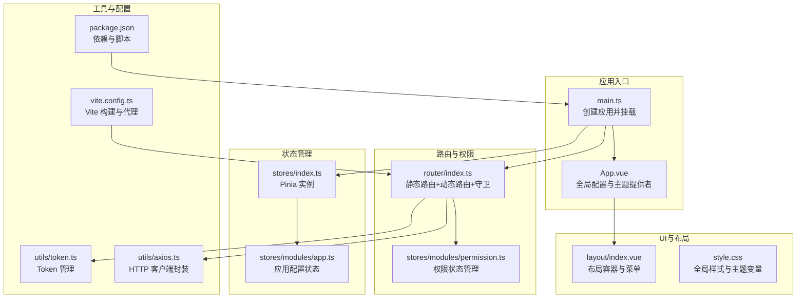
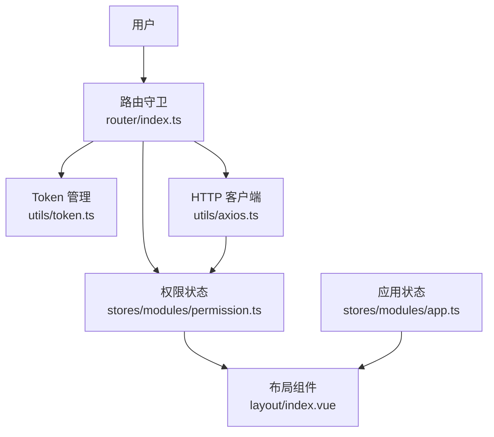
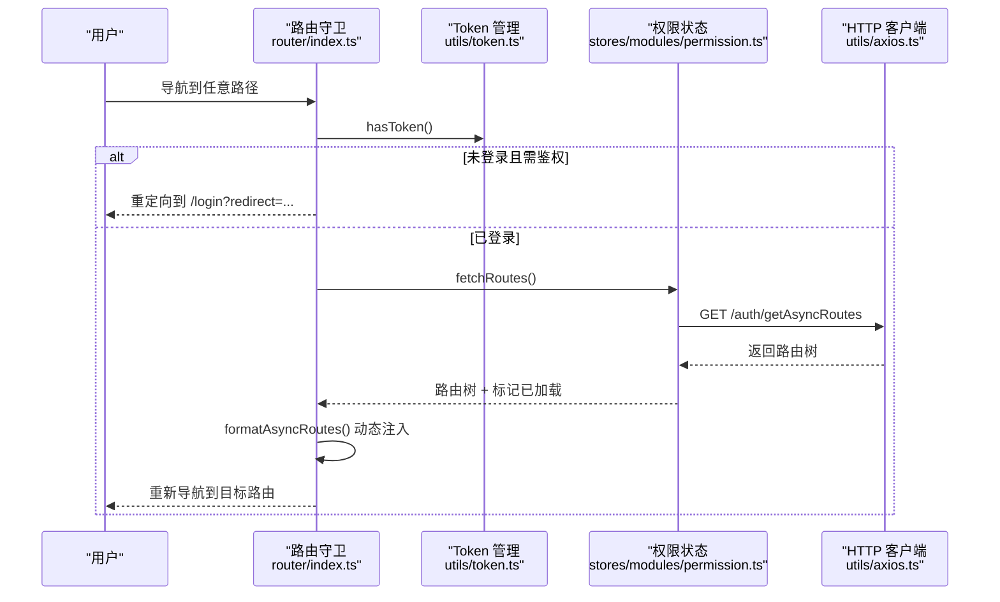
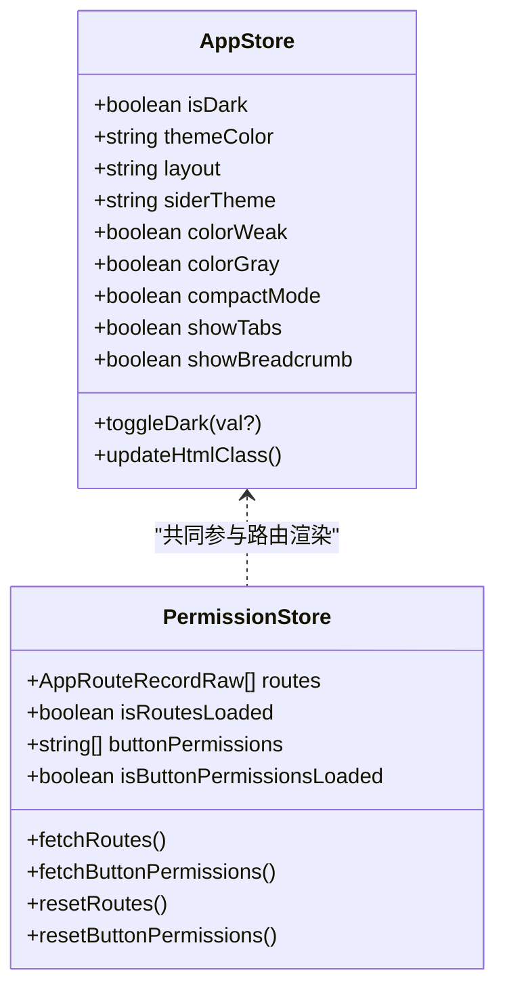
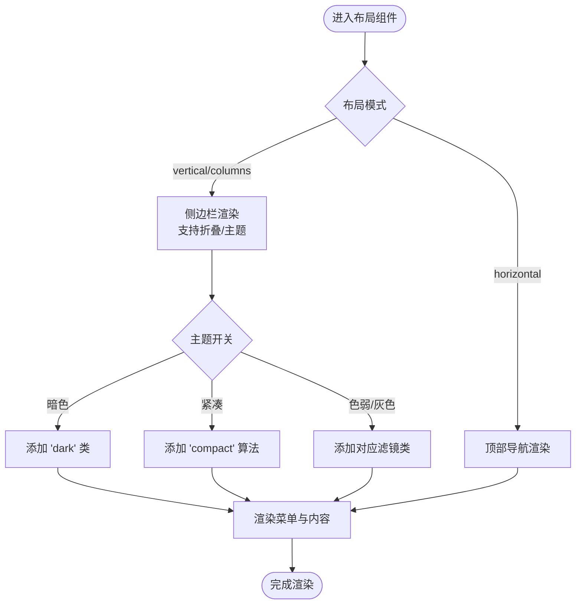
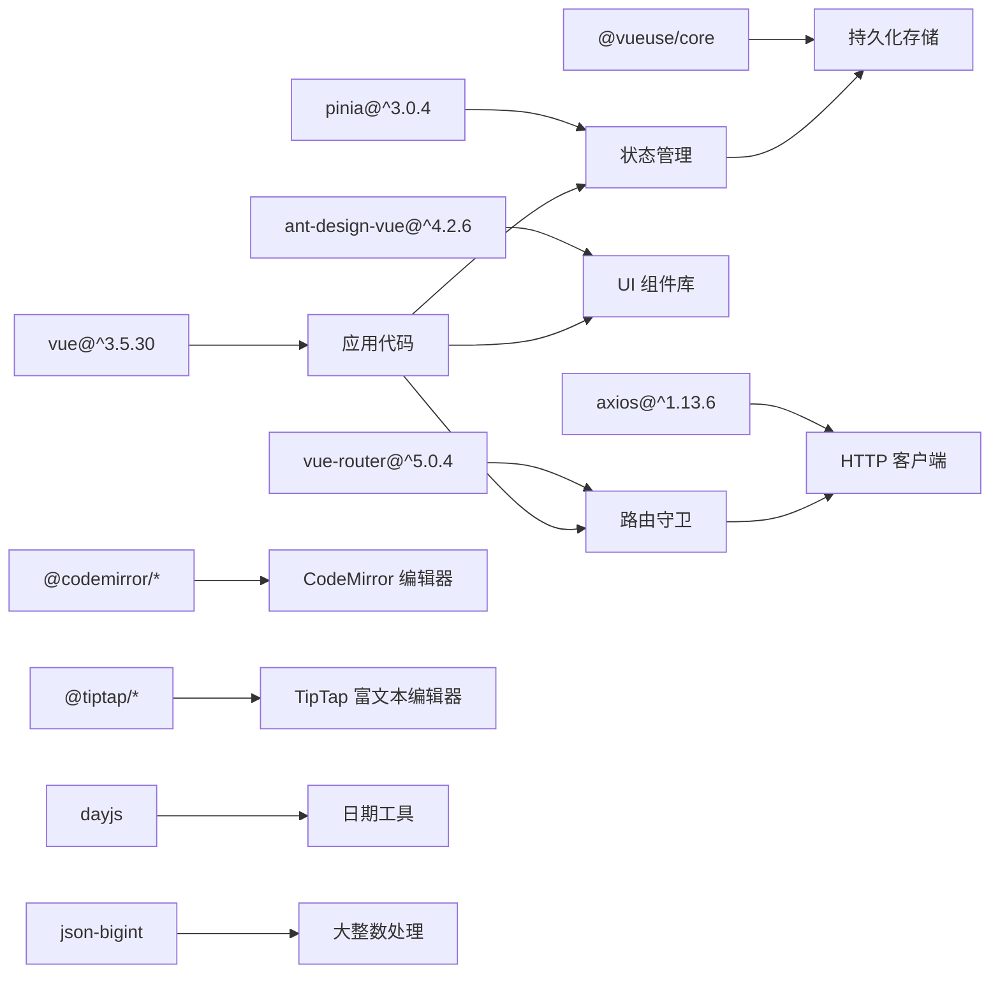

# 管理端Vue应用

<cite>
**本文引用的文件**
- [package.json](file://fast-ui/apps/admin-vue/package.json)
- [vite.config.ts](file://fast-ui/apps/admin-vue/vite.config.ts)
- [main.ts](file://fast-ui/apps/admin-vue/src/main.ts)
- [App.vue](file://fast-ui/apps/admin-vue/src/App.vue)
- [tsconfig.json](file://fast-ui/apps/admin-vue/tsconfig.json)
- [tsconfig.app.json](file://fast-ui/apps/admin-vue/tsconfig.app.json)
- [tsconfig.node.json](file://fast-ui/apps/admin-vue/tsconfig.node.json)
- [index.ts](file://fast-ui/apps/admin-vue/src/router/index.ts)
- [stores/index.ts](file://fast-ui/apps/admin-vue/src/stores/index.ts)
- [app.ts](file://fast-ui/apps/admin-vue/src/stores/modules/app.ts)
- [permission.ts](file://fast-ui/apps/admin-vue/src/stores/modules/permission.ts)
- [layout/index.vue](file://fast-ui/apps/admin-vue/src/layout/index.vue)
- [style.css](file://fast-ui/apps/admin-vue/src/style.css)
- [token.ts](file://fast-ui/apps/admin-vue/src/utils/token.ts)
- [axios.ts](file://fast-ui/apps/admin-vue/src/utils/axios.ts)
- [index.vue](file://fast-ui/apps/admin-vue/src/views/login/index.vue)
- [HomeView.vue](file://fast-ui/apps/admin-vue/src/views/HomeView.vue)
- [.env.development](file://fast-ui/apps/admin-vue/.env.development)
- [.env.production](file://fast-ui/apps/admin-vue/.env.production)
- [.env.example](file://fast-ui/apps/admin-vue/.env.example)
- [customer-vite.config.ts](file://fast-ui/apps/customer-service-vue/vite.config.ts)
- [customer-main.ts](file://fast-ui/apps/customer-service-vue/src/main.ts)
- [customer-package.json](file://fast-ui/apps/customer-service-vue/package.json)
</cite>

## 目录
1. [简介](#简介)
2. [项目结构](#项目结构)
3. [核心组件](#核心组件)
4. [架构总览](#架构总览)
5. [详细组件分析](#详细组件分析)
6. [依赖关系分析](#依赖关系分析)
7. [性能考虑](#性能考虑)
8. [故障排查指南](#故障排查指南)
9. [结论](#结论)
10. [附录](#附录)

## 简介
本项目是一个基于 Vue 3 + TypeScript 的现代化管理端前端应用，采用 Vite 构建工具，集成了 Ant Design Vue 组件库、Pinia 状态管理、Vue Router 路由与权限控制、Axios API 调用以及多种编辑器组件（TipTap 富文本编辑器、CodeMirror 代码编辑器）。项目通过动态路由与权限控制实现灵活的后台管理界面，支持暗色模式、紧凑模式、色弱/灰色模式等主题定制，并提供响应式布局与标签页导航。

## 项目结构
管理端应用位于 fast-ui/apps/admin-vue 目录下，采用按功能模块划分的目录组织方式：
- src/api：API 接口定义（示例：用户、角色、菜单等）
- src/assets：静态资源（图标、图片等）
- src/components：通用业务组件
- src/enums：枚举类型定义
- src/layout：布局组件（侧边栏、头部、标签页等）
- src/router：路由配置与权限守卫
- src/stores：Pinia 状态管理模块
- src/utils：工具函数（Token、Axios、日期等）
- src/views：页面级视图组件（登录、首页、个人中心等）

**图表来源**
- [main.ts](file://fast-ui/apps/admin-vue/src/main.ts#L1-L16)
- [App.vue](file://fast-ui/apps/admin-vue/src/App.vue#L1-L41)
- [index.ts](file://fast-ui/apps/admin-vue/src/router/index.ts#L1-L171)
- [permission.ts](file://fast-ui/apps/admin-vue/src/stores/modules/permission.ts#L1-L88)
- [stores/index.ts](file://fast-ui/apps/admin-vue/src/stores/index.ts#L1-L6)
- [app.ts](file://fast-ui/apps/admin-vue/src/stores/modules/app.ts#L1-L93)
- [layout/index.vue](file://fast-ui/apps/admin-vue/src/layout/index.vue#L1-L492)
- [style.css](file://fast-ui/apps/admin-vue/src/style.css#L1-L38)
- [token.ts](file://fast-ui/apps/admin-vue/src/utils/token.ts#L1-L43)
- [axios.ts](file://fast-ui/apps/admin-vue/src/utils/axios.ts)
- [vite.config.ts](file://fast-ui/apps/admin-vue/vite.config.ts#L1-L56)
- [package.json](file://fast-ui/apps/admin-vue/package.json#L1-L50)

**章节来源**
- [package.json](file://fast-ui/apps/admin-vue/package.json#L1-L50)
- [vite.config.ts](file://fast-ui/apps/admin-vue/vite.config.ts#L1-L56)
- [main.ts](file://fast-ui/apps/admin-vue/src/main.ts#L1-L16)
- [App.vue](file://fast-ui/apps/admin-vue/src/App.vue#L1-L41)
- [tsconfig.json](file://fast-ui/apps/admin-vue/tsconfig.json#L1-L8)

## 核心组件
- 应用入口与全局配置
  - 应用创建与挂载：在入口文件中创建 Vue 应用实例，注册 Pinia、Router、Ant Design Vue 插件，并在路由准备完成后挂载。
  - 全局主题提供者：通过 Ant Design Vue 的 ConfigProvider 提供本地化与主题配置，支持暗色、紧凑模式与自定义主色调。
- 路由与权限控制
  - 静态路由：登录页、首页、个人中心、404 等无需权限即可访问。
  - 动态路由：登录后从后端拉取路由树，格式化为 Vue Router 可识别的 RouteRecordRaw 结构并动态注入。
  - 路由守卫：在 beforeEach 中进行 Token 校验、动态路由加载与权限校验；在 afterEach 中设置页面标题。
- 状态管理（Pinia）
  - 应用状态：主题、布局、侧边栏风格、色弱/灰色模式、紧凑模式、标签页与面包屑显示等。
  - 权限状态：后端返回的路由树、按钮权限列表、加载状态等。
- 布局与主题
  - 响应式布局：支持 vertical、horizontal、columns 三种布局模式，移动端抽屉式侧边栏。
  - 主题系统：支持暗色模式、紧凑模式、色弱/灰色模式，CSS 变量驱动颜色与过渡效果。
- 编辑器组件
  - TipTap：富文本编辑器，集成高亮、拖拽光标、颜色、链接、占位符、表格、对齐、样式、下划线等扩展。
  - CodeMirror：代码编辑器，集成 JSON 语言与 One Dark 主题，配合 vue-codemirror 使用。

**章节来源**
- [main.ts](file://fast-ui/apps/admin-vue/src/main.ts#L1-L16)
- [App.vue](file://fast-ui/apps/admin-vue/src/App.vue#L1-L41)
- [index.ts](file://fast-ui/apps/admin-vue/src/router/index.ts#L1-L171)
- [permission.ts](file://fast-ui/apps/admin-vue/src/stores/modules/permission.ts#L1-L88)
- [app.ts](file://fast-ui/apps/admin-vue/src/stores/modules/app.ts#L1-L93)
- [layout/index.vue](file://fast-ui/apps/admin-vue/src/layout/index.vue#L1-L492)
- [package.json](file://fast-ui/apps/admin-vue/package.json#L11-L39)

## 架构总览
应用采用“入口 -> 路由 -> 权限 -> 状态 -> 布局”的分层架构，数据流向清晰，职责分离明确。

**图表来源**
- [index.ts](file://fast-ui/apps/admin-vue/src/router/index.ts#L107-L159)
- [permission.ts](file://fast-ui/apps/admin-vue/src/stores/modules/permission.ts#L29-L63)
- [app.ts](file://fast-ui/apps/admin-vue/src/stores/modules/app.ts#L1-L93)
- [layout/index.vue](file://fast-ui/apps/admin-vue/src/layout/index.vue#L1-L492)
- [token.ts](file://fast-ui/apps/admin-vue/src/utils/token.ts#L1-L43)
- [axios.ts](file://fast-ui/apps/admin-vue/src/utils/axios.ts)

## 详细组件分析

### 路由与权限控制流程
该流程展示了登录态校验、动态路由加载与权限守卫的完整过程。

**图表来源**
- [index.ts](file://fast-ui/apps/admin-vue/src/router/index.ts#L107-L159)
- [permission.ts](file://fast-ui/apps/admin-vue/src/stores/modules/permission.ts#L29-L43)
- [token.ts](file://fast-ui/apps/admin-vue/src/utils/token.ts#L29-L31)

**章节来源**
- [index.ts](file://fast-ui/apps/admin-vue/src/router/index.ts#L1-L171)
- [permission.ts](file://fast-ui/apps/admin-vue/src/stores/modules/permission.ts#L1-L88)
- [token.ts](file://fast-ui/apps/admin-vue/src/utils/token.ts#L1-L43)

### Pinia 状态管理模型
应用状态与权限状态分别由两个 Store 管理，职责清晰，便于维护与扩展。

**图表来源**
- [app.ts](file://fast-ui/apps/admin-vue/src/stores/modules/app.ts#L5-L92)
- [permission.ts](file://fast-ui/apps/admin-vue/src/stores/modules/permission.ts#L22-L87)

**章节来源**
- [app.ts](file://fast-ui/apps/admin-vue/src/stores/modules/app.ts#L1-L93)
- [permission.ts](file://fast-ui/apps/admin-vue/src/stores/modules/permission.ts#L1-L88)
- [stores/index.ts](file://fast-ui/apps/admin-vue/src/stores/index.ts#L1-L6)

### 布局与主题系统
布局组件支持多布局模式与响应式适配，主题系统通过 CSS 变量与 HTML 类名组合实现。

**图表来源**
- [layout/index.vue](file://fast-ui/apps/admin-vue/src/layout/index.vue#L1-L492)
- [app.ts](file://fast-ui/apps/admin-vue/src/stores/modules/app.ts#L29-L77)
- [style.css](file://fast-ui/apps/admin-vue/src/style.css#L1-L38)

**章节来源**
- [layout/index.vue](file://fast-ui/apps/admin-vue/src/layout/index.vue#L1-L492)
- [app.ts](file://fast-ui/apps/admin-vue/src/stores/modules/app.ts#L1-L93)
- [style.css](file://fast-ui/apps/admin-vue/src/style.css#L1-L38)

### 编辑器组件集成
- TipTap 富文本编辑器：通过 @tiptap/vue-3 与 Starter Kit 集成常用扩展，支持高亮、拖拽光标、颜色、链接、占位符、表格、对齐、样式、下划线等。
- CodeMirror 代码编辑器：通过 codemirror 与 vue-codemirror 集成，支持 JSON 语法与 One Dark 主题。

**章节来源**
- [package.json](file://fast-ui/apps/admin-vue/package.json#L15-L39)

## 依赖关系分析
应用的核心依赖与版本关系如下：

**图表来源**
- [package.json](file://fast-ui/apps/admin-vue/package.json#L11-L39)

**章节来源**
- [package.json](file://fast-ui/apps/admin-vue/package.json#L1-L50)

## 性能考虑
- 代码分割与懒加载
  - Vite 通过 import.meta.glob 动态导入视图组件，减少首屏体积。
  - 路由按需加载，避免一次性加载全部页面。
- 构建优化
  - Rollup 输出命名规则统一，静态资源分类存放，利于缓存。
  - manualChunks 将 vue 与 pinia 独立打包，提升缓存命中率。
- 运行时优化
  - Pinia 状态持久化使用 @vueuse/core 的 useStorage，减少重复初始化开销。
  - 布局与主题切换通过 CSS 变量与类名切换，避免频繁重排。

**章节来源**
- [vite.config.ts](file://fast-ui/apps/admin-vue/vite.config.ts#L26-L54)
- [index.ts](file://fast-ui/apps/admin-vue/src/router/index.ts#L48-L49)
- [app.ts](file://fast-ui/apps/admin-vue/src/stores/modules/app.ts#L6-L77)

## 故障排查指南
- 登录后无法进入页面
  - 检查路由守卫中的 Token 校验与动态路由加载逻辑。
  - 确认后端接口 /auth/getAsyncRoutes 返回的路由树格式正确。
- 动态路由未生效
  - 确认 formatAsyncRoutes 能正确匹配 views 下的组件路径。
  - 检查路由名称唯一性与 children 结构。
- 主题切换无效
  - 检查 App.vue 中 ConfigProvider 的 theme 配置与 app.ts 中算法数组拼接。
  - 确认 CSS 变量 --app-primary-color 等已更新。
- API 请求失败
  - 检查 utils/axios.ts 的拦截器与错误处理。
  - 确认 Vite 代理配置 /api 指向正确的后端地址。
- 开发环境跨域问题
  - 检查 .env.development 中的 VITE_BASE_API 与代理配置。
  - 确认代理 target 与 rewrite 规则。

**章节来源**
- [index.ts](file://fast-ui/apps/admin-vue/src/router/index.ts#L107-L159)
- [permission.ts](file://fast-ui/apps/admin-vue/src/stores/modules/permission.ts#L29-L43)
- [App.vue](file://fast-ui/apps/admin-vue/src/App.vue#L9-L33)
- [app.ts](file://fast-ui/apps/admin-vue/src/stores/modules/app.ts#L63-L77)
- [axios.ts](file://fast-ui/apps/admin-vue/src/utils/axios.ts)
- [vite.config.ts](file://fast-ui/apps/admin-vue/vite.config.ts#L13-L19)
- [.env.development](file://fast-ui/apps/admin-vue/.env.development)

## 结论
本项目以 Vue 3 + TypeScript 为基础，结合 Pinia、Ant Design Vue、Vue Router 与 Axios，构建了一个可扩展、可维护的管理端前端框架。通过动态路由与权限控制、完善的主题系统与响应式布局，满足后台管理场景的多样化需求。编辑器组件的集成进一步增强了内容管理能力。建议在后续迭代中完善 API 文档生成、单元测试覆盖与构建产物分析，持续优化用户体验与开发效率。

## 附录

### 开发环境配置
- 安装依赖
  - 使用 pnpm 管理依赖，执行安装命令后即可开始开发。
- 启动项目
  - 开发环境：执行 dev 脚本，启动 Vite 开发服务器，默认端口 1234。
  - 预览构建：执行 preview 脚本，查看生产构建效果。
- 环境变量
  - 在 .env.development 与 .env.production 中配置 VITE_APP_TITLE、VITE_APP_LOGO、VITE_BASE_API 等。
  - 示例文件参考 .env.example。

**章节来源**
- [package.json](file://fast-ui/apps/admin-vue/package.json#L6-L10)
- [vite.config.ts](file://fast-ui/apps/admin-vue/vite.config.ts#L9-L20)
- [.env.development](file://fast-ui/apps/admin-vue/.env.development)
- [.env.production](file://fast-ui/apps/admin-vue/.env.production)
- [.env.example](file://fast-ui/apps/admin-vue/.env.example)

### 构建与部署
- 构建命令
  - 生产构建：执行 build 脚本，输出至 dist 目录。
- 静态资源
  - 静态资源按类型分类存放，利于 CDN 缓存与性能优化。
- 代理配置
  - 通过 Vite 代理将 /api 前缀请求转发至后端服务，开发阶段避免跨域问题。

**章节来源**
- [package.json](file://fast-ui/apps/admin-vue/package.json#L6-L10)
- [vite.config.ts](file://fast-ui/apps/admin-vue/vite.config.ts#L13-L20)

### 调试与优化建议
- 调试技巧
  - 使用 Vue DevTools 检查组件层级与状态变更。
  - 在路由守卫中打印日志，定位动态路由注入问题。
- 优化建议
  - 对大型列表使用虚拟滚动组件。
  - 对高频主题切换操作进行节流/防抖处理。
  - 对第三方组件按需引入，减少打包体积。

**章节来源**
- [layout/index.vue](file://fast-ui/apps/admin-vue/src/layout/index.vue#L240-L248)
- [app.ts](file://fast-ui/apps/admin-vue/src/stores/modules/app.ts#L63-L77)