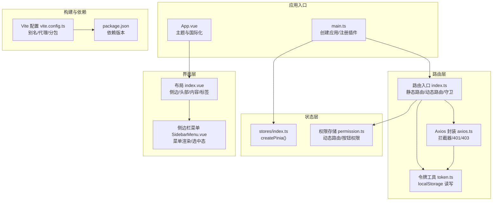
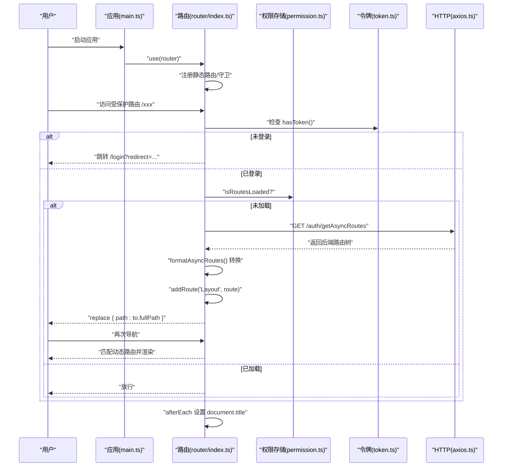
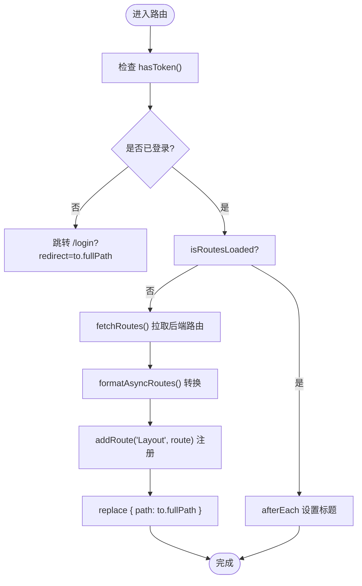
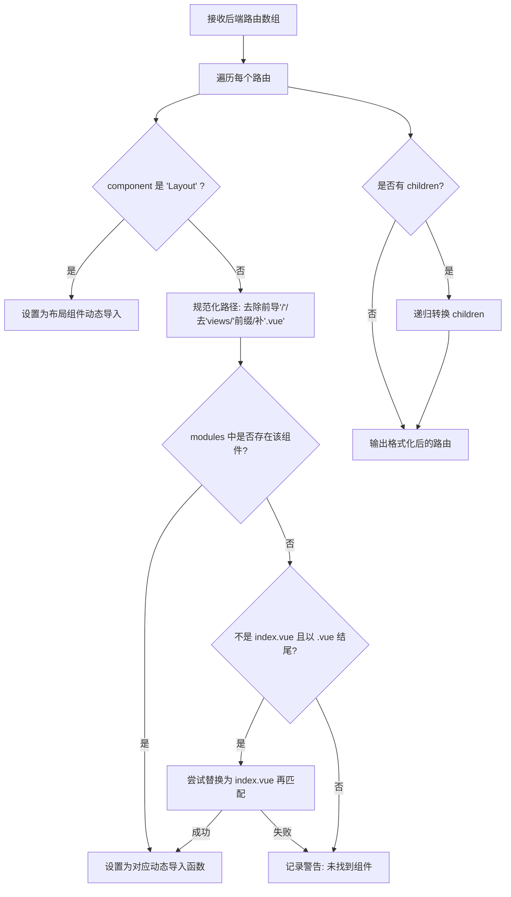
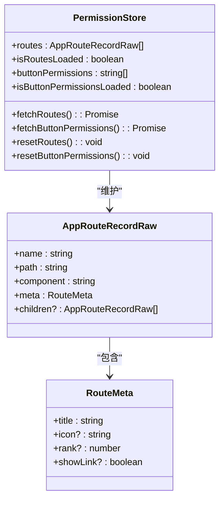
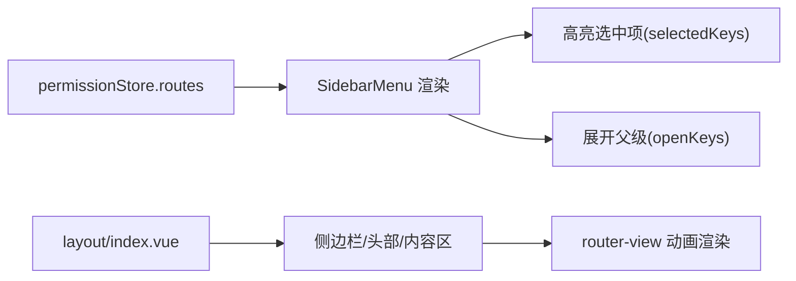
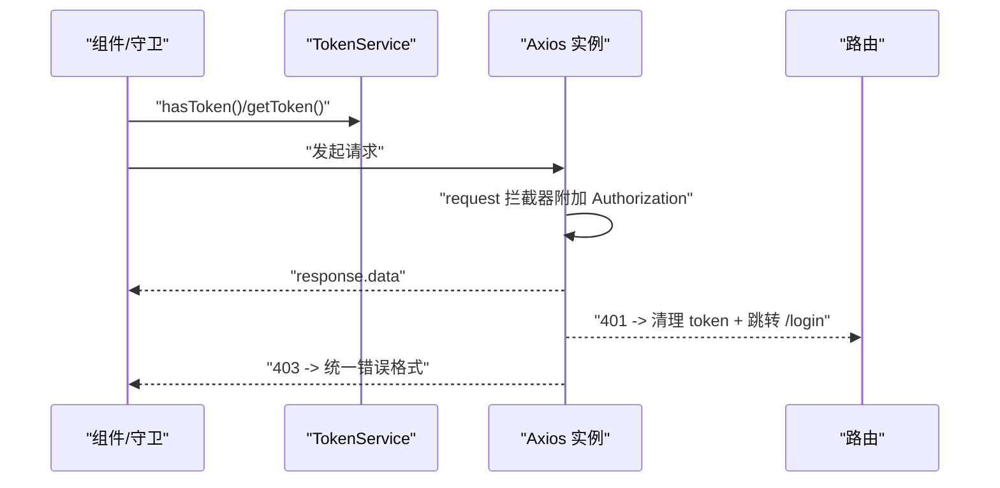
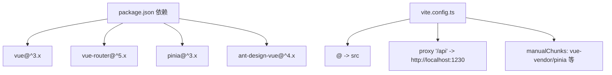

# 路由系统

<cite>
**本文引用的文件**
- [main.ts](file://fast-ui/apps/admin-vue/src/main.ts)
- [路由入口 index.ts](file://fast-ui/apps/admin-vue/src/router/index.ts)
- [权限存储 permission.ts](file://fast-ui/apps/admin-vue/src/stores/modules/permission.ts)
- [布局 index.vue](file://fast-ui/apps/admin-vue/src/layout/index.vue)
- [侧边栏菜单 SidebarMenu.vue](file://fast-ui/apps/admin-vue/src/layout/components/SidebarMenu.vue)
- [令牌工具 token.ts](file://fast-ui/apps/admin-vue/src/utils/token.ts)
- [Axios 封装 axios.ts](file://fast-ui/apps/admin-vue/src/utils/axios.ts)
- [应用入口 App.vue](file://fast-ui/apps/admin-vue/src/App.vue)
- [Vite 配置 vite.config.ts](file://fast-ui/apps/admin-vue/vite.config.ts)
- [包管理 package.json](file://fast-ui/apps/admin-vue/package.json)
</cite>

## 目录
1. [简介](#简介)
2. [项目结构](#项目结构)
3. [核心组件](#核心组件)
4. [架构总览](#架构总览)
5. [详细组件分析](#详细组件分析)
6. [依赖关系分析](#依赖关系分析)
7. [性能考量](#性能考量)
8. [故障排查指南](#故障排查指南)
9. [结论](#结论)
10. [附录](#附录)

## 简介
本文件面向管理端 Vue 应用的路由系统，基于 Vue Router 4 实现。系统采用“静态路由 + 动态路由”的混合架构：静态路由用于无需权限即可访问的页面（如登录、首页、404），动态路由由后端返回，前端完成格式转换与按需注册；通过路由守卫实现登录状态检查、权限校验与页面标题设置；配合 Pinia 状态管理持久化路由与按钮级权限；借助 Vite 的动态导入与构建优化实现懒加载与分包。

## 项目结构
管理端路由相关的核心文件组织如下：
- 应用入口：注册路由与状态管理，挂载应用
- 路由定义：静态路由、动态路由转换与注册、路由守卫
- 权限存储：动态路由与按钮权限的数据源与状态
- 布局与菜单：侧边栏、头部、标签页与内容区渲染
- 工具：令牌管理、HTTP 客户端拦截器
- 构建：Vite 配置与打包策略

图表来源
- [main.ts](file://fast-ui/apps/admin-vue/src/main.ts#L1-L16)
- [路由入口 index.ts](file://fast-ui/apps/admin-vue/src/router/index.ts#L1-L171)
- [权限存储 permission.ts](file://fast-ui/apps/admin-vue/src/stores/modules/permission.ts#L1-L88)
- [布局 index.vue](file://fast-ui/apps/admin-vue/src/layout/index.vue#L1-L492)
- [侧边栏菜单 SidebarMenu.vue](file://fast-ui/apps/admin-vue/src/layout/components/SidebarMenu.vue#L1-L537)
- [令牌工具 token.ts](file://fast-ui/apps/admin-vue/src/utils/token.ts#L1-L43)
- [Axios 封装 axios.ts](file://fast-ui/apps/admin-vue/src/utils/axios.ts#L1-L60)
- [Vite 配置 vite.config.ts](file://fast-ui/apps/admin-vue/vite.config.ts#L1-L56)
- [包管理 package.json](file://fast-ui/apps/admin-vue/package.json#L1-L50)

章节来源
- [main.ts](file://fast-ui/apps/admin-vue/src/main.ts#L1-L16)
- [路由入口 index.ts](file://fast-ui/apps/admin-vue/src/router/index.ts#L1-L171)
- [权限存储 permission.ts](file://fast-ui/apps/admin-vue/src/stores/modules/permission.ts#L1-L88)
- [布局 index.vue](file://fast-ui/apps/admin-vue/src/layout/index.vue#L1-L492)
- [侧边栏菜单 SidebarMenu.vue](file://fast-ui/apps/admin-vue/src/layout/components/SidebarMenu.vue#L1-L537)
- [令牌工具 token.ts](file://fast-ui/apps/admin-vue/src/utils/token.ts#L1-L43)
- [Axios 封装 axios.ts](file://fast-ui/apps/admin-vue/src/utils/axios.ts#L1-L60)
- [Vite 配置 vite.config.ts](file://fast-ui/apps/admin-vue/vite.config.ts#L1-L56)
- [包管理 package.json](file://fast-ui/apps/admin-vue/package.json#L1-L50)

## 核心组件
- 静态路由与基础布局：登录页、首页、个人中心、404 以及带嵌套的 Layout 布局
- 动态路由：后端返回树形路由，前端通过 import.meta.glob 进行组件动态导入与注册
- 路由守卫：前置守卫负责登录检查、动态路由加载与二次导航；后置守卫负责页面标题设置
- 权限存储：Pinia Store 维护动态路由、按钮权限、加载状态
- 令牌与鉴权：localStorage 存储 token，请求头携带 Authorization，401 自动清空并跳转登录
- 构建与懒加载：Vite 动态导入 + Rollup 分包策略，提升首屏与路由切换性能

章节来源
- [路由入口 index.ts](file://fast-ui/apps/admin-vue/src/router/index.ts#L7-L41)
- [路由入口 index.ts](file://fast-ui/apps/admin-vue/src/router/index.ts#L51-L104)
- [路由入口 index.ts](file://fast-ui/apps/admin-vue/src/router/index.ts#L106-L168)
- [权限存储 permission.ts](file://fast-ui/apps/admin-vue/src/stores/modules/permission.ts#L22-L86)
- [令牌工具 token.ts](file://fast-ui/apps/admin-vue/src/utils/token.ts#L3-L40)
- [Axios 封装 axios.ts](file://fast-ui/apps/admin-vue/src/utils/axios.ts#L25-L54)
- [Vite 配置 vite.config.ts](file://fast-ui/apps/admin-vue/vite.config.ts#L26-L52)

## 架构总览
系统采用“静态路由先行 + 动态路由按需注入”的模式。应用启动时注册静态路由与守卫，用户访问受保护路由时触发前置守卫：若未登录则跳转登录；若已登录但动态路由未加载，则向后端拉取并转换为 Vue Router 可识别的 RouteRecordRaw 结构，逐条添加至路由表，随后重定向回目标路由。后置守卫根据路由 meta.title 设置页面标题。

图表来源
- [main.ts](file://fast-ui/apps/admin-vue/src/main.ts#L10-L15)
- [路由入口 index.ts](file://fast-ui/apps/admin-vue/src/router/index.ts#L106-L168)
- [权限存储 permission.ts](file://fast-ui/apps/admin-vue/src/stores/modules/permission.ts#L29-L43)
- [令牌工具 token.ts](file://fast-ui/apps/admin-vue/src/utils/token.ts#L29-L31)
- [Axios 封装 axios.ts](file://fast-ui/apps/admin-vue/src/utils/axios.ts#L36-L54)

## 详细组件分析

### 路由守卫与导航策略
- 登录检查：前置守卫在进入任意路由前检查 token；若访问 /login 且已登录则重定向首页；若访问非公开路由且未登录则跳转登录并携带 redirect 参数
- 动态路由加载：首次访问受保护路由时，若 isRoutesLoaded 为 false，则调用 permissionStore.fetchRoutes 拉取后端路由树，formatAsyncRoutes 转换后逐条 addRoute('Layout', route)，然后 replace 重新导航，确保动态路由被正确匹配
- 错误处理：动态路由拉取失败时，若未登录则跳转登录，否则放行
- 页面标题：afterEach 从 to.meta.title 获取标题，不存在则回退到环境变量中的应用标题

图表来源
- [路由入口 index.ts](file://fast-ui/apps/admin-vue/src/router/index.ts#L106-L168)
- [权限存储 permission.ts](file://fast-ui/apps/admin-vue/src/stores/modules/permission.ts#L29-L43)
- [令牌工具 token.ts](file://fast-ui/apps/admin-vue/src/utils/token.ts#L29-L31)

章节来源
- [路由入口 index.ts](file://fast-ui/apps/admin-vue/src/router/index.ts#L106-L168)
- [权限存储 permission.ts](file://fast-ui/apps/admin-vue/src/stores/modules/permission.ts#L29-L43)
- [令牌工具 token.ts](file://fast-ui/apps/admin-vue/src/utils/token.ts#L29-L31)

### 动态路由转换与组件动态导入
- 后端路由格式：包含 name、path、component（字符串，可能为 Layout 或 views 目录下的相对路径）、meta、children 等字段
- 组件解析：通过 import.meta.glob('../views/**/*.vue') 预扫描所有视图组件；formatAsyncRoutes 对 component 字段进行处理：当为 'Layout' 时映射为布局组件；否则去除前导斜杠与可能的 views 前缀，补齐 .vue 后缀，尝试精确匹配或 index.vue 回退；若仍找不到则记录警告
- 子路由递归：children 数组同样递归转换，保证整棵路由树可用

图表来源
- [路由入口 index.ts](file://fast-ui/apps/admin-vue/src/router/index.ts#L51-L104)

章节来源
- [路由入口 index.ts](file://fast-ui/apps/admin-vue/src/router/index.ts#L48-L104)

### 权限存储与状态管理
- 数据模型：routes（动态路由树）、isRoutesLoaded（是否已加载）、buttonPermissions（按钮权限列表）、isButtonPermissionsLoaded（按钮权限加载状态）
- 接口契约：AppRouteRecordRaw 与 RouteMeta 定义路由与元信息字段
- 拉取与缓存：fetchRoutes 与 fetchButtonPermissions 在未加载时请求后端；加载成功后标记 isRoutesLoaded/isButtonPermissionsLoaded
- 重置：resetRoutes/resetButtonPermissions 清空状态，支持登出后重新加载

图表来源
- [权限存储 permission.ts](file://fast-ui/apps/admin-vue/src/stores/modules/permission.ts#L14-L20)
- [权限存储 permission.ts](file://fast-ui/apps/admin-vue/src/stores/modules/permission.ts#L22-L86)

章节来源
- [权限存储 permission.ts](file://fast-ui/apps/admin-vue/src/stores/modules/permission.ts#L1-L88)

### 布局与菜单渲染
- 布局：支持垂直/分栏/横向布局，侧边栏可折叠；移动端抽屉；内容区通过 router-view 渲染；提供 reload 触发路由实例重建
- 侧边栏菜单：根据 permissionStore.routes 渲染；支持图标动态解析；根据当前路由自动展开父级菜单并高亮选中项；分栏布局下支持窄侧栏与根路由切换
- 标题与图标：meta.title 作为菜单文案，meta.icon 支持 Ant Design Vue 图标名称

图表来源
- [布局 index.vue](file://fast-ui/apps/admin-vue/src/layout/index.vue#L108-L133)
- [侧边栏菜单 SidebarMenu.vue](file://fast-ui/apps/admin-vue/src/layout/components/SidebarMenu.vue#L27-L62)
- [侧边栏菜单 SidebarMenu.vue](file://fast-ui/apps/admin-vue/src/layout/components/SidebarMenu.vue#L154-L196)

章节来源
- [布局 index.vue](file://fast-ui/apps/admin-vue/src/layout/index.vue#L1-L492)
- [侧边栏菜单 SidebarMenu.vue](file://fast-ui/apps/admin-vue/src/layout/components/SidebarMenu.vue#L1-L537)

### 令牌与鉴权
- 令牌存储：localStorage 保存 token；移除 token 时同步清理标签页状态
- 请求拦截：在请求头附加 Authorization；响应拦截处理 401 清理 token 并跳转登录，403 返回统一错误格式
- 路由守卫联动：前置守卫依据 hasToken 控制导航

图表来源
- [令牌工具 token.ts](file://fast-ui/apps/admin-vue/src/utils/token.ts#L3-L40)
- [Axios 封装 axios.ts](file://fast-ui/apps/admin-vue/src/utils/axios.ts#L25-L54)
- [路由入口 index.ts](file://fast-ui/apps/admin-vue/src/router/index.ts#L106-L158)

章节来源
- [令牌工具 token.ts](file://fast-ui/apps/admin-vue/src/utils/token.ts#L1-L43)
- [Axios 封装 axios.ts](file://fast-ui/apps/admin-vue/src/utils/axios.ts#L1-L60)
- [路由入口 index.ts](file://fast-ui/apps/admin-vue/src/router/index.ts#L106-L158)

### 页面标题与面包屑
- 页面标题：afterEach 从 to.meta.title 设置 document.title，无 meta.title 时回退到应用标题
- 面包屑：当前代码未直接实现面包屑导航；可在布局或菜单组件中基于当前路由路径与 permissionStore.routes 的父子关系计算生成

章节来源
- [路由入口 index.ts](file://fast-ui/apps/admin-vue/src/router/index.ts#L161-L168)
- [布局 index.vue](file://fast-ui/apps/admin-vue/src/layout/index.vue#L108-L133)

## 依赖关系分析
- 版本与运行时：Vue 3、Vue Router 4、Pinia、Ant Design Vue
- 构建与分包：Vite 提供动态导入能力；Rollup 输出策略将 vue/pinia 等拆分为独立 chunk，减少重复与体积
- 代理与环境：开发服务器通过 /api 代理到后端服务，BASE_URL 与别名 @ 指向 src

图表来源
- [包管理 package.json](file://fast-ui/apps/admin-vue/package.json#L11-L39)
- [Vite 配置 vite.config.ts](file://fast-ui/apps/admin-vue/vite.config.ts#L7-L25)
- [Vite 配置 vite.config.ts](file://fast-ui/apps/admin-vue/vite.config.ts#L42-L51)

章节来源
- [包管理 package.json](file://fast-ui/apps/admin-vue/package.json#L1-L50)
- [Vite 配置 vite.config.ts](file://fast-ui/apps/admin-vue/vite.config.ts#L1-L56)

## 性能考量
- 路由懒加载：通过动态导入与 import.meta.glob 实现按需加载，避免一次性加载全部视图组件
- 构建分包：manualChunks 将 vue 与 pinia 等核心库单独打包，提升缓存命中率
- 资源命名：chunkFileNames/entryFileNames/assetFileNames 统一命名规则，便于 CDN 缓存与调试
- 路由切换动画：布局中对 router-view 使用过渡效果，兼顾体验与性能
- 令牌与请求拦截：统一处理 401/403，避免重复请求与无效渲染

章节来源
- [路由入口 index.ts](file://fast-ui/apps/admin-vue/src/router/index.ts#L48-L49)
- [Vite 配置 vite.config.ts](file://fast-ui/apps/admin-vue/vite.config.ts#L26-L52)
- [Axios 封装 axios.ts](file://fast-ui/apps/admin-vue/src/utils/axios.ts#L36-L54)

## 故障排查指南
- 动态路由未生效
  - 检查 permissionStore.isRoutesLoaded 是否为 true；确认 fetchRoutes 成功返回并赋值
  - 确认 formatAsyncRoutes 是否正确匹配到组件；查看控制台警告
- 401 未登录跳转异常
  - 检查 TokenService.hasToken 与请求拦截器是否正常附加 Authorization
  - 确认 Axios 响应拦截器在 401 时是否调用 TokenService.removeToken 并跳转 /login
- 403 权限不足
  - Axios 响应拦截器会将 403 转为统一错误格式；前端应提示并引导操作
- 页面标题未更新
  - 确认路由 meta.title 是否设置；afterEach 是否执行
- 菜单未高亮/展开
  - 检查 SidebarMenu 的 selectedKeys/openKeys 计算逻辑；watch 路由变化是否触发更新

章节来源
- [权限存储 permission.ts](file://fast-ui/apps/admin-vue/src/stores/modules/permission.ts#L29-L43)
- [路由入口 index.ts](file://fast-ui/apps/admin-vue/src/router/index.ts#L106-L168)
- [Axios 封装 axios.ts](file://fast-ui/apps/admin-vue/src/utils/axios.ts#L36-L54)
- [令牌工具 token.ts](file://fast-ui/apps/admin-vue/src/utils/token.ts#L29-L31)
- [侧边栏菜单 SidebarMenu.vue](file://fast-ui/apps/admin-vue/src/layout/components/SidebarMenu.vue#L154-L196)

## 结论
该路由系统以“静态路由 + 动态路由”为核心，结合路由守卫、权限存储与 HTTP 拦截器，实现了登录态校验、权限控制与页面标题管理。通过 Vite 动态导入与 Rollup 分包策略，兼顾了首屏性能与路由切换体验。建议后续完善面包屑导航与按钮级权限的可视化展示，进一步提升管理端的易用性与可维护性。

## 附录
- 路由元信息设计
  - 必填：title（页面标题/菜单文案）
  - 可选：icon（图标名称）、rank（排序）、showLink（是否显示在菜单）
- 路由注册最佳实践
  - 静态路由集中声明，动态路由统一转换与注册
  - 组件路径规范化，避免多前缀与大小写差异
  - 子路由递归转换，保持树形结构一致性
- 性能优化建议
  - 利用动态导入与分包策略，避免大体积单页
  - 适当缓存动态路由与按钮权限，减少重复请求
  - 401/403 统一处理，避免无效重试