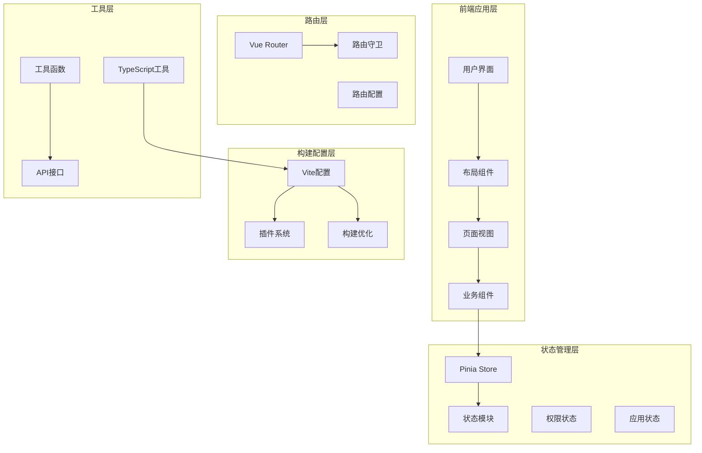
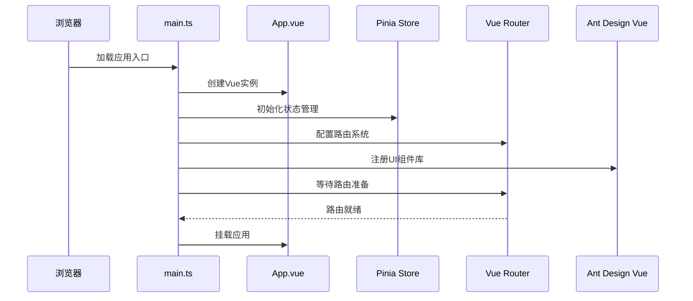
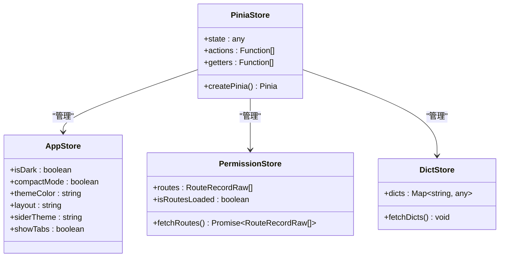
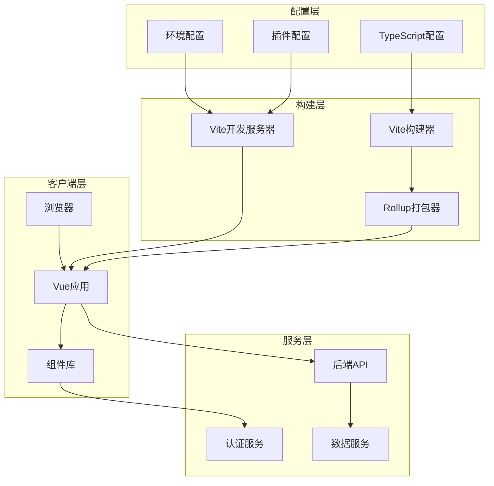
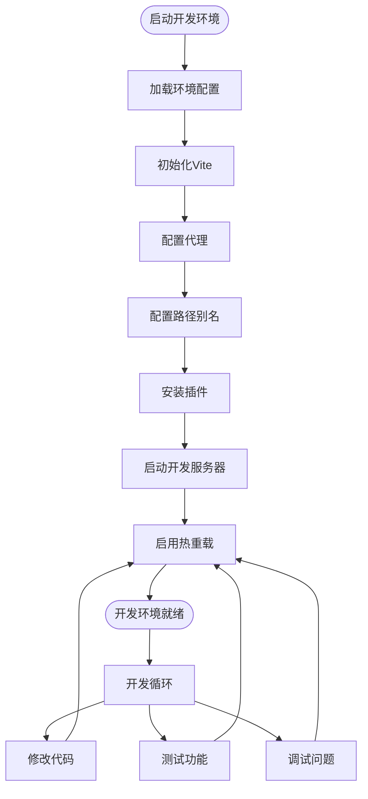
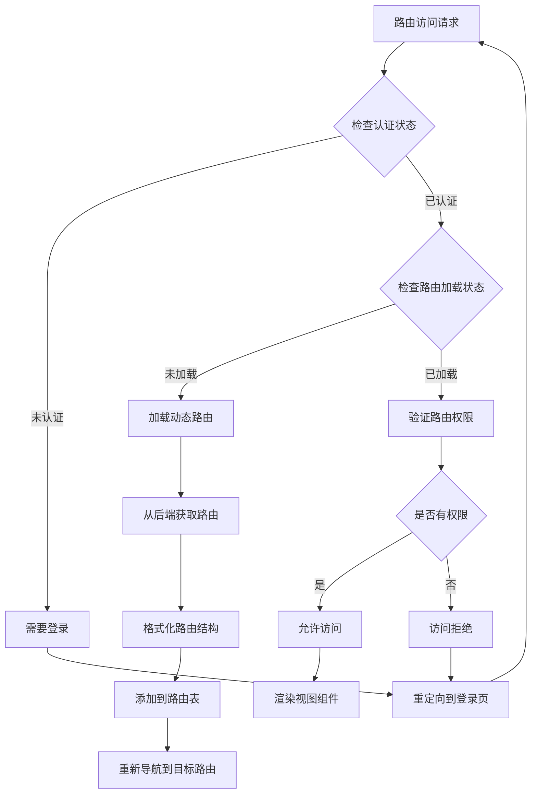
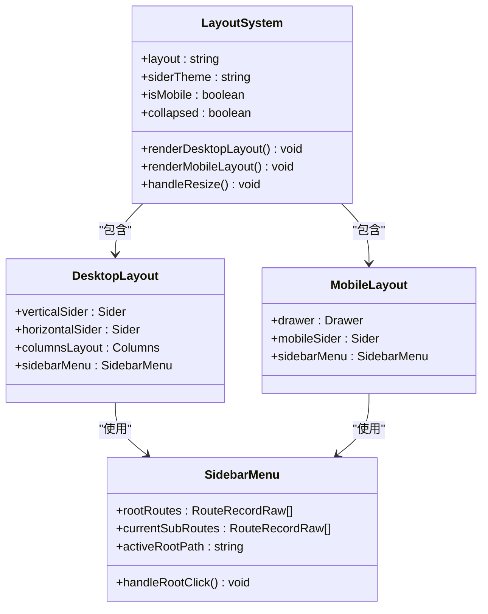
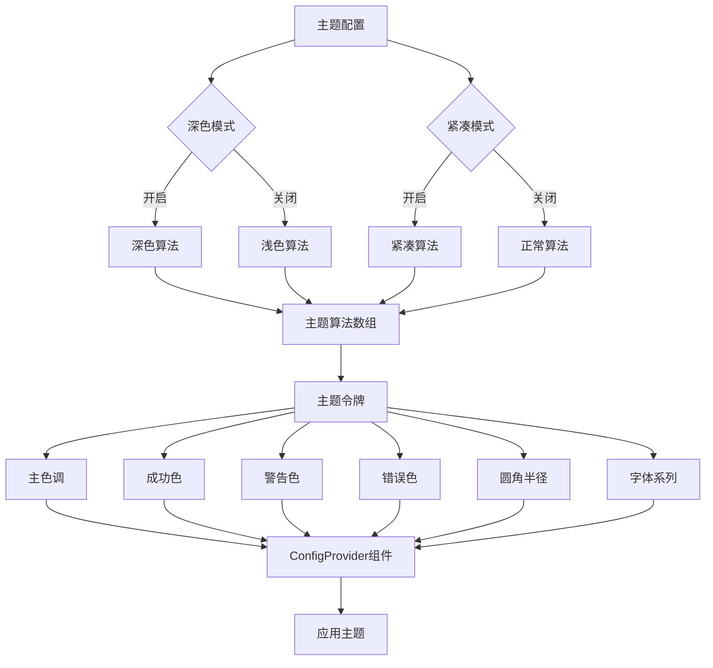
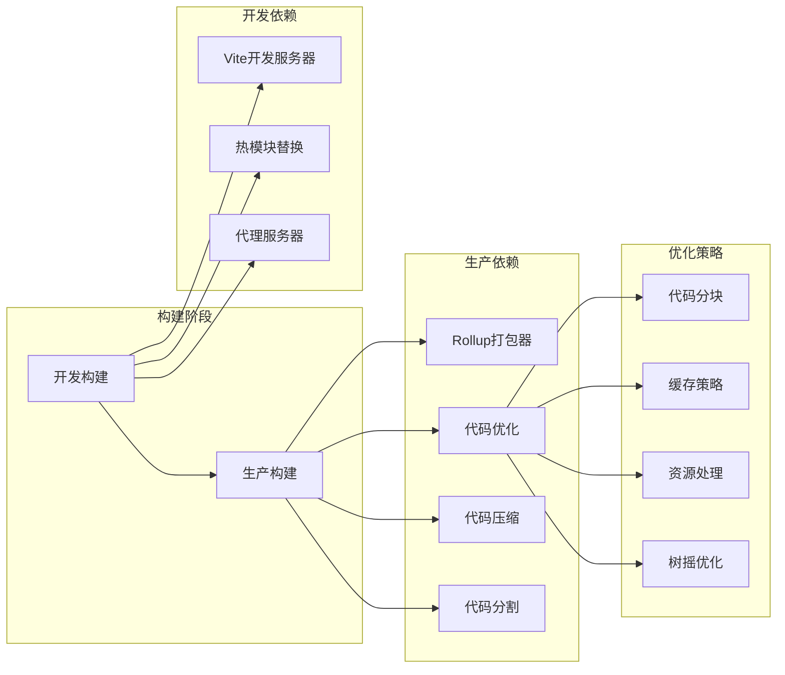
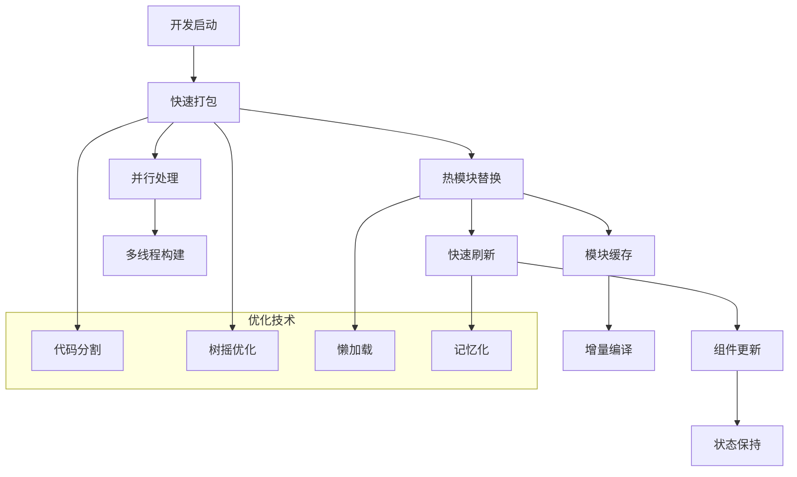

# 项目结构分析

<cite>
**本文档引用的文件**
- [package.json](file://fast-ui/apps/admin-vue/package.json)
- [vite.config.ts](file://fast-ui/apps/admin-vue/vite.config.ts)
- [tsconfig.json](file://fast-ui/apps/admin-vue/tsconfig.json)
- [tsconfig.app.json](file://fast-ui/apps/admin-vue/tsconfig.app.json)
- [tsconfig.node.json](file://fast-ui/apps/admin-vue/tsconfig.node.json)
- [main.ts](file://fast-ui/apps/admin-vue/src/main.ts)
- [App.vue](file://fast-ui/apps/admin-vue/src/App.vue)
- [index.html](file://fast-ui/apps/admin-vue/index.html)
- [.env.development](file://fast-ui/apps/admin-vue/.env.development)
- [.env.production](file://fast-ui/apps/admin-vue/.env.production)
- [router/index.ts](file://fast-ui/apps/admin-vue/src/router/index.ts)
- [stores/index.ts](file://fast-ui/apps/admin-vue/src/stores/index.ts)
- [layout/index.vue](file://fast-ui/apps/admin-vue/src/layout/index.vue)
</cite>

## 目录
1. [简介](#简介)
2. [项目结构](#项目结构)
3. [核心组件](#核心组件)
4. [架构概览](#架构概览)
5. [详细组件分析](#详细组件分析)
6. [依赖关系分析](#依赖关系分析)
7. [性能考虑](#性能考虑)
8. [故障排除指南](#故障排除指南)
9. [结论](#结论)

## 简介

这是一个基于Vite + Vue 3 + TypeScript的现代化前端管理端应用项目。项目采用企业级架构设计，集成了Ant Design Vue组件库、Pinia状态管理和Vue Router路由系统，提供了完整的开发和生产构建配置。

该项目的核心特点包括：
- 基于Vite的快速开发体验和热重载功能
- TypeScript类型安全保证
- 模块化的目录结构设计
- 灵活的构建优化配置
- 完整的开发环境配置

## 项目结构

### 整体架构设计



**图表来源**
- [main.ts](file://fast-ui/apps/admin-vue/src/main.ts#L1-L16)
- [router/index.ts](file://fast-ui/apps/admin-vue/src/router/index.ts#L1-L171)
- [stores/index.ts](file://fast-ui/apps/admin-vue/src/stores/index.ts#L1-L6)

### 目录组织原则

项目采用了清晰的分层架构模式：

1. **应用入口层** (`src/`)
   - `main.ts`: 应用启动入口
   - `App.vue`: 根组件
   - `style.css`: 全局样式

2. **功能模块层** (`src/`)
   - `api/`: API接口定义
   - `components/`: 可复用组件
   - `enums/`: 枚举类型定义
   - `layout/`: 布局组件
   - `router/`: 路由配置
   - `stores/`: Pinia状态管理
   - `utils/`: 工具函数
   - `views/`: 页面视图组件

3. **配置文件层**
   - `vite.config.ts`: Vite构建配置
   - `tsconfig.json`: TypeScript配置
   - `.env.*`: 环境变量配置

**章节来源**
- [main.ts](file://fast-ui/apps/admin-vue/src/main.ts#L1-L16)
- [App.vue](file://fast-ui/apps/admin-vue/src/App.vue#L1-L41)
- [layout/index.vue](file://fast-ui/apps/admin-vue/src/layout/index.vue#L1-L492)

## 核心组件

### 应用启动流程

应用启动采用渐进式初始化策略，确保各模块按顺序加载：



**图表来源**
- [main.ts](file://fast-ui/apps/admin-vue/src/main.ts#L1-L16)
- [App.vue](file://fast-ui/apps/admin-vue/src/App.vue#L1-L41)

### 状态管理系统

项目采用Pinia作为状态管理解决方案，提供了类型安全的状态管理：



**图表来源**
- [stores/index.ts](file://fast-ui/apps/admin-vue/src/stores/index.ts#L1-L6)
- [layout/index.vue](file://fast-ui/apps/admin-vue/src/layout/index.vue#L84-L96)

**章节来源**
- [stores/index.ts](file://fast-ui/apps/admin-vue/src/stores/index.ts#L1-L6)
- [layout/index.vue](file://fast-ui/apps/admin-vue/src/layout/index.vue#L84-L96)

## 架构概览

### 系统架构图



**图表来源**
- [vite.config.ts](file://fast-ui/apps/admin-vue/vite.config.ts#L1-L56)
- [package.json](file://fast-ui/apps/admin-vue/package.json#L1-L50)

### 开发环境架构



**图表来源**
- [vite.config.ts](file://fast-ui/apps/admin-vue/vite.config.ts#L9-L25)
- [.env.development](file://fast-ui/apps/admin-vue/.env.development#L1-L9)

## 详细组件分析

### 路由系统分析

项目实现了复杂的路由系统，支持静态路由和动态路由混合模式：



**图表来源**
- [router/index.ts](file://fast-ui/apps/admin-vue/src/router/index.ts#L107-L159)

#### 路由守卫实现

路由系统包含两个级别的守卫机制：

1. **前置守卫** (`beforeEach`): 处理认证和动态路由加载
2. **后置守卫** (`afterEach`): 处理页面标题设置

**章节来源**
- [router/index.ts](file://fast-ui/apps/admin-vue/src/router/index.ts#L107-L168)

### 布局系统分析

布局系统支持多种布局模式和响应式设计：



**图表来源**
- [layout/index.vue](file://fast-ui/apps/admin-vue/src/layout/index.vue#L1-L492)

#### 响应式布局实现

布局系统根据屏幕尺寸自动切换不同的显示模式：

- **桌面端** (`width >= 768px`): 显示完整侧边栏和主内容区域
- **移动端** (`width < 768px`): 使用抽屉式侧边栏

**章节来源**
- [layout/index.vue](file://fast-ui/apps/admin-vue/src/layout/index.vue#L226-L248)

### 主题系统分析

应用实现了灵活的主题定制系统，支持深色模式和紧凑模式：



**图表来源**
- [App.vue](file://fast-ui/apps/admin-vue/src/App.vue#L9-L33)

**章节来源**
- [App.vue](file://fast-ui/apps/admin-vue/src/App.vue#L1-L41)

## 依赖关系分析

### 依赖管理策略

项目采用分层依赖管理模式：

```mermaid
graph TB
subgraph "运行时依赖"
Vue[Vue 3.5.30]
Router[Vue Router 5.0.4]
Pinia[Pinia 3.0.4]
Antd[Ant Design Vue 4.2.6]
Axios[Axios 1.13.6]
Dayjs[Dayjs 1.11.20]
end
subgraph "开发时依赖"
Vite[Vite 8.0.1]
TS[TypeScript ~5.9.3]
VueTS[vue-tsc 3.2.5]
VuePlugin[@vitejs/plugin-vue 6.0.5]
TSConfig[@vue/tsconfig 0.9.0]
NodeTypes[@types/node 24.12.0]
end
subgraph "UI组件库"
Icons[Ant Design Icons 7.0.1]
TipTap[Tiptap 2.26.1]
CodeMirror[CodeMirror 6.0.2]
end
subgraph "工具库"
VueUse[VueUse 14.2.1]
JSONBig[JSON Bigint 1.0.0]
end
Vue --> Router
Vue --> Pinia
Vue --> Antd
Vue --> Axios
Vue --> Dayjs
Vue --> VueUse
Vue --> JSONBig
Vite --> VuePlugin
Vite --> TS
TS --> VueTS
TS --> TSConfig
TS --> NodeTypes
```

**图表来源**
- [package.json](file://fast-ui/apps/admin-vue/package.json#L11-L48)

### 构建依赖分析



**图表来源**
- [vite.config.ts](file://fast-ui/apps/admin-vue/vite.config.ts#L26-L54)

**章节来源**
- [package.json](file://fast-ui/apps/admin-vue/package.json#L1-L50)
- [vite.config.ts](file://fast-ui/apps/admin-vue/vite.config.ts#L1-L56)

## 性能考虑

### 构建优化策略

项目实施了多层次的性能优化策略：

1. **代码分割优化**
   - 自动代码分割到`vue-vendor`和`element-plus`等独立chunk
   - 按需加载路由组件
   - 动态导入视图组件

2. **资源优化**
   - 智能资产文件命名策略
   - 图片、字体等静态资源分类存储
   - CSS文件单独处理

3. **缓存策略**
   - 文件哈希命名避免缓存问题
   - 长期缓存配置
   - 浏览器缓存优化

### 开发性能优化



**图表来源**
- [vite.config.ts](file://fast-ui/apps/admin-vue/vite.config.ts#L42-L51)

## 故障排除指南

### 常见问题诊断

#### 路由加载问题

**症状**: 动态路由无法正确加载或显示

**排查步骤**:
1. 检查后端路由API响应格式
2. 验证`formatAsyncRoutes`函数处理逻辑
3. 确认路由权限验证逻辑
4. 查看浏览器控制台错误信息

**解决方案**:
- 确保后端返回的路由数据符合预期格式
- 检查组件路径解析逻辑
- 验证路由元信息配置

#### 主题切换问题

**症状**: 深色模式切换无效或样式异常

**排查步骤**:
1. 检查`appStore.isDark`状态值
2. 验证主题算法组合逻辑
3. 确认CSS变量覆盖顺序
4. 查看浏览器开发者工具样式面板

**解决方案**:
- 确保主题算法正确组合
- 检查CSS优先级冲突
- 验证主题令牌配置

#### 构建问题

**症状**: 开发服务器启动失败或构建报错

**排查步骤**:
1. 检查Node.js版本兼容性
2. 验证Vite配置文件语法
3. 确认依赖包完整性
4. 查看详细错误日志

**解决方案**:
- 更新Node.js到推荐版本
- 清理node_modules重新安装
- 检查防火墙和端口占用

**章节来源**
- [router/index.ts](file://fast-ui/apps/admin-vue/src/router/index.ts#L143-L150)
- [App.vue](file://fast-ui/apps/admin-vue/src/App.vue#L9-L33)

## 结论

这个基于Vite + Vue 3 + TypeScript的管理端应用项目展现了现代前端开发的最佳实践。项目通过合理的架构设计、完善的配置管理和丰富的功能实现，为企业级应用开发提供了坚实的基础。

### 主要优势

1. **架构清晰**: 分层设计使得代码结构易于理解和维护
2. **性能优秀**: 多层次的优化策略确保了良好的用户体验
3. **开发友好**: 完善的开发工具链提升了开发效率
4. **扩展性强**: 模块化设计便于功能扩展和维护

### 技术亮点

- **TypeScript集成**: 提供完整的类型安全保障
- **现代化构建**: Vite带来的极速开发体验
- **组件化设计**: 高度可复用的组件架构
- **状态管理**: Pinia提供的简洁状态管理方案

### 发展建议

1. **持续优化**: 根据实际使用情况继续优化性能
2. **文档完善**: 补充更多的开发文档和API文档
3. **测试覆盖**: 增加单元测试和集成测试覆盖率
4. **监控体系**: 建立应用性能监控和错误追踪体系