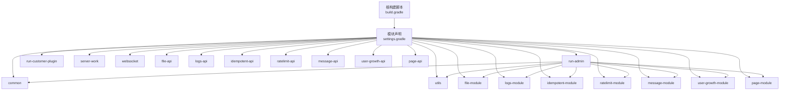
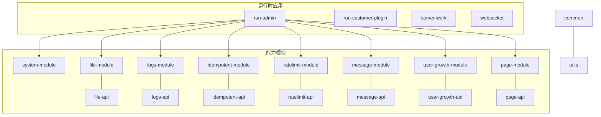
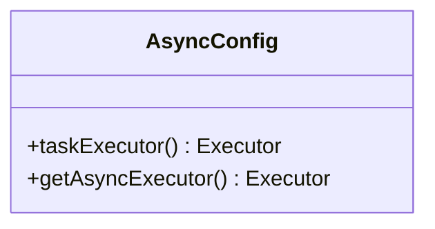
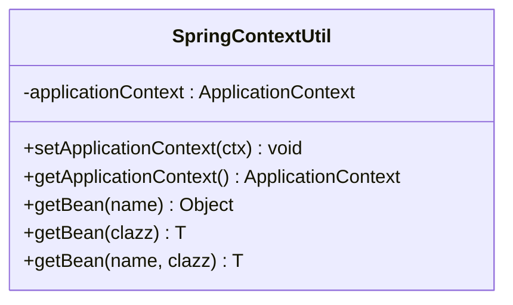
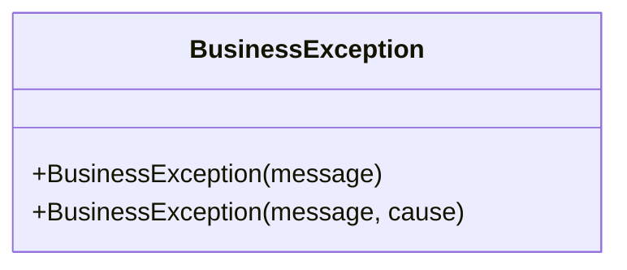
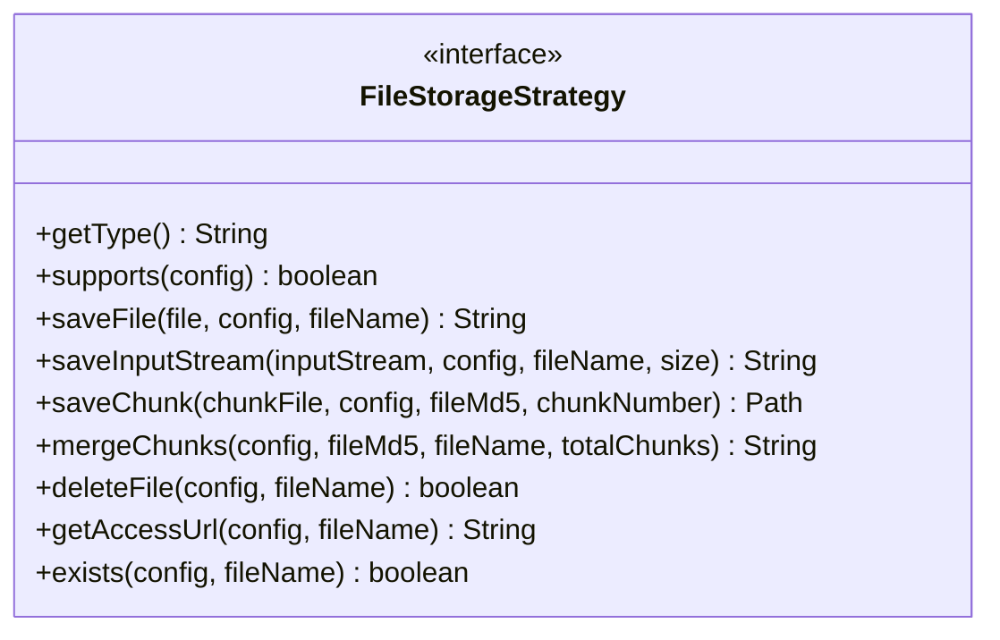
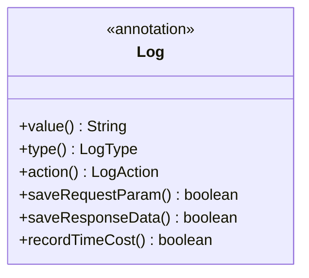
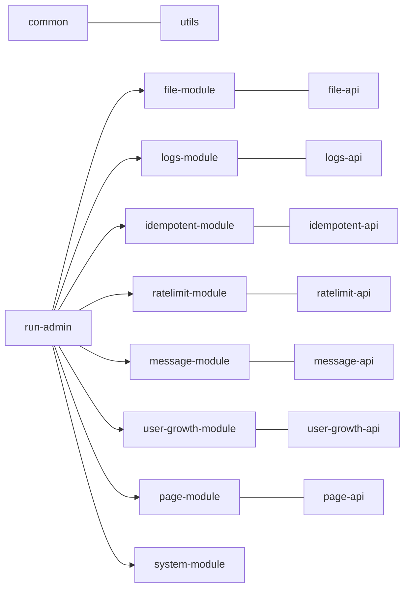

# 开发指南

<cite>
**本文引用的文件**
- [build.gradle](file://build.gradle)
- [settings.gradle](file://settings.gradle)
- [gradle.properties](file://gradle.properties)
- [common/build.gradle](file://common/build.gradle)
- [run-admin/build.gradle](file://run-admin/build.gradle)
- [common/src/main/java/com/fastproject/config/AsyncConfig.java](file://common/src/main/java/com/fastproject/config/AsyncConfig.java)
- [common/src/main/java/com/fastproject/utils/SpringContextUtil.java](file://common/src/main/java/com/fastproject/utils/SpringContextUtil.java)
- [common/src/main/java/com/fastproject/exception/BusinessException.java](file://common/src/main/java/com/fastproject/exception/BusinessException.java)
- [file-module/src/main/java/com/fastproject/file/storage/FileStorageStrategy.java](file://file-module/src/main/java/com/fastproject/file/storage/FileStorageStrategy.java)
- [logs-api/src/main/java/com/fastproject/logs/annotation/Log.java](file://logs-api/src/main/java/com/fastproject/logs/annotation/Log.java)
- [fast-ui/apps/admin-vue/package.json](file://fast-ui/apps/admin-vue/package.json)
- [fast-ui/apps/customer-service-vue/package.json](file://fast-ui/apps/customer-service-vue/package.json)
- [AGENTS.md](file://AGENTS.md)
- [.idea/misc.xml](file://.idea/misc.xml)
</cite>

## 目录
1. [简介](#简介)
2. [项目结构](#项目结构)
3. [核心组件](#核心组件)
4. [架构总览](#架构总览)
5. [详细组件分析](#详细组件分析)
6. [依赖分析](#依赖分析)
7. [性能考虑](#性能考虑)
8. [故障排查指南](#故障排查指南)
9. [结论](#结论)
10. [附录](#附录)

## 简介
本开发指南面向贡献者与维护者，系统阐述 Fast 项目的代码规范、开发流程、最佳实践、目录结构、模块依赖、构建配置、测试策略、调试与性能分析方法，以及 IDE 配置与开发工具推荐。目标是帮助新成员快速上手，确保团队协作一致、质量可控、交付高效。

## 项目结构
Fast 采用 Gradle 多模块后端 + pnpm workspace 前端的混合架构：
- 后端：根构建脚本统一版本与依赖；settings 声明子模块；各模块按领域拆分，公共能力下沉至 common 与 utils。
- 前端：fast-ui 工作区包含多个 Vue 应用，分别服务于后台管理与客服插件。

图表来源
- [build.gradle](file://build.gradle#L1-L457)
- [settings.gradle](file://settings.gradle#L1-L24)

章节来源
- [build.gradle](file://build.gradle#L1-L457)
- [settings.gradle](file://settings.gradle#L1-L24)
- [AGENTS.md](file://AGENTS.md#L39-L56)

## 核心组件
- 异步线程池配置：在 common 中提供统一的异步任务执行器，便于日志等异步任务的并发与资源控制。
- Spring 上下文工具：提供静态方法获取 ApplicationContext 与 Bean，便于在非 Spring 环境中获取依赖。
- 业务异常基类：统一业务异常类型，便于上层捕获与统一处理。
- 文件存储策略接口：抽象多种存储策略（本地/远程），支持分片上传与合并、URL 解析、存在性检查等。
- 日志注解：通过注解与切面记录操作日志，支持类型、动作、参数与耗时控制。

章节来源
- [common/src/main/java/com/fastproject/config/AsyncConfig.java](file://common/src/main/java/com/fastproject/config/AsyncConfig.java#L1-L48)
- [common/src/main/java/com/fastproject/utils/SpringContextUtil.java](file://common/src/main/java/com/fastproject/utils/SpringContextUtil.java#L1-L48)
- [common/src/main/java/com/fastproject/exception/BusinessException.java](file://common/src/main/java/com/fastproject/exception/BusinessException.java#L1-L13)
- [file-module/src/main/java/com/fastproject/file/storage/FileStorageStrategy.java](file://file-module/src/main/java/com/fastproject/file/storage/FileStorageStrategy.java#L1-L105)
- [logs-api/src/main/java/com/fastproject/logs/annotation/Log.java](file://logs-api/src/main/java/com/fastproject/logs/annotation/Log.java#L1-L46)

## 架构总览
后端采用“运行时应用 + 领域能力模块 + 前端工作区”的组合模式。运行时应用（如 run-admin）聚合多个能力模块，提供对外 API；能力模块按领域拆分，复用 common 与 utils；前端通过 API 与页面联动，形成闭环。

图表来源
- [build.gradle](file://build.gradle#L92-L134)
- [build.gradle](file://build.gradle#L164-L200)
- [build.gradle](file://build.gradle#L202-L242)
- [build.gradle](file://build.gradle#L244-L280)
- [build.gradle](file://build.gradle#L282-L310)
- [build.gradle](file://build.gradle#L315-L326)
- [build.gradle](file://build.gradle#L328-L345)
- [build.gradle](file://build.gradle#L347-L380)
- [build.gradle](file://build.gradle#L382-L411)
- [build.gradle](file://build.gradle#L413-L431)
- [build.gradle](file://build.gradle#L435-L456)

## 详细组件分析

### 异步任务线程池配置
- 设计要点：通过实现 AsyncConfigurer 提供统一的异步执行器，设置核心/最大线程、队列容量、拒绝策略、优雅停机等待时间等。
- 使用场景：日志异步落库、异步通知等，避免阻塞主线程。
- 注意事项：合理设置队列容量与拒绝策略，防止内存压力与任务丢失。

图表来源
- [common/src/main/java/com/fastproject/config/AsyncConfig.java](file://common/src/main/java/com/fastproject/config/AsyncConfig.java#L14-L47)

章节来源
- [common/src/main/java/com/fastproject/config/AsyncConfig.java](file://common/src/main/java/com/fastproject/config/AsyncConfig.java#L1-L48)

### Spring 上下文工具
- 设计要点：实现 ApplicationContextAware，在启动时注入 ApplicationContext，并提供静态方法获取 Bean。
- 使用场景：在工具类或非 Spring 环境中获取 Bean，简化依赖查找。
- 注意事项：仅在 Spring 容器启动后可用；避免滥用导致循环依赖。

图表来源
- [common/src/main/java/com/fastproject/utils/SpringContextUtil.java](file://common/src/main/java/com/fastproject/utils/SpringContextUtil.java#L8-L47)

章节来源
- [common/src/main/java/com/fastproject/utils/SpringContextUtil.java](file://common/src/main/java/com/fastproject/utils/SpringContextUtil.java#L1-L48)

### 业务异常基类
- 设计要点：继承 RuntimeException，提供带原因的构造函数，便于传播与记录。
- 使用场景：在 Service 层抛出业务异常，由全局异常处理器统一处理。
- 注意事项：避免吞掉异常；在 Controller 或 Service 边界进行包装与日志记录。

图表来源
- [common/src/main/java/com/fastproject/exception/BusinessException.java](file://common/src/main/java/com/fastproject/exception/BusinessException.java#L3-L12)

章节来源
- [common/src/main/java/com/fastproject/exception/BusinessException.java](file://common/src/main/java/com/fastproject/exception/BusinessException.java#L1-L13)

### 文件存储策略接口
- 设计要点：抽象多种存储策略，支持 MultipartFile 与 InputStream 两种输入源，提供分片上传/合并、URL 解析、存在性检查、删除等能力。
- 使用场景：统一处理本地与云存储（如 OSS/COS）等不同后端。
- 注意事项：策略实现需保证幂等与一致性；分片合并需校验完整性。

图表来源
- [file-module/src/main/java/com/fastproject/file/storage/FileStorageStrategy.java](file://file-module/src/main/java/com/fastproject/file/storage/FileStorageStrategy.java#L14-L104)

章节来源
- [file-module/src/main/java/com/fastproject/file/storage/FileStorageStrategy.java](file://file-module/src/main/java/com/fastproject/file/storage/FileStorageStrategy.java#L1-L105)

### 日志注解
- 设计要点：通过注解标注方法，结合切面记录操作日志，支持日志类型、动作、参数与响应保存控制、耗时统计。
- 使用场景：对关键业务方法进行自动化日志记录，减少样板代码。
- 注意事项：避免记录敏感参数与过大的响应体；合理设置保存策略。

图表来源
- [logs-api/src/main/java/com/fastproject/logs/annotation/Log.java](file://logs-api/src/main/java/com/fastproject/logs/annotation/Log.java#L15-L45)

章节来源
- [logs-api/src/main/java/com/fastproject/logs/annotation/Log.java](file://logs-api/src/main/java/com/fastproject/logs/annotation/Log.java#L1-L46)

### 前端依赖与技术栈
- 后端：Gradle 多模块、Java 25、Spring Boot 4.0.3、JPA/Hibernate 7、PostgreSQL/H2、Spring Security、Jedis/Caffeine、MapStruct、GraalVM。
- 前端：pnpm workspace、Vue 3 + TypeScript、Vite、Pinia、Vue Router、Ant Design Vue、Axios。

章节来源
- [fast-ui/apps/admin-vue/package.json](file://fast-ui/apps/admin-vue/package.json#L1-L50)
- [fast-ui/apps/customer-service-vue/package.json](file://fast-ui/apps/customer-service-vue/package.json#L1-L29)
- [AGENTS.md](file://AGENTS.md#L15-L38)

## 依赖分析
- 根构建脚本统一导入 Spring Boot BOM，确保版本一致；库模块使用 java-library 插件，运行时模块使用 Spring Boot 插件。
- 运行时模块（如 run-admin）聚合多个能力模块，体现“运行时应用 + 领域能力模块”的分层思想。
- 模块间依赖关系清晰：能力模块向下依赖 common 与 utils；运行时模块向上聚合能力模块。

图表来源
- [build.gradle](file://build.gradle#L61-L89)
- [build.gradle](file://build.gradle#L92-L134)
- [build.gradle](file://build.gradle#L164-L200)
- [build.gradle](file://build.gradle#L202-L242)
- [build.gradle](file://build.gradle#L244-L280)
- [build.gradle](file://build.gradle#L282-L310)
- [build.gradle](file://build.gradle#L315-L326)
- [build.gradle](file://build.gradle#L328-L345)
- [build.gradle](file://build.gradle#L347-L380)
- [build.gradle](file://build.gradle#L382-L411)
- [build.gradle](file://build.gradle#L413-L431)
- [build.gradle](file://build.gradle#L435-L456)

章节来源
- [build.gradle](file://build.gradle#L1-L457)
- [settings.gradle](file://settings.gradle#L1-L24)

## 性能考虑
- 异步处理：对耗时操作（如日志、通知）使用异步线程池，避免阻塞请求线程。
- 缓存与连接：合理使用 Caffeine 与 Jedis，注意缓存失效策略与连接池配置。
- 数据访问：使用 JPA 与 MapStruct，避免 N+1 查询；必要时使用原生 SQL 或分页查询。
- 文件存储：分片上传与合并策略，减少大文件传输失败风险；URL 生成与缓存策略需考虑 CDN 与过期时间。
- 前端：按需加载、组件懒加载、路由懒加载，减少首屏体积。

## 故障排查指南
- 构建与运行
  - 后端：使用 Gradle 子模块命令编译与启动，Windows 使用 gradlew.bat。
  - 前端：在 fast-ui 目录安装依赖并启动子应用。
- 配置检查
  - 数据库：run-admin 使用 PostgreSQL，server-work 默认使用 H2；确认数据库连通性与 DDL 自动更新策略。
  - Redis：多模块依赖 Redis/Jedis，确保 Redis 可用。
- 日志与异常
  - 使用日志注解记录关键操作；业务异常统一抛出 BusinessException，便于上层处理。
- 前端联调
  - 确认 API 地址、跨域与鉴权头；检查类型定义与接口签名一致性。

章节来源
- [AGENTS.md](file://AGENTS.md#L160-L196)
- [AGENTS.md](file://AGENTS.md#L213-L218)
- [common/src/main/java/com/fastproject/exception/BusinessException.java](file://common/src/main/java/com/fastproject/exception/BusinessException.java#L1-L13)
- [logs-api/src/main/java/com/fastproject/logs/annotation/Log.java](file://logs-api/src/main/java/com/fastproject/logs/annotation/Log.java#L1-L46)

## 结论
本指南提供了 Fast 项目的开发规范、流程与最佳实践，明确了目录结构、模块依赖与构建配置，给出了测试策略、调试与性能优化建议，并提供了 IDE 与工具配置指引。建议在新功能开发中严格遵循“领域下沉、运行时聚合”的原则，确保代码可维护性与扩展性。

## 附录

### 代码规范与开发流程
- 目录与命名
  - 后端：遵循“domain → repository/db → mapper → service → vo → controller”的分层组织；命名与现有模块保持一致。
  - 前端：API 与页面文件一一对应，命名风格与后端控制器保持一致。
- 新增标准 CRUD 模型的最少文件清单
  - 后端：domain、repository/db、mapper、service、service/impl、vo/*、controller。
  - 前端：api/* 与 views/*。
- 开发顺序建议：先实体与仓储，再 VO、Mapper，再 Service/Impl，最后 Controller 与前端页面。

章节来源
- [AGENTS.md](file://AGENTS.md#L468-L532)

### 单元测试、集成测试与端到端测试
- 单元测试：针对 Service 与工具类，使用 JUnit 与 Mockito；覆盖正常/异常分支与边界条件。
- 集成测试：使用 @DataJpaTest 或 @Import 测试仓储与数据库交互；关注事务与回滚。
- 端到端测试：前端使用 Vitest/Cypress；后端使用 SpringBootTest 启动完整上下文，验证 API 行为与鉴权流程。

[本节为通用指导，无需特定文件来源]

### 调试技巧与性能分析
- 后端
  - 使用断点与日志结合定位问题；开启慢查询日志与 SQL 输出。
  - 使用 GraalVM Native 相关插件进行原生镜像构建与性能分析。
- 前端
  - 使用浏览器开发者工具与 Vue DevTools；网络面板检查请求与响应。
  - 使用 Vite 的热更新与源码映射定位问题。

章节来源
- [run-admin/build.gradle](file://run-admin/build.gradle#L1-L6)
- [AGENTS.md](file://AGENTS.md#L15-L27)

### IDE 配置与开发工具推荐
- JDK：使用 JDK 25，IDEA 工程设置语言级别为 JDK_25。
- 插件：启用 Lombok、MapStruct、Spring Assistant、Vue Language Features 等。
- 前端：VS Code 推荐安装 Vue、TypeScript、ESLint、Prettier 插件；pnpm 作为包管理器。
- 版本控制：遵循 Git 工作流，提交信息清晰，分支命名规范。

章节来源
- [.idea/misc.xml](file://.idea/misc.xml#L7-L9)
- [fast-ui/apps/admin-vue/package.json](file://fast-ui/apps/admin-vue/package.json#L42-L48)
- [fast-ui/apps/customer-service-vue/package.json](file://fast-ui/apps/customer-service-vue/package.json#L20-L27)

### 构建与运行命令
- 后端：在根目录使用 ./gradlew 或 .\gradlew.bat 对指定模块执行编译与启动。
- 前端：在 fast-ui 目录执行 pnpm install、dev、build。

章节来源
- [AGENTS.md](file://AGENTS.md#L160-L196)

### 配置约定与环境准备
- Gradle 模块：库模块使用 java-library，运行时模块使用 Spring Boot 插件；根构建脚本统一导入 Spring Boot BOM。
- 数据库：run-admin 使用 PostgreSQL，server-work 使用 H2；注意 ddl-auto 策略。
- 缓存与安全：多模块依赖 Redis/Jedis；启用 Spring Security 与 JWT 鉴权。

章节来源
- [build.gradle](file://build.gradle#L1-L38)
- [build.gradle](file://build.gradle#L61-L89)
- [build.gradle](file://build.gradle#L92-L134)
- [build.gradle](file://build.gradle#L315-L326)
- [AGENTS.md](file://AGENTS.md#L197-L218)