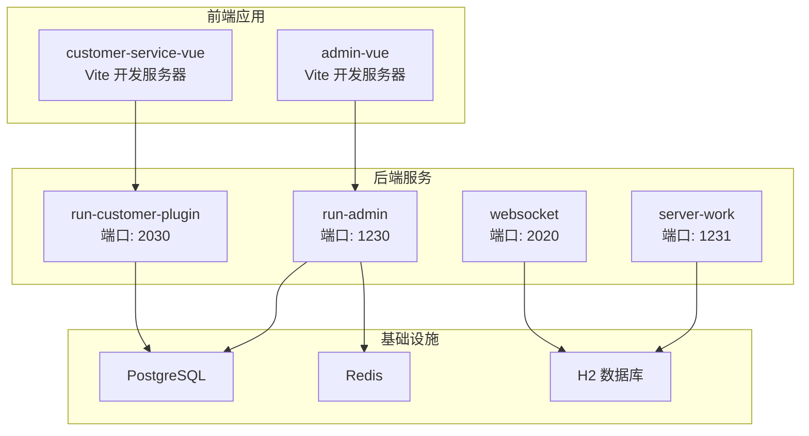
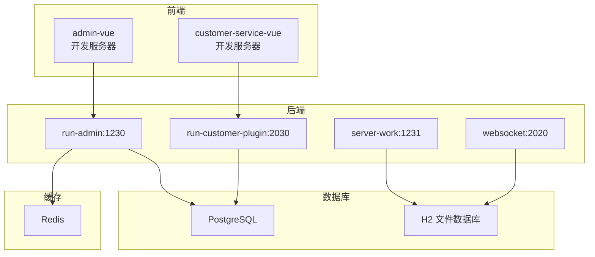
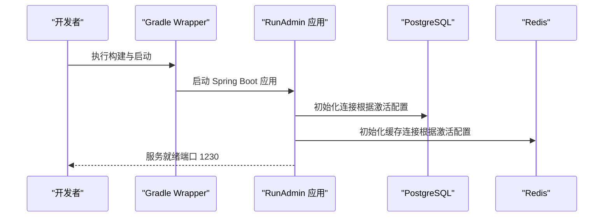
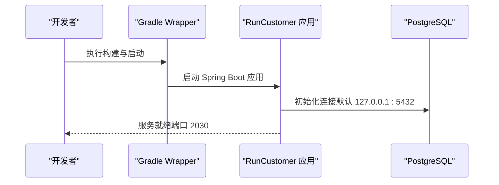
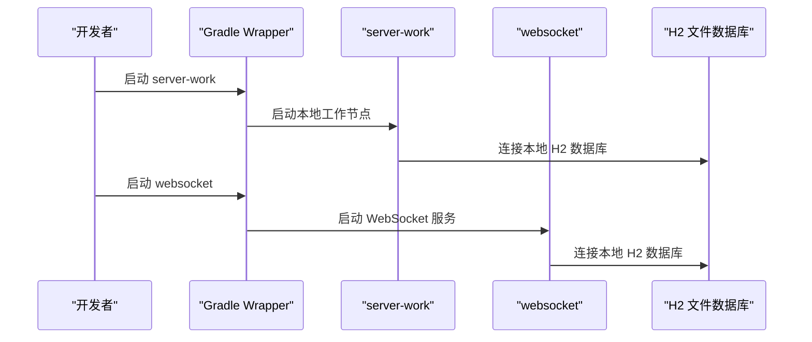
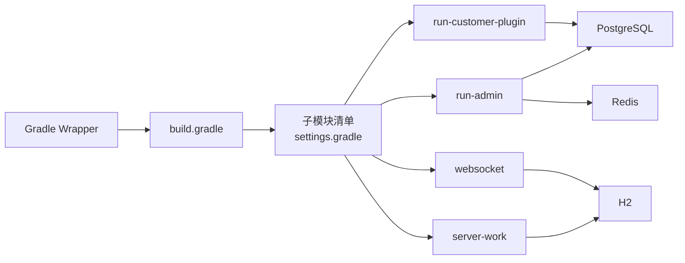

# 快速开始

<cite>
**本文引用的文件**
- [build.gradle](file://build.gradle)
- [settings.gradle](file://settings.gradle)
- [gradle.properties](file://gradle.properties)
- [run-admin/src/main/resources/application.yml](file://run-admin/src/main/resources/application.yml)
- [run-admin/src/main/resources/application-dev1.yml](file://run-admin/src/main/resources/application-dev1.yml)
- [run-admin/src/main/resources/application-dev2.yml](file://run-admin/src/main/resources/application-dev2.yml)
- [run-customer-plugin/src/main/resources/application.yml](file://run-customer-plugin/src/main/resources/application.yml)
- [server-work/src/main/resources/application.yml](file://server-work/src/main/resources/application.yml)
- [websocket/src/main/resources/application.yml](file://websocket/src/main/resources/application.yml)
- [run-admin/src/main/java/com/fastproject/RunAdmin.java](file://run-admin/src/main/java/com/fastproject/RunAdmin.java)
- [run-customer-plugin/src/main/java/com/fastproject/RunCustomer.java](file://run-customer-plugin/src/main/java/com/fastproject/RunCustomer.java)
- [server-work/src/main/java/com/fastproject/RunServerWork.java](file://server-work/src/main/java/com/fastproject/RunServerWork.java)
- [fast-ui/apps/admin-vue/package.json](file://fast-ui/apps/admin-vue/package.json)
- [fast-ui/apps/admin-vue/.env.development](file://fast-ui/apps/admin-vue/.env.development)
- [fast-ui/apps/admin-vue/vite.config.ts](file://fast-ui/apps/admin-vue/vite.config.ts)
- [fast-ui/apps/customer-service-vue/package.json](file://fast-ui/apps/customer-service-vue/package.json)
- [fast-ui/apps/customer-service-vue/.env.development](file://fast-ui/apps/customer-service-vue/.env.development)
- [fast-ui/apps/customer-service-vue/vite.config.ts](file://fast-ui/apps/customer-service-vue/vite.config.ts)
- [fast-ui/package.json](file://fast-ui/package.json)
- [fast-ui/pnpm-workspace.yaml](file://fast-ui/pnpm-workspace.yaml)
</cite>

## 目录
1. [简介](#简介)
2. [项目结构](#项目结构)
3. [核心组件](#核心组件)
4. [架构总览](#架构总览)
5. [详细组件分析](#详细组件分析)
6. [依赖关系分析](#依赖关系分析)
7. [性能注意事项](#性能注意事项)
8. [故障排除指南](#故障排除指南)
9. [结论](#结论)
10. [附录](#附录)

## 简介
本指南面向首次接触 Fast 项目的开发者，帮助你在约 30 分钟内完成环境准备、项目启动与基础功能验证。你将学习如何安装 JDK 25、Gradle、PostgreSQL、Redis，并完成项目克隆、依赖安装、数据库初始化与缓存配置；随后通过统一的启动命令运行后端服务与前端界面，最后掌握常见问题的排查方法。

## 项目结构
Fast 是一个多模块 Gradle 工程，采用 Spring Boot 4.0.3 构建，核心模块包括后台管理服务、客户插件、系统模块、文件模块、日志模块、幂等模块、限流模块、消息模块、用户成长模块、页面模块、WebSocket 服务以及本地工作节点等。前端使用 Vite + TypeScript 的多包工作区（pnpm workspace）组织，分别对应管理后台与客户服务两个 Vue 应用。

图表来源
- [settings.gradle](file://settings.gradle#L1-L24)
- [run-admin/src/main/resources/application.yml](file://run-admin/src/main/resources/application.yml#L1-L5)
- [run-customer-plugin/src/main/resources/application.yml](file://run-customer-plugin/src/main/resources/application.yml#L1-L26)
- [server-work/src/main/resources/application.yml](file://server-work/src/main/resources/application.yml#L1-L16)
- [websocket/src/main/resources/application.yml](file://websocket/src/main/resources/application.yml#L1-L28)

章节来源
- [settings.gradle](file://settings.gradle#L1-L24)
- [build.gradle](file://build.gradle#L1-L40)

## 核心组件
- 后端统一入口：run-admin 提供管理后台服务，默认监听 1230 端口，支持 dev1/dev2 两种开发环境配置。
- 客户端插件：run-customer-plugin 提供独立的客户侧服务，默认监听 2030 端口。
- 本地工作节点：server-work 使用 H2 作为本地数据存储，便于离线或测试场景。
- WebSocket 网关：websocket 提供 WebSocket 服务与 H2 控制台，便于实时通信与调试。
- 前端应用：admin-vue 与 customer-service-vue 通过 Vite 在本地开发模式运行，分别对接后端服务。

章节来源
- [run-admin/src/main/resources/application.yml](file://run-admin/src/main/resources/application.yml#L1-L5)
- [run-customer-plugin/src/main/resources/application.yml](file://run-customer-plugin/src/main/resources/application.yml#L1-L26)
- [server-work/src/main/resources/application.yml](file://server-work/src/main/resources/application.yml#L1-L16)
- [websocket/src/main/resources/application.yml](file://websocket/src/main/resources/application.yml#L1-L28)

## 架构总览
下图展示了后端服务、前端应用与基础设施之间的交互关系，以及各模块在开发环境中的默认端口映射。

图表来源
- [run-admin/src/main/resources/application.yml](file://run-admin/src/main/resources/application.yml#L1-L5)
- [run-customer-plugin/src/main/resources/application.yml](file://run-customer-plugin/src/main/resources/application.yml#L1-L26)
- [server-work/src/main/resources/application.yml](file://server-work/src/main/resources/application.yml#L1-L16)
- [websocket/src/main/resources/application.yml](file://websocket/src/main/resources/application.yml#L1-L28)

## 详细组件分析

### 后端服务启动流程（run-admin）
run-admin 作为主服务，负责管理后台的核心业务与接口。其启动流程如下：

图表来源
- [run-admin/src/main/java/com/fastproject/RunAdmin.java](file://run-admin/src/main/java/com/fastproject/RunAdmin.java)
- [run-admin/src/main/resources/application.yml](file://run-admin/src/main/resources/application.yml#L1-L5)
- [run-admin/src/main/resources/application-dev1.yml](file://run-admin/src/main/resources/application-dev1.yml#L28-L32)
- [run-admin/src/main/resources/application-dev2.yml](file://run-admin/src/main/resources/application-dev2.yml#L29-L32)
- [run-admin/src/main/resources/application-dev1.yml](file://run-admin/src/main/resources/application-dev1.yml#L61-L70)
- [run-admin/src/main/resources/application-dev2.yml](file://run-admin/src/main/resources/application-dev2.yml#L62-L70)

章节来源
- [run-admin/src/main/java/com/fastproject/RunAdmin.java](file://run-admin/src/main/java/com/fastproject/RunAdmin.java)
- [run-admin/src/main/resources/application.yml](file://run-admin/src/main/resources/application.yml#L1-L5)
- [run-admin/src/main/resources/application-dev1.yml](file://run-admin/src/main/resources/application-dev1.yml#L28-L32)
- [run-admin/src/main/resources/application-dev2.yml](file://run-admin/src/main/resources/application-dev2.yml#L29-L32)
- [run-admin/src/main/resources/application-dev1.yml](file://run-admin/src/main/resources/application-dev1.yml#L61-L70)
- [run-admin/src/main/resources/application-dev2.yml](file://run-admin/src/main/resources/application-dev2.yml#L62-L70)

### 客户端插件启动流程（run-customer-plugin）
客户端插件用于客户侧服务，独立于管理后台运行，使用 PostgreSQL 作为数据源。

图表来源
- [run-customer-plugin/src/main/java/com/fastproject/RunCustomer.java](file://run-customer-plugin/src/main/java/com/fastproject/RunCustomer.java)
- [run-customer-plugin/src/main/resources/application.yml](file://run-customer-plugin/src/main/resources/application.yml#L1-L26)

章节来源
- [run-customer-plugin/src/main/java/com/fastproject/RunCustomer.java](file://run-customer-plugin/src/main/java/com/fastproject/RunCustomer.java)
- [run-customer-plugin/src/main/resources/application.yml](file://run-customer-plugin/src/main/resources/application.yml#L1-L26)

### 本地工作节点与 WebSocket
server-work 使用 H2 文件数据库，适合本地开发与测试；websocket 提供 WebSocket 服务与 H2 控制台。

图表来源
- [server-work/src/main/java/com/fastproject/RunServerWork.java](file://server-work/src/main/java/com/fastproject/RunServerWork.java)
- [server-work/src/main/resources/application.yml](file://server-work/src/main/resources/application.yml#L1-L16)
- [websocket/src/main/resources/application.yml](file://websocket/src/main/resources/application.yml#L1-L28)

章节来源
- [server-work/src/main/java/com/fastproject/RunServerWork.java](file://server-work/src/main/java/com/fastproject/RunServerWork.java)
- [server-work/src/main/resources/application.yml](file://server-work/src/main/resources/application.yml#L1-L16)
- [websocket/src/main/resources/application.yml](file://websocket/src/main/resources/application.yml#L1-L28)

## 依赖关系分析
- 构建工具链：Gradle Wrapper 提供跨平台构建能力，JDK 25 作为源与目标版本。
- Spring 生态：所有子模块统一使用 Spring Boot 4.0.3 依赖管理，结合 JPA、Web、Security、Validation 等 Starter。
- 数据库与缓存：run-admin 默认使用 PostgreSQL 与 Redis；server-work/websocket 使用 H2；run-customer-plugin 使用 PostgreSQL。
- 前端生态：fast-ui 使用 pnpm workspace 组织多个前端应用，基于 Vite 与 TypeScript。

图表来源
- [build.gradle](file://build.gradle#L1-L40)
- [settings.gradle](file://settings.gradle#L1-L24)

章节来源
- [build.gradle](file://build.gradle#L1-L40)
- [settings.gradle](file://settings.gradle#L1-L24)

## 性能注意事项
- 虚拟线程：开发配置中启用了虚拟线程，有助于提升并发处理能力。
- SQL 输出与计时：可通过配置开关控制 SQL 输出与慢查询计时，便于开发阶段诊断。
- 上传限制：文件上传大小上限已配置，避免过大请求导致资源占用过高。
- 连接池参数：Redis 连接池的最大空闲、最小空闲与最大连接数可根据实际负载调整。

章节来源
- [run-admin/src/main/resources/application-dev1.yml](file://run-admin/src/main/resources/application-dev1.yml#L15-L17)
- [run-admin/src/main/resources/application-dev2.yml](file://run-admin/src/main/resources/application-dev2.yml#L16-L18)
- [run-admin/src/main/resources/application-dev1.yml](file://run-admin/src/main/resources/application-dev1.yml#L7-L10)
- [run-admin/src/main/resources/application-dev2.yml](file://run-admin/src/main/resources/application-dev2.yml#L9-L12)
- [run-admin/src/main/resources/application-dev1.yml](file://run-admin/src/main/resources/application-dev1.yml#L55-L57)
- [run-admin/src/main/resources/application-dev2.yml](file://run-admin/src/main/resources/application-dev2.yml#L56-L58)
- [run-admin/src/main/resources/application-dev1.yml](file://run-admin/src/main/resources/application-dev1.yml#L66-L70)
- [run-admin/src/main/resources/application-dev2.yml](file://run-admin/src/main/resources/application-dev2.yml#L67-L71)

## 故障排除指南
- 端口冲突
  - run-admin 默认端口 1230，如被占用请在配置文件中修改。
  - run-customer-plugin 默认端口 2030，如被占用请在配置文件中修改。
  - server-work 默认端口 1231，如被占用请在配置文件中修改。
  - websocket 默认端口 2020，如被占用请在配置文件中修改。
- 数据库连接失败
  - 确认 PostgreSQL 已安装并运行，账号密码与配置一致。
  - 如使用本地开发配置，请确认 dev2 中的数据库地址与凭据正确。
- 缓存连接失败
  - 确认 Redis 已安装并运行，密码与数据库索引与配置一致。
  - 如使用本地开发配置，请确认 dev2 中的 Redis 地址与凭据正确。
- 文件上传异常
  - 若上传超大文件失败，请检查上传大小限制配置是否满足需求。
- 虚拟线程相关问题
  - 若遇到并发或线程相关问题，可临时关闭虚拟线程配置进行对比验证。

章节来源
- [run-admin/src/main/resources/application.yml](file://run-admin/src/main/resources/application.yml#L1-L5)
- [run-admin/src/main/resources/application-dev1.yml](file://run-admin/src/main/resources/application-dev1.yml#L28-L32)
- [run-admin/src/main/resources/application-dev2.yml](file://run-admin/src/main/resources/application-dev2.yml#L29-L32)
- [run-admin/src/main/resources/application-dev1.yml](file://run-admin/src/main/resources/application-dev1.yml#L61-L70)
- [run-admin/src/main/resources/application-dev2.yml](file://run-admin/src/main/resources/application-dev2.yml#L62-L70)
- [run-customer-plugin/src/main/resources/application.yml](file://run-customer-plugin/src/main/resources/application.yml#L10-L15)
- [fast-ui/apps/admin-vue/.env.development](file://fast-ui/apps/admin-vue/.env.development)
- [fast-ui/apps/customer-service-vue/.env.development](file://fast-ui/apps/customer-service-vue/.env.development)

## 结论
通过本指南，你可以在 30 分钟内完成 Fast 项目的环境准备与启动。建议先从 run-admin 的 dev2 配置入手，确保本地 PostgreSQL 与 Redis 正常运行，再逐步启动其他模块与前端应用。若遇到问题，优先检查端口占用、数据库与缓存连通性以及上传大小限制等常见因素。

## 附录

### 环境准备与安装指引（Windows/Linux/macOS）

- JDK 25
  - 下载并安装 JDK 25（建议使用官方发行版），设置 JAVA_HOME 与 PATH。
  - 验证安装：在终端执行 java -version 与 javac -version。
- Gradle
  - 使用仓库自带的 Gradle Wrapper（gradlew 或 gradlew.bat），无需额外安装 Gradle。
  - 验证安装：在项目根目录执行 ./gradlew --version。
- PostgreSQL
  - Windows：下载安装包，按向导完成安装，创建数据库与用户。
  - Linux：使用包管理器安装（如 apt/yum），创建数据库与用户。
  - macOS：使用 Homebrew 安装（brew install postgresql），创建数据库与用户。
  - 验证安装：使用 psql 连接并创建数据库 fast-project。
- Redis
  - Windows：使用 WSL 或 Docker，或下载社区版安装。
  - Linux/macOS：使用包管理器安装或 Docker。
  - 验证安装：使用 redis-cli ping 返回 PONG。

章节来源
- [build.gradle](file://build.gradle#L30-L33)
- [gradle.properties](file://gradle.properties#L1-L3)

### 项目克隆与依赖安装
- 克隆仓库到本地后，在项目根目录执行以下命令以完成依赖安装与构建：
  - ./gradlew build
  - 若网络较慢，可在 gradle.properties 中启用代理或更换镜像源。
- 构建产物位于 .module-build 目录，便于模块化管理。

章节来源
- [build.gradle](file://build.gradle#L54-L58)
- [gradle.properties](file://gradle.properties#L1-L3)

### 数据库初始化与缓存配置
- 初始化 PostgreSQL 数据库
  - 在 run-admin 的 dev1/dev2 配置中，确认数据库 URL、用户名与密码正确。
  - 启动 run-admin 后，Hibernate 将根据 ddl-auto=update 自动更新表结构。
- 配置 Redis
  - 在 run-admin 的 dev1/dev2 配置中，确认 Redis 主机、端口、密码、数据库索引与连接池参数。
  - 启动 run-admin 后，应用将连接 Redis 并建立缓存通道。
- 本地 H2 数据库
  - server-work 与 websocket 使用 H2 文件数据库，启动后可在浏览器访问 /h2-console 进行查看。

章节来源
- [run-admin/src/main/resources/application-dev1.yml](file://run-admin/src/main/resources/application-dev1.yml#L28-L32)
- [run-admin/src/main/resources/application-dev2.yml](file://run-admin/src/main/resources/application-dev2.yml#L29-L32)
- [run-admin/src/main/resources/application-dev1.yml](file://run-admin/src/main/resources/application-dev1.yml#L61-L70)
- [run-admin/src/main/resources/application-dev2.yml](file://run-admin/src/main/resources/application-dev2.yml#L62-L70)
- [server-work/src/main/resources/application.yml](file://server-work/src/main/resources/application.yml#L4-L8)
- [websocket/src/main/resources/application.yml](file://websocket/src/main/resources/application.yml#L14-L18)

### 启动命令与验证方法
- 启动后端服务
  - run-admin：在根目录执行 ./gradlew :run-admin:bootRun，访问 http://localhost:1230
  - run-customer-plugin：在根目录执行 ./gradlew :run-customer-plugin:bootRun，访问 http://localhost:2030
  - server-work：在根目录执行 ./gradlew :server-work:bootRun，访问 http://localhost:1231/h2-console
  - websocket：在根目录执行 ./gradlew :websocket:bootRun，访问 http://localhost:2020/ws
- 启动前端应用
  - 进入 fast-ui 目录，执行 pnpm install 安装依赖，然后分别进入 admin-vue 与 customer-service-vue 执行 pnpm run dev 启动开发服务器。
  - 访问 http://localhost:5173（或对应前端端口）查看界面。
- 验证
  - 后端：访问各服务健康端点或接口，确认无连接错误。
  - 前端：打开浏览器控制台，确认无跨域与网络错误。

章节来源
- [run-admin/src/main/resources/application.yml](file://run-admin/src/main/resources/application.yml#L1-L5)
- [run-customer-plugin/src/main/resources/application.yml](file://run-customer-plugin/src/main/resources/application.yml#L1-L26)
- [server-work/src/main/resources/application.yml](file://server-work/src/main/resources/application.yml#L1-L16)
- [websocket/src/main/resources/application.yml](file://websocket/src/main/resources/application.yml#L1-L28)
- [fast-ui/apps/admin-vue/package.json](file://fast-ui/apps/admin-vue/package.json)
- [fast-ui/apps/customer-service-vue/package.json](file://fast-ui/apps/customer-service-vue/package.json)
- [fast-ui/package.json](file://fast-ui/package.json)
- [fast-ui/pnpm-workspace.yaml](file://fast-ui/pnpm-workspace.yaml)