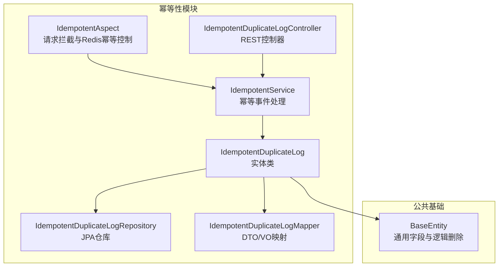
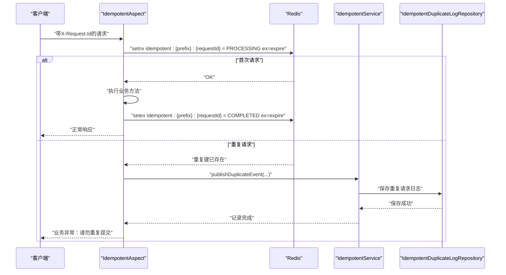
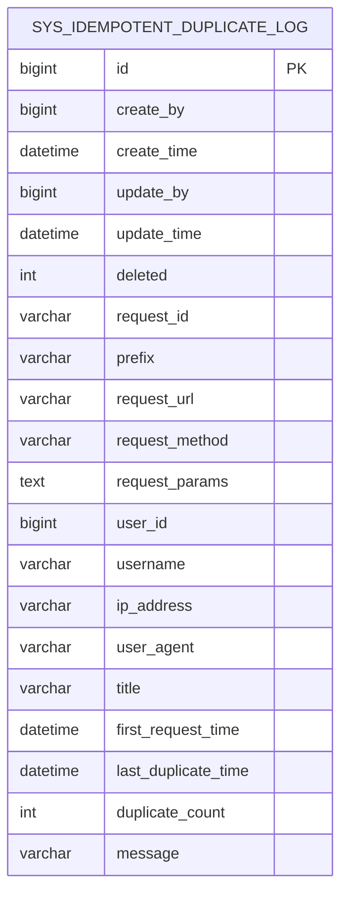
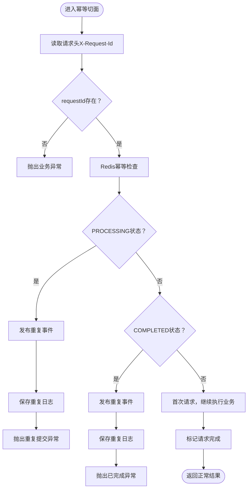
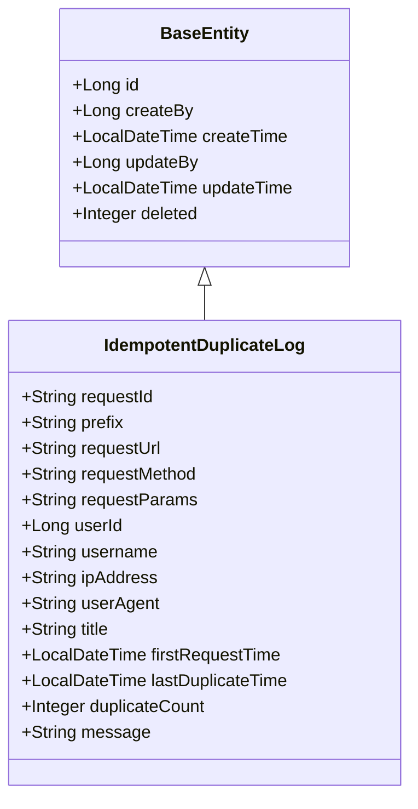
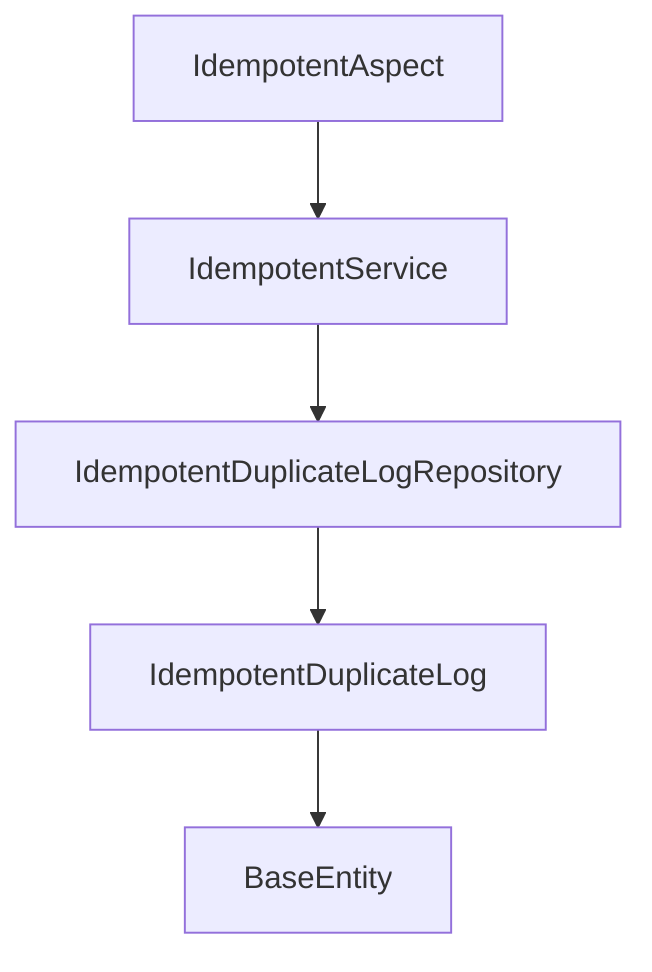

# 幂等性控制数据库表结构

<cite>
**本文档引用的文件**
- [IdempotentDuplicateLog.java](file://idempotent-module/src/main/java/com/fastproject/idempotent/domain/IdempotentDuplicateLog.java)
- [BaseEntity.java](file://common/src/main/java/com/fastproject/db/BaseEntity.java)
- [IdempotentDuplicateLogRepository.java](file://idempotent-module/src/main/java/com/fastproject/idempotent/repository/db/IdempotentDuplicateLogRepository.java)
- [IdempotentDuplicateLogMapper.java](file://idempotent-module/src/main/java/com/fastproject/idempotent/mapper/IdempotentDuplicateLogMapper.java)
- [IdempotentDuplicateLogCreate.java](file://idempotent-module/src/main/java/com/fastproject/idempotent/vo/IdempotentDuplicateLogCreate.java)
- [IdempotentDuplicateLogUpdate.java](file://idempotent-module/src/main/java/com/fastproject/idempotent/vo/IdempotentDuplicateLogUpdate.java)
- [IdempotentDuplicateLogQuery.java](file://idempotent-module/src/main/java/com/fastproject/idempotent/vo/IdempotentDuplicateLogQuery.java)
- [IdempotentServiceImpl.java](file://idempotent-module/src/main/java/com/fastproject/idempotent/service/impl/IdempotentServiceImpl.java)
- [IdempotentAspect.java](file://idempotent-api/src/main/java/com/fastproject/idempotent/aspect/IdempotentAspect.java)
- [Idempotent.java](file://idempotent-api/src/main/java/com/fastproject/idempotent/annotation/Idempotent.java)
- [IdempotentConstants.java](file://idempotent-api/src/main/java/com/fastproject/idempotent/constants/IdempotentConstants.java)
</cite>

## 目录
1. [简介](#简介)
2. [项目结构](#项目结构)
3. [核心组件](#核心组件)
4. [架构概览](#架构概览)
5. [详细组件分析](#详细组件分析)
6. [依赖关系分析](#依赖关系分析)
7. [性能考虑](#性能考虑)
8. [故障排查指南](#故障排查指南)
9. [结论](#结论)

## 简介
本文件聚焦于幂等性控制模块的数据库表结构设计与实现，重点阐述幂等重复日志表（sys_idempotent_duplicate_log）的设计原理、字段定义、约束规则以及与Redis分布式幂等控制的协同机制。文档同时给出重复请求检测的数据库实现思路、并发控制策略、SQL查询模式、性能优化建议、日志清理策略与数据保留周期，并为分布式系统一致性提供数据库层面的技术支撑。

## 项目结构
幂等性控制模块位于独立的模块中，采用分层架构：
- 领域层：实体类定义数据库表映射
- 数据访问层：基于Spring Data JPA的Repository接口
- 映射层：MapStruct将DTO/VO与实体转换
- 服务层：幂等性事件记录与查询
- 控制器层：对外暴露REST接口
- 注解与切面：通过AOP拦截请求，结合Redis实现分布式幂等

图表来源
- [IdempotentAspect.java](file://idempotent-api/src/main/java/com/fastproject/idempotent/aspect/IdempotentAspect.java#L1-L211)
- [IdempotentServiceImpl.java](file://idempotent-module/src/main/java/com/fastproject/idempotent/service/impl/IdempotentServiceImpl.java#L1-L65)
- [IdempotentDuplicateLog.java](file://idempotent-module/src/main/java/com/fastproject/idempotent/domain/IdempotentDuplicateLog.java#L1-L97)
- [IdempotentDuplicateLogRepository.java](file://idempotent-module/src/main/java/com/fastproject/idempotent/repository/db/IdempotentDuplicateLogRepository.java#L1-L25)
- [IdempotentDuplicateLogMapper.java](file://idempotent-module/src/main/java/com/fastproject/idempotent/mapper/IdempotentDuplicateLogMapper.java#L1-L44)

章节来源
- [IdempotentAspect.java](file://idempotent-api/src/main/java/com/fastproject/idempotent/aspect/IdempotentAspect.java#L1-L211)
- [IdempotentServiceImpl.java](file://idempotent-module/src/main/java/com/fastproject/idempotent/service/impl/IdempotentServiceImpl.java#L1-L65)
- [IdempotentDuplicateLog.java](file://idempotent-module/src/main/java/com/fastproject/idempotent/domain/IdempotentDuplicateLog.java#L1-L97)
- [IdempotentDuplicateLogRepository.java](file://idempotent-module/src/main/java/com/fastproject/idempotent/repository/db/IdempotentDuplicateLogRepository.java#L1-L25)
- [IdempotentDuplicateLogMapper.java](file://idempotent-module/src/main/java/com/fastproject/idempotent/mapper/IdempotentDuplicateLogMapper.java#L1-L44)

## 核心组件
- 实体类：IdempotentDuplicateLog，映射sys_idempotent_duplicate_log表，继承BaseEntity，具备通用字段与逻辑删除能力
- 仓库接口：IdempotentDuplicateLogRepository，提供按requestId查询与存在性判断
- 映射器：IdempotentDuplicateLogMapper，负责DTO/VO与实体之间的转换
- 服务实现：IdempotentServiceImpl，接收幂等事件并持久化到数据库
- 注解与常量：Idempotent注解与IdempotentConstants，定义幂等键、请求头、状态等常量
- 查询模型：IdempotentDuplicateLogQuery，支持分页与多字段过滤

章节来源
- [IdempotentDuplicateLog.java](file://idempotent-module/src/main/java/com/fastproject/idempotent/domain/IdempotentDuplicateLog.java#L1-L97)
- [BaseEntity.java](file://common/src/main/java/com/fastproject/db/BaseEntity.java#L1-L48)
- [IdempotentDuplicateLogRepository.java](file://idempotent-module/src/main/java/com/fastproject/idempotent/repository/db/IdempotentDuplicateLogRepository.java#L1-L25)
- [IdempotentDuplicateLogMapper.java](file://idempotent-module/src/main/java/com/fastproject/idempotent/mapper/IdempotentDuplicateLogMapper.java#L1-L44)
- [IdempotentDuplicateLogCreate.java](file://idempotent-module/src/main/java/com/fastproject/idempotent/vo/IdempotentDuplicateLogCreate.java#L1-L83)
- [IdempotentDuplicateLogUpdate.java](file://idempotent-module/src/main/java/com/fastproject/idempotent/vo/IdempotentDuplicateLogUpdate.java#L1-L87)
- [IdempotentDuplicateLogQuery.java](file://idempotent-module/src/main/java/com/fastproject/idempotent/vo/IdempotentDuplicateLogQuery.java#L1-L66)
- [IdempotentServiceImpl.java](file://idempotent-module/src/main/java/com/fastproject/idempotent/service/impl/IdempotentServiceImpl.java#L1-L65)
- [Idempotent.java](file://idempotent-api/src/main/java/com/fastproject/idempotent/annotation/Idempotent.java#L1-L57)
- [IdempotentConstants.java](file://idempotent-api/src/main/java/com/fastproject/idempotent/constants/IdempotentConstants.java#L1-L42)

## 架构概览
幂等性控制采用“Redis + 数据库”的双层保障：
- Redis层：基于原子操作setnx+expire实现请求级幂等，避免重复执行
- 数据库层：记录重复请求事件，便于审计与统计分析

图表来源
- [IdempotentAspect.java](file://idempotent-api/src/main/java/com/fastproject/idempotent/aspect/IdempotentAspect.java#L52-L117)
- [IdempotentServiceImpl.java](file://idempotent-module/src/main/java/com/fastproject/idempotent/service/impl/IdempotentServiceImpl.java#L32-L63)
- [IdempotentDuplicateLogRepository.java](file://idempotent-module/src/main/java/com/fastproject/idempotent/repository/db/IdempotentDuplicateLogRepository.java#L16-L24)
- [Idempotent.java](file://idempotent-api/src/main/java/com/fastproject/idempotent/annotation/Idempotent.java#L24-L57)
- [IdempotentConstants.java](file://idempotent-api/src/main/java/com/fastproject/idempotent/constants/IdempotentConstants.java#L6-L42)

## 详细组件分析

### 表结构设计与字段定义
- 表名：sys_idempotent_duplicate_log
- 继承基类：BaseEntity，提供通用主键、创建/更新信息与逻辑删除字段
- 关键字段说明：
  - requestId：请求ID（前端生成的唯一标识），用于去重与审计
  - prefix：幂等键前缀，组合形成Redis键空间，便于分类管理
  - requestUrl/requestMethod：请求路径与方法，定位重复请求来源
  - requestParams：请求参数（JSON），用于审计与复现
  - userId/username/ipAddress/userAgent/title：用户与环境信息，便于溯源
  - firstRequestTime/lastDuplicateTime/duplicateCount/message：时间戳与计数，记录重复行为与提示信息

图表来源
- [IdempotentDuplicateLog.java](file://idempotent-module/src/main/java/com/fastproject/idempotent/domain/IdempotentDuplicateLog.java#L18-L97)
- [BaseEntity.java](file://common/src/main/java/com/fastproject/db/BaseEntity.java#L14-L47)

章节来源
- [IdempotentDuplicateLog.java](file://idempotent-module/src/main/java/com/fastproject/idempotent/domain/IdempotentDuplicateLog.java#L14-L97)
- [BaseEntity.java](file://common/src/main/java/com/fastproject/db/BaseEntity.java#L14-L47)

### 字段约束与索引建议
- 唯一性约束：
  - 建议对requestId建立唯一索引，确保请求ID全局唯一，避免重复插入
- 性能索引：
  - prefix + requestUrl + requestMethod：加速按业务维度查询
  - firstRequestTime：支持按时间范围检索重复请求
  - userId/username：支持按用户维度审计
- 逻辑删除：
  - deleted=0生效过滤，deleted=1软删除，避免物理删除影响历史审计

章节来源
- [IdempotentDuplicateLogRepository.java](file://idempotent-module/src/main/java/com/fastproject/idempotent/repository/db/IdempotentDuplicateLogRepository.java#L16-L24)
- [IdempotentDuplicateLog.java](file://idempotent-module/src/main/java/com/fastproject/idempotent/domain/IdempotentDuplicateLog.java#L22-L23)

### 幂等性检查的数据库实现机制
- 触发时机：当Redis幂等检查命中重复请求时，异步发布重复事件，由服务层持久化到数据库
- 写入流程：从请求上下文提取必要信息，填充实体并保存至sys_idempotent_duplicate_log
- 并发控制：Redis层通过原子操作setnx+expire实现互斥；数据库层通过唯一索引避免重复写入

图表来源
- [IdempotentAspect.java](file://idempotent-api/src/main/java/com/fastproject/idempotent/aspect/IdempotentAspect.java#L52-L117)
- [IdempotentServiceImpl.java](file://idempotent-module/src/main/java/com/fastproject/idempotent/service/impl/IdempotentServiceImpl.java#L32-L63)

章节来源
- [IdempotentAspect.java](file://idempotent-api/src/main/java/com/fastproject/idempotent/aspect/IdempotentAspect.java#L52-L117)
- [IdempotentServiceImpl.java](file://idempotent-module/src/main/java/com/fastproject/idempotent/service/impl/IdempotentServiceImpl.java#L32-L63)

### 并发控制策略
- Redis层：
  - 使用原子操作setnx设置PROCESSING状态，失败则读取现有状态，避免竞态
  - 设置过期时间，防止异常导致的键残留
- 数据库层：
  - 唯一索引requestId，保证重复请求不会产生重复记录
  - 逻辑删除deleted字段，支持后续审计与恢复

章节来源
- [IdempotentAspect.java](file://idempotent-api/src/main/java/com/fastproject/idempotent/aspect/IdempotentAspect.java#L158-L189)
- [IdempotentDuplicateLogRepository.java](file://idempotent-module/src/main/java/com/fastproject/idempotent/repository/db/IdempotentDuplicateLogRepository.java#L16-L24)
- [IdempotentConstants.java](file://idempotent-api/src/main/java/com/fastproject/idempotent/constants/IdempotentConstants.java#L6-L42)

### 重复请求检测的SQL查询模式
- 基于请求ID查询：
  - SELECT * FROM sys_idempotent_duplicate_log WHERE request_id = ? AND deleted = 0
- 分页与条件查询：
  - 支持按prefix、requestUrl、requestMethod、userId、username、ipAddress、title、first_request_time_start~end等字段组合查询
- 统计与聚合：
  - COUNT(*)按prefix或用户维度统计重复次数
  - GROUP BY request_id统计重复频率

章节来源
- [IdempotentDuplicateLogRepository.java](file://idempotent-module/src/main/java/com/fastproject/idempotent/repository/db/IdempotentDuplicateLogRepository.java#L16-L24)
- [IdempotentDuplicateLogQuery.java](file://idempotent-module/src/main/java/com/fastproject/idempotent/vo/IdempotentDuplicateLogQuery.java#L14-L65)

### 性能优化方案
- 索引优化：
  - 为requestId建立唯一索引
  - 为prefix、requestUrl、requestMethod、firstRequestTime建立复合索引
- 分表分库：
  - 按prefix或时间维度进行水平拆分，降低单表压力
- 缓存策略：
  - 对高频查询结果进行缓存（如近实时统计）
- 异步落库：
  - 重复事件异步写入，避免阻塞主流程
- 日志清理：
  - 定期清理过期数据，保持表规模可控

章节来源
- [IdempotentDuplicateLogQuery.java](file://idempotent-module/src/main/java/com/fastproject/idempotent/vo/IdempotentDuplicateLogQuery.java#L14-L65)

### 幂等日志清理策略与数据保留周期
- 清理策略：
  - 基于firstRequestTime或lastDuplicateTime设定保留周期（如90天）
  - 定期任务批量删除过期记录，使用LIMIT分批处理，避免长事务
- 保留周期建议：
  - 一般业务：90天
  - 高合规要求：180-365天
- 归档迁移：
  - 将过期数据迁移到归档表或冷存储，保留统计指标

章节来源
- [IdempotentDuplicateLog.java](file://idempotent-module/src/main/java/com/fastproject/idempotent/domain/IdempotentDuplicateLog.java#L78-L95)

### 分布式系统一致性保证
- 原子性：
  - Redis层原子操作setnx+expire，确保请求状态变更的原子性
- 顺序性：
  - 业务执行完成后标记COMPLETED，避免后续误判
- 可用性：
  - 异步记录重复日志，不影响主流程性能
- 可追溯性：
  - 完整记录请求上下文，支持审计与问题复现

章节来源
- [IdempotentAspect.java](file://idempotent-api/src/main/java/com/fastproject/idempotent/aspect/IdempotentAspect.java#L158-L207)
- [Idempotent.java](file://idempotent-api/src/main/java/com/fastproject/idempotent/annotation/Idempotent.java#L24-L57)
- [IdempotentConstants.java](file://idempotent-api/src/main/java/com/fastproject/idempotent/constants/IdempotentConstants.java#L6-L42)

## 依赖关系分析
- 类关系图（实体与基类）

图表来源
- [BaseEntity.java](file://common/src/main/java/com/fastproject/db/BaseEntity.java#L14-L47)
- [IdempotentDuplicateLog.java](file://idempotent-module/src/main/java/com/fastproject/idempotent/domain/IdempotentDuplicateLog.java#L24-L97)

- 组件交互图（切面、服务、仓库）

图表来源
- [IdempotentAspect.java](file://idempotent-api/src/main/java/com/fastproject/idempotent/aspect/IdempotentAspect.java#L36-L47)
- [IdempotentServiceImpl.java](file://idempotent-module/src/main/java/com/fastproject/idempotent/service/impl/IdempotentServiceImpl.java#L26-L57)
- [IdempotentDuplicateLogRepository.java](file://idempotent-module/src/main/java/com/fastproject/idempotent/repository/db/IdempotentDuplicateLogRepository.java#L14-L24)
- [IdempotentDuplicateLog.java](file://idempotent-module/src/main/java/com/fastproject/idempotent/domain/IdempotentDuplicateLog.java#L18-L97)
- [BaseEntity.java](file://common/src/main/java/com/fastproject/db/BaseEntity.java#L14-L47)

章节来源
- [IdempotentAspect.java](file://idempotent-api/src/main/java/com/fastproject/idempotent/aspect/IdempotentAspect.java#L36-L47)
- [IdempotentServiceImpl.java](file://idempotent-module/src/main/java/com/fastproject/idempotent/service/impl/IdempotentServiceImpl.java#L26-L57)
- [IdempotentDuplicateLogRepository.java](file://idempotent-module/src/main/java/com/fastproject/idempotent/repository/db/IdempotentDuplicateLogRepository.java#L14-L24)
- [IdempotentDuplicateLog.java](file://idempotent-module/src/main/java/com/fastproject/idempotent/domain/IdempotentDuplicateLog.java#L18-L97)
- [BaseEntity.java](file://common/src/main/java/com/fastproject/db/BaseEntity.java#L14-L47)

## 性能考虑
- Redis热点键：
  - 合理设置过期时间，避免长时间占用内存
  - 使用命名空间prefix隔离不同业务场景
- 数据库写入：
  - 异步写入减少主流程延迟
  - 批量插入与事务合并，降低锁竞争
- 查询优化：
  - 基于常用过滤条件建立索引
  - 分页查询限制最大页大小，避免全表扫描

## 故障排查指南
- 常见问题：
  - 请求头缺失X-Request-Id：直接拒绝请求，检查前端配置
  - 重复请求被拦截：查看重复日志表，确认prefix与expireTime设置
  - 数据库写入失败：检查唯一索引冲突与连接池配置
- 排查步骤：
  - 检查Redis键是否存在与过期时间
  - 查询sys_idempotent_duplicate_log确认重复记录
  - 查看服务日志与异常堆栈

章节来源
- [IdempotentAspect.java](file://idempotent-api/src/main/java/com/fastproject/idempotent/aspect/IdempotentAspect.java#L68-L97)
- [IdempotentServiceImpl.java](file://idempotent-module/src/main/java/com/fastproject/idempotent/service/impl/IdempotentServiceImpl.java#L59-L62)
- [IdempotentDuplicateLogRepository.java](file://idempotent-module/src/main/java/com/fastproject/idempotent/repository/db/IdempotentDuplicateLogRepository.java#L16-L24)

## 结论
本文档系统梳理了幂等性控制模块的数据库表结构设计与实现要点，明确了各字段的职责与约束，给出了并发控制策略、SQL查询模式与性能优化方案，并提供了日志清理与一致性保障建议。通过Redis与数据库的协同，既能保证高并发下的幂等性，又能满足审计与统计需求，为分布式系统的稳定性与可追溯性提供坚实支撑。