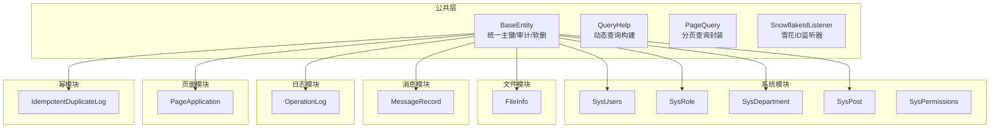
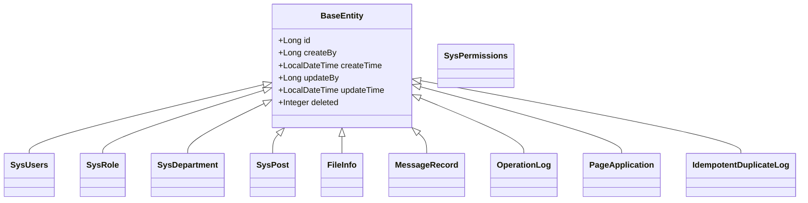
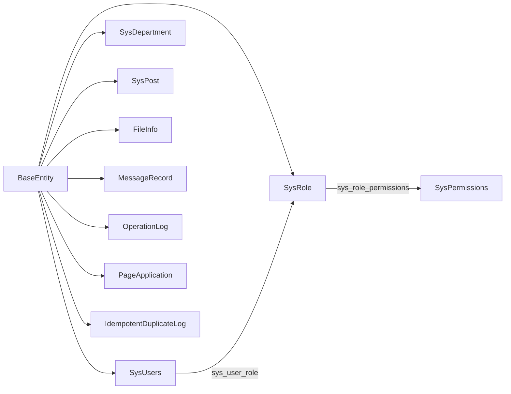

# 数据库设计

<cite>
**本文引用的文件**
- [common/src/main/java/com/fastproject/db/BaseEntity.java](file://common/src/main/java/com/fastproject/db/BaseEntity.java)
- [common/src/main/java/com/fastproject/db/PageQuery.java](file://common/src/main/java/com/fastproject/db/PageQuery.java)
- [common/src/main/java/com/fastproject/db/QueryHelp.java](file://common/src/main/java/com/fastproject/db/QueryHelp.java)
- [common/src/main/java/com/fastproject/db/SnowflakeIdListener.java](file://common/src/main/java/com/fastproject/db/SnowflakeIdListener.java)
- [file-module/src/main/java/com/fastproject/file/domain/FileInfo.java](file://file-module/src/main/java/com/fastproject/file/domain/FileInfo.java)
- [file-module/src/main/java/com/fastproject/file/repository/db/FileInfoRepository.java](file://file-module/src/main/java/com/fastproject/file/repository/db/FileInfoRepository.java)
- [system-module/src/main/java/com/fastproject/system/domain/SysUsers.java](file://system-module/src/main/java/com/fastproject/system/domain/SysUsers.java)
- [system-module/src/main/java/com/fastproject/system/domain/SysRole.java](file://system-module/src/main/java/com/fastproject/system/domain/SysRole.java)
- [system-module/src/main/java/com/fastproject/system/domain/SysDepartment.java](file://system-module/src/main/java/com/fastproject/system/domain/SysDepartment.java)
- [system-module/src/main/java/com/fastproject/system/domain/SysPost.java](file://system-module/src/main/java/com/fastproject/system/domain/SysPost.java)
- [system-module/src/main/java/com/fastproject/system/domain/SysPermissions.java](file://system-module/src/main/java/com/fastproject/system/domain/SysPermissions.java)
- [logs-module/src/main/java/com/fastproject/logs/domain/OperationLog.java](file://logs-module/src/main/java/com/fastproject/logs/domain/OperationLog.java)
- [message-module/src/main/java/com/fastproject/message/domain/MessageRecord.java](file://message-module/src/main/java/com/fastproject/message/domain/MessageRecord.java)
- [page-module/src/main/java/com/fastproject/page/domain/PageApplication.java](file://page-module/src/main/java/com/fastproject/page/domain/PageApplication.java)
- [idempotent-module/src/main/java/com/fastproject/idempotent/domain/IdempotentDuplicateLog.java](file://idempotent-module/src/main/java/com/fastproject/idempotent/domain/IdempotentDuplicateLog.java)
</cite>

## 目录
1. [引言](#引言)
2. [项目结构](#项目结构)
3. [核心组件](#核心组件)
4. [架构总览](#架构总览)
5. [详细组件分析](#详细组件分析)
6. [依赖分析](#依赖分析)
7. [性能考虑](#性能考虑)
8. [故障排查指南](#故障排查指南)
9. [结论](#结论)
10. [附录](#附录)

## 引言
本文件面向数据库管理员与后端工程师，系统化梳理 Fast 项目的数据库设计与实现要点，覆盖以下方面：
- 实体关系模型与表结构设计
- 字段定义、约束与索引策略
- 查询优化与访问模式
- 数据模型演进与版本管理
- 数据库迁移与升级指南
- 备份恢复与性能监控
- 维护与优化建议

## 项目结构
本项目采用多模块分层架构，数据库层通过 JPA/Hibernate 映射到关系型数据库。公共基类统一了主键、审计字段与软删除策略；各业务模块（系统、文件、消息、日志、页面、幂等）以领域模型驱动表结构。

图表来源
- [common/src/main/java/com/fastproject/db/BaseEntity.java](file://common/src/main/java/com/fastproject/db/BaseEntity.java#L14-L47)
- [common/src/main/java/com/fastproject/db/QueryHelp.java](file://common/src/main/java/com/fastproject/db/QueryHelp.java)
- [common/src/main/java/com/fastproject/db/PageQuery.java](file://common/src/main/java/com/fastproject/db/PageQuery.java)
- [common/src/main/java/com/fastproject/db/SnowflakeIdListener.java](file://common/src/main/java/com/fastproject/db/SnowflakeIdListener.java)
- [system-module/src/main/java/com/fastproject/system/domain/SysUsers.java](file://system-module/src/main/java/com/fastproject/system/domain/SysUsers.java#L15-L94)
- [system-module/src/main/java/com/fastproject/system/domain/SysRole.java](file://system-module/src/main/java/com/fastproject/system/domain/SysRole.java#L14-L58)
- [system-module/src/main/java/com/fastproject/system/domain/SysDepartment.java](file://system-module/src/main/java/com/fastproject/system/domain/SysDepartment.java#L12-L59)
- [system-module/src/main/java/com/fastproject/system/domain/SysPost.java](file://system-module/src/main/java/com/fastproject/system/domain/SysPost.java#L12-L49)
- [system-module/src/main/java/com/fastproject/system/domain/SysPermissions.java](file://system-module/src/main/java/com/fastproject/system/domain/SysPermissions.java)
- [file-module/src/main/java/com/fastproject/file/domain/FileInfo.java](file://file-module/src/main/java/com/fastproject/file/domain/FileInfo.java#L12-L78)
- [message-module/src/main/java/com/fastproject/message/domain/MessageRecord.java](file://message-module/src/main/java/com/fastproject/message/domain/MessageRecord.java#L11-L58)
- [logs-module/src/main/java/com/fastproject/logs/domain/OperationLog.java](file://logs-module/src/main/java/com/fastproject/logs/domain/OperationLog.java#L15-L93)
- [page-module/src/main/java/com/fastproject/page/domain/PageApplication.java](file://page-module/src/main/java/com/fastproject/page/domain/PageApplication.java#L10-L45)
- [idempotent-module/src/main/java/com/fastproject/idempotent/domain/IdempotentDuplicateLog.java](file://idempotent-module/src/main/java/com/fastproject/idempotent/domain/IdempotentDuplicateLog.java#L18-L97)

章节来源
- [common/src/main/java/com/fastproject/db/BaseEntity.java](file://common/src/main/java/com/fastproject/db/BaseEntity.java#L14-L47)
- [common/src/main/java/com/fastproject/db/QueryHelp.java](file://common/src/main/java/com/fastproject/db/QueryHelp.java)
- [common/src/main/java/com/fastproject/db/PageQuery.java](file://common/src/main/java/com/fastproject/db/PageQuery.java)
- [common/src/main/java/com/fastproject/db/SnowflakeIdListener.java](file://common/src/main/java/com/fastproject/db/SnowflakeIdListener.java)

## 核心组件
- 统一基类 BaseEntity：提供主键、创建/更新审计、软删除字段，确保所有业务实体具备一致的生命周期管理能力。
- 动态查询 QueryHelp：基于条件动态拼接查询，支持多字段过滤、排序与分页。
- 分页查询 PageQuery：封装分页参数，便于在服务层统一处理。
- 雪花ID监听器 SnowflakeIdListener：在实体持久化前生成全局唯一ID，避免并发冲突。

章节来源
- [common/src/main/java/com/fastproject/db/BaseEntity.java](file://common/src/main/java/com/fastproject/db/BaseEntity.java#L14-L47)
- [common/src/main/java/com/fastproject/db/QueryHelp.java](file://common/src/main/java/com/fastproject/db/QueryHelp.java)
- [common/src/main/java/com/fastproject/db/PageQuery.java](file://common/src/main/java/com/fastproject/db/PageQuery.java)
- [common/src/main/java/com/fastproject/db/SnowflakeIdListener.java](file://common/src/main/java/com/fastproject/db/SnowflakeIdListener.java)

## 架构总览
下图展示数据库层与业务模块的交互关系，以及软删除与审计字段在各实体中的应用。

图表来源
- [common/src/main/java/com/fastproject/db/BaseEntity.java](file://common/src/main/java/com/fastproject/db/BaseEntity.java#L14-L47)
- [system-module/src/main/java/com/fastproject/system/domain/SysUsers.java](file://system-module/src/main/java/com/fastproject/system/domain/SysUsers.java#L21-L94)
- [system-module/src/main/java/com/fastproject/system/domain/SysRole.java](file://system-module/src/main/java/com/fastproject/system/domain/SysRole.java#L20-L58)
- [system-module/src/main/java/com/fastproject/system/domain/SysDepartment.java](file://system-module/src/main/java/com/fastproject/system/domain/SysDepartment.java#L18-L59)
- [system-module/src/main/java/com/fastproject/system/domain/SysPost.java](file://system-module/src/main/java/com/fastproject/system/domain/SysPost.java#L16-L49)
- [file-module/src/main/java/com/fastproject/file/domain/FileInfo.java](file://file-module/src/main/java/com/fastproject/file/domain/FileInfo.java#L18-L78)
- [message-module/src/main/java/com/fastproject/message/domain/MessageRecord.java](file://message-module/src/main/java/com/fastproject/message/domain/MessageRecord.java#L17-L58)
- [logs-module/src/main/java/com/fastproject/logs/domain/OperationLog.java](file://logs-module/src/main/java/com/fastproject/logs/domain/OperationLog.java#L21-L93)
- [page-module/src/main/java/com/fastproject/page/domain/PageApplication.java](file://page-module/src/main/java/com/fastproject/page/domain/PageApplication.java#L16-L45)
- [idempotent-module/src/main/java/com/fastproject/idempotent/domain/IdempotentDuplicateLog.java](file://idempotent-module/src/main/java/com/fastproject/idempotent/domain/IdempotentDuplicateLog.java#L24-L97)

## 详细组件分析

### 系统模块（用户、角色、部门、岗位、权限）
- 表名与实体映射：sys_users、sys_role、sys_department、sys_post、sys_permissions
- 关键字段与约束
  - 主键：id（Long）
  - 审计：createBy、createTime、updateBy、updateTime
  - 软删除：deleted（整型，0未删/1已删）
  - 用户表：username、password、nickname、email、phone、gender、status、tenantId、avatar、remark、头像与部门、岗位外键关联
  - 角色表：title、code、status、tenantId、applicationId、applicationCode，并与权限建立多对多
  - 部门表：name、parentId、sort、leader、phone、email、status、tenantId
  - 岗位表：name、code、sort、status、remark、tenantId
  - 权限表：通用权限实体（具体字段由枚举或字典支撑）
- 约束与关系
  - 用户与部门/岗位：多对一
  - 角色与权限：多对多（中间表 sys_user_role、sys_role_permissions）
  - 多租户：tenantId 字段贯穿用户、角色、部门、岗位
- 索引建议
  - 用户：username（唯一）、tenantId
  - 角色：code（唯一）、tenantId
  - 部门：parentId、tenantId
  - 岗位：code、tenantId
  - 角色权限：role_id、permission_id（复合唯一）
- 查询优化
  - 使用 QueryHelp 动态拼接 where 条件，结合 PageQuery 分页
  - 对高频过滤字段（如 tenantId、status）建立索引
  - 关联查询使用懒加载（FetchType.LAZY），避免 N+1

章节来源
- [system-module/src/main/java/com/fastproject/system/domain/SysUsers.java](file://system-module/src/main/java/com/fastproject/system/domain/SysUsers.java#L15-L94)
- [system-module/src/main/java/com/fastproject/system/domain/SysRole.java](file://system-module/src/main/java/com/fastproject/system/domain/SysRole.java#L14-L58)
- [system-module/src/main/java/com/fastproject/system/domain/SysDepartment.java](file://system-module/src/main/java/com/fastproject/system/domain/SysDepartment.java#L12-L59)
- [system-module/src/main/java/com/fastproject/system/domain/SysPost.java](file://system-module/src/main/java/com/fastproject/system/domain/SysPost.java#L12-L49)
- [common/src/main/java/com/fastproject/db/QueryHelp.java](file://common/src/main/java/com/fastproject/db/QueryHelp.java)
- [common/src/main/java/com/fastproject/db/PageQuery.java](file://common/src/main/java/com/fastproject/db/PageQuery.java)

### 文件模块（文件信息）
- 表名与实体映射：file_info
- 关键字段与约束
  - 主键：id（Long）
  - 审计：createBy、createTime、updateBy、updateTime
  - 软删除：deleted（整型，0未删/1已删）
  - 文件元信息：fileName、fileSize、fileType、fileMd5、status、fileStorage、accessPath、filePath、configId、fileTypeId
  - 字段长度：fileStorage、accessPath、filePath 具有长度限制
- 约束与关系
  - configId、fileTypeId 作为外键指向配置与类型表（实体中体现）
- 索引建议
  - fileMd5（唯一/非唯一视业务而定）
  - fileType、status、configId、fileTypeId
  - 创建时间、更新时间（按需）
- 查询优化
  - 基于 fileMd5 快速去重与校验
  - 分页查询结合 fileType、status、时间范围

章节来源
- [file-module/src/main/java/com/fastproject/file/domain/FileInfo.java](file://file-module/src/main/java/com/fastproject/file/domain/FileInfo.java#L12-L78)
- [file-module/src/main/java/com/fastproject/file/repository/db/FileInfoRepository.java](file://file-module/src/main/java/com/fastproject/file/repository/db/FileInfoRepository.java)

### 消息模块（消息记录）
- 表名与实体映射：message_record
- 关键字段与约束
  - 主键：id（Long）
  - 审计：createBy、createTime、updateBy、updateTime
  - 软删除：deleted（整型，0未删/1已删）
  - 消息内容：configId、receiver、content、status、title、messageType、operatorId、userType
- 索引建议
  - receiver、messageType、status、operatorId、configId
  - 创建时间
- 查询优化
  - 按接收人与状态分页查询
  - 使用 QueryHelp 动态过滤

章节来源
- [message-module/src/main/java/com/fastproject/message/domain/MessageRecord.java](file://message-module/src/main/java/com/fastproject/message/domain/MessageRecord.java#L11-L58)

### 日志模块（操作日志）
- 表名与实体映射：sys_operation_log
- 关键字段与约束
  - 主键：id（Long）
  - 审计：createBy、createTime、updateBy、updateTime
  - 软删除：deleted（整型，0未删/1已删）
  - 日志详情：description（TEXT）、type（枚举字符串）、action（枚举字符串）、requestParams（TEXT）、responseData（TEXT）、timeCost、ip、url、httpMethod、className、methodName、success、errorMsg（TEXT）
- 索引建议
  - url、httpMethod、className、methodName、success、ip、type、action、时间范围
- 查询优化
  - 结合 TEXT 字段进行全文检索（如需）或基于枚举字段过滤
  - 分页查询配合时间与状态

章节来源
- [logs-module/src/main/java/com/fastproject/logs/domain/OperationLog.java](file://logs-module/src/main/java/com/fastproject/logs/domain/OperationLog.java#L15-L93)

### 页面模块（页面应用）
- 表名与实体映射：page_application
- 关键字段与约束
  - 主键：id（Long）
  - 审计：createBy、createTime、updateBy、updateTime
  - 软删除：deleted（整型，0未删/1已删）
  - 应用信息：title、code、status、icon、type_id（外键）
- 索引建议
  - code（唯一）、status、type_id
- 查询优化
  - 按状态与类型筛选

章节来源
- [page-module/src/main/java/com/fastproject/page/domain/PageApplication.java](file://page-module/src/main/java/com/fastproject/page/domain/PageApplication.java#L10-L45)

### 幂等模块（重复提交日志）
- 表名与实体映射：sys_idempotent_duplicate_log
- 关键字段与约束
  - 主键：id（Long）
  - 审计：createBy、createTime、updateBy、updateTime
  - 软删除：deleted（整型，0未删/1已删）
  - 请求信息：requestId、prefix、requestUrl、requestMethod、requestParams（TEXT）、userId、username、ipAddress、userAgent、title、firstRequestTime、lastDuplicateTime、duplicateCount、message
- 索引建议
  - requestId（唯一）、requestUrl、requestMethod、userId、username、ipAddress、时间范围
- 查询优化
  - 基于 requestId 去重与重复检测
  - 按时间窗口统计重复次数

章节来源
- [idempotent-module/src/main/java/com/fastproject/idempotent/domain/IdempotentDuplicateLog.java](file://idempotent-module/src/main/java/com/fastproject/idempotent/domain/IdempotentDuplicateLog.java#L18-L97)

### 数据访问模式
- 统一基类 BaseEntity：所有实体继承，保证主键、审计与软删除一致性
- 动态查询 QueryHelp：根据传入条件动态拼接 where 子句，支持多字段过滤与排序
- 分页查询 PageQuery：封装分页参数，便于服务层复用
- 雪花ID监听器 SnowflakeIdListener：在持久化前生成全局唯一ID，避免并发冲突

章节来源
- [common/src/main/java/com/fastproject/db/BaseEntity.java](file://common/src/main/java/com/fastproject/db/BaseEntity.java#L14-L47)
- [common/src/main/java/com/fastproject/db/QueryHelp.java](file://common/src/main/java/com/fastproject/db/QueryHelp.java)
- [common/src/main/java/com/fastproject/db/PageQuery.java](file://common/src/main/java/com/fastproject/db/PageQuery.java)
- [common/src/main/java/com/fastproject/db/SnowflakeIdListener.java](file://common/src/main/java/com/fastproject/db/SnowflakeIdListener.java)

## 依赖分析
- 耦合关系
  - 所有业务实体均依赖 BaseEntity，形成高内聚、低耦合的基类体系
  - 系统模块内部存在多对多关系（角色-权限、用户-角色），通过中间表实现
  - 文件模块与消息模块各自独立，不直接跨模块引用
- 外部依赖
  - JPA/Hibernate 注解驱动映射
  - 软删除通过 @SQLDelete 与 @SQLRestriction 实现
  - 多租户通过 tenantId 字段贯穿用户、角色、部门、岗位

图表来源
- [common/src/main/java/com/fastproject/db/BaseEntity.java](file://common/src/main/java/com/fastproject/db/BaseEntity.java#L14-L47)
- [system-module/src/main/java/com/fastproject/system/domain/SysUsers.java](file://system-module/src/main/java/com/fastproject/system/domain/SysUsers.java#L87-L93)
- [system-module/src/main/java/com/fastproject/system/domain/SysRole.java](file://system-module/src/main/java/com/fastproject/system/domain/SysRole.java#L51-L57)
- [system-module/src/main/java/com/fastproject/system/domain/SysPermissions.java](file://system-module/src/main/java/com/fastproject/system/domain/SysPermissions.java)

章节来源
- [system-module/src/main/java/com/fastproject/system/domain/SysUsers.java](file://system-module/src/main/java/com/fastproject/system/domain/SysUsers.java#L87-L93)
- [system-module/src/main/java/com/fastproject/system/domain/SysRole.java](file://system-module/src/main/java/com/fastproject/system/domain/SysRole.java#L51-L57)

## 性能考虑
- 索引设计
  - 唯一性：用户名（用户）、角色编码（角色）、文件MD5（文件）、请求ID（幂等）
  - 非唯一性：状态、类型、租户ID、时间戳、外键
- 查询优化
  - 使用 QueryHelp 动态过滤，避免全表扫描
  - 分页查询结合合适索引，减少回表
  - 关联查询使用懒加载，避免不必要的 JOIN
- 缓存策略
  - 高频读取的字典/配置可引入 Redis 缓存（仓库中包含 Redis 工具类）
- 监控与告警
  - 慢查询日志、执行计划分析、连接池监控

## 故障排查指南
- 软删除生效
  - 所有实体启用 @SQLDelete 与 @SQLRestriction，查询默认仅返回未删除记录
  - 删除操作实际更新 deleted 字段，而非物理删除
- 幂等控制
  - 重复请求可通过 requestId 快速识别并拒绝
- 日志审计
  - 操作日志记录请求参数、响应数据、耗时、错误信息，便于问题定位
- 常见问题
  - 外键缺失导致关联失败：检查中间表与外键字段
  - 查询慢：确认是否命中索引，必要时添加复合索引
  - 并发冲突：确认雪花ID生成是否正常

章节来源
- [common/src/main/java/com/fastproject/db/BaseEntity.java](file://common/src/main/java/com/fastproject/db/BaseEntity.java#L16-L47)
- [file-module/src/main/java/com/fastproject/file/domain/FileInfo.java](file://file-module/src/main/java/com/fastproject/file/domain/FileInfo.java#L16-L17)
- [message-module/src/main/java/com/fastproject/message/domain/MessageRecord.java](file://message-module/src/main/java/com/fastproject/message/domain/MessageRecord.java#L15-L16)
- [logs-module/src/main/java/com/fastproject/logs/domain/OperationLog.java](file://logs-module/src/main/java/com/fastproject/logs/domain/OperationLog.java#L19-L20)
- [idempotent-module/src/main/java/com/fastproject/idempotent/domain/IdempotentDuplicateLog.java](file://idempotent-module/src/main/java/com/fastproject/idempotent/domain/IdempotentDuplicateLog.java#L22-L23)

## 结论
本设计以 BaseEntity 为核心，统一了主键、审计与软删除策略；通过 QueryHelp 与 PageQuery 提供灵活高效的查询与分页能力；多租户场景下以 tenantId 贯穿关键实体。模块间低耦合、职责清晰，便于扩展与维护。建议在生产环境完善索引、缓存与监控体系，持续优化查询性能与稳定性。

## 附录

### 数据模型演进与版本管理
- 版本标识：以数据库版本号或迁移脚本命名区分（建议采用语义化版本）
- 变更记录：每次变更需记录影响范围、索引调整、兼容性说明
- 回滚策略：保留逆向 SQL 或回滚脚本，确保可逆

### 数据库迁移与升级指南
- 升级流程
  - 备份当前数据库
  - 执行结构变更脚本（新增/修改/删除表/索引）
  - 执行数据迁移脚本（如需）
  - 更新应用版本并重启服务
  - 验证查询与业务功能
- 注意事项
  - 新增索引可能影响写入性能，建议在低峰期执行
  - 修改列属性需评估兼容性与数据类型转换

### 备份恢复策略
- 备份
  - 全量备份：定期执行（如每日）
  - 增量备份：结合归档日志（按数据库类型配置）
- 恢复
  - 测试恢复流程，验证数据完整性
  - 恢复点选择：RPO/RTO 指标内

### 性能监控方案
- 指标
  - QPS、慢查询、连接数、锁等待、缓冲池命中率
- 工具
  - 数据库自带监控工具与第三方 APM
- 建议
  - 定期审查慢查询日志，优化索引与 SQL
  - 监控连接池使用情况，避免连接泄漏