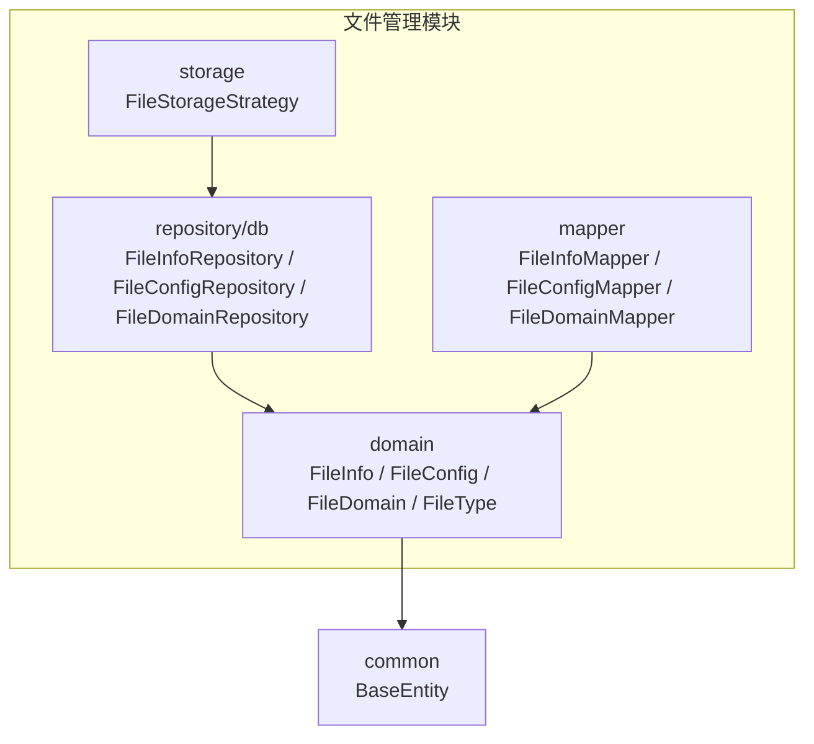
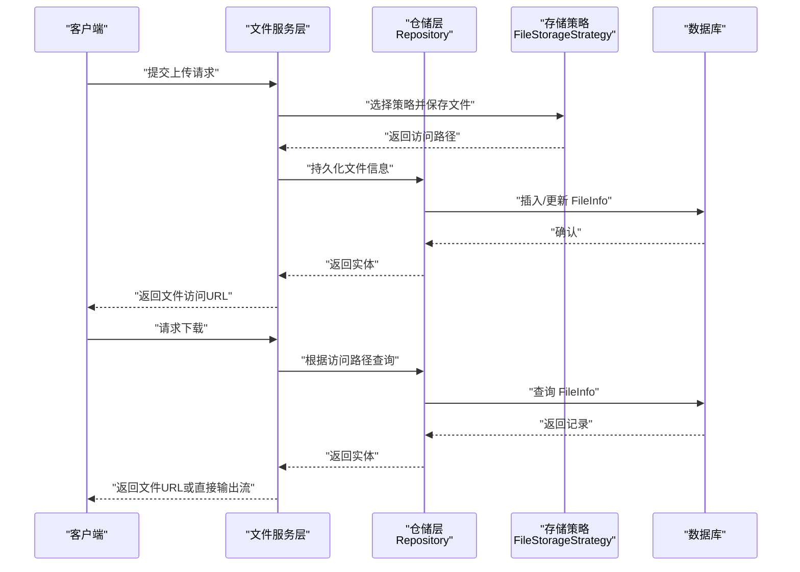
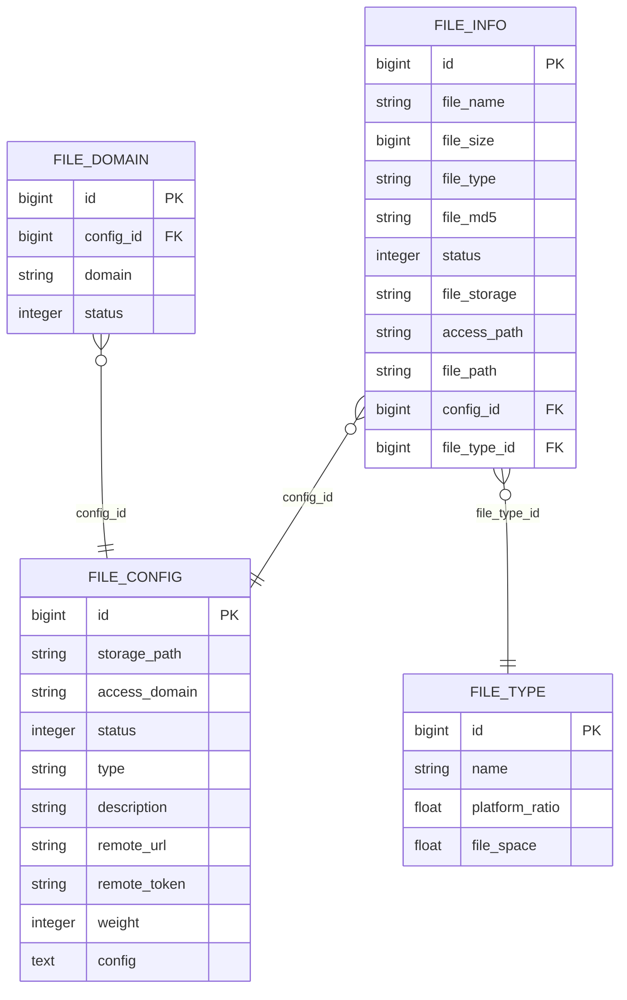
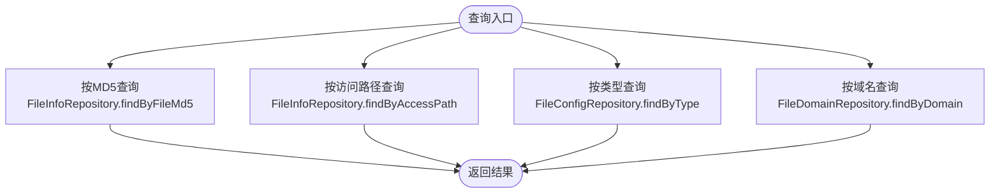
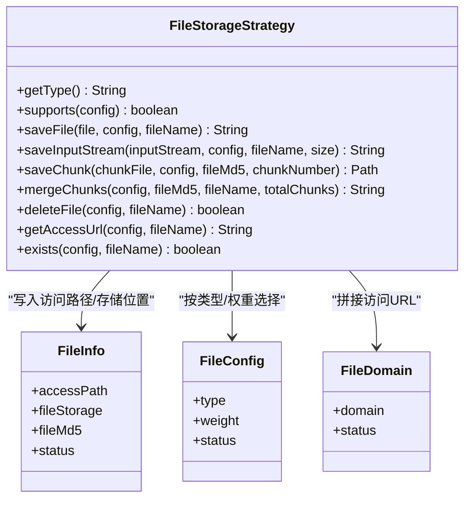
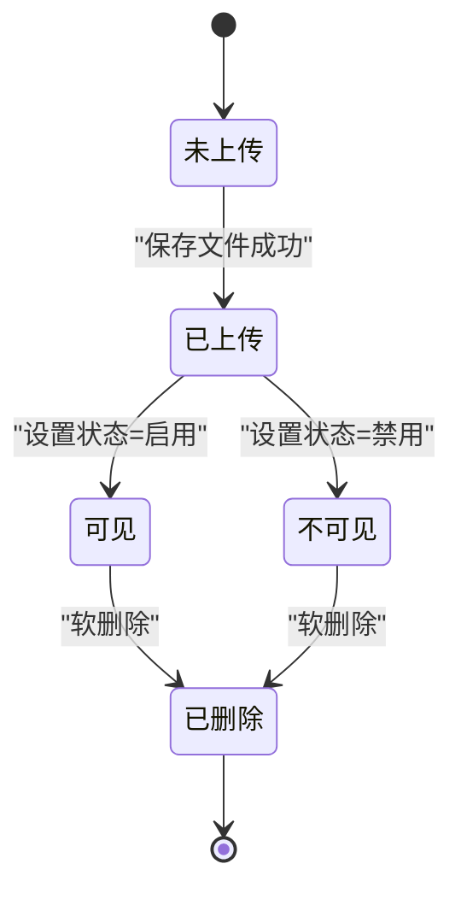
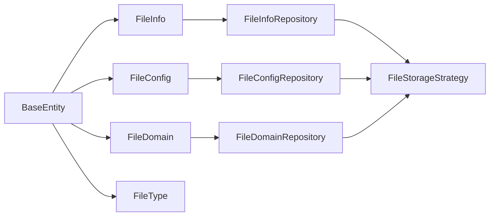

# 文件管理数据库表结构

<cite>
**本文引用的文件**
- [FileInfo.java](file://file-module/src/main/java/com/fastproject/file/domain/FileInfo.java)
- [FileConfig.java](file://file-module/src/main/java/com/fastproject/file/domain/FileConfig.java)
- [FileDomain.java](file://file-module/src/main/java/com/fastproject/file/domain/FileDomain.java)
- [FileType.java](file://file-module/src/main/java/com/fastproject/file/domain/FileType.java)
- [FileInfoRepository.java](file://file-module/src/main/java/com/fastproject/file/repository/db/FileInfoRepository.java)
- [FileConfigRepository.java](file://file-module/src/main/java/com/fastproject/file/repository/db/FileConfigRepository.java)
- [FileDomainRepository.java](file://file-module/src/main/java/com/fastproject/file/repository/db/FileDomainRepository.java)
- [FileInfoMapper.java](file://file-module/src/main/java/com/fastproject/file/mapper/FileInfoMapper.java)
- [FileConfigMapper.java](file://file-module/src/main/java/com/fastproject/file/mapper/FileConfigMapper.java)
- [FileDomainMapper.java](file://file-module/src/main/java/com/fastproject/file/mapper/FileDomainMapper.java)
- [FileStorageStrategy.java](file://file-module/src/main/java/com/fastproject/file/storage/FileStorageStrategy.java)
- [BaseEntity.java](file://common/src/main/java/com/fastproject/db/BaseEntity.java)
</cite>

## 目录
1. [简介](#简介)
2. [项目结构](#项目结构)
3. [核心组件](#核心组件)
4. [架构总览](#架构总览)
5. [详细组件分析](#详细组件分析)
6. [依赖分析](#依赖分析)
7. [性能考虑](#性能考虑)
8. [故障排查指南](#故障排查指南)
9. [结论](#结论)
10. [附录](#附录)

## 简介
本文件面向文件管理模块的数据库表结构设计，围绕以下核心表展开：文件信息表（FileInfo）、文件配置表（FileConfig）、文件域名表（FileDomain）、文件类型表（FileType）。文档从字段定义、约束设计、索引与查询优化、状态管理与数据流转等方面进行系统化说明，并结合存储策略接口映射到实际的数据库表结构，提供可落地的实现指导。

## 项目结构
文件管理模块位于 file-module 中，采用按领域模型分层的组织方式：
- domain：实体类，映射数据库表结构
- repository/db：JPA Repository 接口，提供查询方法与条件
- mapper：MapStruct 映射器，负责 VO/DTO 与实体之间的转换
- storage：存储策略接口，抽象不同存储后端的行为

图表来源
- [FileInfo.java](file://file-module/src/main/java/com/fastproject/file/domain/FileInfo.java#L12-L78)
- [FileConfig.java](file://file-module/src/main/java/com/fastproject/file/domain/FileConfig.java#L12-L65)
- [FileDomain.java](file://file-module/src/main/java/com/fastproject/file/domain/FileDomain.java#L11-L34)
- [FileType.java](file://file-module/src/main/java/com/fastproject/file/domain/FileType.java#L11-L35)
- [FileInfoRepository.java](file://file-module/src/main/java/com/fastproject/file/repository/db/FileInfoRepository.java#L14-L30)
- [FileConfigRepository.java](file://file-module/src/main/java/com/fastproject/file/repository/db/FileConfigRepository.java#L14-L35)
- [FileDomainRepository.java](file://file-module/src/main/java/com/fastproject/file/repository/db/FileDomainRepository.java#L14-L42)
- [FileInfoMapper.java](file://file-module/src/main/java/com/fastproject/file/mapper/FileInfoMapper.java#L15-L29)
- [FileConfigMapper.java](file://file-module/src/main/java/com/fastproject/file/mapper/FileConfigMapper.java#L15-L29)
- [FileDomainMapper.java](file://file-module/src/main/java/com/fastproject/file/mapper/FileDomainMapper.java#L15-L32)
- [FileStorageStrategy.java](file://file-module/src/main/java/com/fastproject/file/storage/FileStorageStrategy.java#L14-L104)
- [BaseEntity.java](file://common/src/main/java/com/fastproject/db/BaseEntity.java)

章节来源
- [FileInfo.java](file://file-module/src/main/java/com/fastproject/file/domain/FileInfo.java#L1-L79)
- [FileConfig.java](file://file-module/src/main/java/com/fastproject/file/domain/FileConfig.java#L1-L66)
- [FileDomain.java](file://file-module/src/main/java/com/fastproject/file/domain/FileDomain.java#L1-L35)
- [FileType.java](file://file-module/src/main/java/com/fastproject/file/domain/FileType.java#L1-L36)

## 核心组件
本节对四个核心表的字段、约束、业务含义进行逐项说明，并给出与存储策略的对应关系。

- 文件信息表（FileInfo）
  - 字段要点
    - 文件名、文件大小、文件类型、文件MD5、文件状态
    - 文件存储位置、访问路径、文件路径
    - 关联字段：配置ID、文件类型ID
  - 约束与索引
    - 基于 MD5 的唯一性校验（存在按 MD5 查询与存在性判断）
    - 访问路径唯一性（存在按访问路径查询）
  - 与存储策略的对应
    - 文件存储位置、访问路径由存储策略返回并持久化
    - 文件MD5用于去重与分片合并校验
    - 文件状态用于控制可见性与生命周期

- 文件配置表（FileConfig）
  - 字段要点
    - 存储路径、访问域名、状态、类型（本地/远程）
    - 描述、远程URL、远程上传凭证、权重
    - 配置JSON字符串（TEXT）
  - 约束与索引
    - 类型唯一性（存在按类型查询与存在性判断）
    - 启用配置按权重降序排序
  - 与存储策略的对应
    - 类型决定策略选择（如 local/oss/cos 等）
    - 权重决定多配置时的选择优先级

- 文件域名表（FileDomain）
  - 字段要点
    - 配置ID、域名、状态
  - 约束与索引
    - 域名唯一性（存在按域名查询与存在性判断）
    - 按配置ID与状态过滤
  - 与存储策略的对应
    - 域名与访问路径共同构成完整访问URL

- 文件类型表（FileType）
  - 字段要点
    - 名称、平台占比、文件空间（MB）
  - 与存储策略的对应
    - 用于分类统计与配额控制（具体使用取决于上层逻辑）

章节来源
- [FileInfo.java](file://file-module/src/main/java/com/fastproject/file/domain/FileInfo.java#L18-L78)
- [FileConfig.java](file://file-module/src/main/java/com/fastproject/file/domain/FileConfig.java#L18-L65)
- [FileDomain.java](file://file-module/src/main/java/com/fastproject/file/domain/FileDomain.java#L17-L34)
- [FileType.java](file://file-module/src/main/java/com/fastproject/file/domain/FileType.java#L17-L35)
- [FileInfoRepository.java](file://file-module/src/main/java/com/fastproject/file/repository/db/FileInfoRepository.java#L14-L30)
- [FileConfigRepository.java](file://file-module/src/main/java/com/fastproject/file/repository/db/FileConfigRepository.java#L14-L35)
- [FileDomainRepository.java](file://file-module/src/main/java/com/fastproject/file/repository/db/FileDomainRepository.java#L14-L42)

## 架构总览
下图展示文件上传/下载流程中，前端、服务层、存储策略与数据库之间的交互关系。

图表来源
- [FileStorageStrategy.java](file://file-module/src/main/java/com/fastproject/file/storage/FileStorageStrategy.java#L14-L104)
- [FileInfoRepository.java](file://file-module/src/main/java/com/fastproject/file/repository/db/FileInfoRepository.java#L14-L30)
- [FileConfigRepository.java](file://file-module/src/main/java/com/fastproject/file/repository/db/FileConfigRepository.java#L14-L35)
- [FileDomainRepository.java](file://file-module/src/main/java/com/fastproject/file/repository/db/FileDomainRepository.java#L14-L42)

## 详细组件分析

### 数据模型与字段定义
- FileInfo（文件信息表）
  - 关键字段：文件名、文件大小、文件类型、文件MD5、文件状态、文件存储位置、访问路径、文件路径、配置ID、文件类型ID
  - 约束：通过仓库接口提供 MD5 唯一性与访问路径唯一性校验
  - 状态：用于软删除与可见性控制（配合 SQL 删除与限制注解）

- FileConfig（文件配置表）
  - 关键字段：存储路径、访问域名、状态、类型、描述、远程URL、远程上传凭证、权重、配置JSON
  - 约束：类型唯一；启用配置按权重降序排序

- FileDomain（文件域名表）
  - 关键字段：配置ID、域名、状态
  - 约束：域名唯一；支持按配置ID与状态筛选

- FileType（文件类型表）
  - 关键字段：名称、平台占比、文件空间（MB）
  - 用途：分类统计与配额控制

图表来源
- [FileInfo.java](file://file-module/src/main/java/com/fastproject/file/domain/FileInfo.java#L18-L78)
- [FileConfig.java](file://file-module/src/main/java/com/fastproject/file/domain/FileConfig.java#L18-L65)
- [FileDomain.java](file://file-module/src/main/java/com/fastproject/file/domain/FileDomain.java#L17-L34)
- [FileType.java](file://file-module/src/main/java/com/fastproject/file/domain/FileType.java#L17-L35)

章节来源
- [FileInfo.java](file://file-module/src/main/java/com/fastproject/file/domain/FileInfo.java#L18-L78)
- [FileConfig.java](file://file-module/src/main/java/com/fastproject/file/domain/FileConfig.java#L18-L65)
- [FileDomain.java](file://file-module/src/main/java/com/fastproject/file/domain/FileDomain.java#L17-L34)
- [FileType.java](file://file-module/src/main/java/com/fastproject/file/domain/FileType.java#L17-L35)

### 查询与索引设计
- FileInfoRepository
  - 按 MD5 查询与存在性判断：用于去重与幂等
  - 按访问路径查询：用于下载与回源
- FileConfigRepository
  - 按类型查询与存在性判断：用于策略选择
  - 启用配置按权重降序：用于优先级选择
- FileDomainRepository
  - 按域名查询与存在性判断：用于访问URL拼接
  - 按配置ID与状态筛选：用于域名白名单与可用域管理

图表来源
- [FileInfoRepository.java](file://file-module/src/main/java/com/fastproject/file/repository/db/FileInfoRepository.java#L14-L30)
- [FileConfigRepository.java](file://file-module/src/main/java/com/fastproject/file/repository/db/FileConfigRepository.java#L14-L35)
- [FileDomainRepository.java](file://file-module/src/main/java/com/fastproject/file/repository/db/FileDomainRepository.java#L14-L42)

章节来源
- [FileInfoRepository.java](file://file-module/src/main/java/com/fastproject/file/repository/db/FileInfoRepository.java#L14-L30)
- [FileConfigRepository.java](file://file-module/src/main/java/com/fastproject/file/repository/db/FileConfigRepository.java#L14-L35)
- [FileDomainRepository.java](file://file-module/src/main/java/com/fastproject/file/repository/db/FileDomainRepository.java#L14-L42)

### 存储策略与数据库表结构的对应关系
- 策略接口职责
  - 保存文件、保存输入流、保存分片、合并分片、删除文件、生成访问URL、检查存在性
- 与数据库的对应
  - 保存文件/输入流/分片后，策略返回访问路径；服务层将访问路径、存储位置、文件MD5等写入 FileInfo
  - 选择策略依据 FileConfig 的类型与权重
  - 访问URL由 FileDomain 的域名与 FileInfo 的访问路径拼接生成

图表来源
- [FileStorageStrategy.java](file://file-module/src/main/java/com/fastproject/file/storage/FileStorageStrategy.java#L14-L104)
- [FileInfo.java](file://file-module/src/main/java/com/fastproject/file/domain/FileInfo.java#L18-L78)
- [FileConfig.java](file://file-module/src/main/java/com/fastproject/file/domain/FileConfig.java#L18-L65)
- [FileDomain.java](file://file-module/src/main/java/com/fastproject/file/domain/FileDomain.java#L17-L34)

章节来源
- [FileStorageStrategy.java](file://file-module/src/main/java/com/fastproject/file/storage/FileStorageStrategy.java#L14-L104)
- [FileInfo.java](file://file-module/src/main/java/com/fastproject/file/domain/FileInfo.java#L18-L78)
- [FileConfig.java](file://file-module/src/main/java/com/fastproject/file/domain/FileConfig.java#L18-L65)
- [FileDomain.java](file://file-module/src/main/java/com/fastproject/file/domain/FileDomain.java#L17-L34)

### 状态管理与数据流转
- 状态字段
  - FileInfo.status：控制可见性与生命周期
  - FileConfig.status：启用/禁用配置
  - FileDomain.status：启用/禁用域名
- 软删除
  - 实体类通过 SQL 删除与限制注解实现软删除（deleted=0），仓库层查询默认受限制
- 流转过程
  - 上传：策略返回访问路径 → 写入 FileInfo → 返回给调用方
  - 下载：按访问路径查询 FileInfo → 返回访问URL或直接输出流

图表来源
- [FileInfo.java](file://file-module/src/main/java/com/fastproject/file/domain/FileInfo.java#L18-L78)
- [FileConfig.java](file://file-module/src/main/java/com/fastproject/file/domain/FileConfig.java#L18-L65)
- [FileDomain.java](file://file-module/src/main/java/com/fastproject/file/domain/FileDomain.java#L17-L34)

章节来源
- [FileInfo.java](file://file-module/src/main/java/com/fastproject/file/domain/FileInfo.java#L18-L78)
- [FileConfig.java](file://file-module/src/main/java/com/fastproject/file/domain/FileConfig.java#L18-L65)
- [FileDomain.java](file://file-module/src/main/java/com/fastproject/file/domain/FileDomain.java#L17-L34)

## 依赖分析
- 组件耦合
  - FileInfo 依赖 BaseEntity（通用主键、审计字段）
  - 仓储层基于 JPA Specification 提供复杂查询能力
  - 映射器负责 DTO/VO 与实体的转换，降低控制器与领域对象耦合
- 外部依赖
  - 存储策略接口抽象了多种后端（本地/远程），便于扩展与替换
  - 仓库层提供按类型/域名/MD5 等关键字段的查询方法

图表来源
- [BaseEntity.java](file://common/src/main/java/com/fastproject/db/BaseEntity.java)
- [FileInfo.java](file://file-module/src/main/java/com/fastproject/file/domain/FileInfo.java#L18-L78)
- [FileConfig.java](file://file-module/src/main/java/com/fastproject/file/domain/FileConfig.java#L18-L65)
- [FileDomain.java](file://file-module/src/main/java/com/fastproject/file/domain/FileDomain.java#L17-L34)
- [FileInfoRepository.java](file://file-module/src/main/java/com/fastproject/file/repository/db/FileInfoRepository.java#L14-L30)
- [FileConfigRepository.java](file://file-module/src/main/java/com/fastproject/file/repository/db/FileConfigRepository.java#L14-L35)
- [FileDomainRepository.java](file://file-module/src/main/java/com/fastproject/file/repository/db/FileDomainRepository.java#L14-L42)
- [FileStorageStrategy.java](file://file-module/src/main/java/com/fastproject/file/storage/FileStorageStrategy.java#L14-L104)

章节来源
- [BaseEntity.java](file://common/src/main/java/com/fastproject/db/BaseEntity.java)
- [FileInfoRepository.java](file://file-module/src/main/java/com/fastproject/file/repository/db/FileInfoRepository.java#L14-L30)
- [FileConfigRepository.java](file://file-module/src/main/java/com/fastproject/file/repository/db/FileConfigRepository.java#L14-L35)
- [FileDomainRepository.java](file://file-module/src/main/java/com/fastproject/file/repository/db/FileDomainRepository.java#L14-L42)
- [FileStorageStrategy.java](file://file-module/src/main/java/com/fastproject/file/storage/FileStorageStrategy.java#L14-L104)

## 性能考虑
- 索引建议
  - FileInfo：file_md5（唯一）、access_path（唯一）、config_id、file_type_id
  - FileConfig：type（唯一）、status+weight（复合索引）
  - FileDomain：domain（唯一）、config_id+status
- 查询优化
  - 使用 exists 查询进行幂等与去重判断，避免不必要的全量扫描
  - 启用配置按权重降序查询时，确保索引命中
- 大数据量处理
  - 分页查询与游标分页相结合
  - 对热点字段建立二级索引，减少回表
  - 使用缓存（如 Redis）缓存常用配置与域名映射，降低数据库压力

## 故障排查指南
- 重复上传问题
  - 现象：相同文件多次入库
  - 排查：检查按 MD5 查询与存在性判断是否正确执行
  - 参考
    - [FileInfoRepository.java](file://file-module/src/main/java/com/fastproject/file/repository/db/FileInfoRepository.java#L14-L30)
- 访问URL错误
  - 现象：无法访问已上传文件
  - 排查：确认 FileDomain 域名状态与 FileConfig 访问域名配置；核对 FileInfo.accessPath
  - 参考
    - [FileDomainRepository.java](file://file-module/src/main/java/com/fastproject/file/repository/db/FileDomainRepository.java#L14-L42)
    - [FileConfig.java](file://file-module/src/main/java/com/fastproject/file/domain/FileConfig.java#L18-L65)
    - [FileInfo.java](file://file-module/src/main/java/com/fastproject/file/domain/FileInfo.java#L18-L78)
- 策略选择异常
  - 现象：无法根据类型选择存储策略
  - 排查：确认 FileConfig.type 唯一性与 FileConfigRepository.existsByType 的返回值
  - 参考
    - [FileConfigRepository.java](file://file-module/src/main/java/com/fastproject/file/repository/db/FileConfigRepository.java#L14-L35)
    - [FileStorageStrategy.java](file://file-module/src/main/java/com/fastproject/file/storage/FileStorageStrategy.java#L14-L104)

章节来源
- [FileInfoRepository.java](file://file-module/src/main/java/com/fastproject/file/repository/db/FileInfoRepository.java#L14-L30)
- [FileDomainRepository.java](file://file-module/src/main/java/com/fastproject/file/repository/db/FileDomainRepository.java#L14-L42)
- [FileConfigRepository.java](file://file-module/src/main/java/com/fastproject/file/repository/db/FileConfigRepository.java#L14-L35)
- [FileStorageStrategy.java](file://file-module/src/main/java/com/fastproject/file/storage/FileStorageStrategy.java#L14-L104)

## 结论
本文档从数据模型、查询索引、状态管理与存储策略四个方面，系统梳理了文件管理模块的数据库表结构与实现要点。通过明确字段定义、约束与索引设计，以及上传/下载流程的状态流转，可有效支撑高并发场景下的文件管理需求。建议在生产环境中结合缓存与分页策略进一步优化性能，并持续监控热点字段与慢查询。

## 附录
- 映射器与实体转换
  - 通过 MapStruct 将 DTO/VO 与实体进行转换，降低控制器与领域对象耦合
  - 参考
    - [FileInfoMapper.java](file://file-module/src/main/java/com/fastproject/file/mapper/FileInfoMapper.java#L15-L29)
    - [FileConfigMapper.java](file://file-module/src/main/java/com/fastproject/file/mapper/FileConfigMapper.java#L15-L29)
    - [FileDomainMapper.java](file://file-module/src/main/java/com/fastproject/file/mapper/FileDomainMapper.java#L15-L32)

章节来源
- [FileInfoMapper.java](file://file-module/src/main/java/com/fastproject/file/mapper/FileInfoMapper.java#L15-L29)
- [FileConfigMapper.java](file://file-module/src/main/java/com/fastproject/file/mapper/FileConfigMapper.java#L15-L29)
- [FileDomainMapper.java](file://file-module/src/main/java/com/fastproject/file/mapper/FileDomainMapper.java#L15-L32)