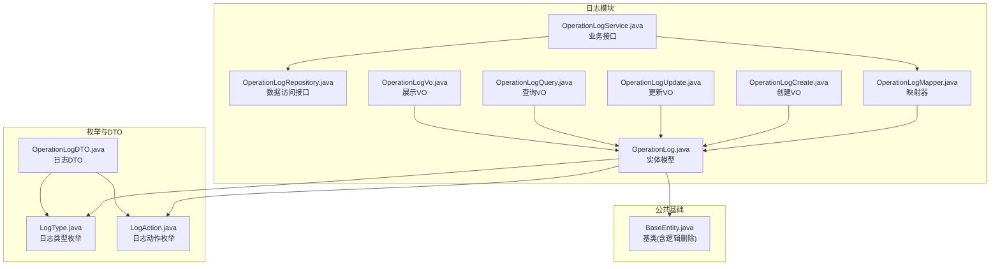
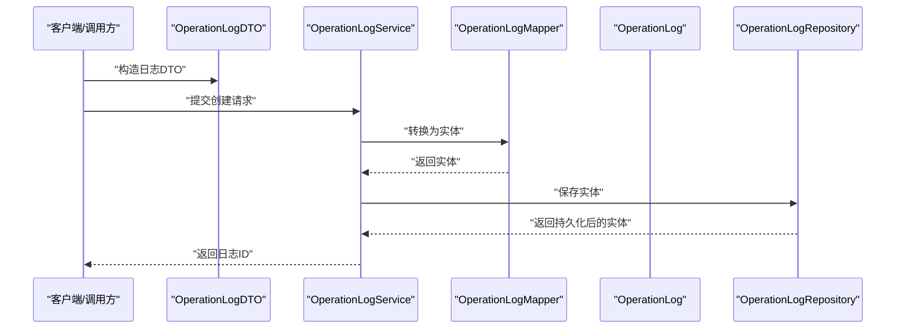
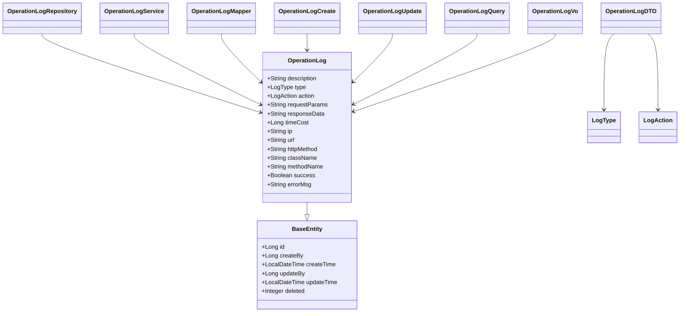

# 日志管理数据库表结构

<cite>
**本文引用的文件**
- [OperationLog.java](file://logs-module/src/main/java/com/fastproject/logs/domain/OperationLog.java)
- [OperationLogMapper.java](file://logs-module/src/main/java/com/fastproject/logs/mapper/OperationLogMapper.java)
- [OperationLogRepository.java](file://logs-module/src/main/java/com/fastproject/logs/repository/OperationLogRepository.java)
- [OperationLogService.java](file://logs-module/src/main/java/com/fastproject/logs/service/OperationLogService.java)
- [OperationLogCreate.java](file://logs-module/src/main/java/com/fastproject/logs/vo/OperationLogCreate.java)
- [OperationLogQuery.java](file://logs-module/src/main/java/com/fastproject/logs/vo/OperationLogQuery.java)
- [OperationLogUpdate.java](file://logs-module/src/main/java/com/fastproject/logs/vo/OperationLogUpdate.java)
- [OperationLogVo.java](file://logs-module/src/main/java/com/fastproject/logs/vo/OperationLogVo.java)
- [BaseEntity.java](file://common/src/main/java/com/fastproject/db/BaseEntity.java)
- [LogType.java](file://logs-api/src/main/java/com/fastproject/logs/enums/LogType.java)
- [LogAction.java](file://logs-api/src/main/java/com/fastproject/logs/enums/LogAction.java)
- [OperationLogDTO.java](file://logs-api/src/main/java/com/fastproject/logs/dto/OperationLogDTO.java)
</cite>

## 目录
1. [简介](#简介)
2. [项目结构](#项目结构)
3. [核心组件](#核心组件)
4. [架构总览](#架构总览)
5. [详细组件分析](#详细组件分析)
6. [依赖关系分析](#依赖关系分析)
7. [性能与查询优化](#性能与查询优化)
8. [生命周期与归档策略](#生命周期与归档策略)
9. [审计与合规性](#审计与合规性)
10. [故障排查指南](#故障排查指南)
11. [结论](#结论)

## 简介
本文件面向日志管理模块的数据库表结构设计，聚焦“操作日志”表（sys_operation_log）的字段定义、数据类型与约束、查询优化策略、索引设计原则、生命周期与归档策略以及审计与合规性要求。文档以代码为依据，结合实体模型、枚举类型、查询条件与分页机制，给出可落地的数据库设计与运维建议。

## 项目结构
日志模块采用分层架构：领域模型（Entity）、仓库（Repository）、服务（Service）、映射器（Mapper）、值对象（VO/DTO）与枚举类型协同工作，最终映射到数据库表。

图表来源
- [OperationLog.java](file://logs-module/src/main/java/com/fastproject/logs/domain/OperationLog.java#L1-L93)
- [OperationLogRepository.java](file://logs-module/src/main/java/com/fastproject/logs/repository/OperationLogRepository.java#L1-L14)
- [OperationLogService.java](file://logs-module/src/main/java/com/fastproject/logs/service/OperationLogService.java#L1-L46)
- [OperationLogMapper.java](file://logs-module/src/main/java/com/fastproject/logs/mapper/OperationLogMapper.java#L1-L28)
- [OperationLogCreate.java](file://logs-module/src/main/java/com/fastproject/logs/vo/OperationLogCreate.java#L1-L78)
- [OperationLogUpdate.java](file://logs-module/src/main/java/com/fastproject/logs/vo/OperationLogUpdate.java#L1-L83)
- [OperationLogQuery.java](file://logs-module/src/main/java/com/fastproject/logs/vo/OperationLogQuery.java#L1-L63)
- [OperationLogVo.java](file://logs-module/src/main/java/com/fastproject/logs/vo/OperationLogVo.java#L1-L95)
- [BaseEntity.java](file://common/src/main/java/com/fastproject/db/BaseEntity.java#L1-L48)
- [LogType.java](file://logs-api/src/main/java/com/fastproject/logs/enums/LogType.java#L1-L33)
- [LogAction.java](file://logs-api/src/main/java/com/fastproject/logs/enums/LogAction.java#L1-L53)
- [OperationLogDTO.java](file://logs-api/src/main/java/com/fastproject/logs/dto/OperationLogDTO.java#L1-L88)

章节来源
- [OperationLog.java](file://logs-module/src/main/java/com/fastproject/logs/domain/OperationLog.java#L1-L93)
- [BaseEntity.java](file://common/src/main/java/com/fastproject/db/BaseEntity.java#L1-L48)

## 核心组件
- 实体模型：OperationLog 映射 sys_operation_log 表，继承 BaseEntity，具备逻辑删除能力。
- 枚举类型：LogType 定义日志类型；LogAction 定义操作动作。
- 数据传输：OperationLogDTO 提供日志采集时的输入载体。
- 值对象：Create/Update/Query/Vo 用于不同场景的数据封装与分页查询。
- 访问层：OperationLogRepository 继承 JPA 的 JpaRepository 与 JpaSpecificationExecutor，支持复杂查询与分页。
- 映射层：OperationLogMapper 负责 VO/DTO 与实体之间的转换。

章节来源
- [OperationLog.java](file://logs-module/src/main/java/com/fastproject/logs/domain/OperationLog.java#L1-L93)
- [OperationLogRepository.java](file://logs-module/src/main/java/com/fastproject/logs/repository/OperationLogRepository.java#L1-L14)
- [OperationLogService.java](file://logs-module/src/main/java/com/fastproject/logs/service/OperationLogService.java#L1-L46)
- [OperationLogMapper.java](file://logs-module/src/main/java/com/fastproject/logs/mapper/OperationLogMapper.java#L1-L28)
- [OperationLogCreate.java](file://logs-module/src/main/java/com/fastproject/logs/vo/OperationLogCreate.java#L1-L78)
- [OperationLogUpdate.java](file://logs-module/src/main/java/com/fastproject/logs/vo/OperationLogUpdate.java#L1-L83)
- [OperationLogQuery.java](file://logs-module/src/main/java/com/fastproject/logs/vo/OperationLogQuery.java#L1-L63)
- [OperationLogVo.java](file://logs-module/src/main/java/com/fastproject/logs/vo/OperationLogVo.java#L1-L95)
- [LogType.java](file://logs-api/src/main/java/com/fastproject/logs/enums/LogType.java#L1-L33)
- [LogAction.java](file://logs-api/src/main/java/com/fastproject/logs/enums/LogAction.java#L1-L53)
- [OperationLogDTO.java](file://logs-api/src/main/java/com/fastproject/logs/dto/OperationLogDTO.java#L1-L88)

## 架构总览
下图展示了从日志采集到持久化、查询与展示的端到端流程。

图表来源
- [OperationLogDTO.java](file://logs-api/src/main/java/com/fastproject/logs/dto/OperationLogDTO.java#L1-L88)
- [OperationLogService.java](file://logs-module/src/main/java/com/fastproject/logs/service/OperationLogService.java#L1-L46)
- [OperationLogMapper.java](file://logs-module/src/main/java/com/fastproject/logs/mapper/OperationLogMapper.java#L1-L28)
- [OperationLog.java](file://logs-module/src/main/java/com/fastproject/logs/domain/OperationLog.java#L1-L93)
- [OperationLogRepository.java](file://logs-module/src/main/java/com/fastproject/logs/repository/OperationLogRepository.java#L1-L14)

## 详细组件分析

### 数据库表结构与字段定义
- 表名：sys_operation_log
- 字段清单与语义
  - id：主键（继承自 BaseEntity）
  - create_by、create_time、update_by、update_time：审计字段（继承自 BaseEntity）
  - deleted：逻辑删除标志（继承自 BaseEntity）
  - description：日志描述（TEXT）
  - type：日志类型（枚举，STRING）
  - action：操作动作（枚举，STRING）
  - request_params：请求参数（TEXT）
  - response_data：响应结果（TEXT）
  - time_cost：执行耗时（毫秒，Long）
  - ip：客户端IP（String）
  - url：请求URL（String）
  - http_method：HTTP方法（String）
  - class_name：类名（String）
  - method_name：方法名（String）
  - success：是否成功（Boolean）
  - error_msg：错误信息（TEXT）
  - operator_id、operator_name：操作人标识（DTO中存在，实体未映射，需按需扩展）

- 约束与默认值
  - 主键：由 BaseEntity 提供
  - 逻辑删除：通过 SQLDelete 与 SQLRestriction 实现软删（deleted=0 生效）
  - 枚举字段：使用 STRING 存储，便于跨语言读取与展示
  - 大文本字段：request_params、response_data、error_msg 使用 TEXT 类型

章节来源
- [OperationLog.java](file://logs-module/src/main/java/com/fastproject/logs/domain/OperationLog.java#L14-L93)
- [BaseEntity.java](file://common/src/main/java/com/fastproject/db/BaseEntity.java#L14-L47)
- [LogType.java](file://logs-api/src/main/java/com/fastproject/logs/enums/LogType.java#L1-L33)
- [LogAction.java](file://logs-api/src/main/java/com/fastproject/logs/enums/LogAction.java#L1-L53)

### 关键字段定义与用途
- 时间戳与耗时
  - create_time：记录创建时间，用于审计与统计
  - time_cost：毫秒级执行耗时，用于性能分析与慢查询定位
- 操作用户
  - create_by：当前登录用户的标识（审计字段）
  - operator_id/operator_name：DTO 中存在但实体未映射，若需持久化请在实体中新增对应列
- 操作类型与动作
  - type：日志类型（系统/业务/登录/异常/操作）
  - action：具体动作（查询/新增/修改/删除/导入/导出/登录/登出/其他）
- 操作内容
  - description：简要描述
  - request_params/response_data/error_msg：请求/响应/错误详情，注意敏感信息脱敏
- 网络与上下文
  - ip、url、http_method、class_name、method_name：用于定位问题与回溯

章节来源
- [OperationLog.java](file://logs-module/src/main/java/com/fastproject/logs/domain/OperationLog.java#L23-L92)
- [OperationLogDTO.java](file://logs-api/src/main/java/com/fastproject/logs/dto/OperationLogDTO.java#L78-L87)
- [LogType.java](file://logs-api/src/main/java/com/fastproject/logs/enums/LogType.java#L1-L33)
- [LogAction.java](file://logs-api/src/main/java/com/fastproject/logs/enums/LogAction.java#L1-L53)

### 查询与分页模型
- 查询条件（OperationLogQuery）
  - 支持按 description、type、action、ip、url、success、createBy、startTime、endTime 进行过滤
  - 继承 PageQuery，支持分页与排序
- 分页返回（OperationLogVo）
  - 返回 id、description、type、action、ip、url、httpMethod、className、methodName、success、createBy、createTime 等常用字段

章节来源
- [OperationLogQuery.java](file://logs-module/src/main/java/com/fastproject/logs/vo/OperationLogQuery.java#L1-L63)
- [OperationLogVo.java](file://logs-module/src/main/java/com/fastproject/logs/vo/OperationLogVo.java#L1-L95)

### 逻辑删除与安全约束
- 通过 @SQLDelete 与 @SQLRestriction 实现软删除，避免物理删除造成审计证据缺失
- 查询默认仅返回 deleted=0 的记录，确保业务查询安全

章节来源
- [OperationLog.java](file://logs-module/src/main/java/com/fastproject/logs/domain/OperationLog.java#L19-L21)

## 依赖关系分析

图表来源
- [OperationLog.java](file://logs-module/src/main/java/com/fastproject/logs/domain/OperationLog.java#L1-L93)
- [BaseEntity.java](file://common/src/main/java/com/fastproject/db/BaseEntity.java#L1-L48)
- [OperationLogRepository.java](file://logs-module/src/main/java/com/fastproject/logs/repository/OperationLogRepository.java#L1-L14)
- [OperationLogService.java](file://logs-module/src/main/java/com/fastproject/logs/service/OperationLogService.java#L1-L46)
- [OperationLogMapper.java](file://logs-module/src/main/java/com/fastproject/logs/mapper/OperationLogMapper.java#L1-L28)
- [OperationLogCreate.java](file://logs-module/src/main/java/com/fastproject/logs/vo/OperationLogCreate.java#L1-L78)
- [OperationLogUpdate.java](file://logs-module/src/main/java/com/fastproject/logs/vo/OperationLogUpdate.java#L1-L83)
- [OperationLogQuery.java](file://logs-module/src/main/java/com/fastproject/logs/vo/OperationLogQuery.java#L1-L63)
- [OperationLogVo.java](file://logs-module/src/main/java/com/fastproject/logs/vo/OperationLogVo.java#L1-L95)
- [LogType.java](file://logs-api/src/main/java/com/fastproject/logs/enums/LogType.java#L1-L33)
- [LogAction.java](file://logs-api/src/main/java/com/fastproject/logs/enums/LogAction.java#L1-L53)
- [OperationLogDTO.java](file://logs-api/src/main/java/com/fastproject/logs/dto/OperationLogDTO.java#L1-L88)

## 性能与查询优化
- 查询路径与性能特征
  - Repository 层基于 JPA SpecificationExecutor，适合动态条件组合查询
  - 建议对高频过滤字段建立索引（见下一节）
  - 对大文本字段（request_params、response_data、error_msg）避免在 WHERE 条件中直接使用，防止全表扫描
- 索引设计原则
  - 建议索引覆盖以下常见查询维度：
    - 时间范围：create_time
    - 操作人：create_by
    - 日志类型：type
    - 操作动作：action
    - IP：ip
    - URL：url
    - 成功标记：success
  - 复合索引建议：
    - (create_time, type)：按时间+类型聚合
    - (create_time, create_by)：按时间+用户聚合
    - (type, action, create_time)：按类型+动作+时间排序
    - (ip, create_time)：按来源+时间检索
- 分页与排序
  - PageQuery 默认支持分页与排序，建议固定排序字段（如 create_time DESC），避免无序扫描
- 写入优化
  - 将 request_params/response_data/error_msg 的敏感信息脱敏后再入库
  - 控制单条日志大小，避免超长文本影响写入与查询性能

章节来源
- [OperationLogRepository.java](file://logs-module/src/main/java/com/fastproject/logs/repository/OperationLogRepository.java#L1-L14)
- [OperationLogQuery.java](file://logs-module/src/main/java/com/fastproject/logs/vo/OperationLogQuery.java#L16-L62)

## 生命周期与归档策略
- 逻辑删除
  - 通过 deleted 字段软删除，保留审计证据，避免真实删除导致数据不可追溯
- 归档与清理
  - 建议按月/季度归档历史日志至冷存储（如对象存储或专用归档数据库）
  - 归档前对敏感字段进行脱敏与压缩
  - 设置自动清理策略（例如：保留最近180天的在线数据，其余归档）
- 存储优化
  - 大文本字段可考虑外部化存储（URL指向对象存储），仅保留摘要或短文本
  - 对低频访问的历史数据启用压缩与只读副本

章节来源
- [OperationLog.java](file://logs-module/src/main/java/com/fastproject/logs/domain/OperationLog.java#L19-L21)
- [BaseEntity.java](file://common/src/main/java/com/fastproject/db/BaseEntity.java#L44-L47)

## 审计与合规性
- 审计字段
  - create_by、create_time、update_by、update_time：满足审计追踪要求
  - deleted：软删除保证不可逆删除
- 合规要求
  - 敏感信息保护：request_params/response_data/error_msg 中的敏感字段需脱敏
  - 数据最小化：仅保留必要的日志字段，避免过度采集
  - 可追溯性：保留足够时间窗口的日志以便事件回溯
- 报表与留存
  - 建议定期生成日志统计报表（类型分布、失败率、慢查询TOP等）
  - 遵循数据留存期限与销毁流程

章节来源
- [OperationLog.java](file://logs-module/src/main/java/com/fastproject/logs/domain/OperationLog.java#L23-L92)
- [BaseEntity.java](file://common/src/main/java/com/fastproject/db/BaseEntity.java#L24-L47)

## 故障排查指南
- 常见问题
  - 查询不到数据：确认是否被软删除（deleted=0）限制
  - 大字段查询慢：避免在 WHERE 中直接使用 TEXT 字段，优先使用时间、类型、IP 等索引字段
  - 分页错乱：确认排序字段是否固定，避免无序分页
- 排查步骤
  - 核对查询条件与索引覆盖情况
  - 检查 create_time、create_by、type、action、ip、url、success 等字段是否正确传入
  - 对 request_params/response_data/error_msg 进行脱敏与截断测试，排除超长文本影响

章节来源
- [OperationLogRepository.java](file://logs-module/src/main/java/com/fastproject/logs/repository/OperationLogRepository.java#L1-L14)
- [OperationLogQuery.java](file://logs-module/src/main/java/com/fastproject/logs/vo/OperationLogQuery.java#L16-L62)

## 结论
本文基于现有代码，给出了操作日志表（sys_operation_log）的字段设计、查询模型、索引与性能优化建议、生命周期与归档策略以及审计与合规性要求。建议在生产环境中补充操作人字段映射、完善索引覆盖、实施脱敏与归档策略，并持续监控查询性能与数据增长趋势，确保日志系统在高并发与长期运行下的稳定性与可维护性。