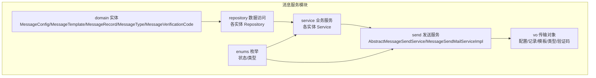
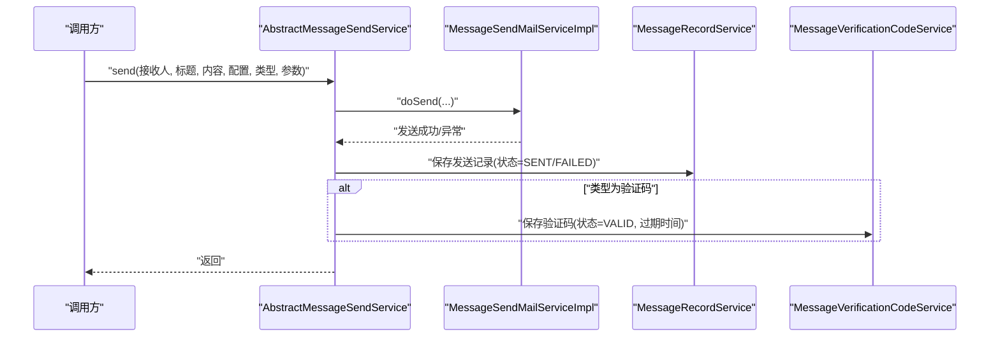
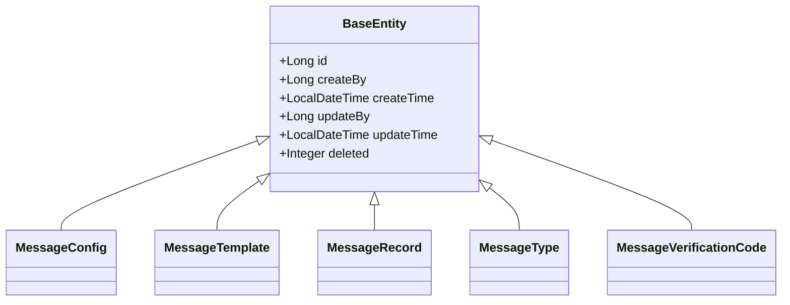
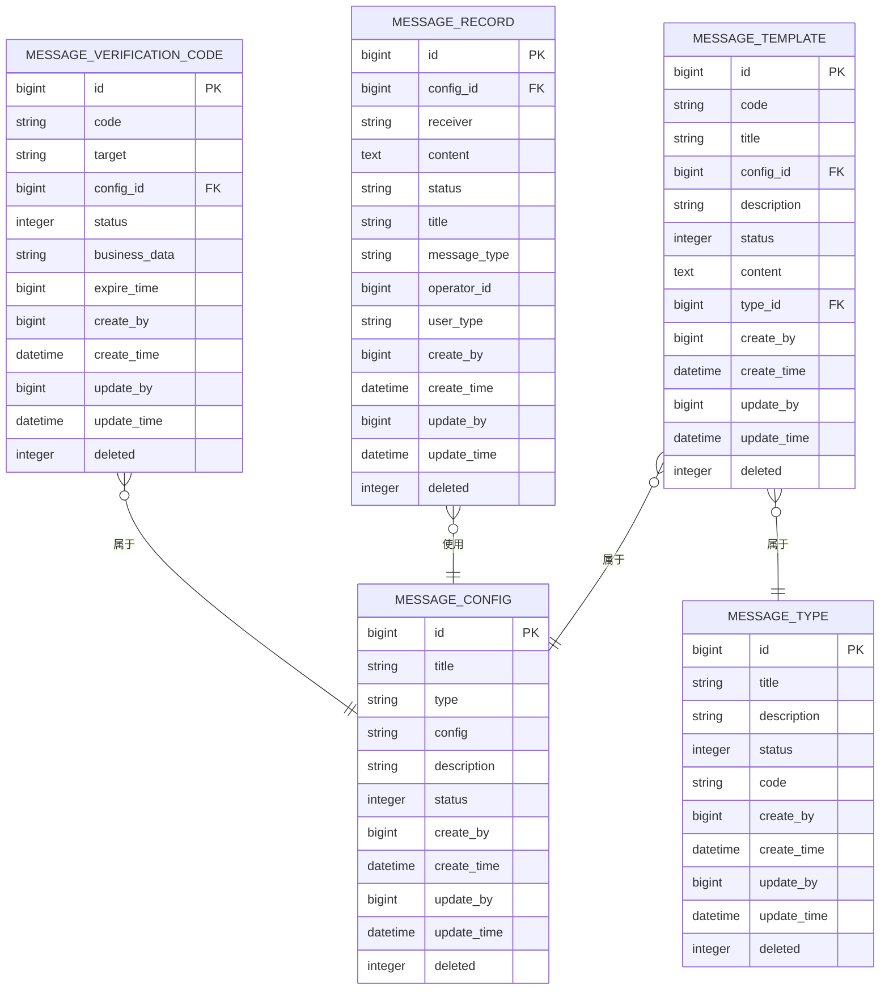

# 消息服务数据库表结构

<cite>
**本文引用的文件**
- [MessageConfig.java](file://message-module/src/main/java/com/fastproject/message/domain/MessageConfig.java)
- [MessageTemplate.java](file://message-module/src/main/java/com/fastproject/message/domain/MessageTemplate.java)
- [MessageRecord.java](file://message-module/src/main/java/com/fastproject/message/domain/MessageRecord.java)
- [MessageType.java](file://message-module/src/main/java/com/fastproject/message/domain/MessageType.java)
- [MessageVerificationCode.java](file://message-module/src/main/java/com/fastproject/message/domain/MessageVerificationCode.java)
- [BaseEntity.java](file://common/src/main/java/com/fastproject/db/BaseEntity.java)
- [SnowflakeIdListener.java](file://common/src/main/java/com/fastproject/db/SnowflakeIdListener.java)
- [MessageRecordStatusEnum.java](file://message-api/src/main/java/com/fastproject/message/enums/MessageRecordStatusEnum.java)
- [MessageTypeEnum.java](file://message-api/src/main/java/com/fastproject/message/enums/MessageTypeEnum.java)
- [MessageVerificationCodeStatusEnum.java](file://message-api/src/main/java/com/fastproject/message/enums/MessageVerificationCodeStatusEnum.java)
- [AbstractMessageSendService.java](file://message-module/src/main/java/com/fastproject/message/send/AbstractMessageSendService.java)
- [MessageSendMailServiceImpl.java](file://message-module/src/main/java/com/fastproject/message/send/impl/MessageSendMailServiceImpl.java)
- [MailConfigVo.java](file://message-module/src/main/java/com/fastproject/message/send/vo/MailConfigVo.java)
</cite>

## 目录
1. [简介](#简介)
2. [项目结构](#项目结构)
3. [核心组件](#核心组件)
4. [架构总览](#架构总览)
5. [详细组件分析](#详细组件分析)
6. [依赖关系分析](#依赖关系分析)
7. [性能考量](#性能考量)
8. [故障排查指南](#故障排查指南)
9. [结论](#结论)
10. [附录](#附录)

## 简介
本文件系统化梳理消息服务模块的数据库表结构与关键字段设计，覆盖消息配置表、消息模板表、消息记录表、消息类型表、验证码表等，并结合发送策略、模板变量、发送状态、验证码有效期等要点，解释消息队列的数据库实现与异步处理机制，提供性能优化与失败重试策略建议，以及消息审计与合规性设计考虑，最后给出多渠道消息系统的数据库架构指导。

## 项目结构
消息服务模块采用分层与按功能域划分的组织方式：
- domain 层：定义实体类，映射数据库表结构
- enums 层：定义状态与类型枚举
- send 层：抽象发送服务与具体渠道实现（如邮件）
- repository 层：数据访问接口（位于 repository/db 下）
- service 层：业务服务接口与实现（位于 service 下）
- vo 层：配置、记录、模板、类型、验证码等传输对象

**章节来源**
- file://message-module/src/main/java/com/fastproject/message/domain/MessageConfig.java#L1-L45
- file://message-module/src/main/java/com/fastproject/message/domain/MessageTemplate.java#L1-L55
- file://message-module/src/main/java/com/fastproject/message/domain/MessageRecord.java#L1-L59
- file://message-module/src/main/java/com/fastproject/message/domain/MessageType.java#L1-L39
- file://message-module/src/main/java/com/fastproject/message/domain/MessageVerificationCode.java#L1-L49

## 核心组件
本节聚焦五张核心表的结构设计与字段语义，统一遵循通用基类的主键、审计与软删除机制。

- 基类与通用字段
  - 主键：雪花ID生成
  - 审计：创建人、创建时间、更新人、更新时间
  - 软删除：deleted 字段，配合 SQL 删除与限制注解实现逻辑删除

- 表结构概览
  - 消息配置表（message_config）：存储渠道配置（如邮件 SMTP），含标题、类型、配置JSON、描述、状态
  - 消息模板表（message_template）：模板代码、标题、所属配置ID、描述、状态、内容、类型ID
  - 消息记录表（message_record）：配置ID、接收人、内容、状态、标题、消息类型、操作用户、用户类型
  - 消息类型表（message_type）：标题、描述、状态、代码
  - 验证码表（message_verification_code）：验证码、发送目标、配置ID、状态、业务数据、过期时间

**章节来源**
- file://common/src/main/java/com/fastproject/db/BaseEntity.java#L1-L48
- file://common/src/main/java/com/fastproject/db/SnowflakeIdListener.java#L1-L64
- file://message-module/src/main/java/com/fastproject/message/domain/MessageConfig.java#L1-L45
- file://message-module/src/main/java/com/fastproject/message/domain/MessageTemplate.java#L1-L55
- file://message-module/src/main/java/com/fastproject/message/domain/MessageRecord.java#L1-L59
- file://message-module/src/main/java/com/fastproject/message/domain/MessageType.java#L1-L39
- file://message-module/src/main/java/com/fastproject/message/domain/MessageVerificationCode.java#L1-L49

## 架构总览
消息发送流程从调用方发起，经由发送服务抽象与具体渠道实现，最终落库记录发送结果与验证码信息；同时通过枚举维护状态与类型，确保一致性与可审计性。

**图表来源**
- [AbstractMessageSendService.java](file://message-module/src/main/java/com/fastproject/message/send/AbstractMessageSendService.java#L26-L63)
- [MessageSendMailServiceImpl.java](file://message-module/src/main/java/com/fastproject/message/send/impl/MessageSendMailServiceImpl.java#L47-L98)

**章节来源**
- file://message-module/src/main/java/com/fastproject/message/send/AbstractMessageSendService.java#L1-L68
- file://message-module/src/main/java/com/fastproject/message/send/impl/MessageSendMailServiceImpl.java#L1-L100

## 详细组件分析

### 消息配置表（message_config）
- 设计要点
  - 存放渠道配置（如邮件 SMTP），以 JSON 形式承载配置项
  - 支持按类型区分不同渠道配置
  - 状态字段用于开关控制
- 关键字段
  - 标题、类型、配置(JSON)、描述、状态、通用审计字段、软删除
- 使用场景
  - 作为发送渠道的参数来源，邮件实现中解析为配置对象

**章节来源**
- file://message-module/src/main/java/com/fastproject/message/domain/MessageConfig.java#L1-L45
- file://message-module/src/main/java/com/fastproject/message/send/impl/MessageSendMailServiceImpl.java#L48-L98

### 消息模板表（message_template）
- 设计要点
  - 模板唯一标识（code）、标题、描述
  - 绑定到配置（configId）与类型（typeId）
  - 内容字段承载模板文本（支持变量占位）
  - 状态字段用于启用/禁用
- 关键字段
  - code、title、configId、description、status、content、typeId、通用审计字段、软删除
- 模板变量
  - 变量在发送时由上层参数传入，模板内容中预留占位符，由渠道实现进行替换后渲染

**章节来源**
- file://message-module/src/main/java/com/fastproject/message/domain/MessageTemplate.java#L1-L55

### 消息记录表（message_record）
- 设计要点
  - 记录每次发送的结果与上下文
  - 状态字段使用枚举值（SENT/FAILED）
  - 关联配置ID、接收人、标题、消息类型、操作用户等
- 关键字段
  - configId、receiver、content、status、title、messageType、operatorId、userType、通用审计字段、软删除
- 审计与合规
  - 通过 operatorId、userType、messageType 等字段支撑审计追踪与合规要求

**章节来源**
- file://message-module/src/main/java/com/fastproject/message/domain/MessageRecord.java#L1-L59
- file://message-api/src/main/java/com/fastproject/message/enums/MessageRecordStatusEnum.java#L1-L27

### 消息类型表（message_type）
- 设计要点
  - 定义消息类型（如验证码、通知），便于分类管理与策略控制
  - 提供代码与状态，便于程序与前端识别
- 关键字段
  - title、description、status、code、通用审计字段、软删除
- 类型枚举
  - 枚举提供 CODE/NOTICE 等类型常量，与数据库 code 字段一一对应

**章节来源**
- file://message-module/src/main/java/com/fastproject/message/domain/MessageType.java#L1-L39
- file://message-api/src/main/java/com/fastproject/message/enums/MessageTypeEnum.java#L1-L26

### 验证码表（message_verification_code）
- 设计要点
  - 存储验证码及其目标、配置、业务数据与过期时间
  - 状态字段使用枚举（VALID/USED/EXPIRED）
- 关键字段
  - code、target、configId、status、businessData、expireTime、通用审计字段、软删除
- 有效期策略
  - 发送时设置过期时间（示例：当前时间+10分钟），到期后状态更新为 EXPIRED

**章节来源**
- file://message-module/src/main/java/com/fastproject/message/domain/MessageVerificationCode.java#L1-L49
- file://message-api/src/main/java/com/fastproject/message/enums/MessageVerificationCodeStatusEnum.java#L1-L31
- file://message-module/src/main/java/com/fastproject/message/send/AbstractMessageSendService.java#L58-L61

### 发送策略与模板变量
- 发送策略
  - 抽象发送服务封装发送流程：先执行 doSend，再根据结果写入发送记录
  - 验证码类型自动保存验证码与过期时间
- 模板变量
  - 通过参数字典传入，由渠道实现负责替换模板中的占位符
- 状态与类型
  - 使用枚举统一管理状态与类型，保证一致性与可扩展性

**章节来源**
- file://message-module/src/main/java/com/fastproject/message/send/AbstractMessageSendService.java#L26-L63
- file://message-module/src/main/java/com/fastproject/message/send/impl/MessageSendMailServiceImpl.java#L48-L98

### 邮件发送配置对象
- 邮件配置对象承载 SMTP 主机、端口、认证、协议、默认编码、发件人等
- 配置来源于消息配置表的配置字段（JSON），发送前解析为对象

**章节来源**
- file://message-module/src/main/java/com/fastproject/message/send/vo/MailConfigVo.java#L1-L70
- file://message-module/src/main/java/com/fastproject/message/send/impl/MessageSendMailServiceImpl.java#L48-L98

## 依赖关系分析
- 实体与基类
  - 各实体继承统一基类，共享主键、审计与软删除能力
- 发送服务与枚举
  - 发送服务依赖枚举进行状态判定与记录写入
- 渠道实现与配置
  - 邮件实现依赖配置对象解析与 JavaMailSender

**图表来源**
- [BaseEntity.java](file://common/src/main/java/com/fastproject/db/BaseEntity.java#L14-L47)
- [MessageConfig.java](file://message-module/src/main/java/com/fastproject/message/domain/MessageConfig.java#L17-L44)
- [MessageTemplate.java](file://message-module/src/main/java/com/fastproject/message/domain/MessageTemplate.java#L17-L54)
- [MessageRecord.java](file://message-module/src/main/java/com/fastproject/message/domain/MessageRecord.java#L17-L58)
- [MessageType.java](file://message-module/src/main/java/com/fastproject/message/domain/MessageType.java#L17-L38)
- [MessageVerificationCode.java](file://message-module/src/main/java/com/fastproject/message/domain/MessageVerificationCode.java#L17-L48)

**章节来源**
- file://common/src/main/java/com/fastproject/db/BaseEntity.java#L1-L48
- file://message-module/src/main/java/com/fastproject/message/domain/MessageConfig.java#L1-L45
- file://message-module/src/main/java/com/fastproject/message/domain/MessageTemplate.java#L1-L55
- file://message-module/src/main/java/com/fastproject/message/domain/MessageRecord.java#L1-L59
- file://message-module/src/main/java/com/fastproject/message/domain/MessageType.java#L1-L39
- file://message-module/src/main/java/com/fastproject/message/domain/MessageVerificationCode.java#L1-L49

## 性能考量
- 异步与队列
  - 当前实现为同步发送，建议引入消息队列（如 RabbitMQ/Kafka）进行异步解耦
  - 将发送请求入队，消费者异步拉取并执行发送，提升吞吐与稳定性
- 重试与幂等
  - 失败重试：对发送异常进行指数退避重试，避免雪崩
  - 幂等控制：基于业务唯一键（如验证码+目标+模板）去重，防止重复发送
- 缓存与限流
  - 对高频目标进行缓存与限流，避免瞬时洪峰
- 分库分表
  - 按时间维度或业务维度分片，降低单表压力

## 故障排查指南
- 发送失败
  - 检查消息记录表的状态是否为“发送失败”，定位异常原因
  - 核对配置表中的渠道配置是否正确（主机、端口、认证等）
- 验证码无效
  - 核验验证码表状态是否为“已使用/已过期”
  - 检查过期时间是否正确设置
- 审计与合规
  - 通过消息记录表的 operatorId、userType、messageType 等字段进行审计追踪

**章节来源**
- file://message-module/src/main/java/com/fastproject/message/send/AbstractMessageSendService.java#L31-L37
- file://message-module/src/main/java/com/fastproject/message/send/impl/MessageSendMailServiceImpl.java#L94-L97
- file://message-module/src/main/java/com/fastproject/message/domain/MessageVerificationCode.java#L36-L47

## 结论
该消息服务模块通过清晰的实体模型与枚举体系，实现了配置化、模板化与可审计的消息发送能力。结合异步队列、重试与幂等策略，可在保证高可用的同时满足合规审计需求。建议进一步完善多渠道适配与监控告警，持续优化性能与稳定性。

## 附录
- 数据模型 ER 图

**图表来源**
- [MessageConfig.java](file://message-module/src/main/java/com/fastproject/message/domain/MessageConfig.java#L17-L44)
- [MessageTemplate.java](file://message-module/src/main/java/com/fastproject/message/domain/MessageTemplate.java#L17-L54)
- [MessageRecord.java](file://message-module/src/main/java/com/fastproject/message/domain/MessageRecord.java#L17-L58)
- [MessageType.java](file://message-module/src/main/java/com/fastproject/message/domain/MessageType.java#L17-L38)
- [MessageVerificationCode.java](file://message-module/src/main/java/com/fastproject/message/domain/MessageVerificationCode.java#L17-L48)