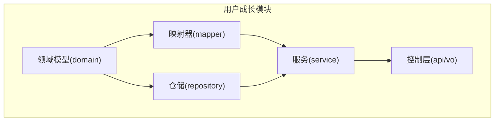
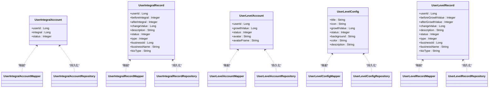
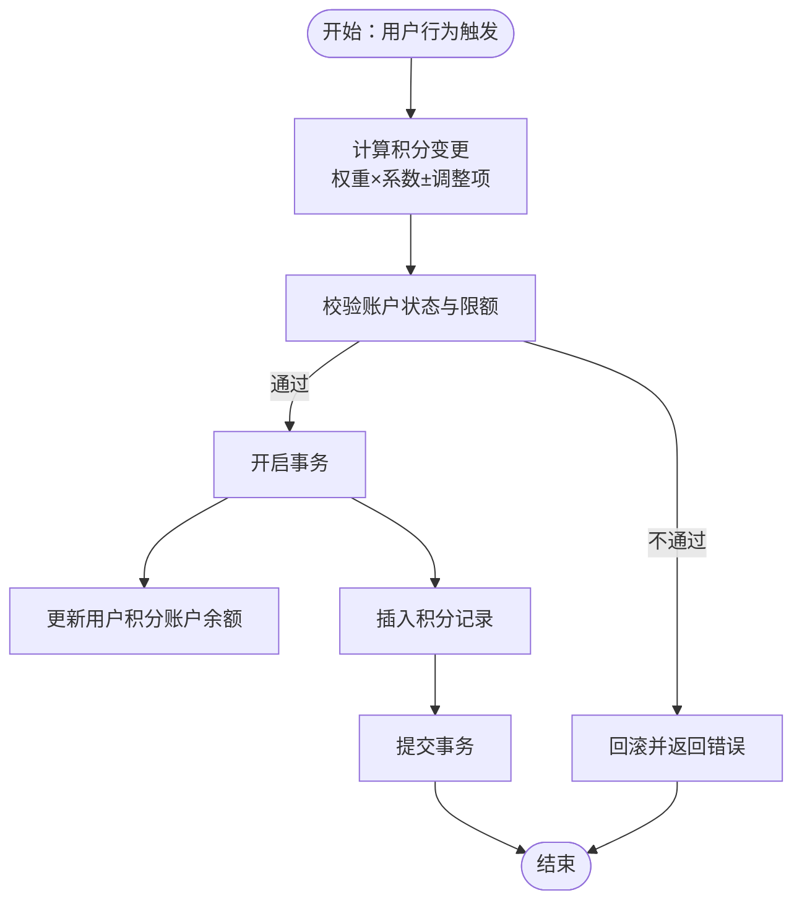
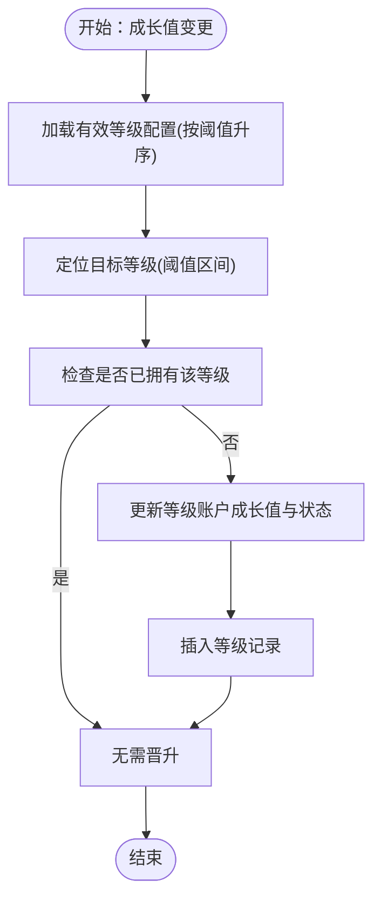
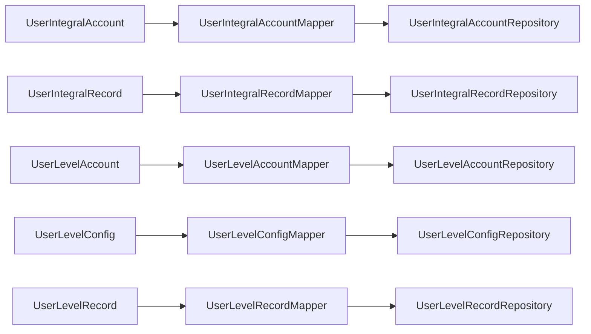

# 用户成长数据库表结构

<cite>
**本文引用的文件**
- [UserIntegralAccount.java](file://user-growth-module/src/main/java/com/fastproject/usergrowth/domain/UserIntegralAccount.java)
- [UserIntegralRecord.java](file://user-growth-module/src/main/java/com/fastproject/usergrowth/domain/UserIntegralRecord.java)
- [UserLevelAccount.java](file://user-growth-module/src/main/java/com/fastproject/usergrowth/domain/UserLevelAccount.java)
- [UserLevelConfig.java](file://user-growth-module/src/main/java/com/fastproject/usergrowth/domain/UserLevelConfig.java)
- [UserLevelRecord.java](file://user-growth-module/src/main/java/com/fastproject/usergrowth/domain/UserLevelRecord.java)
- [UserIntegralAccountMapper.java](file://user-growth-module/src/main/java/com/fastproject/usergrowth/mapper/UserIntegralAccountMapper.java)
- [UserIntegralRecordMapper.java](file://user-growth-module/src/main/java/com/fastproject/usergrowth/mapper/UserIntegralRecordMapper.java)
- [UserLevelAccountMapper.java](file://user-growth-module/src/main/java/com/fastproject/usergrowth/mapper/UserLevelAccountMapper.java)
- [UserLevelConfigMapper.java](file://user-growth-module/src/main/java/com/fastproject/usergrowth/mapper/UserLevelConfigMapper.java)
- [UserLevelRecordMapper.java](file://user-growth-module/src/main/java/com/fastproject/usergrowth/mapper/UserLevelRecordMapper.java)
- [UserIntegralAccountRepository.java](file://user-growth-module/src/main/java/com/fastproject/usergrowth/repository/db/UserIntegralAccountRepository.java)
- [UserIntegralRecordRepository.java](file://user-growth-module/src/main/java/com/fastproject/usergrowth/repository/db/UserIntegralRecordRepository.java)
- [UserLevelAccountRepository.java](file://user-growth-module/src/main/java/com/fastproject/usergrowth/repository/db/UserLevelAccountRepository.java)
- [UserLevelConfigRepository.java](file://user-growth-module/src/main/java/com/fastproject/usergrowth/repository/db/UserLevelConfigRepository.java)
- [UserLevelRecordRepository.java](file://user-growth-module/src/main/java/com/fastproject/usergrowth/repository/db/UserLevelRecordRepository.java)
</cite>

## 目录
1. [引言](#引言)
2. [项目结构](#项目结构)
3. [核心组件](#核心组件)
4. [架构总览](#架构总览)
5. [详细组件分析](#详细组件分析)
6. [依赖关系分析](#依赖关系分析)
7. [性能考虑](#性能考虑)
8. [故障排查指南](#故障排查指南)
9. [结论](#结论)
10. [附录](#附录)

## 引言
本文件系统化梳理用户成长模块的数据库表结构与实现要点，覆盖以下核心表：用户积分账户表、积分记录表、用户等级账户表、等级配置表、等级记录表。文档从表结构设计、字段语义、业务规则（积分计算、等级晋升、权益发放）、数据累积与查询优化、行为数据关联、统计分析支撑以及留存与活跃度提升的数据库层面支持等方面进行深入解析，并提供可视化图示帮助理解。

## 项目结构
用户成长模块采用分层架构：领域模型(domain)、映射器(mapper)、仓储(repository)、服务(service)与控制层(api/vo)。数据库持久化基于Spring Data JPA，使用实体注解定义表结构，仓库接口提供查询能力，映射器负责实体与DTO/Vo之间的转换。

**章节来源**
- file://user-growth-module/src/main/java/com/fastproject/usergrowth/domain/UserIntegralAccount.java#L1-L34
- file://user-growth-module/src/main/java/com/fastproject/usergrowth/mapper/UserIntegralAccountMapper.java#L1-L28
- file://user-growth-module/src/main/java/com/fastproject/usergrowth/repository/db/UserIntegralAccountRepository.java#L1-L12

## 核心组件
本节对五大核心表的结构与职责进行逐一说明，并给出字段语义与典型用途。

- 用户积分账户表(user_integral_account)
  - 关键字段：用户标识、当前积分、状态
  - 用途：记录用户的积分余额与可用状态
- 积分记录表(user_integral_record)
  - 关键字段：用户标识、变更前后积分、变更值、业务信息、类型、状态
  - 用途：完整追踪每次积分变动的明细与来源
- 用户等级账户表(user_level_account)
  - 关键字段：用户标识、成长值、状态、个性化头像与头像框
  - 用途：记录用户的成长值与等级相关展示资源
- 等级配置表(user_level_config)
  - 关键字段：等级标题、图标、背景、颜色、成长值阈值、状态、描述
  - 用途：定义等级晋升门槛与展示样式
- 等级记录表(user_level_record)
  - 关键字段：用户标识、变更前后成长值、变更值、业务信息、类型、状态
  - 用途：完整追踪每次等级变动的明细与来源

**章节来源**
- file://user-growth-module/src/main/java/com/fastproject/usergrowth/domain/UserIntegralAccount.java#L11-L34
- file://user-growth-module/src/main/java/com/fastproject/usergrowth/domain/UserIntegralRecord.java#L12-L70
- file://user-growth-module/src/main/java/com/fastproject/usergrowth/domain/UserLevelAccount.java#L11-L45
- file://user-growth-module/src/main/java/com/fastproject/usergrowth/domain/UserLevelConfig.java#L13-L57
- file://user-growth-module/src/main/java/com/fastproject/usergrowth/domain/UserLevelRecord.java#L12-L71

## 架构总览
下图展示了用户成长模块的类关系与职责边界，体现实体、映射器、仓储与控制层的协作。

**图表来源**
- [UserIntegralAccount.java](file://user-growth-module/src/main/java/com/fastproject/usergrowth/domain/UserIntegralAccount.java#L11-L34)
- [UserIntegralRecord.java](file://user-growth-module/src/main/java/com/fastproject/usergrowth/domain/UserIntegralRecord.java#L12-L70)
- [UserLevelAccount.java](file://user-growth-module/src/main/java/com/fastproject/usergrowth/domain/UserLevelAccount.java#L11-L45)
- [UserLevelConfig.java](file://user-growth-module/src/main/java/com/fastproject/usergrowth/domain/UserLevelConfig.java#L13-L57)
- [UserLevelRecord.java](file://user-growth-module/src/main/java/com/fastproject/usergrowth/domain/UserLevelRecord.java#L12-L71)
- [UserIntegralAccountMapper.java](file://user-growth-module/src/main/java/com/fastproject/usergrowth/mapper/UserIntegralAccountMapper.java#L13-L28)
- [UserIntegralRecordMapper.java](file://user-growth-module/src/main/java/com/fastproject/usergrowth/mapper/UserIntegralRecordMapper.java#L13-L28)
- [UserLevelAccountMapper.java](file://user-growth-module/src/main/java/com/fastproject/usergrowth/mapper/UserLevelAccountMapper.java#L13-L28)
- [UserLevelConfigMapper.java](file://user-growth-module/src/main/java/com/fastproject/usergrowth/mapper/UserLevelConfigMapper.java#L13-L28)
- [UserLevelRecordMapper.java](file://user-growth-module/src/main/java/com/fastproject/usergrowth/mapper/UserLevelRecordMapper.java#L13-L28)
- [UserIntegralAccountRepository.java](file://user-growth-module/src/main/java/com/fastproject/usergrowth/repository/db/UserIntegralAccountRepository.java#L8-L12)
- [UserIntegralRecordRepository.java](file://user-growth-module/src/main/java/com/fastproject/usergrowth/repository/db/UserIntegralRecordRepository.java#L8-L11)
- [UserLevelAccountRepository.java](file://user-growth-module/src/main/java/com/fastproject/usergrowth/repository/db/UserLevelAccountRepository.java#L8-L13)
- [UserLevelConfigRepository.java](file://user-growth-module/src/main/java/com/fastproject/usergrowth/repository/db/UserLevelConfigRepository.java#L10-L15)
- [UserLevelRecordRepository.java](file://user-growth-module/src/main/java/com/fastproject/usergrowth/repository/db/UserLevelRecordRepository.java#L8-L11)

## 详细组件分析

### 用户积分账户表(user_integral_account)
- 表结构要点
  - 用户标识：唯一确定用户
  - 当前积分：整型数值，用于累计与消费
  - 状态：启用/禁用等业务状态
- 典型流程
  - 新增：首次为用户创建积分账户
  - 更新：积分变动时原子性更新余额
  - 查询：按用户ID获取账户详情
- 字段复杂度与索引建议
  - 建议在用户ID上建立唯一索引；在状态上建立普通索引以支持批量查询
- 错误处理
  - 并发更新需通过数据库事务与行级锁保证一致性
  - 负值检查与上限控制由应用层或触发器保障

**章节来源**
- file://user-growth-module/src/main/java/com/fastproject/usergrowth/domain/UserIntegralAccount.java#L11-L34
- file://user-growth-module/src/main/java/com/fastproject/usergrowth/repository/db/UserIntegralAccountRepository.java#L8-L12

### 积分记录表(user_integral_record)
- 表结构要点
  - 用户标识、变更前后积分、变更值、业务信息（ID/名称/类型）、类型、状态
  - 便于审计与复核，支持按业务维度聚合
- 典型流程
  - 写入：每次积分变动生成一条记录
  - 查询：按用户、时间、业务类型、状态筛选
- 字段复杂度与索引建议
  - 建议在用户ID、业务ID、业务类型、创建时间上建立复合索引
  - TEXT字段仅在必要时使用，避免影响排序与索引效率
- 错误处理
  - 保证记录与账户更新的事务一致性

**章节来源**
- file://user-growth-module/src/main/java/com/fastproject/usergrowth/domain/UserIntegralRecord.java#L12-L70
- file://user-growth-module/src/main/java/com/fastproject/usergrowth/repository/db/UserIntegralRecordRepository.java#L8-L11

### 用户等级账户表(user_level_account)
- 表结构要点
  - 用户标识、成长值、状态、个性化头像与头像框
  - 成长值决定当前等级，个性化字段用于等级权益展示
- 典型流程
  - 新增：首次为用户创建等级账户
  - 更新：成长值变动时原子性更新
  - 查询：按用户ID获取等级与展示资源
- 字段复杂度与索引建议
  - 建议在用户ID上建立唯一索引；在状态与成长值上建立组合索引以支持等级查询
- 错误处理
  - 成长值非负校验；等级晋升与降级需同步记录等级记录表

**章节来源**
- file://user-growth-module/src/main/java/com/fastproject/usergrowth/domain/UserLevelAccount.java#L11-L45
- file://user-growth-module/src/main/java/com/fastproject/usergrowth/repository/db/UserLevelAccountRepository.java#L8-L13

### 等级配置表(user_level_config)
- 表结构要点
  - 等级标题、图标、背景、颜色、成长值阈值、状态、描述
  - 作为等级晋升的规则依据
- 典型流程
  - 新增/编辑：维护等级阈值与展示样式
  - 查询：按状态升序获取有效等级配置，用于判定晋升
- 字段复杂度与索引建议
  - 建议在状态与成长值上建立索引，支持快速定位阈值区间
- 错误处理
  - 阈值连续性校验（无重叠、无空洞）

**章节来源**
- file://user-growth-module/src/main/java/com/fastproject/usergrowth/domain/UserLevelConfig.java#L13-L57
- file://user-growth-module/src/main/java/com/fastproject/usergrowth/repository/db/UserLevelConfigRepository.java#L10-L15

### 等级记录表(user_level_record)
- 表结构要点
  - 用户标识、变更前后成长值、变更值、业务信息、类型、状态
  - 与等级账户形成“账户+明细”的双轨记录体系
- 典型流程
  - 写入：每次成长值变动生成一条记录
  - 查询：按用户、时间、业务类型、状态筛选
- 字段复杂度与索引建议
  - 建议在用户ID、业务ID、业务类型、创建时间上建立复合索引
- 错误处理
  - 保证记录与账户更新的事务一致性

**章节来源**
- file://user-growth-module/src/main/java/com/fastproject/usergrowth/domain/UserLevelRecord.java#L12-L71
- file://user-growth-module/src/main/java/com/fastproject/usergrowth/repository/db/UserLevelRecordRepository.java#L8-L11

### 积分计算规则（数据库实现）
- 规则模型
  - 积分变更 = 事件权重 × 系数 ± 调整项
  - 事件权重来源于业务配置；系数与调整项可按用户等级或活动动态调整
- 数据库实现要点
  - 在积分记录表中保存“变更前/后/值”与“业务信息”，便于审计与回滚
  - 通过事务确保账户与记录的一致性
- 复杂度分析
  - 单次变更：O(1)写入；批量统计：按业务维度聚合，时间窗口内O(n)
- 优化建议
  - 对用户ID、业务ID、bizType建立复合索引
  - 使用归档表分离历史数据，降低热表扫描

**图表来源**
- [UserIntegralAccount.java](file://user-growth-module/src/main/java/com/fastproject/usergrowth/domain/UserIntegralAccount.java#L11-L34)
- [UserIntegralRecord.java](file://user-growth-module/src/main/java/com/fastproject/usergrowth/domain/UserIntegralRecord.java#L12-L70)

**章节来源**
- file://user-growth-module/src/main/java/com/fastproject/usergrowth/domain/UserIntegralAccount.java#L11-L34
- file://user-growth-module/src/main/java/com/fastproject/usergrowth/domain/UserIntegralRecord.java#L12-L70

### 等级晋升条件（数据库实现）
- 条件模型
  - 当前成长值达到某等级阈值且未重复晋升
  - 晋升后更新等级账户的成长值与状态，并记录等级记录
- 数据库实现要点
  - 通过等级配置表按状态升序获取阈值列表，二分或线性查找目标等级
  - 晋升判断需考虑“是否已拥有该等级”的去重逻辑
- 复杂度分析
  - 查找阈值：O(k)，k为有效等级数量；晋升判定O(k)
- 优化建议
  - 在等级配置表按状态与阈值建立索引
  - 缓存当前用户等级与阈值区间，减少数据库访问

**图表来源**
- [UserLevelAccount.java](file://user-growth-module/src/main/java/com/fastproject/usergrowth/domain/UserLevelAccount.java#L11-L45)
- [UserLevelConfig.java](file://user-growth-module/src/main/java/com/fastproject/usergrowth/domain/UserLevelConfig.java#L13-L57)
- [UserLevelRecord.java](file://user-growth-module/src/main/java/com/fastproject/usergrowth/domain/UserLevelRecord.java#L12-L71)

**章节来源**
- file://user-growth-module/src/main/java/com/fastproject/usergrowth/domain/UserLevelAccount.java#L11-L45
- file://user-growth-module/src/main/java/com/fastproject/usergrowth/domain/UserLevelConfig.java#L13-L57
- file://user-growth-module/src/main/java/com/fastproject/usergrowth/domain/UserLevelRecord.java#L12-L71

### 权益发放机制（数据库实现）
- 权益类型
  - 等级专属头像/头像框、功能权限、折扣等
- 数据库实现要点
  - 等级配置表存储展示资源与状态；等级账户表存储用户当前拥有的个性化资源
  - 发放时更新等级账户的个性化字段，并记录等级记录
- 复杂度分析
  - 权益发放为O(1)写入；查询用户权益为O(1)读取
- 优化建议
  - 将常用资源缓存至Redis，降低数据库压力

**章节来源**
- file://user-growth-module/src/main/java/com/fastproject/usergrowth/domain/UserLevelConfig.java#L13-L57
- file://user-growth-module/src/main/java/com/fastproject/usergrowth/domain/UserLevelAccount.java#L11-L45

### 用户行为数据与成长系统的关联设计
- 关联模型
  - 行为事件携带业务ID、业务类型、权重系数，写入积分/成长值记录
  - 记录表中的业务字段用于后续统计与分析
- 实现要点
  - 事件处理完成后统一调用积分与等级模块，保证一致性
  - 通过业务ID与bizType建立索引，支持按事件类型聚合
- 复杂度分析
  - 写入为O(1)；按事件类型统计为O(n)

**章节来源**
- file://user-growth-module/src/main/java/com/fastproject/usergrowth/domain/UserIntegralRecord.java#L12-L70
- file://user-growth-module/src/main/java/com/fastproject/usergrowth/domain/UserLevelRecord.java#L12-L71

### 用户成长统计与分析的数据结构支持
- 统计维度
  - 时间维度：日/周/月新增用户、活跃用户、晋升用户、积分消耗
  - 事件维度：按业务类型统计积分发放与消耗
  - 等级维度：各等级用户分布、晋升率、流失率
- 数据结构建议
  - 日汇总表：按日期、等级、事件类型聚合
  - 事件明细表：保留原始记录以便回溯
  - 指标表：沉淀关键指标，如活跃度、留存率、晋升率
- 复杂度分析
  - 聚合查询随维度增加而增长，建议分表与分区

**章节来源**
- file://user-growth-module/src/main/java/com/fastproject/usergrowth/domain/UserIntegralRecord.java#L12-L70
- file://user-growth-module/src/main/java/com/fastproject/usergrowth/domain/UserLevelRecord.java#L12-L71

### 留存与活跃度提升的数据库支撑
- 留存分析
  - 定义关键节点（注册、首充、首升等），基于用户行为记录构建漏斗
  - 通过时间序列统计次日/7日/30日留存
- 活跃度提升
  - 设定周期性任务，向低活跃用户提供积分奖励或等级加速
  - 通过等级配置表动态调整晋升速度，激励持续参与
- 复杂度分析
  - 留存计算为O(n)遍历；活跃度画像为多维聚合

**章节来源**
- file://user-growth-module/src/main/java/com/fastproject/usergrowth/domain/UserLevelConfig.java#L13-L57
- file://user-growth-module/src/main/java/com/fastproject/usergrowth/domain/UserLevelRecord.java#L12-L71

## 依赖关系分析
- 组件耦合
  - 映射器与实体强绑定，确保DTO/Vo转换稳定
  - 仓储接口提供查询能力，避免业务层直接操作数据库
- 外部依赖
  - Spring Data JPA提供ORM与查询执行能力
  - MapStruct提供高性能对象映射
- 循环依赖
  - 当前结构无循环依赖，职责清晰

**图表来源**
- [UserIntegralAccount.java](file://user-growth-module/src/main/java/com/fastproject/usergrowth/domain/UserIntegralAccount.java#L11-L34)
- [UserIntegralRecord.java](file://user-growth-module/src/main/java/com/fastproject/usergrowth/domain/UserIntegralRecord.java#L12-L70)
- [UserLevelAccount.java](file://user-growth-module/src/main/java/com/fastproject/usergrowth/domain/UserLevelAccount.java#L11-L45)
- [UserLevelConfig.java](file://user-growth-module/src/main/java/com/fastproject/usergrowth/domain/UserLevelConfig.java#L13-L57)
- [UserLevelRecord.java](file://user-growth-module/src/main/java/com/fastproject/usergrowth/domain/UserLevelRecord.java#L12-L71)
- [UserIntegralAccountMapper.java](file://user-growth-module/src/main/java/com/fastproject/usergrowth/mapper/UserIntegralAccountMapper.java#L13-L28)
- [UserIntegralRecordMapper.java](file://user-growth-module/src/main/java/com/fastproject/usergrowth/mapper/UserIntegralRecordMapper.java#L13-L28)
- [UserLevelAccountMapper.java](file://user-growth-module/src/main/java/com/fastproject/usergrowth/mapper/UserLevelAccountMapper.java#L13-L28)
- [UserLevelConfigMapper.java](file://user-growth-module/src/main/java/com/fastproject/usergrowth/mapper/UserLevelConfigMapper.java#L13-L28)
- [UserLevelRecordMapper.java](file://user-growth-module/src/main/java/com/fastproject/usergrowth/mapper/UserLevelRecordMapper.java#L13-L28)
- [UserIntegralAccountRepository.java](file://user-growth-module/src/main/java/com/fastproject/usergrowth/repository/db/UserIntegralAccountRepository.java#L8-L12)
- [UserIntegralRecordRepository.java](file://user-growth-module/src/main/java/com/fastproject/usergrowth/repository/db/UserIntegralRecordRepository.java#L8-L11)
- [UserLevelAccountRepository.java](file://user-growth-module/src/main/java/com/fastproject/usergrowth/repository/db/UserLevelAccountRepository.java#L8-L13)
- [UserLevelConfigRepository.java](file://user-growth-module/src/main/java/com/fastproject/usergrowth/repository/db/UserLevelConfigRepository.java#L10-L15)
- [UserLevelRecordRepository.java](file://user-growth-module/src/main/java/com/fastproject/usergrowth/repository/db/UserLevelRecordRepository.java#L8-L11)

**章节来源**
- file://user-growth-module/src/main/java/com/fastproject/usergrowth/mapper/UserIntegralAccountMapper.java#L13-L28
- file://user-growth-module/src/main/java/com/fastproject/usergrowth/mapper/UserIntegralRecordMapper.java#L13-L28
- file://user-growth-module/src/main/java/com/fastproject/usergrowth/mapper/UserLevelAccountMapper.java#L13-L28
- file://user-growth-module/src/main/java/com/fastproject/usergrowth/mapper/UserLevelConfigMapper.java#L13-L28
- file://user-growth-module/src/main/java/com/fastproject/usergrowth/mapper/UserLevelRecordMapper.java#L13-L28
- file://user-growth-module/src/main/java/com/fastproject/usergrowth/repository/db/UserIntegralAccountRepository.java#L8-L12
- file://user-growth-module/src/main/java/com/fastproject/usergrowth/repository/db/UserIntegralRecordRepository.java#L8-L11
- file://user-growth-module/src/main/java/com/fastproject/usergrowth/repository/db/UserLevelAccountRepository.java#L8-L13
- file://user-growth-module/src/main/java/com/fastproject/usergrowth/repository/db/UserLevelConfigRepository.java#L10-L15
- file://user-growth-module/src/main/java/com/fastproject/usergrowth/repository/db/UserLevelRecordRepository.java#L8-L11

## 性能考虑
- 索引策略
  - 用户ID唯一索引：账户查询与去重
  - 复合索引：用户ID+业务ID+业务类型+时间，支持高频查询与统计
  - 等级配置：状态+阈值索引，支持晋升判定
- 分表与分区
  - 按时间分区记录表，定期归档历史数据
  - 按用户ID哈希分片，降低单表热点
- 缓存策略
  - 等级配置与用户当前等级缓存至Redis，降低读放大
- 批处理
  - 统计任务批量化执行，避免实时高并发冲击数据库

## 故障排查指南
- 常见问题
  - 积分/成长值异常：检查记录表与账户余额是否一致
  - 晋升失败：确认等级配置阈值是否正确、是否存在重复晋升
  - 查询缓慢：核查索引是否缺失、是否存在全表扫描
- 排查步骤
  - 核对记录表的业务ID与bizType是否匹配
  - 对比账户与记录的变更方向与数值
  - 检查事务是否成功提交
- 工具与方法
  - 使用EXPLAIN分析慢查询
  - 增加必要的索引与分区
  - 启用慢查询日志与监控告警

**章节来源**
- file://user-growth-module/src/main/java/com/fastproject/usergrowth/domain/UserIntegralRecord.java#L12-L70
- file://user-growth-module/src/main/java/com/fastproject/usergrowth/domain/UserLevelRecord.java#L12-L71

## 结论
用户成长模块通过“账户+明细+配置”的三层结构实现了积分与等级的完整闭环：账户承载余额/成长值，明细记录变更轨迹，配置定义晋升规则。结合合理的索引、分表与缓存策略，可在高并发场景下保持稳定与高效。通过行为数据与成长系统的深度关联，能够为留存与活跃度提升提供坚实的数据基础。

## 附录
- 字段命名规范
  - 用户标识统一使用userId
  - 余额字段使用integral/growthValue
  - 业务信息使用businessId/businessName/bizType
- 版本演进建议
  - 引入版本号或时间戳字段，支持未来扩展
  - 增加审计字段（创建/更新时间、操作人）便于追溯