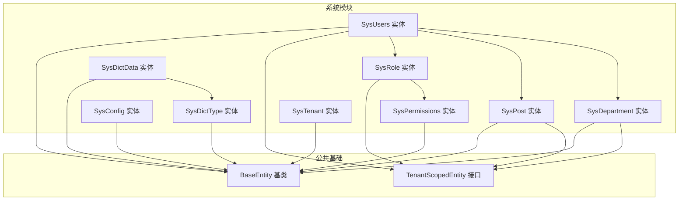
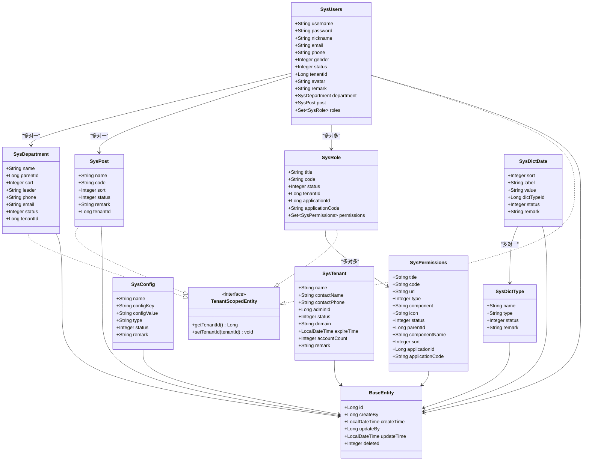
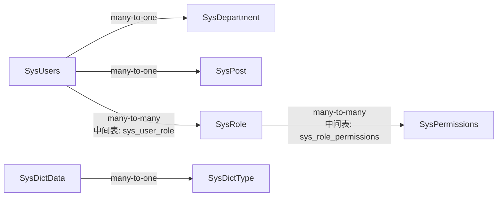

# 系统管理数据库表结构

<cite>
**本文档引用的文件**
- [SysUsers.java](file://system-module/src/main/java/com/fastproject/system/domain/SysUsers.java)
- [SysRole.java](file://system-module/src/main/java/com/fastproject/system/domain/SysRole.java)
- [SysDepartment.java](file://system-module/src/main/java/com/fastproject/system/domain/SysDepartment.java)
- [SysPost.java](file://system-module/src/main/java/com/fastproject/system/domain/SysPost.java)
- [SysConfig.java](file://system-module/src/main/java/com/fastproject/system/domain/SysConfig.java)
- [SysDictData.java](file://system-module/src/main/java/com/fastproject/system/domain/SysDictData.java)
- [SysPermissions.java](file://system-module/src/main/java/com/fastproject/system/domain/SysPermissions.java)
- [SysTenant.java](file://system-module/src/main/java/com/fastproject/system/domain/SysTenant.java)
- [SysDictType.java](file://system-module/src/main/java/com/fastproject/system/domain/SysDictType.java)
- [BaseEntity.java](file://common/src/main/java/com/fastproject/db/BaseEntity.java)
- [TenantScopedEntity.java](file://system-module/src/main/java/com/fastproject/system/tenant/TenantScopedEntity.java)
- [SysUsersMapper.java](file://system-module/src/main/java/com/fastproject/system/mapper/SysUsersMapper.java)
- [SysRoleMapper.java](file://system-module/src/main/java/com/fastproject/system/mapper/SysRoleMapper.java)
- [SysDepartmentMapper.java](file://system-module/src/main/java/com/fastproject/system/mapper/SysDepartmentMapper.java)
- [SysPostMapper.java](file://system-module/src/main/java/com/fastproject/system/mapper/SysPostMapper.java)
</cite>

## 目录
1. [简介](#简介)
2. [项目结构](#项目结构)
3. [核心组件](#核心组件)
4. [架构总览](#架构总览)
5. [详细组件分析](#详细组件分析)
6. [依赖关系分析](#依赖关系分析)
7. [性能考虑](#性能考虑)
8. [故障排查指南](#故障排查指南)
9. [结论](#结论)
10. [附录](#附录)

## 简介
本文件面向数据库设计者与开发人员，系统性梳理系统管理模块的数据库表结构，覆盖用户、角色、部门、岗位、配置、字典、权限、租户等核心表。内容包括字段定义、数据类型、约束与索引设计建议、表间外键关系与关联查询模式、数据完整性约束、默认值与业务规则，并提供规范化与反规范化优化建议。

## 项目结构
系统管理模块采用分层与领域驱动设计：
- 领域模型位于 system-module 的 domain 包中，使用 JPA 注解映射到数据库表
- 公共基类 BaseEntity 提供统一的主键、审计字段与软删除能力
- 租户隔离通过 TenantScopedEntity 接口与 SQL 删除/限制策略实现
- Mapper 接口负责 DTO 与实体间的转换

图表来源
- [SysUsers.java](file://system-module/src/main/java/com/fastproject/system/domain/SysUsers.java#L15-L94)
- [SysRole.java](file://system-module/src/main/java/com/fastproject/system/domain/SysRole.java#L14-L58)
- [SysDepartment.java](file://system-module/src/main/java/com/fastproject/system/domain/SysDepartment.java#L12-L59)
- [SysPost.java](file://system-module/src/main/java/com/fastproject/system/domain/SysPost.java#L12-L49)
- [SysConfig.java](file://system-module/src/main/java/com/fastproject/system/domain/SysConfig.java#L14-L51)
- [SysDictData.java](file://system-module/src/main/java/com/fastproject/system/domain/SysDictData.java#L14-L51)
- [SysPermissions.java](file://system-module/src/main/java/com/fastproject/system/domain/SysPermissions.java#L11-L77)
- [SysTenant.java](file://system-module/src/main/java/com/fastproject/system/domain/SysTenant.java#L16-L68)
- [BaseEntity.java](file://common/src/main/java/com/fastproject/db/BaseEntity.java#L14-L47)
- [TenantScopedEntity.java](file://system-module/src/main/java/com/fastproject/system/tenant/TenantScopedEntity.java#L6-L11)

章节来源
- [SysUsers.java](file://system-module/src/main/java/com/fastproject/system/domain/SysUsers.java#L1-L95)
- [SysRole.java](file://system-module/src/main/java/com/fastproject/system/domain/SysRole.java#L1-L59)
- [SysDepartment.java](file://system-module/src/main/java/com/fastproject/system/domain/SysDepartment.java#L1-L60)
- [SysPost.java](file://system-module/src/main/java/com/fastproject/system/domain/SysPost.java#L1-L50)
- [SysConfig.java](file://system-module/src/main/java/com/fastproject/system/domain/SysConfig.java#L1-L52)
- [SysDictData.java](file://system-module/src/main/java/com/fastproject/system/domain/SysDictData.java#L1-L52)
- [SysPermissions.java](file://system-module/src/main/java/com/fastproject/system/domain/SysPermissions.java#L1-L78)
- [SysTenant.java](file://system-module/src/main/java/com/fastproject/system/domain/SysTenant.java#L1-L69)
- [BaseEntity.java](file://common/src/main/java/com/fastproject/db/BaseEntity.java#L1-L48)
- [TenantScopedEntity.java](file://system-module/src/main/java/com/fastproject/system/tenant/TenantScopedEntity.java#L1-L12)

## 核心组件
本节对各核心表进行字段定义、数据类型、约束与索引设计建议的系统化说明，并给出业务规则与默认值建议。

- 用户表（sys_users）
  - 关键字段：用户名、密码、昵称、邮箱、电话、性别、状态、头像、个人简介、租户ID、部门ID、岗位ID
  - 外键关系：department_id → sys_department(id)，post_id → sys_post(id)，roles 多对多通过中间表 sys_user_role
  - 约束与索引：建议在 username、email 建唯一索引；在 tenantId、department_id、post_id 建普通索引；软删除 deleted=0
  - 默认值与业务规则：状态默认启用；软删除策略通过 SQL 删除与限制策略实现

- 角色表（sys_role）
  - 关键字段：标题、角色代码、状态、租户ID、应用ID、应用代理
  - 外键关系：permissions 多对多通过中间表 sys_role_permissions
  - 约束与索引：建议在 code 建唯一索引；在 tenantId、applicationId 建索引；软删除 deleted=0
  - 默认值与业务规则：状态默认启用；软删除策略同上

- 部门表（sys_department）
  - 关键字段：部门名称、父级部门ID、排序、负责人、联系电话、邮箱、状态、租户ID
  - 约束与索引：建议在 name 建唯一索引；在 parentId、tenantId 建索引；软删除 deleted=0
  - 默认值与业务规则：状态默认启用；树形结构通过 parentId 维护层级

- 岗位表（sys_post）
  - 关键字段：岗位名称、岗位编码、排序、状态、备注、租户ID
  - 约束与索引：建议在 code 建唯一索引；在 tenantId 建索引；软删除 deleted=0
  - 默认值与业务规则：状态默认启用

- 配置表（sys_config）
  - 关键字段：配置名称、配置键、配置值、配置类型、状态、备注
  - 约束与索引：建议在 configKey 建唯一索引；在 status 建索引
  - 默认值与业务规则：状态默认启用；用于系统运行时配置读取

- 字典类型表（sys_dict_type）
  - 关键字段：字典名称、字典类型、状态、备注
  - 约束与索引：建议在 type 建唯一索引；在 status 建索引
  - 默认值与业务规则：状态默认启用

- 字典数据表（sys_dict_data）
  - 关键字段：字典排序、字典标签、字典值、字典类型ID、状态、备注
  - 外键关系：dictTypeId → sys_dict_type(id)
  - 约束与索引：建议在 dictTypeId、value 建索引；在 status 建索引
  - 默认值与业务规则：状态默认启用

- 权限表（sys_permissions）
  - 关键字段：标题、权限代码、地址、类型、组件、图标、状态、父级ID、组件名、排序、应用ID、应用代理
  - 约束与索引：建议在 code 建唯一索引；在 parentId、applicationId 建索引；在 status 建索引
  - 默认值与业务规则：状态默认启用；树形结构通过 parentId 维护层级

- 租户表（sys_tenant）
  - 关键字段：租户名称、联系人、联系电话、租户管理员ID、租户状态、租户域名、过期时间、账号额度、备注
  - 约束与索引：建议在 domain 建唯一索引；在 status 建索引
  - 默认值与业务规则：状态默认正常；过期时间用于租户生命周期管理

章节来源
- [SysUsers.java](file://system-module/src/main/java/com/fastproject/system/domain/SysUsers.java#L15-L94)
- [SysRole.java](file://system-module/src/main/java/com/fastproject/system/domain/SysRole.java#L14-L58)
- [SysDepartment.java](file://system-module/src/main/java/com/fastproject/system/domain/SysDepartment.java#L12-L59)
- [SysPost.java](file://system-module/src/main/java/com/fastproject/system/domain/SysPost.java#L12-L49)
- [SysConfig.java](file://system-module/src/main/java/com/fastproject/system/domain/SysConfig.java#L14-L51)
- [SysDictType.java](file://system-module/src/main/java/com/fastproject/system/domain/SysDictType.java#L14-L41)
- [SysDictData.java](file://system-module/src/main/java/com/fastproject/system/domain/SysDictData.java#L14-L51)
- [SysPermissions.java](file://system-module/src/main/java/com/fastproject/system/domain/SysPermissions.java#L11-L77)
- [SysTenant.java](file://system-module/src/main/java/com/fastproject/system/domain/SysTenant.java#L16-L68)

## 架构总览
下图展示系统管理模块的实体关系与租户隔离机制：

图表来源
- [SysUsers.java](file://system-module/src/main/java/com/fastproject/system/domain/SysUsers.java#L15-L94)
- [SysRole.java](file://system-module/src/main/java/com/fastproject/system/domain/SysRole.java#L14-L58)
- [SysDepartment.java](file://system-module/src/main/java/com/fastproject/system/domain/SysDepartment.java#L12-L59)
- [SysPost.java](file://system-module/src/main/java/com/fastproject/system/domain/SysPost.java#L12-L49)
- [SysConfig.java](file://system-module/src/main/java/com/fastproject/system/domain/SysConfig.java#L14-L51)
- [SysDictData.java](file://system-module/src/main/java/com/fastproject/system/domain/SysDictData.java#L14-L51)
- [SysPermissions.java](file://system-module/src/main/java/com/fastproject/system/domain/SysPermissions.java#L11-L77)
- [SysTenant.java](file://system-module/src/main/java/com/fastproject/system/domain/SysTenant.java#L16-L68)
- [BaseEntity.java](file://common/src/main/java/com/fastproject/db/BaseEntity.java#L14-L47)
- [TenantScopedEntity.java](file://system-module/src/main/java/com/fastproject/system/tenant/TenantScopedEntity.java#L6-L11)

## 详细组件分析

### 用户表（sys_users）详细字段与约束
- 字段定义与类型
  - id: 主键（Long）
  - username: 用户名（String），建议唯一索引
  - password: 密码（String）
  - nickname: 昵称（String）
  - email: 邮箱（String），建议唯一索引
  - phone: 电话（String）
  - gender: 性别（Integer）
  - status: 状态（Integer），默认启用
  - tenantId: 租户ID（Long），建议索引
  - avatar: 头像（String）
  - remark: 个人简介（String）
  - department_id: 部门外键（Long），建议索引
  - post_id: 岗位外键（Long），建议索引
  - deleted: 软删除标志（Integer），默认0
  - 审计字段：createBy、createTime、updateBy、updateTime（来自 BaseEntity）

- 约束与索引设计建议
  - 唯一索引：username、email
  - 普通索引：tenantId、department_id、post_id
  - 软删除：deleted=0 查询限制

- 关联查询模式
  - 单表查询：按 tenantId、status、username 等过滤
  - 关联查询：LEFT JOIN sys_department、sys_post 获取部门/岗位名称
  - 多对多：通过 sys_user_role 中间表关联角色集合

- 业务规则
  - 默认状态启用；软删除不物理删除
  - 租户隔离：实现 TenantScopedEntity 接口并绑定当前租户

章节来源
- [SysUsers.java](file://system-module/src/main/java/com/fastproject/system/domain/SysUsers.java#L15-L94)
- [BaseEntity.java](file://common/src/main/java/com/fastproject/db/BaseEntity.java#L14-L47)
- [TenantScopedEntity.java](file://system-module/src/main/java/com/fastproject/system/tenant/TenantScopedEntity.java#L6-L11)

### 角色表（sys_role）详细字段与约束
- 字段定义与类型
  - id: 主键（Long）
  - title: 标题（String）
  - code: 角色代码（String），建议唯一索引
  - status: 状态（Integer），默认启用
  - tenantId: 租户ID（Long），建议索引
  - applicationId: 应用ID（Long）
  - applicationCode: 应用代理（String）
  - deleted: 软删除标志（Integer），默认0
  - 审计字段：createBy、createTime、updateBy、updateTime（来自 BaseEntity）

- 约束与索引设计建议
  - 唯一索引：code
  - 普通索引：tenantId、applicationId
  - 软删除：deleted=0 查询限制

- 关联查询模式
  - 单表查询：按 tenantId、status、code 过滤
  - 多对多：通过 sys_role_permissions 中间表关联权限集合

- 业务规则
  - 默认状态启用；软删除不物理删除
  - 租户隔离：实现 TenantScopedEntity 接口

章节来源
- [SysRole.java](file://system-module/src/main/java/com/fastproject/system/domain/SysRole.java#L14-L58)
- [BaseEntity.java](file://common/src/main/java/com/fastproject/db/BaseEntity.java#L14-L47)
- [TenantScopedEntity.java](file://system-module/src/main/java/com/fastproject/system/tenant/TenantScopedEntity.java#L6-L11)

### 部门表（sys_department）详细字段与约束
- 字段定义与类型
  - id: 主键（Long）
  - name: 部门名称（String），建议唯一索引
  - parentId: 父级部门ID（Long）
  - sort: 排序（Integer）
  - leader: 负责人（String）
  - phone: 联系电话（String）
  - email: 邮箱（String）
  - status: 状态（Integer），默认启用
  - tenantId: 租户ID（Long），建议索引
  - deleted: 软删除标志（Integer），默认0
  - 审计字段：createBy、createTime、updateBy、updateTime（来自 BaseEntity）

- 约束与索引设计建议
  - 唯一索引：name
  - 普通索引：parentId、tenantId
  - 软删除：deleted=0 查询限制

- 关联查询模式
  - 树形查询：通过 parentId 自连接获取组织架构
  - 单表查询：按 tenantId、status 过滤

- 业务规则
  - 默认状态启用；软删除不物理删除
  - 租户隔离：实现 TenantScopedEntity 接口

章节来源
- [SysDepartment.java](file://system-module/src/main/java/com/fastproject/system/domain/SysDepartment.java#L12-L59)
- [BaseEntity.java](file://common/src/main/java/com/fastproject/db/BaseEntity.java#L14-L47)
- [TenantScopedEntity.java](file://system-module/src/main/java/com/fastproject/system/tenant/TenantScopedEntity.java#L6-L11)

### 岗位表（sys_post）详细字段与约束
- 字段定义与类型
  - id: 主键（Long）
  - name: 岗位名称（String）
  - code: 岗位编码（String），建议唯一索引
  - sort: 排序（Integer）
  - status: 状态（Integer），默认启用
  - remark: 备注（String）
  - tenantId: 租户ID（Long），建议索引
  - deleted: 软删除标志（Integer），默认0
  - 审计字段：createBy、createTime、updateBy、updateTime（来自 BaseEntity）

- 约束与索引设计建议
  - 唯一索引：code
  - 普通索引：tenantId
  - 软删除：deleted=0 查询限制

- 关联查询模式
  - 单表查询：按 tenantId、status、code 过滤

- 业务规则
  - 默认状态启用；软删除不物理删除
  - 租户隔离：实现 TenantScopedEntity 接口

章节来源
- [SysPost.java](file://system-module/src/main/java/com/fastproject/system/domain/SysPost.java#L12-L49)
- [BaseEntity.java](file://common/src/main/java/com/fastproject/db/BaseEntity.java#L14-L47)
- [TenantScopedEntity.java](file://system-module/src/main/java/com/fastproject/system/tenant/TenantScopedEntity.java#L6-L11)

### 配置表（sys_config）详细字段与约束
- 字段定义与类型
  - id: 主键（Long）
  - name: 配置名称（String）
  - configKey: 配置键（String），建议唯一索引
  - configValue: 配置值（String）
  - type: 配置类型（String）
  - status: 状态（Integer），默认启用
  - remark: 备注（String）
  - deleted: 软删除标志（Integer），默认0
  - 审计字段：createBy、createTime、updateBy、updateTime（来自 BaseEntity）

- 约束与索引设计建议
  - 唯一索引：configKey
  - 普通索引：status
  - 软删除：deleted=0 查询限制

- 关联查询模式
  - 单表查询：按 configKey、status 过滤

- 业务规则
  - 默认状态启用；软删除不物理删除

章节来源
- [SysConfig.java](file://system-module/src/main/java/com/fastproject/system/domain/SysConfig.java#L14-L51)
- [BaseEntity.java](file://common/src/main/java/com/fastproject/db/BaseEntity.java#L14-L47)

### 字典类型表（sys_dict_type）详细字段与约束
- 字段定义与类型
  - id: 主键（Long）
  - name: 字典名称（String）
  - type: 字典类型（String），建议唯一索引
  - status: 状态（Integer），默认启用
  - remark: 备注（String）
  - deleted: 软删除标志（Integer），默认0
  - 审计字段：createBy、createTime、updateBy、updateTime（来自 BaseEntity）

- 约束与索引设计建议
  - 唯一索引：type
  - 普通索引：status
  - 软删除：deleted=0 查询限制

- 关联查询模式
  - 单表查询：按 type、status 过滤

- 业务规则
  - 默认状态启用；软删除不物理删除

章节来源
- [SysDictType.java](file://system-module/src/main/java/com/fastproject/system/domain/SysDictType.java#L14-L41)
- [BaseEntity.java](file://common/src/main/java/com/fastproject/db/BaseEntity.java#L14-L47)

### 字典数据表（sys_dict_data）详细字段与约束
- 字段定义与类型
  - id: 主键（Long）
  - sort: 字典排序（Integer）
  - label: 字典标签（String）
  - value: 字典值（String）
  - dictTypeId: 字典类型ID（Long），建议索引
  - status: 状态（Integer），默认启用
  - remark: 备注（String）
  - deleted: 软删除标志（Integer），默认0
  - 审计字段：createBy、createTime、updateBy、updateTime（来自 BaseEntity）

- 约束与索引设计建议
  - 普通索引：dictTypeId、value
  - 普通索引：status
  - 软删除：deleted=0 查询限制

- 关联查询模式
  - 单表查询：按 dictTypeId、status 过滤
  - 关联查询：LEFT JOIN sys_dict_type 获取类型名称

- 业务规则
  - 默认状态启用；软删除不物理删除

章节来源
- [SysDictData.java](file://system-module/src/main/java/com/fastproject/system/domain/SysDictData.java#L14-L51)
- [BaseEntity.java](file://common/src/main/java/com/fastproject/db/BaseEntity.java#L14-L47)

### 权限表（sys_permissions）详细字段与约束
- 字段定义与类型
  - id: 主键（Long）
  - title: 标题（String）
  - code: 权限代码（String），建议唯一索引
  - url: 地址（String）
  - type: 类型（Integer）
  - component: 组件（String）
  - icon: 图标（String）
  - status: 状态（Integer），默认启用
  - parentId: 父级ID（Long）
  - componentName: 组件名（String）
  - sort: 排序（Integer）
  - applicationId: 应用ID（Long）
  - applicationCode: 应用代理（String）
  - deleted: 软删除标志（Integer），默认0
  - 审计字段：createBy、createTime、updateBy、updateTime（来自 BaseEntity）

- 约束与索引设计建议
  - 唯一索引：code
  - 普通索引：parentId、applicationId
  - 普通索引：status
  - 软删除：deleted=0 查询限制

- 关联查询模式
  - 树形查询：通过 parentId 自连接获取权限树
  - 单表查询：按 code、status 过滤

- 业务规则
  - 默认状态启用；软删除不物理删除

章节来源
- [SysPermissions.java](file://system-module/src/main/java/com/fastproject/system/domain/SysPermissions.java#L11-L77)
- [BaseEntity.java](file://common/src/main/java/com/fastproject/db/BaseEntity.java#L14-L47)

### 租户表（sys_tenant）详细字段与约束
- 字段定义与类型
  - id: 主键（Long）
  - name: 租户名称（String）
  - contactName: 联系人（String）
  - contactPhone: 联系电话（String）
  - adminId: 租户管理员ID（Long）
  - status: 租户状态（Integer），默认正常
  - domain: 租户域名（String），建议唯一索引
  - expireTime: 过期时间（LocalDateTime）
  - accountCount: 账号额度（Integer）
  - remark: 备注（String）
  - deleted: 软删除标志（Integer），默认0
  - 审计字段：createBy、createTime、updateBy、updateTime（来自 BaseEntity）

- 约束与索引设计建议
  - 唯一索引：domain
  - 普通索引：status
  - 软删除：deleted=0 查询限制

- 关联查询模式
  - 单表查询：按 domain、status 过滤

- 业务规则
  - 默认状态正常；软删除不物理删除

章节来源
- [SysTenant.java](file://system-module/src/main/java/com/fastproject/system/domain/SysTenant.java#L16-L68)
- [BaseEntity.java](file://common/src/main/java/com/fastproject/db/BaseEntity.java#L14-L47)

## 依赖关系分析
- 实体继承与租户隔离
  - 所有系统管理实体继承 BaseEntity，统一具备主键、审计字段与软删除能力
  - 支持租户隔离的实体实现 TenantScopedEntity 接口，并通过 SQL 删除与限制策略实现软删除与查询过滤

- 多对多关系
  - 用户与角色：通过 sys_user_role 中间表维护
  - 角色与权限：通过 sys_role_permissions 中间表维护

- 关联查询模式
  - 用户查询：可关联部门、岗位、角色集合
  - 权限查询：支持树形结构自连接查询
  - 字典查询：可关联字典类型获取类型名称

图表来源
- [SysUsers.java](file://system-module/src/main/java/com/fastproject/system/domain/SysUsers.java#L71-L93)
- [SysRole.java](file://system-module/src/main/java/com/fastproject/system/domain/SysRole.java#L51-L57)
- [SysDictData.java](file://system-module/src/main/java/com/fastproject/system/domain/SysDictData.java#L40-L40)
- [SysDictType.java](file://system-module/src/main/java/com/fastproject/system/domain/SysDictType.java#L20-L20)

章节来源
- [SysUsers.java](file://system-module/src/main/java/com/fastproject/system/domain/SysUsers.java#L71-L93)
- [SysRole.java](file://system-module/src/main/java/com/fastproject/system/domain/SysRole.java#L51-L57)
- [SysDictData.java](file://system-module/src/main/java/com/fastproject/system/domain/SysDictData.java#L40-L40)
- [SysDictType.java](file://system-module/src/main/java/com/fastproject/system/domain/SysDictType.java#L20-L20)

## 性能考虑
- 索引设计
  - 唯一索引：在具有唯一约束的字段（如 username、email、configKey、type、code、domain）上建立唯一索引，确保查询与去重效率
  - 普通索引：在常用过滤字段（tenantId、parentId、applicationId、status、department_id、post_id、dictTypeId）上建立索引，提升查询性能
  - 复合索引：根据实际查询模式考虑复合索引（如 tenantId+status、parentId+status）

- 软删除与查询
  - 使用 SQL 删除与限制策略实现软删除，避免物理删除带来的维护成本
  - 在查询时默认应用 deleted=0 的限制，减少不必要的数据扫描

- 反规范化建议
  - 对于高频读取但写入较少的数据（如配置项、字典项），可在业务层引入缓存或物化视图，降低数据库压力
  - 对于树形结构（部门、权限），可考虑在应用层维护层级缓存，减少自连接查询次数

- 分页与排序
  - 分页查询优先基于索引列排序（如 id、createTime、sort），避免全表排序
  - 对于复杂关联查询，建议先过滤再关联，减少中间结果集大小

## 故障排查指南
- 常见问题与定位
  - 数据看不到：检查 deleted 字段是否为 0，确认 SQL 删除与限制策略是否生效
  - 查询慢：检查是否缺少必要索引，特别是 tenantId、status、code、parentId 等字段
  - 多对多关系异常：检查中间表（sys_user_role、sys_role_permissions）是否存在脏数据或重复记录

- 排查步骤
  - 确认实体是否实现 TenantScopedEntity 并正确绑定租户
  - 检查软删除策略是否在查询中生效
  - 使用 EXPLAIN 分析慢查询，确认索引使用情况
  - 核对中间表数据一致性，清理无效或重复记录

章节来源
- [BaseEntity.java](file://common/src/main/java/com/fastproject/db/BaseEntity.java#L44-L45)
- [SysUsers.java](file://system-module/src/main/java/com/fastproject/system/domain/SysUsers.java#L19-L20)
- [SysRole.java](file://system-module/src/main/java/com/fastproject/system/domain/SysRole.java#L18-L19)

## 结论
本设计以 BaseEntity 为基础，统一了主键、审计与软删除能力；通过 TenantScopedEntity 实现租户隔离；利用 JPA 多对多中间表清晰表达用户-角色、角色-权限的关系；配合合理的索引与查询策略，兼顾了规范化与性能需求。建议在生产环境中结合业务场景持续优化索引与缓存策略，确保高并发下的稳定性与可扩展性。

## 附录
- 表结构示例（字段与类型示意）
  - sys_users：id、username、password、nickname、email、phone、gender、status、tenantId、avatar、remark、department_id、post_id、deleted、createBy、createTime、updateBy、updateTime
  - sys_role：id、title、code、status、tenantId、applicationId、applicationCode、deleted、createBy、createTime、updateBy、updateTime
  - sys_department：id、name、parentId、sort、leader、phone、email、status、tenantId、deleted、createBy、createTime、updateBy、updateTime
  - sys_post：id、name、code、sort、status、remark、tenantId、deleted、createBy、createTime、updateBy、updateTime
  - sys_config：id、name、configKey、configValue、type、status、remark、deleted、createBy、createTime、updateBy、updateTime
  - sys_dict_type：id、name、type、status、remark、deleted、createBy、createTime、updateBy、updateTime
  - sys_dict_data：id、sort、label、value、dictTypeId、status、remark、deleted、createBy、createTime、updateBy、updateTime
  - sys_permissions：id、title、code、url、type、component、icon、status、parentId、componentName、sort、applicationId、applicationCode、deleted、createBy、createTime、updateBy、updateTime
  - sys_tenant：id、name、contactName、contactPhone、adminId、status、domain、expireTime、accountCount、remark、deleted、createBy、createTime、updateBy、updateTime

- 数据字典说明
  - 状态字段（status）：0 正常/启用，1 停用/禁用
  - 性别字段（gender）：0 男，1 女，2 未知
  - 类型字段（type）：权限类型、字典类型等枚举值
  - 租户状态（tenant status）：0 正常，1 停用

- 业务规则清单
  - 默认状态启用；软删除不物理删除
  - 唯一约束字段需建立唯一索引
  - 租户隔离：所有相关实体均实现 TenantScopedEntity 接口
  - 多对多关系通过中间表维护，保证数据一致性