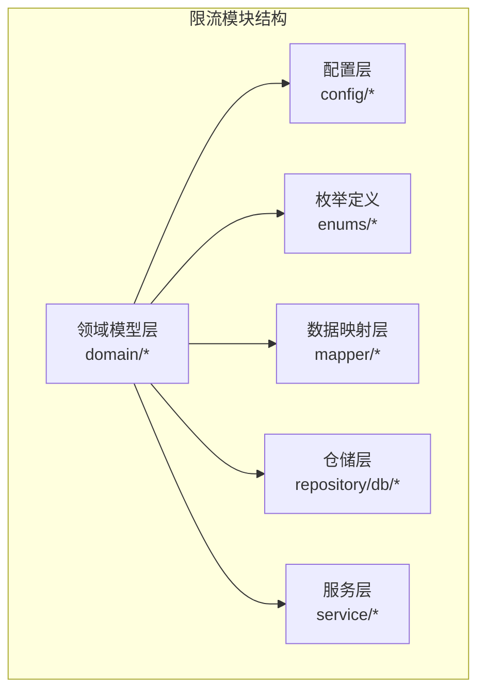
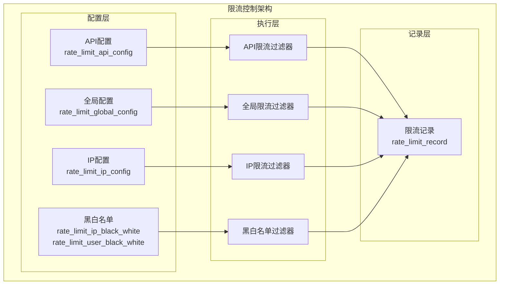
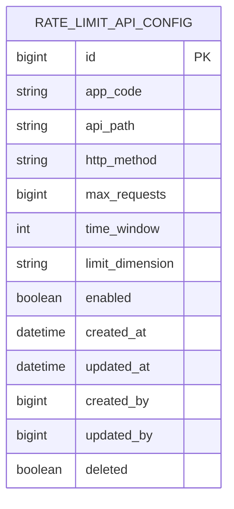
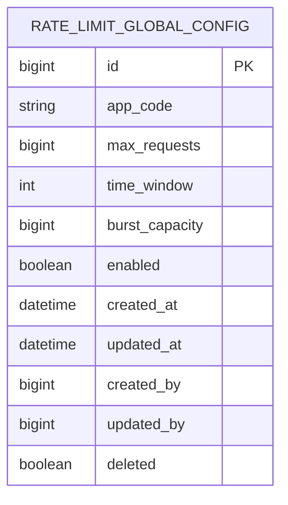
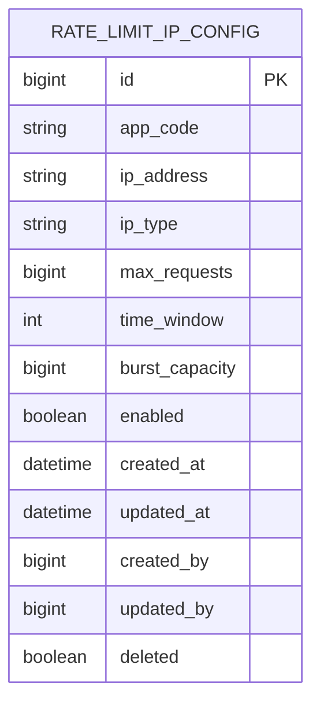
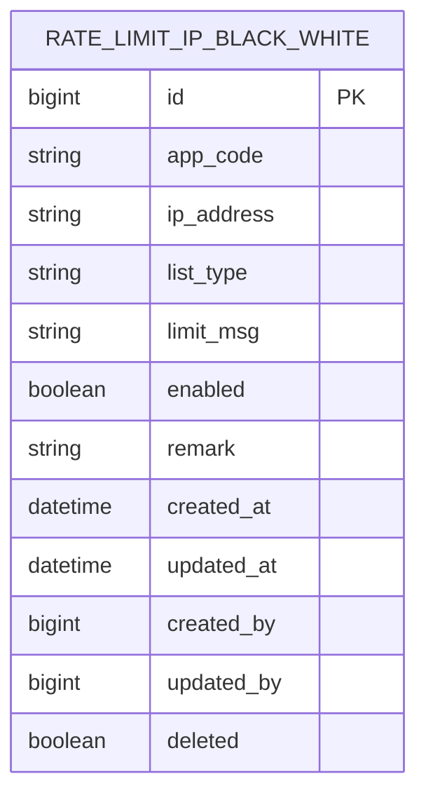
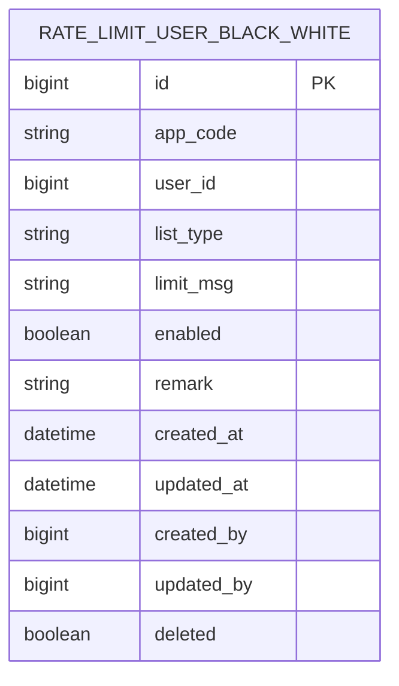
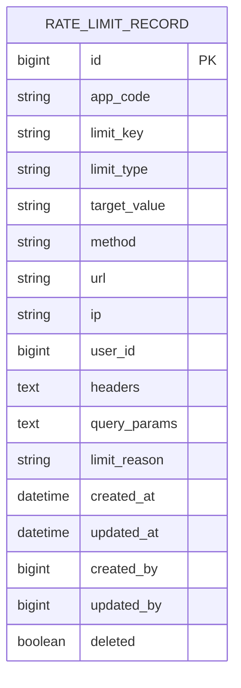
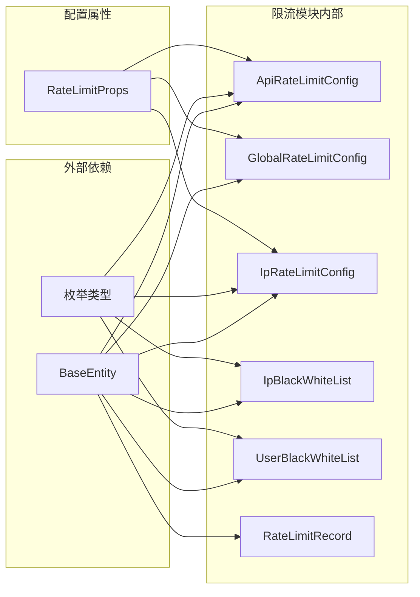

# 限流控制数据库表结构

<cite>
**本文档引用的文件**
- [ApiRateLimitConfig.java](file://ratelimit-module/src/main/java/com/fastproject/ratelimit/domain/ApiRateLimitConfig.java)
- [GlobalRateLimitConfig.java](file://ratelimit-module/src/main/java/com/fastproject/ratelimit/domain/GlobalRateLimitConfig.java)
- [IpRateLimitConfig.java](file://ratelimit-module/src/main/java/com/fastproject/ratelimit/domain/IpRateLimitConfig.java)
- [IpBlackWhiteList.java](file://ratelimit-module/src/main/java/com/fastproject/ratelimit/domain/IpBlackWhiteList.java)
- [UserBlackWhiteList.java](file://ratelimit-module/src/main/java/com/fastproject/ratelimit/domain/UserBlackWhiteList.java)
- [RateLimitRecord.java](file://ratelimit-module/src/main/java/com/fastproject/ratelimit/domain/RateLimitRecord.java)
- [RateLimitProps.java](file://ratelimit-module/src/main/java/com/fastproject/ratelimit/config/RateLimitProps.java)
- [LimitDimension.java](file://ratelimit-api/src/main/java/com/fastproject/ratelimit/enums/LimitDimension.java)
- [IpType.java](file://ratelimit-api/src/main/java/com/fastproject/ratelimit/enums/IpType.java)
- [BlackWhiteListType.java](file://ratelimit-api/src/main/java/com/fastproject/ratelimit/enums/BlackWhiteListType.java)
- [RateLimitType.java](file://ratelimit-api/src/main/java/com/fastproject/ratelimit/enums/RateLimitType.java)
</cite>

## 目录
1. [引言](#引言)
2. [项目结构](#项目结构)
3. [核心组件](#核心组件)
4. [架构概览](#架构概览)
5. [详细组件分析](#详细组件分析)
6. [依赖关系分析](#依赖关系分析)
7. [性能考虑](#性能考虑)
8. [故障排除指南](#故障排除指南)
9. [结论](#结论)

## 引言

本文件详细描述了限流控制模块的数据库表结构设计，涵盖API限流配置表(ApiRateLimitConfig)、全局限流配置表(GlobalRateLimitConfig)、IP限流配置表(IpRateLimitConfig)、IP黑白名单表(IpBlackWhiteList)、用户黑白名单表(UserBlackWhiteList)、限流记录表(RateLimitRecord)等表的结构设计。文档不仅说明了各表的字段定义和约束，还深入解释了限流算法参数、配置策略、访问控制规则的数据库实现方式，并提供了限流状态持久化机制和实时更新策略，以及限流统计数据的存储和查询优化方案。

## 项目结构

限流控制模块位于`ratelimit-module`目录下，采用分层架构设计：

**图表来源**
- [ApiRateLimitConfig.java](file://ratelimit-module/src/main/java/com/fastproject/ratelimit/domain/ApiRateLimitConfig.java#L1-L64)
- [GlobalRateLimitConfig.java](file://ratelimit-module/src/main/java/com/fastproject/ratelimit/domain/GlobalRateLimitConfig.java#L1-L50)
- [IpRateLimitConfig.java](file://ratelimit-module/src/main/java/com/fastproject/ratelimit/domain/IpRateLimitConfig.java#L1-L65)

**章节来源**
- [ApiRateLimitConfig.java](file://ratelimit-module/src/main/java/com/fastproject/ratelimit/domain/ApiRateLimitConfig.java#L1-L64)
- [GlobalRateLimitConfig.java](file://ratelimit-module/src/main/java/com/fastproject/ratelimit/domain/GlobalRateLimitConfig.java#L1-L50)
- [IpRateLimitConfig.java](file://ratelimit-module/src/main/java/com/fastproject/ratelimit/domain/IpRateLimitConfig.java#L1-L65)

## 核心组件

限流控制模块包含以下核心数据模型：

### 基础实体类(BaseEntity)
所有限流相关实体类都继承自BaseEntity，提供统一的审计字段和软删除机制。

### 限流配置实体类
- **ApiRateLimitConfig**: API接口级限流配置
- **GlobalRateLimitConfig**: 全局限流配置
- **IpRateLimitConfig**: IP级限流配置

### 访问控制实体类
- **IpBlackWhiteList**: IP黑白名单配置
- **UserBlackWhiteList**: 用户黑白名单配置

### 统计记录实体类
- **RateLimitRecord**: 限流事件记录

**章节来源**
- [ApiRateLimitConfig.java](file://ratelimit-module/src/main/java/com/fastproject/ratelimit/domain/ApiRateLimitConfig.java#L20-L64)
- [GlobalRateLimitConfig.java](file://ratelimit-module/src/main/java/com/fastproject/ratelimit/domain/GlobalRateLimitConfig.java#L19-L50)
- [IpRateLimitConfig.java](file://ratelimit-module/src/main/java/com/fastproject/ratelimit/domain/IpRateLimitConfig.java#L20-L65)
- [IpBlackWhiteList.java](file://ratelimit-module/src/main/java/com/fastproject/ratelimit/domain/IpBlackWhiteList.java#L20-L60)
- [UserBlackWhiteList.java](file://ratelimit-module/src/main/java/com/fastproject/ratelimit/domain/UserBlackWhiteList.java#L20-L60)
- [RateLimitRecord.java](file://ratelimit-module/src/main/java/com/fastproject/ratelimit/domain/RateLimitRecord.java#L22-L84)

## 架构概览

限流系统采用多层架构设计，通过不同的限流维度实现精细化的流量控制：

**图表来源**
- [ApiRateLimitConfig.java](file://ratelimit-module/src/main/java/com/fastproject/ratelimit/domain/ApiRateLimitConfig.java#L14-L64)
- [GlobalRateLimitConfig.java](file://ratelimit-module/src/main/java/com/fastproject/ratelimit/domain/GlobalRateLimitConfig.java#L13-L50)
- [IpRateLimitConfig.java](file://ratelimit-module/src/main/java/com/fastproject/ratelimit/domain/IpRateLimitConfig.java#L14-L65)
- [IpBlackWhiteList.java](file://ratelimit-module/src/main/java/com/fastproject/ratelimit/domain/IpBlackWhiteList.java#L14-L60)
- [UserBlackWhiteList.java](file://ratelimit-module/src/main/java/com/fastproject/ratelimit/domain/UserBlackWhiteList.java#L14-L60)
- [RateLimitRecord.java](file://ratelimit-module/src/main/java/com/fastproject/ratelimit/domain/RateLimitRecord.java#L16-L84)

## 详细组件分析

### API限流配置表(ApiRateLimitConfig)

API限流配置表用于实现基于API接口的精细化限流控制：

**图表来源**
- [ApiRateLimitConfig.java](file://ratelimit-module/src/main/java/com/fastproject/ratelimit/domain/ApiRateLimitConfig.java#L14-L64)

**关键字段说明：**
- `app_code`: 应用代码，用于区分不同应用的API限流规则
- `api_path`: API路径，支持精确匹配和通配符模式
- `http_method`: HTTP方法限制，可指定特定HTTP方法的限流规则
- `max_requests`: 在时间窗口内的最大请求数
- `time_window`: 时间窗口大小（秒）
- `limit_dimension`: 限流维度（GLOBAL/IP/USER）
- `enabled`: 启用状态标志

**限流算法参数：**
- 支持滑动窗口计数算法
- 支持令牌桶算法
- 支持漏桶算法

**配置策略：**
- 支持全局维度、IP维度、用户维度的组合配置
- 支持不同API路径的差异化限流
- 支持HTTP方法级别的细粒度控制

**章节来源**
- [ApiRateLimitConfig.java](file://ratelimit-module/src/main/java/com/fastproject/ratelimit/domain/ApiRateLimitConfig.java#L22-L64)
- [LimitDimension.java](file://ratelimit-api/src/main/java/com/fastproject/ratelimit/enums/LimitDimension.java#L6-L20)

### 全局限流配置表(GlobalRateLimitConfig)

全局限流配置表提供系统级的流量控制能力：

**图表来源**
- [GlobalRateLimitConfig.java](file://ratelimit-module/src/main/java/com/fastproject/ratelimit/domain/GlobalRateLimitConfig.java#L13-L50)

**关键字段说明：**
- `app_code`: 应用标识，支持多应用隔离
- `max_requests`: 全局每秒最大请求数（QPS）
- `time_window`: 时间窗口配置
- `burst_capacity`: 突发容量，支持突发流量处理
- `enabled`: 全局开关控制

**限流算法实现：**
- 采用令牌桶算法实现平滑限流
- 支持突发流量的临时放行
- 实现精确的QPS控制

**章节来源**
- [GlobalRateLimitConfig.java](file://ratelimit-module/src/main/java/com/fastproject/ratelimit/domain/GlobalRateLimitConfig.java#L21-L50)

### IP限流配置表(IpRateLimitConfig)

IP限流配置表实现基于IP地址的流量控制：

**图表来源**
- [IpRateLimitConfig.java](file://ratelimit-module/src/main/java/com/fastproject/ratelimit/domain/IpRateLimitConfig.java#L14-L65)

**IP类型枚举：**
- `ALL`: 全部IP，对所有IP实施统一限流
- `SINGLE`: 单个IP，针对特定IP地址的精确限流
- `SEGMENT`: IP段，支持CIDR格式的网段限流

**限流策略：**
- 支持单IP精确限流
- 支持IP段批量限流
- 支持全局IP池的统一管理

**章节来源**
- [IpRateLimitConfig.java](file://ratelimit-module/src/main/java/com/fastproject/ratelimit/domain/IpRateLimitConfig.java#L28-L65)
- [IpType.java](file://ratelimit-api/src/main/java/com/fastproject/ratelimit/enums/IpType.java#L11-L30)

### IP黑白名单表(IpBlackWhiteList)

IP黑白名单表实现基于IP的访问控制：

**图表来源**
- [IpBlackWhiteList.java](file://ratelimit-module/src/main/java/com/fastproject/ratelimit/domain/IpBlackWhiteList.java#L14-L60)

**黑白名单类型：**
- `BLACK`: 黑名单，阻止访问
- `WHITE`: 白名单，允许优先访问

**访问控制规则：**
- 白名单优先于黑名单
- 支持精确IP和IP段匹配
- 支持动态更新和实时生效

**章节来源**
- [IpBlackWhiteList.java](file://ratelimit-module/src/main/java/com/fastproject/ratelimit/domain/IpBlackWhiteList.java#L28-L60)
- [BlackWhiteListType.java](file://ratelimit-api/src/main/java/com/fastproject/ratelimit/enums/BlackWhiteListType.java#L11-L25)

### 用户黑白名单表(UserBlackWhiteList)

用户黑白名单表实现基于用户的访问控制：

**图表来源**
- [UserBlackWhiteList.java](file://ratelimit-module/src/main/java/com/fastproject/ratelimit/domain/UserBlackWhiteList.java#L14-L60)

**用户访问控制：**
- 基于用户ID的精确控制
- 支持用户角色和权限的组合判断
- 支持用户状态的动态监控

**章节来源**
- [UserBlackWhiteList.java](file://ratelimit-module/src/main/java/com/fastproject/ratelimit/domain/UserBlackWhiteList.java#L28-L60)

### 限流记录表(RateLimitRecord)

限流记录表用于统计和追踪限流事件：

**图表来源**
- [RateLimitRecord.java](file://ratelimit-module/src/main/java/com/fastproject/ratelimit/domain/RateLimitRecord.java#L16-L84)

**记录内容：**
- 限流触发的完整上下文信息
- 请求的详细元数据
- 限流原因和处理结果
- 时间戳和审计信息

**统计分析：**
- 支持按时间维度的流量统计
- 支持按API维度的性能分析
- 支持异常流量的预警机制

**章节来源**
- [RateLimitRecord.java](file://ratelimit-module/src/main/java/com/fastproject/ratelimit/domain/RateLimitRecord.java#L24-L84)
- [RateLimitType.java](file://ratelimit-api/src/main/java/com/fastproject/ratelimit/enums/RateLimitType.java#L6-L24)

## 依赖关系分析

限流模块的依赖关系体现了清晰的分层架构：

**图表来源**
- [ApiRateLimitConfig.java](file://ratelimit-module/src/main/java/com/fastproject/ratelimit/domain/ApiRateLimitConfig.java#L3-L19)
- [GlobalRateLimitConfig.java](file://ratelimit-module/src/main/java/com/fastproject/ratelimit/domain/GlobalRateLimitConfig.java#L3-L19)
- [IpRateLimitConfig.java](file://ratelimit-module/src/main/java/com/fastproject/ratelimit/domain/IpRateLimitConfig.java#L3-L19)
- [IpBlackWhiteList.java](file://ratelimit-module/src/main/java/com/fastproject/ratelimit/domain/IpBlackWhiteList.java#L3-L19)
- [UserBlackWhiteList.java](file://ratelimit-module/src/main/java/com/fastproject/ratelimit/domain/UserBlackWhiteList.java#L3-L19)
- [RateLimitRecord.java](file://ratelimit-module/src/main/java/com/fastproject/ratelimit/domain/RateLimitRecord.java#L3-L21)
- [RateLimitProps.java](file://ratelimit-module/src/main/java/com/fastproject/ratelimit/config/RateLimitProps.java#L1-L20)

**章节来源**
- [RateLimitProps.java](file://ratelimit-module/src/main/java/com/fastproject/ratelimit/config/RateLimitProps.java#L14-L19)

## 性能考虑

### 数据库优化策略

**索引设计建议：**
- API配置表：在(app_code, api_path, http_method)上建立复合索引
- IP配置表：在(ip_address, ip_type)上建立索引
- 限流记录表：在(created_at, limit_type)上建立索引
- 黑白名单表：在(user_id, list_type)上建立索引

**分区策略：**
- 按时间分区存储限流记录，支持历史数据归档
- 按应用代码分区管理配置数据
- 支持冷热数据分离

**缓存策略：**
- 配置数据缓存到Redis，支持热更新
- 限流状态缓存到本地内存，降低数据库压力
- 统计数据定期落库，保证数据一致性

### 并发控制机制

**乐观锁实现：**
- 使用版本号控制并发更新
- 支持配置的原子性更新
- 防止配置冲突和数据不一致

**分布式锁：**
- 关键操作使用Redis分布式锁
- 防止多个实例同时修改配置
- 支持自动过期和重试机制

## 故障排除指南

### 常见问题诊断

**配置不生效问题：**
1. 检查enabled字段是否为true
2. 验证app_code是否匹配当前应用
3. 确认限流维度设置是否正确

**限流误判问题：**
1. 检查IP匹配规则是否准确
2. 验证API路径匹配模式
3. 确认HTTP方法限制设置

**性能问题排查：**
1. 分析数据库慢查询日志
2. 检查索引使用情况
3. 监控缓存命中率

### 调试工具

**配置验证：**
- 提供配置测试接口
- 支持在线配置预览
- 实时配置生效验证

**监控指标：**
- QPS统计和趋势分析
- 错误率和响应时间监控
- 配置变更审计日志

**章节来源**
- [RateLimitProps.java](file://ratelimit-module/src/main/java/com/fastproject/ratelimit/config/RateLimitProps.java#L16-L18)

## 结论

限流控制模块通过精心设计的数据库表结构和完善的配置体系，为高并发系统提供了强大的流量控制能力。各表结构设计充分考虑了实际业务需求，支持多维度的限流策略和灵活的配置管理。通过合理的索引设计、缓存策略和并发控制机制，系统能够在保证性能的同时提供可靠的限流保障。

模块化的架构设计使得各个限流维度可以独立配置和管理，同时通过统一的记录机制实现了完整的审计和统计功能。这种设计既满足了当前业务需求，也为未来的功能扩展预留了充足的空间。