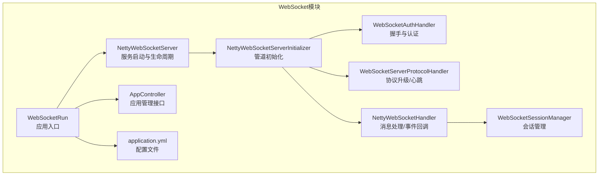
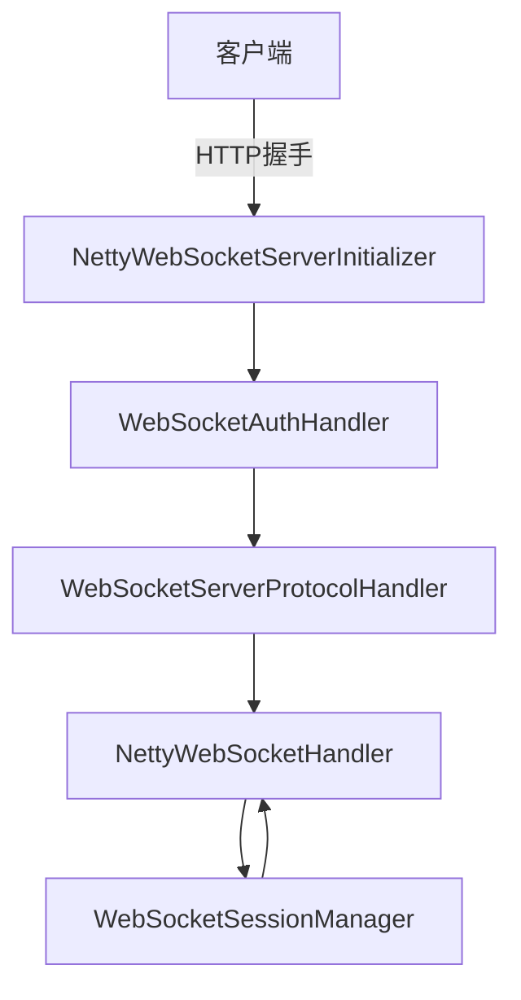
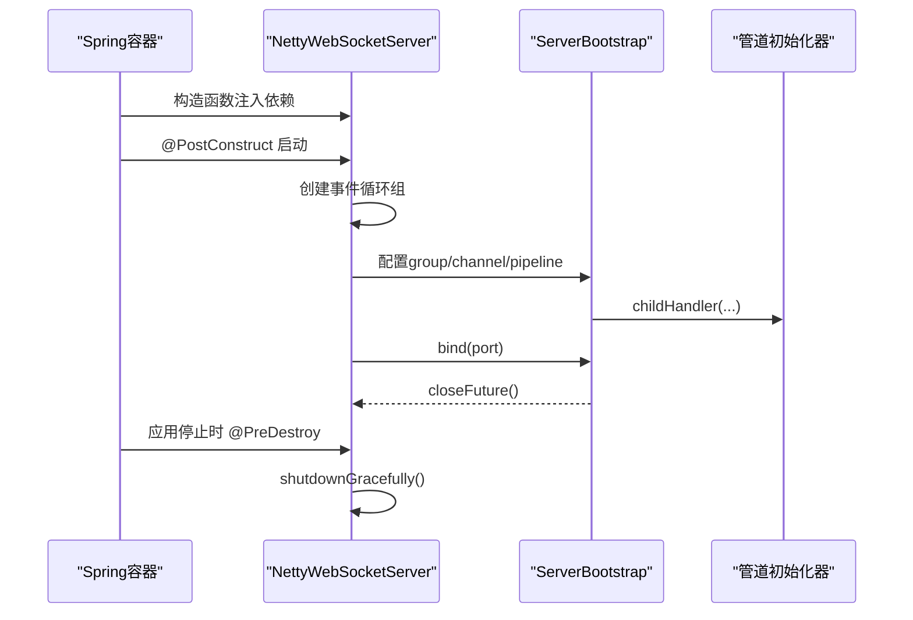
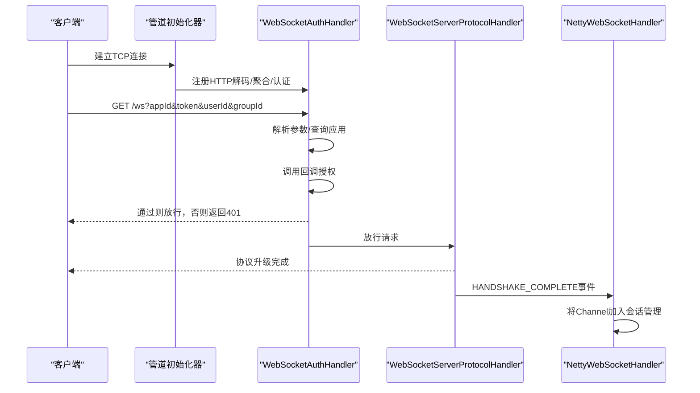
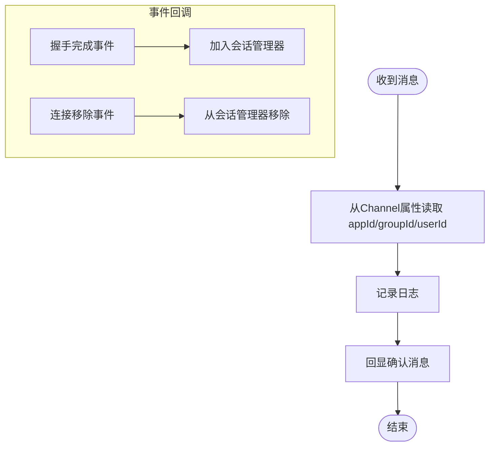
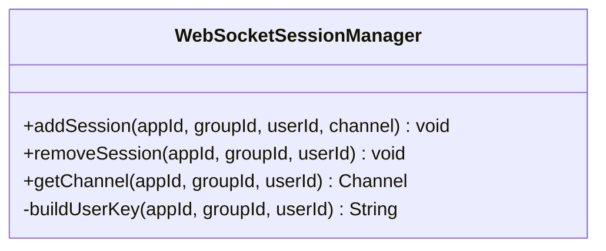
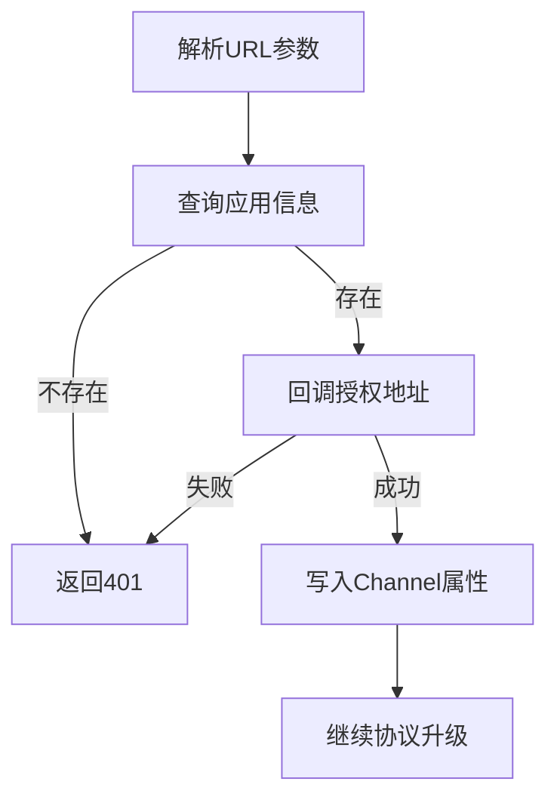
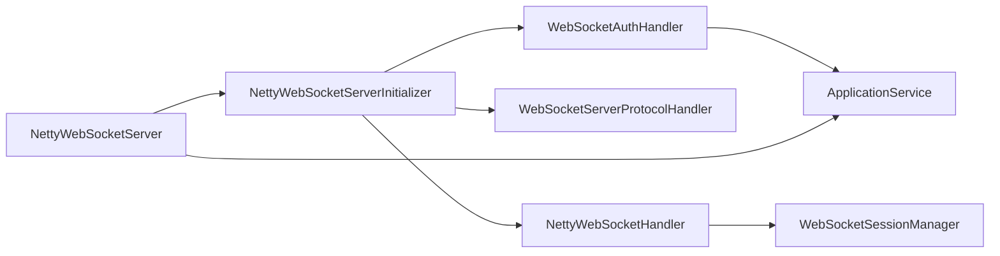

# WebSocket服务

<cite>
**本文引用的文件**
- [WebSocketRun.java](file://websocket/src/main/java/com/astproject/WebSocketRun.java)
- [NettyWebSocketServer.java](file://websocket/src/main/java/com/astproject/netty/NettyWebSocketServer.java)
- [NettyWebSocketServerInitializer.java](file://websocket/src/main/java/com/astproject/netty/NettyWebSocketServerInitializer.java)
- [WebSocketAuthHandler.java](file://websocket/src/main/java/com/astproject/netty/WebSocketAuthHandler.java)
- [NettyWebSocketHandler.java](file://websocket/src/main/java/com/astproject/netty/NettyWebSocketHandler.java)
- [WebSocketSessionManager.java](file://websocket/src/main/java/com/astproject/netty/WebSocketSessionManager.java)
- [AppController.java](file://websocket/src/main/java/com/astproject/controller/AppController.java)
- [application.yml](file://websocket/src/main/resources/application.yml)
- [build.gradle](file://websocket/build.gradle)
</cite>

## 目录
1. [简介](#简介)
2. [项目结构](#项目结构)
3. [核心组件](#核心组件)
4. [架构总览](#架构总览)
5. [组件详解](#组件详解)
6. [依赖关系分析](#依赖关系分析)
7. [性能与扩展性](#性能与扩展性)
8. [故障排查指南](#故障排查指南)
9. [结论](#结论)
10. [附录](#附录)

## 简介
本文件面向开发者，系统化梳理 WebSocket 服务的启动配置、Netty 实现架构、连接管理、消息处理器与会话管理器设计、实时通信协议与消息路由、用户认证机制，以及连接建立、心跳检测与断线重连策略。同时提供 WebSocket API 接口说明与客户端集成要点，帮助快速搭建高性能的实时通信系统。

## 项目结构
WebSocket 服务位于独立模块中，采用 Spring Boot + Netty 的组合：Spring Boot 负责应用启动与配置加载，Netty 负责高性能 WebSocket 服务端实现。核心代码集中在 netty 包内，控制器与数据模型位于 controller 与 domain 包中，配置文件位于 resources 下。

图表来源
- [WebSocketRun.java](file://websocket/src/main/java/com/astproject/WebSocketRun.java#L1-L12)
- [NettyWebSocketServer.java](file://websocket/src/main/java/com/astproject/netty/NettyWebSocketServer.java#L1-L103)
- [NettyWebSocketServerInitializer.java](file://websocket/src/main/java/com/astproject/netty/NettyWebSocketServerInitializer.java#L1-L55)
- [WebSocketAuthHandler.java](file://websocket/src/main/java/com/astproject/netty/WebSocketAuthHandler.java#L1-L105)
- [NettyWebSocketHandler.java](file://websocket/src/main/java/com/astproject/netty/NettyWebSocketHandler.java#L1-L82)
- [WebSocketSessionManager.java](file://websocket/src/main/java/com/astproject/netty/WebSocketSessionManager.java#L1-L63)
- [AppController.java](file://websocket/src/main/java/com/astproject/controller/AppController.java#L1-L70)
- [application.yml](file://websocket/src/main/resources/application.yml#L1-L28)

章节来源
- [WebSocketRun.java](file://websocket/src/main/java/com/astproject/WebSocketRun.java#L1-L12)
- [application.yml](file://websocket/src/main/resources/application.yml#L1-L28)

## 核心组件
- 启动入口：应用通过主类启动，交由 Spring Boot 容器管理。
- Netty 服务端：负责监听端口、初始化事件循环组、绑定端口并等待关闭。
- 管道初始化器：组装 HTTP 编解码器、聚合器、认证处理器、协议处理器与业务处理器。
- 认证处理器：解析握手参数，校验应用与用户身份，注入属性供后续使用。
- 协议处理器：完成 WebSocket 握手、心跳 Ping/Pong 与路径匹配。
- 业务处理器：处理文本帧、握手完成事件与连接移除事件，维护会话。
- 会话管理器：以 appId:groupId:userId 为键存储 Channel，支持添加、移除与查询。
- 控制器：提供应用管理的 Web 接口（非 WebSocket）。

章节来源
- [NettyWebSocketServer.java](file://websocket/src/main/java/com/astproject/netty/NettyWebSocketServer.java#L1-L103)
- [NettyWebSocketServerInitializer.java](file://websocket/src/main/java/com/astproject/netty/NettyWebSocketServerInitializer.java#L1-L55)
- [WebSocketAuthHandler.java](file://websocket/src/main/java/com/astproject/netty/WebSocketAuthHandler.java#L1-L105)
- [NettyWebSocketHandler.java](file://websocket/src/main/java/com/astproject/netty/NettyWebSocketHandler.java#L1-L82)
- [WebSocketSessionManager.java](file://websocket/src/main/java/com/astproject/netty/WebSocketSessionManager.java#L1-L63)
- [AppController.java](file://websocket/src/main/java/com/astproject/controller/AppController.java#L1-L70)

## 架构总览
WebSocket 服务采用“Spring Boot + Netty”的架构。Spring Boot 负责配置加载与生命周期管理，Netty 负责高性能网络 I/O 与协议处理。握手阶段由 HTTP 升级为 WebSocket，随后进入事件驱动的消息处理流程。

图表来源
- [NettyWebSocketServerInitializer.java](file://websocket/src/main/java/com/astproject/netty/NettyWebSocketServerInitializer.java#L29-L53)
- [WebSocketAuthHandler.java](file://websocket/src/main/java/com/astproject/netty/WebSocketAuthHandler.java#L31-L95)
- [NettyWebSocketHandler.java](file://websocket/src/main/java/com/astproject/netty/NettyWebSocketHandler.java#L21-L67)
- [WebSocketSessionManager.java](file://websocket/src/main/java/com/astproject/netty/WebSocketSessionManager.java#L30-L58)

## 组件详解

### 启动与配置
- 应用入口：主类负责启动 Spring Boot 应用。
- 服务端：在构造阶段注入应用服务；启动时在独立线程中初始化 NIO 事件循环组，绑定端口并等待关闭；销毁前优雅关闭资源。
- 配置项：监听端口与握手路径来自配置文件，便于环境差异化部署。

图表来源
- [NettyWebSocketServer.java](file://websocket/src/main/java/com/astproject/netty/NettyWebSocketServer.java#L54-L101)

章节来源
- [WebSocketRun.java](file://websocket/src/main/java/com/astproject/WebSocketRun.java#L1-L12)
- [NettyWebSocketServer.java](file://websocket/src/main/java/com/astproject/netty/NettyWebSocketServer.java#L24-L101)
- [application.yml](file://websocket/src/main/resources/application.yml#L2-L7)

### 连接建立与握手
- 握手路径：由配置决定，默认为 /ws。
- 认证参数：从握手 URL 查询参数解析 appId、token、userId、groupId。
- 应用校验：根据 appId 查询应用信息。
- 回调授权：向应用配置的回调地址发起 JSON 请求进行二次校验。
- 属性注入：通过 Channel 属性保存 appId、userId、groupId，供后续处理器使用。
- 协议升级：WebSocket 协议处理器完成握手与心跳处理。

图表来源
- [NettyWebSocketServerInitializer.java](file://websocket/src/main/java/com/astproject/netty/NettyWebSocketServerInitializer.java#L29-L53)
- [WebSocketAuthHandler.java](file://websocket/src/main/java/com/astproject/netty/WebSocketAuthHandler.java#L31-L95)
- [NettyWebSocketHandler.java](file://websocket/src/main/java/com/astproject/netty/NettyWebSocketHandler.java#L37-L51)

章节来源
- [NettyWebSocketServerInitializer.java](file://websocket/src/main/java/com/astproject/netty/NettyWebSocketServerInitializer.java#L19-L53)
- [WebSocketAuthHandler.java](file://websocket/src/main/java/com/astproject/netty/WebSocketAuthHandler.java#L20-L105)
- [NettyWebSocketHandler.java](file://websocket/src/main/java/com/astproject/netty/NettyWebSocketHandler.java#L13-L67)

### 消息处理与事件回调
- 文本帧处理：从 Channel 中获取 appId、groupId、userId，记录日志并向客户端回显确认消息。
- 握手完成事件：当协议处理器发出握手完成事件时，将 Channel 注册到会话管理器。
- 连接移除事件：当连接断开或异常时，从会话管理器移除对应 Channel。
- 异常处理：捕获异常后主动关闭 Channel，确保 handlerRemoved 触发清理。

图表来源
- [NettyWebSocketHandler.java](file://websocket/src/main/java/com/astproject/netty/NettyWebSocketHandler.java#L21-L80)
- [WebSocketSessionManager.java](file://websocket/src/main/java/com/astproject/netty/WebSocketSessionManager.java#L30-L50)

章节来源
- [NettyWebSocketHandler.java](file://websocket/src/main/java/com/astproject/netty/NettyWebSocketHandler.java#L13-L82)
- [WebSocketSessionManager.java](file://websocket/src/main/java/com/astproject/netty/WebSocketSessionManager.java#L13-L63)

### 会话管理器设计
- 键空间：使用 appId:groupId:userId 作为唯一键，保证多应用、多群组、多用户隔离。
- 并发安全：基于并发哈希表，支持高并发下的添加、删除与查询。
- 生命周期：随连接建立加入，随连接断开移除，避免内存泄漏。

图表来源
- [WebSocketSessionManager.java](file://websocket/src/main/java/com/astproject/netty/WebSocketSessionManager.java#L13-L63)

章节来源
- [WebSocketSessionManager.java](file://websocket/src/main/java/com/astproject/netty/WebSocketSessionManager.java#L13-L63)

### 用户认证机制
- 参数提取：从握手 URL 查询参数获取 appId、token、userId、groupId。
- 应用校验：通过应用服务查询应用是否存在。
- 回调授权：向应用配置的回调地址发送 JSON 数据进行二次校验，依据返回状态决定是否允许握手。
- 属性注入：将 appId、userId、groupId 写入 Channel 属性，供后续处理器使用。

图表来源
- [WebSocketAuthHandler.java](file://websocket/src/main/java/com/astproject/netty/WebSocketAuthHandler.java#L31-L95)

章节来源
- [WebSocketAuthHandler.java](file://websocket/src/main/java/com/astproject/netty/WebSocketAuthHandler.java#L20-L105)

### 实时通信协议与消息路由
- 协议：基于 HTTP 的 WebSocket 握手，随后使用文本帧进行消息传递。
- 心跳：由协议处理器自动处理 Ping/Pong，保持连接活跃。
- 路由：当前实现按用户维度路由，未来可扩展为按群组、应用等维度路由。

章节来源
- [NettyWebSocketServerInitializer.java](file://websocket/src/main/java/com/astproject/netty/NettyWebSocketServerInitializer.java#L46-L49)
- [NettyWebSocketHandler.java](file://websocket/src/main/java/com/astproject/netty/NettyWebSocketHandler.java#L21-L31)

### 连接建立、心跳检测与断线重连
- 建立：HTTP 握手完成后，协议处理器触发握手完成事件，业务处理器将 Channel 加入会话。
- 心跳：协议处理器自动处理 Ping/Pong，维持长连接。
- 断线：连接异常或断开时，业务处理器移除会话并记录日志。
- 重连：客户端应具备指数退避与最大重试次数策略，建议在握手参数中携带 groupId 与 userId 以便恢复订阅。

章节来源
- [NettyWebSocketHandler.java](file://websocket/src/main/java/com/astproject/netty/NettyWebSocketHandler.java#L37-L80)
- [WebSocketSessionManager.java](file://websocket/src/main/java/com/astproject/netty/WebSocketSessionManager.java#L41-L50)

### WebSocket API 接口文档
- 握手地址
  - 方法：GET
  - 路径：ws://host:port/ws
  - 查询参数：
    - appId：应用标识
    - token：令牌
    - userId：用户标识
    - groupId：群组标识（可选，默认 default）
- 返回
  - 成功：协议升级为 WebSocket，后续使用文本帧双向通信
  - 失败：返回 401 且连接关闭

章节来源
- [application.yml](file://websocket/src/main/resources/application.yml#L2-L7)
- [WebSocketAuthHandler.java](file://websocket/src/main/java/com/astproject/netty/WebSocketAuthHandler.java#L34-L38)
- [NettyWebSocketServerInitializer.java](file://websocket/src/main/java/com/astproject/netty/NettyWebSocketServerInitializer.java#L46-L49)

### 客户端集成示例（步骤说明）
- 步骤
  - 使用 WebSocket 客户端连接 ws://host:port/ws?appId=xxx&token=yyy&userId=zzz&groupId=aaa
  - 握手成功后，发送文本帧消息
  - 服务端回显确认消息
  - 断线时按指数退避策略重连
- 注意
  - groupId 与 userId 用于会话管理与消息路由
  - 如需广播或多播，可在会话管理器基础上扩展按 groupId 路由

章节来源
- [NettyWebSocketHandler.java](file://websocket/src/main/java/com/astproject/netty/NettyWebSocketHandler.java#L21-L31)
- [WebSocketSessionManager.java](file://websocket/src/main/java/com/astproject/netty/WebSocketSessionManager.java#L55-L58)

## 依赖关系分析
- 组件耦合
  - NettyWebSocketServer 依赖 NettyWebSocketServerInitializer 与 ApplicationService。
  - 管道初始化器串联多个处理器，职责清晰。
  - WebSocketAuthHandler 依赖 ApplicationService 与工具类进行授权校验。
  - NettyWebSocketHandler 依赖 WebSocketSessionManager 进行会话管理。
- 外部依赖
  - Spring Boot 提供配置与容器能力。
  - Netty 提供高性能网络 I/O 与协议处理。
  - H2 数据库用于持久化应用与用户信息。

图表来源
- [NettyWebSocketServer.java](file://websocket/src/main/java/com/astproject/netty/NettyWebSocketServer.java#L41-L49)
- [NettyWebSocketServerInitializer.java](file://websocket/src/main/java/com/astproject/netty/NettyWebSocketServerInitializer.java#L21-L27)
- [WebSocketAuthHandler.java](file://websocket/src/main/java/com/astproject/netty/WebSocketAuthHandler.java#L25-L29)
- [NettyWebSocketHandler.java](file://websocket/src/main/java/com/astproject/netty/NettyWebSocketHandler.java#L45-L45)

章节来源
- [NettyWebSocketServer.java](file://websocket/src/main/java/com/astproject/netty/NettyWebSocketServer.java#L41-L49)
- [NettyWebSocketServerInitializer.java](file://websocket/src/main/java/com/astproject/netty/NettyWebSocketServerInitializer.java#L19-L53)
- [WebSocketAuthHandler.java](file://websocket/src/main/java/com/astproject/netty/WebSocketAuthHandler.java#L20-L105)
- [NettyWebSocketHandler.java](file://websocket/src/main/java/com/astproject/netty/NettyWebSocketHandler.java#L13-L82)
- [WebSocketSessionManager.java](file://websocket/src/main/java/com/astproject/netty/WebSocketSessionManager.java#L13-L63)

## 性能与扩展性
- 线程模型
  - 使用 NIO 事件循环组分离“接受连接”和“处理业务”，降低阻塞风险。
  - 在独立线程中启动 Netty，避免阻塞 Spring 主线程。
- 并发与内存
  - 会话管理使用并发映射，适合高并发场景。
  - 建议对超大消息采用分片或二进制帧，减少内存拷贝。
- 可扩展点
  - 认证：支持多种鉴权方式（如 JWT、OAuth），回调授权可替换为本地校验。
  - 路由：按 appId/groupId/tenant 等维度扩展路由策略。
  - 心跳：可配置心跳间隔与超时阈值，结合空闲检测提升稳定性。
  - 广播：在会话管理器基础上增加按群组广播与按应用广播能力。

章节来源
- [NettyWebSocketServer.java](file://websocket/src/main/java/com/astproject/netty/NettyWebSocketServer.java#L54-L84)
- [WebSocketSessionManager.java](file://websocket/src/main/java/com/astproject/netty/WebSocketSessionManager.java#L13-L63)

## 故障排查指南
- 握手失败
  - 检查 appId 是否正确，应用是否存在。
  - 检查回调授权地址与返回状态。
  - 查看日志中的 UNAUTHORIZED 返回。
- 连接异常
  - 检查协议处理器是否正确注册。
  - 关注异常捕获逻辑是否导致连接被关闭。
- 会话丢失
  - 确认握手完成事件是否触发会话加入。
  - 检查连接移除事件是否正常移除会话。
- 配置问题
  - 确认端口与路径配置是否正确。
  - 确认数据库连接与 JPA 配置是否可用。

章节来源
- [WebSocketAuthHandler.java](file://websocket/src/main/java/com/astproject/netty/WebSocketAuthHandler.java#L42-L69)
- [NettyWebSocketHandler.java](file://websocket/src/main/java/com/astproject/netty/NettyWebSocketHandler.java#L74-L80)
- [application.yml](file://websocket/src/main/resources/application.yml#L14-L27)

## 结论
该 WebSocket 服务以 Spring Boot + Netty 为基础，实现了轻量、可扩展的实时通信能力。通过清晰的管道分层与会话管理，满足多应用、多用户、多群组的连接与消息路由需求。建议在生产环境中进一步完善认证策略、消息路由与监控告警体系，并结合业务场景扩展广播与多租户能力。

## 附录
- 构建与打包
  - 使用 Gradle 构建，包含 Spring Boot 与 GraalVM 原生镜像插件。
- 数据源
  - 默认使用 H2 文件数据库，便于本地开发与测试。

章节来源
- [build.gradle](file://websocket/build.gradle#L1-L6)
- [application.yml](file://websocket/src/main/resources/application.yml#L14-L27)