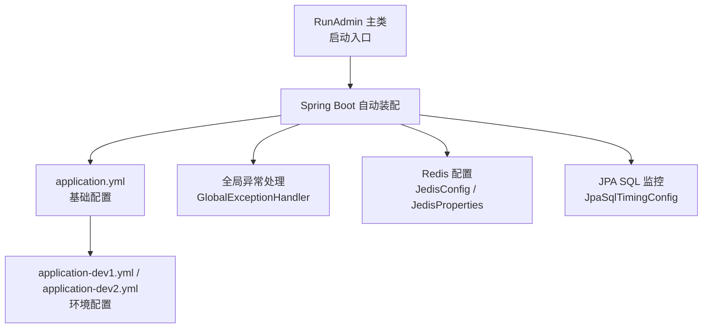
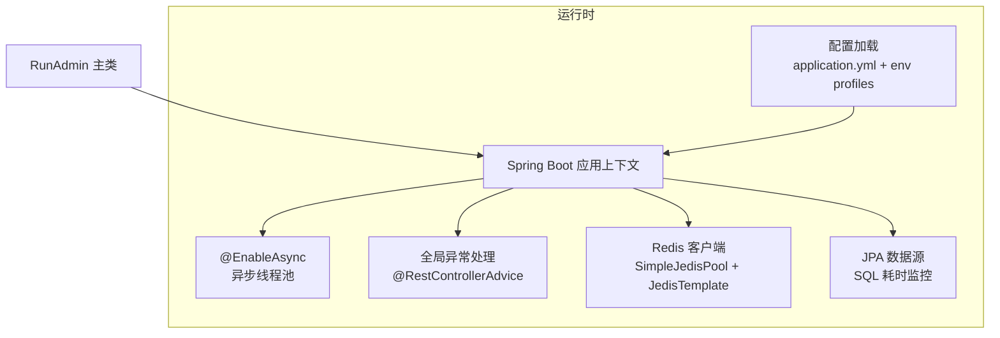
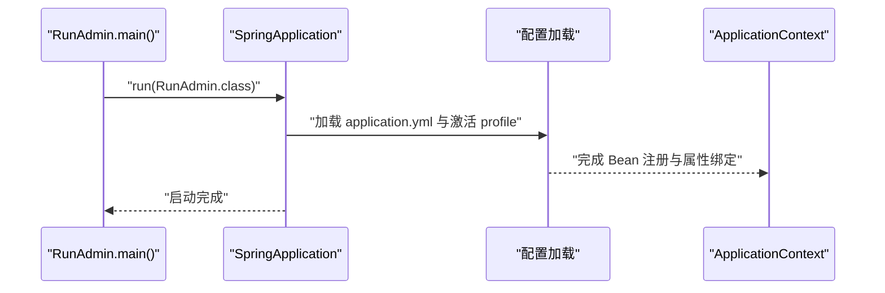
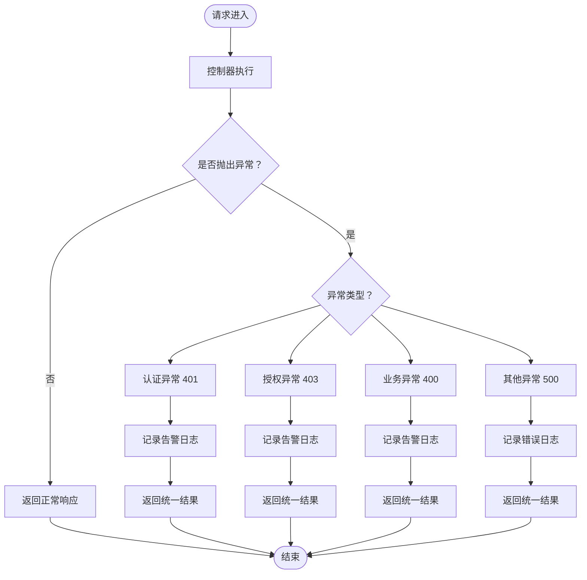
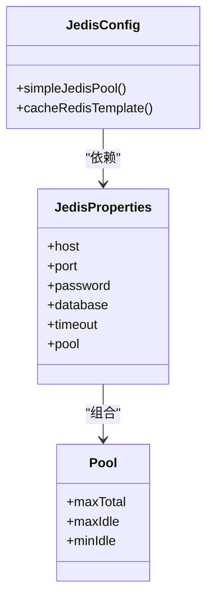
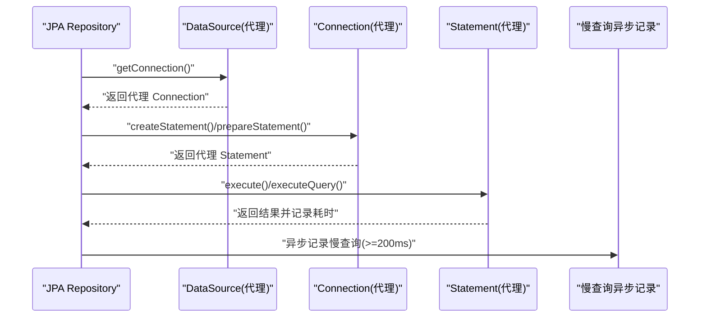
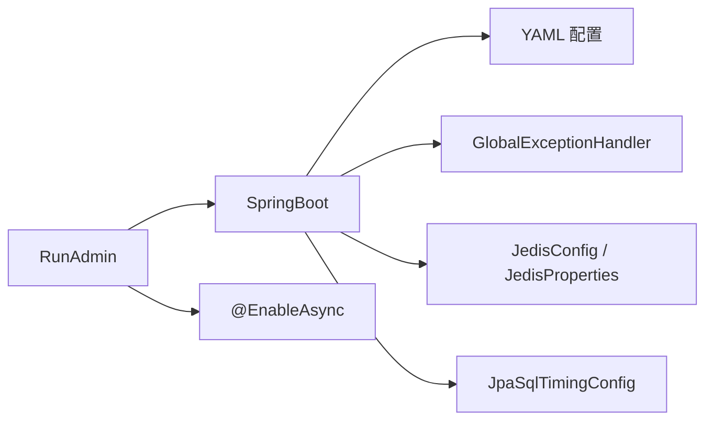

# 后台管理服务

<cite>
**本文引用的文件**
- [RunAdmin.java](file://run-admin/src/main/java/com/fastproject/RunAdmin.java)
- [application.yml](file://run-admin/src/main/resources/application.yml)
- [application-dev1.yml](file://run-admin/src/main/resources/application-dev1.yml)
- [application-dev2.yml](file://run-admin/src/main/resources/application-dev2.yml)
- [GlobalExceptionHandler.java](file://run-admin/src/main/java/com/fastproject/config/GlobalExceptionHandler.java)
- [JedisConfig.java](file://run-admin/src/main/java/com/fastproject/config/JedisConfig.java)
- [JedisProperties.java](file://run-admin/src/main/java/com/fastproject/config/JedisProperties.java)
- [JpaSqlTimingConfig.java](file://run-admin/src/main/java/com/fastproject/config/JpaSqlTimingConfig.java)
</cite>

## 目录
1. [简介](#简介)
2. [项目结构](#项目结构)
3. [核心组件](#核心组件)
4. [架构总览](#架构总览)
5. [详细组件分析](#详细组件分析)
6. [依赖关系分析](#依赖关系分析)
7. [性能考量](#性能考量)
8. [故障排查指南](#故障排查指南)
9. [结论](#结论)
10. [附录](#附录)

## 简介
本文件面向后台管理服务（run-admin）的开发者与运维人员，系统性梳理服务启动流程、Spring Boot 配置、全局异常处理、Redis 配置、JPA SQL 性能监控、异步任务、跨域与安全认证等关键主题，并提供启动参数、环境配置、部署要求、常见问题排查与性能优化建议，帮助快速定制与扩展。

## 项目结构
run-admin 模块采用标准 Spring Boot 结构，核心入口为 RunAdmin 主类，配置位于 resources 下的多环境 YAML 文件；核心配置类包括全局异常处理、Redis 连接池与模板、JPA SQL 耗时监控等。

图表来源
- [RunAdmin.java](file://run-admin/src/main/java/com/fastproject/RunAdmin.java#L1-L14)
- [application.yml](file://run-admin/src/main/resources/application.yml#L1-L5)
- [application-dev1.yml](file://run-admin/src/main/resources/application-dev1.yml#L1-L71)
- [application-dev2.yml](file://run-admin/src/main/resources/application-dev2.yml#L1-L71)
- [GlobalExceptionHandler.java](file://run-admin/src/main/java/com/fastproject/config/GlobalExceptionHandler.java#L1-L56)
- [JedisConfig.java](file://run-admin/src/main/java/com/fastproject/config/JedisConfig.java#L1-L55)
- [JedisProperties.java](file://run-admin/src/main/java/com/fastproject/config/JedisProperties.java#L1-L31)
- [JpaSqlTimingConfig.java](file://run-admin/src/main/java/com/fastproject/config/JpaSqlTimingConfig.java#L1-L267)

章节来源
- [RunAdmin.java](file://run-admin/src/main/java/com/fastproject/RunAdmin.java#L1-L14)
- [application.yml](file://run-admin/src/main/resources/application.yml#L1-L5)

## 核心组件
- 启动入口与异步支持：RunAdmin 使用 Spring Boot 注解启用异步执行能力，作为应用主类负责引导启动。
- 全局异常处理：通过@RestControllerAdvice 统一捕获认证、授权、业务与通用异常，返回标准化响应体。
- Redis 配置：基于 JedisProperties 绑定 fastproject.redis 配置，构建 SimpleJedisPool 与 JedisTemplate。
- JPA SQL 性能监控：通过 BeanPostProcessor 劫持 DataSource，代理 Connection/Statement，统计 SQL 执行耗时并异步记录慢查询。
- 环境配置：application.yml 指定端口与激活 profile；dev1/dev2 提供不同数据库与 Redis 地址及凭据。

章节来源
- [RunAdmin.java](file://run-admin/src/main/java/com/fastproject/RunAdmin.java#L1-L14)
- [GlobalExceptionHandler.java](file://run-admin/src/main/java/com/fastproject/config/GlobalExceptionHandler.java#L1-L56)
- [JedisConfig.java](file://run-admin/src/main/java/com/fastproject/config/JedisConfig.java#L1-L55)
- [JedisProperties.java](file://run-admin/src/main/java/com/fastproject/config/JedisProperties.java#L1-L31)
- [JpaSqlTimingConfig.java](file://run-admin/src/main/java/com/fastproject/config/JpaSqlTimingConfig.java#L1-L267)
- [application.yml](file://run-admin/src/main/resources/application.yml#L1-L5)
- [application-dev1.yml](file://run-admin/src/main/resources/application-dev1.yml#L1-L71)
- [application-dev2.yml](file://run-admin/src/main/resources/application-dev2.yml#L1-L71)

## 架构总览
下图展示 run-admin 的启动与关键配置交互：

图表来源
- [RunAdmin.java](file://run-admin/src/main/java/com/fastproject/RunAdmin.java#L1-L14)
- [application.yml](file://run-admin/src/main/resources/application.yml#L1-L5)
- [application-dev1.yml](file://run-admin/src/main/resources/application-dev1.yml#L1-L71)
- [application-dev2.yml](file://run-admin/src/main/resources/application-dev2.yml#L1-L71)
- [GlobalExceptionHandler.java](file://run-admin/src/main/java/com/fastproject/config/GlobalExceptionHandler.java#L1-L56)
- [JedisConfig.java](file://run-admin/src/main/java/com/fastproject/config/JedisConfig.java#L1-L55)
- [JedisProperties.java](file://run-admin/src/main/java/com/fastproject/config/JedisProperties.java#L1-L31)
- [JpaSqlTimingConfig.java](file://run-admin/src/main/java/com/fastproject/config/JpaSqlTimingConfig.java#L1-L267)

## 详细组件分析

### 启动流程与 Spring Boot 配置
- RunAdmin 主类使用 Spring Boot 注解，启动时由 SpringApplication.run 触发容器初始化。
- application.yml 指定服务端口与激活的 profile；dev1/dev2 提供开发与测试环境的数据库与 Redis 连接信息。
- 配置项覆盖范围包括：Servlet 上传限制、JMX 关闭、JPA 方言与 DDL 策略、安全相关键名与过期时间、租户开关、SQL 监控阈值、限流应用码、Redis 连接参数等。

图表来源
- [RunAdmin.java](file://run-admin/src/main/java/com/fastproject/RunAdmin.java#L1-L14)
- [application.yml](file://run-admin/src/main/resources/application.yml#L1-L5)
- [application-dev1.yml](file://run-admin/src/main/resources/application-dev1.yml#L1-L71)
- [application-dev2.yml](file://run-admin/src/main/resources/application-dev2.yml#L1-L71)

章节来源
- [RunAdmin.java](file://run-admin/src/main/java/com/fastproject/RunAdmin.java#L1-L14)
- [application.yml](file://run-admin/src/main/resources/application.yml#L1-L5)
- [application-dev1.yml](file://run-admin/src/main/resources/application-dev1.yml#L1-L71)
- [application-dev2.yml](file://run-admin/src/main/resources/application-dev2.yml#L1-L71)

### 全局异常处理机制
- 统一捕获认证异常（401）、授权异常（403）、业务异常（400）与通用异常（500），返回标准化结果对象。
- 日志输出包含请求路径与异常摘要，便于定位问题。

图表来源
- [GlobalExceptionHandler.java](file://run-admin/src/main/java/com/fastproject/config/GlobalExceptionHandler.java#L1-L56)

章节来源
- [GlobalExceptionHandler.java](file://run-admin/src/main/java/com/fastproject/config/GlobalExceptionHandler.java#L1-L56)

### Redis 配置与连接池
- JedisProperties 绑定 fastproject.redis 前缀，包含主机、端口、密码、数据库、超时与连接池参数。
- JedisConfig 基于属性创建 SimpleJedisPool，并注入 JedisTemplate 实例，供缓存操作使用。
- 密码为空字符串时将被置空以避免认证异常。

图表来源
- [JedisProperties.java](file://run-admin/src/main/java/com/fastproject/config/JedisProperties.java#L1-L31)
- [JedisConfig.java](file://run-admin/src/main/java/com/fastproject/config/JedisConfig.java#L1-L55)

章节来源
- [JedisProperties.java](file://run-admin/src/main/java/com/fastproject/config/JedisProperties.java#L1-L31)
- [JedisConfig.java](file://run-admin/src/main/java/com/fastproject/config/JedisConfig.java#L1-L55)

### JPA SQL 性能监控实现
- 通过 BeanPostProcessor 在容器后置阶段包装 DataSource，生成代理 Connection。
- 代理 Connection 返回代理 Statement，拦截 execute/executeQuery/executeUpdate 等方法，计算耗时并按阈值输出日志。
- 超过阈值（默认 0ms，示例配置中可调整）的 SQL 将异步记录慢查询日志（排除自身写入慢查询表的循环）。

图表来源
- [JpaSqlTimingConfig.java](file://run-admin/src/main/java/com/fastproject/config/JpaSqlTimingConfig.java#L1-L267)

章节来源
- [JpaSqlTimingConfig.java](file://run-admin/src/main/java/com/fastproject/config/JpaSqlTimingConfig.java#L1-L267)

### 异步任务配置
- RunAdmin 类启用 @EnableAsync，表明应用具备异步执行能力，具体线程池与任务调度策略由 Spring 默认或自定义配置决定。
- JPA SQL 监控内部使用 CompletableFuture.runAsync 异步记录慢查询，避免阻塞主业务线程。

章节来源
- [RunAdmin.java](file://run-admin/src/main/java/com/fastproject/RunAdmin.java#L1-L14)
- [JpaSqlTimingConfig.java](file://run-admin/src/main/java/com/fastproject/config/JpaSqlTimingConfig.java#L1-L267)

### 跨域处理与安全认证设置
- 本模块未发现显式的跨域与安全认证配置类文件，通常可通过 WebMvcConfigurer 或 Spring Security 配置实现；如需启用，请补充相应配置类与过滤器。
- 安全相关配置项（如 token 键名、过期时间、设备标识等）已在 application-dev1.yml 与 application-dev2.yml 中提供，可用于后续集成认证体系。

章节来源
- [application-dev1.yml](file://run-admin/src/main/resources/application-dev1.yml#L43-L48)
- [application-dev2.yml](file://run-admin/src/main/resources/application-dev2.yml#L44-L48)

## 依赖关系分析
- RunAdmin 依赖 Spring Boot 自动装配与配置加载。
- 全局异常处理依赖 ResultVo 与 Spring Security 异常类型。
- Redis 配置依赖 JedisProperties 与 SimpleJedisPool。
- JPA SQL 监控依赖 Spring BeanPostProcessor 与 Slf4j 日志。
- 异步任务依赖 @EnableAsync 与 CompletableFuture。

图表来源
- [RunAdmin.java](file://run-admin/src/main/java/com/fastproject/RunAdmin.java#L1-L14)
- [GlobalExceptionHandler.java](file://run-admin/src/main/java/com/fastproject/config/GlobalExceptionHandler.java#L1-L56)
- [JedisConfig.java](file://run-admin/src/main/java/com/fastproject/config/JedisConfig.java#L1-L55)
- [JedisProperties.java](file://run-admin/src/main/java/com/fastproject/config/JedisProperties.java#L1-L31)
- [JpaSqlTimingConfig.java](file://run-admin/src/main/java/com/fastproject/config/JpaSqlTimingConfig.java#L1-L267)

## 性能考量
- SQL 监控阈值可调，默认 0ms；建议在生产环境结合业务压力设定合理阈值（例如 200ms）。
- 异步记录慢查询避免阻塞主线程，但需关注线程池与队列容量，防止突发流量导致堆积。
- Redis 连接池参数（最大连接数、空闲数）应根据并发与延迟目标调优。
- JMX 关闭可减少额外开销；如需监控指标，可考虑启用 Micrometer 或其他观测栈。
- Servlet 上传大小在 dev1/dev2 中已提升至 500MB，注意磁盘与内存占用。

## 故障排查指南
- 认证/授权异常：检查请求头中携带的令牌键名与过期时间配置，确认用户会话状态。
- 业务异常：查看业务层抛出的异常消息，结合日志定位参数校验或流程问题。
- SQL 性能：关注慢查询日志与 SQL 执行耗时，优先优化高频慢 SQL；必要时引入索引或分页。
- Redis 连接：核对 host/port/password/database 与池参数，确保网络连通与密码正确。
- 配置生效：确认激活的 profile 与对应 YAML 文件中的配置项一致。

章节来源
- [GlobalExceptionHandler.java](file://run-admin/src/main/java/com/fastproject/config/GlobalExceptionHandler.java#L1-L56)
- [JpaSqlTimingConfig.java](file://run-admin/src/main/java/com/fastproject/config/JpaSqlTimingConfig.java#L1-L267)
- [JedisConfig.java](file://run-admin/src/main/java/com/fastproject/config/JedisConfig.java#L1-L55)
- [JedisProperties.java](file://run-admin/src/main/java/com/fastproject/config/JedisProperties.java#L1-L31)
- [application-dev1.yml](file://run-admin/src/main/resources/application-dev1.yml#L1-L71)
- [application-dev2.yml](file://run-admin/src/main/resources/application-dev2.yml#L1-L71)

## 结论
run-admin 模块以最小化配置实现了启动、异常处理、Redis 与 JPA SQL 监控等关键能力。通过 profile 切换与 YAML 参数即可快速适配不同环境；建议在生产环境中完善跨域与安全认证配置，并持续优化慢查询与缓存策略。

## 附录
- 启动参数与环境
  - 端口：由 application.yml 指定
  - 激活 profile：由 application.yml 指定，dev1/dev2 提供不同数据库与 Redis 配置
  - 上传限制：dev1/dev2 中已配置大文件上传大小
- 部署要求
  - PostgreSQL 数据库与 Redis 服务可用
  - 根据实际环境调整 fastproject.redis 与 spring.datasource 下的连接参数
- 定制与扩展建议
  - 新增控制器：在 module 包下按功能划分目录组织
  - 新增缓存策略：在 JedisConfig 中扩展模板或连接池
  - 新增 SQL 监控规则：在 JpaSqlTimingConfig 中调整阈值或日志级别
  - 新增跨域与安全：新增 WebMvcConfigurer 或 Spring Security 配置类