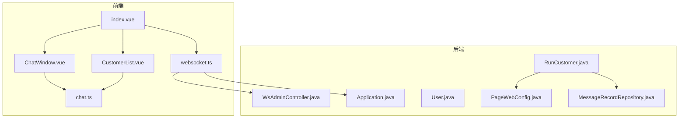
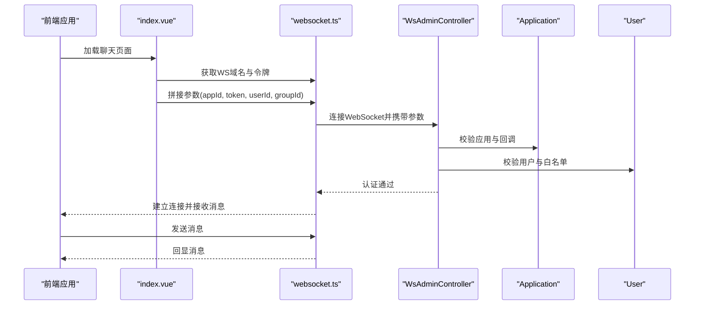
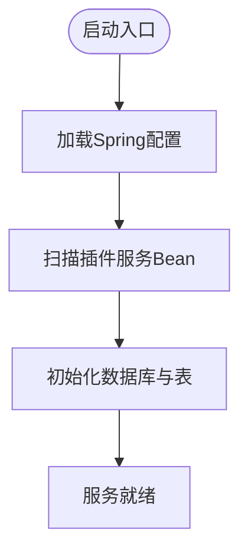
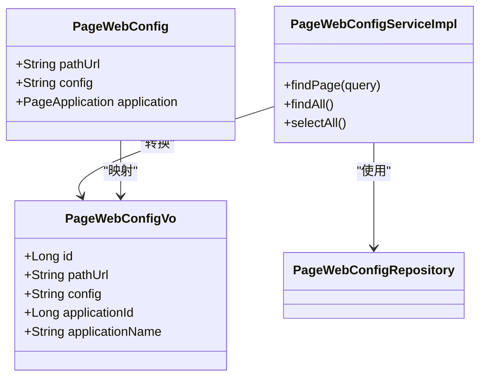
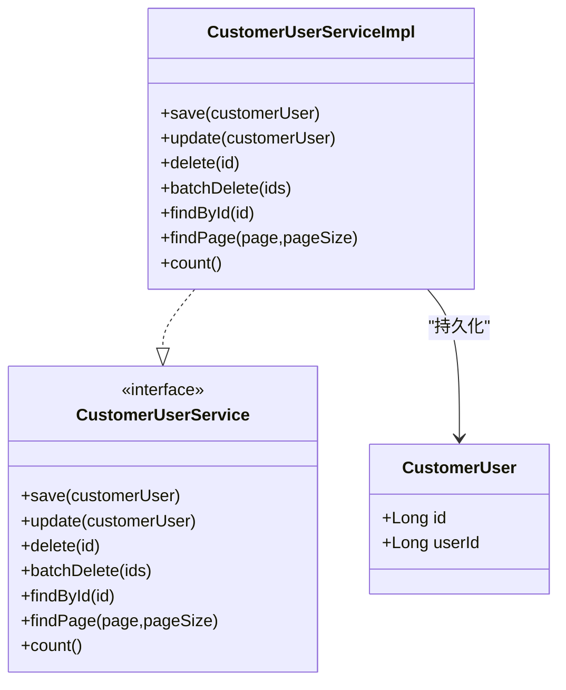
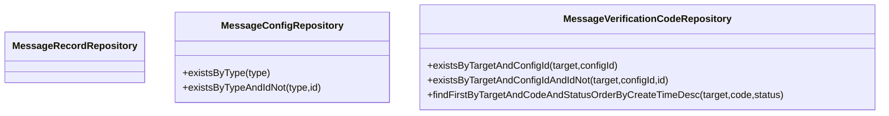
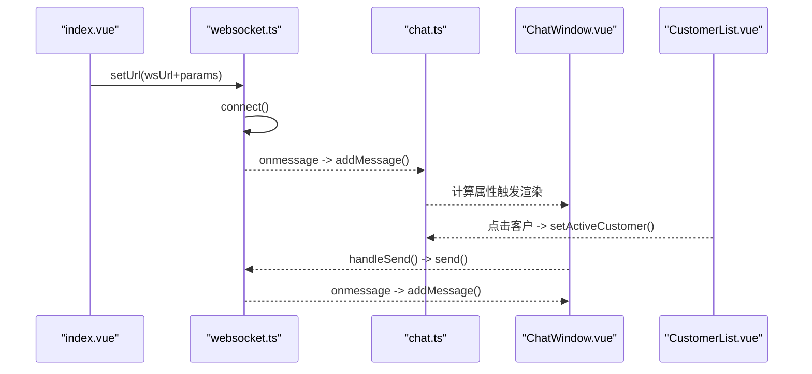
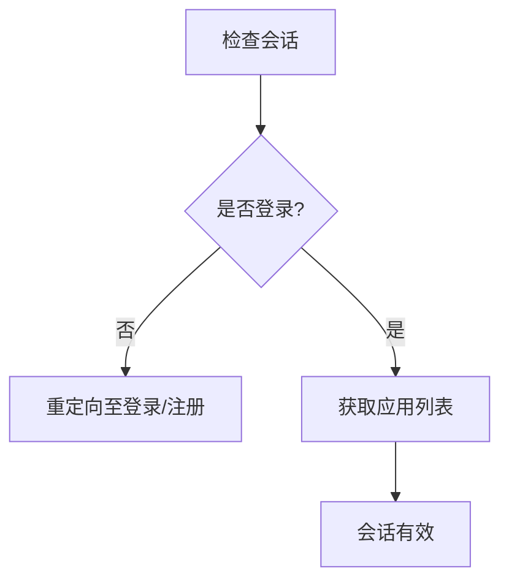
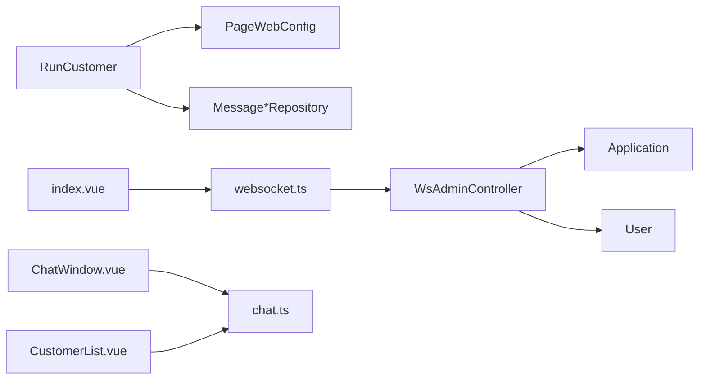

# 客服插件服务

<cite>
**本文引用的文件**
- [RunCustomer.java](file://run-customer-plugin/src/main/java/com/quickproject/RunCustomer.java)
- [CustomerUser.java](file://run-customer-plugin/src/main/java/com/quickproject/module/chat/domain/CustomerUser.java)
- [CustomerUserService.java](file://run-customer-plugin/src/main/java/com/quickproject/module/chat/service/CustomerUserService.java)
- [CustomerUserServiceImpl.java](file://run-customer-plugin/src/main/java/com/quickproject/module/chat/service/impl/CustomerUserServiceImpl.java)
- [PageWebConfig.java](file://page-module/src/main/java/com/quickproject/page/domain/PageWebConfig.java)
- [PageWebConfigRepository.java](file://page-module/src/main/java/com/quickproject/page/repository/db/PageWebConfigRepository.java)
- [PageWebConfigServiceImpl.java](file://page-module/src/main/java/com/quickproject/page/service/impl/PageWebConfigServiceImpl.java)
- [PageWebConfigQuery.java](file://page-module/src/main/java/com/quickproject/page/vo/pagewebconfig/PageWebConfigQuery.java)
- [PageWebConfigUpdate.java](file://page-module/src/main/java/com/quickproject/page/vo/pagewebconfig/PageWebConfigUpdate.java)
- [PageWebConfigVo.java](file://page-module/src/main/java/com/quickproject/page/vo/pagewebconfig/PageWebConfigVo.java)
- [User.java](file://websocket/src/main/java/com/quickproject/domain/User.java)
- [Application.java](file://websocket/src/main/java/com/quickproject/domain/Application.java)
- [WsAdminController.java](file://websocket/src/main/java/com/quickproject/controller/WsAdminController.java)
- [websocket.ts](file://fast-ui/apps/customer-service-vue/src/utils/websocket.ts)
- [ChatWindow.vue](file://fast-ui/apps/customer-service-vue/src/components/ChatWindow.vue)
- [CustomerList.vue](file://fast-ui/apps/customer-service-vue/src/components/CustomerList.vue)
- [index.vue](file://fast-ui/apps/customer-service-vue/src/views/chat/index.vue)
- [chat.ts](file://fast-ui/apps/customer-service-vue/src/stores/chat.ts)
- [MessageRecordRepository.java](file://message-module/src/main/java/com/quickproject/message/repository/db/MessageRecordRepository.java)
- [MessageConfigRepository.java](file://message-module/src/main/java/com/quickproject/message/repository/db/MessageConfigRepository.java)
- [MessageVerificationCodeRepository.java](file://message-module/src/main/java/com/quickproject/message/repository/db/MessageVerificationCodeRepository.java)
</cite>

## 目录
1. [简介](#简介)
2. [项目结构](#项目结构)
3. [核心组件](#核心组件)
4. [架构总览](#架构总览)
5. [详细组件分析](#详细组件分析)
6. [依赖关系分析](#依赖关系分析)
7. [性能考虑](#性能考虑)
8. [故障排查指南](#故障排查指南)
9. [结论](#结论)
10. [附录](#附录)

## 简介
本文件面向“客服插件服务”的综合技术文档，围绕以下目标展开：
- RunCustomer服务的架构设计与启动流程
- WebConfig配置与聊天模块数据模型设计
- 消息存储、用户管理、会话管理的实现机制
- 客服场景下的实时通信协议与消息路由策略
- 插件集成指南与扩展开发方法
- 部署与运维支持建议

该仓库采用多模块分层架构，前端使用Vue 3 + TypeScript，后端基于Spring Boot，实时通信由独立的WebSocket模块提供，客服插件服务作为独立入口运行。

## 项目结构
整体采用多模块组织方式，核心模块包括：
- run-customer-plugin：客服插件服务入口与客服用户域
- websocket：WebSocket实时通信与鉴权
- page-module：页面WebConfig配置管理
- message-module：消息记录与模板等能力（可复用）
- fast-ui：客服前端应用（customer-service-vue）

图表来源
- [RunCustomer.java](file://run-customer-plugin/src/main/java/com/quickproject/RunCustomer.java#L1-L12)
- [WsAdminController.java](file://websocket/src/main/java/com/quickproject/controller/WsAdminController.java#L35-L75)
- [Application.java](file://websocket/src/main/java/com/quickproject/domain/Application.java#L1-L49)
- [User.java](file://websocket/src/main/java/com/quickproject/domain/User.java#L1-L32)
- [PageWebConfig.java](file://page-module/src/main/java/com/quickproject/page/domain/PageWebConfig.java#L1-L34)
- [MessageRecordRepository.java](file://message-module/src/main/java/com/quickproject/message/repository/db/MessageRecordRepository.java#L1-L10)
- [index.vue](file://fast-ui/apps/customer-service-vue/src/views/chat/index.vue#L1-L94)
- [ChatWindow.vue](file://fast-ui/apps/customer-service-vue/src/components/ChatWindow.vue#L37-L203)
- [CustomerList.vue](file://fast-ui/apps/customer-service-vue/src/components/CustomerList.vue#L1-L34)
- [chat.ts](file://fast-ui/apps/customer-service-vue/src/stores/chat.ts#L57-L118)
- [websocket.ts](file://fast-ui/apps/customer-service-vue/src/utils/websocket.ts#L1-L95)

章节来源
- [RunCustomer.java](file://run-customer-plugin/src/main/java/com/quickproject/RunCustomer.java#L1-L12)
- [index.vue](file://fast-ui/apps/customer-service-vue/src/views/chat/index.vue#L1-L94)

## 核心组件
- RunCustomer服务入口：负责Spring Boot应用启动，承载客服插件服务的上下文与依赖注入。
- 客服用户域：CustomerUser实体与CustomerUserService接口及其实现，支撑客服人员的增删改查与分页统计。
- WebConfig配置：PageWebConfig实体与PageWebConfigServiceImpl服务，提供按路径与应用维度的配置查询与分页。
- WebSocket实时通信：WsAdminController提供会话与应用管理接口；Application与User实体支撑鉴权与白名单控制。
- 前端聊天组件：websocket.ts封装WebSocket连接、重连与发送；index.vue、ChatWindow.vue、CustomerList.vue、chat.ts共同构成聊天交互链路。

章节来源
- [CustomerUser.java](file://run-customer-plugin/src/main/java/com/quickproject/module/chat/domain/CustomerUser.java#L1-L25)
- [CustomerUserService.java](file://run-customer-plugin/src/main/java/com/quickproject/module/chat/service/CustomerUserService.java#L1-L45)
- [PageWebConfig.java](file://page-module/src/main/java/com/quickproject/page/domain/PageWebConfig.java#L1-L34)
- [PageWebConfigServiceImpl.java](file://page-module/src/main/java/com/quickproject/page/service/impl/PageWebConfigServiceImpl.java#L1-L157)
- [WsAdminController.java](file://websocket/src/main/java/com/quickproject/controller/WsAdminController.java#L35-L75)
- [Application.java](file://websocket/src/main/java/com/quickproject/domain/Application.java#L1-L49)
- [User.java](file://websocket/src/main/java/com/quickproject/domain/User.java#L1-L32)
- [websocket.ts](file://fast-ui/apps/customer-service-vue/src/utils/websocket.ts#L1-L95)
- [index.vue](file://fast-ui/apps/customer-service-vue/src/views/chat/index.vue#L1-L94)
- [ChatWindow.vue](file://fast-ui/apps/customer-service-vue/src/components/ChatWindow.vue#L37-L203)
- [CustomerList.vue](file://fast-ui/apps/customer-service-vue/src/components/CustomerList.vue#L1-L34)
- [chat.ts](file://fast-ui/apps/customer-service-vue/src/stores/chat.ts#L57-L118)

## 架构总览
客服插件服务采用前后端分离架构：
- 前端通过websocket.ts建立WebSocket连接，携带参数（如appId、token、userId、groupId）进行鉴权与路由。
- 后端WebSocket模块负责会话校验、应用鉴权与消息转发；客服插件服务提供WebConfig配置与客服用户管理。
- 聊天界面由index.vue调度，ChatWindow.vue渲染消息列表，CustomerList.vue展示客户列表，chat.ts集中管理状态与消息队列。

图表来源
- [index.vue](file://fast-ui/apps/customer-service-vue/src/views/chat/index.vue#L54-L94)
- [websocket.ts](file://fast-ui/apps/customer-service-vue/src/utils/websocket.ts#L68-L95)
- [WsAdminController.java](file://websocket/src/main/java/com/quickproject/controller/WsAdminController.java#L35-L75)
- [Application.java](file://websocket/src/main/java/com/quickproject/domain/Application.java#L1-L49)
- [User.java](file://websocket/src/main/java/com/quickproject/domain/User.java#L1-L32)

## 详细组件分析

### RunCustomer服务与启动流程
- 入口类RunCustomer通过SpringBootApplication注解启用自动装配，主函数调用SpringApplication.run完成容器启动。
- 该服务作为插件服务的运行载体，加载插件模块中的实体、服务与配置，供前端调用与实时通信使用。

图表来源
- [RunCustomer.java](file://run-customer-plugin/src/main/java/com/quickproject/RunCustomer.java#L6-L11)

章节来源
- [RunCustomer.java](file://run-customer-plugin/src/main/java/com/quickproject/RunCustomer.java#L1-L12)

### WebConfig配置与页面数据模型
- PageWebConfig实体映射page_web_config表，包含请求地址、配置内容与所属应用。
- PageWebConfigServiceImpl提供分页查询、全量查询与VO转换，支持按路径URL与应用ID过滤。
- PageWebConfigRepository继承JPA与Specification，便于复杂条件查询。
- VO类PageWebConfigVo用于对外返回，包含应用名称等关联字段。

图表来源
- [PageWebConfig.java](file://page-module/src/main/java/com/quickproject/page/domain/PageWebConfig.java#L1-L34)
- [PageWebConfigRepository.java](file://page-module/src/main/java/com/quickproject/page/repository/db/PageWebConfigRepository.java#L1-L11)
- [PageWebConfigServiceImpl.java](file://page-module/src/main/java/com/quickproject/page/service/impl/PageWebConfigServiceImpl.java#L98-L157)
- [PageWebConfigVo.java](file://page-module/src/main/java/com/quickproject/page/vo/pagewebconfig/PageWebConfigVo.java#L1-L32)

章节来源
- [PageWebConfig.java](file://page-module/src/main/java/com/quickproject/page/domain/PageWebConfig.java#L1-L34)
- [PageWebConfigServiceImpl.java](file://page-module/src/main/java/com/quickproject/page/service/impl/PageWebConfigServiceImpl.java#L1-L157)
- [PageWebConfigRepository.java](file://page-module/src/main/java/com/quickproject/page/repository/db/PageWebConfigRepository.java#L1-L11)
- [PageWebConfigQuery.java](file://page-module/src/main/java/com/quickproject/page/vo/pagewebconfig/PageWebConfigQuery.java#L1-L20)
- [PageWebConfigUpdate.java](file://page-module/src/main/java/com/quickproject/page/vo/pagewebconfig/PageWebConfigUpdate.java#L1-L27)
- [PageWebConfigVo.java](file://page-module/src/main/java/com/quickproject/page/vo/pagewebconfig/PageWebConfigVo.java#L1-L32)

### 聊天模块数据模型与用户管理
- 客服用户实体CustomerUser映射customer_service_user表，包含自增ID与用户ID字段。
- CustomerUserService定义了保存、更新、删除、批量删除、查询、分页与计数等接口。
- CustomerUserServiceImpl实现分页与计数逻辑，结合Spring Data JPA完成持久化操作。

图表来源
- [CustomerUser.java](file://run-customer-plugin/src/main/java/com/quickproject/module/chat/domain/CustomerUser.java#L1-L25)
- [CustomerUserService.java](file://run-customer-plugin/src/main/java/com/quickproject/module/chat/service/CustomerUserService.java#L1-L45)
- [CustomerUserServiceImpl.java](file://run-customer-plugin/src/main/java/com/quickproject/module/chat/service/impl/CustomerUserServiceImpl.java#L77-L97)

章节来源
- [CustomerUser.java](file://run-customer-plugin/src/main/java/com/quickproject/module/chat/domain/CustomerUser.java#L1-L25)
- [CustomerUserService.java](file://run-customer-plugin/src/main/java/com/quickproject/module/chat/service/CustomerUserService.java#L1-L45)
- [CustomerUserServiceImpl.java](file://run-customer-plugin/src/main/java/com/quickproject/module/chat/service/impl/CustomerUserServiceImpl.java#L77-L97)

### 消息存储与验证
- MessageRecordRepository提供消息记录的JPA访问能力。
- MessageConfigRepository提供消息配置的唯一性校验与查询能力。
- MessageVerificationCodeRepository提供验证码的去重、查找与状态校验能力。

图表来源
- [MessageRecordRepository.java](file://message-module/src/main/java/com/quickproject/message/repository/db/MessageRecordRepository.java#L1-L10)
- [MessageConfigRepository.java](file://message-module/src/main/java/com/quickproject/message/repository/db/MessageConfigRepository.java#L1-L14)
- [MessageVerificationCodeRepository.java](file://message-module/src/main/java/com/quickproject/message/repository/db/MessageVerificationCodeRepository.java#L1-L18)

章节来源
- [MessageRecordRepository.java](file://message-module/src/main/java/com/quickproject/message/repository/db/MessageRecordRepository.java#L1-L10)
- [MessageConfigRepository.java](file://message-module/src/main/java/com/quickproject/message/repository/db/MessageConfigRepository.java#L1-L14)
- [MessageVerificationCodeRepository.java](file://message-module/src/main/java/com/quickproject/message/repository/db/MessageVerificationCodeRepository.java#L1-L18)

### 实时通信协议与消息路由
- 前端websocket.ts负责WebSocket连接、消息收发与断线重连；在onmessage中解析回显消息并写入chat.ts的状态树。
- index.vue在初始化时拉取WS域名与令牌，拼接参数（appId、token、userId、groupId），并通过websocket.ts建立连接。
- ChatWindow.vue监听消息变化并滚动到底部；CustomerList.vue展示客户列表与在线状态；chat.ts维护每个客户的会话消息数组。

图表来源
- [index.vue](file://fast-ui/apps/customer-service-vue/src/views/chat/index.vue#L54-L94)
- [websocket.ts](file://fast-ui/apps/customer-service-vue/src/utils/websocket.ts#L68-L95)
- [chat.ts](file://fast-ui/apps/customer-service-vue/src/stores/chat.ts#L90-L118)
- [ChatWindow.vue](file://fast-ui/apps/customer-service-vue/src/components/ChatWindow.vue#L174-L194)
- [CustomerList.vue](file://fast-ui/apps/customer-service-vue/src/components/CustomerList.vue#L17-L34)

章节来源
- [websocket.ts](file://fast-ui/apps/customer-service-vue/src/utils/websocket.ts#L1-L95)
- [index.vue](file://fast-ui/apps/customer-service-vue/src/views/chat/index.vue#L1-L94)
- [ChatWindow.vue](file://fast-ui/apps/customer-service-vue/src/components/ChatWindow.vue#L37-L203)
- [CustomerList.vue](file://fast-ui/apps/customer-service-vue/src/components/CustomerList.vue#L1-L34)
- [chat.ts](file://fast-ui/apps/customer-service-vue/src/stores/chat.ts#L57-L118)

### 会话管理与鉴权
- WsAdminController提供会话检查与应用列表查询，确保管理员登录态有效。
- Application与User实体分别存储应用密钥、回调与用户白名单等信息，用于WebSocket接入侧的鉴权与安全控制。

图表来源
- [WsAdminController.java](file://websocket/src/main/java/com/quickproject/controller/WsAdminController.java#L41-L75)
- [Application.java](file://websocket/src/main/java/com/quickproject/domain/Application.java#L1-L49)
- [User.java](file://websocket/src/main/java/com/quickproject/domain/User.java#L1-L32)

章节来源
- [WsAdminController.java](file://websocket/src/main/java/com/quickproject/controller/WsAdminController.java#L35-L75)
- [Application.java](file://websocket/src/main/java/com/quickproject/domain/Application.java#L1-L49)
- [User.java](file://websocket/src/main/java/com/quickproject/domain/User.java#L1-L32)

## 依赖关系分析
- 客服插件服务依赖PageWebConfig与消息相关仓库，用于配置下发与消息存取。
- 前端依赖websocket.ts与chat.ts，形成从视图到状态再到网络层的清晰依赖链。
- WebSocket模块依赖Application与User实体，实现应用级鉴权与用户白名单控制。

图表来源
- [RunCustomer.java](file://run-customer-plugin/src/main/java/com/quickproject/RunCustomer.java#L1-L12)
- [PageWebConfig.java](file://page-module/src/main/java/com/quickproject/page/domain/PageWebConfig.java#L1-L34)
- [MessageRecordRepository.java](file://message-module/src/main/java/com/quickproject/message/repository/db/MessageRecordRepository.java#L1-L10)
- [index.vue](file://fast-ui/apps/customer-service-vue/src/views/chat/index.vue#L1-L94)
- [websocket.ts](file://fast-ui/apps/customer-service-vue/src/utils/websocket.ts#L1-L95)
- [WsAdminController.java](file://websocket/src/main/java/com/quickproject/controller/WsAdminController.java#L35-L75)
- [Application.java](file://websocket/src/main/java/com/quickproject/domain/Application.java#L1-L49)
- [User.java](file://websocket/src/main/java/com/quickproject/domain/User.java#L1-L32)
- [ChatWindow.vue](file://fast-ui/apps/customer-service-vue/src/components/ChatWindow.vue#L37-L203)
- [CustomerList.vue](file://fast-ui/apps/customer-service-vue/src/components/CustomerList.vue#L1-L34)
- [chat.ts](file://fast-ui/apps/customer-service-vue/src/stores/chat.ts#L57-L118)

章节来源
- [RunCustomer.java](file://run-customer-plugin/src/main/java/com/quickproject/RunCustomer.java#L1-L12)
- [index.vue](file://fast-ui/apps/customer-service-vue/src/views/chat/index.vue#L1-L94)
- [websocket.ts](file://fast-ui/apps/customer-service-vue/src/utils/websocket.ts#L1-L95)
- [WsAdminController.java](file://websocket/src/main/java/com/quickproject/controller/WsAdminController.java#L35-L75)

## 性能考虑
- WebSocket连接池与重连策略：前端websocket.ts内置指数退避或固定间隔重连，避免频繁抖动导致资源浪费。
- 前端状态管理：chat.ts使用响应式对象与计算属性，减少不必要渲染；消息列表按客户维度分组，降低单列表长度。
- 后端鉴权缓存：可对应用与用户鉴权结果进行短期缓存，降低数据库压力。
- 分页查询：PageWebConfigServiceImpl使用分页与Specification，避免一次性加载大量配置。
- 数据库索引：建议在PageWebConfig.pathUrl、Application.appId、MessageVerificationCode.target等字段建立索引以提升查询效率。

## 故障排查指南
- WebSocket无法连接
  - 检查index.vue中WS域名与参数拼接是否正确，确认appId、token、userId、groupId齐全。
  - 查看websocket.ts的onerror与onclose处理，确认是否触发重连。
- 消息不显示或重复
  - 检查websocket.ts的onmessage解析逻辑，确保消息被正确写入chat.ts。
  - 确认ChatWindow.vue的消息计算属性与watch是否生效。
- 会话失效
  - 检查WsAdminController的会话检查逻辑与User白名单配置。
  - 确认Application的回调与状态正常。

章节来源
- [index.vue](file://fast-ui/apps/customer-service-vue/src/views/chat/index.vue#L54-L94)
- [websocket.ts](file://fast-ui/apps/customer-service-vue/src/utils/websocket.ts#L49-L85)
- [ChatWindow.vue](file://fast-ui/apps/customer-service-vue/src/components/ChatWindow.vue#L171-L173)
- [WsAdminController.java](file://websocket/src/main/java/com/quickproject/controller/WsAdminController.java#L41-L75)
- [User.java](file://websocket/src/main/java/com/quickproject/domain/User.java#L1-L32)

## 结论
本客服插件服务通过清晰的模块划分与前后端协作，实现了WebConfig配置管理、客服用户域管理、消息存储与实时通信能力。WebSocket模块提供稳定的鉴权与路由基础，前端聊天组件以状态驱动的方式高效渲染与交互。建议在生产环境中完善鉴权缓存、数据库索引与监控告警，持续优化用户体验与系统稳定性。

## 附录
- 插件集成步骤
  - 在前端index.vue中正确配置WS域名与参数（appId、token、userId、groupId）。
  - 使用websocket.ts发起连接，并在onmessage中将消息写入chat.ts。
  - 在后端确保Application与User配置正确，WsAdminController会话检查通过。
- 扩展开发建议
  - 新增WebConfig类型：在PageWebConfig中扩展字段，并在ServiceImpl中补充查询与转换逻辑。
  - 新增消息类型：在MessageConfigRepository中增加唯一性校验，在MessageRecordRepository中新增查询方法。
  - 新增客服用户：通过CustomerUserService接口扩展业务逻辑，保持与CustomerUser实体一致的字段设计。
- 部署与运维
  - 前端构建产物部署至静态服务器，确保WebSocket域名可访问。
  - 后端WebSocket模块与RunCustomer服务需保证数据库连通与鉴权配置可用。
  - 建议开启日志与指标监控，关注WebSocket连接数、消息吞吐与鉴权失败率。