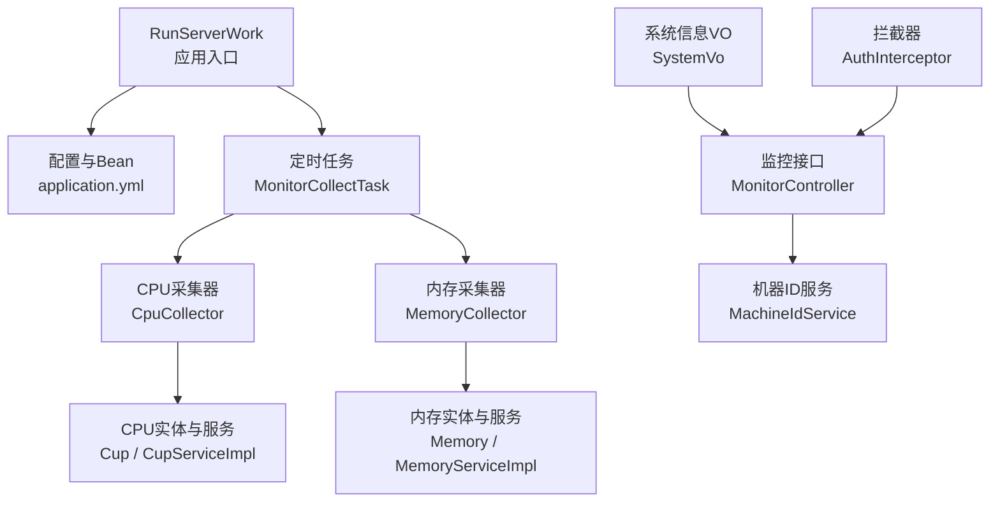
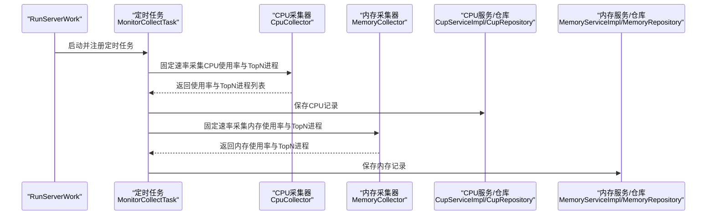
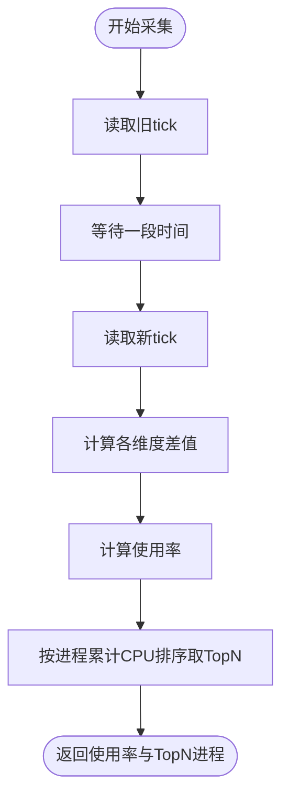
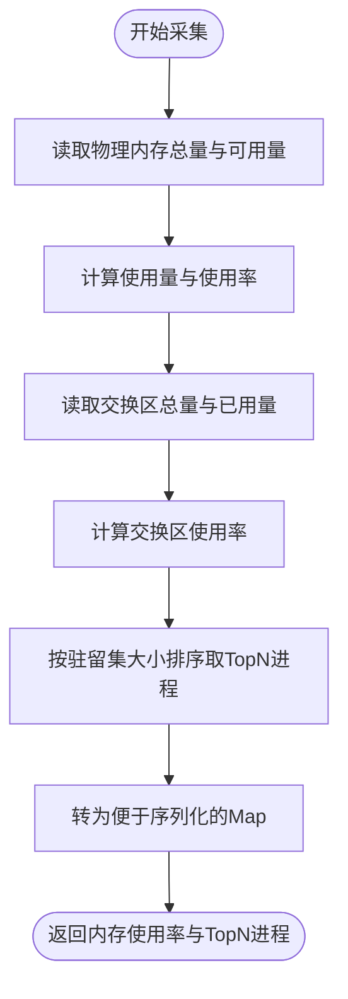
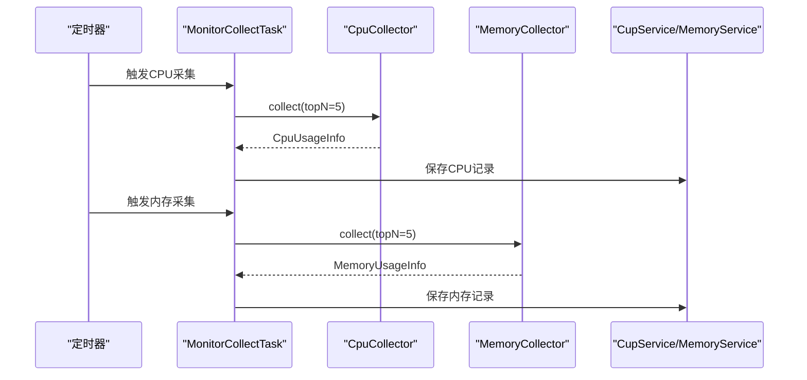
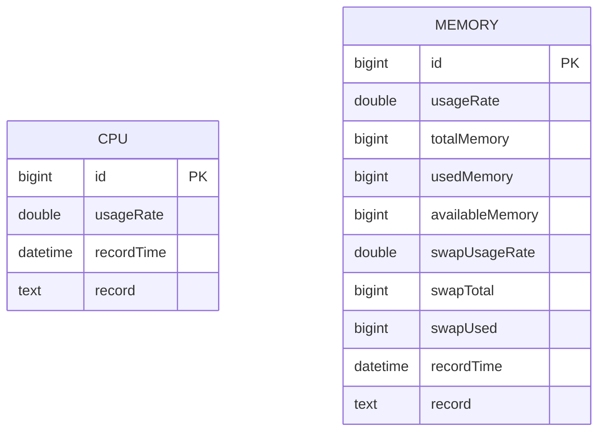
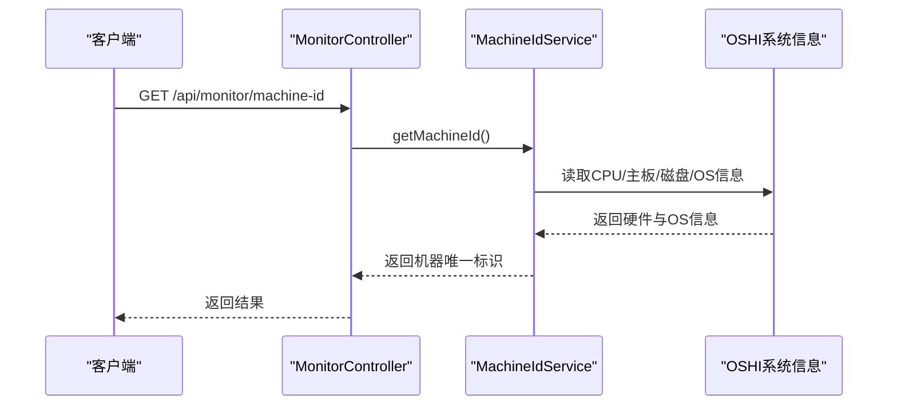
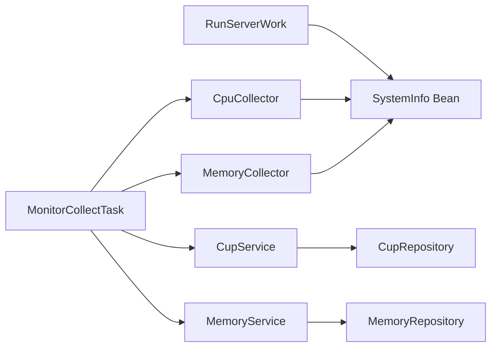

# 服务器工作节点

<cite>
**本文引用的文件**
- [RunServerWork.java](file://server-work/src/main/java/com/fastproject/RunServerWork.java)
- [application.yml](file://server-work/src/main/resources/application.yml)
- [CpuCollector.java](file://server-work/src/main/java/com/fastproject/collector/CpuCollector.java)
- [MemoryCollector.java](file://server-work/src/main/java/com/fastproject/collector/MemoryCollector.java)
- [MonitorCollectTask.java](file://server-work/src/main/java/com/fastproject/task/MonitorCollectTask.java)
- [Cup.java](file://server-work/src/main/java/com/fastproject/domain/Cup.java)
- [Memory.java](file://server-work/src/main/java/com/fastproject/domain/Memory.java)
- [CupServiceImpl.java](file://server-work/src/main/java/com/fastproject/service/impl/CupServiceImpl.java)
- [MemoryServiceImpl.java](file://server-work/src/main/java/com/fastproject/service/impl/MemoryServiceImpl.java)
- [MachineIdService.java](file://server-work/src/main/java/com/fastproject/service/MachineIdService.java)
- [MonitorController.java](file://server-work/src/main/java/com/fastproject/controller/MonitorController.java)
- [SystemVo.java](file://server-work/src/main/java/com/fastproject/vo/SystemVo.java)
- [AuthInterceptor.java](file://server-work/src/main/java/com/fastproject/interceptor/AuthInterceptor.java)
</cite>

## 目录
1. [简介](#简介)
2. [项目结构](#项目结构)
3. [核心组件](#核心组件)
4. [架构总览](#架构总览)
5. [详细组件分析](#详细组件分析)
6. [依赖关系分析](#依赖关系分析)
7. [性能考量](#性能考量)
8. [故障排查指南](#故障排查指南)
9. [结论](#结论)
10. [附录](#附录)

## 简介
本文件面向运维与开发团队，系统性阐述“服务器工作节点”模块的监控采集架构与启动流程，覆盖以下主题：
- RunServerWork 启动与初始化
- CPU 与内存采集器的实现原理与数据结构
- 定时任务调度机制与监控数据持久化策略
- 系统信息获取、性能统计与告警机制现状
- 监控数据可视化与报表生成建议
- 运维最佳实践与故障诊断方法

## 项目结构
服务器工作节点位于 server-work 模块，采用 Spring Boot + JPA + H2 的轻量级架构，通过 OSHI 库采集系统硬件与进程信息，并以定时任务周期性写入数据库。

图表来源
- [RunServerWork.java](file://server-work/src/main/java/com/fastproject/RunServerWork.java#L16-L27)
- [application.yml](file://server-work/src/main/resources/application.yml#L1-L16)
- [MonitorCollectTask.java](file://server-work/src/main/java/com/fastproject/task/MonitorCollectTask.java#L22-L80)
- [CpuCollector.java](file://server-work/src/main/java/com/fastproject/collector/CpuCollector.java#L25-L53)
- [MemoryCollector.java](file://server-work/src/main/java/com/fastproject/collector/MemoryCollector.java#L25-L80)
- [Cup.java](file://server-work/src/main/java/com/fastproject/domain/Cup.java#L9-L36)
- [Memory.java](file://server-work/src/main/java/com/fastproject/domain/Memory.java#L9-L66)
- [CupServiceImpl.java](file://server-work/src/main/java/com/fastproject/service/impl/CupServiceImpl.java#L15-L57)
- [MemoryServiceImpl.java](file://server-work/src/main/java/com/fastproject/service/impl/MemoryServiceImpl.java#L15-L57)
- [MonitorController.java](file://server-work/src/main/java/com/fastproject/controller/MonitorController.java#L15-L34)
- [MachineIdService.java](file://server-work/src/main/java/com/fastproject/service/MachineIdService.java#L25-L58)
- [SystemVo.java](file://server-work/src/main/java/com/fastproject/vo/SystemVo.java#L7-L91)
- [AuthInterceptor.java](file://server-work/src/main/java/com/fastproject/interceptor/AuthInterceptor.java#L14-L52)

章节来源
- [RunServerWork.java](file://server-work/src/main/java/com/fastproject/RunServerWork.java#L16-L27)
- [application.yml](file://server-work/src/main/resources/application.yml#L1-L16)

## 核心组件
- 应用入口与Bean装配：通过注解启用调度与装配 SystemInfo Bean，提供 OSHI 系统信息能力。
- 定时任务：固定速率采集 CPU 与内存指标，分别写入 CPU 与内存表。
- 采集器：基于 OSHI 的 CPUCollector 与 MemoryCollector，分别计算使用率与进程 TopN。
- 数据模型：Cup 与 Memory 实体，记录时间序列指标与详细 JSON 记录。
- 服务层：CupServiceImpl 与 MemoryServiceImpl 提供分页查询与最新记录查询能力。
- 监控接口：提供机器唯一标识查询接口，便于设备识别与关联。
- 系统信息VO：封装系统、CPU、内存、磁盘等信息，便于对外输出或报表展示。
- 拦截器：统一日志记录与请求追踪。

章节来源
- [RunServerWork.java](file://server-work/src/main/java/com/fastproject/RunServerWork.java#L16-L27)
- [MonitorCollectTask.java](file://server-work/src/main/java/com/justproject/task/MonitorCollectTask.java#L22-L80)
- [CpuCollector.java](file://server-work/src/main/java/com/justproject/collector/CpuCollector.java#L25-L53)
- [MemoryCollector.java](file://server-work/src/main/java/com/justproject/collector/MemoryCollector.java#L25-L80)
- [Cup.java](file://server-work/src/main/java/com/justproject/domain/Cup.java#L9-L36)
- [Memory.java](file://server-work/src/main/java/com/justproject/domain/Memory.java#L9-L66)
- [CupServiceImpl.java](file://server-work/src/main/java/com/justproject/service/impl/CupServiceImpl.java#L15-L57)
- [MemoryServiceImpl.java](file://server-work/src/main/java/com/justproject/service/impl/MemoryServiceImpl.java#L15-L57)
- [MonitorController.java](file://server-work/src/main/java/com/justproject/controller/MonitorController.java#L15-L34)
- [SystemVo.java](file://server-work/src/main/java/com/justproject/vo/SystemVo.java#L7-L91)
- [AuthInterceptor.java](file://server-work/src/main/java/com/justproject/interceptor/AuthInterceptor.java#L14-L52)

## 架构总览
系统采用“采集-调度-存储-接口”的分层设计，定时任务负责周期性采集，采集器负责系统指标与进程 TopN，服务层负责持久化与查询，控制器提供机器标识查询接口，拦截器提供统一日志。

图表来源
- [RunServerWork.java](file://server-work/src/main/java/com/justproject/RunServerWork.java#L16-L27)
- [MonitorCollectTask.java](file://server-work/src/main/java/com/justproject/task/MonitorCollectTask.java#L22-L80)
- [CpuCollector.java](file://server-work/src/main/java/com/justproject/collector/CpuCollector.java#L25-L53)
- [MemoryCollector.java](file://server-work/src/main/java/com/justproject/collector/MemoryCollector.java#L25-L80)
- [CupServiceImpl.java](file://server-work/src/main/java/com/justproject/service/impl/CupServiceImpl.java#L15-L57)
- [MemoryServiceImpl.java](file://server-work/src/main/java/com/justproject/service/impl/MemoryServiceImpl.java#L15-L57)

## 详细组件分析

### 启动与初始化（RunServerWork）
- 作用：启用调度与装配 SystemInfo Bean，供采集器使用；提供密钥生成工具方法（SM2 密钥对生成与落盘）。
- 关键点：
  - 注解启用调度与 Spring Boot 启动。
  - SystemInfo Bean 由 OSHI 提供，贯穿 CPU/Memory 采集。
  - 密钥生成方法在无密钥时自动创建 ./data 目录与公私钥文件。

章节来源
- [RunServerWork.java](file://server-work/src/main/java/com/justproject/RunServerWork.java#L16-L27)
- [RunServerWork.java](file://server-work/src/main/java/com/justproject/RunServerWork.java#L30-L55)

### 配置与数据源（application.yml）
- 作用：定义端口、H2 数据库连接、JPA 行为与 H2 控制台访问路径。
- 关键点：
  - 数据库文件位于 ./data/server-work，适合单机部署与快速验证。
  - 自动建模更新，便于开发调试。

章节来源
- [application.yml](file://server-work/src/main/resources/application.yml#L1-L16)

### CPU 采集器（CpuCollector）
- 作用：计算系统整体 CPU 使用率，并按累计 CPU 使用率排序返回前 N 的进程。
- 实现要点：
  - 两次读取系统 CPU tick，计算差值后得到使用率。
  - 通过 OSHI 获取进程列表并排序，映射出进程关键字段。
  - 返回值包含使用率与 TopN 进程列表。

图表来源
- [CpuCollector.java](file://server-work/src/main/java/com/justproject/collector/CpuCollector.java#L58-L84)
- [CpuCollector.java](file://server-work/src/main/java/com/justproject/collector/CpuCollector.java#L89-L105)

章节来源
- [CpuCollector.java](file://server-work/src/main/java/com/justproject/collector/CpuCollector.java#L25-L53)
- [CpuCollector.java](file://server-work/src/main/java/com/justproject/collector/CpuCollector.java#L58-L84)
- [CpuCollector.java](file://server-work/src/main/java/com/justproject/collector/CpuCollector.java#L89-L105)

### 内存采集器（MemoryCollector）
- 作用：计算物理内存与交换分区使用率，并按驻留集大小排序返回前 N 的进程。
- 实现要点：
  - 读取物理内存总量与可用量，计算使用率与百分比。
  - 读取虚拟内存（交换区）总量与已用量，计算使用率。
  - 转换字节到 MB/GB，便于前端展示。
  - 返回值包含物理内存、交换区、使用率与 TopN 进程列表。

图表来源
- [MemoryCollector.java](file://server-work/src/main/java/com/justproject/collector/MemoryCollector.java#L50-L80)
- [MemoryCollector.java](file://server-work/src/main/java/com/justproject/collector/MemoryCollector.java#L85-L102)
- [MemoryCollector.java](file://server-work/src/main/java/com/justproject/collector/MemoryCollector.java#L117-L133)

章节来源
- [MemoryCollector.java](file://server-work/src/main/java/com/justproject/collector/MemoryCollector.java#L25-L80)
- [MemoryCollector.java](file://server-work/src/main/java/com/justproject/collector/MemoryCollector.java#L85-L102)
- [MemoryCollector.java](file://server-work/src/main/java/com/justproject/collector/MemoryCollector.java#L117-L133)

### 定时任务调度（MonitorCollectTask）
- 作用：周期性触发 CPU 与内存采集，并将结果持久化。
- 调度策略：
  - CPU：每 5 秒采集一次。
  - 内存：每 10 秒采集一次。
- 处理流程：
  - 调用采集器获取指标与 TopN 进程。
  - 构造实体对象，设置记录时间与 JSON 记录。
  - 调用服务层保存，异常时记录错误日志。

图表来源
- [MonitorCollectTask.java](file://server-work/src/main/java/com/justproject/task/MonitorCollectTask.java#L32-L50)
- [MonitorCollectTask.java](file://server-work/src/main/java/com/justproject/task/MonitorCollectTask.java#L55-L79)

章节来源
- [MonitorCollectTask.java](file://server-work/src/main/java/com/justproject/task/MonitorCollectTask.java#L22-L80)

### 数据模型与持久化（Cup / Memory）
- Cup 实体：记录 CPU 使用率、采集时间与 TopN 进程 JSON。
- Memory 实体：记录内存使用率、总/已用/可用内存、交换区使用率与详细 JSON。
- 服务层：提供保存、分页查询、按时间范围查询与获取最新记录等能力。

图表来源
- [Cup.java](file://server-work/src/main/java/com/justproject/domain/Cup.java#L9-L36)
- [Memory.java](file://server-work/src/main/java/com/justproject/domain/Memory.java#L9-L66)

章节来源
- [Cup.java](file://server-work/src/main/java/com/justproject/domain/Cup.java#L9-L36)
- [Memory.java](file://server-work/src/main/java/com/justproject/domain/Memory.java#L9-L66)
- [CupServiceImpl.java](file://server-work/src/main/java/com/justproject/service/impl/CupServiceImpl.java#L15-L57)
- [MemoryServiceImpl.java](file://server-work/src/main/java/com/justproject/service/impl/MemoryServiceImpl.java#L15-L57)

### 监控接口与机器ID（MonitorController / MachineIdService）
- MonitorController：提供获取机器唯一标识的接口，内部调用 MachineIdService。
- MachineIdService：基于 CPU ID、主板序列号、磁盘序列号与 OS GUID 组合，先对各字段做 MD5 加密，再组合后做 SHA256，确保唯一性与可追溯性。

图表来源
- [MonitorController.java](file://server-work/src/main/java/com/justproject/controller/MonitorController.java#L29-L33)
- [MachineIdService.java](file://server-work/src/main/java/com/justproject/service/MachineIdService.java#L34-L58)

章节来源
- [MonitorController.java](file://server-work/src/main/java/com/justproject/controller/MonitorController.java#L15-L34)
- [MachineIdService.java](file://server-work/src/main/java/com/justproject/service/MachineIdService.java#L25-L58)

### 系统信息VO与拦截器
- SystemVo：封装系统、CPU、内存、磁盘等信息，便于对外输出或报表展示。
- AuthInterceptor：统一记录请求方法、URI、客户端IP，便于审计与问题定位。

章节来源
- [SystemVo.java](file://server-work/src/main/java/com/justproject/vo/SystemVo.java#L7-L91)
- [AuthInterceptor.java](file://server-work/src/main/java/com/justproject/interceptor/AuthInterceptor.java#L14-L52)

## 依赖关系分析
- 组件耦合：
  - MonitorCollectTask 依赖 CpuCollector 与 MemoryCollector，以及 CupService/MemoryService。
  - 采集器依赖 SystemInfo Bean，来自 RunServerWork。
  - 服务层依赖仓库层，提供分页与时间范围查询。
- 外部依赖：
  - OSHI：系统硬件与进程信息采集。
  - H2：嵌入式数据库，文件型数据库，适合单机部署。
  - Spring Scheduling：定时任务框架。

图表来源
- [RunServerWork.java](file://server-work/src/main/java/com/justproject/RunServerWork.java#L21-L23)
- [MonitorCollectTask.java](file://server-work/src/main/java/com/justproject/task/MonitorCollectTask.java#L24-L27)
- [CpuCollector.java](file://server-work/src/main/java/com/justproject/collector/CpuCollector.java#L27)
- [MemoryCollector.java](file://server-work/src/main/java/com/justproject/collector/MemoryCollector.java#L27)

章节来源
- [RunServerWork.java](file://server-work/src/main/java/com/justproject/RunServerWork.java#L16-L27)
- [MonitorCollectTask.java](file://server-work/src/main/java/com/justproject/task/MonitorCollectTask.java#L22-L80)
- [CpuCollector.java](file://server-work/src/main/java/com/justproject/collector/CpuCollector.java#L25-L53)
- [MemoryCollector.java](file://server-work/src/main/java/com/justproject/collector/MemoryCollector.java#L25-L80)

## 性能考量
- 采集频率与开销：
  - CPU 每 5 秒一次，内存每 10 秒一次，采集开销较小，适合生产环境。
- I/O 与存储：
  - H2 文件型数据库，写入频繁时需关注磁盘性能与容量。
  - 建议定期清理历史数据，控制表规模。
- 进程 TopN：
  - TopN 数量建议根据实际需求调整，避免过多进程信息导致 JSON 过大。
- 线程与并发：
  - 定时任务默认串行执行，如需并行可在任务中引入异步或线程池（需评估系统负载）。

## 故障排查指南
- 启动失败
  - 检查 application.yml 中数据库路径与权限，确认 ./data 目录可写。
  - 端口冲突时修改 server.port。
- 采集异常
  - 查看定时任务日志，确认采集器是否抛出异常。
  - 若 OSHI 无法读取硬件信息，检查操作系统权限与驱动。
- 数据不更新
  - 确认定时任务是否被禁用或调度器未启动。
  - 检查服务层保存是否抛错，核对数据库连接。
- 机器ID为空或异常
  - 检查 MachineIdService 的字段读取是否返回 UNKNOWN，必要时放宽容错策略。
- 接口访问
  - 通过 /h2-console 检查数据库状态与表结构。
  - 使用拦截器日志定位请求来源与异常。

章节来源
- [application.yml](file://server-work/src/main/resources/application.yml#L1-L16)
- [MonitorCollectTask.java](file://server-work/src/main/java/com/justproject/task/MonitorCollectTask.java#L47-L49)
- [MachineIdService.java](file://server-work/src/main/java/com/justproject/service/MachineIdService.java#L67-L70)
- [AuthInterceptor.java](file://server-work/src/main/java/com/justproject/interceptor/AuthInterceptor.java#L23-L33)

## 结论
服务器工作节点通过轻量级架构实现了系统资源的周期性采集与存储，具备良好的可扩展性与可维护性。建议在生产环境中结合外部监控平台进行可视化与告警联动，并完善历史数据归档与清理策略。

## 附录

### 监控数据可视化与报表建议
- 可视化方案
  - 使用数据库自带 H2 控制台进行基础查询与图表展示。
  - 对接外部 BI 工具（如 Grafana、Superset），通过 SQL 查询生成趋势图与报表。
- 报表维度
  - CPU 使用率趋势、TopN 进程 CPU 占用、内存使用率与交换区使用率、磁盘使用率。
- 告警机制现状
  - 当前模块未内置告警逻辑，建议在上层系统或定时任务中增加阈值判断与通知通道。

### 运维最佳实践
- 部署与备份
  - 将 ./data 目录纳入备份策略，确保数据库文件与密钥安全。
- 性能优化
  - 合理设置采集频率与 TopN 数量，避免过度采集。
  - 定期清理过期数据，保持表规模可控。
- 安全加固
  - 限制 /h2-console 访问范围，仅允许内网或特定 IP。
  - 定期轮换密钥，确保授权与通信安全。