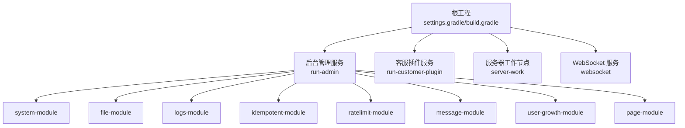
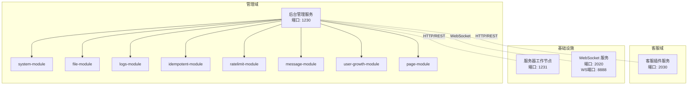
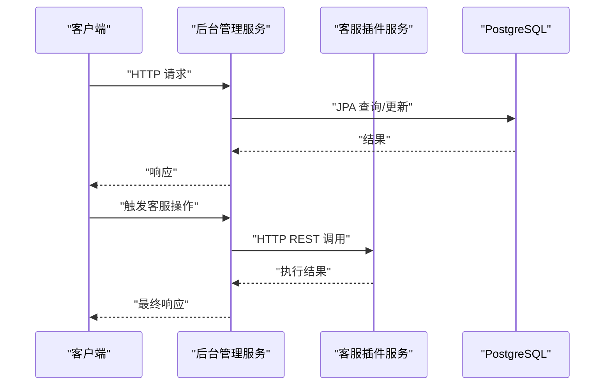
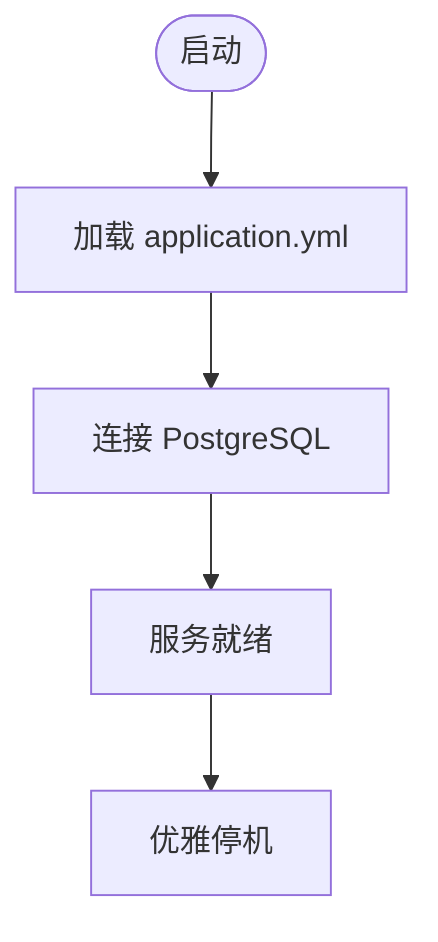
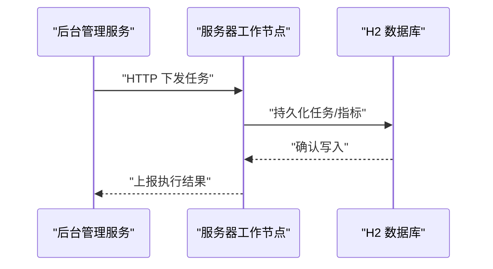
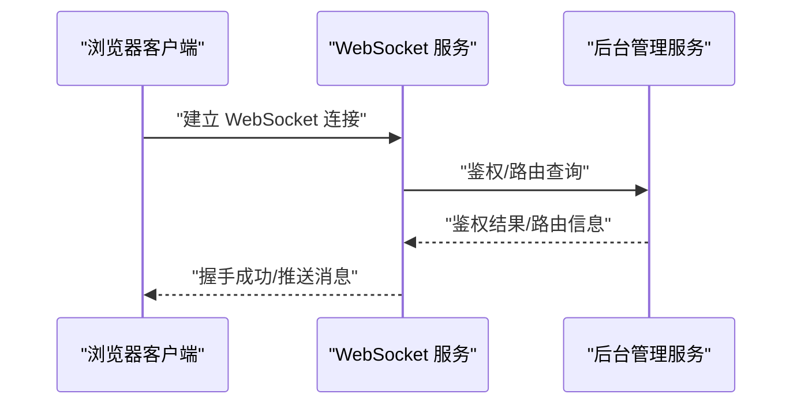
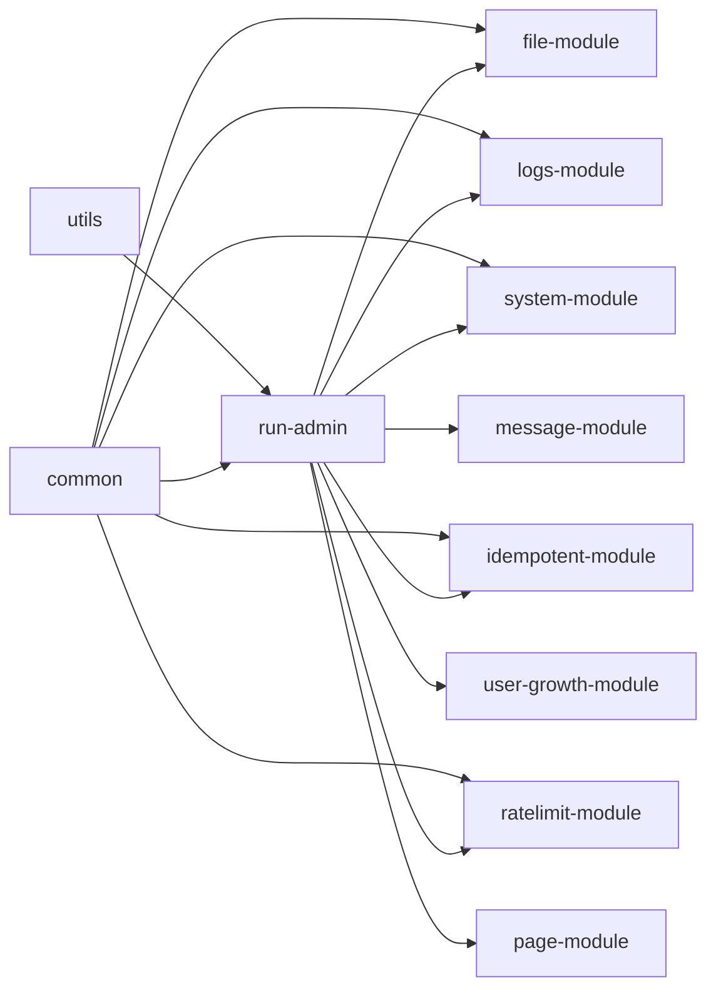

# 服务架构

<cite>
**本文引用的文件**
- [settings.gradle](file://settings.gradle)
- [build.gradle](file://build.gradle)
- [run-admin/src/main/java/com/fastproject/RunAdmin.java](file://run-admin/src/main/java/com/fastproject/RunAdmin.java)
- [run-admin/src/main/resources/application.yml](file://run-admin/src/main/resources/application.yml)
- [run-admin/src/main/resources/application-dev1.yml](file://run-admin/src/main/resources/application-dev1.yml)
- [run-admin/src/main/resources/application-dev2.yml](file://run-admin/src/main/resources/application-dev2.yml)
- [run-customer-plugin/src/main/java/com/fastproject/RunCustomer.java](file://run-customer-plugin/src/main/java/com/fastproject/RunCustomer.java)
- [run-customer-plugin/src/main/resources/application.yml](file://run-customer-plugin/src/main/resources/application.yml)
- [server-work/src/main/java/com/fastproject/RunServerWork.java](file://server-work/src/main/java/com/fastproject/RunServerWork.java)
- [server-work/src/main/resources/application.yml](file://server-work/src/main/resources/application.yml)
- [websocket/src/main/java/com/fastproject/WebSocketRun.java](file://websocket/src/main/java/com/fastproject/WebSocketRun.java)
- [websocket/src/main/resources/application.yml](file://websocket/src/main/resources/application.yml)
</cite>

## 目录
1. [引言](#引言)
2. [项目结构](#项目结构)
3. [核心组件](#核心组件)
4. [架构总览](#架构总览)
5. [详细组件分析](#详细组件分析)
6. [依赖关系分析](#依赖关系分析)
7. [性能考虑](#性能考虑)
8. [故障排查指南](#故障排查指南)
9. [结论](#结论)
10. [附录](#附录)

## 引言
本文件面向运维与开发人员，系统化梳理 Fast 项目的多服务架构，覆盖后台管理服务、客服插件服务、服务器工作节点与 WebSocket 服务的启动流程、配置管理、健康检查、服务间通信与数据同步策略，并给出服务发现、负载均衡与故障转移的落地建议，以及监控、日志与性能调优方法，帮助完成生产级部署与维护。

## 项目结构
- 采用 Gradle 多模块（multi-module）工程组织，根构建脚本统一版本与依赖管理，各业务域与基础能力拆分为独立子模块。
- 核心服务模块：
  - 后台管理服务：run-admin
  - 客服插件服务：run-customer-plugin
  - 服务器工作节点：server-work
  - WebSocket 服务：websocket
- 通用模块与能力模块：common、utils、file-*、logs-*、idempotent-*、ratelimit-*、system-module 等，被核心服务按需装配。

图表来源
- [settings.gradle](file://settings.gradle#L1-L24)
- [build.gradle](file://build.gradle#L92-L134)

章节来源
- [settings.gradle](file://settings.gradle#L1-L24)
- [build.gradle](file://build.gradle#L1-L457)

## 核心组件
- 后台管理服务（run-admin）
  - 职责：统一的管理与运营平台，集成安全认证、文件、日志、幂等、限流、消息、用户成长体系与页面配置等能力。
  - 启动入口：RunAdmin.main
  - 配置：application.yml 指定端口与激活 dev2；application-dev1/dev2 提供不同环境的数据库与 Redis 连接参数。
- 客服插件服务（run-customer-plugin）
  - 职责：面向客服侧的业务处理，独立数据库与 JPA 配置。
  - 启动入口：RunCustomer.main
  - 配置：application.yml 指定端口与 PostgreSQL 数据源。
- 服务器工作节点（server-work）
  - 职责：采集系统信息、提供本地 H2 控制台、支持定时任务与授权密钥生成辅助。
  - 启动入口：RunServerWork.main
  - 配置：application.yml 指定 H2 数据源与控制台访问路径。
- WebSocket 服务（websocket）
  - 职责：基于 Netty 的 WebSocket 服务端，提供握手路径与端口配置，内置 H2 控制台。
  - 启动入口：WebSocketRun.main
  - 配置：application.yml 指定 Netty WebSocket 参数与 H2 控制台。

章节来源
- [run-admin/src/main/java/com/fastproject/RunAdmin.java](file://run-admin/src/main/java/com/fastproject/RunAdmin.java#L1-L14)
- [run-admin/src/main/resources/application.yml](file://run-admin/src/main/resources/application.yml#L1-L5)
- [run-admin/src/main/resources/application-dev1.yml](file://run-admin/src/main/resources/application-dev1.yml#L1-L70)
- [run-admin/src/main/resources/application-dev2.yml](file://run-admin/src/main/resources/application-dev2.yml#L1-L71)
- [run-customer-plugin/src/main/java/com/fastproject/RunCustomer.java](file://run-customer-plugin/src/main/java/com/fastproject/RunCustomer.java#L1-L12)
- [run-customer-plugin/src/main/resources/application.yml](file://run-customer-plugin/src/main/resources/application.yml#L1-L26)
- [server-work/src/main/java/com/fastproject/RunServerWork.java](file://server-work/src/main/java/com/fastproject/RunServerWork.java#L1-L57)
- [server-work/src/main/resources/application.yml](file://server-work/src/main/resources/application.yml#L1-L16)
- [websocket/src/main/java/com/fastproject/WebSocketRun.java](file://websocket/src/main/java/com/fastproject/WebSocketRun.java#L1-L12)
- [websocket/src/main/resources/application.yml](file://websocket/src/main/resources/application.yml#L1-L28)

## 架构总览
- 服务边界清晰：每个服务独立进程，通过端口区分；后台管理服务聚合多能力模块；客服插件服务聚焦客服场景；服务器工作节点与 WebSocket 服务分别承担系统监控与实时通信职责。
- 配置分离：通过 Spring Profile 切换不同环境参数（如数据库、Redis），便于在不同环境快速切换。
- 健康检查：建议在各服务暴露 actuator 健康端点，结合外部探针进行存活/就绪检查。
- 通信协议：HTTP REST（后台管理、客服插件、服务器工作节点）与 WebSocket（实时双向通信）并存；跨服务调用建议使用 HTTP 或消息队列，避免直接耦合。

图表来源
- [run-admin/src/main/resources/application.yml](file://run-admin/src/main/resources/application.yml#L1-L5)
- [run-customer-plugin/src/main/resources/application.yml](file://run-customer-plugin/src/main/resources/application.yml#L1-L26)
- [server-work/src/main/resources/application.yml](file://server-work/src/main/resources/application.yml#L1-L16)
- [websocket/src/main/resources/application.yml](file://websocket/src/main/resources/application.yml#L1-L28)

## 详细组件分析

### 后台管理服务（run-admin）
- 启动流程
  - 通过 RunAdmin.main 启动 Spring Boot 应用，加载 application.yml 与激活的 profile（dev2）。
  - 自动装配：Web、Security、JPA、Caffeine、Redis 等依赖由 build.gradle 统一声明。
- 配置管理
  - 端口：1230
  - 数据源：PostgreSQL（dev1 指向公网地址，dev2 指向本地地址）
  - Redis：可配置主机、端口、密码、库号与连接池参数
  - 安全：Token 键名、过期时间、缓存键前缀等
- 健康检查
  - 建议启用 actuator，暴露 /actuator/health 以供探针检查
- 服务间通信
  - 与客服插件服务：HTTP REST 调用
  - 与服务器工作节点：HTTP REST 调用
  - 与 WebSocket 服务：HTTP REST 调用或通过网关转发
- 数据同步策略
  - 使用 JPA/Hibernate 同步数据库变更；Redis 作为缓存与会话存储
  - 对于跨服务一致性，建议引入事件驱动或幂等保障（已集成 idempotent-*）

图表来源
- [run-admin/src/main/resources/application.yml](file://run-admin/src/main/resources/application.yml#L1-L5)
- [run-admin/src/main/resources/application-dev1.yml](file://run-admin/src/main/resources/application-dev1.yml#L28-L32)
- [run-admin/src/main/resources/application-dev2.yml](file://run-admin/src/main/resources/application-dev2.yml#L29-L32)
- [run-customer-plugin/src/main/resources/application.yml](file://run-customer-plugin/src/main/resources/application.yml#L10-L15)

章节来源
- [run-admin/src/main/java/com/fastproject/RunAdmin.java](file://run-admin/src/main/java/com/fastproject/RunAdmin.java#L1-L14)
- [run-admin/src/main/resources/application.yml](file://run-admin/src/main/resources/application.yml#L1-L5)
- [run-admin/src/main/resources/application-dev1.yml](file://run-admin/src/main/resources/application-dev1.yml#L1-L70)
- [run-admin/src/main/resources/application-dev2.yml](file://run-admin/src/main/resources/application-dev2.yml#L1-L71)

### 客服插件服务（run-customer-plugin）
- 启动流程
  - RunCustomer.main 启动应用，加载 application.yml
- 配置管理
  - 端口：2030
  - 数据源：PostgreSQL（本地地址）
  - JPA：方言、DDL 策略、SQL 输出等
- 健康检查
  - 建议启用 actuator 健康端点
- 服务间通信
  - 主要通过后台管理服务进行编排与调度
- 数据同步策略
  - 本地数据库同步；与后台管理服务通过 REST 协议交互

图表来源
- [run-customer-plugin/src/main/resources/application.yml](file://run-customer-plugin/src/main/resources/application.yml#L1-L26)

章节来源
- [run-customer-plugin/src/main/java/com/fastproject/RunCustomer.java](file://run-customer-plugin/src/main/java/com/fastproject/RunCustomer.java#L1-L12)
- [run-customer-plugin/src/main/resources/application.yml](file://run-customer-plugin/src/main/resources/application.yml#L1-L26)

### 服务器工作节点（server-work）
- 启动流程
  - RunServerWork.main 启动应用，注册 SystemInfo Bean
  - 提供密钥生成辅助方法 key()，用于生成 SM2 公钥/私钥并落盘
- 配置管理
  - 端口：1231
  - 数据源：H2（文件型数据库），内置 H2 Console
- 健康检查
  - 建议启用 actuator 健康端点
- 服务间通信
  - 通过后台管理服务进行任务下发与状态上报
- 数据同步策略
  - 本地 H2 数据库；与后台管理服务通过 REST 协议同步任务与指标

图表来源
- [server-work/src/main/resources/application.yml](file://server-work/src/main/resources/application.yml#L1-L16)

章节来源
- [server-work/src/main/java/com/fastproject/RunServerWork.java](file://server-work/src/main/java/com/fastproject/RunServerWork.java#L1-L57)
- [server-work/src/main/resources/application.yml](file://server-work/src/main/resources/application.yml#L1-L16)

### WebSocket 服务（websocket）
- 启动流程
  - WebSocketRun.main 启动应用
- 配置管理
  - Netty WebSocket：端口与握手路径
  - H2 控制台：内置控制台访问路径
- 健康检查
  - 建议启用 actuator 健康端点
- 服务间通信
  - 通过后台管理服务进行路由与鉴权
- 数据同步策略
  - 本地 H2 存储会话与路由元数据；与后台管理服务通过 REST 协议同步配置

图表来源
- [websocket/src/main/resources/application.yml](file://websocket/src/main/resources/application.yml#L1-L28)

章节来源
- [websocket/src/main/java/com/fastproject/WebSocketRun.java](file://websocket/src/main/java/com/fastproject/WebSocketRun.java#L1-L12)
- [websocket/src/main/resources/application.yml](file://websocket/src/main/resources/application.yml#L1-L28)

## 依赖关系分析
- 模块依赖
  - run-admin 依赖 system-module、file-module、logs-module、idempotent-module、ratelimit-module、message-module、user-growth-module、page-module 等
  - 公共依赖集中在 common 与 utils，统一版本由根构建脚本管理
- 外部依赖
  - Web：Spring Boot Starter Web
  - 安全：Spring Security
  - 数据库：PostgreSQL（运行时可选）、H2（本地）
  - 缓存：Redis（Jedis）
  - 定时与异步：Spring Scheduling/Async
  - WebSocket：Netty
  - 日志与工具：SLF4J、BC、MapStruct、Jackson 等

图表来源
- [build.gradle](file://build.gradle#L92-L134)
- [build.gradle](file://build.gradle#L329-L345)
- [build.gradle](file://build.gradle#L383-L402)
- [build.gradle](file://build.gradle#L348-L365)
- [build.gradle](file://build.gradle#L165-L188)
- [build.gradle](file://build.gradle#L202-L229)
- [build.gradle](file://build.gradle#L245-L273)

章节来源
- [build.gradle](file://build.gradle#L1-L457)

## 性能考虑
- 线程模型
  - 开启虚拟线程开关，提升高并发下的吞吐与资源利用率
- 连接池与缓存
  - Redis 连接池参数可按 QPS 调整最大空闲与最小空闲
  - Caffeine 本地缓存命中率优化
- 数据库
  - PostgreSQL 与 H2 的 DDL 策略与 SQL 输出按环境调整，生产建议关闭 show-sql
- WebSocket
  - 合理设置 Netty 参数与背压策略，避免内存压力
- 定时任务
  - 服务器工作节点启用定时任务，注意任务粒度与锁策略

## 故障排查指南
- 启动失败
  - 检查端口占用与配置文件加载（application.yml 与 profile）
  - 查看日志级别与输出位置
- 数据库连接异常
  - 核对 datasource.url、username、password 与驱动类名
  - 确认目标数据库可达性与网络策略
- Redis 连接异常
  - 核对 host、port、password、database、timeout 与连接池参数
- WebSocket 握手失败
  - 核对 netty.websocket.port 与 path
  - 检查防火墙与代理配置
- 健康检查
  - 在各服务启用 actuator，访问 /actuator/health 观察状态

章节来源
- [run-admin/src/main/resources/application.yml](file://run-admin/src/main/resources/application.yml#L1-L5)
- [run-admin/src/main/resources/application-dev1.yml](file://run-admin/src/main/resources/application-dev1.yml#L28-L32)
- [run-admin/src/main/resources/application-dev2.yml](file://run-admin/src/main/resources/application-dev2.yml#L29-L32)
- [run-customer-plugin/src/main/resources/application.yml](file://run-customer-plugin/src/main/resources/application.yml#L10-L15)
- [server-work/src/main/resources/application.yml](file://server-work/src/main/resources/application.yml#L1-L16)
- [websocket/src/main/resources/application.yml](file://websocket/src/main/resources/application.yml#L1-L28)

## 结论
Fast 项目通过多模块与多服务架构实现了清晰的能力解耦与职责划分。后台管理服务作为中枢，整合文件、日志、幂等、限流、消息与用户成长等能力；客服插件服务、服务器工作节点与 WebSocket 服务分别承担业务侧、系统侧与实时通信侧的职责。建议在生产环境中完善服务发现、负载均衡与故障转移策略，并强化监控、日志与性能调优，确保系统的稳定性与可运维性。

## 附录

### 服务发现、负载均衡与故障转移（建议方案）
- 服务发现
  - 使用注册中心（如 Nacos/Eureka/Nacos）注册服务实例，动态拉取服务列表
- 负载均衡
  - 客户端侧负载均衡（Ribbon/RestTemplate）或网关侧负载均衡（Spring Cloud Gateway/Ingress）
- 故障转移
  - 配置超时与重试策略；对关键链路启用熔断（Resilience4j/Hystrix）
  - 健康检查与灰度发布配合，降低故障影响面

### 监控、日志与性能调优
- 监控
  - 指标：Prometheus + Grafana；Micrometer 暴露 JVM/业务指标
  - 链路追踪：OpenTelemetry/SkyWalking
- 日志
  - 结构化日志（JSON）+ ELK/Fluentd/Graylog
  - 关键路径埋点与慢查询分析
- 性能调优
  - 线程池与连接池参数调优
  - SQL 与缓存命中率优化
  - GC 与堆外内存监控