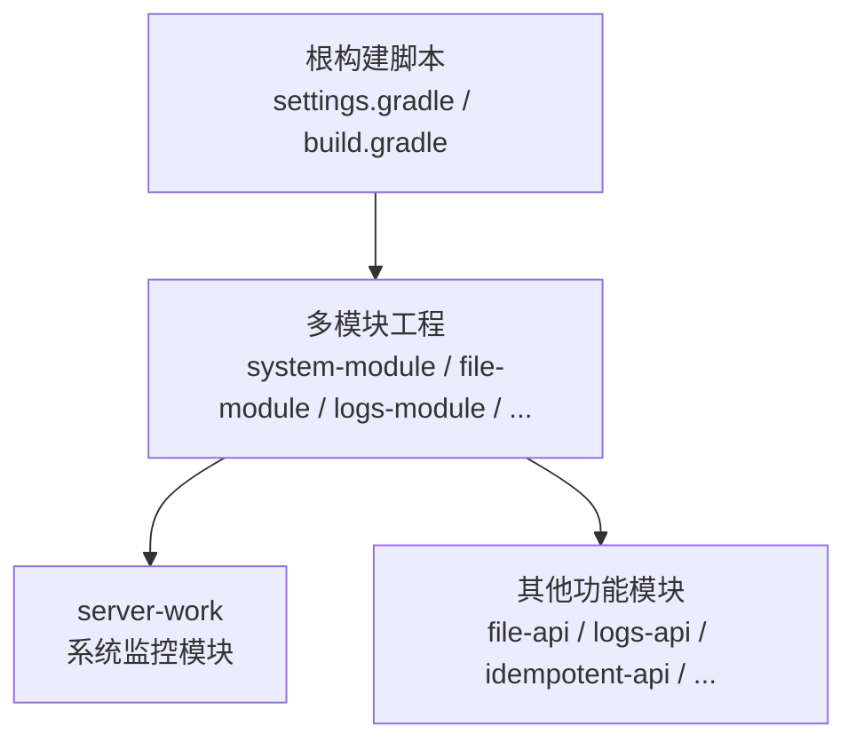
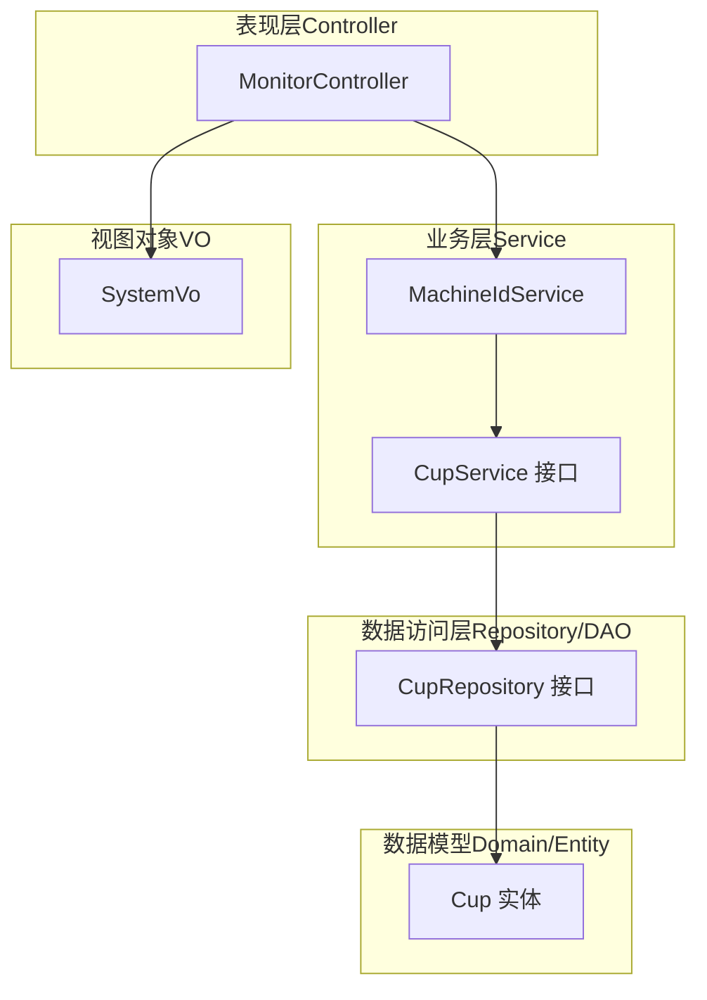
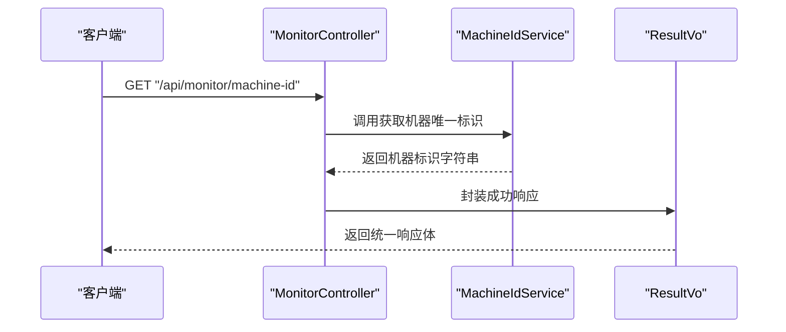
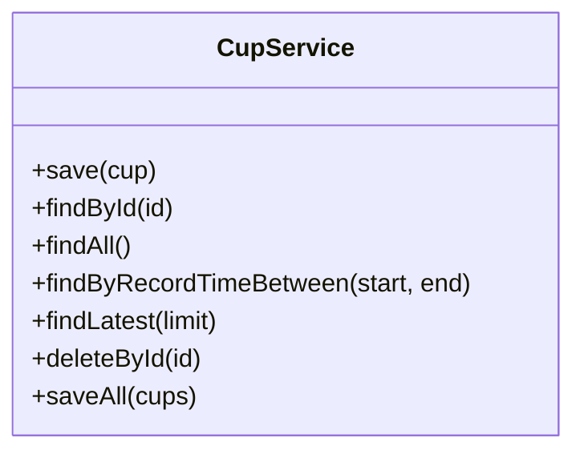
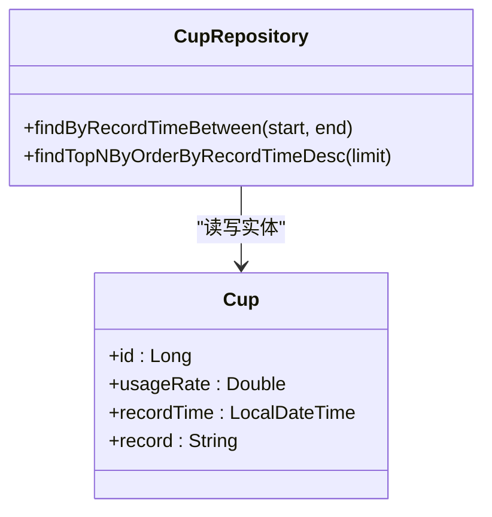
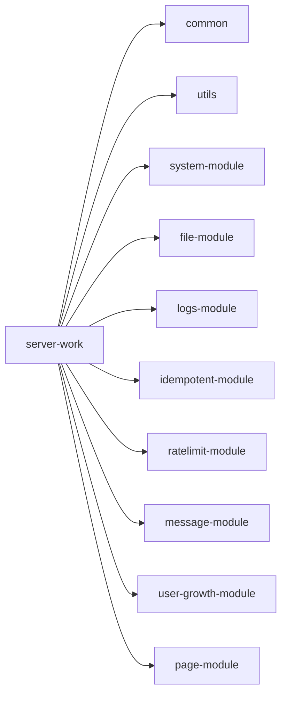

# 分层架构

<cite>
**本文引用的文件**
- [settings.gradle](file://settings.gradle)
- [build.gradle](file://build.gradle)
- [server-work/build.gradle](file://server-work/build.gradle)
- [server-work/src/main/java/com/fastproject/controller/MonitorController.java](file://server-work/src/main/java/com/fastproject/controller/MonitorController.java)
- [server-work/src/main/java/com/fastproject/service/CupService.java](file://server-work/src/main/java/com/fastproject/service/CupService.java)
- [server-work/src/main/java/com/fastproject/repository/CupRepository.java](file://server-work/src/main/java/com/fastproject/repository/CupRepository.java)
- [server-work/src/main/java/com/fastproject/domain/Cup.java](file://server-work/src/main/java/com/fastproject/domain/Cup.java)
- [server-work/src/main/java/com/fastproject/vo/SystemVo.java](file://server-work/src/main/java/com/fastproject/vo/SystemVo.java)
</cite>

## 目录
1. [引言](#引言)
2. [项目结构](#项目结构)
3. [核心组件](#核心组件)
4. [架构总览](#架构总览)
5. [详细组件分析](#详细组件分析)
6. [依赖分析](#依赖分析)
7. [性能考虑](#性能考虑)
8. [故障排查指南](#故障排查指南)
9. [结论](#结论)
10. [附录](#附录)

## 引言
本文件面向Fast项目的分层架构设计，聚焦经典的三层架构：表现层（Controller）、业务层（Service）、数据访问层（Repository/DAO）。我们将从职责与边界、层间调用关系与数据传递机制入手，结合系统监控模块中的典型业务流程，说明RESTful API设计、业务逻辑封装与数据访问抽象如何协同工作，并总结分层架构在关注点分离、可测试性与可维护性方面的优势。最后给出最佳实践与常见问题的解决方案。

## 项目结构
Fast项目采用多模块Gradle工程组织，根构建脚本统一管理版本与依赖策略，子模块按功能域拆分，如系统模块、文件模块、日志模块、幂等模块、限流模块、消息模块、用户成长模块、页面模块、WebSocket模块、服务工作节点模块等。系统监控模块位于server-work，是本次分层架构分析的载体。

- 根级构建脚本定义了模块清单与公共依赖策略，确保各子模块的一致性与可复用性。
- 子模块各自声明对common/utils等库模块的依赖，形成“通用能力下沉、领域能力上浮”的结构。

图表来源
- [settings.gradle](file://settings.gradle#L1-L24)
- [build.gradle](file://build.gradle#L1-L457)

章节来源
- [settings.gradle](file://settings.gradle#L1-L24)
- [build.gradle](file://build.gradle#L1-L457)

## 核心组件
本节聚焦server-work模块中体现分层架构的三个核心构件：控制器、服务与仓库，以及它们之间的协作关系。

- 表现层（Controller）
  - 责任：暴露RESTful接口，接收请求参数，封装响应结果，协调服务层完成业务处理。
  - 示例：系统监控控制器对外提供获取机器唯一标识的接口。
- 业务层（Service）
  - 责任：封装业务规则与流程编排，调用仓库进行数据持久化或查询，保证事务与一致性。
  - 示例：CPU相关服务接口定义了保存、查询、批量保存等能力。
- 数据访问层（Repository/DAO）
  - 责任：抽象数据读写操作，基于Spring Data JPA简化CRUD与条件查询。
  - 示例：CPU仓库接口继承JpaRepository与JpaSpecificationExecutor，提供按时间范围与最新记录查询。

章节来源
- [server-work/src/main/java/com/fastproject/controller/MonitorController.java](file://server-work/src/main/java/com/fastproject/controller/MonitorController.java#L1-L35)
- [server-work/src/main/java/com/fastproject/service/CupService.java](file://server-work/src/main/java/com/fastproject/service/CupService.java#L1-L46)
- [server-work/src/main/java/com/fastproject/repository/CupRepository.java](file://server-work/src/main/java/com/fastproject/repository/CupRepository.java#L1-L24)

## 架构总览
下图展示了系统监控模块的分层架构与交互关系：控制器负责HTTP请求入口，服务层承载业务逻辑，仓库层负责数据持久化，实体模型映射数据库表结构。

图表来源
- [server-work/src/main/java/com/fastproject/controller/MonitorController.java](file://server-work/src/main/java/com/fastproject/controller/MonitorController.java#L1-L35)
- [server-work/src/main/java/com/fastproject/service/CupService.java](file://server-work/src/main/java/com/fastproject/service/CupService.java#L1-L46)
- [server-work/src/main/java/com/fastproject/repository/CupRepository.java](file://server-work/src/main/java/com/fastproject/repository/CupRepository.java#L1-L24)
- [server-work/src/main/java/com/fastproject/domain/Cup.java](file://server-work/src/main/java/com/fastproject/domain/Cup.java#L1-L37)
- [server-work/src/main/java/com/fastproject/vo/SystemVo.java](file://server-work/src/main/java/com/fastproject/vo/SystemVo.java#L1-L91)

## 详细组件分析

### 控制器层（Controller）
- 设计要点
  - 使用@RestController统一返回包装对象，便于前端统一处理。
  - 使用@RequestMapping定义资源路径前缀，GET等HTTP方法映射具体业务动作。
  - 通过构造函数注入服务实例，降低耦合并提升可测试性。
- 典型流程
  - 客户端请求“获取机器唯一标识”接口。
  - 控制器调用服务层方法，服务层执行业务逻辑后返回结果。
  - 控制器将结果封装为统一响应对象返回给客户端。

图表来源
- [server-work/src/main/java/com/fastproject/controller/MonitorController.java](file://server-work/src/main/java/com/fastproject/controller/MonitorController.java#L1-L35)

章节来源
- [server-work/src/main/java/com/fastproject/controller/MonitorController.java](file://server-work/src/main/java/com/fastproject/controller/MonitorController.java#L1-L35)

### 业务层（Service）
- 设计要点
  - 以接口定义业务能力，实现类承担具体流程编排与规则校验。
  - 通过依赖注入与构造函数注入，确保服务无状态且易于替换。
  - 在需要时组合多个仓库或跨模块服务，保持业务语义清晰。
- 典型流程
  - 控制器调用服务接口。
  - 服务根据业务规则决定是否需要访问仓库或外部能力。
  - 服务返回聚合后的业务结果给控制器。

图表来源
- [server-work/src/main/java/com/fastproject/service/CupService.java](file://server-work/src/main/java/com/fastproject/service/CupService.java#L1-L46)

章节来源
- [server-work/src/main/java/com/fastproject/service/CupService.java](file://server-work/src/main/java/com/fastproject/service/CupService.java#L1-L46)

### 数据访问层（Repository/DAO）
- 设计要点
  - 继承JpaRepository与JpaSpecificationExecutor，获得标准CRUD与复杂查询能力。
  - 自定义方法签名遵循Spring Data JPA命名规范，减少SQL编写成本。
  - 与实体类一一对应，实体注解映射数据库表结构，字段映射列。
- 典型流程
  - 服务层调用仓库接口执行查询或持久化。
  - 仓库通过JPA模板完成数据库交互，返回实体集合或单个实体。

图表来源
- [server-work/src/main/java/com/fastproject/repository/CupRepository.java](file://server-work/src/main/java/com/fastproject/repository/CupRepository.java#L1-L24)
- [server-work/src/main/java/com/fastproject/domain/Cup.java](file://server-work/src/main/java/com/fastproject/domain/Cup.java#L1-L37)

章节来源
- [server-work/src/main/java/com/fastproject/repository/CupRepository.java](file://server-work/src/main/java/com/fastproject/repository/CupRepository.java#L1-L24)
- [server-work/src/main/java/com/fastproject/domain/Cup.java](file://server-work/src/main/java/com/fastproject/domain/Cup.java#L1-L37)

### 视图对象（VO）
- 设计要点
  - VO用于封装对外传输的数据结构，避免直接暴露领域模型细节。
  - 结构清晰，包含系统、CPU、内存、磁盘等维度信息，便于前端渲染。
- 典型用途
  - 控制器在组装响应时，将领域数据转换为VO，再由统一响应包装返回。

章节来源
- [server-work/src/main/java/com/fastproject/vo/SystemVo.java](file://server-work/src/main/java/com/fastproject/vo/SystemVo.java#L1-L91)

## 依赖分析
- 模块依赖
  - 根构建脚本集中声明模块清单，server-work作为独立运行模块，依赖common与utils等库模块。
  - 多模块工程通过子模块gradle脚本声明对公共模块与彼此的依赖，形成清晰的依赖边界。
- 层内依赖
  - 控制器依赖服务接口；服务依赖仓库接口；仓库依赖实体模型。
  - 通过接口隔离，降低耦合度，提升可替换性与可测试性。

图表来源
- [build.gradle](file://build.gradle#L92-L134)

章节来源
- [build.gradle](file://build.gradle#L1-L457)
- [server-work/build.gradle](file://server-work/build.gradle#L1-L6)

## 性能考虑
- 关注点分离带来的收益
  - 表现层专注协议与格式，业务层专注规则与流程，数据层专注持久化，三者职责明确，便于针对性优化。
- 可测试性
  - 通过接口注入，可在单元测试中使用Mock替换具体实现，快速验证业务逻辑。
- 可维护性
  - 层间边界清晰，变更影响面可控；新增或修改功能优先在服务层编排，降低对控制器与数据层的侵入。
- 数据访问优化建议
  - 对高频查询建立索引，合理使用分页与投影，避免N+1查询。
  - 利用仓库自定义查询与原生SQL优化复杂场景。
- 缓存与异步
  - 对热点数据引入缓存，对耗时任务采用异步处理，减轻同步链路压力。

## 故障排查指南
- 控制器层
  - 检查请求路径与HTTP方法是否匹配；确认服务注入是否成功；核对响应封装逻辑。
- 业务层
  - 核查业务前置校验与异常处理；确认事务边界与回滚策略；定位服务内部调用链。
- 数据访问层
  - 校验实体映射与字段类型；检查查询方法命名与参数顺序；确认数据库连接与事务配置。
- 统一响应与日志
  - 使用统一响应包装便于前后端调试；在关键节点输出日志，定位异常发生位置。

## 结论
Fast项目的分层架构通过清晰的职责划分与稳定的层间契约，实现了关注点分离、可测试性与可维护性的平衡。控制器层负责对外接口，业务层承载核心规则，数据访问层抽象持久化细节。结合统一响应与模块化工程组织，系统具备良好的扩展性与演进空间。建议在后续开发中持续坚持接口隔离、依赖倒置与单一职责原则，配合缓存与异步策略，进一步提升系统性能与稳定性。

## 附录
- 最佳实践
  - 严格按层划分职责，避免跨层调用。
  - 使用接口与依赖注入，增强可替换性与可测试性。
  - 统一异常处理与响应封装，提升可观测性。
  - 对高频路径进行性能压测与优化。
- 常见问题
  - 循环依赖：通过接口与依赖注入消除直接引用。
  - 事务失效：确保调用方与被调用方处于不同类实例，避免同类内调用。
  - 查询性能差：优化索引、分页与查询条件，必要时引入缓存。