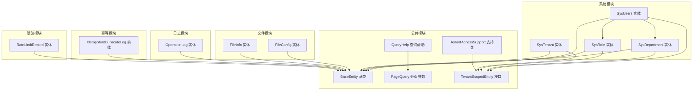
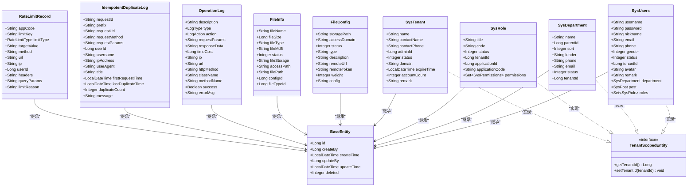
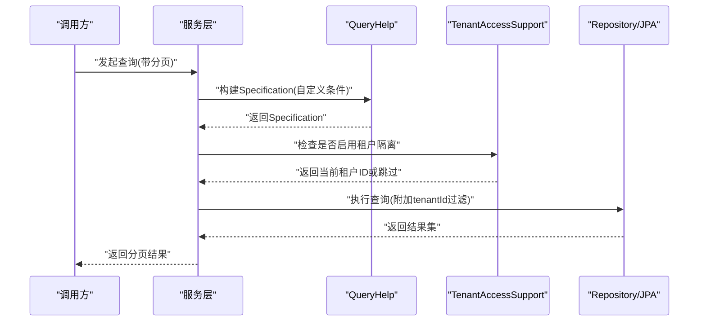
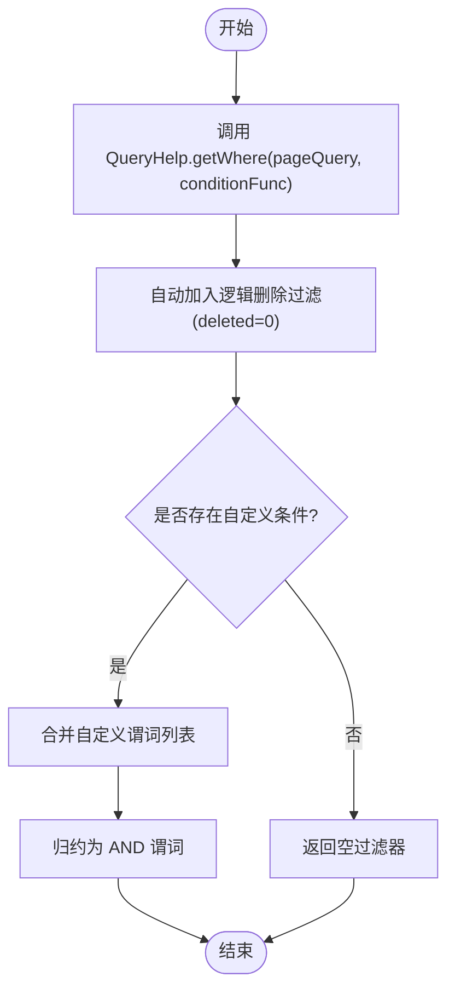
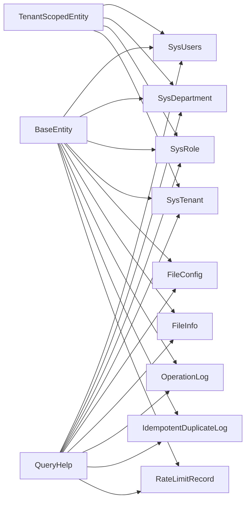

# 数据库设计

<cite>
**本文引用的文件**
- [SysUsers.java](file://system-module/src/main/java/com/ fastproject/system/domain/SysUsers.java)
- [SysDepartment.java](file://system-module/src/main/java/com/ fastproject/system/domain/SysDepartment.java)
- [SysRole.java](file://system-module/src/main/java/com/ fastproject/system/domain/SysRole.java)
- [SysTenant.java](file://system-module/src/main/java/com/ fastproject/system/domain/SysTenant.java)
- [FileConfig.java](file://file-module/src/main/java/com/ fastproject/file/domain/FileConfig.java)
- [FileInfo.java](file://file-module/src/main/java/com/ fastproject/file/domain/FileInfo.java)
- [OperationLog.java](file://logs-module/src/main/java/com/ fastproject/logs/domain/OperationLog.java)
- [IdempotentDuplicateLog.java](file://idempotent-module/src/main/java/com/ fastproject/idempotent/domain/IdempotentDuplicateLog.java)
- [RateLimitRecord.java](file://ratelimit-module/src/main/java/com/ fastproject/ratelimit/domain/RateLimitRecord.java)
- [BaseEntity.java](file://common/src/main/java/com/ fastproject/db/BaseEntity.java)
- [QueryHelp.java](file://common/src/main/java/com/ fastproject/db/QueryHelp.java)
- [PageQuery.java](file://common/src/main/java/com/ fastproject/db/PageQuery.java)
- [TenantScopedEntity.java](file://system-module/src/main/java/com/ fastproject/system/tenant/TenantScopedEntity.java)
- [TenantAccessSupport.java](file://system-module/src/main/java/com/ fastproject/system/tenant/TenantAccessSupport.java)
</cite>

## 目录
1. 引言
2. 项目结构
3. 核心组件
4. 架构总览
5. 详细组件分析
6. 依赖分析
7. 性能考虑
8. 故障排查指南
9. 结论
10. 附录

## 引言
本文件面向数据库设计与实现，围绕 Fast 项目的数据库表结构进行系统化梳理，重点覆盖以下主题：
- 用户管理表：SysUsers、SysDepartment、SysRole 的表结构、实体关系映射、主外键约束与索引设计建议
- 文件管理表：FileConfig、FileInfo 的字段设计与关联关系
- 日志表：OperationLog 的字段与用途
- 幂等性表：IdempotentDuplicateLog 的设计目标与字段说明
- 限流表：RateLimitRecord 的字段与用途
- 多租户数据隔离：TenantScopedEntity 接口与 TenantAccessSupport 的实现机制
- 查询帮助类：QueryHelp 的使用方法与动态查询生成机制
- 性能优化策略、分区策略与备份恢复方案

## 项目结构
本项目采用模块化组织，数据库相关实体主要分布在 system-module、file-module、logs-module、idempotent-module、ratelimit-module 以及公共模块 common 中。各模块通过 JPA 实体与基础类 BaseEntity 组织，统一继承逻辑删除与审计字段。

图示来源
- [SysUsers.java](file://system-module/src/main/java/com/ fastproject/system/domain/SysUsers.java#L15-L94)
- [SysDepartment.java](file://system-module/src/main/java/com/ fastproject/system/domain/SysDepartment.java#L12-L59)
- [SysRole.java](file://system-module/src/main/java/com/ fastproject/system/domain/SysRole.java#L14-L58)
- [SysTenant.java](file://system-module/src/main/java/com/ fastproject/system/domain/SysTenant.java#L16-L68)
- [FileConfig.java](file://file-module/src/main/java/com/ fastproject/file/domain/FileConfig.java#L12-L65)
- [FileInfo.java](file://file-module/src/main/java/com/ fastproject/file/domain/FileInfo.java#L12-L78)
- [OperationLog.java](file://logs-module/src/main/java/com/ fastproject/logs/domain/OperationLog.java#L15-L93)
- [IdempotentDuplicateLog.java](file://idempotent-module/src/main/java/com/ fastproject/idempotent/domain/IdempotentDuplicateLog.java#L18-L97)
- [RateLimitRecord.java](file://ratelimit-module/src/main/java/com/ fastproject/ratelimit/domain/RateLimitRecord.java#L16-L84)
- [BaseEntity.java](file://common/src/main/java/com/ fastproject/db/BaseEntity.java#L14-L47)
- [QueryHelp.java](file://common/src/main/java/com/ fastproject/db/QueryHelp.java#L18-L44)
- [PageQuery.java](file://common/src/main/java/com/ fastproject/db/PageQuery.java#L6-L15)
- [TenantScopedEntity.java](file://system-module/src/main/java/com/ fastproject/system/tenant/TenantScopedEntity.java#L6-L11)
- [TenantAccessSupport.java](file://system-module/src/main/java/com/ fastproject/system/tenant/TenantAccessSupport.java#L21-L105)

章节来源
- [SysUsers.java](file://system-module/src/main/java/com/ fastproject/system/domain/SysUsers.java#L15-L94)
- [SysDepartment.java](file://system-module/src/main/java/com/ fastproject/system/domain/SysDepartment.java#L12-L59)
- [SysRole.java](file://system-module/src/main/java/com/ fastproject/system/domain/SysRole.java#L14-L58)
- [SysTenant.java](file://system-module/src/main/java/com/ fastproject/system/domain/SysTenant.java#L16-L68)
- [FileConfig.java](file://file-module/src/main/java/com/ fastproject/file/domain/FileConfig.java#L12-L65)
- [FileInfo.java](file://file-module/src/main/java/com/ fastproject/file/domain/FileInfo.java#L12-L78)
- [OperationLog.java](file://logs-module/src/main/java/com/ fastproject/logs/domain/OperationLog.java#L15-L93)
- [IdempotentDuplicateLog.java](file://idempotent-module/src/main/java/com/ fastproject/idempotent/domain/IdempotentDuplicateLog.java#L18-L97)
- [RateLimitRecord.java](file://ratelimit-module/src/main/java/com/ fastproject/ratelimit/domain/RateLimitRecord.java#L16-L84)
- [BaseEntity.java](file://common/src/main/java/com/ fastproject/db/BaseEntity.java#L14-L47)
- [QueryHelp.java](file://common/src/main/java/com/ fastproject/db/QueryHelp.java#L18-L44)
- [PageQuery.java](file://common/src/main/java/com/ fastproject/db/PageQuery.java#L6-L15)
- [TenantScopedEntity.java](file://system-module/src/main/java/com/ fastproject/system/tenant/TenantScopedEntity.java#L6-L11)
- [TenantAccessSupport.java](file://system-module/src/main/java/com/ fastproject/system/tenant/TenantAccessSupport.java#L21-L105)

## 核心组件
本节对核心实体进行逐项说明，涵盖字段语义、关系映射、逻辑删除与审计字段，并给出索引与约束设计建议。

- 用户管理表
  - SysUsers：用户基本信息、部门与岗位的多对一关系、角色的多对多关系；支持逻辑删除与租户隔离
  - SysDepartment：部门信息，含父级部门、排序、负责人、联系方式、状态与租户ID
  - SysRole：角色信息，含角色代码、状态、应用标识与权限的多对多关系；支持逻辑删除与租户隔离
  - SysTenant：租户信息，含联系人、管理员ID、域名、过期时间、配额与备注

- 文件管理表
  - FileConfig：文件存储配置，含存储路径、访问域名、类型、权重、远程凭证与配置参数
  - FileInfo：文件元信息，含文件名、大小、类型、MD5、状态、存储位置、访问路径、物理路径与配置/类型关联

- 日志表
  - OperationLog：操作日志，含描述、类型、动作、请求/响应参数、耗时、IP、URL、HTTP方法、类/方法名、成功标志与错误信息

- 幂等性表
  - IdempotentDuplicateLog：记录重复请求的关键信息，含请求ID、前缀、URL、方法、参数、用户信息、IP、UA、标题、首次与最后重复时间、重复次数与提示消息

- 限流表
  - RateLimitRecord：限流记录，含应用编码、限流Key、类型、目标值、方法、URL、IP、用户ID、请求头、查询参数与触发原因

章节来源
- [SysUsers.java](file://system-module/src/main/java/com/ fastproject/system/domain/SysUsers.java#L15-L94)
- [SysDepartment.java](file://system-module/src/main/java/com/ fastproject/system/domain/SysDepartment.java#L12-L59)
- [SysRole.java](file://system-module/src/main/java/com/ fastproject/system/domain/SysRole.java#L14-L58)
- [SysTenant.java](file://system-module/src/main/java/com/ fastproject/system/domain/SysTenant.java#L16-L68)
- [FileConfig.java](file://file-module/src/main/java/com/ fastproject/file/domain/FileConfig.java#L12-L65)
- [FileInfo.java](file://file-module/src/main/java/com/ fastproject/file/domain/FileInfo.java#L12-L78)
- [OperationLog.java](file://logs-module/src/main/java/com/ fastproject/logs/domain/OperationLog.java#L15-L93)
- [IdempotentDuplicateLog.java](file://idempotent-module/src/main/java/com/ fastproject/idempotent/domain/IdempotentDuplicateLog.java#L18-L97)
- [RateLimitRecord.java](file://ratelimit-module/src/main/java/com/ fastproject/ratelimit/domain/RateLimitRecord.java#L16-L84)

## 架构总览
下图展示实体间的关系与继承体系，突出 BaseEntity 的统一审计与逻辑删除能力，以及多租户实体的隔离标记。

图示来源
- [BaseEntity.java](file://common/src/main/java/com/ fastproject/db/BaseEntity.java#L14-L47)
- [TenantScopedEntity.java](file://system-module/src/main/java/com/ fastproject/system/tenant/TenantScopedEntity.java#L6-L11)
- [SysUsers.java](file://system-module/src/main/java/com/ fastproject/system/domain/SysUsers.java#L15-L94)
- [SysDepartment.java](file://system-module/src/main/java/com/ fastproject/system/domain/SysDepartment.java#L12-L59)
- [SysRole.java](file://system-module/src/main/java/com/ fastproject/system/domain/SysRole.java#L14-L58)
- [SysTenant.java](file://system-module/src/main/java/com/ fastproject/system/domain/SysTenant.java#L16-L68)
- [FileConfig.java](file://file-module/src/main/java/com/ fastproject/file/domain/FileConfig.java#L12-L65)
- [FileInfo.java](file://file-module/src/main/java/com/ fastproject/file/domain/FileInfo.java#L12-L78)
- [OperationLog.java](file://logs-module/src/main/java/com/ fastproject/logs/domain/OperationLog.java#L15-L93)
- [IdempotentDuplicateLog.java](file://idempotent-module/src/main/java/com/ fastproject/idempotent/domain/IdempotentDuplicateLog.java#L18-L97)
- [RateLimitRecord.java](file://ratelimit-module/src/main/java/com/ fastproject/ratelimit/domain/RateLimitRecord.java#L16-L84)

## 详细组件分析

### 用户管理表设计
- SysUsers
  - 关系映射：与 SysDepartment（多对一）、SysPost（多对一）、SysRole（多对多）关联
  - 字段要点：用户名、密码、昵称、邮箱、电话、性别、状态、租户ID、头像、部门与岗位、角色集合
  - 约束与索引建议：tenantId 建索引；username 建唯一索引；email/phone 建普通索引；逻辑删除 deleted=0
  - 审计与逻辑删除：继承 BaseEntity，使用 SQL 删除与 SQL 限制实现软删

- SysDepartment
  - 字段要点：名称、父级部门ID、排序、负责人、电话、邮箱、状态、租户ID
  - 约束与索引建议：parentId 建索引；name 建普通索引；tenantId 建索引；逻辑删除 deleted=0

- SysRole
  - 字段要点：标题、角色代码、状态、租户ID、应用ID与应用代码、权限集合
  - 约束与索引建议：code 建唯一索引；tenantId 建索引；逻辑删除 deleted=0

- SysTenant
  - 字段要点：名称、联系人、联系电话、管理员ID、状态、域名、过期时间、账号额度、备注
  - 约束与索引建议：domain 建唯一索引；adminId 建索引；逻辑删除 deleted=0

章节来源
- [SysUsers.java](file://system-module/src/main/java/com/ fastproject/system/domain/SysUsers.java#L15-L94)
- [SysDepartment.java](file://system-module/src/main/java/com/ fastproject/system/domain/SysDepartment.java#L12-L59)
- [SysRole.java](file://system-module/src/main/java/com/ fastproject/system/domain/SysRole.java#L14-L58)
- [SysTenant.java](file://system-module/src/main/java/com/ fastproject/system/domain/SysTenant.java#L16-L68)
- [BaseEntity.java](file://common/src/main/java/com/ fastproject/db/BaseEntity.java#L14-L47)

### 文件管理表设计
- FileConfig
  - 字段要点：存储路径、访问域名、状态、类型、描述、远程URL、远程令牌、权重、配置参数
  - 约束与索引建议：type 建普通索引；status 建普通索引；逻辑删除 deleted=0

- FileInfo
  - 字段要点：文件名、大小、类型、MD5、状态、存储位置、访问路径、物理路径、配置ID、类型ID
  - 约束与索引建议：fileMd5 建唯一索引；configId、fileTypeId 建普通索引；逻辑删除 deleted=0

章节来源
- [FileConfig.java](file://file-module/src/main/java/com/ fastproject/file/domain/FileConfig.java#L12-L65)
- [FileInfo.java](file://file-module/src/main/java/com/ fastproject/file/domain/FileInfo.java#L12-L78)
- [BaseEntity.java](file://common/src/main/java/com/ fastproject/db/BaseEntity.java#L14-L47)

### 日志表设计
- OperationLog
  - 字段要点：描述、类型、动作、请求/响应参数、耗时、IP、URL、HTTP方法、类/方法名、成功标志、错误信息
  - 约束与索引建议：type、action 建普通索引；success 建普通索引；url、httpMethod 建普通索引；timeCost 建普通索引；逻辑删除 deleted=0

章节来源
- [OperationLog.java](file://logs-module/src/main/java/com/ fastproject/logs/domain/OperationLog.java#L15-L93)
- [BaseEntity.java](file://common/src/main/java/com/ fastproject/db/BaseEntity.java#L14-L47)

### 幂等性表设计
- IdempotentDuplicateLog
  - 字段要点：请求ID、前缀、URL、方法、参数、用户信息、IP、UA、标题、首次与最后重复时间、重复次数、提示消息
  - 约束与索引建议：requestId 建唯一索引；prefix、requestUrl、requestMethod 建普通索引；userId 建索引；逻辑删除 deleted=0

章节来源
- [IdempotentDuplicateLog.java](file://idempotent-module/src/main/java/com/ fastproject/idempotent/domain/IdempotentDuplicateLog.java#L18-L97)
- [BaseEntity.java](file://common/src/main/java/com/ fastproject/db/BaseEntity.java#L14-L47)

### 限流表设计
- RateLimitRecord
  - 字段要点：应用编码、限流Key、类型、目标值、方法、URL、IP、用户ID、请求头、查询参数、触发原因
  - 约束与索引建议：limitKey、limitType、targetValue 建普通索引；userId、ip 建索引；url 建普通索引；逻辑删除 deleted=0

章节来源
- [RateLimitRecord.java](file://ratelimit-module/src/main/java/com/ fastproject/ratelimit/domain/RateLimitRecord.java#L16-L84)
- [BaseEntity.java](file://common/src/main/java/com/ fastproject/db/BaseEntity.java#L14-L47)

### 多租户数据隔离机制
- TenantScopedEntity 接口：为需要按租户隔离的实体提供统一的租户ID存取约定
- TenantAccessSupport 支持类：
  - 读取当前用户上下文中的租户ID
  - 在查询中动态添加 tenantId 过滤条件
  - 在保存实体时自动绑定当前租户ID
  - 校验实体是否属于当前租户，防止越权访问
  - 提供租户功能开关与超级管理员豁免逻辑

图示来源
- [QueryHelp.java](file://common/src/main/java/com/ fastproject/db/QueryHelp.java#L25-L42)
- [TenantAccessSupport.java](file://system-module/src/main/java/com/ fastproject/system/tenant/TenantAccessSupport.java#L66-L78)

章节来源
- [TenantScopedEntity.java](file://system-module/src/main/java/com/ fastproject/system/tenant/TenantScopedEntity.java#L6-L11)
- [TenantAccessSupport.java](file://system-module/src/main/java/com/ fastproject/system/tenant/TenantAccessSupport.java#L21-L105)

### 查询帮助类 QueryHelp 使用方法
- 功能概述：基于 Spring Data JPA 的 Specification，封装通用分页参数与自定义条件拼装，自动处理逻辑删除过滤
- 典型流程：
  - 传入 PageQuery 与自定义条件函数 BiFunction<Root<T>, CriteriaBuilder, List<Predicate>>
  - 返回 Specification<T>，在 Repository 中直接使用
  - 自动追加逻辑删除过滤（deleted=0），避免显式写死
- 使用建议：
  - 将所有查询入口统一通过 QueryHelp 生成 Specification
  - 自定义条件函数内使用 cb.and(cb.or(...)) 组合复杂条件
  - 对高频过滤字段建立索引以提升查询性能

图示来源
- [QueryHelp.java](file://common/src/main/java/com/ fastproject/db/QueryHelp.java#L25-L42)
- [PageQuery.java](file://common/src/main/java/com/ fastproject/db/PageQuery.java#L6-L15)

章节来源
- [QueryHelp.java](file://common/src/main/java/com/ fastproject/db/QueryHelp.java#L18-L44)
- [PageQuery.java](file://common/src/main/java/com/ fastproject/db/PageQuery.java#L6-L15)

## 依赖分析
- 继承关系：所有业务实体均继承 BaseEntity，统一具备审计字段与逻辑删除能力
- 多租户接口：SysUsers、SysDepartment、SysRole、SysTenant 实现 TenantScopedEntity，确保租户隔离
- 查询依赖：各模块 Service 层通过 QueryHelp 统一生成 Specification，TenantAccessSupport 在查询中注入租户过滤
- 关系映射：SysUsers 与部门/岗位/角色存在多对一/多对多关系；文件模块中 FileInfo 与 FileConfig 存在一对多关系

图示来源
- [BaseEntity.java](file://common/src/main/java/com/ fastproject/db/BaseEntity.java#L14-L47)
- [TenantScopedEntity.java](file://system-module/src/main/java/com/ fastproject/system/tenant/TenantScopedEntity.java#L6-L11)
- [QueryHelp.java](file://common/src/main/java/com/ fastproject/db/QueryHelp.java#L18-L44)
- [SysUsers.java](file://system-module/src/main/java/com/ fastproject/system/domain/SysUsers.java#L15-L94)
- [SysDepartment.java](file://system-module/src/main/java/com/ fastproject/system/domain/SysDepartment.java#L12-L59)
- [SysRole.java](file://system-module/src/main/java/com/ fastproject/system/domain/SysRole.java#L14-L58)
- [SysTenant.java](file://system-module/src/main/java/com/ fastproject/system/domain/SysTenant.java#L16-L68)
- [FileConfig.java](file://file-module/src/main/java/com/ fastproject/file/domain/FileConfig.java#L12-L65)
- [FileInfo.java](file://file-module/src/main/java/com/ fastproject/file/domain/FileInfo.java#L12-L78)
- [OperationLog.java](file://logs-module/src/main/java/com/ fastproject/logs/domain/OperationLog.java#L15-L93)
- [IdempotentDuplicateLog.java](file://idempotent-module/src/main/java/com/ fastproject/idempotent/domain/IdempotentDuplicateLog.java#L18-L97)
- [RateLimitRecord.java](file://ratelimit-module/src/main/java/com/ fastproject/ratelimit/domain/RateLimitRecord.java#L16-L84)

章节来源
- [BaseEntity.java](file://common/src/main/java/com/ fastproject/db/BaseEntity.java#L14-L47)
- [TenantScopedEntity.java](file://system-module/src/main/java/com/ fastproject/system/tenant/TenantScopedEntity.java#L6-L11)
- [QueryHelp.java](file://common/src/main/java/com/ fastproject/db/QueryHelp.java#L18-L44)

## 性能考虑
- 索引设计建议
  - 高频过滤字段：SysUsers(username、email、phone、tenantId)、SysDepartment(parentId、tenantId)、SysRole(code、tenantId)、SysTenant(domain、adminId)
  - 日志与监控：OperationLog(type、action、success、url、httpMethod、timeCost)
  - 幂等与限流：IdempotentDuplicateLog(requestId、prefix、requestUrl、requestMethod、userId)、RateLimitRecord(limitKey、limitType、targetValue、userId、ip、url)
  - 文件：FileInfo(fileMd5、configId、fileTypeId)

- 分区策略
  - 按时间分区：OperationLog、IdempotentDuplicateLog、RateLimitRecord 可按创建时间分区（月/日），便于滚动清理与查询裁剪
  - 按租户分区：SysUsers、SysDepartment、SysRole、SysTenant 可按 tenantId 分区，结合业务拆分独立表空间

- 清理与归档
  - 逻辑删除配合定期归档：将 deleted=1 的历史数据迁移至归档表，保留最近N个月的活跃数据
  - 日志表定期清理：根据业务SLA清理超期日志，保留必要审计信息

- 查询优化
  - 使用 QueryHelp 统一生成 Specification，避免手写复杂条件导致的性能问题
  - 对大表分页查询使用“基于游标的分页”或“延迟关联”，减少 OFFSET 开销

- 缓存与异步
  - 缓存热点字典与配置（如 FileConfig、SysRole 权限集合）
  - 日志与限流记录可异步入库，降低主业务链路压力

## 故障排查指南
- 租户隔离异常
  - 现象：查询不到数据或越权访问
  - 排查：确认 TenantAccessSupport 是否启用、当前用户是否绑定租户、实体是否实现 TenantScopedEntity、查询是否附加 tenantId 过滤
  - 处置：检查 TokenUtils 获取的用户上下文、租户配置开关、服务层是否正确调用 bindCurrentTenant

- 逻辑删除导致查询为空
  - 现象：更新后查询不到记录
  - 排查：确认实体是否使用 SQL 删除与 SQL 限制；查询是否包含 deleted=0 条件
  - 处置：使用 QueryHelp 或在查询中显式包含逻辑删除过滤

- 分页查询性能差
  - 现象：OFFSET 过大导致慢查询
  - 排查：确认是否对高频过滤字段建索引；是否使用了合适的分页策略
  - 处置：为过滤字段建索引；采用基于游标的分页或延迟关联

- 幂等与限流误判
  - 现象：重复提交被误判或限流阈值不生效
  - 排查：确认请求ID生成策略、前缀规则、请求参数序列化一致性、限流Key构造方式
  - 处置：统一请求参数签名、规范限流Key格式、增加监控告警

章节来源
- [TenantAccessSupport.java](file://system-module/src/main/java/com/ fastproject/system/tenant/TenantAccessSupport.java#L66-L95)
- [QueryHelp.java](file://common/src/main/java/com/ fastproject/db/QueryHelp.java#L25-L42)
- [BaseEntity.java](file://common/src/main/java/com/ fastproject/db/BaseEntity.java#L14-L47)

## 结论
本数据库设计方案以 BaseEntity 为基础，统一审计与逻辑删除；通过 TenantScopedEntity 与 TenantAccessSupport 实现多租户数据隔离；借助 QueryHelp 统一动态查询生成，兼顾灵活性与性能。建议在生产环境中完善索引、分区与清理策略，并持续监控日志与限流指标，保障系统稳定性与可维护性。

## 附录
- 设计原则
  - 统一性：所有业务实体继承 BaseEntity，遵循一致的审计与软删策略
  - 隔离性：租户实体实现 TenantScopedEntity，查询与保存自动注入租户过滤
  - 可扩展性：通过接口与支持类解耦多租户逻辑，便于功能开关与权限控制
  - 可观测性：日志、限流与幂等记录完整，便于问题定位与容量规划