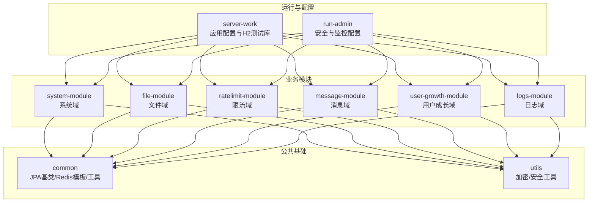
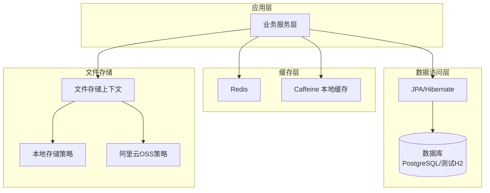
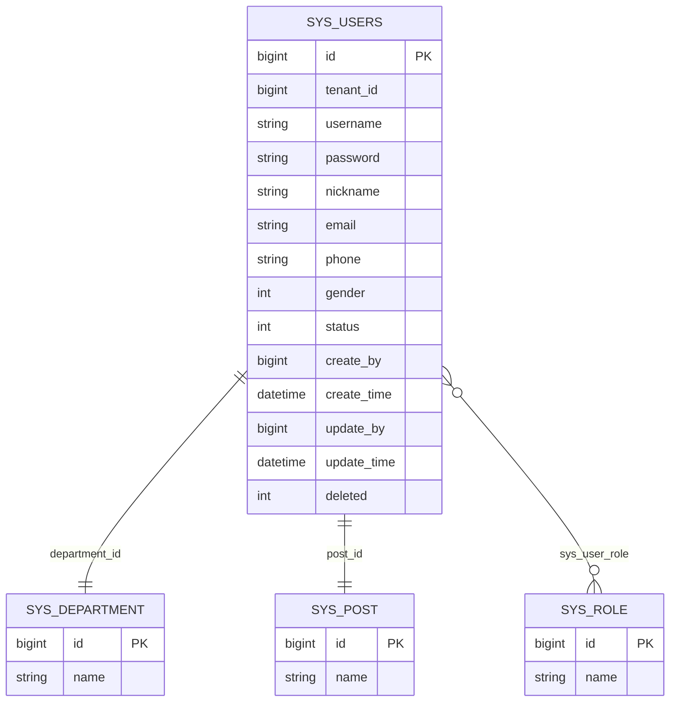
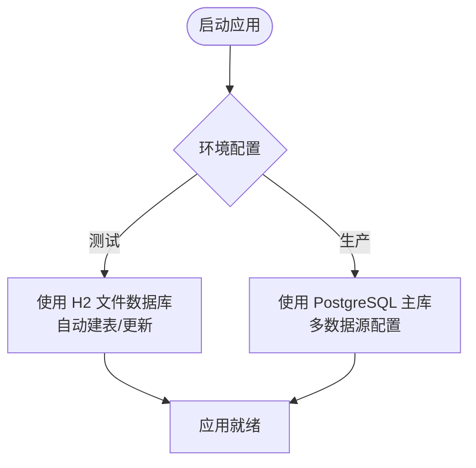
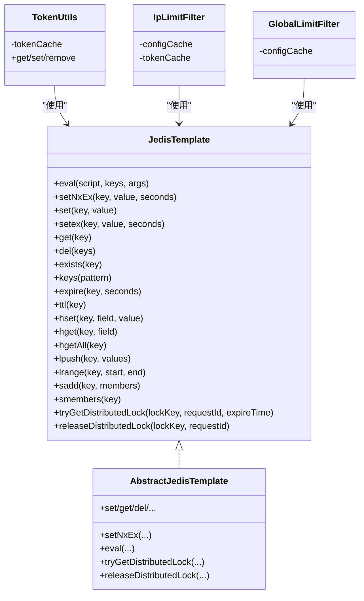
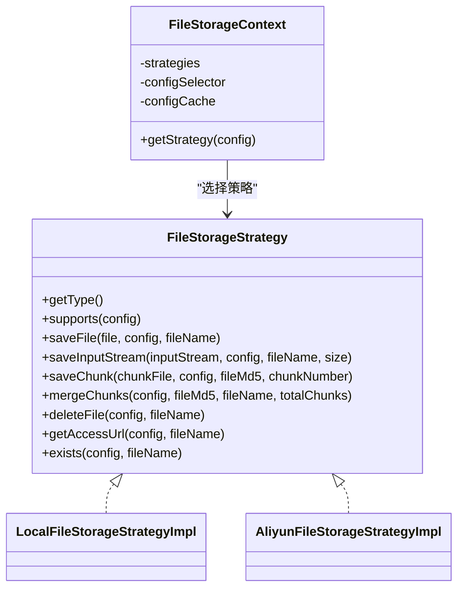
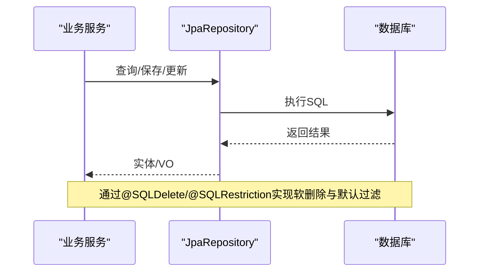
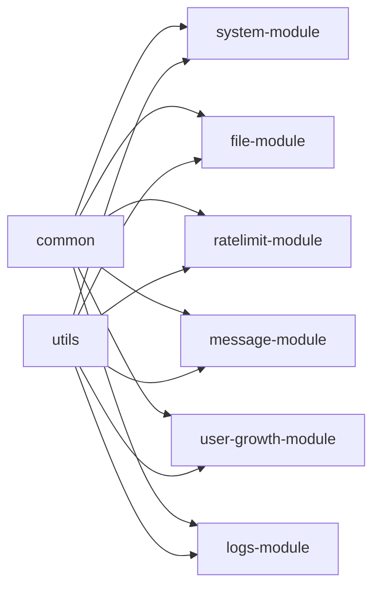

# 数据架构

<cite>
**本文引用的文件**
- [application.yml](file://server-work/src/main/resources/application.yml)
- [BaseEntity.java](file://common/src/main/java/com/fastproject/db/BaseEntity.java)
- [JedisTemplate.java](file://common/src/main/java/com/fastproject/jedis/JedisTemplate.java)
- [AbstractJedisTemplate.java](file://common/src/main/java/com/fastproject/jedis/AbstractJedisTemplate.java)
- [TokenUtils.java](file://common/src/main/java/com/fastproject/utils/TokenUtils.java)
- [JedisRuntimeHints.java](file://run-admin/src/main/java/com/fastproject/config/JedisRuntimeHints.java)
- [SecurityConfig.java](file://run-admin/src/main/java/com/fastproject/module/security/config/SecurityConfig.java)
- [SecurityProps.java](file://common/src/main/java/com/fastproject/props/SecurityProps.java)
- [XssUtil.java](file://common/src/main/java/com/fastproject/utils/XssUtil.java)
- [JpaSqlTimingConfig.java](file://run-admin/src/main/java/com/fastproject/config/JpaSqlTimingConfig.java)
- [FileInfo.java](file://file-module/src/main/java/com/fastproject/file/domain/FileInfo.java)
- [LocalFileStorageStrategyImpl.java](file://file-module/src/main/java/com/fastproject/file/storage/impl/LocalFileStorageStrategyImpl.java)
- [AliyunFileStorageStrategyImpl.java](file://file-module/src/main/java/com/fastproject/file/storage/impl/AliyunFileStorageStrategyImpl.java)
- [FileStorageStrategy.java](file://file-module/src/main/java/com/fastproject/file/storage/FileStorageStrategy.java)
- [FileStorageContext.java](file://file-module/src/main/java/com/fastproject/file/storage/FileStorageContext.java)
- [SysUsers.java](file://system-module/src/main/java/com/fastproject/system/domain/SysUsers.java)
- [UserLevelAccount.java](file://user-growth-module/src/main/java/com/fastproject/usergrowth/domain/UserIntegralAccount.java)
- [IpLimitFilter.java](file://ratelimit-module/src/main/java/com/fastproject/ratelimit/config/IpLimitFilter.java)
- [GlobalLimitFilter.java](file://ratelimit-module/src/main/java/com/fastproject/ratelimit/config/GlobalLimitFilter.java)
- [settings.gradle](file://settings.gradle)
</cite>

## 目录
1. [引言](#引言)
2. [项目结构](#项目结构)
3. [核心组件](#核心组件)
4. [架构总览](#架构总览)
5. [详细组件分析](#详细组件分析)
6. [依赖分析](#依赖分析)
7. [性能考虑](#性能考虑)
8. [故障排查指南](#故障排查指南)
9. [结论](#结论)
10. [附录](#附录)

## 引言
本文件系统化梳理 Fast 项目的“数据架构”，覆盖数据库设计原则与实体关系、多数据库支持策略（PostgreSQL 主库与 H2 测试库）、缓存架构（Redis 分布式缓存与 Caffeine 本地缓存双缓存策略）、文件存储架构（本地存储与阿里云 OSS 的策略选择与实现）、数据访问模式与事务管理策略、性能优化方案、数据迁移与版本管理建议，以及数据安全与隐私保护措施。

## 项目结构
Fast 采用多模块 Gradle 工程组织，核心模块包括系统、文件、限流、消息、用户成长、日志等子系统，公共能力集中在 common、utils 模块。数据库访问基于 JPA/Hibernate，缓存使用 Redis + Caffeine，文件存储抽象为策略模式，支持本地与 OSS。

图表来源
- [settings.gradle](file://settings.gradle#L1-L24)
- [application.yml](file://server-work/src/main/resources/application.yml#L1-L16)

章节来源
- [settings.gradle](file://settings.gradle#L1-L24)
- [application.yml](file://server-work/src/main/resources/application.yml#L1-L16)

## 核心组件
- 数据模型基类与通用字段：统一的 BaseEntity 抽象出主键、审计字段与逻辑删除，确保各模块实体的一致性与可维护性。
- 缓存组件：JedisTemplate 接口与 AbstractJedisTemplate 抽象实现封装 Redis 常用操作；TokenUtils 使用 Caffeine 本地缓存加速鉴权流程。
- 文件存储：FileStorageStrategy 抽象策略接口，LocalFileStorageStrategyImpl 与 AliyunFileStorageStrategyImpl 分别实现本地与 OSS 存储，FileStorageContext 统一调度。
- 限流组件：IpLimitFilter 与 GlobalLimitFilter 使用 Caffeine 本地缓存配置与令牌桶/漏桶算法，结合 Redis 实现分布式限流。
- 安全与监控：SecurityConfig 配置安全链路与密码编码器；JpaSqlTimingConfig 动态包装 DataSource/Connection/Statement，输出慢查询日志。

章节来源
- [BaseEntity.java](file://common/src/main/java/com/fastproject/db/BaseEntity.java#L1-L48)
- [JedisTemplate.java](file://common/src/main/java/com/fastproject/jedis/JedisTemplate.java#L1-L199)
- [AbstractJedisTemplate.java](file://common/src/main/java/com/fastproject/jedis/AbstractJedisTemplate.java#L1-L298)
- [TokenUtils.java](file://common/src/main/java/com/fastproject/utils/TokenUtils.java#L1-L36)
- [FileStorageStrategy.java](file://file-module/src/main/java/com/fastproject/file/storage/FileStorageStrategy.java#L1-L52)
- [LocalFileStorageStrategyImpl.java](file://file-module/src/main/java/com/fastproject/file/storage/impl/LocalFileStorageStrategyImpl.java#L1-L170)
- [AliyunFileStorageStrategyImpl.java](file://file-module/src/main/java/com/fastproject/file/storage/impl/AliyunFileStorageStrategyImpl.java#L1-L283)
- [FileStorageContext.java](file://file-module/src/main/java/com/fastproject/file/storage/FileStorageContext.java#L1-L45)
- [IpLimitFilter.java](file://ratelimit-module/src/main/java/com/fastproject/ratelimit/config/IpLimitFilter.java#L40-L56)
- [GlobalLimitFilter.java](file://ratelimit-module/src/main/java/com/fastproject/ratelimit/config/GlobalLimitFilter.java#L84-L106)
- [SecurityConfig.java](file://run-admin/src/main/java/com/fastproject/module/security/config/SecurityConfig.java#L1-L32)
- [JpaSqlTimingConfig.java](file://run-admin/src/main/java/com/fastproject/config/JpaSqlTimingConfig.java#L36-L222)

## 架构总览
下图展示数据层与缓存层的整体交互：业务模块通过 JPA 访问数据库；Redis 作为分布式缓存与限流令牌桶/漏桶实现载体；Caffeine 作为本地缓存提升热点数据访问性能；文件域通过策略模式对接本地与 OSS。

图表来源
- [JedisTemplate.java](file://common/src/main/java/com/fastproject/jedis/JedisTemplate.java#L1-L199)
- [AbstractJedisTemplate.java](file://common/src/main/java/com/fastproject/jedis/AbstractJedisTemplate.java#L1-L298)
- [TokenUtils.java](file://common/src/main/java/com/fastproject/utils/TokenUtils.java#L1-L36)
- [FileStorageContext.java](file://file-module/src/main/java/com/fastproject/file/storage/FileStorageContext.java#L1-L45)
- [LocalFileStorageStrategyImpl.java](file://file-module/src/main/java/com/fastproject/file/storage/impl/LocalFileStorageStrategyImpl.java#L1-L170)
- [AliyunFileStorageStrategyImpl.java](file://file-module/src/main/java/com/fastproject/file/storage/impl/AliyunFileStorageStrategyImpl.java#L1-L283)

## 详细组件分析

### 数据库设计原则与实体关系
- 设计原则
  - 统一审计字段：所有实体继承 BaseEntity，具备 createBy/createTime/updateBy/updateTime/deleted 等字段，便于审计与软删除。
  - 逻辑删除：通过 @SQLDelete 与 @SQLRestriction 实现软删除，避免物理删除造成的数据不可恢复。
  - 租户隔离：系统用户实体实现 TenantScopedEntity，支持按租户维度进行数据隔离。
- 关键实体
  - 系统用户：SysUsers 与部门、岗位、角色关联，体现典型的 RBAC 模型。
  - 文件信息：FileInfo 记录文件元数据、存储位置与访问路径，支持软删除。
  - 用户成长：UserIntegralAccount 等实体承载用户成长相关指标与状态。
- ER 关系示意

图表来源
- [SysUsers.java](file://system-module/src/main/java/com/fastproject/system/domain/SysUsers.java#L1-L95)
- [BaseEntity.java](file://common/src/main/java/com/fastproject/db/BaseEntity.java#L1-L48)

章节来源
- [BaseEntity.java](file://common/src/main/java/com/fastproject/db/BaseEntity.java#L1-L48)
- [SysUsers.java](file://system-module/src/main/java/com/fastproject/system/domain/SysUsers.java#L1-L95)
- [FileInfo.java](file://file-module/src/main/java/com/fastproject/file/domain/FileInfo.java#L1-L79)
- [UserLevelAccount.java](file://user-growth-module/src/main/java/com/fastproject/usergrowth/domain/UserIntegralAccount.java#L1-L33)

### 多数据库支持策略
- PostgreSQL 主库
  - 项目未在当前仓库显式配置 PostgreSQL 数据源，但通过模块化与 JPA/Hibernate 支撑多数据源扩展；建议在生产环境以 Spring Boot 多数据源配置接入 PostgreSQL。
- H2 内存数据库用于测试
  - server-work 模块使用 H2 文件数据库，便于本地开发与集成测试；配置项包括 JDBC URL、驱动、DDL 自动更新与控制台访问路径。

图表来源
- [application.yml](file://server-work/src/main/resources/application.yml#L1-L16)

章节来源
- [application.yml](file://server-work/src/main/resources/application.yml#L1-L16)

### 缓存架构设计（Redis + Caffeine）
- Redis 分布式缓存
  - JedisTemplate 抽象 Redis 常用操作，AbstractJedisTemplate 提供具体实现，支持字符串、哈希、列表、集合、分布式锁等。
  - 限流与令牌桶/漏桶：IpLimitFilter 与 GlobalLimitFilter 使用 Redis 实现令牌桶/漏桶算法，结合 Caffeine 本地缓存降低热点配置的查询压力。
  - 安全与鉴权：TokenUtils 使用 Caffeine 本地缓存 token -> 用户信息，结合 Redis 与 SecurityProps 控制过期与设备限制。
- Caffeine 本地缓存
  - 限流配置缓存：短期高频读取的限流配置通过 Caffeine 缓存，避免频繁访问数据库。
  - 鉴权缓存：TokenUtils 对 token 的本地缓存，提升登录态校验吞吐。
- Native Image 支持
  - JedisRuntimeHints 注册缺失资源，解决 AOT 场景下 Jedis 反射加载问题。

图表来源
- [JedisTemplate.java](file://common/src/main/java/com/fastproject/jedis/JedisTemplate.java#L1-L199)
- [AbstractJedisTemplate.java](file://common/src/main/java/com/fastproject/jedis/AbstractJedisTemplate.java#L1-L298)
- [TokenUtils.java](file://common/src/main/java/com/fastproject/utils/TokenUtils.java#L1-L36)
- [IpLimitFilter.java](file://ratelimit-module/src/main/java/com/fastproject/ratelimit/config/IpLimitFilter.java#L40-L56)
- [GlobalLimitFilter.java](file://ratelimit-module/src/main/java/com/fastproject/ratelimit/config/GlobalLimitFilter.java#L84-L106)

章节来源
- [JedisTemplate.java](file://common/src/main/java/com/fastproject/jedis/JedisTemplate.java#L1-L199)
- [AbstractJedisTemplate.java](file://common/src/main/java/com/fastproject/jedis/AbstractJedisTemplate.java#L1-L298)
- [TokenUtils.java](file://common/src/main/java/com/fastproject/utils/TokenUtils.java#L1-L36)
- [IpLimitFilter.java](file://ratelimit-module/src/main/java/com/fastproject/ratelimit/config/IpLimitFilter.java#L40-L56)
- [GlobalLimitFilter.java](file://ratelimit-module/src/main/java/com/fastproject/ratelimit/config/GlobalLimitFilter.java#L84-L106)
- [JedisRuntimeHints.java](file://run-admin/src/main/java/com/fastproject/config/JedisRuntimeHints.java#L1-L15)

### 文件存储架构（本地与阿里云 OSS）
- 策略模式
  - FileStorageStrategy 定义统一接口；FileStorageContext 负责根据配置选择具体策略。
- 本地存储
  - LocalFileStorageStrategyImpl：将文件写入本地磁盘，支持分片上传与合并，提供访问 URL 生成与存在性检查。
- 阿里云 OSS
  - AliyunFileStorageStrategyImpl：基于 OSS SDK 完成上传、分片合并、删除、存在性检查与私有桶预签名 URL 生成。
- 访问策略
  - 当配置为私有桶时，生成带过期时间的预签名 URL；否则拼接访问域名或默认前缀。

图表来源
- [FileStorageStrategy.java](file://file-module/src/main/java/com/fastproject/file/storage/FileStorageStrategy.java#L1-L52)
- [FileStorageContext.java](file://file-module/src/main/java/com/fastproject/file/storage/FileStorageContext.java#L1-L45)
- [LocalFileStorageStrategyImpl.java](file://file-module/src/main/java/com/fastproject/file/storage/impl/LocalFileStorageStrategyImpl.java#L1-L170)
- [AliyunFileStorageStrategyImpl.java](file://file-module/src/main/java/com/fastproject/file/storage/impl/AliyunFileStorageStrategyImpl.java#L1-L283)

章节来源
- [FileStorageStrategy.java](file://file-module/src/main/java/com/fastproject/file/storage/FileStorageStrategy.java#L1-L52)
- [FileStorageContext.java](file://file-module/src/main/java/com/fastproject/file/storage/FileStorageContext.java#L1-L45)
- [LocalFileStorageStrategyImpl.java](file://file-module/src/main/java/com/fastproject/file/storage/impl/LocalFileStorageStrategyImpl.java#L1-L170)
- [AliyunFileStorageStrategyImpl.java](file://file-module/src/main/java/com/fastproject/file/storage/impl/AliyunFileStorageStrategyImpl.java#L1-L283)

### 数据访问模式与事务管理
- JPA/Hibernate
  - 使用 JpaRepository 与 Specification 进行数据访问；通过 @SQLDelete 与 @SQLRestriction 实现软删除与默认过滤。
- 事务管理
  - Spring 声明式事务适用于业务方法；对于高并发场景，建议在限流与幂等模块配合 Redis 分布式锁使用。
- SQL 监控
  - JpaSqlTimingConfig 动态包装 DataSource/Connection/Statement，按阈值输出慢查询日志，辅助性能优化。

图表来源
- [SysUsers.java](file://system-module/src/main/java/com/fastproject/system/domain/SysUsers.java#L1-L95)
- [JpaSqlTimingConfig.java](file://run-admin/src/main/java/com/fastproject/config/JpaSqlTimingConfig.java#L36-L222)

章节来源
- [SysUsers.java](file://system-module/src/main/java/com/fastproject/system/domain/SysUsers.java#L1-L95)
- [JpaSqlTimingConfig.java](file://run-admin/src/main/java/com/fastproject/config/JpaSqlTimingConfig.java#L36-L222)

### 性能优化方案
- 缓存优化
  - 限流配置与令牌桶/漏桶状态缓存于 Caffeine，显著降低 Redis 请求频率与数据库压力。
  - TokenUtils 的本地缓存缩短鉴权链路，结合 Redis 与 SecurityProps 控制过期时间。
- 文件分片与预签名
  - OSS 分片上传与合并减少大文件传输失败风险；私有桶使用预签名 URL 提升访问效率。
- SQL 监控与调优
  - 通过 JpaSqlTimingConfig 输出慢查询日志，定位热点 SQL 并针对性建立索引或重构查询。

章节来源
- [IpLimitFilter.java](file://ratelimit-module/src/main/java/com/fastproject/ratelimit/config/IpLimitFilter.java#L40-L56)
- [GlobalLimitFilter.java](file://ratelimit-module/src/main/java/com/fastproject/ratelimit/config/GlobalLimitFilter.java#L84-L106)
- [TokenUtils.java](file://common/src/main/java/com/fastproject/utils/TokenUtils.java#L1-L36)
- [AliyunFileStorageStrategyImpl.java](file://file-module/src/main/java/com/fastproject/file/storage/impl/AliyunFileStorageStrategyImpl.java#L1-L283)
- [JpaSqlTimingConfig.java](file://run-admin/src/main/java/com/fastproject/config/JpaSqlTimingConfig.java#L36-L222)

### 数据迁移与版本管理
- 版本管理建议
  - 采用数据库版本管理工具（如 Flyway/Liquibase）进行迁移脚本版本化与回滚策略。
  - 生产与测试环境分离，测试使用 H2，生产使用 PostgreSQL。
- 迁移策略
  - 以模块化拆分迁移任务，优先处理系统域与文件域等核心表；对软删除字段保持兼容性。
  - 迁移过程中保留 BaseEntity 的审计字段与 deleted 字段，确保历史数据可追溯。

章节来源
- [BaseEntity.java](file://common/src/main/java/com/fastproject/db/BaseEntity.java#L1-L48)
- [application.yml](file://server-work/src/main/resources/application.yml#L1-L16)

### 数据安全与隐私保护
- 密码加密
  - SecurityConfig 中注册 BCryptPasswordEncoder，用于用户密码加密存储。
- XSS 防护
  - XssUtil 基于 OWASP HTML 白名单策略清理富文本，限制允许标签与属性，防止 XSS。
- 传输安全
  - 通过 HTTPS 与 JWT 认证链路保障传输与鉴权安全；TokenUtils 与 SecurityProps 控制 token 过期与设备限制。
- 敏感数据
  - 对涉及 SM2 的敏感数据处理，可参考 utils 模块中的 SM2 工具类进行加解密（如需）。

章节来源
- [SecurityConfig.java](file://run-admin/src/main/java/com/fastproject/module/security/config/SecurityConfig.java#L1-L32)
- [XssUtil.java](file://common/src/main/java/com/fastproject/utils/XssUtil.java#L1-L50)
- [TokenUtils.java](file://common/src/main/java/com/fastproject/utils/TokenUtils.java#L1-L36)
- [SecurityProps.java](file://common/src/main/java/com/fastproject/props/SecurityProps.java#L1-L25)

## 依赖分析
- 模块间耦合
  - system-module、file-module、ratelimit-module 等均依赖 common 提供的 JPA 基类与 Redis 模板；utils 提供安全与加密工具。
- 外部依赖
  - Redis 客户端 Jedis；Caffeine；H2（测试）；阿里云 OSS SDK；Spring Security；OWASP HTML Sanitizer。

图表来源
- [settings.gradle](file://settings.gradle#L1-L24)

章节来源
- [settings.gradle](file://settings.gradle#L1-L24)

## 性能考虑
- 缓存命中率
  - 通过合理设置 Caffeine 过期时间与容量，平衡内存占用与命中率；对热点配置与令牌桶状态进行本地缓存。
- Redis 优化
  - 使用 Lua 脚本保证原子性；合理设置过期时间；避免大键与阻塞命令。
- 文件存储
  - 大文件采用分片上传与合并；私有桶使用预签名 URL；本地存储注意磁盘 IO 与并发写入。
- SQL 优化
  - 借助慢查询日志识别热点 SQL，补充索引与重写查询；避免 N+1 查询。

## 故障排查指南
- SQL 慢查询定位
  - 启用 JpaSqlTimingConfig 的阈值日志，定位耗时 SQL 并进行优化。
- Redis 连接与锁
  - 检查 AbstractJedisTemplate 的错误日志；确认分布式锁的 Lua 脚本执行是否成功。
- 文件存储异常
  - 本地存储检查存储路径权限与磁盘空间；OSS 检查 Endpoint、Bucket、凭证与私有桶预签名 URL 有效期。
- 限流配置不生效
  - 核查 Caffeine 缓存是否过期；确认 Redis 中令牌桶/漏桶键是否存在且 TTL 正确。

章节来源
- [JpaSqlTimingConfig.java](file://run-admin/src/main/java/com/fastproject/config/JpaSqlTimingConfig.java#L36-L222)
- [AbstractJedisTemplate.java](file://common/src/main/java/com/fastproject/jedis/AbstractJedisTemplate.java#L1-L298)
- [LocalFileStorageStrategyImpl.java](file://file-module/src/main/java/com/fastproject/file/storage/impl/LocalFileStorageStrategyImpl.java#L1-L170)
- [AliyunFileStorageStrategyImpl.java](file://file-module/src/main/java/com/fastproject/file/storage/impl/AliyunFileStorageStrategyImpl.java#L1-L283)
- [IpLimitFilter.java](file://ratelimit-module/src/main/java/com/fastproject/ratelimit/config/IpLimitFilter.java#L40-L56)
- [GlobalLimitFilter.java](file://ratelimit-module/src/main/java/com/fastproject/ratelimit/config/GlobalLimitFilter.java#L84-L106)

## 结论
Fast 项目通过 BaseEntity 统一数据模型、JPA/Hibernate 实现数据访问、Redis+Caffeine 构建高性能缓存体系、策略模式实现灵活的文件存储，并辅以安全与监控机制，形成可扩展、可观测、可维护的数据架构。建议在生产环境引入 PostgreSQL 与数据库版本管理工具，持续优化缓存与 SQL 性能，并完善数据安全与隐私保护策略。

## 附录
- 关键配置与常量
  - H2 测试库配置：见 server-work 的 application.yml。
  - 限流与令牌桶键前缀：见 IpLimitFilter 与 GlobalLimitFilter。
  - 安全参数：见 SecurityProps 与 SecurityConfig。
- 快速定位
  - 数据模型基类：BaseEntity
  - Redis 模板：JedisTemplate/AbstractJedisTemplate
  - 本地缓存：TokenUtils
  - 文件存储：FileStorageStrategy/Context/Local/OSS 实现
  - 安全与监控：SecurityConfig/JpaSqlTimingConfig