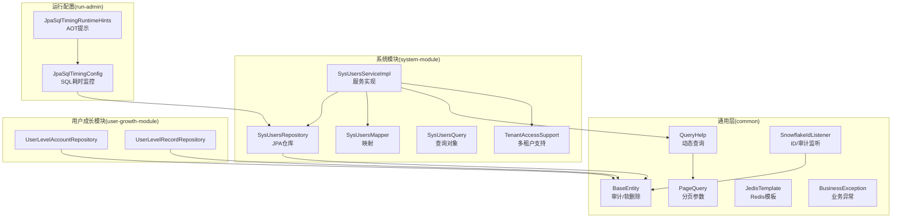
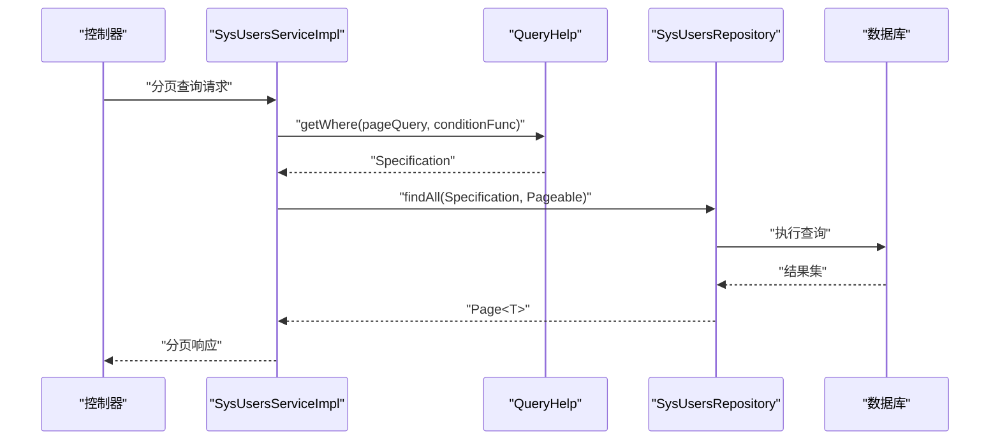
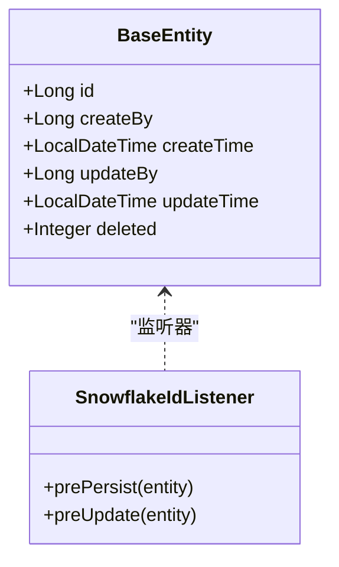
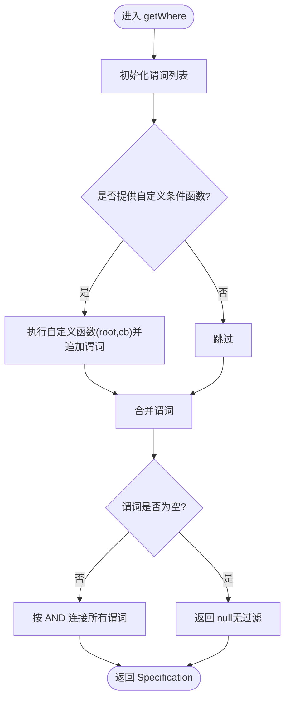
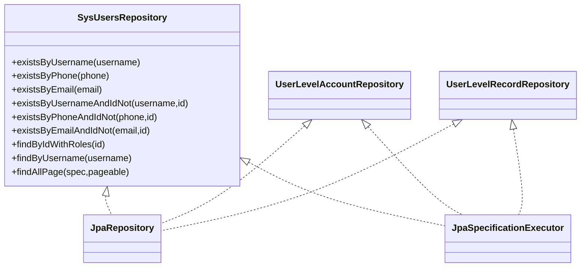
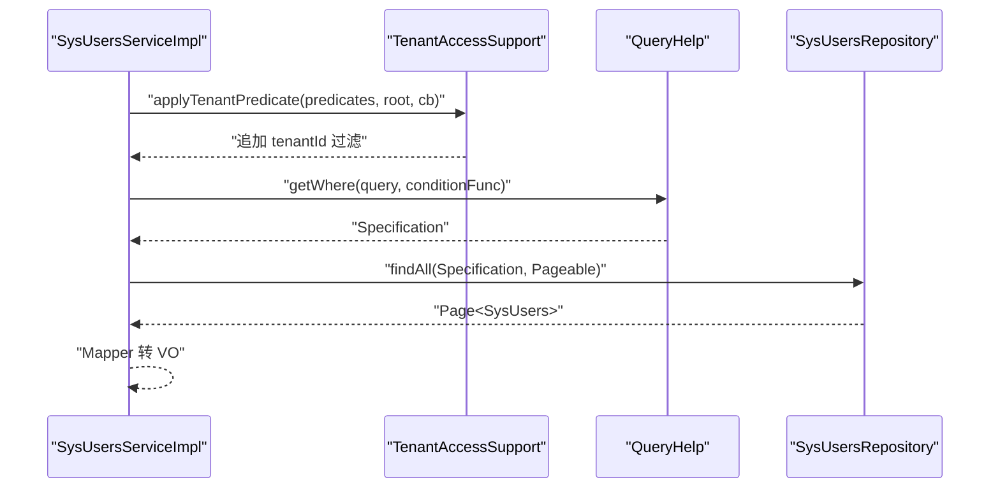
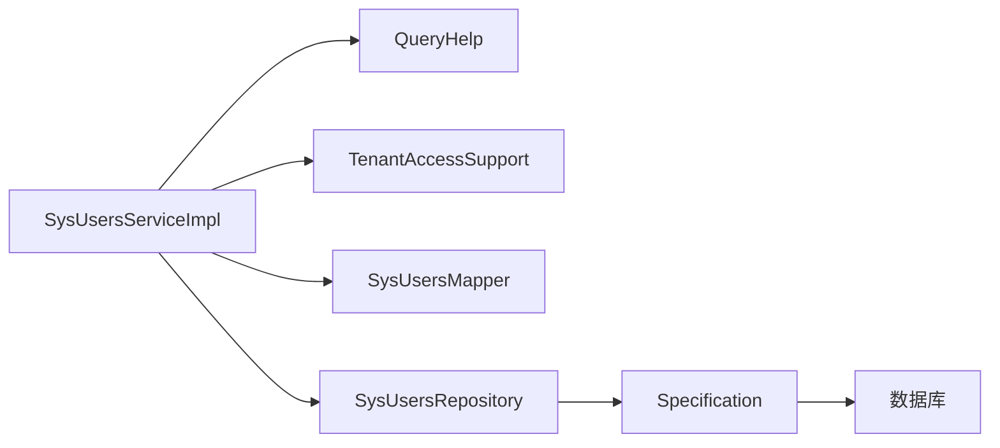

# 数据访问模式

<cite>
**本文引用的文件**
- [BaseEntity.java](file://common/src/main/java/com/fastproject/db/BaseEntity.java)
- [PageQuery.java](file://common/src/main/java/com/fastproject/db/PageQuery.java)
- [QueryHelp.java](file://common/src/main/java/com/fastproject/db/QueryHelp.java)
- [SnowflakeIdListener.java](file://common/src/main/java/com/fastproject/db/SnowflakeIdListener.java)
- [SysUsersRepository.java](file://system-module/src/main/java/com/fastproject/system/repository/db/SysUsersRepository.java)
- [SysUsersServiceImpl.java](file://system-module/src/main/java/com/fastproject/system/service/impl/SysUsersServiceImpl.java)
- [SysUsersMapper.java](file://system-module/src/main/java/com/fastproject/system/mapper/SysUsersMapper.java)
- [SysUsersQuery.java](file://system-module/src/main/java/com/fastproject/system/vo/users/SysUsersQuery.java)
- [TenantAccessSupport.java](file://system-module/src/main/java/com/fastproject/system/tenant/TenantAccessSupport.java)
- [BusinessException.java](file://common/src/main/java/com/fastproject/exception/BusinessException.java)
- [JedisTemplate.java](file://common/src/main/java/com/fastproject/jedis/JedisTemplate.java)
- [JpaSqlTimingConfig.java](file://run-admin/src/main/java/com/fastproject/config/JpaSqlTimingConfig.java)
- [JpaSqlTimingRuntimeHints.java](file://run-admin/src/main/java/com/fastproject/config/JpaSqlTimingRuntimeHints.java)
- [UserLevelAccountRepository.java](file://user-growth-module/src/main/java/com/fastproject/usergrowth/repository/db/UserLevelAccountRepository.java)
- [UserLevelRecordRepository.java](file://user-growth-module/src/main/java/com/fastproject/usergrowth/repository/db/UserLevelRecordRepository.java)
</cite>

## 目录
1. [简介](#简介)
2. [项目结构](#项目结构)
3. [核心组件](#核心组件)
4. [架构总览](#架构总览)
5. [组件详解](#组件详解)
6. [依赖关系分析](#依赖关系分析)
7. [性能考量](#性能考量)
8. [故障排查指南](#故障排查指南)
9. [结论](#结论)
10. [附录](#附录)

## 简介
本文件系统化梳理 Fast 项目的“数据访问模式”，围绕以下主题展开：
- Repository 模式与 Spring Data JPA 使用
- Service 层设计与事务管理
- DAO 抽象与查询帮助器 QueryHelp 的动态查询生成
- BaseEntity 基础实体的设计（ID 生成、审计字段、软删除）
- PageQuery 分页查询的参数与排序配置
- 事务策略、异常处理与性能优化
- 最佳实践与常见问题

## 项目结构
数据访问层主要分布在以下位置：
- 通用基础：common 模块提供 BaseEntity、PageQuery、QueryHelp、SnowflakeIdListener、JedisTemplate、异常类型等
- 业务模块：system-module、user-growth-module 等提供具体实体与仓库接口
- 配置与监控：run-admin 提供 JPA SQL 执行耗时监控配置

图表来源
- [BaseEntity.java](file://common/src/main/java/com/fastproject/db/BaseEntity.java#L1-L48)
- [PageQuery.java](file://common/src/main/java/com/fastproject/db/PageQuery.java#L1-L16)
- [QueryHelp.java](file://common/src/main/java/com/fastproject/db/QueryHelp.java#L1-L45)
- [SnowflakeIdListener.java](file://common/src/main/java/com/fastproject/db/SnowflakeIdListener.java#L1-L64)
- [SysUsersRepository.java](file://system-module/src/main/java/com/fastproject/system/repository/db/SysUsersRepository.java#L1-L62)
- [SysUsersServiceImpl.java](file://system-module/src/main/java/com/fastproject/system/service/impl/SysUsersServiceImpl.java#L1-L390)
- [SysUsersMapper.java](file://system-module/src/main/java/com/fastproject/system/mapper/SysUsersMapper.java#L1-L30)
- [SysUsersQuery.java](file://system-module/src/main/java/com/fastproject/system/vo/users/SysUsersQuery.java#L1-L38)
- [TenantAccessSupport.java](file://system-module/src/main/java/com/fastproject/system/tenant/TenantAccessSupport.java#L1-L106)
- [JpaSqlTimingConfig.java](file://run-admin/src/main/java/com/fastproject/config/JpaSqlTimingConfig.java#L1-L222)
- [JpaSqlTimingRuntimeHints.java](file://run-admin/src/main/java/com/fastproject/config/JpaSqlTimingRuntimeHints.java#L1-L25)
- [UserLevelAccountRepository.java](file://user-growth-module/src/main/java/com/fastproject/usergrowth/repository/db/UserLevelAccountRepository.java#L1-L12)
- [UserLevelRecordRepository.java](file://user-growth-module/src/main/java/com/fastproject/usergrowth/repository/db/UserLevelRecordRepository.java#L1-L10)

章节来源
- [BaseEntity.java](file://common/src/main/java/com/fastproject/db/BaseEntity.java#L1-L48)
- [SysUsersRepository.java](file://system-module/src/main/java/com/fastproject/system/repository/db/SysUsersRepository.java#L1-L62)

## 核心组件
- BaseEntity：统一的实体基类，提供主键、审计字段与软删除标记
- SnowflakeIdListener：实体生命周期事件监听，负责雪花 ID 生成、审计字段填充与软删除初始化
- PageQuery：通用分页参数载体
- QueryHelp：基于 Specification 的动态查询构建器，支持自定义条件与逻辑删除处理
- SysUsersRepository：继承 JpaRepository 与 JpaSpecificationExecutor，提供复杂查询与分页能力
- SysUsersServiceImpl：服务层实现，封装事务、查询、映射与多租户访问控制
- TenantAccessSupport：多租户访问控制工具，注入租户过滤条件与权限校验
- JedisTemplate：Redis 操作模板，支撑缓存与分布式锁等场景
- JpaSqlTimingConfig：JPA SQL 执行耗时监控配置，通过 JDK 动态代理包装 DataSource/Statement

章节来源
- [BaseEntity.java](file://common/src/main/java/com/fastproject/db/BaseEntity.java#L1-L48)
- [SnowflakeIdListener.java](file://common/src/main/java/com/fastproject/db/SnowflakeIdListener.java#L1-L64)
- [PageQuery.java](file://common/src/main/java/com/fastproject/db/PageQuery.java#L1-L16)
- [QueryHelp.java](file://common/src/main/java/com/fastproject/db/QueryHelp.java#L1-L45)
- [SysUsersRepository.java](file://system-module/src/main/java/com/fastproject/system/repository/db/SysUsersRepository.java#L1-L62)
- [SysUsersServiceImpl.java](file://system-module/src/main/java/com/fastproject/system/service/impl/SysUsersServiceImpl.java#L1-L390)
- [TenantAccessSupport.java](file://system-module/src/main/java/com/fastproject/system/tenant/TenantAccessSupport.java#L1-L106)
- [JedisTemplate.java](file://common/src/main/java/com/fastproject/jedis/JedisTemplate.java#L1-L199)
- [JpaSqlTimingConfig.java](file://run-admin/src/main/java/com/fastproject/config/JpaSqlTimingConfig.java#L1-L222)

## 架构总览
下图展示数据访问层的整体交互：控制器调用服务，服务通过 QueryHelp 构建 Specification，结合 TenantAccessSupport 注入租户过滤，最终由 Repository 执行 JPA 查询；同时利用 BaseEntity 的监听器自动填充审计字段。

图表来源
- [SysUsersServiceImpl.java](file://system-module/src/main/java/com/fastproject/system/service/impl/SysUsersServiceImpl.java#L196-L246)
- [QueryHelp.java](file://common/src/main/java/com/fastproject/db/QueryHelp.java#L25-L42)
- [SysUsersRepository.java](file://system-module/src/main/java/com/fastproject/system/repository/db/SysUsersRepository.java#L56-L59)

## 组件详解

### BaseEntity 基础实体设计
- 设计要点
  - 主键：Long 类型，统一使用雪花 ID 生成策略（通过监听器）
  - 审计字段：createBy、createTime、updateBy、updateTime，自动维护
  - 软删除：deleted 字段，默认 0 表示未删除，建议在查询时默认过滤 deleted=0
  - 统一监听：通过 EntityListeners 绑定 SnowflakeIdListener

图表来源
- [BaseEntity.java](file://common/src/main/java/com/fastproject/db/BaseEntity.java#L14-L47)
- [SnowflakeIdListener.java](file://common/src/main/java/com/fastproject/db/SnowflakeIdListener.java#L12-L63)

章节来源
- [BaseEntity.java](file://common/src/main/java/com/fastproject/db/BaseEntity.java#L1-L48)
- [SnowflakeIdListener.java](file://common/src/main/java/com/fastproject/db/SnowflakeIdListener.java#L1-L64)

### SnowflakeIdListener 监听器
- 自动填充
  - ID：首次持久化为空时生成
  - 时间：创建/更新时间自动写入
  - 审计：创建/更新人员 ID 来源于上下文（通过工具类获取）
  - 软删除：deleted 默认 0
- 注意事项
  - 当前实现依赖上下文工具类获取用户信息，需确保上下文可用
  - 若业务需要不同策略，可在监听器中扩展或替换

章节来源
- [SnowflakeIdListener.java](file://common/src/main/java/com/fastproject/db/SnowflakeIdListener.java#L14-L63)

### PageQuery 分页参数
- 字段
  - page：当前页（从 0 开始）
  - pageSize：每页条数
- 使用方式
  - 在服务层构造 PageRequest 并传入 Repository
  - 可结合 Sort 指定排序字段

章节来源
- [PageQuery.java](file://common/src/main/java/com/fastproject/db/PageQuery.java#L1-L16)
- [SysUsersQuery.java](file://system-module/src/main/java/com/fastproject/system/vo/users/SysUsersQuery.java#L10-L37)
- [SysUsersServiceImpl.java](file://system-module/src/main/java/com/fastproject/system/service/impl/SysUsersServiceImpl.java#L198-L200)

### QueryHelp 动态查询生成
- 能力
  - 接收 PageQuery 与自定义条件函数
  - 返回 Specification，内部自动处理逻辑删除与用户自定义条件拼接
  - 支持将多个 Predicate 组合并返回
- 使用流程
  - 服务层传入 (root, cb) -> List<Predicate>
  - QueryHelp 将自定义条件与逻辑删除条件合并
  - Repository 执行查询

图表来源
- [QueryHelp.java](file://common/src/main/java/com/fastproject/db/QueryHelp.java#L25-L42)

章节来源
- [QueryHelp.java](file://common/src/main/java/com/fastproject/db/QueryHelp.java#L1-L45)
- [SysUsersServiceImpl.java](file://system-module/src/main/java/com/fastproject/system/service/impl/SysUsersServiceImpl.java#L202-L222)

### JPA Repository 接口设计与 Spring Data JPA 使用
- SysUsersRepository
  - 继承 JpaRepository 与 JpaSpecificationExecutor，支持分页与动态条件
  - 提供 exists* 方法进行唯一性校验
  - 提供自定义 @Query 以支持关联查询与 Tuple 分页
- 其他模块仓库
  - user-growth-module 中的 UserLevelAccountRepository、UserLevelRecordRepository 同样采用 JPA 基础接口

图表来源
- [SysUsersRepository.java](file://system-module/src/main/java/com/fastproject/system/repository/db/SysUsersRepository.java#L17-L61)
- [UserLevelAccountRepository.java](file://user-growth-module/src/main/java/com/fastproject/usergrowth/repository/db/UserLevelAccountRepository.java#L9-L11)
- [UserLevelRecordRepository.java](file://user-growth-module/src/main/java/com/fastproject/usergrowth/repository/db/UserLevelRecordRepository.java#L9-L9)

章节来源
- [SysUsersRepository.java](file://system-module/src/main/java/com/fastproject/system/repository/db/SysUsersRepository.java#L1-L62)
- [UserLevelAccountRepository.java](file://user-growth-module/src/main/java/com/fastproject/usergrowth/repository/db/UserLevelAccountRepository.java#L1-L12)
- [UserLevelRecordRepository.java](file://user-growth-module/src/main/java/com/fastproject/usergrowth/repository/db/UserLevelRecordRepository.java#L1-L10)

### Service 层设计与事务管理
- 事务策略
  - 写操作（保存、更新、删除、批量删除）使用 @Transactional(rollbackFor = Exception.class)
  - 读操作（查询、分页、统计）使用 @Transactional(readOnly = true)
- 查询流程
  - 构造 Pageable（含排序）
  - 使用 QueryHelp.getWhere 生成 Specification
  - 调用 Repository.findAll(spec, pageable)
  - Mapper 转换为 VO
- 多租户控制
  - 通过 TenantAccessSupport.applyTenantPredicate 注入 tenantId 过滤
  - 对实体访问进行权限校验

图表来源
- [SysUsersServiceImpl.java](file://system-module/src/main/java/com/fastproject/system/service/impl/SysUsersServiceImpl.java#L196-L246)
- [TenantAccessSupport.java](file://system-module/src/main/java/com/fastproject/system/tenant/TenantAccessSupport.java#L66-L71)
- [QueryHelp.java](file://common/src/main/java/com/fastproject/db/QueryHelp.java#L25-L42)

章节来源
- [SysUsersServiceImpl.java](file://system-module/src/main/java/com/fastproject/system/service/impl/SysUsersServiceImpl.java#L50-L246)
- [TenantAccessSupport.java](file://system-module/src/main/java/com/fastproject/system/tenant/TenantAccessSupport.java#L1-L106)

### DAO 抽象与映射
- SysUsersMapper：基于 MapStruct，提供 DTO 与实体之间的转换
- 服务层通过 Mapper 将 Repository 查询结果映射为 VO，便于对外输出

章节来源
- [SysUsersMapper.java](file://system-module/src/main/java/com/fastproject/system/mapper/SysUsersMapper.java#L1-L30)
- [SysUsersServiceImpl.java](file://system-module/src/main/java/com/fastproject/system/service/impl/SysUsersServiceImpl.java#L224-L245)

### 事务管理策略
- 写操作：统一开启事务并设置回滚异常类型为 Exception
- 读操作：只读事务，避免不必要的锁竞争
- 异常：业务异常 BusinessException 会触发回滚（由上层声明的事务传播行为决定）

章节来源
- [SysUsersServiceImpl.java](file://system-module/src/main/java/com/fastproject/system/service/impl/SysUsersServiceImpl.java#L50-L153)
- [BusinessException.java](file://common/src/main/java/com/fastproject/exception/BusinessException.java#L1-L13)

### 数据访问异常处理
- BusinessException：统一的业务异常类型，用于表达业务层面的错误
- 在服务层捕获并向上抛出，交由全局异常处理或上层框架处理

章节来源
- [BusinessException.java](file://common/src/main/java/com/fastproject/exception/BusinessException.java#L1-L13)
- [SysUsersServiceImpl.java](file://system-module/src/main/java/com/fastproject/system/service/impl/SysUsersServiceImpl.java#L54-L62)

### 性能优化方案
- SQL 耗时监控
  - 通过 JpaSqlTimingConfig 对 DataSource/Statement 进行 JDK 动态代理包装，记录超过阈值的 SQL
  - 支持 AOT 运行时提示，减少启动开销
- 缓存与热点数据
  - JedisTemplate 提供 Redis 操作封装，可用于热点数据缓存与分布式锁
- 分页与排序
  - 使用 PageRequest 指定排序字段，避免全表扫描
  - 在查询条件中尽量使用索引列，减少过滤成本

章节来源
- [JpaSqlTimingConfig.java](file://run-admin/src/main/java/com/fastproject/config/JpaSqlTimingConfig.java#L38-L222)
- [JpaSqlTimingRuntimeHints.java](file://run-admin/src/main/java/com/fastproject/config/JpaSqlTimingRuntimeHints.java#L15-L24)
- [JedisTemplate.java](file://common/src/main/java/com/fastproject/jedis/JedisTemplate.java#L13-L199)
- [SysUsersServiceImpl.java](file://system-module/src/main/java/com/fastproject/system/service/impl/SysUsersServiceImpl.java#L198-L200)

## 依赖关系分析
- 低耦合高内聚
  - 服务层依赖 QueryHelp 与 TenantAccessSupport，不直接依赖具体 SQL
  - Repository 仅关注数据访问契约，不承担业务逻辑
- 关键依赖链
  - Service -> QueryHelp -> Specification -> Repository -> DB
  - Service -> TenantAccessSupport -> Predicate 注入
  - Service -> Mapper -> VO 输出

图表来源
- [SysUsersServiceImpl.java](file://system-module/src/main/java/com/fastproject/system/service/impl/SysUsersServiceImpl.java#L39-L48)
- [QueryHelp.java](file://common/src/main/java/com/fastproject/db/QueryHelp.java#L25-L42)
- [TenantAccessSupport.java](file://system-module/src/main/java/com/fastproject/system/tenant/TenantAccessSupport.java#L66-L71)
- [SysUsersRepository.java](file://system-module/src/main/java/com/fastproject/system/repository/db/SysUsersRepository.java#L17-L17)

章节来源
- [SysUsersServiceImpl.java](file://system-module/src/main/java/com/fastproject/system/service/impl/SysUsersServiceImpl.java#L1-L390)
- [SysUsersRepository.java](file://system-module/src/main/java/com/fastproject/system/repository/db/SysUsersRepository.java#L1-L62)

## 性能考量
- SQL 监控
  - 启用阈值配置，定位慢查询
  - 结合业务场景调整阈值，避免误报
- 分页与排序
  - 优先在数据库端完成排序与分页
  - 对高频查询建立合适索引
- 缓存策略
  - 对稳定数据使用 Redis 缓存
  - 使用分布式锁保护缓存一致性

[本节为通用指导，无需列出章节来源]

## 故障排查指南
- 无法获取当前用户 ID
  - 检查上下文工具类是否正确注入用户信息
  - 确认监听器依赖的工具类可用
- 租户数据访问异常
  - 确认 TenantAccessSupport 是否启用且当前用户绑定了租户
  - 检查实体是否正确绑定 tenantId
- 分页查询结果异常
  - 检查 PageQuery 的 page/pageSize 是否合理
  - 确认排序字段是否存在索引
- SQL 性能问题
  - 使用 SQL 耗时监控定位慢查询
  - 分析执行计划，优化索引与查询条件

章节来源
- [SnowflakeIdListener.java](file://common/src/main/java/com/fastproject/db/SnowflakeIdListener.java#L56-L63)
- [TenantAccessSupport.java](file://system-module/src/main/java/com/fastproject/system/tenant/TenantAccessSupport.java#L55-L64)
- [JpaSqlTimingConfig.java](file://run-admin/src/main/java/com/fastproject/config/JpaSqlTimingConfig.java#L42-L53)

## 结论
Fast 项目的数据访问层遵循清晰的分层与职责分离原则：
- 通过 BaseEntity 与监听器统一 ID 与审计
- 通过 QueryHelp 与 Specification 实现动态查询
- 通过 Repository 与 JPA 实现数据访问契约
- 通过 Service 层整合事务、多租户与映射
- 通过监控与缓存提升性能与可观测性

该模式具备良好的扩展性与可维护性，适合在多租户与复杂查询场景下持续演进。

[本节为总结性内容，无需列出章节来源]

## 附录
- 最佳实践
  - 统一使用 BaseEntity 与监听器，避免重复审计逻辑
  - 动态查询优先使用 QueryHelp，减少手写条件拼接
  - 分页查询务必指定排序字段并建立索引
  - 读写分离与缓存策略配合使用，降低数据库压力
- 常见问题
  - 未设置排序导致分页性能差：补充排序字段
  - 忘记注入租户过滤：检查 TenantAccessSupport 的使用
  - 未处理软删除：在查询中默认过滤 deleted=0

[本节为通用指导，无需列出章节来源]