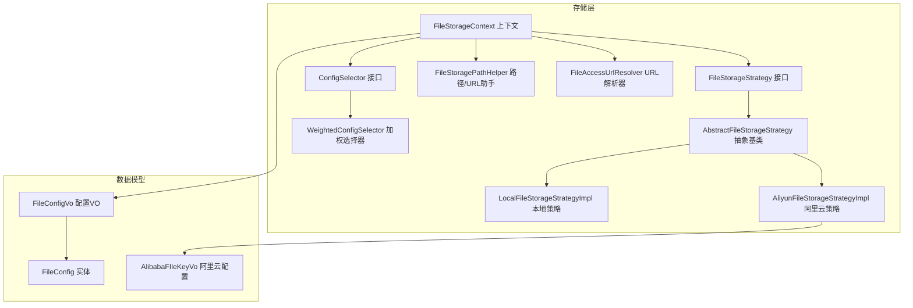
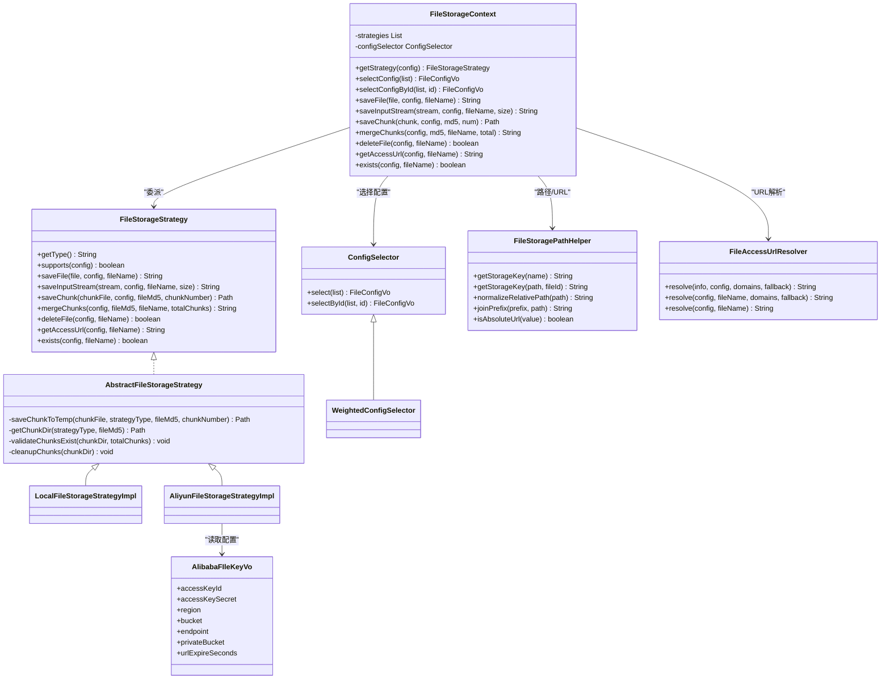
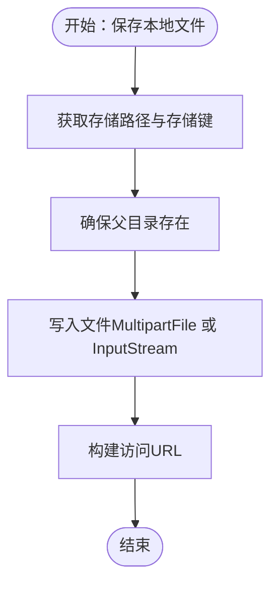
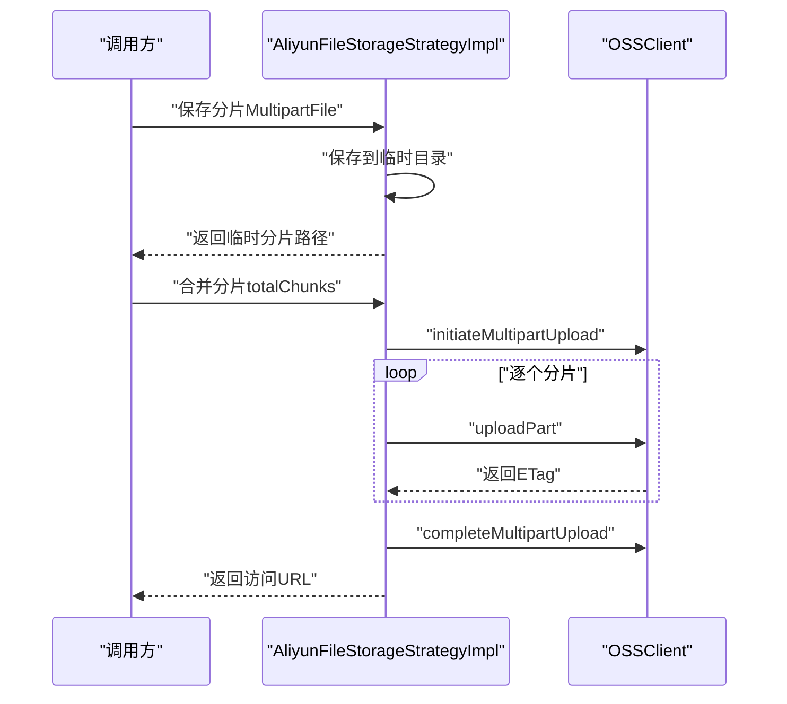
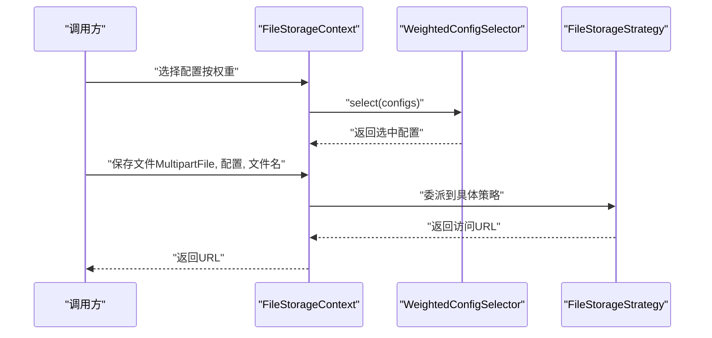
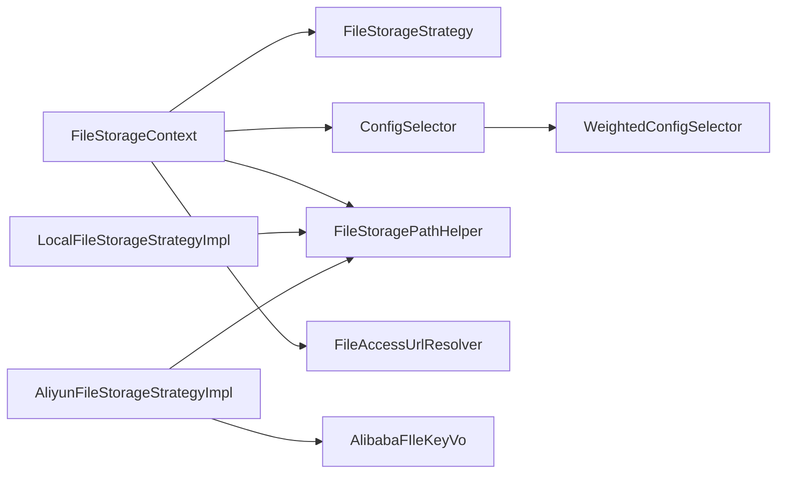

# 文件存储架构

<cite>
**本文引用的文件**
- [FileStorageStrategy.java](file://file-module/src/main/java/com/fastproject/file/storage/FileStorageStrategy.java)
- [AbstractFileStorageStrategy.java](file://file-module/src/main/java/com/fastproject/file/storage/AbstractFileStorageStrategy.java)
- [LocalFileStorageStrategyImpl.java](file://file-module/src/main/java/com/fastproject/file/storage/impl/LocalFileStorageStrategyImpl.java)
- [AliyunFileStorageStrategyImpl.java](file://file-module/src/main/java/com/fastproject/file/storage/impl/AliyunFileStorageStrategyImpl.java)
- [FileStorageContext.java](file://file-module/src/main/java/com/fastproject/file/storage/FileStorageContext.java)
- [ConfigSelector.java](file://file-module/src/main/java/com/fastproject/file/storage/ConfigSelector.java)
- [WeightedConfigSelector.java](file://file-module/src/main/java/com/fastproject/file/storage/WeightedConfigSelector.java)
- [FileStoragePathHelper.java](file://file-module/src/main/java/com/fastproject/file/storage/FileStoragePathHelper.java)
- [FileAccessUrlResolver.java](file://file-module/src/main/java/com/fastproject/file/storage/FileAccessUrlResolver.java)
- [AlibabaFIleKeyVo.java](file://file-module/src/main/java/com/fastproject/file/storage/vo/AlibabaFIleKeyVo.java)
- [FileConfigVo.java](file://file-module/src/main/java/com/fastproject/file/vo/config/FileConfigVo.java)
- [FileConfig.java](file://file-module/src/main/java/com/fastproject/file/domain/FileConfig.java)
</cite>

## 目录
1. [简介](#简介)
2. [项目结构](#项目结构)
3. [核心组件](#核心组件)
4. [架构总览](#架构总览)
5. [组件详解](#组件详解)
6. [依赖关系分析](#依赖关系分析)
7. [性能与成本优化](#性能与成本优化)
8. [故障排查指南](#故障排查指南)
9. [结论](#结论)
10. [附录](#附录)

## 简介
本文件存储架构围绕“双存储策略”设计，同时支持本地文件系统与阿里云 OSS 的统一抽象与编排。通过策略接口与上下文解耦具体实现，结合配置选择器与路径/URL 解析器，形成可扩展、可运维、可优化的文件存储体系。本文档将深入解析以下内容：
- 接口与抽象基类的设计思想与职责边界
- 本地存储策略的路径管理、访问URL解析与安全机制
- 阿里云 OSS 策略的 SDK 集成、分片上传与签名URL生成
- 配置选择器与加权选择器的负载均衡策略
- 文件上传/下载、断点续传、权限控制与访问控制
- 成本优化与性能调优建议

## 项目结构
文件存储模块位于 file-module 中，采用按职责分层与按功能域划分相结合的方式组织代码：
- storage 层：定义策略接口、抽象基类、具体策略实现、上下文、路径与URL解析器、配置选择器
- vo 层：面向配置与领域对象的数据传输对象
- domain 层：数据库实体映射

图表来源
- [FileStorageStrategy.java](file://file-module/src/main/java/com/fastproject/file/storage/FileStorageStrategy.java#L1-L105)
- [AbstractFileStorageStrategy.java](file://file-module/src/main/java/com/fastproject/file/storage/AbstractFileStorageStrategy.java#L1-L59)
- [LocalFileStorageStrategyImpl.java](file://file-module/src/main/java/com/fastproject/file/storage/impl/LocalFileStorageStrategyImpl.java#L1-L170)
- [AliyunFileStorageStrategyImpl.java](file://file-module/src/main/java/com/fastproject/file/storage/impl/AliyunFileStorageStrategyImpl.java#L1-L284)
- [FileStorageContext.java](file://file-module/src/main/java/com/fastproject/file/storage/FileStorageContext.java#L1-L128)
- [ConfigSelector.java](file://file-module/src/main/java/com/fastproject/file/storage/ConfigSelector.java#L1-L38)
- [WeightedConfigSelector.java](file://file-module/src/main/java/com/fastproject/file/storage/WeightedConfigSelector.java#L1-L66)
- [FileStoragePathHelper.java](file://file-module/src/main/java/com/fastproject/file/storage/FileStoragePathHelper.java#L1-L50)
- [FileAccessUrlResolver.java](file://file-module/src/main/java/com/fastproject/file/storage/FileAccessUrlResolver.java#L1-L97)
- [AlibabaFIleKeyVo.java](file://file-module/src/main/java/com/fastproject/file/storage/vo/AlibabaFIleKeyVo.java#L1-L41)
- [FileConfigVo.java](file://file-module/src/main/java/com/fastproject/file/vo/config/FileConfigVo.java#L1-L61)
- [FileConfig.java](file://file-module/src/main/java/com/fastproject/file/domain/FileConfig.java#L1-L66)

章节来源
- [FileStorageStrategy.java](file://file-module/src/main/java/com/fastproject/file/storage/FileStorageStrategy.java#L1-L105)
- [FileStorageContext.java](file://file-module/src/main/java/com/fastproject/file/storage/FileStorageContext.java#L1-L128)

## 核心组件
- FileStorageStrategy：定义统一的文件存储能力集，包括保存、分片、合并、删除、URL获取、存在性检查等
- AbstractFileStorageStrategy：提供分片临时目录管理、分片校验与清理等通用能力
- LocalFileStorageStrategyImpl：基于本地文件系统的实现，负责路径规范化、目录创建、文件写入、分片合并与URL拼接
- AliyunFileStorageStrategyImpl：基于阿里云 OSS SDK 的实现，负责直传、分片上传、合并、签名URL生成、存在性检查与删除
- FileStorageContext：策略选择与委派，封装配置选择、缓存与统一调用入口
- ConfigSelector/WeightedConfigSelector：多配置选择与加权负载均衡
- FileStoragePathHelper：存储键规范化、相对路径与前缀拼接、绝对URL判断
- FileAccessUrlResolver：统一URL解析与回退策略，屏蔽底层差异

章节来源
- [FileStorageStrategy.java](file://file-module/src/main/java/com/fastproject/file/storage/FileStorageStrategy.java#L1-L105)
- [AbstractFileStorageStrategy.java](file://file-module/src/main/java/com/fastproject/file/storage/AbstractFileStorageStrategy.java#L1-L59)
- [LocalFileStorageStrategyImpl.java](file://file-module/src/main/java/com/fastproject/file/storage/impl/LocalFileStorageStrategyImpl.java#L1-L170)
- [AliyunFileStorageStrategyImpl.java](file://file-module/src/main/java/com/fastproject/file/storage/impl/AliyunFileStorageStrategyImpl.java#L1-L284)
- [FileStorageContext.java](file://file-module/src/main/java/com/fastproject/file/storage/FileStorageContext.java#L1-L128)
- [ConfigSelector.java](file://file-module/src/main/java/com/fastproject/file/storage/ConfigSelector.java#L1-L38)
- [WeightedConfigSelector.java](file://file-module/src/main/java/com/fastproject/file/storage/WeightedConfigSelector.java#L1-L66)
- [FileStoragePathHelper.java](file://file-module/src/main/java/com/fastproject/file/storage/FileStoragePathHelper.java#L1-L50)
- [FileAccessUrlResolver.java](file://file-module/src/main/java/com/fastproject/file/storage/FileAccessUrlResolver.java#L1-L97)

## 架构总览
整体采用“策略+上下文+选择器+助手”的分层架构，实现对本地与OSS的统一抽象与灵活切换。

图表来源
- [FileStorageStrategy.java](file://file-module/src/main/java/com/fastproject/file/storage/FileStorageStrategy.java#L1-L105)
- [AbstractFileStorageStrategy.java](file://file-module/src/main/java/com/fastproject/file/storage/AbstractFileStorageStrategy.java#L1-L59)
- [LocalFileStorageStrategyImpl.java](file://file-module/src/main/java/com/fastproject/file/storage/impl/LocalFileStorageStrategyImpl.java#L1-L170)
- [AliyunFileStorageStrategyImpl.java](file://file-module/src/main/java/com/fastproject/file/storage/impl/AliyunFileStorageStrategyImpl.java#L1-L284)
- [FileStorageContext.java](file://file-module/src/main/java/com/fastproject/file/storage/FileStorageContext.java#L1-L128)
- [ConfigSelector.java](file://file-module/src/main/java/com/fastproject/file/storage/ConfigSelector.java#L1-L38)
- [WeightedConfigSelector.java](file://file-module/src/main/java/com/fastproject/file/storage/WeightedConfigSelector.java#L1-L66)
- [FileStoragePathHelper.java](file://file-module/src/main/java/com/fastproject/file/storage/FileStoragePathHelper.java#L1-L50)
- [FileAccessUrlResolver.java](file://file-module/src/main/java/com/fastproject/file/storage/FileAccessUrlResolver.java#L1-L97)
- [AlibabaFIleKeyVo.java](file://file-module/src/main/java/com/fastproject/file/storage/vo/AlibabaFIleKeyVo.java#L1-L41)

## 组件详解

### 接口与抽象基类
- FileStorageStrategy：定义统一能力集，确保本地与OSS策略对外一致
- AbstractFileStorageStrategy：集中处理分片的临时目录创建、分片校验与清理，减少重复逻辑

章节来源
- [FileStorageStrategy.java](file://file-module/src/main/java/com/fastproject/file/storage/FileStorageStrategy.java#L1-L105)
- [AbstractFileStorageStrategy.java](file://file-module/src/main/java/com/fastproject/file/storage/AbstractFileStorageStrategy.java#L1-L59)

### 本地存储策略 LocalFileStorageStrategyImpl
- 职责边界
  - 路径管理：根据配置与文件名生成存储键，保证目录层级化与跨平台兼容
  - 文件写入：支持 MultipartFile 与 InputStream 两种输入源
  - 分片与合并：将分片暂存到系统临时目录，按顺序合并为最终文件
  - URL 解析：优先使用配置中的访问域名，否则回退到默认前缀
  - 存在性检查与删除：基于文件系统进行判断与删除
- 安全机制
  - 存储路径必须显式配置且以分隔符结尾，防止路径拼接错误
  - 使用存储键规范化，避免路径穿越与非法字符
  - 通过 FileStoragePathHelper 统一前缀拼接与绝对URL判定

图表来源
- [LocalFileStorageStrategyImpl.java](file://file-module/src/main/java/com/fastproject/file/storage/impl/LocalFileStorageStrategyImpl.java#L44-L78)
- [FileStoragePathHelper.java](file://file-module/src/main/java/com/fastproject/file/storage/FileStoragePathHelper.java#L9-L31)

章节来源
- [LocalFileStorageStrategyImpl.java](file://file-module/src/main/java/com/fastproject/file/storage/impl/LocalFileStorageStrategyImpl.java#L1-L170)
- [FileStoragePathHelper.java](file://file-module/src/main/java/com/fastproject/file/storage/FileStoragePathHelper.java#L1-L50)

### 阿里云 OSS 存储策略 AliyunFileStorageStrategyImpl
- SDK 集成
  - 使用 OSSClient 构建器与静态凭据提供者进行认证
  - 支持 Endpoint、Region、Bucket 等参数配置
- 直传与分片
  - 直传：将 InputStream 包装为 BinaryData 直接上传
  - 分片：初始化多部分上传，逐个上传分片并收集ETag，最后完成合并
- 签名URL与私有桶
  - 私有桶时生成带过期时间的预签名URL
  - 公有桶时优先使用配置域名或远程URL，否则构造默认访问前缀
- 存在性检查与删除
  - 通过 HeadObject 判断文件是否存在；删除使用 DeleteObject
- 错误处理
  - 对异常进行捕获并转换为业务异常，记录日志以便排查

图表来源
- [AliyunFileStorageStrategyImpl.java](file://file-module/src/main/java/com/fastproject/file/storage/impl/AliyunFileStorageStrategyImpl.java#L85-L148)

章节来源
- [AliyunFileStorageStrategyImpl.java](file://file-module/src/main/java/com/fastproject/file/storage/impl/AliyunFileStorageStrategyImpl.java#L1-L284)
- [AlibabaFIleKeyVo.java](file://file-module/src/main/java/com/fastproject/file/storage/vo/AlibabaFIleKeyVo.java#L1-L41)

### 存储上下文与配置选择
- FileStorageContext
  - 依据配置类型选择对应策略，若不支持则抛出业务异常
  - 统一封装保存、分片、合并、删除、URL获取与存在性检查
  - 内部维护配置缓存，降低重复查找开销
- ConfigSelector/WeightedConfigSelector
  - 支持按ID选择与随机加权选择
  - 只选择状态为启用的配置，权重越大被选中概率越高

图表来源
- [FileStorageContext.java](file://file-module/src/main/java/com/fastproject/file/storage/FileStorageContext.java#L36-L126)
- [WeightedConfigSelector.java](file://file-module/src/main/java/com/fastproject/file/storage/WeightedConfigSelector.java#L22-L64)

章节来源
- [FileStorageContext.java](file://file-module/src/main/java/com/fastproject/file/storage/FileStorageContext.java#L1-L128)
- [ConfigSelector.java](file://file-module/src/main/java/com/fastproject/file/storage/ConfigSelector.java#L1-L38)
- [WeightedConfigSelector.java](file://file-module/src/main/java/com/fastproject/file/storage/WeightedConfigSelector.java#L1-L66)

### 路径与URL解析
- FileStoragePathHelper
  - 规范化存储键，去除多余斜杠与前导斜杠
  - 统一相对路径与前缀拼接，支持绝对URL识别
- FileAccessUrlResolver
  - 优先策略返回的URL，其次选择可用域名，再次回退到配置域名/远程URL，最后使用相对路径

章节来源
- [FileStoragePathHelper.java](file://file-module/src/main/java/com/fastproject/file/storage/FileStoragePathHelper.java#L1-L50)
- [FileAccessUrlResolver.java](file://file-module/src/main/java/com/fastproject/file/storage/FileAccessUrlResolver.java#L1-L97)

### 数据模型与配置
- FileConfigVo：前端/服务端交互的配置对象，包含存储路径、访问域名、状态、类型、权重、远程URL/Token以及JSON配置
- AlibabaFIleKeyVo：阿里云OSS配置载体，包含AK、Region、Bucket、Endpoint、是否私有桶、签名URL过期时间等
- FileConfig：数据库实体，持久化上述字段

章节来源
- [FileConfigVo.java](file://file-module/src/main/java/com/fastproject/file/vo/config/FileConfigVo.java#L1-L61)
- [AlibabaFIleKeyVo.java](file://file-module/src/main/java/com/fastproject/file/storage/vo/AlibabaFIleKeyVo.java#L1-L41)
- [FileConfig.java](file://file-module/src/main/java/com/fastproject/file/domain/FileConfig.java#L1-L66)

## 依赖关系分析
- 策略与上下文：FileStorageContext 通过构造注入聚合策略列表，并根据配置类型动态选择策略
- 选择器：WeightedConfigSelector 仅依赖 FileConfigVo 的状态与权重字段，逻辑清晰、可测试性强
- 路径/URL：FileStoragePathHelper 与 FileAccessUrlResolver 作为纯工具类，无副作用，便于复用
- OSS 策略：AliyunFileStorageStrategyImpl 依赖阿里云 SDK 的客户端与请求模型，封装了上传、分片、签名与存在性检查

图表来源
- [FileStorageContext.java](file://file-module/src/main/java/com/fastproject/file/storage/FileStorageContext.java#L24-L28)
- [WeightedConfigSelector.java](file://file-module/src/main/java/com/fastproject/file/storage/WeightedConfigSelector.java#L17-L19)
- [AliyunFileStorageStrategyImpl.java](file://file-module/src/main/java/com/fastproject/file/storage/impl/AliyunFileStorageStrategyImpl.java#L41-L45)
- [LocalFileStorageStrategyImpl.java](file://file-module/src/main/java/com/fastproject/file/storage/impl/LocalFileStorageStrategyImpl.java#L32-L32)

章节来源
- [FileStorageContext.java](file://file-module/src/main/java/com/fastproject/file/storage/FileStorageContext.java#L1-L128)
- [WeightedConfigSelector.java](file://file-module/src/main/java/com/fastproject/file/storage/WeightedConfigSelector.java#L1-L66)
- [AliyunFileStorageStrategyImpl.java](file://file-module/src/main/java/com/fastproject/file/storage/impl/AliyunFileStorageStrategyImpl.java#L1-L284)
- [LocalFileStorageStrategyImpl.java](file://file-module/src/main/java/com/fastproject/file/storage/impl/LocalFileStorageStrategyImpl.java#L1-L170)

## 性能与成本优化
- 本地存储
  - 使用异步或批量写入减少IO阻塞
  - 合理设置存储根路径，避免单目录文件过多导致性能下降
  - 对大文件采用分片合并，避免一次性占用过多内存
- 阿里云 OSS
  - 大文件优先使用分片上传，提升成功率与速度
  - 私有桶建议使用签名URL，缩短过期时间以降低泄露风险
  - 合理设置CDN加速域名与缓存策略，减少回源压力
- 配置选择
  - 通过权重实现流量倾斜，将热点配置的命中率最大化
  - 结合健康检查与熔断策略，避免将流量导向不可用配置
- 成本控制
  - 评估冷热数据，将热数据迁移至更快存储
  - 合理设置生命周期规则，自动降级至低频存储
  - 控制签名URL有效期，避免长期暴露带来的安全与成本风险

## 故障排查指南
- 策略不支持
  - 现象：抛出“不支持的存储类型”异常
  - 排查：确认配置类型与策略类型一致，检查策略注册与Bean命名
- 本地路径为空或非法
  - 现象：保存失败或路径异常
  - 排查：确认配置中存储路径非空且以分隔符结尾；检查文件系统权限
- OSS 凭证缺失或不完整
  - 现象：上传/签名失败
  - 排查：确认配置JSON中AK、Region、Bucket、Endpoint齐全；核对私有桶标志与过期时间
- 分片未就绪
  - 现象：合并失败
  - 排查：检查分片目录是否存在、数量是否匹配；确认临时目录清理策略
- URL 解析异常
  - 现象：访问地址为空或不可用
  - 排查：确认策略返回URL是否为绝对URL；检查域名选择器与回退逻辑

章节来源
- [FileStorageContext.java](file://file-module/src/main/java/com/fastproject/file/storage/FileStorageContext.java#L36-L45)
- [LocalFileStorageStrategyImpl.java](file://file-module/src/main/java/com/fastproject/file/storage/impl/LocalFileStorageStrategyImpl.java#L158-L167)
- [AliyunFileStorageStrategyImpl.java](file://file-module/src/main/java/com/fastproject/file/storage/impl/AliyunFileStorageStrategyImpl.java#L219-L237)
- [AbstractFileStorageStrategy.java](file://file-module/src/main/java/com/fastproject/file/storage/AbstractFileStorageStrategy.java#L30-L37)
- [FileAccessUrlResolver.java](file://file-module/src/main/java/com/fastproject/file/storage/FileAccessUrlResolver.java#L78-L95)

## 结论
该文件存储架构通过统一接口与抽象基类，将本地与OSS的差异屏蔽在策略内部，配合上下文与选择器实现灵活的配置管理与负载均衡。路径与URL解析器进一步简化了业务侧的接入复杂度。整体设计具备良好的扩展性、可维护性与可观测性，适合在多租户、高并发场景下稳定运行。

## 附录
- 断点续传与分片
  - 本地与OSS均支持分片保存与合并，建议在前端实现分片上传与进度上报
- 访问权限控制
  - 私有桶通过签名URL授权访问；公有桶可通过域名与CDN策略控制访问范围
- 下载流程
  - 优先从策略获取URL；若策略返回绝对URL则直接使用；否则由域名选择器与回退策略拼装