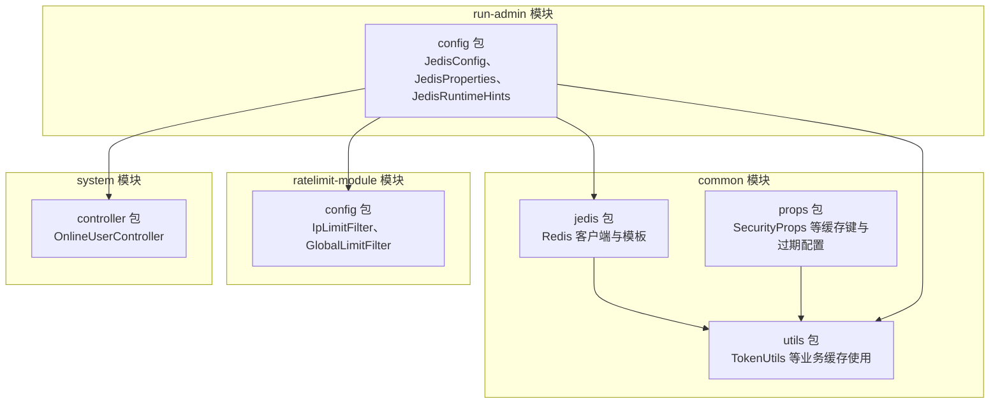
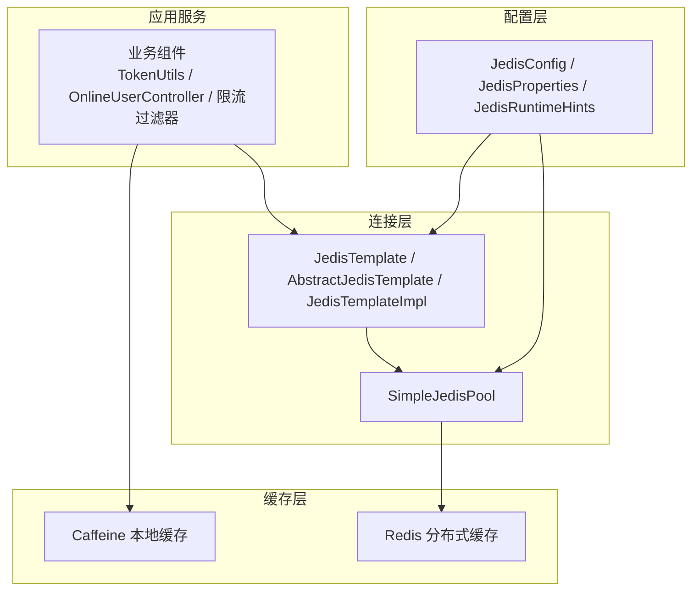
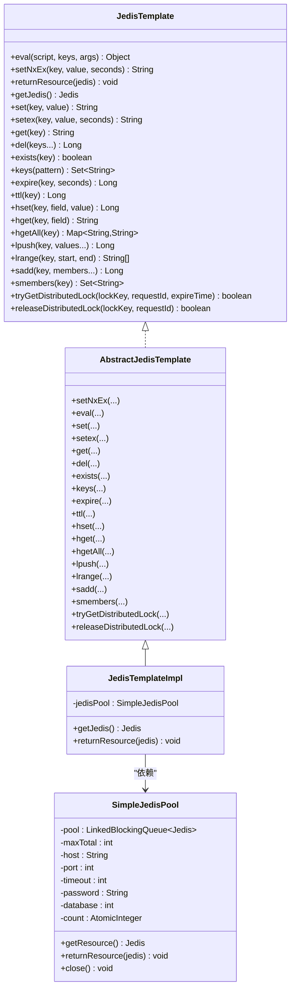
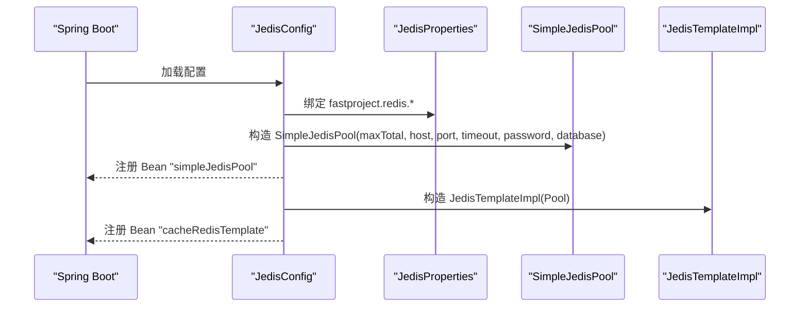
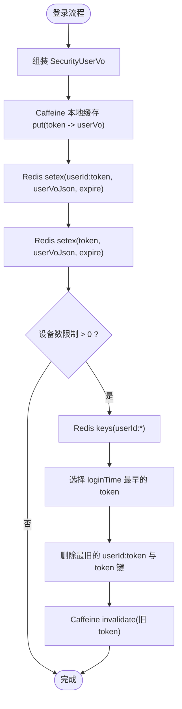
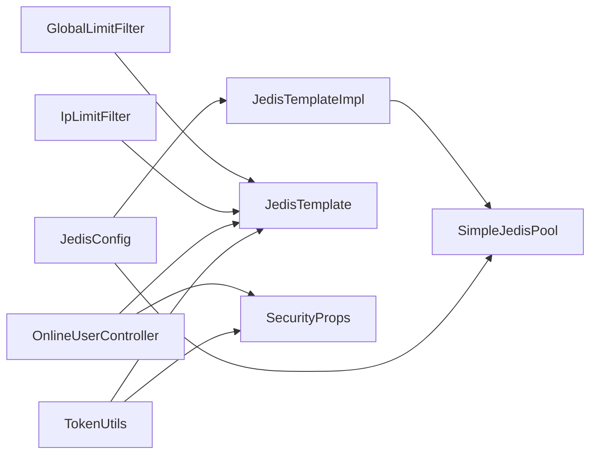

# 缓存架构

<cite>
**本文引用的文件**
- [SimpleJedisPool.java](file://common/src/main/java/com/fastproject/jedis/SimpleJedisPool.java)
- [JedisTemplate.java](file://common/src/main/java/com/fastproject/jedis/JedisTemplate.java)
- [AbstractJedisTemplate.java](file://common/src/main/java/com/fastproject/jedis/AbstractJedisTemplate.java)
- [JedisTemplateImpl.java](file://common/src/main/java/com/fastproject/jedis/JedisTemplateImpl.java)
- [JedisConfig.java](file://run-admin/src/main/java/com/fastproject/config/JedisConfig.java)
- [JedisProperties.java](file://run-admin/src/main/java/com/fastproject/config/JedisProperties.java)
- [JedisRuntimeHints.java](file://run-admin/src/main/java/com/fastproject/config/JedisRuntimeHints.java)
- [TokenUtils.java](file://common/src/main/java/com/fastproject/utils/TokenUtils.java)
- [SecurityProps.java](file://common/src/main/java/com/fastproject/props/SecurityProps.java)
- [OnlineUserController.java](file://run-admin/src/main/java/com/fastproject/module/system/controller/OnlineUserController.java)
- [IpLimitFilter.java](file://ratelimit-module/src/main/java/com/fastproject/ratelimit/config/IpLimitFilter.java)
- [GlobalLimitFilter.java](file://ratelimit-module/src/main/java/com/fastproject/ratelimit/config/GlobalLimitFilter.java)
</cite>

## 目录
1. [简介](#简介)
2. [项目结构](#项目结构)
3. [核心组件](#核心组件)
4. [架构总览](#架构总览)
5. [组件详解](#组件详解)
6. [依赖关系分析](#依赖关系分析)
7. [性能考量](#性能考量)
8. [故障排查指南](#故障排查指南)
9. [结论](#结论)
10. [附录](#附录)

## 简介
本文件系统性梳理 Fast 项目的缓存架构，重点阐述“Redis 分布式缓存 + Caffeine 本地缓存”的双层协同机制。内容覆盖：
- Redis 配置与连接池管理（SimpleJedisPool 实现原理、JedisTemplate 封装设计）
- 缓存数据模型设计（用户信息缓存、权限数据缓存、配置信息缓存策略）
- 缓存失效策略、缓存穿透防护与缓存雪崩预防
- 缓存性能监控、一致性保障与序列化方案
- 缓存调优参数与最佳实践建议

## 项目结构
缓存相关代码主要分布在以下模块与包：
- Redis 客户端与连接池：common 模块的 jedis 包
- Spring 配置与属性绑定：run-admin 模块的 config 包
- 业务侧缓存使用：common 模块的 utils 包（TokenUtils）、system 模块的 controller（OnlineUserController）、ratelimit 模块的 config 包（IpLimitFilter、GlobalLimitFilter）

**图表来源**
- [JedisConfig.java](file://run-admin/src/main/java/com/fastproject/config/JedisConfig.java#L1-L55)
- [JedisProperties.java](file://run-admin/src/main/java/com/fastproject/config/JedisProperties.java#L1-L31)
- [JedisTemplate.java](file://common/src/main/java/com/fastproject/jedis/JedisTemplate.java#L1-L199)
- [TokenUtils.java](file://common/src/main/java/com/fastproject/utils/TokenUtils.java#L1-L128)
- [SecurityProps.java](file://common/src/main/java/com/fastproject/props/SecurityProps.java#L1-L24)
- [OnlineUserController.java](file://run-admin/src/main/java/com/fastproject/module/system/controller/OnlineUserController.java#L33-L87)
- [IpLimitFilter.java](file://ratelimit-module/src/main/java/com/fastproject/ratelimit/config/IpLimitFilter.java#L40-L56)
- [GlobalLimitFilter.java](file://ratelimit-module/src/main/java/com/fastproject/ratelimit/config/GlobalLimitFilter.java#L84-L106)

**章节来源**
- [JedisConfig.java](file://run-admin/src/main/java/com/fastproject/config/JedisConfig.java#L1-L55)
- [JedisProperties.java](file://run-admin/src/main/java/com/fastproject/config/JedisProperties.java#L1-L31)
- [JedisTemplate.java](file://common/src/main/java/com/fastproject/jedis/JedisTemplate.java#L1-L199)
- [TokenUtils.java](file://common/src/main/java/com/fastproject/utils/TokenUtils.java#L1-L128)
- [SecurityProps.java](file://common/src/main/java/com/fastproject/props/SecurityProps.java#L1-L24)
- [OnlineUserController.java](file://run-admin/src/main/java/com/fastproject/module/system/controller/OnlineUserController.java#L33-L87)
- [IpLimitFilter.java](file://ratelimit-module/src/main/java/com/fastproject/ratelimit/config/IpLimitFilter.java#L40-L56)
- [GlobalLimitFilter.java](file://ratelimit-module/src/main/java/com/fastproject/ratelimit/config/GlobalLimitFilter.java#L84-L106)

## 核心组件
- SimpleJedisPool：轻量级 Redis 连接池，解决 Native Image 下 commons-pool2 兼容性问题，支持连接复用、健康检查与阻塞等待。
- JedisTemplate 接口与 AbstractJedisTemplate 抽象实现：统一 Redis 操作入口，封装常用命令与分布式锁能力。
- JedisTemplateImpl：面向 SimpleJedisPool 的具体实现，负责连接获取与归还。
- JedisConfig + JedisProperties：Spring 配置与属性绑定，负责连接池与模板 Bean 的装配。
- TokenUtils：业务侧缓存使用范例，采用 Caffeine 本地缓存 + Redis 分布式缓存的双层策略。
- OnlineUserController：基于 Redis 的在线用户查询与统计。
- IpLimitFilter / GlobalLimitFilter：限流模块中使用 Caffeine 缓存配置与令牌桶状态，降低 Redis 压力。

**章节来源**
- [SimpleJedisPool.java](file://common/src/main/java/com/fastproject/jedis/SimpleJedisPool.java#L1-L96)
- [JedisTemplate.java](file://common/src/main/java/com/fastproject/jedis/JedisTemplate.java#L1-L199)
- [AbstractJedisTemplate.java](file://common/src/main/java/com/fastproject/jedis/AbstractJedisTemplate.java#L1-L298)
- [JedisTemplateImpl.java](file://common/src/main/java/com/fastproject/jedis/JedisTemplateImpl.java#L1-L33)
- [JedisConfig.java](file://run-admin/src/main/java/com/fastproject/config/JedisConfig.java#L1-L55)
- [JedisProperties.java](file://run-admin/src/main/java/com/fastproject/config/JedisProperties.java#L1-L31)
- [TokenUtils.java](file://common/src/main/java/com/fastproject/utils/TokenUtils.java#L1-L128)
- [OnlineUserController.java](file://run-admin/src/main/java/com/fastproject/module/system/controller/OnlineUserController.java#L33-L87)
- [IpLimitFilter.java](file://ratelimit-module/src/main/java/com/fastproject/ratelimit/config/IpLimitFilter.java#L40-L56)
- [GlobalLimitFilter.java](file://ratelimit-module/src/main/java/com/fastproject/ratelimit/config/GlobalLimitFilter.java#L84-L106)

## 架构总览
双层缓存协同工作流程：
- 本地缓存（Caffeine）：热点数据就近存储，降低网络开销与 Redis 压力。
- 分布式缓存（Redis）：跨节点共享，保障一致性与可扩展性。
- 连接层（SimpleJedisPool + JedisTemplate）：统一封装 Redis 操作，提供连接池管理与异常处理。

**图表来源**
- [TokenUtils.java](file://common/src/main/java/com/fastproject/utils/TokenUtils.java#L1-L128)
- [OnlineUserController.java](file://run-admin/src/main/java/com/fastproject/module/system/controller/OnlineUserController.java#L33-L87)
- [IpLimitFilter.java](file://ratelimit-module/src/main/java/com/fastproject/ratelimit/config/IpLimitFilter.java#L40-L56)
- [GlobalLimitFilter.java](file://ratelimit-module/src/main/java/com/fastproject/ratelimit/config/GlobalLimitFilter.java#L84-L106)
- [SimpleJedisPool.java](file://common/src/main/java/com/fastproject/jedis/SimpleJedisPool.java#L1-L96)
- [JedisTemplate.java](file://common/src/main/java/com/fastproject/jedis/JedisTemplate.java#L1-L199)
- [AbstractJedisTemplate.java](file://common/src/main/java/com/fastproject/jedis/AbstractJedisTemplate.java#L1-L298)
- [JedisTemplateImpl.java](file://common/src/main/java/com/fastproject/jedis/JedisTemplateImpl.java#L1-L33)
- [JedisConfig.java](file://run-admin/src/main/java/com/fastproject/config/JedisConfig.java#L1-L55)
- [JedisProperties.java](file://run-admin/src/main/java/com/fastproject/config/JedisProperties.java#L1-L31)

## 组件详解

### Redis 连接池与模板体系
- SimpleJedisPool
  - 功能要点：固定容量队列持有 Jedis 连接；获取时校验连接可用性（ping）；超过上限阻塞等待；关闭时回收连接。
  - 关键参数：最大连接数、主机、端口、超时、密码、数据库索引。
  - 异常处理：无效连接会关闭并递减计数，确保池内连接健康。
- JedisTemplate 接口
  - 能力范围：字符串、哈希、列表、集合、键管理、Lua 脚本、分布式锁（NX/EX/PX 原子设置与 Lua 释放）。
- AbstractJedisTemplate 抽象实现
  - 统一模式：每个操作均通过 getJedis 获取连接，finally 中归还连接；异常日志记录。
  - 分布式锁：tryGetDistributedLock 使用 NX+PX；releaseDistributedLock 使用 Lua 原子脚本释放。
- JedisTemplateImpl
  - 依赖 SimpleJedisPool；负责连接获取与归还；未初始化时抛出明确异常提示。

**图表来源**
- [JedisTemplate.java](file://common/src/main/java/com/fastproject/jedis/JedisTemplate.java#L1-L199)
- [AbstractJedisTemplate.java](file://common/src/main/java/com/fastproject/jedis/AbstractJedisTemplate.java#L1-L298)
- [JedisTemplateImpl.java](file://common/src/main/java/com/fastproject/jedis/JedisTemplateImpl.java#L1-L33)
- [SimpleJedisPool.java](file://common/src/main/java/com/fastproject/jedis/SimpleJedisPool.java#L1-L96)

**章节来源**
- [SimpleJedisPool.java](file://common/src/main/java/com/fastproject/jedis/SimpleJedisPool.java#L1-L96)
- [JedisTemplate.java](file://common/src/main/java/com/fastproject/jedis/JedisTemplate.java#L1-L199)
- [AbstractJedisTemplate.java](file://common/src/main/java/com/fastproject/jedis/AbstractJedisTemplate.java#L1-L298)
- [JedisTemplateImpl.java](file://common/src/main/java/com/fastproject/jedis/JedisTemplateImpl.java#L1-L33)

### Redis 配置与连接池管理
- JedisProperties：绑定 fastproject.redis.* 配置，包含 host、port、password、database、timeout、pool.maxTotal 等。
- JedisConfig：装配 SimpleJedisPool 与 JedisTemplate Bean；注册 JedisRuntimeHints 解决 Native Image 下资源加载问题。
- JedisRuntimeHints：注册 Jedis 所需资源模式，避免 NPE。

**图表来源**
- [JedisConfig.java](file://run-admin/src/main/java/com/fastproject/config/JedisConfig.java#L1-L55)
- [JedisProperties.java](file://run-admin/src/main/java/com/fastproject/config/JedisProperties.java#L1-L31)
- [JedisRuntimeHints.java](file://run-admin/src/main/java/com/fastproject/config/JedisRuntimeHints.java#L1-L15)
- [SimpleJedisPool.java](file://common/src/main/java/com/fastproject/jedis/SimpleJedisPool.java#L1-L96)
- [JedisTemplateImpl.java](file://common/src/main/java/com/fastproject/jedis/JedisTemplateImpl.java#L1-L33)

**章节来源**
- [JedisConfig.java](file://run-admin/src/main/java/com/fastproject/config/JedisConfig.java#L1-L55)
- [JedisProperties.java](file://run-admin/src/main/java/com/fastproject/config/JedisProperties.java#L1-L31)
- [JedisRuntimeHints.java](file://run-admin/src/main/java/com/fastproject/config/JedisRuntimeHints.java#L1-L15)

### 缓存数据模型设计
- 用户信息缓存（TokenUtils）
  - 本地缓存：token -> SecurityUserVo（Caffeine，最大容量、初始容量、写入过期时间）。
  - 分布式缓存：两份 Redis key（用户维度与 token 维度），值为 JSON 序列化后的用户对象，过期时间由 security.expire 控制。
  - 多设备踢人：按登录时间选择最早登录 token 并清理对应 Redis 与本地缓存。
- 权限数据缓存（系统模块）
  - 在线用户查询：通过 Redis keys 模式匹配 token key，再批量 get 获取用户信息，构建在线用户视图。
- 配置信息缓存（限流模块）
  - Caffeine 缓存全局/IP 限流配置，避免频繁访问数据库；结合 Redis 实现令牌桶状态本地缓存，降低请求延迟。

**图表来源**
- [TokenUtils.java](file://common/src/main/java/com/fastproject/utils/TokenUtils.java#L72-L128)
- [SecurityProps.java](file://common/src/main/java/com/fastproject/props/SecurityProps.java#L1-L24)

**章节来源**
- [TokenUtils.java](file://common/src/main/java/com/fastproject/utils/TokenUtils.java#L1-L128)
- [SecurityProps.java](file://common/src/main/java/com/fastproject/props/SecurityProps.java#L1-L24)
- [OnlineUserController.java](file://run-admin/src/main/java/com/fastproject/module/system/controller/OnlineUserController.java#L33-L87)
- [IpLimitFilter.java](file://ratelimit-module/src/main/java/com/fastproject/ratelimit/config/IpLimitFilter.java#L40-L56)
- [GlobalLimitFilter.java](file://ratelimit-module/src/main/java/com/fastproject/ratelimit/config/GlobalLimitFilter.java#L84-L106)

### 缓存失效策略、穿透防护与雪崩预防
- 失效策略
  - 用户信息：以 security.expire（分钟）为单位设置 Redis 过期；本地缓存写入过期时间控制短期热点。
  - 在线用户：通过 Redis TTL 与 keys 扫描进行统计；清理过期或最早登录 token。
- 缓存穿透
  - 限流配置缓存：当数据库无启用配置时，返回空对象占位，避免穿透数据库。
- 缓存雪崩
  - 通过随机过期时间（Redis NX/EX 或 Lua 设置 PX）与本地缓存兜底，避免同一时刻大量过期导致瞬时压力。

**章节来源**
- [TokenUtils.java](file://common/src/main/java/com/fastproject/utils/TokenUtils.java#L72-L128)
- [GlobalLimitFilter.java](file://ratelimit-module/src/main/java/com/fastproject/ratelimit/config/GlobalLimitFilter.java#L84-L106)
- [IpLimitFilter.java](file://ratelimit-module/src/main/java/com/fastproject/ratelimit/config/IpLimitFilter.java#L40-L56)

### 缓存性能监控、一致性与序列化
- 性能监控
  - Caffeine：开启 recordStats，便于统计命中率、加载耗时等指标。
- 一致性
  - 分布式锁：tryGetDistributedLock 使用 NX+PX 原子设置；releaseDistributedLock 使用 Lua 原子脚本释放，避免误删。
  - 多设备踢人：先删除 Redis 键，再失效本地缓存，保证最终一致性。
- 序列化
  - 使用 JSON 序列化用户对象，确保跨语言与版本兼容。

**章节来源**
- [AbstractJedisTemplate.java](file://common/src/main/java/com/fastproject/jedis/AbstractJedisTemplate.java#L257-L295)
- [TokenUtils.java](file://common/src/main/java/com/fastproject/utils/TokenUtils.java#L72-L128)

## 依赖关系分析
- 组件耦合
  - JedisTemplateImpl 依赖 SimpleJedisPool；JedisConfig 负责装配两者。
  - TokenUtils 依赖 JedisTemplate 与 SecurityProps；OnlineUserController 依赖 JedisTemplate 与 SecurityProps。
  - 限流模块的 IpLimitFilter / GlobalLimitFilter 依赖 Caffeine 与 JedisTemplate。
- 外部依赖
  - Redis 客户端：Jedis。
  - 本地缓存：Caffeine。
  - Spring 配置：JedisProperties、JedisConfig、JedisRuntimeHints。

**图表来源**
- [JedisConfig.java](file://run-admin/src/main/java/com/fastproject/config/JedisConfig.java#L1-L55)
- [JedisTemplateImpl.java](file://common/src/main/java/com/fastproject/jedis/JedisTemplateImpl.java#L1-L33)
- [TokenUtils.java](file://common/src/main/java/com/fastproject/utils/TokenUtils.java#L1-L128)
- [OnlineUserController.java](file://run-admin/src/main/java/com/fastproject/module/system/controller/OnlineUserController.java#L33-L87)
- [IpLimitFilter.java](file://ratelimit-module/src/main/java/com/fastproject/ratelimit/config/IpLimitFilter.java#L40-L56)
- [GlobalLimitFilter.java](file://ratelimit-module/src/main/java/com/fastproject/ratelimit/config/GlobalLimitFilter.java#L84-L106)

**章节来源**
- [JedisConfig.java](file://run-admin/src/main/java/com/fastproject/config/JedisConfig.java#L1-L55)
- [JedisTemplateImpl.java](file://common/src/main/java/com/fastproject/jedis/JedisTemplateImpl.java#L1-L33)
- [TokenUtils.java](file://common/src/main/java/com/fastproject/utils/TokenUtils.java#L1-L128)
- [OnlineUserController.java](file://run-admin/src/main/java/com/fastproject/module/system/controller/OnlineUserController.java#L33-L87)
- [IpLimitFilter.java](file://ratelimit-module/src/main/java/com/fastproject/ratelimit/config/IpLimitFilter.java#L40-L56)
- [GlobalLimitFilter.java](file://ratelimit-module/src/main/java/com/fastproject/ratelimit/config/GlobalLimitFilter.java#L84-L106)

## 性能考量
- 连接池参数
  - maxTotal：根据峰值 QPS 与 RT 推导，预留一定冗余；结合业务并发与 GC 行为调整。
  - timeout：建议与业务超时一致，避免长时间阻塞。
  - database：按租户/环境隔离，减少 keys 冲突。
- 本地缓存参数
  - maximumSize：按在线用户规模估算；initialCapacity 预热容量降低冷启动抖动。
  - expireAfterWrite：短 TTL 适配高频变更数据；长 TTL 适配稳定数据。
- Redis 命令优化
  - 批量 keys + mget 减少 RTT。
  - Lua 原子脚本替代多步操作，保证一致性与性能。
- 限流与降级
  - Caffeine 本地令牌桶与配置缓存显著降低 Redis 压力。
  - 限流 Lua 脚本内置 EXPIRE 与 TTL 计算，避免过期风暴。

[本节为通用指导，无需列出具体文件来源]

## 故障排查指南
- 连接池耗尽
  - 现象：获取连接阻塞或抛出中断异常。
  - 排查：检查 maxTotal 是否过小；确认 finally 是否正确归还连接；观察连接 ping 健康检查失败日志。
- 连接不可用
  - 现象：ping 失败或连接异常。
  - 排查：检查 Redis 服务状态、网络连通性、认证与数据库索引；查看 SimpleJedisPool 的告警日志。
- 分布式锁误释放
  - 现象：非持有者释放锁。
  - 排查：确认 requestId 一致性；使用 Lua 原子释放脚本；核对锁键命名规范。
- 缓存不一致
  - 现象：本地缓存与 Redis 不一致。
  - 排查：优先删除 Redis 键，再失效本地缓存；检查过期时间与 TTL 更新逻辑。
- 性能异常
  - 现象：命中率低或延迟高。
  - 排查：评估 maximumSize 与 expireAfterWrite；核对 keys 模式扫描成本；优化 Lua 脚本与批量操作。

**章节来源**
- [SimpleJedisPool.java](file://common/src/main/java/com/fastproject/jedis/SimpleJedisPool.java#L1-L96)
- [AbstractJedisTemplate.java](file://common/src/main/java/com/fastproject/jedis/AbstractJedisTemplate.java#L257-L295)
- [TokenUtils.java](file://common/src/main/java/com/fastproject/utils/TokenUtils.java#L72-L128)

## 结论
Fast 项目的缓存架构通过“Redis 分布式缓存 + Caffeine 本地缓存”的双层协同，在保证一致性与可扩展性的前提下，有效降低了延迟与外部依赖压力。SimpleJedisPool 与 JedisTemplate 的统一封装提供了清晰的连接管理与操作抽象；业务侧通过 TokenUtils、OnlineUserController 与限流模块的配置缓存，展示了缓存策略在真实场景中的落地实践。配合合理的参数调优与监控手段，可在高并发场景下保持稳定与高效。

[本节为总结性内容，无需列出具体文件来源]

## 附录

### 缓存调优参数与最佳实践
- Redis 连接池
  - maxTotal：建议按峰值 QPS × 平均 RT × 1.5~2 预留；结合 GC 与线程池大小综合评估。
  - timeout：与业务超时一致，避免长时间阻塞。
  - database：按租户/环境隔离，减少 keys 冲突。
- Caffeine 本地缓存
  - maximumSize：按在线用户规模估算；initialCapacity 预热容量降低冷启动抖动。
  - expireAfterWrite：短 TTL 适配高频变更数据；长 TTL 适配稳定数据。
  - recordStats：开启统计，持续观察命中率与加载耗时。
- 命令与脚本
  - 优先使用 Lua 原子脚本；批量 keys + mget 降低 RTT。
- 一致性与安全
  - 分布式锁使用 NX+PX 原子设置与 Lua 原子释放；严格校验 requestId。
  - 多设备踢人：先删 Redis 键，再失效本地缓存，保证最终一致性。

[本节为通用指导，无需列出具体文件来源]