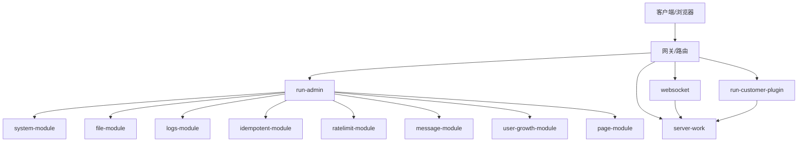
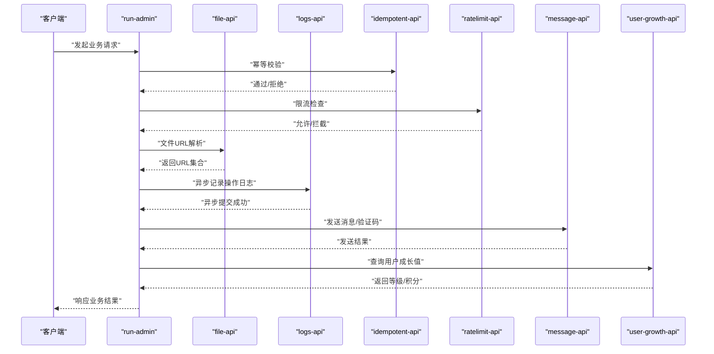
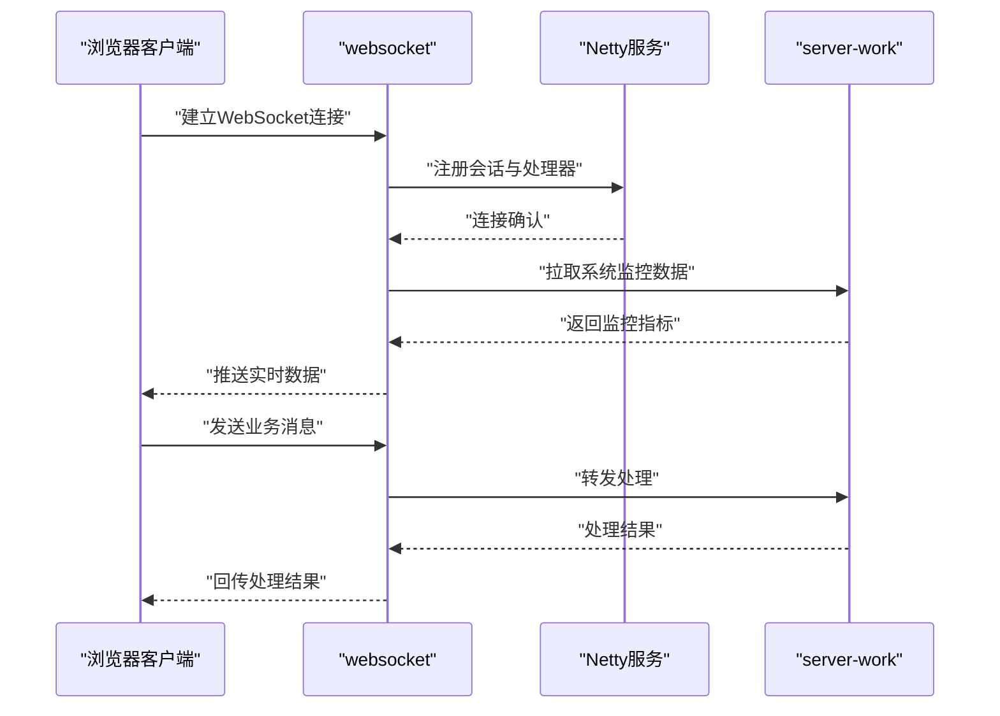
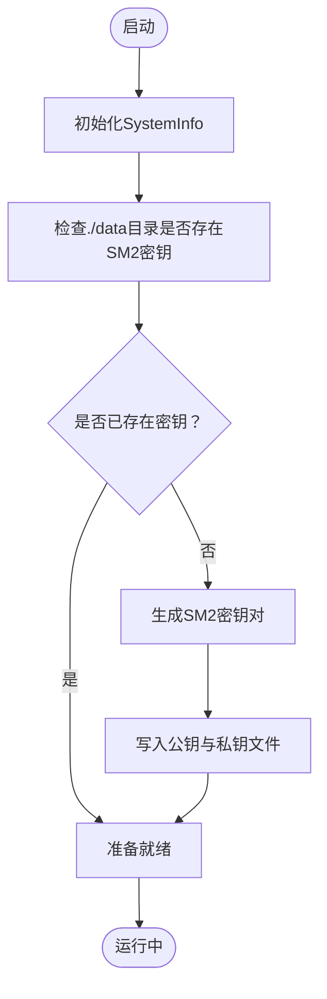
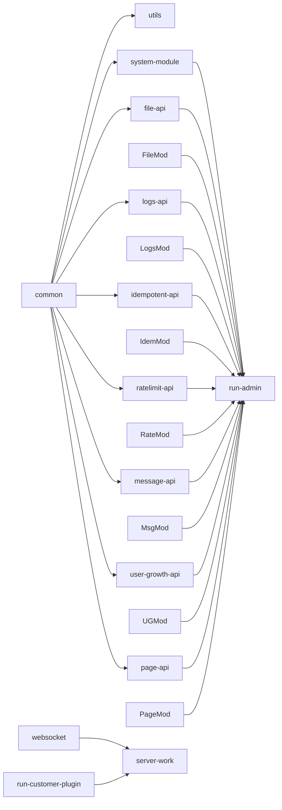

# 整体架构

<cite>
**本文引用的文件**
- [build.gradle](file://build.gradle)
- [settings.gradle](file://settings.gradle)
- [gradle.properties](file://gradle.properties)
- [run-admin/build.gradle](file://run-admin/build.gradle)
- [run-admin/src/main/java/com/fastproject/RunAdmin.java](file://run-admin/src/main/java/com/fastproject/RunAdmin.java)
- [websocket/build.gradle](file://websocket/build.gradle)
- [websocket/src/main/java/com/fastproject/WebSocketRun.java](file://websocket/src/main/java/com/fastproject/WebSocketRun.java)
- [server-work/build.gradle](file://server-work/build.gradle)
- [server-work/src/main/java/com/fastproject/RunServerWork.java](file://server-work/src/main/java/com/fastproject/RunServerWork.java)
- [run-customer-plugin/build.gradle](file://run-customer-plugin/build.gradle)
- [run-customer-plugin/src/main/java/com/fastproject/RunCustomer.java](file://run-customer-plugin/src/main/java/com/fastproject/RunCustomer.java)
- [common/src/main/java/com/fastproject/config/AsyncConfig.java](file://common/src/main/java/com/fastproject/config/AsyncConfig.java)
- [system-module/src/main/java/com/fastproject/system/domain/SysUsers.java](file://system-module/src/main/java/com/fastproject/system/domain/SysUsers.java)
- [file-api/src/main/java/com/fastproject/file/api/FileHandle.java](file://file-api/src/main/java/com/fastproject/file/api/FileHandle.java)
- [logs-api/src/main/java/com/fastproject/logs/api/OperationLogApi.java](file://logs-api/src/main/java/com/fastproject/logs/api/OperationLogApi.java)
- [idempotent-api/src/main/java/com/fastproject/idempotent/api/IdempotentService.java](file://idempotent-api/src/main/java/com/fastproject/idempotent/api/IdempotentService.java)
- [message-api/src/main/java/com/fastproject/message/enums/MessageTypeEnum.java](file://message-api/src/main/java/com/fastproject/message/enums/MessageTypeEnum.java)
- [user-growth-api/src/main/java/com/fastproject/usergrowth/api/UserGrowthApi.java](file://user-growth-api/src/main/java/com/fastproject/usergrowth/api/UserGrowthApi.java)
</cite>

## 目录
1. [引言](#引言)
2. [项目结构](#项目结构)
3. [核心组件](#核心组件)
4. [架构总览](#架构总览)
5. [详细组件分析](#详细组件分析)
6. [依赖分析](#依赖分析)
7. [性能考虑](#性能考虑)
8. [故障排查指南](#故障排查指南)
9. [结论](#结论)
10. [附录](#附录)

## 引言
本文件面向Fast项目的整体架构文档，系统化阐述基于Spring Boot 4.0.3的多模块微服务设计，覆盖24个子模块的组织结构与职责划分、Gradle多模块构建体系、模块间通信机制、服务边界与集成策略，并重点解析run-admin、websocket、server-work、run-customer-plugin四个核心服务的定位与作用。同时提供系统架构图、模块依赖关系图与数据流向图，说明技术栈选择（如Java 25、Spring Boot 4.0.3、PostgreSQL、Redis等）在本项目中的应用场景与价值。

## 项目结构
Fast项目采用Gradle多模块工程，根工程统一管理版本与依赖，各业务域与通用能力拆分为独立子模块，通过settings.gradle集中声明模块清单。构建脚本在根build.gradle中统一引入Spring Boot与依赖管理插件，子模块各自声明所需依赖并继承全局依赖管理BOM。

- 模块分类
  - 通用基础层：common、utils
  - 业务能力层：system-module、file-module、file-api、logs-module、logs-api、idempotent-module、idempotent-api、ratelimit-module、ratelimit-api、message-module、message-api、user-growth-module、user-growth-api、page-module、page-api
  - 应用服务层：run-admin、websocket、server-work、run-customer-plugin

- 构建与运行
  - 根构建脚本启用Spring Boot与依赖管理插件，统一导入Spring Boot 4.0.3 BOM
  - Java版本设置为25，确保使用最新语言特性与性能优化
  - 子模块各自应用Spring Boot插件并声明业务依赖，部分模块启用GraalVM原生镜像支持

```mermaid
graph TB
subgraph "根工程"
Root["根构建脚本<br/>统一版本与依赖管理"]
Settings["模块清单<br/>settings.gradle"]
end
subgraph "通用基础层"
Common["common"]
Utils["utils"]
end
subgraph "业务能力层"
SysMod["system-module"]
FileApi["file-api"]
FileMod["file-module"]
LogsApi["logs-api"]
LogsMod["logs-module"]
IdemApi["idempotent-api"]
IdemMod["idempotent-module"]
RateApi["ratelimit-api"]
RateMod["ratelimit-module"]
MsgApi["message-api"]
MsgMod["message-module"]
UGApi["user-growth-api"]
UGMod["user-growth-module"]
PageApi["page-api"]
PageMod["page-module"]
end
subgraph "应用服务层"
RunAdmin["run-admin"]
WebSocket["websocket"]
ServerWork["server-work"]
RunCustomer["run-customer-plugin"]
end
Root --> Common
Root --> Utils
Root --> SysMod
Root --> FileApi
Root --> FileMod
Root --> LogsApi
Root --> LogsMod
Root --> IdemApi
Root --> IdemMod
Root --> RateApi
Root --> RateMod
Root --> MsgApi
Root --> MsgMod
Root --> UGApi
Root --> UGMod
Root --> PageApi
Root --> PageMod
SysMod --> RunAdmin
FileMod --> RunAdmin
FileApi --> RunAdmin
LogsMod --> RunAdmin
LogsApi --> RunAdmin
IdemMod --> RunAdmin
IdemApi --> RunAdmin
RateMod --> RunAdmin
RateApi --> RunAdmin
MsgMod --> RunAdmin
UGMod --> RunAdmin
PageMod --> RunAdmin
WebSocket --> ServerWork
RunCustomer --> ServerWork
```

图表来源
- [settings.gradle](file://settings.gradle#L1-L24)
- [build.gradle](file://build.gradle#L1-L457)

章节来源
- [settings.gradle](file://settings.gradle#L1-L24)
- [build.gradle](file://build.gradle#L1-L457)
- [gradle.properties](file://gradle.properties#L1-L3)

## 核心组件
本节聚焦四大应用服务模块及其职责边界：

- run-admin
  - 定位：后台管理服务，聚合系统、文件、日志、幂等、限流、消息、用户成长、页面等能力模块，提供统一的管理端REST API入口
  - 关键依赖：Spring Boot Web、Security、JPA、Caffeine缓存、Redis客户端、PostgreSQL驱动
  - 运行入口：RunAdmin主类，启用异步任务以支撑日志等异步处理

- websocket
  - 定位：实时通信服务，基于Netty提供WebSocket能力，承载消息推送、状态同步等场景
  - 关键依赖：Netty、Spring Boot Starter、Thymeleaf、H2数据库、Caffeine、FastJSON
  - 运行入口：WebSocketRun主类

- server-work
  - 定位：工作节点服务，负责系统监控采集、定时任务与本地资源管理；内置SM2密钥生成工具用于授权流程
  - 关键依赖：OSHI系统信息采集、Spring Boot Web、H2数据库、Caffeine
  - 运行入口：RunServerWork主类，启用调度注解

- run-customer-plugin
  - 定位：客户侧插件服务，作为外部客户端接入点，提供轻量级业务能力
  - 关键依赖：Spring Boot Web、JPA、PostgreSQL驱动、Caffeine、FastJSON
  - 运行入口：RunCustomer主类

章节来源
- [run-admin/src/main/java/com/fastproject/RunAdmin.java](file://run-admin/src/main/java/com/fastproject/RunAdmin.java#L1-L14)
- [run-admin/build.gradle](file://run-admin/build.gradle#L1-L6)
- [websocket/src/main/java/com/fastproject/WebSocketRun.java](file://websocket/src/main/java/com/fastproject/WebSocketRun.java#L1-L12)
- [websocket/build.gradle](file://websocket/build.gradle#L1-L6)
- [server-work/src/main/java/com/fastproject/RunServerWork.java](file://server-work/src/main/java/com/fastproject/RunServerWork.java#L1-L57)
- [server-work/build.gradle](file://server-work/build.gradle#L1-L6)
- [run-customer-plugin/src/main/java/com/fastproject/RunCustomer.java](file://run-customer-plugin/src/main/java/com/fastproject/RunCustomer.java#L1-L12)
- [run-customer-plugin/build.gradle](file://run-customer-plugin/build.gradle#L1-L6)

## 架构总览
Fast采用“通用能力+业务能力+应用服务”的三层结构。通用层提供跨域复用的基础设施（common、utils），业务能力层按领域拆分模块并通过API抽象实现解耦，应用服务层对外暴露具体服务并组合多个能力模块。

- 技术栈选择与价值
  - Java 25：获得最新语言特性与JVM性能提升，适配高并发与低延迟场景
  - Spring Boot 4.0.3：现代化框架生态，简化配置与自动装配，配合依赖管理BOM统一版本
  - PostgreSQL：企业级关系型数据库，支持复杂查询与事务一致性
  - Redis：缓存与会话存储，结合Caffeine本地缓存形成两级缓存策略
  - Netty：高性能网络通信框架，满足WebSocket长连接与低延迟消息传输
  - GraalVM原生镜像：缩短启动时间，降低容器资源占用

图表来源
- [build.gradle](file://build.gradle#L92-L134)
- [build.gradle](file://build.gradle#L413-L431)
- [build.gradle](file://build.gradle#L315-L326)
- [build.gradle](file://build.gradle#L435-L456)

## 详细组件分析

### run-admin 服务
- 组件职责
  - 管理端统一入口，整合系统用户、文件、日志、幂等、限流、消息、用户成长、页面等功能模块
  - 提供安全认证、权限控制、数据持久化与缓存策略
- 关键接口与能力
  - 文件能力：通过file-api定义的FileHandle接口进行URL解析与批量查询
  - 日志能力：通过logs-api的OperationLogApi进行操作日志记录与异步落库
  - 幂等能力：通过idempotent-api的IdempotentService进行重复请求防护
  - 限流能力：通过ratelimit-api进行接口级与IP级访问控制
  - 用户成长：通过user-growth-api获取等级与积分账户信息
  - 页面配置：通过page-api/page-module进行页面元数据与组件配置管理
- 异步处理
  - 通过common模块的AsyncConfig配置线程池，保障日志等异步任务不阻塞主线程

图表来源
- [file-api/src/main/java/com/fastproject/file/api/FileHandle.java](file://file-api/src/main/java/com/fastproject/file/api/FileHandle.java#L1-L22)
- [logs-api/src/main/java/com/fastproject/logs/api/OperationLogApi.java](file://logs-api/src/main/java/com/fastproject/logs/api/OperationLogApi.java#L1-L25)
- [idempotent-api/src/main/java/com/fastproject/idempotent/api/IdempotentService.java](file://idempotent-api/src/main/java/com/fastproject/idempotent/api/IdempotentService.java#L1-L19)
- [message-api/src/main/java/com/fastproject/message/enums/MessageTypeEnum.java](file://message-api/src/main/java/com/fastproject/message/enums/MessageTypeEnum.java#L1-L26)
- [user-growth-api/src/main/java/com/fastproject/usergrowth/api/UserGrowthApi.java](file://user-growth-api/src/main/java/com/fastproject/usergrowth/api/UserGrowthApi.java#L1-L13)

章节来源
- [run-admin/build.gradle](file://run-admin/build.gradle#L1-L6)
- [run-admin/src/main/java/com/fastproject/RunAdmin.java](file://run-admin/src/main/java/com/fastproject/RunAdmin.java#L1-L14)
- [common/src/main/java/com/fastproject/config/AsyncConfig.java](file://common/src/main/java/com/fastproject/config/AsyncConfig.java#L1-L48)

### websocket 服务
- 组件职责
  - 提供WebSocket长连接通道，承载实时消息推送、状态同步与事件通知
  - 结合Netty实现高性能网络I/O，结合H2数据库与Caffeine缓存提升本地数据访问效率
- 关键流程
  - 连接建立后，根据业务标识绑定会话，接收消息并转发至对应处理器
  - 与server-work协作，共享系统监控与资源信息

图表来源
- [websocket/build.gradle](file://websocket/build.gradle#L1-L6)
- [websocket/src/main/java/com/fastproject/WebSocketRun.java](file://websocket/src/main/java/com/fastproject/WebSocketRun.java#L1-L12)
- [server-work/build.gradle](file://server-work/build.gradle#L1-L6)
- [server-work/src/main/java/com/fastproject/RunServerWork.java](file://server-work/src/main/java/com/fastproject/RunServerWork.java#L1-L57)

章节来源
- [websocket/build.gradle](file://websocket/build.gradle#L1-L6)
- [websocket/src/main/java/com/fastproject/WebSocketRun.java](file://websocket/src/main/java/com/fastproject/WebSocketRun.java#L1-L12)

### server-work 服务
- 组件职责
  - 工作节点服务，负责系统硬件与进程信息采集、定时任务调度与本地资源管理
  - 内置SM2密钥生成工具，用于授权流程的密钥对生成与持久化
- 关键流程
  - 启动时初始化SystemInfo Bean，提供系统监控能力
  - 提供key方法自动生成并保存SM2公私钥到data目录，确保后续加密/签名流程可用

图表来源
- [server-work/src/main/java/com/fastproject/RunServerWork.java](file://server-work/src/main/java/com/fastproject/RunServerWork.java#L1-L57)

章节来源
- [server-work/build.gradle](file://server-work/build.gradle#L1-L6)
- [server-work/src/main/java/com/fastproject/RunServerWork.java](file://server-work/src/main/java/com/fastproject/RunServerWork.java#L1-L57)

### run-customer-plugin 服务
- 组件职责
  - 客户侧插件服务，作为外部客户端接入点，提供轻量级业务能力与数据访问
  - 可与server-work协作，共享系统监控与资源信息
- 关键流程
  - 启动后通过JPA访问数据库，提供业务查询与更新能力

章节来源
- [run-customer-plugin/build.gradle](file://run-customer-plugin/build.gradle#L1-L6)
- [run-customer-plugin/src/main/java/com/fastproject/RunCustomer.java](file://run-customer-plugin/src/main/java/com/fastproject/RunCustomer.java#L1-L12)

## 依赖分析
- 依赖管理策略
  - 根build.gradle统一导入Spring Boot 4.0.3 BOM，确保所有子模块依赖版本一致
  - 通用模块common与utils被多个业务模块与应用服务依赖，形成稳定的基础层
  - 业务模块通过API抽象向上层暴露能力，避免直接耦合具体实现
- 模块间通信机制
  - 应用服务通过模块依赖直接引入能力模块，实现内聚的单体式微服务
  - 通用配置（如异步线程池）集中在common模块，被run-admin等服务复用

图表来源
- [build.gradle](file://build.gradle#L61-L89)
- [build.gradle](file://build.gradle#L92-L134)
- [build.gradle](file://build.gradle#L413-L431)
- [build.gradle](file://build.gradle#L315-L326)
- [build.gradle](file://build.gradle#L435-L456)

章节来源
- [build.gradle](file://build.gradle#L1-L457)
- [settings.gradle](file://settings.gradle#L1-L24)

## 性能考虑
- 缓存策略
  - 二级缓存：本地Caffeine + 远程Redis，热点数据优先命中本地，降低网络开销
  - 异步处理：通过AsyncConfig线程池异步记录日志，避免阻塞请求链路
- 启动与运行
  - 部分模块启用GraalVM原生镜像，缩短启动时间，适合云原生环境
  - Java 25提供更好的JIT编译与内存管理，适合高并发场景
- 网络与I/O
  - websocket服务采用Netty，具备高吞吐与低延迟特性，适合实时通信
  - server-work通过OSHI采集系统信息，结合H2数据库减少外部依赖

## 故障排查指南
- 常见问题定位
  - 启动失败：检查各模块build.gradle中Spring Boot插件与依赖声明是否正确
  - 依赖冲突：确认根build.gradle中Spring Boot BOM导入与子模块依赖版本一致
  - 缓存异常：检查AsyncConfig线程池配置与Redis连接参数
  - WebSocket连接失败：验证Netty依赖与端口占用情况
  - 密钥缺失：确认server-work启动时./data目录存在SM2公私钥文件
- 建议排查步骤
  - 查看模块构建输出与错误日志
  - 使用Gradle依赖树命令检查传递依赖
  - 验证数据库连接与表结构初始化
  - 检查Redis与H2数据库连通性

章节来源
- [gradle.properties](file://gradle.properties#L1-L3)
- [common/src/main/java/com/fastproject/config/AsyncConfig.java](file://common/src/main/java/com/fastproject/config/AsyncConfig.java#L1-L48)
- [server-work/src/main/java/com/fastproject/RunServerWork.java](file://server-work/src/main/java/com/fastproject/RunServerWork.java#L1-L57)

## 结论
Fast项目通过Spring Boot 4.0.3与Gradle多模块工程实现了清晰的服务边界与高效的模块复用。通用层、业务能力层与应用服务层的分层设计，既保证了内聚性，又便于扩展与演进。结合Java 25、PostgreSQL、Redis与Netty等技术栈，系统在性能、可维护性与可扩展性方面具备良好基础。建议后续引入服务发现与网关治理，进一步完善微服务架构的运行时能力。

## 附录
- 术语
  - API模块：仅定义接口与DTO，供其他模块依赖调用
  - Module模块：包含实现、实体、仓储与服务，提供完整能力
- 代码片段路径
  - run-admin主类：[run-admin/src/main/java/com/fastproject/RunAdmin.java](file://run-admin/src/main/java/com/fastproject/RunAdmin.java#L1-L14)
  - websocket主类：[websocket/src/main/java/com/fastproject/WebSocketRun.java](file://websocket/src/main/java/com/fastproject/WebSocketRun.java#L1-L12)
  - server-work主类：[server-work/src/main/java/com/fastproject/RunServerWork.java](file://server-work/src/main/java/com/fastproject/RunServerWork.java#L1-L57)
  - run-customer-plugin主类：[run-customer-plugin/src/main/java/com/fastproject/RunCustomer.java](file://run-customer-plugin/src/main/java/com/fastproject/RunCustomer.java#L1-L12)
  - 异步配置：[common/src/main/java/com/fastproject/config/AsyncConfig.java](file://common/src/main/java/com/fastproject/config/AsyncConfig.java#L1-L48)
  - 用户实体示例：[system-module/src/main/java/com/fastproject/system/domain/SysUsers.java](file://system-module/src/main/java/com/fastproject/system/domain/SysUsers.java#L1-L95)
  - 文件接口：[file-api/src/main/java/com/fastproject/file/api/FileHandle.java](file://file-api/src/main/java/com/fastproject/file/api/FileHandle.java#L1-L22)
  - 日志接口：[logs-api/src/main/java/com/fastproject/logs/api/OperationLogApi.java](file://logs-api/src/main/java/com/fastproject/logs/api/OperationLogApi.java#L1-L25)
  - 幂等接口：[idempotent-api/src/main/java/com/fastproject/idempotent/api/IdempotentService.java](file://idempotent-api/src/main/java/com/fastproject/idempotent/api/IdempotentService.java#L1-L19)
  - 消息类型枚举：[message-api/src/main/java/com/fastproject/message/enums/MessageTypeEnum.java](file://message-api/src/main/java/com/fastproject/message/enums/MessageTypeEnum.java#L1-L26)
  - 用户成长接口：[user-growth-api/src/main/java/com/fastproject/usergrowth/api/UserGrowthApi.java](file://user-growth-api/src/main/java/com/fastproject/usergrowth/api/UserGrowthApi.java#L1-L13)