# 架构设计

<cite>
**本文引用的文件**
- [build.gradle](file://build.gradle)
- [settings.gradle](file://settings.gradle)
- [run-admin/src/main/java/com/fastproject/RunAdmin.java](file://run-admin/src/main/java/com/fastproject/RunAdmin.java)
- [run-admin/src/main/resources/application.yml](file://run-admin/src/main/resources/application.yml)
- [run-admin/src/main/resources/application-dev1.yml](file://run-admin/src/main/resources/application-dev1.yml)
- [run-admin/src/main/resources/application-dev2.yml](file://run-admin/src/main/resources/application-dev2.yml)
- [server-work/src/main/java/com/fastproject/RunServerWork.java](file://server-work/src/main/java/com/fastproject/RunServerWork.java)
- [websocket/src/main/java/com/fastproject/WebSocketRun.java](file://websocket/src/main/java/com/fastproject/WebSocketRun.java)
- [run-customer-plugin/src/main/java/com/fastproject/RunCustomer.java](file://run-customer-plugin/src/main/java/com/fastproject/RunCustomer.java)
- [system-module/build.gradle](file://system-module/build.gradle)
- [file-module/build.gradle](file://file-module/build.gradle)
- [common/bin/main/java/com/fastproject/config/AsyncConfig.class](file://common/bin/main/java/com/fastproject/config/AsyncConfig.class)
- [common/bin/main/java/com/fastproject/jedis/JedisTemplate.class](file://common/bin/main/java/com/fastproject/jedis/JedisTemplate.class)
- [common/bin/main/java/com/fastproject/jedis/SimpleJedisPool.class](file://common/bin/main/java/com/fastproject/jedis/SimpleJedisPool.class)
- [common/bin/main/java/com/fastproject/db/BaseEntity.class](file://common/bin/main/java/com/fastproject/db/BaseEntity.class)
- [common/bin/main/java/com/fastproject/db/PageQuery.class](file://common/bin/main/java/com/fastproject/db/PageQuery.class)
- [common/bin/main/java/com/fastproject/db/QueryHelp.class](file://common/bin/main/java/com/fastproject/db/QueryHelp.class)
- [common/bin/main/java/com/fastproject/db/SnowflakeIdListener.class](file://common/bin/main/java/com/fastproject/db/SnowflakeIdListener.class)
- [common/bin/main/java/com/fastproject/utils/IpUtils.class](file://common/bin/main/java/com/fastproject/utils/IpUtils.class)
- [common/bin/main/java/com/fastproject/utils/SpringContextUtil.class](file://common/bin/main/java/com/fastproject/utils/SpringContextUtil.class)
- [common/bin/main/java/com/fastproject/utils/TokenUtils.class](file://common/bin/main/java/com/fastproject/utils/TokenUtils.class)
- [common/bin/main/java/com/fastproject/utils/XssUtil.class](file://common/bin/main/java/com/fastproject/utils/XssUtil.class)
- [file-module/bin/main/java/com/fastproject/file/storage/FileStorageStrategy.class](file://file-module/bin/main/java/com/fastproject/file/storage/FileStorageStrategy.class)
- [file-module/bin/main/java/com/fastproject/file/storage/AbstractFileStorageStrategy.class](file://file-module/bin/main/java/com/fastproject/file/storage/AbstractFileStorageStrategy.class)
- [file-module/bin/main/java/com/fastproject/file/storage/ConfigSelector.class](file://file-module/bin/main/java/com/fastproject/file/storage/ConfigSelector.class)
- [file-module/bin/main/java/com/fastproject/file/storage/WeightedConfigSelector.class](file://file-module/bin/main/java/com/fastproject/file/storage/WeightedConfigSelector.class)
- [file-module/bin/main/java/com/fastproject/file/storage/FileStorageContext.class](file://file-module/bin/main/java/com/fastproject/file/storage/FileStorageContext.class)
- [file-module/bin/main/java/com/fastproject/file/storage/FileAccessUrlResolver.class](file://file-module/bin/main/java/com/fastproject/file/storage/FileAccessUrlResolver.class)
- [file-module/bin/main/java/com/fastproject/file/storage/FileStoragePathHelper.class](file://file-module/bin/main/java/com/fastproject/file/storage/FileStoragePathHelper.class)
- [file-module/bin/main/java/com/fastproject/file/service/FileInfoService.class](file://file-module/bin/main/java/com/fastproject/file/service/FileInfoService.class)
- [file-module/bin/main/java/com/fastproject/file/service/FileUploadService.class](file://file-module/bin/main/java/com/fastproject/file/service/FileUploadService.class)
- [file-module/bin/main/java/com/fastproject/file/domain/FileInfo.class](file://file-module/bin/main/java/com/fastproject/file/domain/FileInfo.class)
- [file-module/bin/main/java/com/fastproject/file/domain/FileDomain.class](file://file-module/bin/main/java/com/fastproject/file/domain/FileDomain.class)
- [file-module/bin/main/java/com/fastproject/file/domain/FileConfig.class](file://file-module/bin/main/java/com/fastproject/file/domain/FileConfig.class)
- [file-module/bin/main/java/com/fastproject/file/domain/FileType.class](file://file-module/bin/main/java/com/fastproject/file/domain/FileType.class)
- [file-module/bin/main/java/com/fastproject/file/mapper/FileInfoMapper.class](file://file-module/bin/main/java/com/fastproject/file/mapper/FileInfoMapper.class)
- [file-module/bin/main/java/com/fastproject/file/mapper/FileDomainMapper.class](file://file-module/bin/main/java/com/fastproject/file/mapper/FileDomainMapper.class)
- [file-module/bin/main/java/com/fastproject/file/mapper/FileConfigMapper.class](file://file-module/bin/main/java/com/fastproject/file/mapper/FileConfigMapper.class)
- [file-module/bin/main/java/com/fastproject/file/repository/db/FileInfoRepository.class](file://file-module/bin/main/java/com/fastproject/file/repository/db/FileInfoRepository.class)
- [file-module/bin/main/java/com/fastproject/file/repository/db/FileDomainRepository.class](file://file-module/bin/main/java/com/fastproject/file/repository/db/FileDomainRepository.class)
- [file-module/bin/main/java/com/fastproject/file/repository/db/FileConfigRepository.class](file://file-module/bin/main/java/com/fastproject/file/repository/db/FileConfigRepository.class)
- [file-module/bin/main/java/com/fastproject/file/api/FileHandle.class](file://file-module/bin/main/java/com/fastproject/file/api/FileHandle.class)
- [file-module/bin/main/java/com/fastproject/file/api/FileHandleImpl.class](file://file-module/bin/main/java/com/fastproject/file/api/FileHandleImpl.class)
- [logs-module/bin/main/java/com/fastproject/logs/domain/OperationLog.class](file://logs-module/bin/main/java/com/fastproject/logs/domain/OperationLog.class)
- [logs-module/bin/main/java/com/fastproject/logs/mapper/OperationLogMapper.class](file://logs-module/bin/main/java/com/fastproject/logs/mapper/OperationLogMapper.class)
- [logs-module/bin/main/java/com/fastproject/logs/service/OperationLogService.class](file://logs-module/bin/main/java/com/fastproject/logs/service/OperationLogService.class)
- [logs-module/bin/main/java/com/fastproject/logs/repository/OperationLogRepository.class](file://logs-module/bin/main/java/com/fastproject/logs/repository/OperationLogRepository.class)
- [logs-module/bin/main/java/com/fastproject/logs/api/OperationLogApi.class](file://logs-module/bin/main/java/com/fastproject/logs/api/OperationLogApi.class)
- [idempotent-module/bin/main/java/com/fastproject/idempotent/domain/IdempotentDuplicateLog.class](file://idempotent-module/bin/main/java/com/fastproject/idempotent/domain/IdempotentDuplicateLog.class)
- [idempotent-module/bin/main/java/com/fastproject/idempotent/service/IdempotentDuplicateLogService.class](file://idempotent-module/bin/main/java/com/fastproject/idempotent/service/IdempotentDuplicateLogService.class)
- [idempotent-module/bin/main/java/com/fastproject/idempotent/listener/IdempotentDuplicateEventListener.class](file://idempotent-module/bin/main/java/com/fastproject/idempotent/listener/IdempotentDuplicateEventListener.class)
- [idempotent-module/bin/main/java/com/fastproject/idempotent/repository/db/IdempotentDuplicateLogRepository.class](file://idempotent-module/bin/main/java/com/fastproject/idempotent/repository/db/IdempotentDuplicateLogRepository.class)
- [ratelimit-module/bin/main/java/com/fastproject/ratelimit/domain/ApiRateLimitConfig.class](file://ratelimit-module/bin/main/java/com/fastproject/ratelimit/domain/ApiRateLimitConfig.class)
- [ratelimit-module/bin/main/java/com/fastproject/ratelimit/domain/GlobalRateLimitConfig.class](file://ratelimit-module/bin/main/java/com/fastproject/ratelimit/domain/GlobalRateLimitConfig.class)
- [ratelimit-module/bin/main/java/com/fastproject/ratelimit/domain/IpRateLimitConfig.class](file://ratelimit-module/bin/main/java/com/fastproject/ratelimit/domain/IpRateLimitConfig.class)
- [ratelimit-module/bin/main/java/com/fastproject/ratelimit/domain/UserBlackWhiteList.class](file://ratelimit-module/bin/main/java/com/fastproject/ratelimit/domain/UserBlackWhiteList.class)
- [ratelimit-module/bin/main/java/com/fastproject/ratelimit/domain/IpBlackWhiteList.class](file://ratelimit-module/bin/main/java/com/fastproject/ratelimit/domain/IpBlackWhiteList.class)
- [ratelimit-module/bin/main/java/com/fastproject/ratelimit/domain/RateLimitRecord.class](file://ratelimit-module/bin/main/java/com/fastproject/ratelimit/domain/RateLimitRecord.class)
- [ratelimit-module/bin/main/java/com/fastproject/ratelimit/service/ApiRateLimitConfigService.class](file://ratelimit-module/bin/main/java/com/fastproject/ratelimit/service/ApiRateLimitConfigService.class)
- [ratelimit-module/bin/main/java/com/fastproject/ratelimit/service/GlobalRateLimitConfigService.class](file://ratelimit-module/bin/main/java/com/fastproject/ratelimit/service/GlobalRateLimitConfigService.class)
- [ratelimit-module/bin/main/java/com/fastproject/ratelimit/service/IpRateLimitConfigService.class](file://ratelimit-module/bin/main/java/com/fastproject/ratelimit/service/IpRateLimitConfigService.class)
- [ratelimit-module/bin/main/java/com/fastproject/ratelimit/service/UserBlackWhiteListService.class](file://ratelimit-module/bin/main/java/com/fastproject/ratelimit/service/UserBlackWhiteListService.class)
- [ratelimit-module/bin/main/java/com/fastproject/ratelimit/service/IpBlackWhiteListService.class](file://ratelimit-module/bin/main/java/com/fastproject/ratelimit/service/IpBlackWhiteListService.class)
- [ratelimit-module/bin/main/java/com/fastproject/ratelimit/service/RateLimitRecordService.class](file://ratelimit-module/bin/main/java/com/fastproject/ratelimit/service/RateLimitRecordService.class)
- [ratelimit-module/bin/main/java/com/fastproject/ratelimit/repository/db/ApiRateLimitConfigRepository.class](file://ratelimit-module/bin/main/java/com/fastproject/ratelimit/repository/db/ApiRateLimitConfigRepository.class)
- [ratelimit-module/bin/main/java/com/fastproject/ratelimit/repository/db/GlobalRateLimitConfigRepository.class](file://ratelimit-module/bin/main/java/com/fastproject/ratelimit/repository/db/GlobalRateLimitConfigRepository.class)
- [ratelimit-module/bin/main/java/com/fastproject/ratelimit/repository/db/IpRateLimitConfigRepository.class](file://ratelimit-module/bin/main/java/com/fastproject/ratelimit/repository/db/IpRateLimitConfigRepository.class)
- [ratelimit-module/bin/main/java/com/fastproject/ratelimit/repository/db/UserBlackWhiteListRepository.class](file://ratelimit-module/bin/main/java/com/fastproject/ratelimit/repository/db/UserBlackWhiteListRepository.class)
- [ratelimit-module/bin/main/java/com/fastproject/ratelimit/repository/db/IpBlackWhiteListRepository.class](file://ratelimit-module/bin/main/java/com/fastproject/ratelimit/repository/db/IpBlackWhiteListRepository.class)
- [ratelimit-module/bin/main/java/com/fastproject/ratelimit/repository/db/RateLimitRecordRepository.class](file://ratelimit-module/bin/main/java/com/fastproject/ratelimit/repository/db/RateLimitRecordRepository.class)
- [websocket/bin/main/java/com/fastproject/netty/NettyWebSocketServer.class](file://websocket/bin/main/java/com/fastproject/netty/NettyWebSocketServer.class)
- [websocket/bin/main/java/com/fastproject/netty/NettyWebSocketHandler.class](file://websocket/bin/main/java/com/fastproject/netty/NettyWebSocketHandler.class)
- [websocket/bin/main/java/com/fastproject/netty/NettyWebSocketConfig.class](file://websocket/bin/main/java/com/fastproject/netty/NettyWebSocketConfig.class)
- [websocket/bin/main/java/com/fastproject/netty/NettyChatMessageHandler.class](file://websocket/bin/main/java/com/fastproject/netty/NettyChatMessageHandler.class)
- [websocket/bin/main/java/com/fastproject/controller/WebSocketController.class](file://websocket/bin/main/java/com/fastproject/controller/WebSocketController.class)
- [websocket/bin/main/java/com/fastproject/domain/WebSocketMessage.class](file://websocket/bin/main/java/com/fastproject/domain/WebSocketMessage.class)
- [websocket/bin/main/java/com/fastproject/domain/WebSocketSession.class](file://websocket/bin/main/java/com/fastproject/domain/WebSocketSession.class)
- [websocket/bin/main/java/com/fastproject/service/WebSocketMessageService.class](file://websocket/bin/main/java/com/fastproject/service/WebSocketMessageService.class)
- [websocket/bin/main/java/com/fastproject/utils/ChatMessageUtils.class](file://websocket/bin/main/java/com/fastproject/utils/ChatMessageUtils.class)
</cite>

## 目录
1. [引言](#引言)
2. [项目结构](#项目结构)
3. [核心组件](#核心组件)
4. [架构总览](#架构总览)
5. [详细组件分析](#详细组件分析)
6. [依赖分析](#依赖分析)
7. [性能考虑](#性能考虑)
8. [故障排查指南](#故障排查指南)
9. [结论](#结论)
10. [附录](#附录)

## 引言
本架构设计文档面向Fast项目，系统性阐述其整体架构模式（微服务化、模块化与分层）、服务间交互与数据流、技术栈选择与优势、数据库设计原则、缓存与文件存储策略、系统边界与运行形态，并给出部署架构图与组件交互图。文档同时提供架构决策的技术权衡分析，帮助开发者快速理解设计思路并高效落地。

## 项目结构
Fast项目采用多模块Gradle工程组织，根工程统一管理版本与依赖，子模块按领域拆分，形成清晰的模块边界与复用能力。核心模块包括：通用基础模块(common)、工具模块(utils)、系统模块(system-module)、文件模块(file-module)、日志模块(logs-module)、幂等模块(idempotent-module)、限流模块(ratelimit-module)、消息模块(message-module)、用户成长模块(user-growth-module)、页面模块(page-module)、后台运行器(run-admin)、工作节点(server-work)、WebSocket服务(websocket)、客户插件(run-customer-plugin)等。

- 根构建脚本集中管理Spring Boot与依赖管理插件，统一版本与仓库源。
- settings.gradle声明所有子模块，确保IDE与CI正确识别。
- 各子模块通过build.gradle声明自身特性（如Hibernate增强、MapStruct等）。
- 运行入口集中在独立模块中，分别对应不同职责的服务进程。

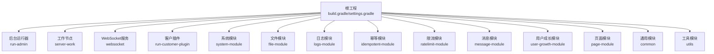

图表来源
- [build.gradle](file://build.gradle#L1-L457)
- [settings.gradle](file://settings.gradle#L1-L24)

章节来源
- [build.gradle](file://build.gradle#L1-L457)
- [settings.gradle](file://settings.gradle#L1-L24)

## 核心组件
- 通用与基础设施层
  - common：提供异步配置、Redis模板、安全属性、工具类、基础实体与分页查询辅助等，为各业务模块提供横切能力。
  - utils：提供SM2加解密、JSON处理、状态枚举等工具能力。
- 领域模块层
  - system-module：系统管理相关领域模型与服务。
  - file-module：文件上传、存储策略、访问URL解析、路径辅助等。
  - logs-module：操作日志领域模型与服务。
  - idempotent-module：幂等去重记录与事件监听。
  - ratelimit-module：全局/接口/IP/用户黑白名单限流配置与记录。
  - message-module：消息配置、模板、记录与发送能力。
  - user-growth-module：积分账户、等级配置与记录。
  - page-module：页面应用、组件、类型与Web配置。
- 运行与接入层
  - run-admin：后台管理服务入口，聚合多个模块能力。
  - server-work：工作节点，负责采集与监控等任务。
  - websocket：基于Netty的WebSocket服务。
  - run-customer-plugin：客户侧插件入口。

章节来源
- [common/bin/main/java/com/fastproject/config/AsyncConfig.class](file://common/bin/main/java/com/fastproject/config/AsyncConfig.class)
- [common/bin/main/java/com/fastproject/jedis/JedisTemplate.class](file://common/bin/main/java/com/fastproject/jedis/JedisTemplate.class)
- [common/bin/main/java/com/fastproject/jedis/SimpleJedisPool.class](file://common/bin/main/java/com/fastproject/jedis/SimpleJedisPool.class)
- [common/bin/main/java/com/fastproject/db/BaseEntity.class](file://common/bin/main/java/com/fastproject/db/BaseEntity.class)
- [common/bin/main/java/com/fastproject/db/PageQuery.class](file://common/bin/main/java/com/fastproject/db/PageQuery.class)
- [common/bin/main/java/com/fastproject/db/QueryHelp.class](file://common/bin/main/java/com/fastproject/db/QueryHelp.class)
- [common/bin/main/java/com/fastproject/db/SnowflakeIdListener.class](file://common/bin/main/java/com/fastproject/db/SnowflakeIdListener.class)
- [common/bin/main/java/com/fastproject/utils/IpUtils.class](file://common/bin/main/java/com/fastproject/utils/IpUtils.class)
- [common/bin/main/java/com/fastproject/utils/SpringContextUtil.class](file://common/bin/main/java/com/fastproject/utils/SpringContextUtil.class)
- [common/bin/main/java/com/fastproject/utils/TokenUtils.class](file://common/bin/main/java/com/fastproject/utils/TokenUtils.class)
- [common/bin/main/java/com/fastproject/utils/XssUtil.class](file://common/bin/main/java/com/fastproject/utils/XssUtil.class)

## 架构总览
Fast项目采用“多模块+多进程”的架构形态：
- 微服务化：以模块为单位进行领域拆分，run-admin作为聚合入口，server-work与websocket作为独立进程承载特定职责。
- 模块化：common与utils提供横切与通用能力；各领域模块保持内聚，通过API/VO与模块间通信。
- 分层架构：表现层（控制器）、领域层（服务）、数据访问层（Repository/Mapper），配合基础设施层（缓存、数据库、文件存储）。

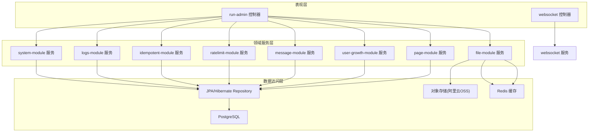

图表来源
- [run-admin/src/main/java/com/fastproject/RunAdmin.java](file://run-admin/src/main/java/com/fastproject/RunAdmin.java#L1-L14)
- [websocket/src/main/java/com/fastproject/WebSocketRun.java](file://websocket/src/main/java/com/fastproject/WebSocketRun.java#L1-L12)
- [file-module/bin/main/java/com/fastproject/file/storage/FileStorageStrategy.class](file://file-module/bin/main/java/com/fastproject/file/storage/FileStorageStrategy.class)
- [file-module/bin/main/java/com/fastproject/file/storage/AbstractFileStorageStrategy.class](file://file-module/bin/main/java/com/fastproject/file/storage/AbstractFileStorageStrategy.class)
- [file-module/bin/main/java/com/fastproject/file/storage/ConfigSelector.class](file://file-module/bin/main/java/com/fastproject/file/storage/ConfigSelector.class)
- [file-module/bin/main/java/com/fastproject/file/storage/WeightedConfigSelector.class](file://file-module/bin/main/java/com/fastproject/file/storage/WeightedConfigSelector.class)
- [file-module/bin/main/java/com/fastproject/file/storage/FileStorageContext.class](file://file-module/bin/main/java/com/fastproject/file/storage/FileStorageContext.class)
- [file-module/bin/main/java/com/fastproject/file/storage/FileAccessUrlResolver.class](file://file-module/bin/main/java/com/fastproject/file/storage/FileAccessUrlResolver.class)
- [file-module/bin/main/java/com/fastproject/file/storage/FileStoragePathHelper.class](file://file-module/bin/main/java/com/fastproject/file/storage/FileStoragePathHelper.class)
- [file-module/bin/main/java/com/fastproject/file/service/FileInfoService.class](file://file-module/bin/main/java/com/fastproject/file/service/FileInfoService.class)
- [file-module/bin/main/java/com/fastproject/file/service/FileUploadService.class](file://file-module/bin/main/java/com/fastproject/file/service/FileUploadService.class)
- [file-module/bin/main/java/com/fastproject/file/domain/FileInfo.class](file://file-module/bin/main/java/com/fastproject/file/domain/FileInfo.class)
- [file-module/bin/main/java/com/fastproject/file/domain/FileDomain.class](file://file-module/bin/main/java/com/fastproject/file/domain/FileDomain.class)
- [file-module/bin/main/java/com/fastproject/file/domain/FileConfig.class](file://file-module/bin/main/java/com/fastproject/file/domain/FileConfig.class)
- [file-module/bin/main/java/com/fastproject/file/domain/FileType.class](file://file-module/bin/main/java/com/fastproject/file/domain/FileType.class)
- [file-module/bin/main/java/com/fastproject/file/mapper/FileInfoMapper.class](file://file-module/bin/main/java/com/fastproject/file/mapper/FileInfoMapper.class)
- [file-module/bin/main/java/com/fastproject/file/mapper/FileDomainMapper.class](file://file-module/bin/main/java/com/fastproject/file/mapper/FileDomainMapper.class)
- [file-module/bin/main/java/com/fastproject/file/mapper/FileConfigMapper.class](file://file-module/bin/main/java/com/fastproject/file/mapper/FileConfigMapper.class)
- [file-module/bin/main/java/com/fastproject/file/repository/db/FileInfoRepository.class](file://file-module/bin/main/java/com/fastproject/file/repository/db/FileInfoRepository.class)
- [file-module/bin/main/java/com/fastproject/file/repository/db/FileDomainRepository.class](file://file-module/bin/main/java/com/fastproject/file/repository/db/FileDomainRepository.class)
- [file-module/bin/main/java/com/fastproject/file/repository/db/FileConfigRepository.class](file://file-module/bin/main/java/com/fastproject/file/repository/db/FileConfigRepository.class)
- [file-module/bin/main/java/com/fastproject/file/api/FileHandle.class](file://file-module/bin/main/java/com/fastproject/file/api/FileHandle.class)
- [file-module/bin/main/java/com/fastproject/file/api/FileHandleImpl.class](file://file-module/bin/main/java/com/fastproject/file/api/FileHandleImpl.class)
- [logs-module/bin/main/java/com/fastproject/logs/domain/OperationLog.class](file://logs-module/bin/main/java/com/fastproject/logs/domain/OperationLog.class)
- [logs-module/bin/main/java/com/fastproject/logs/mapper/OperationLogMapper.class](file://logs-module/bin/main/java/com/fastproject/logs/mapper/OperationLogMapper.class)
- [logs-module/bin/main/java/com/fastproject/logs/service/OperationLogService.class](file://logs-module/bin/main/java/com/fastproject/logs/service/OperationLogService.class)
- [logs-module/bin/main/java/com/fastproject/logs/repository/OperationLogRepository.class](file://logs-module/bin/main/java/com/fastproject/logs/repository/OperationLogRepository.class)
- [logs-module/bin/main/java/com/fastproject/logs/api/OperationLogApi.class](file://logs-module/bin/main/java/com/fastproject/logs/api/OperationLogApi.class)
- [idempotent-module/bin/main/java/com/fastproject/idempotent/domain/IdempotentDuplicateLog.class](file://idempotent-module/bin/main/java/com/fastproject/idempotent/domain/IdempotentDuplicateLog.class)
- [idempotent-module/bin/main/java/com/fastproject/idempotent/service/IdempotentDuplicateLogService.class](file://idempotent-module/bin/main/java/com/fastproject/idempotent/service/IdempotentDuplicateLogService.class)
- [idempotent-module/bin/main/java/com/fastproject/idempotent/listener/IdempotentDuplicateEventListener.class](file://idempotent-module/bin/main/java/com/fastproject/idempotent/listener/IdempotentDuplicateEventListener.class)
- [idempotent-module/bin/main/java/com/fastproject/idempotent/repository/db/IdempotentDuplicateLogRepository.class](file://idempotent-module/bin/main/java/com/fastproject/idempotent/repository/db/IdempotentDuplicateLogRepository.class)
- [ratelimit-module/bin/main/java/com/fastproject/ratelimit/domain/ApiRateLimitConfig.class](file://ratelimit-module/bin/main/java/com/fastproject/ratelimit/domain/ApiRateLimitConfig.class)
- [ratelimit-module/bin/main/java/com/fastproject/ratelimit/domain/GlobalRateLimitConfig.class](file://ratelimit-module/bin/main/java/com/fastproject/ratelimit/domain/GlobalRateLimitConfig.class)
- [ratelimit-module/bin/main/java/com/fastproject/ratelimit/domain/IpRateLimitConfig.class](file://ratelimit-module/bin/main/java/com/fastproject/ratelimit/domain/IpRateLimitConfig.class)
- [ratelimit-module/bin/main/java/com/fastproject/ratelimit/domain/UserBlackWhiteList.class](file://ratelimit-module/bin/main/java/com/fastproject/ratelimit/domain/UserBlackWhiteList.class)
- [ratelimit-module/bin/main/java/com/fastproject/ratelimit/domain/IpBlackWhiteList.class](file://ratelimit-module/bin/main/java/com/fastproject/ratelimit/domain/IpBlackWhiteList.class)
- [ratelimit-module/bin/main/java/com/fastproject/ratelimit/domain/RateLimitRecord.class](file://ratelimit-module/bin/main/java/com/fastproject/ratelimit/domain/RateLimitRecord.class)
- [ratelimit-module/bin/main/java/com/fastproject/ratelimit/service/ApiRateLimitConfigService.class](file://ratelimit-module/bin/main/java/com/fastproject/ratelimit/service/ApiRateLimitConfigService.class)
- [ratelimit-module/bin/main/java/com/fastproject/ratelimit/service/GlobalRateLimitConfigService.class](file://ratelimit-module/bin/main/java/com/fastproject/ratelimit/service/GlobalRateLimitConfigService.class)
- [ratelimit-module/bin/main/java/com/fastproject/ratelimit/service/IpRateLimitConfigService.class](file://ratelimit-module/bin/main/java/com/fastproject/ratelimit/service/IpRateLimitConfigService.class)
- [ratelimit-module/bin/main/java/com/fastproject/ratelimit/service/UserBlackWhiteListService.class](file://ratelimit-module/bin/main/java/com/fastproject/ratelimit/service/UserBlackWhiteListService.class)
- [ratelimit-module/bin/main/java/com/fastproject/ratelimit/service/IpBlackWhiteListService.class](file://ratelimit-module/bin/main/java/com/fastproject/ratelimit/service/IpBlackWhiteListService.class)
- [ratelimit-module/bin/main/java/com/fastproject/ratelimit/service/RateLimitRecordService.class](file://ratelimit-module/bin/main/java/com/fastproject/ratelimit/service/RateLimitRecordService.class)
- [ratelimit-module/bin/main/java/com/fastproject/ratelimit/repository/db/ApiRateLimitConfigRepository.class](file://ratelimit-module/bin/main/java/com/fastproject/ratelimit/repository/db/ApiRateLimitConfigRepository.class)
- [ratelimit-module/bin/main/java/com/fastproject/ratelimit/repository/db/GlobalRateLimitConfigRepository.class](file://ratelimit-module/bin/main/java/com/fastproject/ratelimit/repository/db/GlobalRateLimitConfigRepository.class)
- [ratelimit-module/bin/main/java/com/fastproject/ratelimit/repository/db/IpRateLimitConfigRepository.class](file://ratelimit-module/bin/main/java/com/fastproject/ratelimit/repository/db/IpRateLimitConfigRepository.class)
- [ratelimit-module/bin/main/java/com/fastproject/ratelimit/repository/db/UserBlackWhiteListRepository.class](file://ratelimit-module/bin/main/java/com/fastproject/ratelimit/repository/db/UserBlackWhiteListRepository.class)
- [ratelimit-module/bin/main/java/com/fastproject/ratelimit/repository/db/IpBlackWhiteListRepository.class](file://ratelimit-module/bin/main/java/com/fastproject/ratelimit/repository/db/IpBlackWhiteListRepository.class)
- [ratelimit-module/bin/main/java/com/fastproject/ratelimit/repository/db/RateLimitRecordRepository.class](file://ratelimit-module/bin/main/java/com/fastproject/ratelimit/repository/db/RateLimitRecordRepository.class)
- [websocket/bin/main/java/com/fastproject/netty/NettyWebSocketServer.class](file://websocket/bin/main/java/com/fastproject/netty/NettyWebSocketServer.class)
- [websocket/bin/main/java/com/fastproject/netty/NettyWebSocketHandler.class](file://websocket/bin/main/java/com/fastproject/netty/NettyWebSocketHandler.class)
- [websocket/bin/main/java/com/fastproject/netty/NettyWebSocketConfig.class](file://websocket/bin/main/java/com/fastproject/netty/NettyWebSocketConfig.class)
- [websocket/bin/main/java/com/fastproject/netty/NettyChatMessageHandler.class](file://websocket/bin/main/java/com/fastproject/netty/NettyChatMessageHandler.class)
- [websocket/bin/main/java/com/fastproject/controller/WebSocketController.class](file://websocket/bin/main/java/com/fastproject/controller/WebSocketController.class)
- [websocket/bin/main/java/com/fastproject/domain/WebSocketMessage.class](file://websocket/bin/main/java/com/fastproject/domain/WebSocketMessage.class)
- [websocket/bin/main/java/com/fastproject/domain/WebSocketSession.class](file://websocket/bin/main/java/com/fastproject/domain/WebSocketSession.class)
- [websocket/bin/main/java/com/fastproject/service/WebSocketMessageService.class](file://websocket/bin/main/java/com/fastproject/service/WebSocketMessageService.class)
- [websocket/bin/main/java/com/fastproject/utils/ChatMessageUtils.class](file://websocket/bin/main/java/com/fastproject/utils/ChatMessageUtils.class)

## 详细组件分析

### 文件存储模块（file-module）
文件模块提供统一的文件存储策略与访问URL解析能力，支持多种存储后端（如阿里云OSS），并通过权重选择器实现动态配置与容灾切换。核心类包括：
- 存储策略接口与抽象实现：定义统一的存储契约与默认行为。
- 配置选择器与加权选择器：根据权重与可用性动态选择最优配置。
- 文件上下文与URL解析：封装存储上下文与访问URL生成逻辑。
- 路径辅助：规范文件路径生成规则。
- 服务层：文件信息管理与上传服务。
- 领域模型与数据访问：文件信息、域名、配置与枚举类型，以及对应的Mapper/Repository。

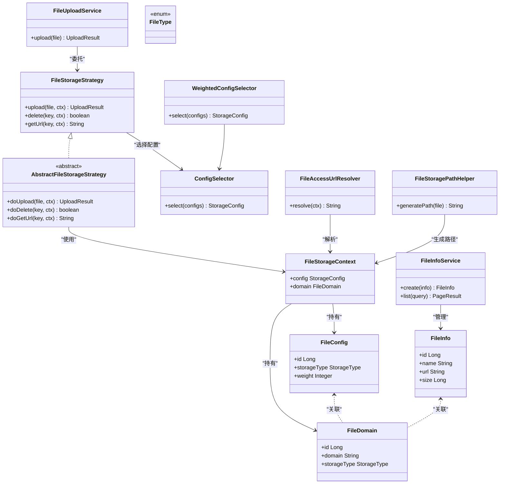

图表来源
- [file-module/bin/main/java/com/fastproject/file/storage/FileStorageStrategy.class](file://file-module/bin/main/java/com/fastproject/file/storage/FileStorageStrategy.class)
- [file-module/bin/main/java/com/fastproject/file/storage/AbstractFileStorageStrategy.class](file://file-module/bin/main/java/com/fastproject/file/storage/AbstractFileStorageStrategy.class)
- [file-module/bin/main/java/com/fastproject/file/storage/ConfigSelector.class](file://file-module/bin/main/java/com/fastproject/file/storage/ConfigSelector.class)
- [file-module/bin/main/java/com/fastproject/file/storage/WeightedConfigSelector.class](file://file-module/bin/main/java/com/fastproject/file/storage/WeightedConfigSelector.class)
- [file-module/bin/main/java/com/fastproject/file/storage/FileStorageContext.class](file://file-module/bin/main/java/com/fastproject/file/storage/FileStorageContext.class)
- [file-module/bin/main/java/com/fastproject/file/storage/FileAccessUrlResolver.class](file://file-module/bin/main/java/com/fastproject/file/storage/FileAccessUrlResolver.class)
- [file-module/bin/main/java/com/fastproject/file/storage/FileStoragePathHelper.class](file://file-module/bin/main/java/com/fastproject/file/storage/FileStoragePathHelper.class)
- [file-module/bin/main/java/com/fastproject/file/service/FileInfoService.class](file://file-module/bin/main/java/com/fastproject/file/service/FileInfoService.class)
- [file-module/bin/main/java/com/fastproject/file/service/FileUploadService.class](file://file-module/bin/main/java/com/fastproject/file/service/FileUploadService.class)
- [file-module/bin/main/java/com/fastproject/file/domain/FileInfo.class](file://file-module/bin/main/java/com/fastproject/file/domain/FileInfo.class)
- [file-module/bin/main/java/com/fastproject/file/domain/FileDomain.class](file://file-module/bin/main/java/com/fastproject/file/domain/FileDomain.class)
- [file-module/bin/main/java/com/fastproject/file/domain/FileConfig.class](file://file-module/bin/main/java/com/fastproject/file/domain/FileConfig.class)
- [file-module/bin/main/java/com/fastproject/file/domain/FileType.class](file://file-module/bin/main/java/com/fastproject/file/domain/FileType.class)

章节来源
- [file-module/bin/main/java/com/fastproject/file/storage/FileStorageStrategy.class](file://file-module/bin/main/java/com/fastproject/file/storage/FileStorageStrategy.class)
- [file-module/bin/main/java/com/fastproject/file/storage/AbstractFileStorageStrategy.class](file://file-module/bin/main/java/com/fastproject/file/storage/AbstractFileStorageStrategy.class)
- [file-module/bin/main/java/com/fastproject/file/storage/ConfigSelector.class](file://file-module/bin/main/java/com/fastproject/file/storage/ConfigSelector.class)
- [file-module/bin/main/java/com/fastproject/file/storage/WeightedConfigSelector.class](file://file-module/bin/main/java/com/fastproject/file/storage/WeightedConfigSelector.class)
- [file-module/bin/main/java/com/fastproject/file/storage/FileStorageContext.class](file://file-module/bin/main/java/com/fastproject/file/storage/FileStorageContext.class)
- [file-module/bin/main/java/com/fastproject/file/storage/FileAccessUrlResolver.class](file://file-module/bin/main/java/com/fastproject/file/storage/FileAccessUrlResolver.class)
- [file-module/bin/main/java/com/fastproject/file/storage/FileStoragePathHelper.class](file://file-module/bin/main/java/com/fastproject/file/storage/FileStoragePathHelper.class)
- [file-module/bin/main/java/com/fastproject/file/service/FileInfoService.class](file://file-module/bin/main/java/com/fastproject/file/service/FileInfoService.class)
- [file-module/bin/main/java/com/fastproject/file/service/FileUploadService.class](file://file-module/bin/main/java/com/fastproject/file/service/FileUploadService.class)
- [file-module/bin/main/java/com/fastproject/file/domain/FileInfo.class](file://file-module/bin/main/java/com/fastproject/file/domain/FileInfo.class)
- [file-module/bin/main/java/com/fastproject/file/domain/FileDomain.class](file://file-module/bin/main/java/com/fastproject/file/domain/FileDomain.class)
- [file-module/bin/main/java/com/fastproject/file/domain/FileConfig.class](file://file-module/bin/main/java/com/fastproject/file/domain/FileConfig.class)
- [file-module/bin/main/java/com/fastproject/file/domain/FileType.class](file://file-module/bin/main/java/com/fastproject/file/domain/FileType.class)

### 日志模块（logs-module）
日志模块提供操作日志的领域模型、持久化与服务层，支持查询、创建与分页等能力。核心类包括：
- 领域模型：操作日志实体。
- 数据访问：Mapper与Repository。
- 服务层：操作日志服务。
- API：对外暴露的操作日志API。

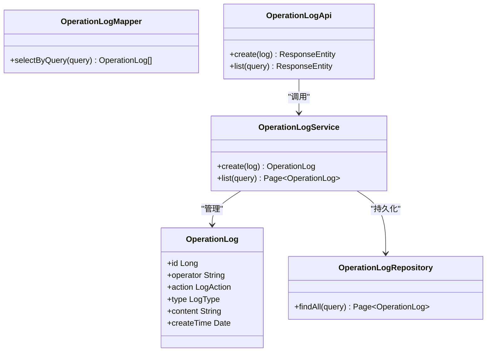

图表来源
- [logs-module/bin/main/java/com/fastproject/logs/domain/OperationLog.class](file://logs-module/bin/main/java/com/fastproject/logs/domain/OperationLog.class)
- [logs-module/bin/main/java/com/fastproject/logs/mapper/OperationLogMapper.class](file://logs-module/bin/main/java/com/fastproject/logs/mapper/OperationLogMapper.class)
- [logs-module/bin/main/java/com/fastproject/logs/repository/OperationLogRepository.class](file://logs-module/bin/main/java/com/fastproject/logs/repository/OperationLogRepository.class)
- [logs-module/bin/main/java/com/fastproject/logs/service/OperationLogService.class](file://logs-module/bin/main/java/com/fastproject/logs/service/OperationLogService.class)
- [logs-module/bin/main/java/com/fastproject/logs/api/OperationLogApi.class](file://logs-module/bin/main/java/com/fastproject/logs/api/OperationLogApi.class)

章节来源
- [logs-module/bin/main/java/com/fastproject/logs/domain/OperationLog.class](file://logs-module/bin/main/java/com/fastproject/logs/domain/OperationLog.class)
- [logs-module/bin/main/java/com/fastproject/logs/mapper/OperationLogMapper.class](file://logs-module/bin/main/java/com/fastproject/logs/mapper/OperationLogMapper.class)
- [logs-module/bin/main/java/com/fastproject/logs/repository/OperationLogRepository.class](file://logs-module/bin/main/java/com/fastproject/logs/repository/OperationLogRepository.class)
- [logs-module/bin/main/java/com/fastproject/logs/service/OperationLogService.class](file://logs-module/bin/main/java/com/fastproject/logs/service/OperationLogService.class)
- [logs-module/bin/main/java/com/fastproject/logs/api/OperationLogApi.class](file://logs-module/bin/main/java/com/fastproject/logs/api/OperationLogApi.class)

### 幂等模块（idempotent-module）
幂等模块用于防止重复提交或重复消费，核心类包括：
- 领域模型：重复日志实体。
- 服务层：重复日志服务与事件监听。
- 数据访问：Repository。

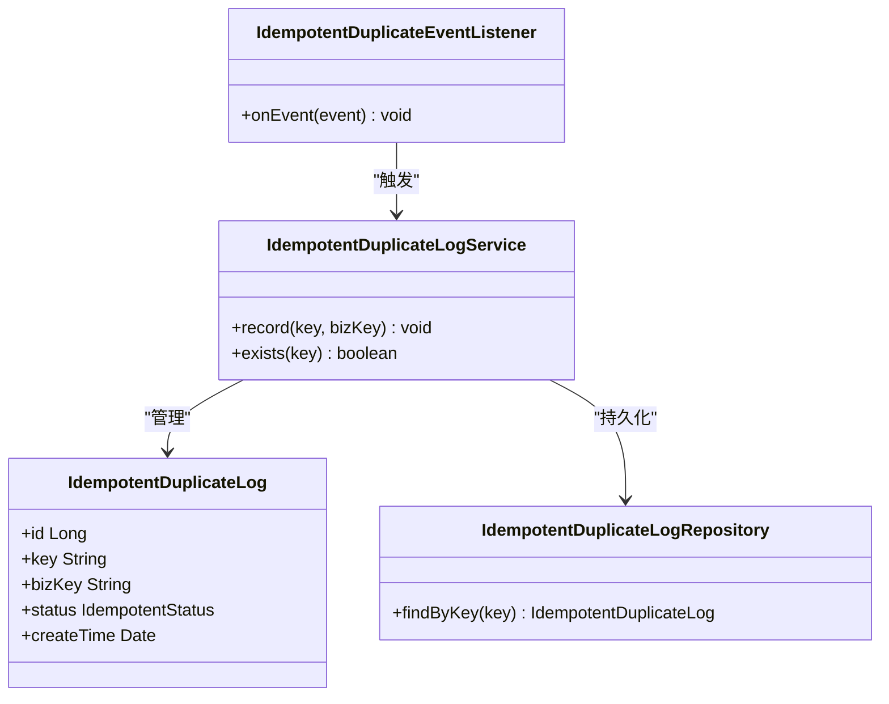

图表来源
- [idempotent-module/bin/main/java/com/fastproject/idempotent/domain/IdempotentDuplicateLog.class](file://idempotent-module/bin/main/java/com/fastproject/idempotent/domain/IdempotentDuplicateLog.class)
- [idempotent-module/bin/main/java/com/fastproject/idempotent/service/IdempotentDuplicateLogService.class](file://idempotent-module/bin/main/java/com/fastproject/idempotent/service/IdempotentDuplicateLogService.class)
- [idempotent-module/bin/main/java/com/fastproject/idempotent/listener/IdempotentDuplicateEventListener.class](file://idempotent-module/bin/main/java/com/fastproject/idempotent/listener/IdempotentDuplicateEventListener.class)
- [idempotent-module/bin/main/java/com/fastproject/idempotent/repository/db/IdempotentDuplicateLogRepository.class](file://idempotent-module/bin/main/java/com/fastproject/idempotent/repository/db/IdempotentDuplicateLogRepository.class)

章节来源
- [idempotent-module/bin/main/java/com/fastproject/idempotent/domain/IdempotentDuplicateLog.class](file://idempotent-module/bin/main/java/com/fastproject/idempotent/domain/IdempotentDuplicateLog.class)
- [idempotent-module/bin/main/java/com/fastproject/idempotent/service/IdempotentDuplicateLogService.class](file://idempotent-module/bin/main/java/com/fastproject/idempotent/service/IdempotentDuplicateLogService.class)
- [idempotent-module/bin/main/java/com/fastproject/idempotent/listener/IdempotentDuplicateEventListener.class](file://idempotent-module/bin/main/java/com/fastproject/idempotent/listener/IdempotentDuplicateEventListener.class)
- [idempotent-module/bin/main/java/com/fastproject/idempotent/repository/db/IdempotentDuplicateLogRepository.class](file://idempotent-module/bin/main/java/com/fastproject/idempotent/repository/db/IdempotentDuplicateLogRepository.class)

### 限流模块（ratelimit-module）
限流模块提供全局、接口、IP与用户维度的限流配置与记录，核心类包括：
- 配置与记录实体：全局限流、接口限流、IP限流、用户黑白名单、限流记录。
- 服务层：各类配置与记录的服务。
- 数据访问：对应的Repository。

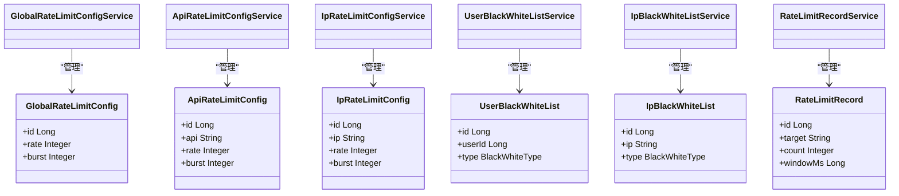

图表来源
- [ratelimit-module/bin/main/java/com/fastproject/ratelimit/domain/GlobalRateLimitConfig.class](file://ratelimit-module/bin/main/java/com/fastproject/ratelimit/domain/GlobalRateLimitConfig.class)
- [ratelimit-module/bin/main/java/com/fastproject/ratelimit/domain/ApiRateLimitConfig.class](file://ratelimit-module/bin/main/java/com/fastproject/ratelimit/domain/ApiRateLimitConfig.class)
- [ratelimit-module/bin/main/java/com/fastproject/ratelimit/domain/IpRateLimitConfig.class](file://ratelimit-module/bin/main/java/com/fastproject/ratelimit/domain/IpRateLimitConfig.class)
- [ratelimit-module/bin/main/java/com/fastproject/ratelimit/domain/UserBlackWhiteList.class](file://ratelimit-module/bin/main/java/com/fastproject/ratelimit/domain/UserBlackWhiteList.class)
- [ratelimit-module/bin/main/java/com/fastproject/ratelimit/domain/IpBlackWhiteList.class](file://ratelimit-module/bin/main/java/com/fastproject/ratelimit/domain/IpBlackWhiteList.class)
- [ratelimit-module/bin/main/java/com/fastproject/ratelimit/domain/RateLimitRecord.class](file://ratelimit-module/bin/main/java/com/fastproject/ratelimit/domain/RateLimitRecord.class)
- [ratelimit-module/bin/main/java/com/fastproject/ratelimit/service/GlobalRateLimitConfigService.class](file://ratelimit-module/bin/main/java/com/fastproject/ratelimit/service/GlobalRateLimitConfigService.class)
- [ratelimit-module/bin/main/java/com/fastproject/ratelimit/service/ApiRateLimitConfigService.class](file://ratelimit-module/bin/main/java/com/fastproject/ratelimit/service/ApiRateLimitConfigService.class)
- [ratelimit-module/bin/main/java/com/fastproject/ratelimit/service/IpRateLimitConfigService.class](file://ratelimit-module/bin/main/java/com/fastproject/ratelimit/service/IpRateLimitConfigService.class)
- [ratelimit-module/bin/main/java/com/fastproject/ratelimit/service/UserBlackWhiteListService.class](file://ratelimit-module/bin/main/java/com/fastproject/ratelimit/service/UserBlackWhiteListService.class)
- [ratelimit-module/bin/main/java/com/fastproject/ratelimit/service/IpBlackWhiteListService.class](file://ratelimit-module/bin/main/java/com/fastproject/ratelimit/service/IpBlackWhiteListService.class)
- [ratelimit-module/bin/main/java/com/fastproject/ratelimit/service/RateLimitRecordService.class](file://ratelimit-module/bin/main/java/com/fastproject/ratelimit/service/RateLimitRecordService.class)

章节来源
- [ratelimit-module/bin/main/java/com/fastproject/ratelimit/domain/GlobalRateLimitConfig.class](file://ratelimit-module/bin/main/java/com/fastproject/ratelimit/domain/GlobalRateLimitConfig.class)
- [ratelimit-module/bin/main/java/com/fastproject/ratelimit/domain/ApiRateLimitConfig.class](file://ratelimit-module/bin/main/java/com/fastproject/ratelimit/domain/ApiRateLimitConfig.class)
- [ratelimit-module/bin/main/java/com/fastproject/ratelimit/domain/IpRateLimitConfig.class](file://ratelimit-module/bin/main/java/com/fastproject/ratelimit/domain/IpRateLimitConfig.class)
- [ratelimit-module/bin/main/java/com/fastproject/ratelimit/domain/UserBlackWhiteList.class](file://ratelimit-module/bin/main/java/com/fastproject/ratelimit/domain/UserBlackWhiteList.class)
- [ratelimit-module/bin/main/java/com/fastproject/ratelimit/domain/IpBlackWhiteList.class](file://ratelimit-module/bin/main/java/com/fastproject/ratelimit/domain/IpBlackWhiteList.class)
- [ratelimit-module/bin/main/java/com/fastproject/ratelimit/domain/RateLimitRecord.class](file://ratelimit-module/bin/main/java/com/fastproject/ratelimit/domain/RateLimitRecord.class)
- [ratelimit-module/bin/main/java/com/fastproject/ratelimit/service/GlobalRateLimitConfigService.class](file://ratelimit-module/bin/main/java/com/fastproject/ratelimit/service/GlobalRateLimitConfigService.class)
- [ratelimit-module/bin/main/java/com/fastproject/ratelimit/service/ApiRateLimitConfigService.class](file://ratelimit-module/bin/main/java/com/fastproject/ratelimit/service/ApiRateLimitConfigService.class)
- [ratelimit-module/bin/main/java/com/fastproject/ratelimit/service/IpRateLimitConfigService.class](file://ratelimit-module/bin/main/java/com/fastproject/ratelimit/service/IpRateLimitConfigService.class)
- [ratelimit-module/bin/main/java/com/fastproject/ratelimit/service/UserBlackWhiteListService.class](file://ratelimit-module/bin/main/java/com/fastproject/ratelimit/service/UserBlackWhiteListService.class)
- [ratelimit-module/bin/main/java/com/fastproject/ratelimit/service/IpBlackWhiteListService.class](file://ratelimit-module/bin/main/java/com/fastproject/ratelimit/service/IpBlackWhiteListService.class)
- [ratelimit-module/bin/main/java/com/fastproject/ratelimit/service/RateLimitRecordService.class](file://ratelimit-module/bin/main/java/com/fastproject/ratelimit/service/RateLimitRecordService.class)

### WebSocket模块（websocket）
WebSocket模块基于Netty实现，提供聊天消息处理、会话管理与消息服务，核心类包括：
- Netty配置与处理器：WebSocket服务端、处理器与聊天消息处理器。
- 控制器与领域模型：消息与会话实体。
- 服务层：消息服务与工具类。

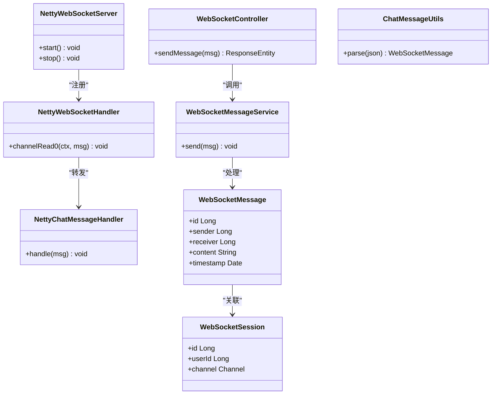

图表来源
- [websocket/bin/main/java/com/fastproject/netty/NettyWebSocketServer.class](file://websocket/bin/main/java/com/fastproject/netty/NettyWebSocketServer.class)
- [websocket/bin/main/java/com/fastproject/netty/NettyWebSocketHandler.class](file://websocket/bin/main/java/com/fastproject/netty/NettyWebSocketHandler.class)
- [websocket/bin/main/java/com/fastproject/netty/NettyWebSocketConfig.class](file://websocket/bin/main/java/com/fastproject/netty/NettyWebSocketConfig.class)
- [websocket/bin/main/java/com/fastproject/netty/NettyChatMessageHandler.class](file://websocket/bin/main/java/com/fastproject/netty/NettyChatMessageHandler.class)
- [websocket/bin/main/java/com/fastproject/controller/WebSocketController.class](file://websocket/bin/main/java/com/fastproject/controller/WebSocketController.class)
- [websocket/bin/main/java/com/fastproject/domain/WebSocketMessage.class](file://websocket/bin/main/java/com/fastproject/domain/WebSocketMessage.class)
- [websocket/bin/main/java/com/fastproject/domain/WebSocketSession.class](file://websocket/bin/main/java/com/fastproject/domain/WebSocketSession.class)
- [websocket/bin/main/java/com/fastproject/service/WebSocketMessageService.class](file://websocket/bin/main/java/com/fastproject/service/WebSocketMessageService.class)
- [websocket/bin/main/java/com/fastproject/utils/ChatMessageUtils.class](file://websocket/bin/main/java/com/fastproject/utils/ChatMessageUtils.class)

章节来源
- [websocket/bin/main/java/com/fastproject/netty/NettyWebSocketServer.class](file://websocket/bin/main/java/com/fastproject/netty/NettyWebSocketServer.class)
- [websocket/bin/main/java/com/fastproject/netty/NettyWebSocketHandler.class](file://websocket/bin/main/java/com/fastproject/netty/NettyWebSocketHandler.class)
- [websocket/bin/main/java/com/fastproject/netty/NettyWebSocketConfig.class](file://websocket/bin/main/java/com/fastproject/netty/NettyWebSocketConfig.class)
- [websocket/bin/main/java/com/fastproject/netty/NettyChatMessageHandler.class](file://websocket/bin/main/java/com/fastproject/netty/NettyChatMessageHandler.class)
- [websocket/bin/main/java/com/fastproject/controller/WebSocketController.class](file://websocket/bin/main/java/com/fastproject/controller/WebSocketController.class)
- [websocket/bin/main/java/com/fastproject/domain/WebSocketMessage.class](file://websocket/bin/main/java/com/fastproject/domain/WebSocketMessage.class)
- [websocket/bin/main/java/com/fastproject/domain/WebSocketSession.class](file://websocket/bin/main/java/com/fastproject/domain/WebSocketSession.class)
- [websocket/bin/main/java/com/fastproject/service/WebSocketMessageService.class](file://websocket/bin/main/java/com/fastproject/service/WebSocketMessageService.class)
- [websocket/bin/main/java/com/fastproject/utils/ChatMessageUtils.class](file://websocket/bin/main/java/com/fastproject/utils/ChatMessageUtils.class)

### 运行入口与配置
- run-admin：后台管理服务入口，启用异步，聚合系统、文件、日志、幂等、限流、消息、用户成长、页面等模块能力。
- server-work：工作节点，启用调度，内置系统信息Bean，提供密钥生成工具方法。
- websocket：WebSocket服务入口。
- run-customer-plugin：客户插件入口。
- 配置文件：application.yml与dev1/dev2环境配置，定义端口、数据源、JPA方言、Redis连接参数、安全令牌键等。

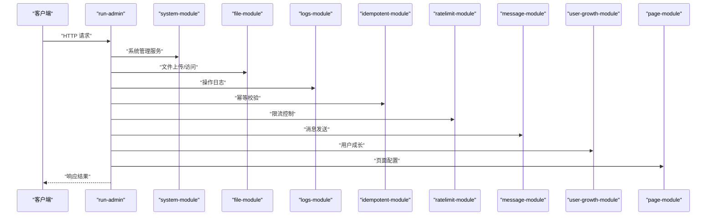

图表来源
- [run-admin/src/main/java/com/fastproject/RunAdmin.java](file://run-admin/src/main/java/com/fastproject/RunAdmin.java#L1-L14)
- [run-admin/src/main/resources/application.yml](file://run-admin/src/main/resources/application.yml#L1-L5)
- [run-admin/src/main/resources/application-dev1.yml](file://run-admin/src/main/resources/application-dev1.yml#L1-L70)
- [run-admin/src/main/resources/application-dev2.yml](file://run-admin/src/main/resources/application-dev2.yml#L1-L71)

章节来源
- [run-admin/src/main/java/com/fastproject/RunAdmin.java](file://run-admin/src/main/java/com/fastproject/RunAdmin.java#L1-L14)
- [run-admin/src/main/resources/application.yml](file://run-admin/src/main/resources/application.yml#L1-L5)
- [run-admin/src/main/resources/application-dev1.yml](file://run-admin/src/main/resources/application-dev1.yml#L1-L70)
- [run-admin/src/main/resources/application-dev2.yml](file://run-admin/src/main/resources/application-dev2.yml#L1-L71)
- [server-work/src/main/java/com/fastproject/RunServerWork.java](file://server-work/src/main/java/com/fastproject/RunServerWork.java#L1-L57)
- [websocket/src/main/java/com/fastproject/WebSocketRun.java](file://websocket/src/main/java/com/fastproject/WebSocketRun.java#L1-L12)
- [run-customer-plugin/src/main/java/com/fastproject/RunCustomer.java](file://run-customer-plugin/src/main/java/com/fastproject/RunCustomer.java#L1-L12)

## 依赖分析
- 版本与依赖管理：根构建脚本引入Spring Boot依赖管理和BOM，统一版本号；各子模块按需引入starter与第三方库。
- 模块间依赖：run-admin聚合system-module、file-module、logs-module、idempotent-module、ratelimit-module、message-module、user-growth-module、page-module；file-module依赖common与utils；system-module依赖common与utils；其他模块遵循相同模式。
- 基础设施依赖：common引入JPA、Web、Caffeine、OWASP HTML Sanitizer、Jackson JSR310、Jedis等；各模块按需启用Redis、数据库驱动、邮件等。

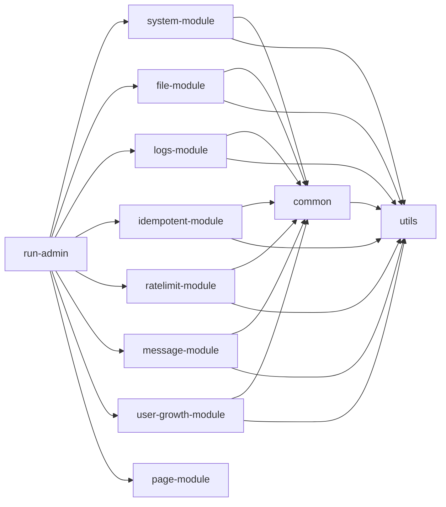

图表来源
- [build.gradle](file://build.gradle#L1-L457)
- [system-module/build.gradle](file://system-module/build.gradle#L1-L19)
- [file-module/build.gradle](file://file-module/build.gradle#L1-L19)

章节来源
- [build.gradle](file://build.gradle#L1-L457)
- [system-module/build.gradle](file://system-module/build.gradle#L1-L19)
- [file-module/build.gradle](file://file-module/build.gradle#L1-L19)

## 性能考虑
- 异步与线程池：common提供异步配置，run-admin启用@EnableAsync，适合IO密集型任务与耗时操作异步化。
- 虚拟线程：开发环境配置启用虚拟线程，提升高并发下的吞吐与资源利用率。
- 缓存策略：common集成Caffeine与Jedis，结合Redis实现多级缓存；文件模块通过权重选择器与URL解析优化访问延迟。
- ORM增强：系统模块与文件模块启用Hibernate增强（懒加载、脏标记、关联管理），减少N+1与无用更新。
- 数据库连接：PostgreSQL驱动与JPA配置，合理设置DDL策略与方言，避免Schema不一致导致的性能问题。
- WebSocket：Netty实现低延迟双向通信，结合消息服务与会话管理，适合实时场景。

## 故障排查指南
- 配置文件：检查application.yml与dev1/dev2环境配置，确认数据库URL、用户名、密码、Redis连接参数、JPA方言与SQL日志级别。
- 缓存问题：核对Redis连接参数与超时时间，验证缓存Key前缀与过期策略。
- 文件存储：确认OSS配置、域名与访问URL解析规则，检查存储策略选择器是否正确选择配置。
- 幂等与限流：核对重复日志记录与限流配置，定位重复请求与限流触发原因。
- WebSocket：检查Netty配置与处理器链路，验证消息解析与会话管理。

章节来源
- [run-admin/src/main/resources/application.yml](file://run-admin/src/main/resources/application.yml#L1-L5)
- [run-admin/src/main/resources/application-dev1.yml](file://run-admin/src/main/resources/application-dev1.yml#L1-L70)
- [run-admin/src/main/resources/application-dev2.yml](file://run-admin/src/main/resources/application-dev2.yml#L1-L71)

## 结论
Fast项目通过“多模块+多进程”架构实现了清晰的领域划分与职责分离，结合Spring Boot生态与Hibernate增强、Redis缓存、Netty WebSocket等技术选型，在保证可维护性的同时兼顾性能与扩展性。模块化设计便于团队协作与独立演进，分层架构确保了关注点分离与测试友好。建议在生产环境中进一步完善服务发现与网关、灰度发布与熔断降级策略，持续优化缓存与数据库索引，以应对更大规模的流量与数据。

## 附录
- 部署架构图（概念示意）
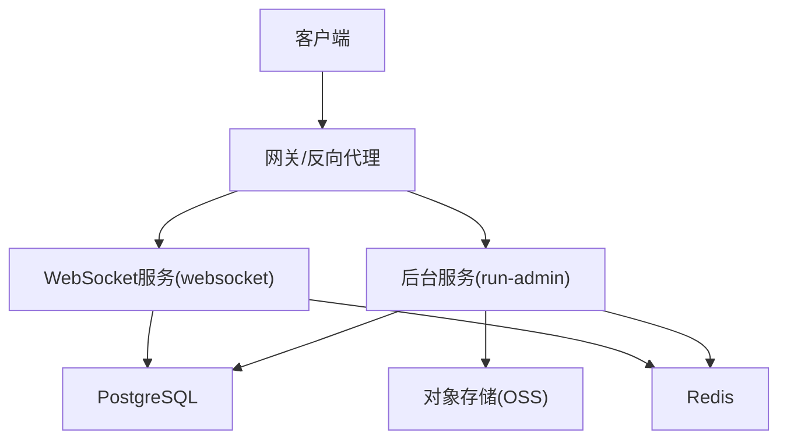

- 组件交互图（文件上传流程）
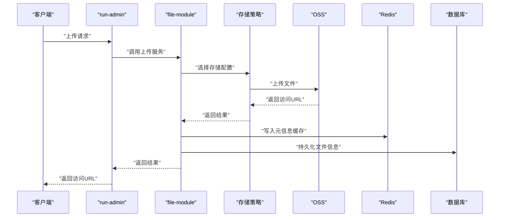