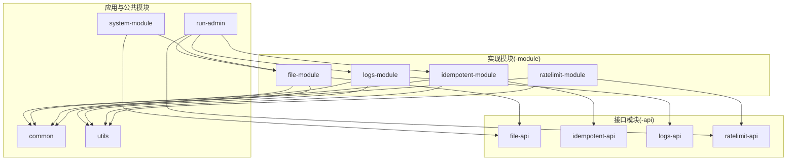
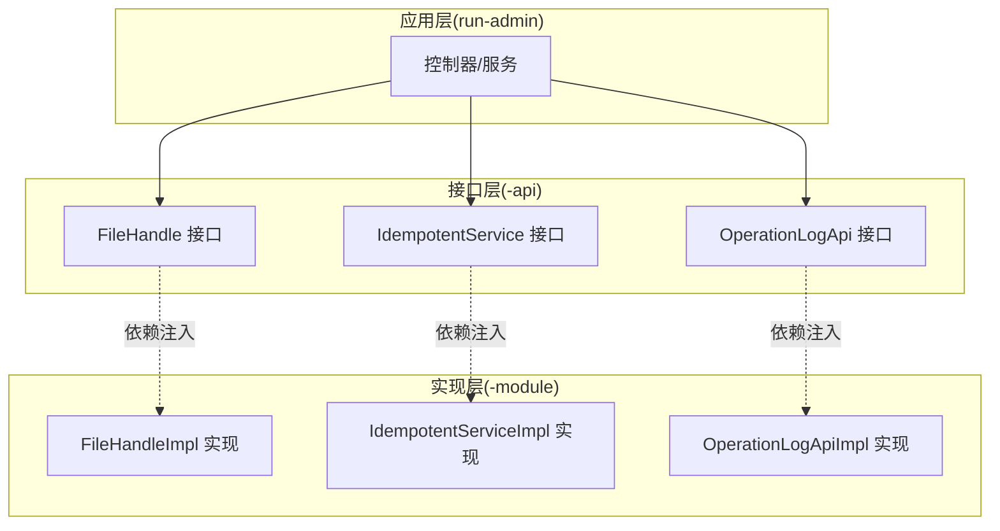
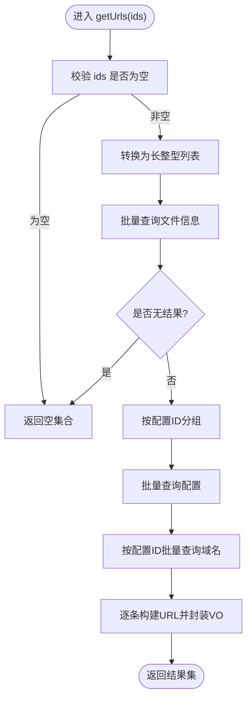
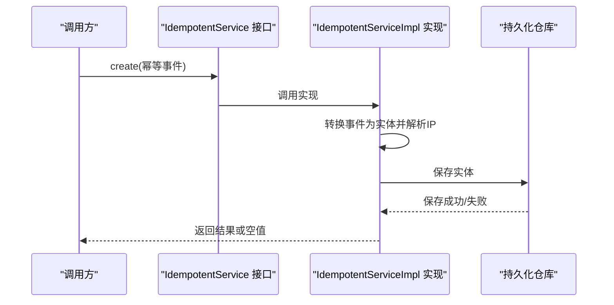
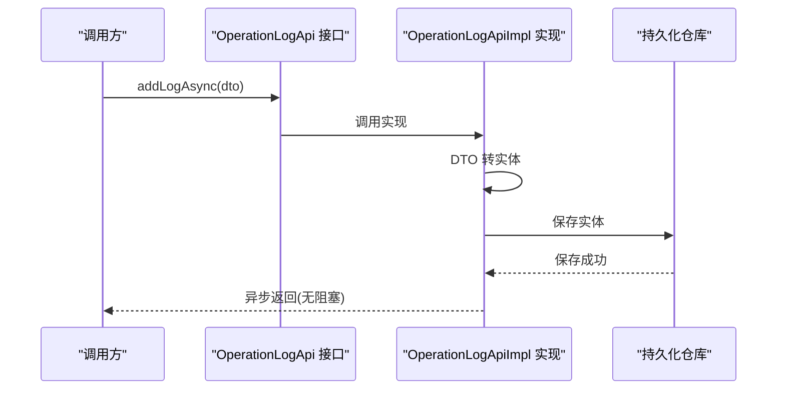
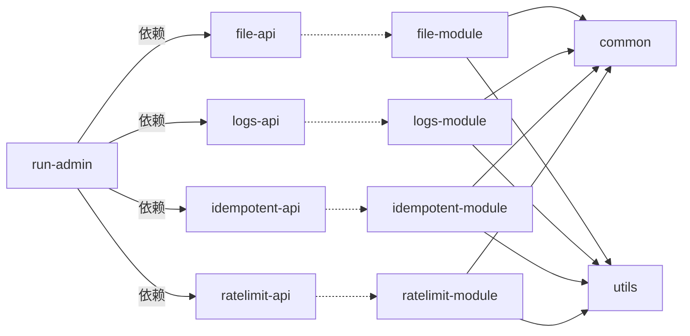

# 接口分离设计

<cite>
**本文引用的文件**
- [file-api/src/main/java/com/fastproject/file/api/FileHandle.java](file://file-api/src/main/java/com/fastproject/file/api/FileHandle.java)
- [file-module/src/main/java/com/fastproject/file/api/FileHandleImpl.java](file://file-module/src/main/java/com/fastproject/file/api/FileHandleImpl.java)
- [idempotent-api/src/main/java/com/fastproject/idempotent/api/IdempotentService.java](file://idempotent-api/src/main/java/com/fastproject/idempotent/api/IdempotentService.java)
- [idempotent-module/src/main/java/com/fastproject/idempotent/service/impl/IdempotentServiceImpl.java](file://idempotent-module/src/main/java/com/fastproject/idempotent/service/impl/IdempotentServiceImpl.java)
- [logs-api/src/main/java/com/fastproject/logs/api/OperationLogApi.java](file://logs-api/src/main/java/com/fastproject/logs/api/OperationLogApi.java)
- [logs-module/src/main/java/com/fastproject/logs/service/impl/OperationLogApiImpl.java](file://logs-module/src/main/java/com/fastproject/logs/service/impl/OperationLogApiImpl.java)
- [ratelimit-module/src/main/java/com/fastproject/ratelimit/service/impl/RateLimitRecordServiceImpl.java](file://ratelimit-module/src/main/java/com/fastproject/ratelimit/service/impl/RateLimitRecordServiceImpl.java)
- [build.gradle](file://build.gradle)
- [settings.gradle](file://settings.gradle)
</cite>

## 目录
1. [引言](#引言)
2. [项目结构](#项目结构)
3. [核心组件](#核心组件)
4. [架构总览](#架构总览)
5. [详细组件分析](#详细组件分析)
6. [依赖关系分析](#依赖关系分析)
7. [性能考虑](#性能考虑)
8. [故障排查指南](#故障排查指南)
9. [结论](#结论)
10. [附录](#附录)

## 引言
本设计文档围绕 Fast 项目的“接口分离”理念展开，系统化阐述 API 层与实现层的职责划分、接口设计原则、版本管理策略、演进与废弃流程、解耦机制（依赖注入、AOP/SPI 思想）、接口文档与测试策略、性能监控以及最佳实践与常见问题。通过文件、幂等、日志三大典型模块的代码级分析，展示如何以清晰的接口边界隔离业务变化风险，提升可维护性与可扩展性。

## 项目结构
Fast 采用多模块 Gradle 工程组织，遵循“-api/-module”双模块模式：
- 接口模块（-api）：仅暴露稳定接口与数据传输对象（DTO/VO），不包含实现细节，便于跨模块复用与替换实现。
- 实现模块（-module）：包含具体实现、领域模型、仓储与服务实现，面向接口编程，通过依赖注入装配。

图表来源
- [settings.gradle](file://settings.gradle#L1-L24)
- [build.gradle](file://build.gradle#L40-L58)
- [build.gradle](file://build.gradle#L91-L134)
- [build.gradle](file://build.gradle#L328-L345)
- [build.gradle](file://build.gradle#L347-L365)
- [build.gradle](file://build.gradle#L164-L188)
- [build.gradle](file://build.gradle#L202-L229)
- [build.gradle](file://build.gradle#L367-L380)
- [build.gradle](file://build.gradle#L382-L402)
- [build.gradle](file://build.gradle#L231-L242)

章节来源
- [settings.gradle](file://settings.gradle#L1-L24)
- [build.gradle](file://build.gradle#L40-L58)
- [build.gradle](file://build.gradle#L91-L134)
- [build.gradle](file://build.gradle#L164-L188)
- [build.gradle](file://build.gradle#L202-L229)
- [build.gradle](file://build.gradle#L231-L242)
- [build.gradle](file://build.gradle#L328-L345)
- [build.gradle](file://build.gradle#L347-L365)
- [build.gradle](file://build.gradle#L367-L380)
- [build.gradle](file://build.gradle#L382-L402)

## 核心组件
- 文件能力接口与实现
  - 接口定义：文件 URL 解析能力，支持单个与批量 ID 查询。
  - 实现：组合文件配置、文件信息、域名服务与 URL 解析器，统一构建访问链接。
- 幂等性接口与实现
  - 接口定义：幂等事件记录能力，面向切面使用。
  - 实现：基于数据库持久化重复请求日志，结合 IP 解析与异常兜底。
- 日志接口与实现
  - 接口定义：同步与异步操作日志记录能力。
  - 实现：DTO 转实体、持久化与异步执行，配合线程池异步化。

章节来源
- [file-api/src/main/java/com/fastproject/file/api/FileHandle.java](file://file-api/src/main/java/com/fastproject/file/api/FileHandle.java#L1-L22)
- [file-module/src/main/java/com/fastproject/file/api/FileHandleImpl.java](file://file-module/src/main/java/com/fastproject/file/api/FileHandleImpl.java#L1-L104)
- [idempotent-api/src/main/java/com/fastproject/idempotent/api/IdempotentService.java](file://idempotent-api/src/main/java/com/fastproject/idempotent/api/IdempotentService.java#L1-L19)
- [idempotent-module/src/main/java/com/fastproject/idempotent/service/impl/IdempotentServiceImpl.java](file://idempotent-module/src/main/java/com/fastproject/idempotent/service/impl/IdempotentServiceImpl.java#L1-L65)
- [logs-api/src/main/java/com/fastproject/logs/api/OperationLogApi.java](file://logs-api/src/main/java/com/fastproject/logs/api/OperationLogApi.java#L1-L25)
- [logs-module/src/main/java/com/fastproject/logs/service/impl/OperationLogApiImpl.java](file://logs-module/src/main/java/com/fastproject/logs/service/impl/OperationLogApiImpl.java#L1-L70)

## 架构总览
接口与实现通过 Spring 依赖注入解耦，应用层仅依赖接口，运行时由实现模块装配。AOP 在幂等与日志模块中体现 SPI 化思想，通过注解与切面在不侵入业务代码的前提下完成横切逻辑。

图表来源
- [file-api/src/main/java/com/fastproject/file/api/FileHandle.java](file://file-api/src/main/java/com/fastproject/file/api/FileHandle.java#L1-L22)
- [file-module/src/main/java/com/fastproject/file/api/FileHandleImpl.java](file://file-module/src/main/java/com/fastproject/file/api/FileHandleImpl.java#L24-L32)
- [idempotent-api/src/main/java/com/fastproject/idempotent/api/IdempotentService.java](file://idempotent-api/src/main/java/com/fastproject/idempotent/api/IdempotentService.java#L1-L19)
- [idempotent-module/src/main/java/com/fastproject/idempotent/service/impl/IdempotentServiceImpl.java](file://idempotent-module/src/main/java/com/fastproject/idempotent/service/impl/IdempotentServiceImpl.java#L23-L26)
- [logs-api/src/main/java/com/fastproject/logs/api/OperationLogApi.java](file://logs-api/src/main/java/com/fastproject/logs/api/OperationLogApi.java#L1-L25)
- [logs-module/src/main/java/com/fastproject/logs/service/impl/OperationLogApiImpl.java](file://logs-module/src/main/java/com/fastproject/logs/service/impl/OperationLogApiImpl.java#L16-L22)

## 详细组件分析

### 文件能力：接口与实现
- 接口职责
  - 单文件 URL 获取与批量 URL 获取，输入为文件标识，输出为 URL 或 VO 集合。
  - 保持稳定：方法签名与语义长期不变，避免破坏调用方契约。
- 实现策略
  - 依赖注入多个服务：文件配置、文件信息、域名服务与 URL 解析器。
  - 批量场景按配置分组查询，减少多次 IO；最终组装 VO 返回。
- 关键流程（批量获取）

图表来源
- [file-module/src/main/java/com/fastproject/file/api/FileHandleImpl.java](file://file-module/src/main/java/com/fastproject/file/api/FileHandleImpl.java#L40-L83)
- [file-module/src/main/java/com/fastproject/file/api/FileHandleImpl.java](file://file-module/src/main/java/com/fastproject/file/api/FileHandleImpl.java#L56-L68)
- [file-module/src/main/java/com/fastproject/file/api/FileHandleImpl.java](file://file-module/src/main/java/com/fastproject/file/api/FileHandleImpl.java#L72-L82)

章节来源
- [file-api/src/main/java/com/fastproject/file/api/FileHandle.java](file://file-api/src/main/java/com/fastproject/file/api/FileHandle.java#L7-L21)
- [file-module/src/main/java/com/fastproject/file/api/FileHandleImpl.java](file://file-module/src/main/java/com/fastproject/file/api/FileHandleImpl.java#L24-L32)
- [file-module/src/main/java/com/fastproject/file/api/FileHandleImpl.java](file://file-module/src/main/java/com/fastproject/file/api/FileHandleImpl.java#L40-L83)

### 幂等性：接口与实现
- 接口职责
  - 提供幂等事件记录入口，面向切面使用，保证对外接口稳定。
- 实现策略
  - 切面捕获事件并调用实现；实现将事件转换为持久化实体，入库并记录日志。
  - 使用请求上下文解析客户端 IP，异常时记录错误日志并返回空值，确保不阻断主流程。
- 调用序列（切面到实现）

图表来源
- [idempotent-api/src/main/java/com/fastproject/idempotent/api/IdempotentService.java](file://idempotent-api/src/main/java/com/fastproject/idempotent/api/IdempotentService.java#L17-L18)
- [idempotent-module/src/main/java/com/fastproject/idempotent/service/impl/IdempotentServiceImpl.java](file://idempotent-module/src/main/java/com/fastproject/idempotent/service/impl/IdempotentServiceImpl.java#L32-L63)

章节来源
- [idempotent-api/src/main/java/com/fastproject/idempotent/api/IdempotentService.java](file://idempotent-api/src/main/java/com/fastproject/idempotent/api/IdempotentService.java#L9-L18)
- [idempotent-module/src/main/java/com/fastproject/idempotent/service/impl/IdempotentServiceImpl.java](file://idempotent-module/src/main/java/com/fastproject/idempotent/service/impl/IdempotentServiceImpl.java#L23-L63)

### 日志：接口与实现
- 接口职责
  - 提供同步与异步日志记录能力，满足不同性能与可靠性需求。
- 实现策略
  - 同步：直接持久化并返回日志 ID。
  - 异步：通过线程池异步执行，降低对主流程影响。
  - DTO 转实体时设置操作人信息，增强审计能力。
- 调用序列（异步）

图表来源
- [logs-api/src/main/java/com/fastproject/logs/api/OperationLogApi.java](file://logs-api/src/main/java/com/fastproject/logs/api/OperationLogApi.java#L24-L24)
- [logs-module/src/main/java/com/fastproject/logs/service/impl/OperationLogApiImpl.java](file://logs-module/src/main/java/com/fastproject/logs/service/impl/OperationLogApiImpl.java#L38-L41)
- [logs-module/src/main/java/com/fastproject/logs/service/impl/OperationLogApiImpl.java](file://logs-module/src/main/java/com/fastproject/logs/service/impl/OperationLogApiImpl.java#L46-L68)

章节来源
- [logs-api/src/main/java/com/fastproject/logs/api/OperationLogApi.java](file://logs-api/src/main/java/com/fastproject/logs/api/OperationLogApi.java#L9-L25)
- [logs-module/src/main/java/com/fastproject/logs/service/impl/OperationLogApiImpl.java](file://logs-module/src/main/java/com/fastproject/logs/service/impl/OperationLogApiImpl.java#L16-L41)
- [logs-module/src/main/java/com/fastproject/logs/service/impl/OperationLogApiImpl.java](file://logs-module/src/main/java/com/fastproject/logs/service/impl/OperationLogApiImpl.java#L46-L68)

### 限流记录：实现示例（参考实现风格）
- 该模块未提供独立 -api，但其 -module 实现展示了典型的接口分离风格：服务接口与实现分离，仓储与映射器配合，Specification 动态查询，分页 VO 输出。
- 可作为 -api 设计前的实现参考，后续可抽象出 -api 接口并在 -module 中实现。

章节来源
- [ratelimit-module/src/main/java/com/fastproject/ratelimit/service/impl/RateLimitRecordServiceImpl.java](file://ratelimit-module/src/main/java/com/fastproject/ratelimit/service/impl/RateLimitRecordServiceImpl.java#L32-L123)

## 依赖关系分析
- 模块依赖
  - 应用层（run-admin）显式依赖各 -api 与 -module，实现层依赖公共模块（common、utils）。
  - -module 之间通过 -api 进行有限耦合，避免直接互相引用实现。
- 接口与实现装配
  - Spring 通过 @Service 与构造器注入装配实现类，应用层仅感知接口。
- AOP 与 SPI 思想
  - 幂等与日志模块引入 spring-aop 与 aspectjweaver，通过注解与切面实现横切，体现 SPI 化的“约定优于实现”。

图表来源
- [build.gradle](file://build.gradle#L91-L134)
- [build.gradle](file://build.gradle#L164-L188)
- [build.gradle](file://build.gradle#L202-L229)
- [build.gradle](file://build.gradle#L347-L365)
- [build.gradle](file://build.gradle#L367-L380)
- [build.gradle](file://build.gradle#L382-L402)
- [build.gradle](file://build.gradle#L405-L411)

章节来源
- [build.gradle](file://build.gradle#L91-L134)
- [build.gradle](file://build.gradle#L164-L188)
- [build.gradle](file://build.gradle#L202-L229)
- [build.gradle](file://build.gradle#L347-L365)
- [build.gradle](file://build.gradle#L367-L380)
- [build.gradle](file://build.gradle#L382-L402)
- [build.gradle](file://build.gradle#L405-L411)

## 性能考虑
- 批量化与分组
  - 文件模块在批量查询时按配置分组，减少多次 IO，提升吞吐。
- 异步化
  - 日志模块异步记录，避免阻塞主流程；注意线程池配置与队列容量。
- 缓存与连接
  - 公共模块引入 Caffeine 与 Jedis，建议在 -api 中定义缓存策略接口，在 -module 中实现具体缓存策略。
- 数据库与分页
  - 限流记录实现使用 Specification 动态拼接条件与分页排序，建议在 -api 中定义查询参数接口，-module 实现具体查询。

## 故障排查指南
- 幂等实现异常
  - 现象：记录失败但不阻断主流程。
  - 处理：检查持久化仓库可用性、事务配置与日志级别；确认异常被捕获并记录。
- 日志异步失败
  - 现象：异步任务未执行或抛出异常。
  - 处理：检查线程池配置、@Async 注解生效范围与异常传播；必要时改为同步兜底。
- 文件 URL 构建为空
  - 现象：某些文件无法解析 URL。
  - 处理：检查文件配置、域名配置与 URL 解析器；确认批量查询结果与分组逻辑。

章节来源
- [idempotent-module/src/main/java/com/fastproject/idempotent/service/impl/IdempotentServiceImpl.java](file://idempotent-module/src/main/java/com/fastproject/idempotent/service/impl/IdempotentServiceImpl.java#L59-L63)
- [logs-module/src/main/java/com/fastproject/logs/service/impl/OperationLogApiImpl.java](file://logs-module/src/main/java/com/fastproject/logs/service/impl/OperationLogApiImpl.java#L31-L35)
- [file-module/src/main/java/com/fastproject/file/api/FileHandleImpl.java](file://file-module/src/main/java/com/fastproject/file/api/FileHandleImpl.java#L97-L102)

## 结论
Fast 的接口分离设计通过“-api/-module”模式实现了稳定的对外契约与灵活的内部实现替换。接口层强调稳定性与最小接口原则，实现层聚焦性能与可扩展性。配合依赖注入与 AOP/SPI 思想，系统在保障向后兼容的同时，具备良好的演进能力与可观测性基础。建议后续逐步完善 -api 抽象与版本管理策略，强化接口文档与测试体系。

## 附录

### 接口设计原则与实践
- 稳定性
  - 方法签名与语义长期不变；新增功能通过扩展而非变更既有接口。
- 向后兼容
  - 新增参数使用默认值或可选字段；避免删除已有枚举/常量。
- 最小接口原则
  - 将复杂能力拆分为多个小接口，按需组合；避免“上帝接口”。

### 接口版本管理与演进
- 版本命名
  - 采用语义化版本号，如 1.x、2.x；在 -api 中通过包名或注解标注版本。
- 演进策略
  - 新增接口时保留旧接口；在 -module 中同时提供旧实现与新实现，逐步迁移。
- 废弃处理
  - 标记过时接口（@Deprecated）并提供迁移指引；设定废弃周期（如 6-12 个月）后移除。

### 接口文档生成
- 自动生成
  - 基于 -api 的接口与 VO，结合注释生成 OpenAPI/Swagger 文档。
- 一致性校验
  - 对比 -api 与 -module 的实现，确保接口契约与实现一致。

### 接口测试策略
- 单元测试
  - 针对 -api 的行为进行契约测试，验证输入输出与异常路径。
- 集成测试
  - 在 -module 中验证实现与外部依赖（数据库、Redis、OSS）的交互。
- 回归测试
  - 对废弃接口保留兼容性测试，防止破坏既有调用方。

### 接口性能监控
- 指标采集
  - 记录接口耗时、调用量、错误率与超时比例。
- 异步接口
  - 对异步日志等接口增加队列长度与消费延迟监控。
- 批量接口
  - 对批量文件 URL 获取等接口监控批次大小与分组策略效果。