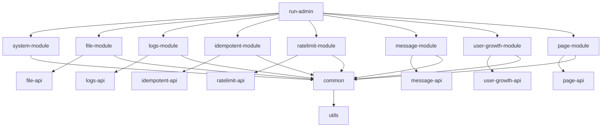

# 构建配置管理

<cite>
**本文档引用的文件**
- [build.gradle](file://build.gradle)
- [settings.gradle](file://settings.gradle)
- [gradle.properties](file://gradle.properties)
- [common/build.gradle](file://common/build.gradle)
- [system-module/build.gradle](file://system-module/build.gradle)
- [file-module/build.gradle](file://file-module/build.gradle)
- [run-admin/build.gradle](file://run-admin/build.gradle)
- [websocket/build.gradle](file://websocket/build.gradle)
- [message-module/build.gradle](file://message-module/build.gradle)
- [ratelimit-module/build.gradle](file://ratelimit-module/build.gradle)
- [system-module/src/main/java/com/fastproject/system/domain/SysUsers.java](file://system-module/src/main/java/com/fastproject/system/domain/SysUsers.java)
- [file-module/src/main/java/com/fastproject/file/domain/FileInfo.java](file://file-module/src/main/java/com/fastproject/file/domain/FileInfo.java)
- [logs-module/src/main/java/com/fastproject/logs/domain/OperationLog.java](file://logs-module/src/main/java/com/fastproject/logs/domain/OperationLog.java)
</cite>

## 目录
1. [引言](#引言)
2. [项目结构](#项目结构)
3. [核心组件](#核心组件)
4. [架构总览](#架构总览)
5. [详细组件分析](#详细组件分析)
6. [依赖关系分析](#依赖关系分析)
7. [性能考虑](#性能考虑)
8. [故障排除指南](#故障排除指南)
9. [结论](#结论)
10. [附录](#附录)

## 引言
本文件系统性梳理 Fast 项目的 Gradle 多模块构建配置与管理策略，重点覆盖：
- 根构建脚本的统一依赖管理、版本控制与插件配置
- 模块构建目录配置（.module-build）的作用与优势
- 模块间依赖声明最佳实践（compileOnly、implementation、api 等）
- 构建性能优化（并行构建、增量编译、缓存）
- 构建生命周期管理、打包策略与发布配置
- 常见问题排查与性能调优建议

## 项目结构
Fast 项目采用标准的 Gradle 多模块工程组织方式，通过 settings.gradle 统一声明子模块，根 build.gradle 提供统一的依赖管理、版本控制与插件配置，并对特定模块进行差异化定制。

```mermaid
graph TB
Root["根项目<br/>build.gradle"] --> Settings["模块清单<br/>settings.gradle"]
Root --> SubCommon["公共库 common<br/>build.gradle"]
Root --> SubSystem["系统模块 system-module<br/>build.gradle"]
Root --> SubFile["文件模块 file-module<br/>build.gradle"]
Root --> SubLogs["日志模块 logs-module<br/>build.gradle"]
Root --> SubIdem["幂等模块 idempotent-module<br/>build.gradle"]
Root --> SubRate["限流模块 ratelimit-module<br/>build.gradle"]
Root --> SubMsg["消息模块 message-module<br/>build.gradle"]
Root --> SubUG["用户成长模块 user-growth-module<br/>build.gradle"]
Root --> SubPage["页面模块 page-module<br/>build.gradle"]
Root --> SubRunAdmin["后台运行 run-admin<br/>build.gradle"]
Root --> SubWebSocket["WebSocket 服务 websocket<br/>build.gradle"]
Root --> SubServerWork["工作节点 server-work<br/>build.gradle"]
Root --> SubPlugin["客户插件 run-customer-plugin<br/>build.gradle"]
```

图表来源
- [build.gradle](file://build.gradle#L1-L457)
- [settings.gradle](file://settings.gradle#L1-L24)

章节来源
- [build.gradle](file://build.gradle#L1-L457)
- [settings.gradle](file://settings.gradle#L1-L24)

## 核心组件
- 根构建脚本（build.gradle）
  - 插件声明：java、Spring Boot、dependency-management、GraalVM native
  - 统一仓库与元信息：group、version、mavenCentral
  - 子项目统一配置：java 版本、依赖管理导入 Spring Boot BOM、通用依赖（slf4j、lombok）
  - 模块化构建目录：将各子模块输出目录重定向至 .module-build 下的独立子目录
  - 模块依赖矩阵：在根脚本中集中声明各模块之间的依赖关系，确保依赖一致性与可维护性
- 设置文件（settings.gradle）
  - 声明所有子模块，保证 Gradle 能正确解析与构建
- 属性配置（gradle.properties）
  - 关闭守护进程与虚拟文件系统监听，降低资源占用与冲突风险

章节来源
- [build.gradle](file://build.gradle#L1-L457)
- [settings.gradle](file://settings.gradle#L1-L24)
- [gradle.properties](file://gradle.properties#L1-L3)

## 架构总览
下图展示根构建脚本如何为各模块提供统一的依赖管理与插件配置，并通过 settings.gradle 将模块纳入构建域：

```mermaid
graph TB
subgraph "构建配置层"
Plugins["插件声明<br/>java/spring-boot/dependency-management/native"]
Repo["仓库配置<br/>mavenCentral"]
BOM["依赖管理导入<br/>Spring Boot BOM"]
JavaCfg["Java 版本配置<br/>source/target=25"]
Lombok["通用依赖<br/>slf4j/lombok"]
BuildDir["构建目录重定向<br/>.module-build/<module>"]
end
subgraph "模块层"
Common["common"]
Utils["utils"]
FileApi["file-api"]
FileModule["file-module"]
LogsApi["logs-api"]
LogsModule["logs-module"]
IdemApi["idempotent-api"]
IdemModule["idempotent-module"]
RateApi["ratelimit-api"]
RateModule["ratelimit-module"]
SystemModule["system-module"]
MsgApi["message-api"]
MsgModule["message-module"]
UGApi["user-growth-api"]
UGModule["user-growth-module"]
PageApi["page-api"]
PageModule["page-module"]
RunAdmin["run-admin"]
WebSocket["websocket"]
ServerWork["server-work"]
Plugin["run-customer-plugin"]
end
Plugins --> Common
Plugins --> FileModule
Plugins --> LogsModule
Plugins --> IdemModule
Plugins --> RateModule
Plugins --> SystemModule
Plugins --> MsgModule
Plugins --> UGModule
Plugins --> PageModule
Plugins --> RunAdmin
Plugins --> WebSocket
Plugins --> ServerWork
Plugins --> Plugin
Repo --> Common
Repo --> FileModule
Repo --> LogsModule
Repo --> IdemModule
Repo --> RateModule
Repo --> SystemModule
Repo --> MsgModule
Repo --> UGModule
Repo --> PageModule
Repo --> RunAdmin
Repo --> WebSocket
Repo --> ServerWork
Repo --> Plugin
BOM --> Common
BOM --> FileModule
BOM --> LogsModule
BOM --> IdemModule
BOM --> RateModule
BOM --> SystemModule
BOM --> MsgModule
BOM --> UGModule
BOM --> PageModule
BOM --> RunAdmin
BOM --> WebSocket
BOM --> ServerWork
BOM --> Plugin
JavaCfg --> Common
JavaCfg --> FileModule
JavaCfg --> LogsModule
JavaCfg --> IdemModule
JavaCfg --> RateModule
JavaCfg --> SystemModule
JavaCfg --> MsgModule
JavaCfg --> UGModule
JavaCfg --> PageModule
JavaCfg --> RunAdmin
JavaCfg --> WebSocket
JavaCfg --> ServerWork
JavaCfg --> Plugin
Lombok --> Common
Lombok --> FileModule
Lombok --> LogsModule
Lombok --> IdemModule
Lombok --> RateModule
Lombok --> SystemModule
Lombok --> MsgModule
Lombok --> UGModule
Lombok --> PageModule
Lombok --> RunAdmin
Lombok --> WebSocket
Lombok --> ServerWork
Lombok --> Plugin
BuildDir --> Common
BuildDir --> FileModule
BuildDir --> LogsModule
BuildDir --> IdemModule
BuildDir --> RateModule
BuildDir --> SystemModule
BuildDir --> MsgModule
BuildDir --> UGModule
BuildDir --> PageModule
BuildDir --> RunAdmin
BuildDir --> WebSocket
BuildDir --> ServerWork
BuildDir --> Plugin
```

图表来源
- [build.gradle](file://build.gradle#L1-L457)
- [settings.gradle](file://settings.gradle#L1-L24)

## 详细组件分析

### 根构建脚本（build.gradle）深度解析
- 插件与仓库
  - 在根脚本中声明基础插件与仓库，避免在每个子模块重复配置
  - 通过 dependency-management 插件导入 Spring Boot BOM，实现版本对齐与集中管理
- 统一 Java 配置
  - 统一设置 sourceCompatibility 与 targetCompatibility 为 25，确保跨模块兼容
- 通用依赖
  - 在 subprojects 区域声明 slf4j 与 lombok（compileOnly + annotationProcessor），避免在各模块重复声明
- 构建目录重定向
  - 使用 libraryModules 列表统一将各模块的 buildDir 重定向到 .module-build/<module>，便于隔离与清理
- 模块依赖矩阵
  - 在根脚本中集中声明模块间依赖，例如 run-admin 依赖 system-module、file-module、logs-module 等，确保依赖一致性与可追踪性

章节来源
- [build.gradle](file://build.gradle#L1-L457)

### 模块构建目录配置（.module-build）
- 作用
  - 将各子模块的构建产物（classes、resources、reports 等）输出到独立目录，避免相互污染
  - 便于并行构建时的隔离与缓存命中
- 优势
  - 清晰的构建产物组织，提升可维护性
  - 降低 IDE 与 CI 的磁盘占用与 IO 冲突
  - 便于按模块粒度清理与缓存管理

章节来源
- [build.gradle](file://build.gradle#L40-L58)

### 依赖类型最佳实践
- implementation
  - 用于模块内部实现所需的依赖，对外部隐藏，避免暴露给消费者模块
  - 示例：common、system-module、file-module 等模块对 Spring Boot Starter、Hibernate、MapStruct 等的依赖
- api（在当前项目中未直接使用）
  - 当需要将传递依赖暴露给消费者模块时使用（例如接口定义模块）
  - 由于当前项目多为库模块且未显式使用 api，建议保持 implementation 为主，必要时再引入 api
- compileOnly + annotationProcessor
  - 适用于注解处理器（如 Lombok、MapStruct Processor）场景，避免将处理器随产物发布
  - 示例：lombok（compileOnly + annotationProcessor）、MapStruct Processor（annotationProcessor）

章节来源
- [build.gradle](file://build.gradle#L24-L29)
- [system-module/build.gradle](file://system-module/build.gradle#L1-L19)
- [file-module/build.gradle](file://file-module/build.gradle#L1-L19)
- [message-module/build.gradle](file://message-module/build.gradle#L1-L19)
- [ratelimit-module/build.gradle](file://ratelimit-module/build.gradle#L1-L19)

### 模块插件与编译选项
- 库模块（java-library）
  - system-module、file-module、logs-module、idempotent-module、ratelimit-module、message-module、user-growth-module、page-module 等
  - 通过 java-library 插件规范库模块的生命周期与依赖可见性
- ORM 增强（hibernate orm）
  - 启用懒加载、脏标记、关联管理等增强特性，提升 ORM 性能与稳定性
- 编译参数
  - 添加 -parameters 参数，保留方法参数名称，便于框架反射与调试

章节来源
- [common/build.gradle](file://common/build.gradle#L1-L4)
- [system-module/build.gradle](file://system-module/build.gradle#L1-L19)
- [file-module/build.gradle](file://file-module/build.gradle#L1-L19)
- [message-module/build.gradle](file://message-module/build.gradle#L1-L19)
- [ratelimit-module/build.gradle](file://ratelimit-module/build.gradle#L1-L19)

### 应用模块与原生构建
- 应用模块（Spring Boot）
  - run-admin、websocket 等应用模块使用 org.springframework.boot 插件
- 原生镜像支持
  - 通过 org.graalvm.buildtools.native 插件启用 GraalVM 原生镜像构建能力
- 依赖声明
  - 应用模块根据业务需求声明数据库驱动、安全、Web、缓存等依赖

章节来源
- [run-admin/build.gradle](file://run-admin/build.gradle#L1-L6)
- [websocket/build.gradle](file://websocket/build.gradle#L1-L6)
- [build.gradle](file://build.gradle#L92-L134)
- [build.gradle](file://build.gradle#L414-L431)

### 数据模型与实体映射
- 实体类示例
  - system-module 中的 SysUsers
  - file-module 中的 FileInfo
  - logs-module 中的 OperationLog
- 设计要点
  - 统一继承 BaseEntity，具备软删除与租户隔离能力
  - 使用注解（@SQLDelete、@SQLRestriction）保障数据安全与查询一致性
  - 字段长度与类型设计遵循业务约束，避免冗余与性能问题

章节来源
- [system-module/src/main/java/com/fastproject/system/domain/SysUsers.java](file://system-module/src/main/java/com/fastproject/system/domain/SysUsers.java#L1-L95)
- [file-module/src/main/java/com/fastproject/file/domain/FileInfo.java](file://file-module/src/main/java/com/fastproject/file/domain/FileInfo.java#L1-L79)
- [logs-module/src/main/java/com/fastproject/logs/domain/OperationLog.java](file://logs-module/src/main/java/com/fastproject/logs/domain/OperationLog.java#L1-L93)

## 依赖关系分析
下图展示模块间依赖关系与数据流向，突出 run-admin 作为聚合入口与其他模块的耦合点：

图表来源
- [build.gradle](file://build.gradle#L92-L134)
- [build.gradle](file://build.gradle#L329-L345)
- [build.gradle](file://build.gradle#L383-L402)
- [build.gradle](file://build.gradle#L348-L365)
- [build.gradle](file://build.gradle#L165-L188)
- [build.gradle](file://build.gradle#L203-L229)
- [build.gradle](file://build.gradle#L245-L273)
- [build.gradle](file://build.gradle#L283-L303)
- [build.gradle](file://build.gradle#L136-L159)

章节来源
- [build.gradle](file://build.gradle#L92-L134)
- [build.gradle](file://build.gradle#L329-L345)
- [build.gradle](file://build.gradle#L383-L402)
- [build.gradle](file://build.gradle#L348-L365)
- [build.gradle](file://build.gradle#L165-L188)
- [build.gradle](file://build.gradle#L203-L229)
- [build.gradle](file://build.gradle#L245-L273)
- [build.gradle](file://build.gradle#L283-L303)
- [build.gradle](file://build.gradle#L136-L159)

## 性能考虑
- 并行构建
  - Gradle 默认支持并行任务执行，建议在 CI 与本地开发中开启并行以提升吞吐
- 增量编译
  - 启用增量编译（默认启用）可减少无变更模块的重新编译时间
- 构建目录隔离
  - .module-build 将各模块产物隔离，避免相互影响，提升缓存命中率
- 依赖管理
  - 通过 Spring Boot BOM 集中管理版本，减少冲突与重复下载
- 缓存配置
  - gradle.properties 中关闭 daemon 与 vfs watch 可降低资源占用，但会牺牲缓存复用；建议在 CI 中开启缓存并在本地按需调整
- 原生镜像
  - 对于 run-admin 与 websocket 等应用模块，可利用 GraalVM 原生镜像减少启动时间与内存占用

章节来源
- [gradle.properties](file://gradle.properties#L1-L3)
- [build.gradle](file://build.gradle#L1-L457)
- [run-admin/build.gradle](file://run-admin/build.gradle#L1-L6)
- [websocket/build.gradle](file://websocket/build.gradle#L1-L6)

## 故障排除指南
- 依赖冲突
  - 症状：构建失败或运行时类冲突
  - 排查：检查 Spring Boot BOM 导入是否生效，确认模块间依赖声明是否一致
  - 解决：优先使用 BOM 管理版本，避免在子模块重复指定版本
- Java 版本不匹配
  - 症状：编译错误或运行时报错
  - 排查：确认根脚本与各模块的 Java 版本一致
  - 解决：统一设置 sourceCompatibility 与 targetCompatibility
- 构建目录污染
  - 症状：模块间产物互相影响或缓存失效
  - 排查：确认 .module-build 目录是否被正确配置
  - 解决：清理 .module-build 并重新构建
- 注解处理器未生效
  - 症状：Lombok 或 MapStruct 生成代码缺失
  - 排查：确认 compileOnly 与 annotationProcessor 的组合是否正确
  - 解决：在对应模块中添加 annotationProcessor 依赖
- 原生镜像构建失败
  - 症状：nativeBuild 任务报错
  - 排查：确认 GraalVM 版本与插件版本兼容
  - 解决：升级插件或调整原生镜像配置

章节来源
- [build.gradle](file://build.gradle#L1-L457)
- [gradle.properties](file://gradle.properties#L1-L3)

## 结论
Fast 项目的构建配置通过根脚本集中管理插件、仓库、依赖与版本，结合 .module-build 的构建目录隔离策略，实现了清晰、可维护、高性能的多模块构建体系。建议在后续迭代中：
- 保持依赖管理集中化与版本对齐
- 严格区分 implementation 与 api 的使用边界
- 持续优化并行与缓存策略，结合 CI/CD 提升整体效率
- 对关键应用模块（如 run-admin、websocket）持续评估原生镜像收益与成本

## 附录
- 模块清单（settings.gradle）
  - system-module、run-admin、common、utils、websocket、run-customer-plugin、file-module、file-api、server-work、logs-module、logs-api、idempotent-module、idempotent-api、ratelimit-api、ratelimit-module、message-module、message-api、user-growth-module、user-growth-api、pay-module、pay-api、page-module、page-api
- 关键构建脚本路径
  - 根构建脚本：build.gradle
  - 模块清单：settings.gradle
  - 属性配置：gradle.properties
  - 库模块插件：common/build.gradle
  - ORM 增强模块：system-module/build.gradle、file-module/build.gradle、message-module/build.gradle、ratelimit-module/build.gradle
  - 应用模块插件：run-admin/build.gradle、websocket/build.gradle