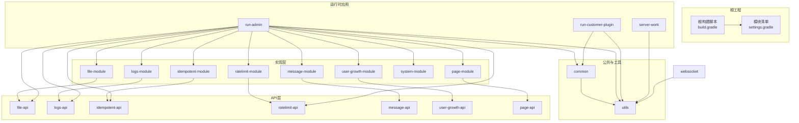
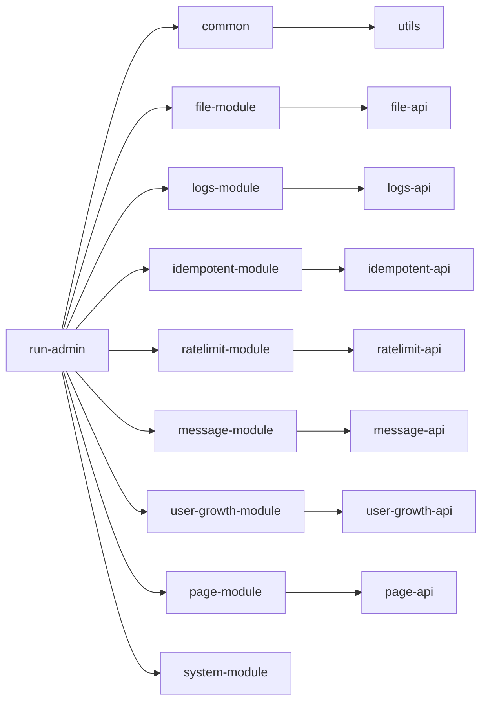
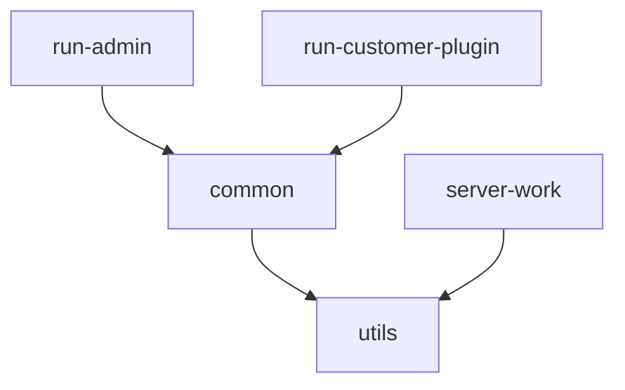
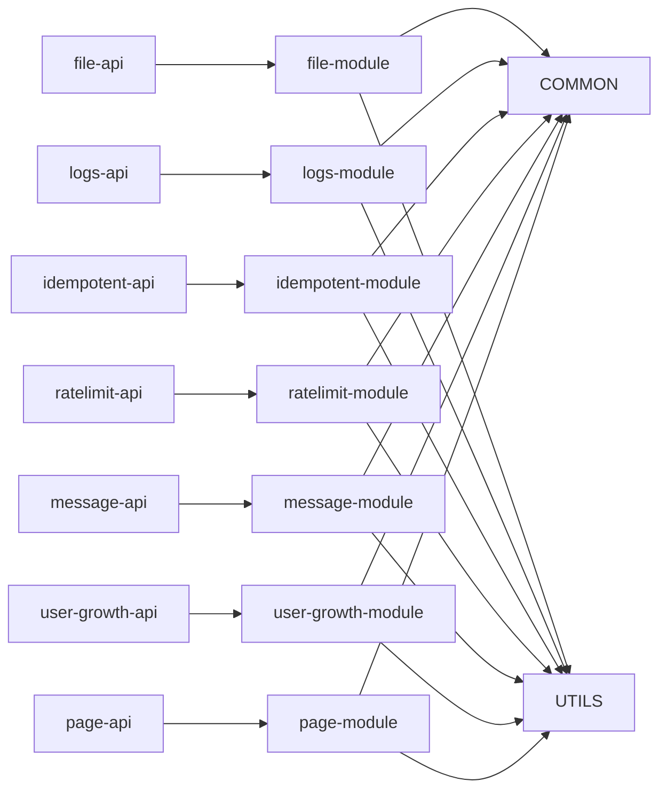
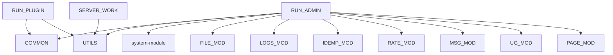
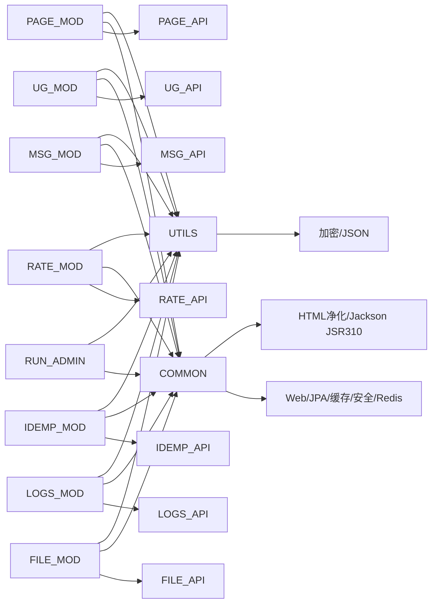

# 模块依赖关系

<cite>
**本文引用的文件**
- [build.gradle](file://build.gradle)
- [settings.gradle](file://settings.gradle)
- [common/build.gradle](file://common/build.gradle)
- [utils/build.gradle](file://utils/build.gradle)
- [file-api/build.gradle](file://file-api/build.gradle)
- [file-module/build.gradle](file://file-module/build.gradle)
- [logs-api/build.gradle](file://logs-api/build.gradle)
- [logs-module/build.gradle](file://logs-module/build.gradle)
- [idempotent-api/build.gradle](file://idempotent-api/build.gradle)
- [idempotent-module/build.gradle](file://idempotent-module/build.gradle)
- [ratelimit-api/build.gradle](file://ratelimit-api/build.gradle)
- [ratelimit-module/build.gradle](file://ratelimit-module/build.gradle)
- [message-api/build.gradle](file://message-api/build.gradle)
- [message-module/build.gradle](file://message-module/build.gradle)
- [user-growth-api/build.gradle](file://user-growth-api/build.gradle)
- [user-growth-module/build.gradle](file://user-growth-module/build.gradle)
- [page-api/build.gradle](file://page-api/build.gradle)
- [page-module/build.gradle](file://page-module/build.gradle)
- [system-module/build.gradle](file://system-module/build.gradle)
- [run-admin/build.gradle](file://run-admin/build.gradle)
- [run-customer-plugin/build.gradle](file://run-customer-plugin/build.gradle)
- [server-work/build.gradle](file://server-work/build.gradle)
</cite>

## 目录
1. [简介](#简介)
2. [项目结构](#项目结构)
3. [核心组件](#核心组件)
4. [架构总览](#架构总览)
5. [详细组件分析](#详细组件分析)
6. [依赖分析](#依赖分析)
7. [性能考虑](#性能考虑)
8. [故障排查指南](#故障排查指南)
9. [结论](#结论)
10. [附录](#附录)

## 简介
本文件聚焦于Fast项目的模块依赖关系，系统梳理24个子模块之间的直接与间接依赖、循环依赖识别与处理策略，并深入解析三大核心依赖关系模式：
- 公共模块对业务模块的依赖（如 common 对各业务模块提供基础设施）
- 业务模块对API模块的依赖（如 file-module 依赖 file-api）
- 服务模块对实现模块的依赖（如 logs-module 依赖 logs-api）

同时给出模块依赖图与依赖层次图、关键依赖点与潜在风险点标注、依赖注入机制与接口隔离原则的应用说明、依赖冲突解决策略、版本兼容性管理与依赖优化建议，并提供可操作的依赖关系可视化工具与分析方法。

## 项目结构
Fast项目采用多模块Gradle工程组织，根工程统一管理版本与依赖管理BOM，子模块按“公共库(common)、工具(utils)、API层、实现层、运行时应用(run-admin、run-customer-plugin、server-work)、WebSocket”进行分层。

- 根工程通过settings.gradle声明所有子模块，确保构建时可见。
- 根build.gradle集中定义Spring Boot版本、依赖管理BOM、全局依赖以及各子模块的显式依赖关系。
- 子模块build.gradle根据职责选择java-library或spring-boot插件，部分模块启用Hibernate ORM增强与GraalVM原生支持。

图表来源
- [build.gradle](file://build.gradle#L1-L457)
- [settings.gradle](file://settings.gradle#L1-L24)

章节来源
- [build.gradle](file://build.gradle#L1-L457)
- [settings.gradle](file://settings.gradle#L1-L24)

## 核心组件
- 公共基础层
  - common：提供通用基础设施（Web、JPA、缓存、安全、HTML净化、Jackson JSR310扩展、Redis客户端等），并依赖utils。
  - utils：提供加密、JSON、枚举等通用能力。
- 业务API层
  - file-api、logs-api、idempotent-api、ratelimit-api、message-api、user-growth-api、page-api：定义领域接口、注解、枚举与切面相关依赖（Spring AOP、AspectJ）。
- 业务实现层
  - file-module、logs-module、idempotent-module、ratelimit-module、message-module、user-growth-module、system-module、page-module：实现具体业务逻辑，依赖common与utils，并反向依赖各自API层。
- 运行时应用
  - run-admin：聚合所有业务模块，作为主应用启动。
  - run-customer-plugin：轻量级客户插件应用。
  - server-work：工作节点监控与任务执行。
- WebSocket
  - websocket：基于Netty与Thymeleaf的实时通信模块。

章节来源
- [build.gradle](file://build.gradle#L61-L457)
- [common/build.gradle](file://common/build.gradle#L1-L4)
- [utils/build.gradle](file://utils/build.gradle#L1-L4)
- [file-api/build.gradle](file://file-api/build.gradle#L1-L4)
- [file-module/build.gradle](file://file-module/build.gradle#L1-L19)
- [logs-api/build.gradle](file://logs-api/build.gradle#L1-L5)
- [logs-module/build.gradle](file://logs-module/build.gradle#L1-L19)
- [idempotent-api/build.gradle](file://idempotent-api/build.gradle#L1-L5)
- [idempotent-module/build.gradle](file://idempotent-module/build.gradle#L1-L19)
- [ratelimit-api/build.gradle](file://ratelimit-api/build.gradle#L1-L5)
- [ratelimit-module/build.gradle](file://ratelimit-module/build.gradle#L1-L19)
- [message-api/build.gradle](file://message-api/build.gradle#L1-L5)
- [message-module/build.gradle](file://message-module/build.gradle#L1-L19)
- [user-growth-api/build.gradle](file://user-growth-api/build.gradle#L1-L4)
- [user-growth-module/build.gradle](file://user-growth-module/build.gradle#L1-L19)
- [page-api/build.gradle](file://page-api/build.gradle#L1-L4)
- [page-module/build.gradle](file://page-module/build.gradle#L1-L19)
- [run-admin/build.gradle](file://run-admin/build.gradle#L1-L6)
- [run-customer-plugin/build.gradle](file://run-customer-plugin/build.gradle#L1-L6)
- [server-work/build.gradle](file://server-work/build.gradle#L1-L6)

## 架构总览
Fast项目采用“公共基础(common)+工具(utils)+API层+实现层+运行时应用”的分层架构。核心依赖关系模式如下：
- 公共模块对业务模块的依赖：common为所有业务模块提供基础设施；utils为公共模块与业务模块提供通用工具。
- 业务模块对API模块的依赖：实现层通过依赖API层接口进行编排，实现接口与实现分离。
- 服务模块对实现模块的依赖：运行时应用（如run-admin）聚合实现层模块，形成完整业务能力。

图表来源
- [build.gradle](file://build.gradle#L61-L457)

## 详细组件分析

### 公共模块与工具模块
- common
  - 提供Web、JPA、缓存、安全、HTML净化、Jackson JSR310扩展、Redis客户端等依赖。
  - 反向依赖utils，用于提供通用工具能力。
- utils
  - 提供加密、JSON等通用能力，被common与各业务模块复用。

图表来源
- [build.gradle](file://build.gradle#L61-L89)

章节来源
- [build.gradle](file://build.gradle#L61-L89)
- [common/build.gradle](file://common/build.gradle#L1-L4)
- [utils/build.gradle](file://utils/build.gradle#L1-L4)

### API层与实现层模式
- file-api 与 file-module
  - 实现层依赖API层接口，通过common与utils提供基础设施。
- logs-api 与 logs-module
  - 实现层依赖API层接口与common，引入AOP与AspectJ以支撑日志切面。
- idempotent-api 与 idempotent-module
  - 实现层依赖API层接口与common，引入AOP与AspectJ以支撑幂等切面。
- ratelimit-api 与 ratelimit-module
  - 实现层依赖API层接口与common，引入AOP与AspectJ以支撑限流切面。
- message-api 与 message-module
  - 实现层依赖API层接口与common，引入邮件发送等能力。
- user-growth-api 与 user-growth-module
  - 实现层依赖API层接口与common，面向用户成长体系。
- page-api 与 page-module
  - 实现层依赖API层接口与common，面向页面配置与组件管理。

图表来源
- [build.gradle](file://build.gradle#L136-L411)

章节来源
- [build.gradle](file://build.gradle#L136-L411)
- [file-api/build.gradle](file://file-api/build.gradle#L1-L4)
- [file-module/build.gradle](file://file-module/build.gradle#L1-L19)
- [logs-api/build.gradle](file://logs-api/build.gradle#L1-L5)
- [logs-module/build.gradle](file://logs-module/build.gradle#L1-L19)
- [idempotent-api/build.gradle](file://idempotent-api/build.gradle#L1-L5)
- [idempotent-module/build.gradle](file://idempotent-module/build.gradle#L1-L19)
- [ratelimit-api/build.gradle](file://ratelimit-api/build.gradle#L1-L5)
- [ratelimit-module/build.gradle](file://ratelimit-module/build.gradle#L1-L19)
- [message-api/build.gradle](file://message-api/build.gradle#L1-L5)
- [message-module/build.gradle](file://message-module/build.gradle#L1-L19)
- [user-growth-api/build.gradle](file://user-growth-api/build.gradle#L1-L4)
- [user-growth-module/build.gradle](file://user-growth-module/build.gradle#L1-L19)
- [page-api/build.gradle](file://page-api/build.gradle#L1-L4)
- [page-module/build.gradle](file://page-module/build.gradle#L1-L19)

### 运行时应用与聚合
- run-admin
  - 聚合common、utils、system-module、file-module、logs-module、idempotent-module、ratelimit-module、message-module、user-growth-module、page-module等，作为主应用启动。
- run-customer-plugin
  - 聚合common与utils，作为客户插件应用。
- server-work
  - 聚合utils与数据访问能力，用于工作节点监控与任务执行。

图表来源
- [build.gradle](file://build.gradle#L92-L134)
- [run-admin/build.gradle](file://run-admin/build.gradle#L1-L6)
- [run-customer-plugin/build.gradle](file://run-customer-plugin/build.gradle#L1-L6)
- [server-work/build.gradle](file://server-work/build.gradle#L1-L6)

章节来源
- [build.gradle](file://build.gradle#L92-L134)
- [run-admin/build.gradle](file://run-admin/build.gradle#L1-L6)
- [run-customer-plugin/build.gradle](file://run-customer-plugin/build.gradle#L1-L6)
- [server-work/build.gradle](file://server-work/build.gradle#L1-L6)

### WebSocket模块
- websocket
  - 基于Netty与Thymeleaf，依赖utils与H2数据库，用于实时通信场景。

章节来源
- [build.gradle](file://build.gradle#L414-L431)
- [server-work/build.gradle](file://server-work/build.gradle#L1-L6)

## 依赖分析

### 直接依赖与间接依赖
- 直接依赖
  - run-admin对common、utils、system-module、file-module、logs-module、idempotent-module、ratelimit-module、message-module、user-growth-module、page-module的显式依赖。
  - 各实现层对common与utils的直接依赖。
  - 各实现层对对应API层的直接依赖。
- 间接依赖
  - 通过common传递到各实现层的Web、JPA、缓存、安全、Redis等依赖。
  - 通过utils传递到各模块的加密、JSON等通用能力。

图表来源
- [build.gradle](file://build.gradle#L61-L411)

章节来源
- [build.gradle](file://build.gradle#L61-L411)

### 循环依赖识别与处理
- 识别路径
  - API层与实现层之间为单向依赖（实现层依赖API层），未见循环。
  - common与utils之间为单向依赖（common依赖utils），未见循环。
  - 运行时应用对业务模块为单向聚合，未见循环。
- 处理策略
  - 保持API层仅定义接口与切面，实现层仅实现接口，避免双向耦合。
  - 将跨模块共享能力收敛至common/utils，减少重复与环路可能。
  - 通过依赖管理BOM统一版本，避免因版本差异导致的隐式循环。

章节来源
- [build.gradle](file://build.gradle#L61-L457)

### 关键依赖点与潜在风险点
- 关键依赖点
  - common对utils的依赖，是所有业务模块能力复用的基础。
  - 各实现层对common的依赖，统一了Web、JPA、缓存、安全、Redis等基础设施。
  - 各实现层对API层的依赖，确保接口与实现分离，便于替换与测试。
- 潜在风险点
  - 版本不一致：Spring Boot版本固定于4.0.3，需确保各模块依赖与之兼容。
  - 组件版本冲突：如Redis客户端、缓存库、ORM等，需统一管理。
  - 运行时应用聚合过多模块，启动时间与内存占用上升，需关注优化。

章节来源
- [build.gradle](file://build.gradle#L18-L22)
- [build.gradle](file://build.gradle#L61-L457)

### 依赖注入机制与接口隔离原则
- 依赖注入机制
  - 通过Spring Boot自动装配与模块化配置，实现组件注入与生命周期管理。
  - 各模块通过API层暴露接口，实现层通过实现类完成具体功能，运行时应用通过依赖注入组合模块。
- 接口隔离原则
  - API层仅定义必要接口与注解，避免实现细节泄露到接口层。
  - 实现层专注于业务逻辑与数据访问，通过common与utils提供通用能力。

章节来源
- [build.gradle](file://build.gradle#L18-L22)
- [file-api/build.gradle](file://file-api/build.gradle#L1-L4)
- [logs-api/build.gradle](file://logs-api/build.gradle#L1-L5)
- [idempotent-api/build.gradle](file://idempotent-api/build.gradle#L1-L5)
- [ratelimit-api/build.gradle](file://ratelimit-api/build.gradle#L1-L5)
- [message-api/build.gradle](file://message-api/build.gradle#L1-L5)
- [user-growth-api/build.gradle](file://user-growth-api/build.gradle#L1-L4)
- [page-api/build.gradle](file://page-api/build.gradle#L1-L4)

### 依赖冲突解决策略
- 使用依赖管理BOM统一版本，确保模块间版本一致性。
- 显式声明模块间依赖，避免传递性依赖导致的冲突。
- 对第三方库进行版本锁定与兼容性验证，优先使用长期支持版本。

章节来源
- [build.gradle](file://build.gradle#L18-L22)

### 版本兼容性管理
- Spring Boot版本：统一使用4.0.3，确保各模块依赖与之兼容。
- Hibernate ORM版本：统一使用7.2.4.Final，保证实体映射与增强一致性。
- 其他关键库版本：在根工程中集中声明，避免各模块重复或冲突。

章节来源
- [build.gradle](file://build.gradle#L18-L22)
- [system-module/build.gradle](file://system-module/build.gradle#L3)
- [file-module/build.gradle](file://file-module/build.gradle#L3)
- [logs-module/build.gradle](file://logs-module/build.gradle#L3)
- [idempotent-module/build.gradle](file://idempotent-module/build.gradle#L3)

### 依赖优化建议
- 按需引入：仅引入模块实际使用的依赖，减少不必要的传递依赖。
- 分层清晰：保持API层、实现层、公共层职责明确，避免交叉耦合。
- 启动优化：对运行时应用进行懒加载与条件装配，缩短启动时间。
- 缓存与连接池：合理配置缓存与数据库连接池参数，提升性能与稳定性。

章节来源
- [build.gradle](file://build.gradle#L61-L457)

## 性能考虑
- 启动性能
  - run-admin聚合模块较多，建议启用条件装配与延迟初始化，减少启动时资源占用。
- 数据访问性能
  - 统一使用JPA与Hibernate增强，结合缓存与连接池配置，提升查询与事务性能。
- 网络与实时通信
  - websocket模块基于Netty，建议合理设置线程池与缓冲区大小，避免高并发下的资源瓶颈。

[本节为通用性能指导，无需特定文件来源]

## 故障排查指南
- 依赖冲突
  - 使用Gradle依赖树命令查看冲突模块，定位冲突来源并调整版本或排除传递依赖。
- 版本不匹配
  - 检查根工程BOM与模块依赖是否与Spring Boot 4.0.3兼容，修正不兼容版本。
- 启动失败
  - 针对运行时应用，逐步移除非必要模块依赖，定位导致启动异常的模块。

章节来源
- [build.gradle](file://build.gradle#L18-L22)

## 结论
Fast项目的模块依赖关系清晰地体现了“公共基础(common)+工具(utils)+API层+实现层+运行时应用”的分层架构。通过统一的依赖管理BOM与明确的依赖方向，实现了接口与实现分离、模块间低耦合高内聚。建议在后续迭代中持续优化启动性能、强化版本兼容性管理，并通过依赖可视化工具定期审视依赖健康度，确保系统的可维护性与可扩展性。

[本节为总结性内容，无需特定文件来源]

## 附录

### 依赖关系可视化工具与分析方法
- Gradle依赖树
  - 使用命令查看模块依赖树，识别传递依赖与冲突。
- 依赖报告
  - 生成依赖报告，导出模块依赖清单，辅助审计与合规。
- 可视化工具
  - 使用IDE插件或第三方工具生成模块依赖图，直观展示依赖关系与层级。

[本节为通用方法说明，无需特定文件来源]