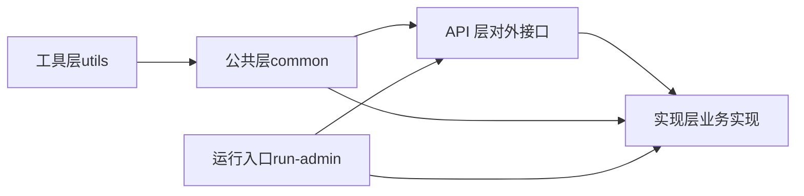
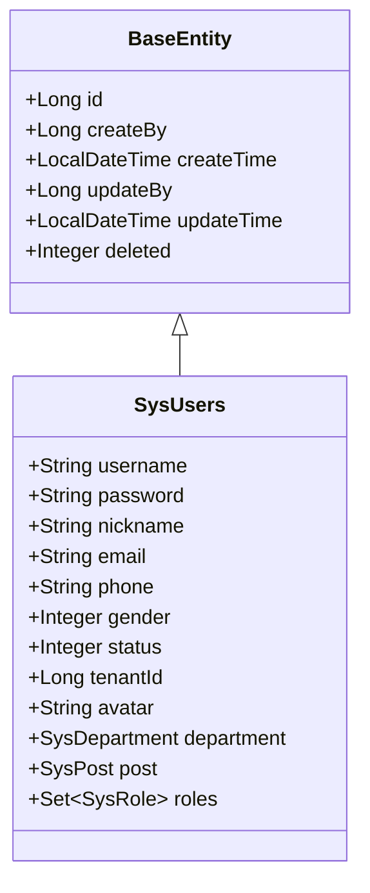
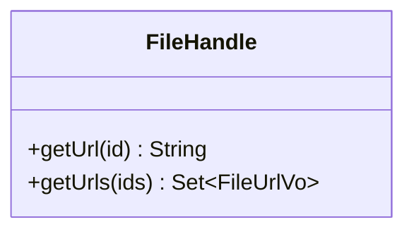
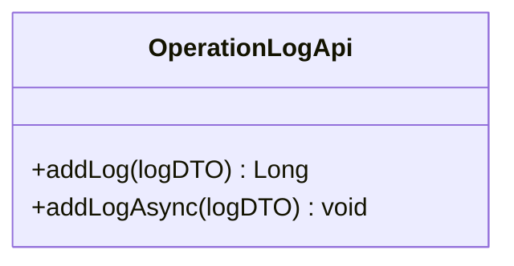
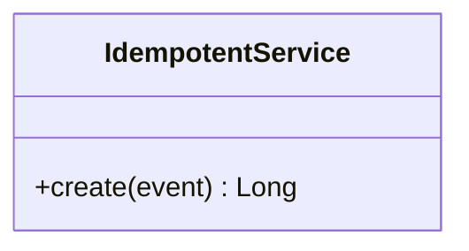
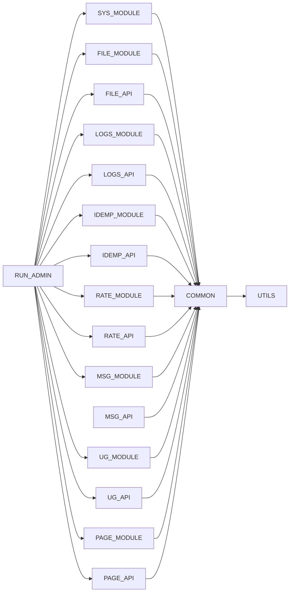

# 模块划分原则

<cite>
**本文引用的文件**
- [settings.gradle](file://settings.gradle)
- [build.gradle](file://build.gradle)
- [system-module/build.gradle](file://system-module/build.gradle)
- [file-module/build.gradle](file://file-module/build.gradle)
- [logs-module/build.gradle](file://logs-module/build.gradle)
- [idempotent-module/build.gradle](file://idempotent-module/build.gradle)
- [ratelimit-module/build.gradle](file://ratelimit-module/build.gradle)
- [system-module/src/main/java/com/fastproject/system/domain/SysUsers.java](file://system-module/src/main/java/com/fastproject/system/domain/SysUsers.java)
- [file-api/src/main/java/com/fastproject/file/api/FileHandle.java](file://file-api/src/main/java/com/fastproject/file/api/FileHandle.java)
- [logs-api/src/main/java/com/fastproject/logs/api/OperationLogApi.java](file://logs-api/src/main/java/com/fastproject/logs/api/OperationLogApi.java)
- [idempotent-api/src/main/java/com/fastproject/idempotent/api/IdempotentService.java](file://idempotent-api/src/main/java/com/fastproject/idempotent/api/IdempotentService.java)
- [common/src/main/java/com/fastproject/db/BaseEntity.java](file://common/src/main/java/com/fastproject/db/BaseEntity.java)
- [common/src/main/java/com/fastproject/utils/TokenUtils.java](file://common/src/main/java/com/fastproject/utils/TokenUtils.java)
</cite>

## 目录
1. [引言](#引言)
2. [项目结构](#项目结构)
3. [核心组件](#核心组件)
4. [架构总览](#架构总览)
5. [详细组件分析](#详细组件分析)
6. [依赖分析](#依赖分析)
7. [性能考量](#性能考量)
8. [故障排查指南](#故障排查指南)
9. [结论](#结论)
10. [附录](#附录)

## 引言
本文件系统化阐述 Fast 项目的模块划分原则与设计哲学，覆盖以下维度：
- 功能领域划分：系统管理、文件管理、日志管理、幂等控制、限流策略、消息服务、用户成长体系、页面配置、支付能力等
- 技术层次划分：API 层（对外暴露接口）、实现层（具体业务实现）、公共层（通用基础设施）
- 业务边界划分：用户中心、内容管理、订单系统等（以现有模块映射到对应业务域）
- 模块内聚性与耦合度：通过清晰的边界与依赖方向降低耦合，提升内聚
- 单一职责原则的应用：每个模块聚焦一个核心能力域
- 命名规范、包结构与代码组织方式
- 最佳实践与常见反模式
- 模块重构与演进建议

## 项目结构
Fast 项目采用 Gradle 多模块工程，根工程统一管理版本与依赖，各子模块按“API 层 + 实现层”的双模块模式组织，公共能力下沉至公共模块，运行时入口模块聚合所需能力。

```mermaid
graph TB
subgraph "根工程"
ROOT["settings.gradle<br/>声明所有子模块"]
BUILD["build.gradle<br/>统一依赖与构建配置"]
end
COMMON["common<br/>公共基础设施"]
UTILS["utils<br/>工具集"]
RUN_ADMIN["run-admin<br/>后台管理入口"]
RUN_CUSTOMER_PLUGIN["run-customer-plugin<br/>客户插件入口"]
SERVER_WORK["server-work<br/>工作节点服务"]
FILE_API["file-api"]
FILE_MODULE["file-module"]
LOGS_API["logs-api"]
LOGS_MODULE["logs-module"]
IDEMP_API["idempotent-api"]
IDEMP_MODULE["idempotent-module"]
RATE_API["ratelimit-api"]
RATE_MODULE["ratelimit-module"]
MSG_API["message-api"]
MSG_MODULE["message-module"]
UG_API["user-growth-api"]
UG_MODULE["user-growth-module"]
PAGE_API["page-api"]
PAGE_MODULE["page-module"]
SYS_MODULE["system-module"]
WS["websocket"]
UI["fast-ui<br/>前端应用"]
ROOT --> COMMON
ROOT --> UTILS
ROOT --> RUN_ADMIN
ROOT --> RUN_CUSTOMER_PLUGIN
ROOT --> SERVER_WORK
ROOT --> FILE_API
ROOT --> FILE_MODULE
ROOT --> LOGS_API
ROOT --> LOGS_MODULE
ROOT --> IDEMP_API
ROOT --> IDEMP_MODULE
ROOT --> RATE_API
ROOT --> RATE_MODULE
ROOT --> MSG_API
ROOT --> MSG_MODULE
ROOT --> UG_API
ROOT --> UG_MODULE
ROOT --> PAGE_API
ROOT --> PAGE_MODULE
ROOT --> SYS_MODULE
ROOT --> WS
RUN_ADMIN --> SYS_MODULE
RUN_ADMIN --> FILE_MODULE
RUN_ADMIN --> FILE_API
RUN_ADMIN --> LOGS_MODULE
RUN_ADMIN --> LOGS_API
RUN_ADMIN --> IDEMP_MODULE
RUN_ADMIN --> IDEMP_API
RUN_ADMIN --> RATE_MODULE
RUN_ADMIN --> RATE_API
RUN_ADMIN --> MSG_MODULE
RUN_ADMIN --> UG_MODULE
RUN_ADMIN --> UG_API
RUN_ADMIN --> PAGE_MODULE
RUN_ADMIN --> PAGE_API
RUN_CUSTOMER_PLUGIN --> UTILS
RUN_CUSTOMER_PLUGIN --> COMMON
SERVER_WORK --> UTILS
WS --> UTILS
UI --> RUN_ADMIN
```

图表来源
- [settings.gradle](file://settings.gradle#L1-L24)
- [build.gradle](file://build.gradle#L92-L134)

章节来源
- [settings.gradle](file://settings.gradle#L1-L24)
- [build.gradle](file://build.gradle#L7-L38)

## 核心组件
- 公共基础层（common）：提供统一的实体基类、数据访问辅助、安全属性、Redis 模板、工具类等，为所有业务模块提供一致的基础设施
- 工具层（utils）：提供加解密、JSON、枚举状态等通用工具，被公共层与各业务模块复用
- 运行入口层：run-admin 作为后台管理聚合入口，run-customer-plugin 作为客户侧插件入口，server-work 作为独立工作节点
- 业务能力层：按功能域拆分为 file、logs、idempotent、ratelimit、message、user-growth、page、system 等模块，均遵循 API 层 + 实现层的双模块模式

章节来源
- [build.gradle](file://build.gradle#L61-L89)
- [build.gradle](file://build.gradle#L92-L134)
- [build.gradle](file://build.gradle#L328-L345)

## 架构总览
模块划分遵循“能力域 + 双模块”结构，API 层仅暴露接口契约，实现层承载具体业务逻辑；公共层沉淀跨域通用能力；运行入口模块通过显式依赖聚合所需能力，避免隐式耦合。

图表来源
- [build.gradle](file://build.gradle#L40-L58)
- [build.gradle](file://build.gradle#L61-L89)
- [build.gradle](file://build.gradle#L92-L134)

## 详细组件分析

### 系统管理模块（system-module）
- 设计理念：用户、角色、部门、字典、租户等系统级资源的统一管理，强调数据模型与权限约束的一致性
- 关键点：
  - 使用统一的 BaseEntity 作为所有实体的基类，内置主键、审计字段与软删除
  - 用户实体关联部门、岗位、角色集合，体现组织与权限模型
  - 通过租户范围接口实现多租户隔离
- 内聚性：围绕“系统资源与权限”单一职责，内聚度高
- 耦合度：仅依赖 common/utils，不反向依赖上层运行入口

图表来源
- [common/src/main/java/com/fastproject/db/BaseEntity.java](file://common/src/main/java/com/fastproject/db/BaseEntity.java#L14-L47)
- [system-module/src/main/java/com/fastproject/system/domain/SysUsers.java](file://system-module/src/main/java/com/fastproject/system/domain/SysUsers.java#L21-L94)

章节来源
- [system-module/src/main/java/com/fastproject/system/domain/SysUsers.java](file://system-module/src/main/java/com/fastproject/system/domain/SysUsers.java#L1-L95)
- [common/src/main/java/com/fastproject/db/BaseEntity.java](file://common/src/main/java/com/fastproject/db/BaseEntity.java#L1-L48)

### 文件管理模块（file-api + file-module）
- 设计理念：抽象文件处理接口（API 层），实现层负责存储策略、路径解析、上传下载等
- 关键点：
  - API 层定义文件 URL 查询接口，实现层提供具体实现
  - 支持多种存储策略与权重选择器，便于扩展
- 内聚性：围绕“文件处理”单一职责
- 耦合度：通过 API 层与公共层交互，避免对上层业务的直接依赖

图表来源
- [file-api/src/main/java/com/fastproject/file/api/FileHandle.java](file://file-api/src/main/java/com/fastproject/file/api/FileHandle.java#L7-L21)

章节来源
- [file-api/src/main/java/com/fastproject/file/api/FileHandle.java](file://file-api/src/main/java/com/fastproject/file/api/FileHandle.java#L1-L22)

### 日志管理模块（logs-api + logs-module）
- 设计理念：统一的操作日志记录接口，支持同步与异步两种调用方式
- 关键点：
  - API 层定义日志添加接口，实现层负责持久化与异步队列
  - 通过切面或拦截器在业务流程中自动埋点
- 内聚性：围绕“操作日志”单一职责
- 耦合度：通过 API 层解耦业务模块与日志实现

图表来源
- [logs-api/src/main/java/com/fastproject/logs/api/OperationLogApi.java](file://logs-api/src/main/java/com/fastproject/logs/api/OperationLogApi.java#L9-L24)

章节来源
- [logs-api/src/main/java/com/fastproject/logs/api/OperationLogApi.java](file://logs-api/src/main/java/com/fastproject/logs/api/OperationLogApi.java#L1-L25)

### 幂等控制模块（idempotent-api + idempotent-module）
- 设计理念：防止重复提交导致的数据不一致问题，通过幂等 ID 与去重日志保障一致性
- 关键点：
  - API 层定义幂等服务接口，实现层负责事件去重与日志记录
  - 结合切面或注解在关键业务入口进行拦截
- 内聚性：围绕“幂等校验”单一职责
- 耦合度：通过 API 层与公共层交互，避免对业务实现细节的耦合

图表来源
- [idempotent-api/src/main/java/com/fastproject/idempotent/api/IdempotentService.java](file://idempotent-api/src/main/java/com/fastproject/idempotent/api/IdempotentService.java#L9-L18)

章节来源
- [idempotent-api/src/main/java/com/fastproject/idempotent/api/IdempotentService.java](file://idempotent-api/src/main/java/com/fastproject/idempotent/api/IdempotentService.java#L1-L19)

### 限流策略模块（ratelimit-api + ratelimit-module）
- 设计理念：基于 API、用户、IP 等维度的限流配置与记录，保障系统稳定性
- 关键点：
  - API 层定义限流相关枚举与接口，实现层负责策略执行与记录
  - 支持全局与细粒度限流策略
- 内聚性：围绕“限流控制”单一职责
- 耦合度：通过 API 层与公共层交互，避免对业务实现细节的耦合

章节来源
- [build.gradle](file://build.gradle#L202-L242)

### 消息服务模块（message-api + message-module）
- 设计理念：统一的消息模板、记录与发送能力，支持邮件等多渠道
- 关键点：
  - API 层定义消息类型与状态枚举，实现层负责发送策略与记录
- 内聚性：围绕“消息能力”单一职责
- 耦合度：通过 API 层与公共层交互，避免对业务实现细节的耦合

章节来源
- [build.gradle](file://build.gradle#L244-L280)

### 用户成长模块（user-growth-api + user-growth-module）
- 设计理念：积分账户、等级配置与记录等用户成长体系
- 关键点：
  - API 层定义成长相关接口，实现层负责业务规则与持久化
- 内聚性：围绕“用户成长”单一职责
- 耦合度：通过 API 层与公共层交互，避免对业务实现细节的耦合

章节来源
- [build.gradle](file://build.gradle#L282-L310)

### 页面配置模块（page-api + page-module）
- 设计理念：页面应用、组件、类型与 Web 配置的统一管理
- 关键点：
  - API 层定义页面相关枚举与接口，实现层负责配置与渲染
- 内聚性：围绕“页面配置”单一职责
- 耦合度：通过 API 层与公共层交互，避免对业务实现细节的耦合

章节来源
- [build.gradle](file://build.gradle#L136-L162)

### 公共层与工具层
- 公共层（common）：统一实体基类、查询帮助、雪花 ID 监听器、Redis 模板、安全属性、工具类等
- 工具层（utils）：加解密、JSON、枚举状态等通用工具
- 作用：为所有业务模块提供一致的基础设施，降低重复开发成本

章节来源
- [common/src/main/java/com/fastproject/db/BaseEntity.java](file://common/src/main/java/com/fastproject/db/BaseEntity.java#L1-L48)
- [common/src/main/java/com/fastproject/utils/TokenUtils.java](file://common/src/main/java/com/fastproject/utils/TokenUtils.java#L1-L320)
- [build.gradle](file://build.gradle#L61-L89)

## 依赖分析
- 模块依赖方向：运行入口模块（run-admin、run-customer-plugin、server-work）单向依赖业务模块与公共模块，避免反向依赖
- API 层与实现层：API 层仅暴露接口，实现层实现业务逻辑，二者通过显式依赖连接
- 公共层下沉：common 与 utils 下沉跨域通用能力，减少重复依赖
- 依赖图示意：

图表来源
- [build.gradle](file://build.gradle#L92-L134)
- [build.gradle](file://build.gradle#L328-L345)
- [build.gradle](file://build.gradle#L382-L411)

章节来源
- [build.gradle](file://build.gradle#L92-L134)
- [build.gradle](file://build.gradle#L328-L411)

## 性能考量
- 缓存策略：公共层使用本地缓存与 Redis 双层缓存，结合续命机制，降低数据库压力
- ORM 增强：各模块启用 Hibernate 延迟初始化、脏标记与关联管理，提升持久化性能
- 异步日志：日志模块提供异步写入接口，避免阻塞业务主流程
- 限流与幂等：限流模块与幂等模块在高并发场景下保障系统稳定与数据一致性

章节来源
- [common/src/main/java/com/fastproject/utils/TokenUtils.java](file://common/src/main/java/com/fastproject/utils/TokenUtils.java#L30-L36)
- [system-module/build.gradle](file://system-module/build.gradle#L7-L13)
- [logs-api/src/main/java/com/fastproject/logs/api/OperationLogApi.java](file://logs-api/src/main/java/com/fastproject/logs/api/OperationLogApi.java#L20-L24)

## 故障排查指南
- 认证与会话：检查 TokenUtils 的本地缓存与 Redis 键空间、TTL 设置与续命逻辑
- 数据一致性：核对 BaseEntity 的软删除与 SQL Restriction 是否生效
- 幂等与限流：确认幂等事件与限流记录是否正确落库，避免重复提交与突发流量冲击
- 日志埋点：验证日志 API 的同步/异步调用是否按预期执行

章节来源
- [common/src/main/java/com/fastproject/utils/TokenUtils.java](file://common/src/main/java/com/fastproject/utils/TokenUtils.java#L134-L178)
- [common/src/main/java/com/fastproject/db/BaseEntity.java](file://common/src/main/java/com/fastproject/db/BaseEntity.java#L19-L21)

## 结论
Fast 项目的模块划分以“能力域 + 双模块 + 公共下沉”为核心设计原则，实现了高内聚、低耦合与可演进的工程结构。通过明确的依赖方向与清晰的职责边界，既保证了业务快速迭代，也为未来横向扩展与纵向深化提供了坚实基础。

## 附录

### 模块命名规范与包结构组织
- 命名规范：模块名采用小写短语，必要时使用连字符；API 层与实现层成对出现，如 file-api 与 file-module
- 包结构：按领域分层组织（domain、repository、service、mapper、storage、vo 等），保持层次清晰
- 代码组织：接口与实现分离，公共能力下沉至 common/utils，避免循环依赖

章节来源
- [settings.gradle](file://settings.gradle#L1-L24)
- [build.gradle](file://build.gradle#L40-L58)

### 单一职责原则的应用
- 每个模块聚焦一个核心能力域（如文件、日志、幂等、限流等）
- API 层仅暴露接口契约，实现层承载业务逻辑
- 公共层仅提供跨域通用能力，不包含业务规则

章节来源
- [file-api/src/main/java/com/fastproject/file/api/FileHandle.java](file://file-api/src/main/java/com/fastproject/file/api/FileHandle.java#L1-L22)
- [logs-api/src/main/java/com/fastproject/logs/api/OperationLogApi.java](file://logs-api/src/main/java/com/fastproject/logs/api/OperationLogApi.java#L1-L25)
- [idempotent-api/src/main/java/com/fastproject/idempotent/api/IdempotentService.java](file://idempotent-api/src/main/java/com/fastproject/idempotent/api/IdempotentService.java#L1-L19)

### 模块划分最佳实践
- 以业务域为单位拆分模块，避免“大而全”的模块
- 明确 API 层与实现层的边界，禁止实现层反向依赖 API 层
- 公共能力下沉，避免重复造轮子
- 严格控制依赖方向，运行入口模块只依赖业务模块与公共模块

章节来源
- [build.gradle](file://build.gradle#L92-L134)
- [build.gradle](file://build.gradle#L328-L345)

### 常见反模式与规避
- 反向依赖：实现层依赖运行入口或业务模块，应通过 API 层解耦
- 循环依赖：避免模块间相互依赖，必要时引入公共层或重新拆分
- 职责不清：同一模块承担多个能力域，应按单一职责原则拆分

章节来源
- [build.gradle](file://build.gradle#L92-L134)

### 模块重构与演进指导
- 新增能力：先定义 API 层接口，再实现具体逻辑，确保对外契约稳定
- 能力合并：当两个模块职责相近时，考虑合并为更粗粒度的能力域
- 依赖优化：定期审视模块依赖关系，移除不必要的耦合，强化公共层的抽象能力

章节来源
- [build.gradle](file://build.gradle#L40-L58)
- [build.gradle](file://build.gradle#L61-L89)