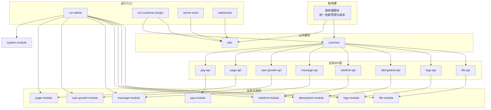
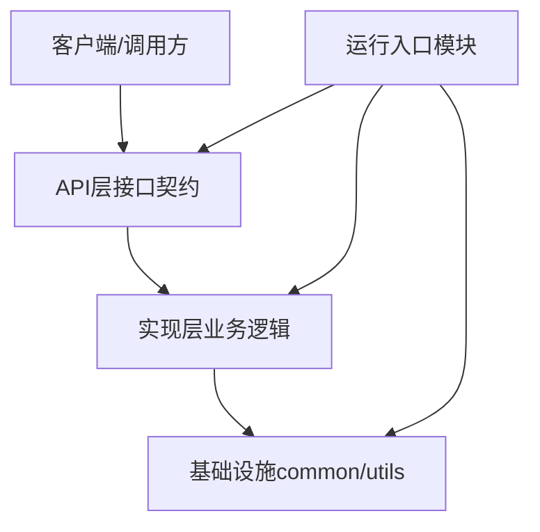
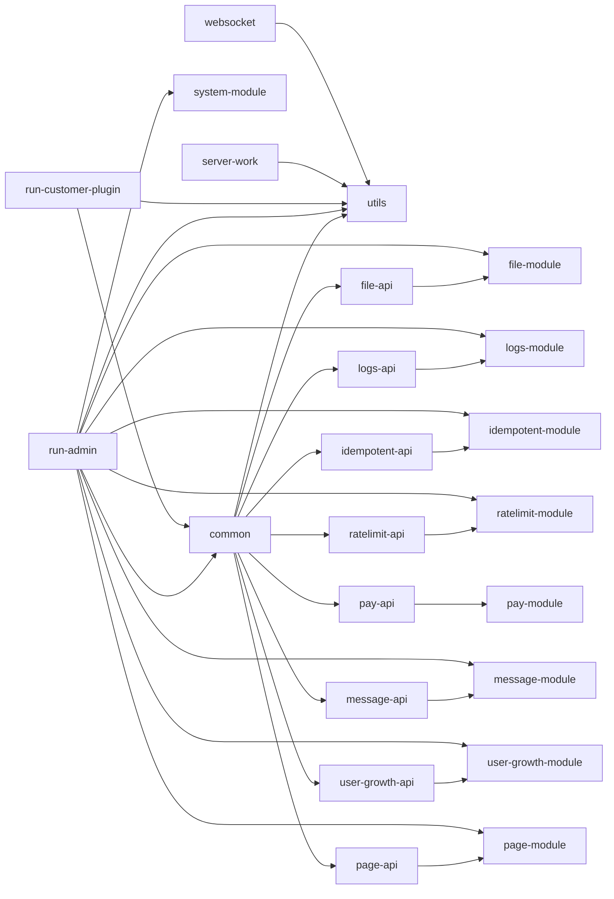
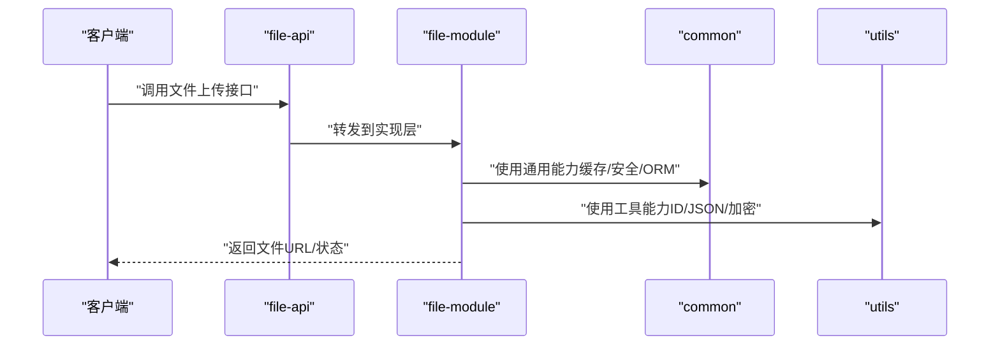

# 模块化设计

<cite>
**本文引用的文件**
- [build.gradle](file://build.gradle)
- [settings.gradle](file://settings.gradle)
- [common/build.gradle](file://common/build.gradle)
- [utils/build.gradle](file://utils/build.gradle)
- [system-module/build.gradle](file://system-module/build.gradle)
- [file-module/build.gradle](file://file-module/build.gradle)
- [logs-module/build.gradle](file://logs-module/build.gradle)
- [idempotent-module/build.gradle](file://idempotent-module/build.gradle)
</cite>

## 目录
1. [引言](#引言)
2. [项目结构](#项目结构)
3. [核心组件](#核心组件)
4. [架构总览](#架构总览)
5. [详细组件分析](#详细组件分析)
6. [依赖分析](#依赖分析)
7. [性能考虑](#性能考虑)
8. [故障排查指南](#故障排查指南)
9. [结论](#结论)
10. [附录](#附录)

## 引言
本设计文档面向Fast项目的模块化架构，系统性阐述24个子模块的划分原则、职责边界与设计思想；解释公共模块（common、utils）与各业务模块（如system-module、file-module、logs-module、idempotent-module、ratelimit-module、message-module、user-growth-module、page-module等）之间的职责分离与接口设计；阐明API层与实现层的分离策略；总结模块化带来的代码复用、独立部署与团队协作优势；并给出模块构建配置、版本管理与发布策略建议，附带模块依赖图与模块交互流程图，以及扩展指南与最佳实践。

## 项目结构
Fast项目采用多模块Gradle工程组织，根构建脚本统一管理版本与依赖管理，子模块按功能域拆分，形成清晰的层次化结构：
- 根级构建：集中定义依赖管理BOM、全局Java编译选项与子模块构建目录布局
- 子模块：按“公共基础库”和“业务能力模块”两类组织，其中业务模块进一步细分为API与实现两层
- 运行入口：run-admin、run-customer-plugin、server-work等作为应用运行入口模块，聚合所需业务模块

图表来源
- [build.gradle](file://build.gradle#L14-L58)
- [settings.gradle](file://settings.gradle#L1-L24)

章节来源
- [build.gradle](file://build.gradle#L1-L457)
- [settings.gradle](file://settings.gradle#L1-L24)

## 核心组件
本节聚焦公共模块与关键业务模块的职责与边界，并说明API层与实现层的分离策略。

- 公共模块
  - common：提供通用基础设施（数据访问、缓存、安全、工具类等），被所有业务模块依赖
  - utils：提供跨领域工具集（加解密、ID生成、状态枚举、JSON处理等）

- 业务模块（以API+实现二元组呈现）
  - 文件能力：file-api（声明文件上传、下载、存储策略选择等接口）、file-module（基于common与utils的具体实现，含存储策略、仓储、服务与VO）
  - 日志能力：logs-api（声明操作日志注解与切面）、logs-module（基于common与file-api实现日志记录与查询）
  - 幂等能力：idempotent-api（声明幂等注解、重复事件与切面）、idempotent-module（基于common实现重复事件记录与去重）
  - 限流能力：ratelimit-api（声明限流策略枚举与API）、ratelimit-module（基于common实现全局/用户/IP维度限流）
  - 消息能力：message-api（消息类型与状态枚举）、message-module（基于common与utils实现消息模板、发送与记录）
  - 用户成长能力：user-growth-api（积分/等级相关API）、user-growth-module（基于common实现账户与记录）
  - 页面配置能力：page-api（页面配置相关接口）、page-module（基于common与utils实现页面应用、组件、类型与Web配置）
  - 支付能力：pay-api、pay-module（预留支付相关能力，当前为占位模块）

- 运行入口模块
  - run-admin：后台管理聚合模块，依赖common、utils及各业务模块实现
  - run-customer-plugin：客户插件运行模块，依赖common与utils
  - server-work：工作节点模块，用于采集与任务执行
  - websocket：实时通信模块，依赖utils与本地数据库

章节来源
- [build.gradle](file://build.gradle#L61-L456)
- [settings.gradle](file://settings.gradle#L1-L24)

## 架构总览
模块化架构遵循“公共基础—业务API—业务实现—运行入口”的分层设计，API层仅暴露契约，实现层封装具体逻辑，运行入口通过装配所需模块完成业务编排。

图表来源
- [build.gradle](file://build.gradle#L61-L456)

## 详细组件分析

### 公共模块：common 与 utils
- 职责
  - common：提供ORM增强、Web、安全、缓存、XSS过滤、Jackson JSR310支持、Redis客户端等通用能力
  - utils：提供加密、JSON、ID生成、状态枚举等工具能力
- 设计要点
  - 低耦合高内聚，避免引入业务逻辑
  - 通过依赖注入与Spring Boot Starter生态集成，便于在上层模块按需启用
- 接口设计
  - common对utils存在单向依赖，确保工具能力向上游提供
  - 各业务模块通过common间接使用utils

章节来源
- [build.gradle](file://build.gradle#L61-L89)
- [common/build.gradle](file://common/build.gradle#L1-L4)
- [utils/build.gradle](file://utils/build.gradle#L1-L4)

### 业务模块：file-module 与 file-api
- 职责
  - file-api：定义文件处理接口、URL返回值等契约
  - file-module：实现文件存储策略、仓储、服务与VO，依赖common与utils
- 设计要点
  - 存储策略抽象与上下文模式，支持多存储源（如OSS）与权重选择
  - VO与领域模型分离，便于接口演进与兼容
- 接口设计
  - API层仅声明契约，实现层提供具体策略与仓储

章节来源
- [build.gradle](file://build.gradle#L382-L411)
- [file-module/build.gradle](file://file-module/build.gradle#L1-L19)

### 业务模块：logs-module 与 logs-api
- 职责
  - logs-api：定义日志注解、切面与DTO
  - logs-module：实现日志记录、查询与仓储
- 设计要点
  - 基于AOP切面自动记录操作日志，降低业务侵入
  - 与file-api结合，支持日志附件或链接

章节来源
- [build.gradle](file://build.gradle#L347-L380)

### 业务模块：idempotent-module 与 idempotent-api
- 职责
  - idempotent-api：声明幂等注解、重复事件与切面
  - idempotent-module：实现重复事件记录与去重
- 设计要点
  - 切面拦截请求，基于唯一键去重，记录重复事件日志

章节来源
- [build.gradle](file://build.gradle#L164-L200)
- [idempotent-module/build.gradle](file://idempotent-module/build.gradle#L1-L19)

### 业务模块：ratelimit-module 与 ratelimit-api
- 职责
  - ratelimit-api：声明限流策略枚举与API
  - ratelimit-module：实现全局/用户/IP维度限流
- 设计要点
  - 结合Caffeine与Redis实现本地与分布式限流策略

章节来源
- [build.gradle](file://build.gradle#L202-L242)

### 业务模块：message-module 与 message-api
- 职责
  - message-api：定义消息类型与状态枚举
  - message-module：实现消息模板、发送与记录
- 设计要点
  - 支持邮件等多渠道发送，记录发送结果与状态

章节来源
- [build.gradle](file://build.gradle#L244-L280)

### 业务模块：user-growth-module 与 user-growth-api
- 职责
  - user-growth-api：定义积分/等级相关API
  - user-growth-module：实现账户与记录
- 设计要点
  - 领域模型与仓储分离，支持灵活的积分/等级规则

章节来源
- [build.gradle](file://build.gradle#L282-L310)

### 业务模块：page-module 与 page-api
- 职责
  - page-api：定义页面配置相关接口
  - page-module：实现页面应用、组件、类型与Web配置
- 设计要点
  - 与common、file-api、utils集成，支撑页面动态配置

章节来源
- [build.gradle](file://build.gradle#L136-L162)

### 运行入口模块
- run-admin：聚合系统、文件、日志、幂等、限流、消息、用户成长、页面等模块
- run-customer-plugin：轻量运行入口，依赖common与utils
- server-work：工作节点，依赖utils与本地数据库
- websocket：实时通信，依赖utils与Netty/H2

章节来源
- [build.gradle](file://build.gradle#L92-L134)
- [build.gradle](file://build.gradle#L315-L326)
- [build.gradle](file://build.gradle#L413-L431)
- [build.gradle](file://build.gradle#L435-L456)

## 依赖分析
模块间依赖遵循“单向依赖、自顶向下”的原则，API层不依赖实现层，实现层依赖公共模块与API层。

图表来源
- [build.gradle](file://build.gradle#L61-L456)
- [settings.gradle](file://settings.gradle#L1-L24)

章节来源
- [build.gradle](file://build.gradle#L61-L456)
- [settings.gradle](file://settings.gradle#L1-L24)

## 性能考虑
- ORM增强与编译参数
  - 各业务模块启用Hibernate ORM增强与编译参数，提升实体映射与反射性能
- 缓存与限流
  - 使用Caffeine与Redis实现本地与分布式缓存与限流，降低数据库压力
- 存储策略
  - 文件模块采用策略模式与权重选择，结合OSS等外部存储，优化IO性能
- 运行入口聚合
  - run-admin聚合多个模块，注意启动时序与资源初始化顺序，避免阻塞

章节来源
- [system-module/build.gradle](file://system-module/build.gradle#L1-L19)
- [file-module/build.gradle](file://file-module/build.gradle#L1-L19)
- [logs-module/build.gradle](file://logs-module/build.gradle#L1-L19)
- [idempotent-module/build.gradle](file://idempotent-module/build.gradle#L1-L19)
- [build.gradle](file://build.gradle#L61-L456)

## 故障排查指南
- 构建失败
  - 检查根构建脚本中依赖管理BOM与子模块构建目录设置是否一致
  - 确认子模块build.gradle插件与编译参数配置正确
- 运行异常
  - 核对运行入口模块依赖是否完整（如run-admin缺少某业务模块）
  - 检查common与utils版本一致性，避免类冲突
- 性能问题
  - 关注缓存命中率与限流阈值配置
  - 对文件存储策略进行压测，评估外部存储延迟

章节来源
- [build.gradle](file://build.gradle#L14-L58)
- [build.gradle](file://build.gradle#L61-L456)

## 结论
Fast项目的模块化设计通过公共模块与业务模块的清晰分层，实现了API与实现的严格分离，提升了代码复用度、可维护性与团队协作效率。配合统一的构建配置与版本管理策略，模块化架构为独立部署与演进提供了坚实基础。

## 附录

### 模块构建配置与版本管理
- 统一依赖管理
  - 根构建脚本导入Spring Boot依赖管理BOM，确保版本一致性
- 子模块构建
  - 公共模块与业务模块分别配置插件与编译参数，保持一致的Java版本与编译选项
- 版本与分发
  - 所有模块共享根版本号，发布时可按模块单独打版本或整体发布

章节来源
- [build.gradle](file://build.gradle#L14-L38)
- [build.gradle](file://build.gradle#L40-L58)

### 发布策略建议
- 版本号
  - 采用语义化版本，公共模块与API层优先保证接口稳定性
- 发布粒度
  - 公共模块与API层先行发布，实现层跟随更新
- 变更通告
  - 通过变更日志记录破坏性变更与迁移指引

### 模块交互流程示例（以文件上传为例）

图表来源
- [build.gradle](file://build.gradle#L382-L411)
- [build.gradle](file://build.gradle#L61-L89)

### 模块扩展指南与最佳实践
- 新增业务模块步骤
  - 在settings.gradle中注册新模块
  - 在根构建脚本中添加模块依赖与构建目录配置
  - 若为业务模块，先新增API层，再新增实现层
  - 实现层依赖common与对应API层，必要时依赖utils
- 最佳实践
  - API层仅暴露必要接口，避免实现细节泄露
  - 使用策略模式与工厂模式解耦可替换组件
  - 为每个模块编写单元测试与集成测试
  - 保持公共模块无业务耦合，避免循环依赖

章节来源
- [settings.gradle](file://settings.gradle#L1-L24)
- [build.gradle](file://build.gradle#L61-L456)