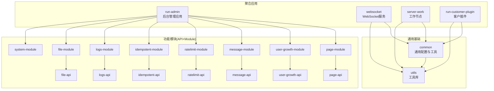
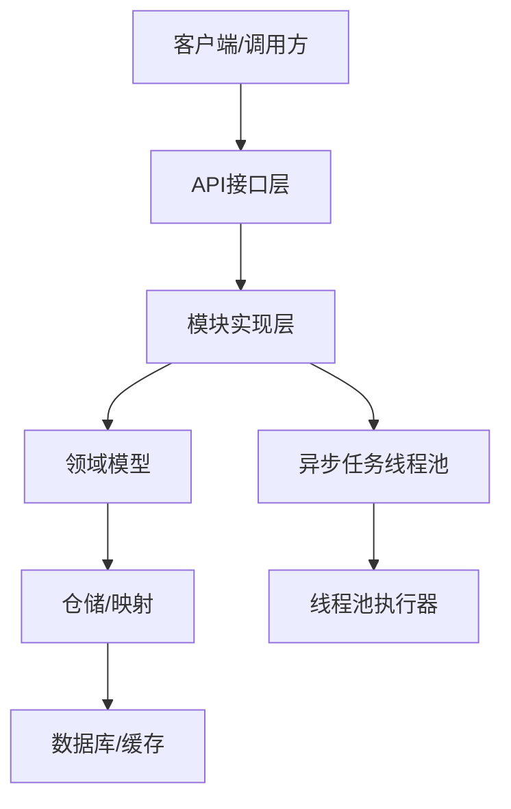
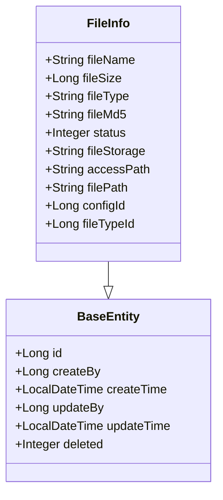
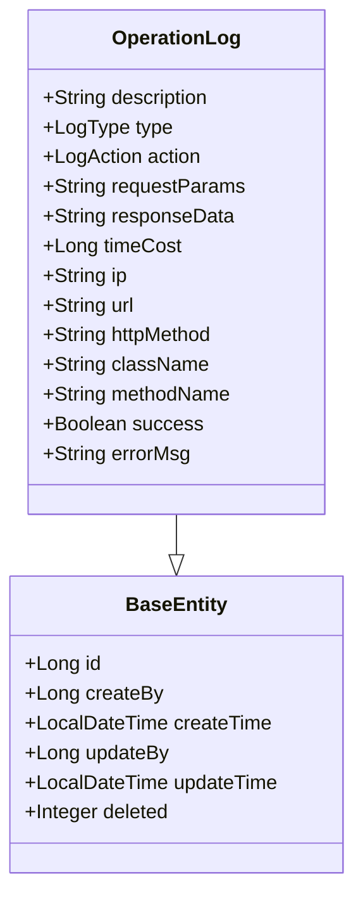
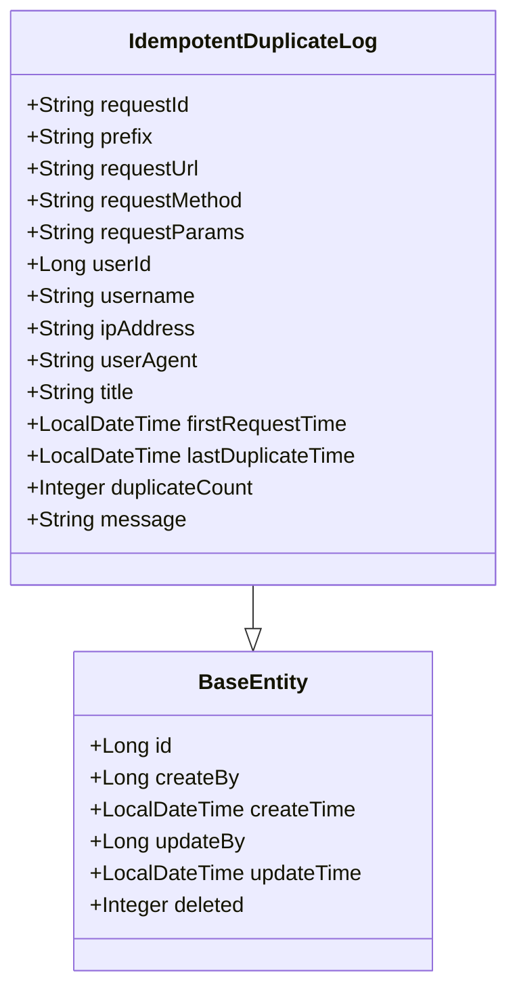
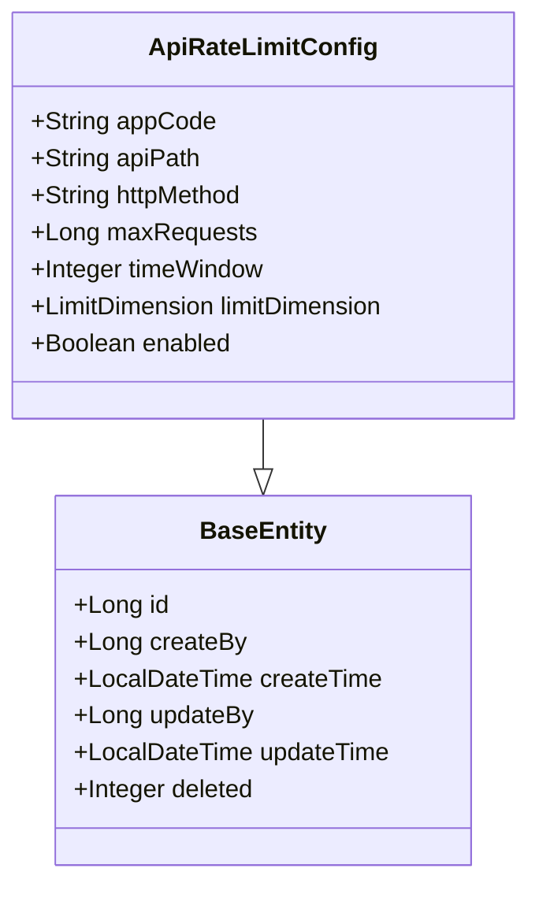
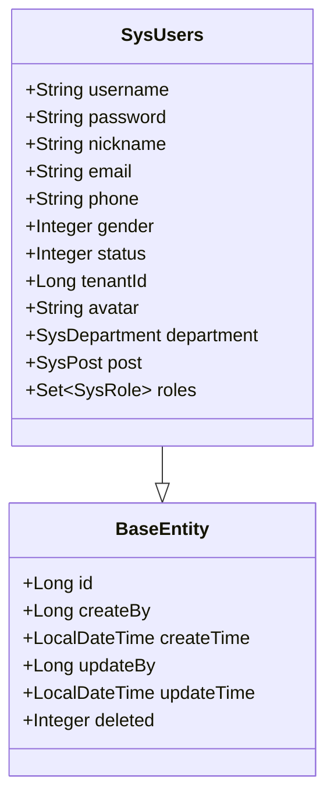
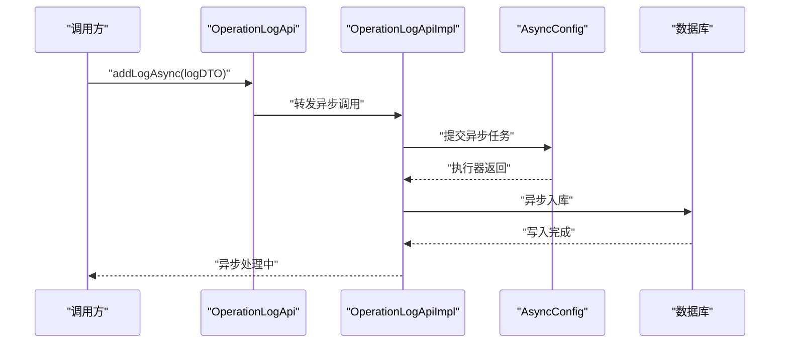
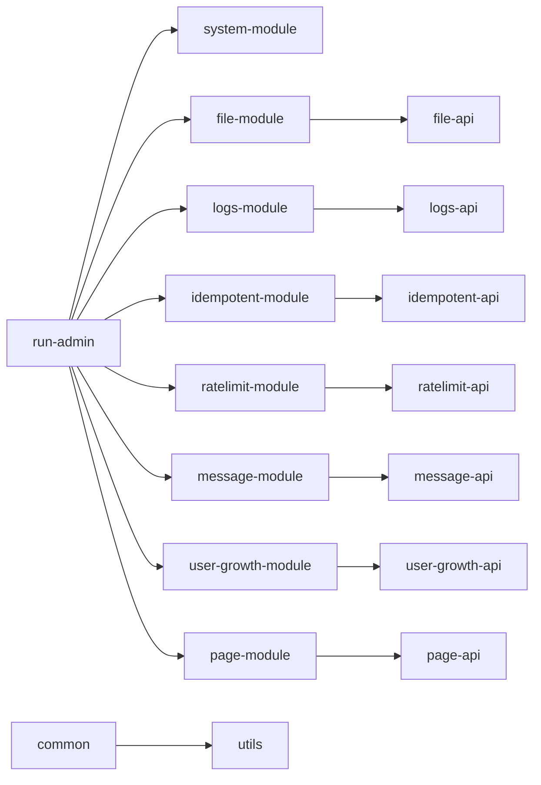

# 模块扩展指南

<cite>
**本文档引用的文件**
- [build.gradle](file://build.gradle)
- [settings.gradle](file://settings.gradle)
- [AsyncConfig.java](file://common/src/main/java/com/fastproject/config/AsyncConfig.java)
- [BaseEntity.java](file://common/src/main/java/com/fastproject/db/BaseEntity.java)
- [SnowflakeIdListener.java](file://common/src/main/java/com/fastproject/db/SnowflakeIdListener.java)
- [FileHandle.java](file://file-api/src/main/java/com/fastproject/file/api/FileHandle.java)
- [FileHandleImpl.java](file://file-module/src/main/java/com/fastproject/file/api/FileHandleImpl.java)
- [FileInfo.java](file://file-module/src/main/java/com/fastproject/file/domain/FileInfo.java)
- [OperationLogApi.java](file://logs-api/src/main/java/com/fastproject/logs/api/OperationLogApi.java)
- [OperationLogApiImpl.java](file://logs-module/src/main/java/com/fastproject/logs/service/impl/OperationLogApiImpl.java)
- [OperationLog.java](file://logs-module/src/main/java/com/fastproject/logs/domain/OperationLog.java)
- [IdempotentService.java](file://idempotent-api/src/main/java/com/fastproject/idempotent/api/IdempotentService.java)
- [IdempotentServiceImpl.java](file://idempotent-module/src/main/java/com/fastproject/idempotent/service/impl/IdempotentServiceImpl.java)
- [IdempotentDuplicateLog.java](file://idempotent-module/src/main/java/com/fastproject/idempotent/domain/IdempotentDuplicateLog.java)
- [ApiRateLimitConfig.java](file://ratelimit-module/src/main/java/com/fastproject/ratelimit/domain/ApiRateLimitConfig.java)
- [SysUsers.java](file://system-module/src/main/java/com/fastproject/system/domain/SysUsers.java)
- [run-admin/build.gradle](file://run-admin/build.gradle)
- [websocket/build.gradle](file://websocket/build.gradle)
- [server-work/build.gradle](file://server-work/build.gradle)
- [run-customer-plugin/build.gradle](file://run-customer-plugin/build.gradle)
</cite>

## 目录
1. [引言](#引言)
2. [项目结构](#项目结构)
3. [核心组件](#核心组件)
4. [架构总览](#架构总览)
5. [详细组件分析](#详细组件分析)
6. [依赖关系分析](#依赖关系分析)
7. [性能考虑](#性能考虑)
8. [故障排查指南](#故障排查指南)
9. [结论](#结论)
10. [附录](#附录)

## 引言
本指南面向需要在Fast项目中新增或扩展模块的开发者，提供从模块初始化、依赖配置到代码结构设计与集成实践的完整流程。文档以现有模块为蓝本，总结可复用的设计约定与最佳实践，帮助团队在保持一致性的同时高效扩展系统能力。

## 项目结构
Fast项目采用多模块Gradle工程组织，根构建脚本统一管理版本与依赖管理，各子模块按功能域拆分，形成“API接口层 + 模块实现层”的分层模式。核心模块包括系统、文件、日志、幂等、限流、消息、用户成长、页面、WebSocket、工作节点等；运行时应用通过聚合模块引入所需功能模块。

图表来源
- [settings.gradle](file://settings.gradle#L1-L24)
- [build.gradle](file://build.gradle#L92-L134)
- [build.gradle](file://build.gradle#L329-L345)
- [build.gradle](file://build.gradle#L383-L402)
- [build.gradle](file://build.gradle#L348-L365)
- [build.gradle](file://build.gradle#L165-L188)
- [build.gradle](file://build.gradle#L203-L229)
- [build.gradle](file://build.gradle#L245-L273)
- [build.gradle](file://build.gradle#L283-L303)
- [build.gradle](file://build.gradle#L136-L159)
- [build.gradle](file://build.gradle#L414-L431)

章节来源
- [settings.gradle](file://settings.gradle#L1-L24)
- [build.gradle](file://build.gradle#L1-L457)

## 核心组件
- 统一基类与主键策略
  - 所有持久化实体继承统一基类，内置创建/更新信息与软删除字段，并通过监听器生成分布式ID。
- 异步任务线程池
  - 提供统一的异步任务执行器，支持拒绝策略与优雅停机等待。
- 模块间契约
  - API模块定义接口契约，Module模块提供实现，应用通过引入Module使用能力。

章节来源
- [BaseEntity.java](file://common/src/main/java/com/fastproject/db/BaseEntity.java#L1-L48)
- [AsyncConfig.java](file://common/src/main/java/com/fastproject/config/AsyncConfig.java#L1-L48)

## 架构总览
模块扩展遵循“API接口 + 实体模型 + 仓储/服务 + 控制器/监听器”的分层设计，结合Spring Boot Starter与JPA/Hibernate实现数据访问与事务控制。运行时应用通过Gradle聚合依赖，按需装配功能模块。

图表来源
- [OperationLogApi.java](file://logs-api/src/main/java/com/fastproject/logs/api/OperationLogApi.java#L1-L25)
- [OperationLogApiImpl.java](file://logs-module/src/main/java/com/fastproject/logs/service/impl/OperationLogApiImpl.java)
- [AsyncConfig.java](file://common/src/main/java/com/fastproject/config/AsyncConfig.java#L1-L48)

## 详细组件分析

### 文件模块扩展
- 设计要点
  - 使用统一基类作为实体超类，确保软删除与审计字段一致。
  - 通过API接口对外暴露文件URL解析能力，模块内实现具体策略。
- 数据模型关系

图表来源
- [BaseEntity.java](file://common/src/main/java/com/fastproject/db/BaseEntity.java#L1-L48)
- [FileInfo.java](file://file-module/src/main/java/com/fastproject/file/domain/FileInfo.java#L1-L79)

- 扩展流程
  - 新增实体：继承统一基类，标注软删除注解，定义业务字段。
  - 对外接口：在API模块定义接口方法，约束输入输出。
  - 模块实现：在Module模块实现接口，注入仓储与服务，处理业务逻辑。
  - 集成验证：在聚合应用中引入Module，编写单元/集成测试覆盖关键路径。

章节来源
- [FileHandle.java](file://file-api/src/main/java/com/fastproject/file/api/FileHandle.java#L1-L22)
- [FileHandleImpl.java](file://file-module/src/main/java/com/fastproject/file/api/FileHandleImpl.java)
- [FileInfo.java](file://file-module/src/main/java/com/fastproject/file/domain/FileInfo.java#L1-L79)

### 日志模块扩展
- 设计要点
  - 通过API接口向其他模块开放同步/异步日志记录能力。
  - 使用切面拦截统一埋点，减少业务侵入。
- 数据模型关系

图表来源
- [BaseEntity.java](file://common/src/main/java/com/fastproject/db/BaseEntity.java#L1-L48)
- [OperationLog.java](file://logs-module/src/main/java/com/fastproject/logs/domain/OperationLog.java#L1-L93)

- 扩展流程
  - 在API模块定义addLog/addLogAsync方法，明确参数与返回值。
  - 在Module模块实现接口，必要时注入异步执行器。
  - 在切面中绑定拦截规则，自动收集请求上下文并落库。
  - 在聚合应用中启用相关Starter与配置，确保线程池可用。

章节来源
- [OperationLogApi.java](file://logs-api/src/main/java/com/fastproject/logs/api/OperationLogApi.java#L1-L25)
- [OperationLogApiImpl.java](file://logs-module/src/main/java/com/fastproject/logs/service/impl/OperationLogApiImpl.java)
- [AsyncConfig.java](file://common/src/main/java/com/fastproject/config/AsyncConfig.java#L1-L48)

### 幂等模块扩展
- 设计要点
  - 通过注解与切面实现幂等校验，避免重复提交。
  - 记录重复提交日志，便于后续审计与告警。
- 数据模型关系

图表来源
- [BaseEntity.java](file://common/src/main/java/com/fastproject/db/BaseEntity.java#L1-L48)
- [IdempotentDuplicateLog.java](file://idempotent-module/src/main/java/com/fastproject/idempotent/domain/IdempotentDuplicateLog.java#L1-L97)

- 扩展流程
  - 在API模块定义幂等服务接口，提供创建幂等记录的能力。
  - 在Module模块实现接口，结合Redis或数据库记录请求指纹。
  - 在切面中拦截带注解的方法，校验是否重复并记录日志。
  - 在聚合应用中引入相关Starter与缓存配置。

章节来源
- [IdempotentService.java](file://idempotent-api/src/main/java/com/fastproject/idempotent/api/IdempotentService.java#L1-L19)
- [IdempotentServiceImpl.java](file://idempotent-module/src/main/java/com/fastproject/idempotent/service/impl/IdempotentServiceImpl.java)
- [IdempotentDuplicateLog.java](file://idempotent-module/src/main/java/com/fastproject/idempotent/domain/IdempotentDuplicateLog.java#L1-L97)

### 限流模块扩展
- 设计要点
  - 以配置驱动限流策略，支持按API、IP、用户等维度限流。
  - 提供全局与单API两级限流配置，便于精细化控制。
- 数据模型关系

图表来源
- [BaseEntity.java](file://common/src/main/java/com/fastproject/db/BaseEntity.java#L1-L48)
- [ApiRateLimitConfig.java](file://ratelimit-module/src/main/java/com/fastproject/ratelimit/domain/ApiRateLimitConfig.java#L1-L64)

- 扩展流程
  - 在API模块定义限流配置接口，提供查询/更新能力。
  - 在Module模块实现接口，结合令牌桶/滑动窗口算法执行限流。
  - 在网关或过滤器中读取配置并执行限流判断。
  - 在聚合应用中引入相关Starter与缓存配置。

章节来源
- [ApiRateLimitConfig.java](file://ratelimit-module/src/main/java/com/fastproject/ratelimit/domain/ApiRateLimitConfig.java#L1-L64)

### 系统模块扩展
- 设计要点
  - 用户实体支持租户隔离，关联部门、岗位与角色集合。
  - 通过统一基类保证审计字段与软删除一致性。
- 数据模型关系

图表来源
- [BaseEntity.java](file://common/src/main/java/com/fastproject/db/BaseEntity.java#L1-L48)
- [SysUsers.java](file://system-module/src/main/java/com/fastproject/system/domain/SysUsers.java#L1-L95)

- 扩展流程
  - 新增用户相关实体时，继承统一基类并实现租户隔离接口。
  - 在API模块定义用户相关接口，约束输入输出。
  - 在Module模块实现接口，注入仓储与服务，处理权限与租户逻辑。
  - 在聚合应用中启用安全与数据访问配置。

章节来源
- [SysUsers.java](file://system-module/src/main/java/com/fastproject/system/domain/SysUsers.java#L1-L95)

### 模块间集成最佳实践
- 事件驱动集成
  - 使用注解与切面触发幂等事件，模块内部监听器消费事件并记录日志。
- API网关集成
  - 在API模块定义统一接口，网关侧路由至对应Module实现。
- 消息队列集成
  - 将耗时或异步任务放入消息队列，Module侧消费者处理业务。

图表来源
- [OperationLogApi.java](file://logs-api/src/main/java/com/fastproject/logs/api/OperationLogApi.java#L1-L25)
- [OperationLogApiImpl.java](file://logs-module/src/main/java/com/fastproject/logs/service/impl/OperationLogApiImpl.java)
- [AsyncConfig.java](file://common/src/main/java/com/fastproject/config/AsyncConfig.java#L1-L48)

## 依赖关系分析
- 模块依赖
  - 聚合应用通过引入各Module模块获得功能能力。
  - Module模块依赖对应的API模块与common/utils。
- 版本与仓库
  - 顶层Gradle统一管理Spring Boot版本与Maven中央仓库。
  - 子模块按需声明Starter与第三方依赖。

图表来源
- [build.gradle](file://build.gradle#L92-L134)
- [build.gradle](file://build.gradle#L383-L402)
- [build.gradle](file://build.gradle#L348-L365)
- [build.gradle](file://build.gradle#L165-L188)
- [build.gradle](file://build.gradle#L203-L229)
- [build.gradle](file://build.gradle#L245-L273)
- [build.gradle](file://build.gradle#L283-L303)
- [build.gradle](file://build.gradle#L136-L159)

章节来源
- [build.gradle](file://build.gradle#L1-L457)
- [settings.gradle](file://settings.gradle#L1-L24)

## 性能考虑
- 异步处理
  - 对于耗时日志、通知等场景，优先使用异步线程池执行，降低请求延迟。
- 缓存与限流
  - 结合Caffeine与Redis缓存热点数据，配合限流策略保护下游系统。
- 数据访问
  - 使用统一基类与软删除策略，避免全表扫描；合理索引与分页查询。
- 线程池配置
  - 根据业务峰值调整核心线程数、队列容量与拒绝策略，确保系统稳定。

章节来源
- [AsyncConfig.java](file://common/src/main/java/com/fastproject/config/AsyncConfig.java#L1-L48)
- [build.gradle](file://build.gradle#L203-L229)
- [build.gradle](file://build.gradle#L245-L273)

## 故障排查指南
- 幂等重复问题
  - 检查幂等事件是否正确发布与消费，核对重复日志记录。
- 日志未入库
  - 确认异步线程池是否正常初始化，检查数据库连接与事务配置。
- 限流不生效
  - 核对限流配置是否启用，确认限流维度与匹配规则。
- 用户数据异常
  - 检查租户隔离逻辑与软删除条件，确保查询限制生效。

章节来源
- [IdempotentDuplicateLog.java](file://idempotent-module/src/main/java/com/fastproject/idempotent/domain/IdempotentDuplicateLog.java#L1-L97)
- [OperationLog.java](file://logs-module/src/main/java/com/fastproject/logs/domain/OperationLog.java#L1-L93)
- [ApiRateLimitConfig.java](file://ratelimit-module/src/main/java/com/fastproject/ratelimit/domain/ApiRateLimitConfig.java#L1-L64)
- [SysUsers.java](file://system-module/src/main/java/com/fastproject/system/domain/SysUsers.java#L1-L95)

## 结论
通过统一的基类、清晰的API/Module分层以及完善的异步与限流机制，Fast项目为模块扩展提供了良好的基础设施。遵循本文档的流程与规范，可在保证一致性的同时快速交付高质量的功能模块。

## 附录

### 模块初始化模板
- 新建API模块
  - 在settings中注册模块名。
  - 在根build中为模块分配独立build目录。
  - 在模块中定义接口契约与枚举常量。
- 新建Module模块
  - 在settings中注册模块名。
  - 在根build中为模块分配独立build目录。
  - 在模块中实现接口，注入仓储与服务，处理业务逻辑。
- 聚合应用集成
  - 在聚合应用的build中引入Module模块。
  - 确保Starter与配置文件齐全，启动类扫描到新模块组件。

章节来源
- [settings.gradle](file://settings.gradle#L1-L24)
- [build.gradle](file://build.gradle#L40-L58)
- [build.gradle](file://build.gradle#L92-L134)

### 代码生成与自动化脚手架建议
- 建议使用MapStruct进行DTO/Entity转换，统一映射规范。
- 使用Lombok简化实体与VO的样板代码。
- 通过Gradle自定义任务生成基础文件骨架，减少重复劳动。

章节来源
- [build.gradle](file://build.gradle#L383-L402)
- [build.gradle](file://build.gradle#L348-L365)

### 测试策略
- 单元测试
  - 针对Service层方法编写Mock测试，覆盖正常与异常分支。
- 集成测试
  - 在Module模块中编写基于H2的集成测试，验证数据访问与事务。
- 端到端测试
  - 在聚合应用中编写端到端测试，验证模块间协作与API行为。

章节来源
- [run-admin/build.gradle](file://run-admin/build.gradle#L1-L6)
- [websocket/build.gradle](file://websocket/build.gradle#L1-L6)
- [server-work/build.gradle](file://server-work/build.gradle#L1-L6)
- [run-customer-plugin/build.gradle](file://run-customer-plugin/build.gradle#L1-L6)

### 安全加固措施
- 输入校验
  - 使用JSR-303注解与Validation Starter进行参数校验。
- XSS防护
  - 使用HTML Sanitizer对富文本输入进行净化。
- 审计与日志
  - 通过切面自动记录操作日志，保留请求参数与响应摘要。

章节来源
- [build.gradle](file://build.gradle#L64-L77)
- [build.gradle](file://build.gradle#L348-L365)

### 维护与升级策略
- 版本管理
  - 通过根build统一管理Spring Boot版本，子模块按需引入BOM。
- 渐进式迁移
  - 优先在API模块演进接口契约，逐步替换Module实现。
- 监控与可观测性
  - 为关键模块接入指标与链路追踪，持续优化性能。

章节来源
- [build.gradle](file://build.gradle#L18-L22)
- [build.gradle](file://build.gradle#L329-L345)