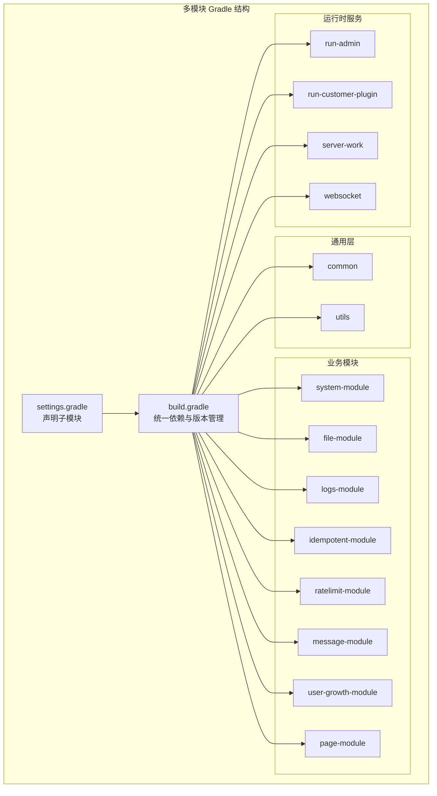
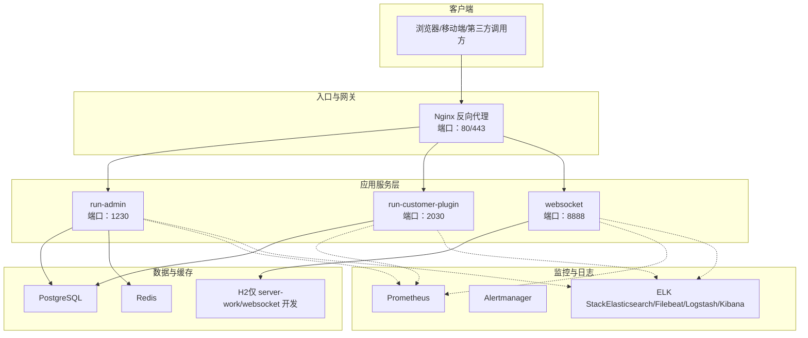
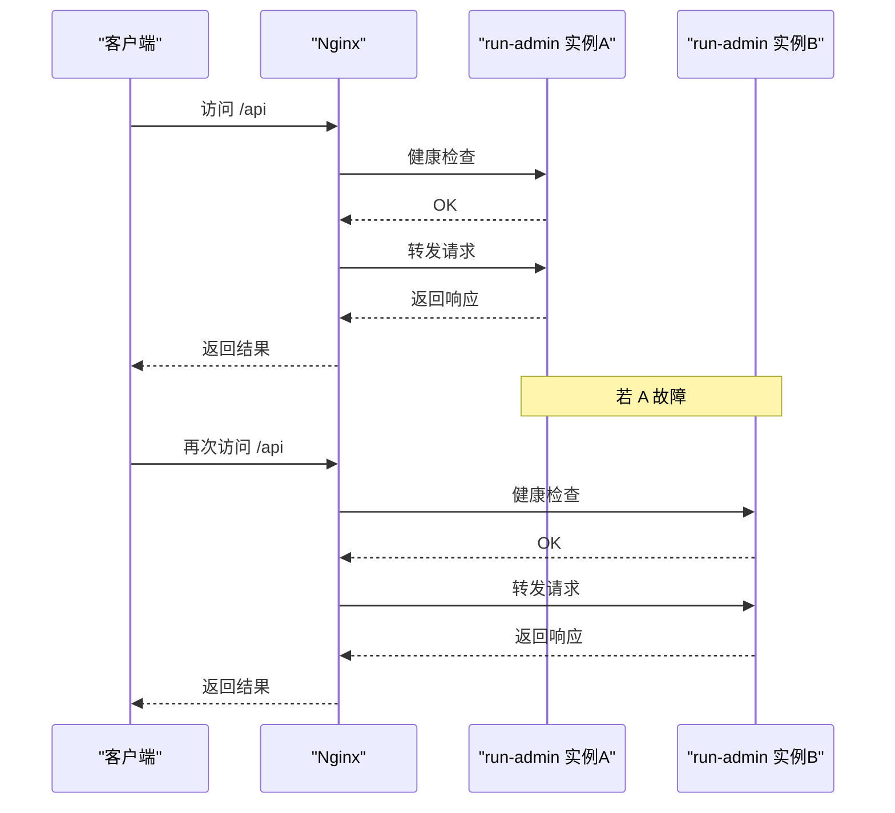
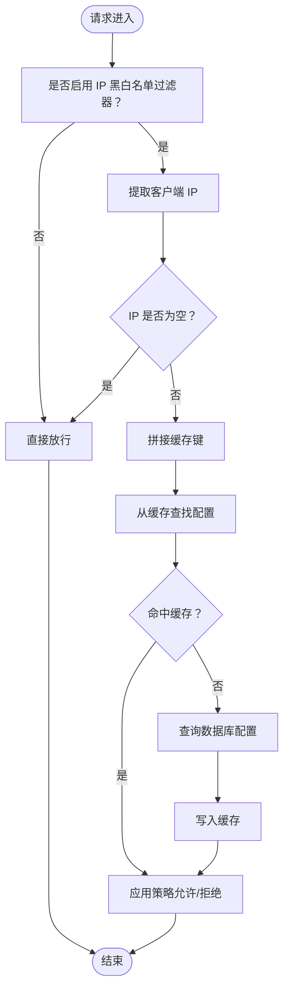
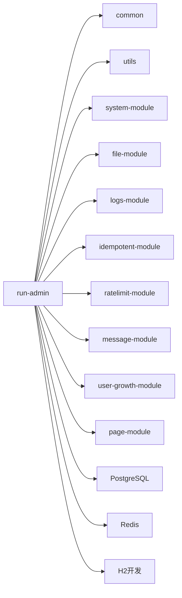

# 部署架构

<cite>
**本文引用的文件**
- [根构建脚本](file://build.gradle)
- [设置文件](file://settings.gradle)
- [后台管理服务配置（dev1）](file://run-admin/src/main/resources/application-dev1.yml)
- [后台管理服务配置（dev2）](file://run-admin/src/main/resources/application-dev2.yml)
- [后台管理服务基础配置](file://run-admin/src/main/resources/application.yml)
- [客户插件服务配置](file://run-customer-plugin/src/main/resources/application.yml)
- [工作节点服务配置](file://server-work/src/main/resources/application.yml)
- [WebSocket 服务配置](file://websocket/src/main/resources/application.yml)
- [限流模块过滤器](file://ratelimit-module/src/main/java/com/astproject/ratelimit/config/IpBlackWhiteListFilter.java)
</cite>

## 目录
1. [简介](#简介)
2. [项目结构](#项目结构)
3. [核心组件](#核心组件)
4. [架构总览](#架构总览)
5. [详细组件分析](#详细组件分析)
6. [依赖关系分析](#依赖关系分析)
7. [性能考量](#性能考量)
8. [故障排查指南](#故障排查指南)
9. [结论](#结论)
10. [附录](#附录)

## 简介
本文件面向生产环境，提供 Fast 项目的部署架构与运维指南。内容涵盖多服务部署策略（Docker 容器化与传统 JAR 包部署）、服务配置管理（环境变量、数据库与缓存）、负载均衡与高可用（Nginx 反向代理、服务注册与发现）、监控与日志（Prometheus、ELK）、部署拓扑与故障转移机制，以及生产部署步骤与最佳实践。

## 项目结构
Fast 采用多模块 Gradle 构建，包含通用模块、业务模块与运行时服务模块。核心模块包括：
- 通用与工具：common、utils
- 业务模块：system-module、file-module、logs-module、idempotent-module、ratelimit-module、message-module、user-growth-module、page-module
- 运行时服务：run-admin（后台管理）、run-customer-plugin（客户插件）、server-work（工作节点）、websocket（WebSocket）

图表来源
- [设置文件](file://settings.gradle#L1-L24)
- [根构建脚本](file://build.gradle#L1-L457)

章节来源
- [设置文件](file://settings.gradle#L1-L24)
- [根构建脚本](file://build.gradle#L1-L457)

## 核心组件
- 后台管理服务（run-admin）
  - 提供统一管理与鉴权能力，集成系统、文件、日志、幂等、限流、消息、积分权益、页面配置等模块。
  - 默认端口：1230；支持 dev1/dev2 等配置文件切换。
- 客户插件服务（run-customer-plugin）
  - 轻量级插件服务，独立数据库与端口，便于按租户或客户隔离部署。
- 工作节点服务（server-work）
  - 用于执行后台任务与采集信息，内置 H2 控制台便于调试。
- WebSocket 服务（websocket）
  - 基于 Netty 的 WebSocket 服务端，内置 H2 控制台，便于开发与测试。

章节来源
- [后台管理服务基础配置](file://run-admin/src/main/resources/application.yml#L1-L5)
- [后台管理服务配置（dev1）](file://run-admin/src/main/resources/application-dev1.yml#L1-L70)
- [后台管理服务配置（dev2）](file://run-admin/src/main/resources/application-dev2.yml#L1-L71)
- [客户插件服务配置](file://run-customer-plugin/src/main/resources/application.yml#L1-L26)
- [工作节点服务配置](file://server-work/src/main/resources/application.yml#L1-L16)
- [WebSocket 服务配置](file://websocket/src/main/resources/application.yml#L1-L28)

## 架构总览
下图展示生产环境典型拓扑：Nginx 作为入口反向代理，后端由 run-admin（主服务）与 run-customer-plugin（可选）组成；数据层使用 PostgreSQL；缓存使用 Redis；日志与指标通过 ELK/Prometheus 收集；WebSocket 服务独立部署以承载实时通信。

图表来源
- [后台管理服务基础配置](file://run-admin/src/main/resources/application.yml#L1-L5)
- [后台管理服务配置（dev1）](file://run-admin/src/main/resources/application-dev1.yml#L28-L32)
- [后台管理服务配置（dev1）](file://run-admin/src/main/resources/application-dev1.yml#L61-L70)
- [客户插件服务配置](file://run-customer-plugin/src/main/resources/application.yml#L10-L15)
- [工作节点服务配置](file://server-work/src/main/resources/application.yml#L4-L8)
- [WebSocket 服务配置](file://websocket/src/main/resources/application.yml#L14-L18)

## 详细组件分析

### Docker 容器化部署策略
- 多阶段构建
  - 使用 Gradle 构建产物，结合多阶段 Dockerfile 将运行时镜像最小化。
  - 建议为每个服务单独镜像，便于独立扩展与更新。
- 容器编排
  - 使用 Docker Compose 或 Kubernetes 部署，定义服务、网络、存储与健康检查。
  - 为 run-admin、run-customer-plugin、websocket 分别配置独立容器与端口映射。
- 环境隔离
  - 通过环境变量覆盖 application.yml 中敏感配置（如数据库密码、Redis 密码）。
  - 使用 Docker secrets 管理密钥，避免明文写入镜像。

### 传统 JAR 包部署策略
- 单机部署
  - 在目标主机上安装 JDK，拷贝对应模块的构建产物至部署目录，使用 nohup 或 systemd 启动。
  - 为每个服务准备独立启动脚本与日志目录。
- 集群部署
  - 同一服务多实例横向扩展，通过 Nginx upstream 实现负载均衡。
  - 使用 keepalived 或外部 LB 实现高可用与故障转移。

### 服务配置管理
- 环境变量优先
  - 数据库连接：spring.datasource.url、username、password
  - 缓存连接：fastproject.redis.host、port、password、database、timeout
  - 安全参数：security.cache-key、token-key、expire
- 配置文件层次
  - application.yml 定义默认端口与激活的 profile。
  - application-dev1.yml 与 application-dev2.yml 提供不同环境的数据库与缓存配置，便于切换。
- 本地开发与生产差异
  - 生产建议禁用 H2 控制台，启用 PostgreSQL，并在 CI/CD 中注入敏感配置。

章节来源
- [后台管理服务基础配置](file://run-admin/src/main/resources/application.yml#L1-L5)
- [后台管理服务配置（dev1）](file://run-admin/src/main/resources/application-dev1.yml#L20-L32)
- [后台管理服务配置（dev1）](file://run-admin/src/main/resources/application-dev1.yml#L61-L70)
- [后台管理服务配置（dev2）](file://run-admin/src/main/resources/application-dev2.yml#L21-L32)
- [后台管理服务配置（dev2）](file://run-admin/src/main/resources/application-dev2.yml#L61-L70)
- [客户插件服务配置](file://run-customer-plugin/src/main/resources/application.yml#L10-L15)
- [工作节点服务配置](file://server-work/src/main/resources/application.yml#L4-L8)
- [WebSocket 服务配置](file://websocket/src/main/resources/application.yml#L14-L18)

### 负载均衡与高可用部署策略
- Nginx 反向代理
  - 将 HTTP/HTTPS 流量分发到 run-admin 与 run-customer-plugin 的多个实例。
  - 配置健康检查与超时重试，确保单点故障时自动切换。
- 服务注册与发现
  - 推荐引入服务注册中心（如 Consul/Eureka/Nacos），服务启动时注册，客户端通过注册中心发现实例。
  - 无注册中心时，可在 Nginx 中维护静态上游列表，并通过外部脚本动态更新。
- 故障转移机制
  - 当某实例不可用时，Nginx 将流量转发至其他健康实例。
  - 建立告警通道，结合 Prometheus+Alertmanager 实现自动扩缩容或重启。

### 监控与日志收集架构
- 指标监控（Prometheus）
  - Spring Boot Actuator 暴露 JVM、业务指标，默认端口 8080（需在各服务中启用）。
  - Prometheus 抓取各服务指标，结合 Grafana 可视化。
- 日志收集（ELK）
  - 使用 Filebeat 收集各服务日志，Logstash 进行解析，Elasticsearch 存储，Kibana 展示。
  - 建议按服务与实例划分索引，设置日志轮转与保留策略。

### 部署拓扑与故障转移机制

图表来源
- [后台管理服务基础配置](file://run-admin/src/main/resources/application.yml#L1-L5)

### 限流与 IP 黑白名单
- IP 黑白名单过滤器
  - 通过 Caffeine 缓存配置，定期刷新，降低数据库压力。
  - 支持按应用编码（appCode）区分不同服务的限流策略。
- 前端配置界面
  - 提供 IP 黑白名单的分页查询、新增、编辑与开关控制，便于运维快速调整。

图表来源
- [限流模块过滤器](file://ratelimit-module/src/main/java/com/astproject/ratelimit/config/IpBlackWhiteListFilter.java#L42-L67)

章节来源
- [限流模块过滤器](file://ratelimit-module/src/main/java/com/astproject/ratelimit/config/IpBlackWhiteListFilter.java#L42-L67)

## 依赖关系分析
- 模块间依赖
  - run-admin 依赖 common、utils、system-module、file-module、logs-module、idempotent-module、ratelimit-module、message-module、user-growth-module、page-module。
  - 各模块内部通过 API/Module 解耦，便于独立演进。
- 运行时依赖
  - PostgreSQL 作为主数据库，Redis 作为缓存与会话存储，H2 仅用于开发与调试场景。

图表来源
- [根构建脚本](file://build.gradle#L92-L134)
- [根构建脚本](file://build.gradle#L329-L345)
- [根构建脚本](file://build.gradle#L383-L402)
- [根构建脚本](file://build.gradle#L348-L365)
- [根构建脚本](file://build.gradle#L165-L188)
- [根构建脚本](file://build.gradle#L203-L229)
- [根构建脚本](file://build.gradle#L245-L273)
- [根构建脚本](file://build.gradle#L283-L303)
- [根构建脚本](file://build.gradle#L316-L326)
- [根构建脚本](file://build.gradle#L414-L431)

章节来源
- [根构建脚本](file://build.gradle#L92-L134)
- [根构建脚本](file://build.gradle#L316-L326)
- [根构建脚本](file://build.gradle#L414-L431)

## 性能考量
- 数据库连接池与 SQL 优化
  - 使用 HikariCP（由 Spring Boot 默认）提升连接效率；开启 SQL 调优日志定位慢查询。
- 缓存策略
  - Redis 作为热点数据缓存，合理设置过期时间与淘汰策略；对频繁读取的配置使用本地 Caffeine 缓存。
- 线程模型
  - 启用虚拟线程（若运行时支持）以提升并发处理能力。
- 文件上传
  - 合理设置 multipart 最大大小，避免内存溢出；对大文件采用分片上传与断点续传。

## 故障排查指南
- 数据库连接失败
  - 检查 spring.datasource.url、username、password 是否正确；确认网络连通性与防火墙策略。
- 缓存不可用
  - 检查 fastproject.redis.host、port、password、database；验证 Redis 服务状态与认证。
- 服务无法启动
  - 查看 Nginx 错误日志与各服务启动日志；确认端口占用与 JVM 参数。
- 限流策略异常
  - 检查 IP 黑白名单缓存是否命中；核对 appCode 与 IP 规则是否匹配。

章节来源
- [后台管理服务配置（dev1）](file://run-admin/src/main/resources/application-dev1.yml#L28-L32)
- [后台管理服务配置（dev1）](file://run-admin/src/main/resources/application-dev1.yml#L61-L70)
- [后台管理服务配置（dev2）](file://run-admin/src/main/resources/application-dev2.yml#L29-L32)
- [后台管理服务配置（dev2）](file://run-admin/src/main/resources/application-dev2.yml#L61-L70)
- [客户插件服务配置](file://run-customer-plugin/src/main/resources/application.yml#L10-L15)
- [工作节点服务配置](file://server-work/src/main/resources/application.yml#L4-L8)
- [WebSocket 服务配置](file://websocket/src/main/resources/application.yml#L14-L18)

## 结论
通过模块化设计与清晰的配置分离，Fast 项目具备良好的可部署性与可运维性。结合 Nginx 负载均衡、服务注册与发现、Prometheus+ELK 监控体系，可实现高可用、可观测的生产部署。建议在 CI/CD 中自动化构建与发布，配合蓝绿/金丝雀发布策略，进一步提升交付质量与风险控制。

## 附录
- 生产部署清单
  - 准备 PostgreSQL 与 Redis 服务，配置 SSL/TLS 与访问控制。
  - 在 Nginx 中配置 HTTPS、证书与上游服务。
  - 为各服务准备 systemd 或 Docker Compose 配置，设置健康检查。
  - 部署 Prometheus 与 Alertmanager，配置告警规则。
  - 部署 ELK，配置 Filebeat 采集与索引策略。
  - 对 run-admin 与 run-customer-plugin 进行压测与容量规划，确定副本数与资源配额。