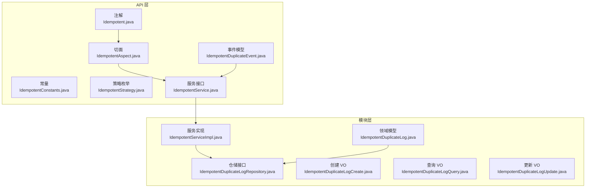
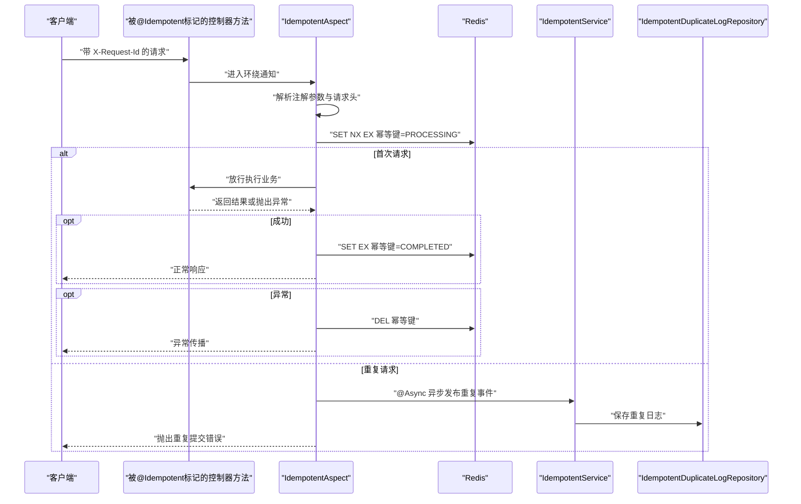
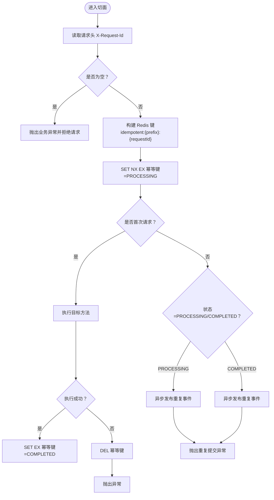
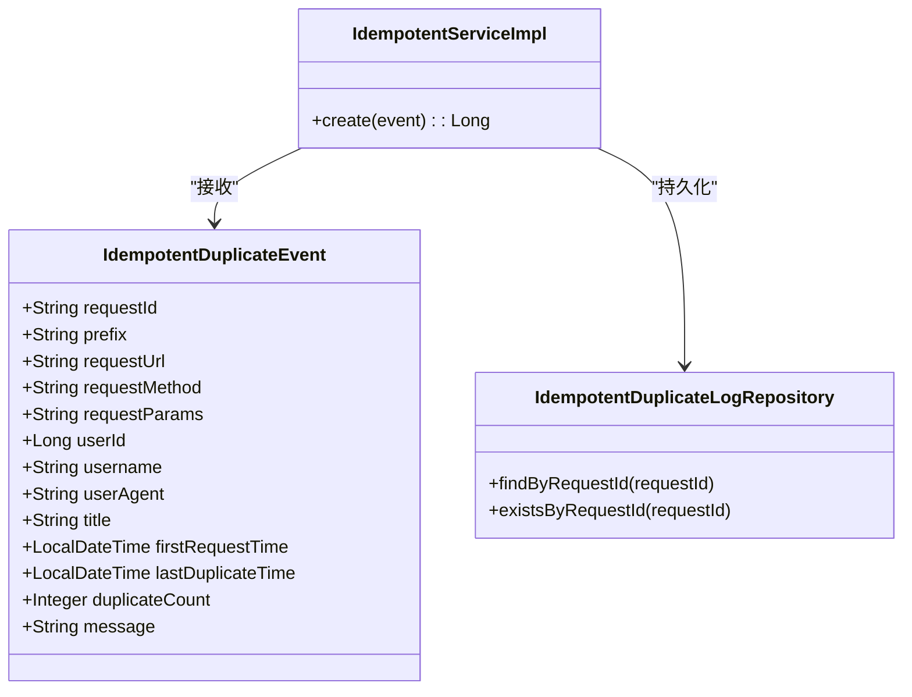
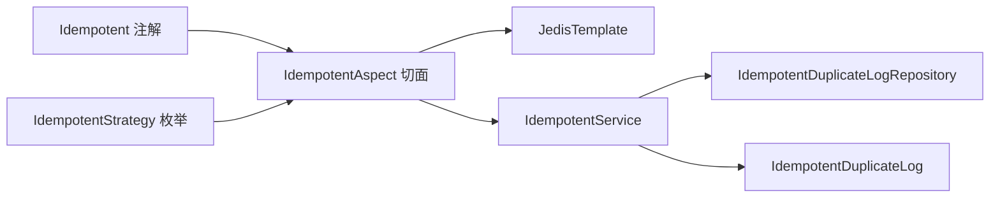

# 幂等性控制模块

<cite>
**本文引用的文件**
- [Idempotent.java](file://idempotent-api/src/main/java/com/fastproject/idempotent/annotation/Idempotent.java)
- [IdempotentAspect.java](file://idempotent-api/src/main/java/com/fastproject/idempotent/aspect/IdempotentAspect.java)
- [IdempotentStrategy.java](file://idempotent-api/src/main/java/com/fastproject/idempotent/enums/IdempotentStrategy.java)
- [IdempotentConstants.java](file://idempotent-api/src/main/java/com/fastproject/idempotent/constants/IdempotentConstants.java)
- [IdempotentService.java](file://idempotent-api/src/main/java/com/fastproject/idempotent/api/IdempotentService.java)
- [IdempotentDuplicateEvent.java](file://idempotent-api/src/main/java/com/fastproject/idempotent/api\IdempotentDuplicateEvent.java)
- [IdempotentDuplicateLog.java](file://idempotent-module/src/main/java/com/fastproject/idempotent/domain/IdempotentDuplicateLog.java)
- [IdempotentServiceImpl.java](file://idempotent-module/src/main/java/com/fastproject/idempotent/service/impl/IdempotentServiceImpl.java)
- [IdempotentDuplicateLogRepository.java](file://idempotent-module/src/main/java/com/fastproject/idempotent/repository/db/IdempotentDuplicateLogRepository.java)
- [IdempotentDuplicateLogCreate.java](file://idempotent-module/src/main/java/com/fastproject/idempotent/vo/IdempotentDuplicateLogCreate.java)
- [IdempotentDuplicateLogQuery.java](file://idempotent-module/src/main/java/com/fastproject/idempotent/vo/IdempotentDuplicateLogQuery.java)
- [IdempotentDuplicateLogUpdate.java](file://idempotent-module/src/main/java/com/fastproject/idempotent/vo/IdempotentDuplicateLogUpdate.java)
</cite>

## 目录
1. [简介](#简介)
2. [项目结构](#项目结构)
3. [核心组件](#核心组件)
4. [架构总览](#架构总览)
5. [组件详解](#组件详解)
6. [依赖关系分析](#依赖关系分析)
7. [性能与可靠性](#性能与可靠性)
8. [故障排查指南](#故障排查指南)
9. [结论](#结论)
10. [附录](#附录)

## 简介
本模块提供基于注解的分布式幂等性控制能力，通过请求头携带的唯一请求 ID，在 Redis 中以原子方式建立幂等键，避免重复提交导致的数据不一致问题。模块支持：
- 注解式幂等控制与切面拦截
- Redis 分布式锁与状态标记
- 重复请求检测与事件上报
- 幂等事件持久化与查询
- 可配置的过期时间与提示消息
- 高并发下的可靠性保障与故障恢复

## 项目结构
幂等性模块由“API 层”和“模块层”组成：
- API 层：定义注解、切面、常量、事件模型与服务接口
- 模块层：实现幂等事件落库、仓储接口、VO 对象与服务实现

图表来源
- [Idempotent.java](file://idempotent-api/src/main/java/com/fastproject/idempotent/annotation/Idempotent.java#L1-L57)
- [IdempotentAspect.java](file://idempotent-api/src/main/java/com/fastproject/idempotent/aspect/IdempotentAspect.java#L1-L211)
- [IdempotentConstants.java](file://idempotent-api/src/main/java/com/fastproject/idempotent/constants/IdempotentConstants.java#L1-L42)
- [IdempotentStrategy.java](file://idempotent-api/src/main/java/com/fastproject/idempotent/enums/IdempotentStrategy.java#L1-L33)
- [IdempotentService.java](file://idempotent-api/src/main/java/com/fastproject/idempotent/api/IdempotentService.java#L1-L19)
- [IdempotentDuplicateEvent.java](file://idempotent-api/src/main/java/com/fastproject/idempotent/api/IdempotentDuplicateEvent.java#L1-L85)
- [IdempotentDuplicateLog.java](file://idempotent-module/src/main/java/com/fastproject/idempotent/domain/IdempotentDuplicateLog.java#L1-L97)
- [IdempotentServiceImpl.java](file://idempotent-module/src/main/java/com/fastproject/idempotent/service/impl/IdempotentServiceImpl.java#L1-L65)
- [IdempotentDuplicateLogRepository.java](file://idempotent-module/src/main/java/com/fastproject/idempotent/repository/db/IdempotentDuplicateLogRepository.java#L1-L26)
- [IdempotentDuplicateLogCreate.java](file://idempotent-module/src/main/java/com/fastproject/idempotent/vo/IdempotentDuplicateLogCreate.java#L1-L83)
- [IdempotentDuplicateLogQuery.java](file://idempotent-module/src/main/java/com/fastproject/idempotent/vo/IdempotentDuplicateLogQuery.java#L1-L66)
- [IdempotentDuplicateLogUpdate.java](file://idempotent-module/src/main/java/com/fastproject/idempotent/vo/IdempotentDuplicateLogUpdate.java#L1-L88)

章节来源
- [Idempotent.java](file://idempotent-api/src/main/java/com/fastproject/idempotent/annotation/Idempotent.java#L1-L57)
- [IdempotentAspect.java](file://idempotent-api/src/main/java/com/fastproject/idempotent/aspect/IdempotentAspect.java#L1-L211)
- [IdempotentConstants.java](file://idempotent-api/src/main/java/com/fastproject/idempotent/constants/IdempotentConstants.java#L1-L42)
- [IdempotentStrategy.java](file://idempotent-api/src/main/java/com/fastproject/idempotent/enums/IdempotentStrategy.java#L1-L33)
- [IdempotentService.java](file://idempotent-api/src/main/java/com/fastproject/idempotent/api/IdempotentService.java#L1-L19)
- [IdempotentDuplicateEvent.java](file://idempotent-api/src/main/java/com/fastproject/idempotent/api/IdempotentDuplicateEvent.java#L1-L85)
- [IdempotentDuplicateLog.java](file://idempotent-module/src/main/java/com/fastproject/idempotent/domain/IdempotentDuplicateLog.java#L1-L97)
- [IdempotentServiceImpl.java](file://idempotent-module/src/main/java/com/fastproject/idempotent/service/impl/IdempotentServiceImpl.java#L1-L65)
- [IdempotentDuplicateLogRepository.java](file://idempotent-module/src/main/java/com/fastproject/idempotent/repository/db/IdempotentDuplicateLogRepository.java#L1-L26)
- [IdempotentDuplicateLogCreate.java](file://idempotent-module/src/main/java/com/fastproject/idempotent/vo/IdempotentDuplicateLogCreate.java#L1-L83)
- [IdempotentDuplicateLogQuery.java](file://idempotent-module/src/main/java/com/fastproject/idempotent/vo/IdempotentDuplicateLogQuery.java#L1-L66)
- [IdempotentDuplicateLogUpdate.java](file://idempotent-module/src/main/java/com/fastproject/idempotent/vo/IdempotentDuplicateLogUpdate.java#L1-L88)

## 核心组件
- 注解与切面：通过注解标记方法，切面在方法执行前后进行幂等检查与状态标记
- 事件与服务：检测到重复请求时异步上报事件，服务负责持久化记录
- 常量与策略：统一请求头键名、Redis 键前缀、默认过期时间与状态值；策略枚举预留扩展
- 领域模型与仓储：持久化重复请求日志，提供按请求 ID 查询与分页查询能力

章节来源
- [Idempotent.java](file://idempotent-api/src/main/java/com/fastproject/idempotent/annotation/Idempotent.java#L1-L57)
- [IdempotentAspect.java](file://idempotent-api/src/main/java/com/fastproject/idempotent/aspect/IdempotentAspect.java#L1-L211)
- [IdempotentService.java](file://idempotent-api/src/main/java/com/fastproject/idempotent/api/IdempotentService.java#L1-L19)
- [IdempotentDuplicateEvent.java](file://idempotent-api/src/main/java/com/fastproject/idempotent/api/IdempotentDuplicateEvent.java#L1-L85)
- [IdempotentConstants.java](file://idempotent-api/src/main/java/com/fastproject/idempotent/constants/IdempotentConstants.java#L1-L42)
- [IdempotentStrategy.java](file://idempotent-api/src/main/java/com/fastproject/idempotent/enums/IdempotentStrategy.java#L1-L33)
- [IdempotentDuplicateLog.java](file://idempotent-module/src/main/java/com/fastproject/idempotent/domain/IdempotentDuplicateLog.java#L1-L97)
- [IdempotentDuplicateLogRepository.java](file://idempotent-module/src/main/java/com/fastproject/idempotent/repository/db/IdempotentDuplicateLogRepository.java#L1-L26)

## 架构总览
幂等性控制采用“注解 + 切面 + Redis + 异步事件 + 数据库”的组合方案：
- 注解标记目标方法
- 切面拦截请求，读取请求头中的请求 ID，基于 Redis 原子操作设置“处理中/已完成”状态
- 若检测到重复请求，则异步发布重复事件并持久化记录
- 正常完成后标记“已完成”，异常时清理幂等键，允许重试

图表来源
- [IdempotentAspect.java](file://idempotent-api/src/main/java/com/fastproject/idempotent/aspect/IdempotentAspect.java#L52-L117)
- [IdempotentService.java](file://idempotent-api/src/main/java/com/fastproject/idempotent/api/IdempotentService.java#L11-L17)
- [IdempotentServiceImpl.java](file://idempotent-module/src/main/java/com/fastproject/idempotent/service/impl/IdempotentServiceImpl.java#L32-L63)
- [IdempotentDuplicateLogRepository.java](file://idempotent-module/src/main/java/com/fastproject/idempotent/repository/db/IdempotentDuplicateLogRepository.java#L14-L25)

## 组件详解

### 注解与切面
- 注解属性
  - 前缀：用于区分不同业务场景的幂等键命名空间
  - 过期时间：幂等键有效期，默认 60 秒
  - 提示消息：重复请求时的友好提示
  - 标题：操作描述，便于审计与定位
- 切面逻辑
  - 解析请求头 X-Request-Id，缺失则直接拒绝
  - 原子设置幂等键为“处理中”，若已存在则判断状态并抛出重复请求异常
  - 业务执行成功后标记“已完成”，异常时删除幂等键，允许重试
  - 异步发布重复事件，包含请求 URL、方法、参数、UA、用户信息、标题、消息与计数等

图表来源
- [IdempotentAspect.java](file://idempotent-api/src/main/java/com/fastproject/idempotent/aspect/IdempotentAspect.java#L52-L117)
- [IdempotentConstants.java](file://idempotent-api/src/main/java/com/fastproject/idempotent/constants/IdempotentConstants.java#L8-L42)

章节来源
- [Idempotent.java](file://idempotent-api/src/main/java/com/fastproject/idempotent/annotation/Idempotent.java#L24-L57)
- [IdempotentAspect.java](file://idempotent-api/src/main/java/com/fastproject/idempotent/aspect/IdempotentAspect.java#L52-L117)
- [IdempotentConstants.java](file://idempotent-api/src/main/java/com/fastproject/idempotent/constants/IdempotentConstants.java#L8-L42)

### 事件模型与服务
- 事件模型包含请求 ID、前缀、URL、方法、参数、用户信息、UA、标题、首次与最后重复时间、重复次数、提示消息等字段
- 服务实现负责将事件转换为数据库记录，补充 IP 地址，保存至数据库

图表来源
- [IdempotentDuplicateEvent.java](file://idempotent-api/src/main/java/com/fastproject/idempotent/api/IdempotentDuplicateEvent.java#L18-L84)
- [IdempotentServiceImpl.java](file://idempotent-module/src/main/java/com/fastproject/idempotent/service/impl/IdempotentServiceImpl.java#L32-L63)
- [IdempotentDuplicateLogRepository.java](file://idempotent-module/src/main/java/com/fastproject/idempotent/repository/db/IdempotentDuplicateLogRepository.java#L14-L25)

章节来源
- [IdempotentDuplicateEvent.java](file://idempotent-api/src/main/java/com/fastproject/idempotent/api/IdempotentDuplicateEvent.java#L18-L84)
- [IdempotentServiceImpl.java](file://idempotent-module/src/main/java/com/fastproject/idempotent/service/impl/IdempotentServiceImpl.java#L32-L63)
- [IdempotentDuplicateLogRepository.java](file://idempotent-module/src/main/java/com/fastproject/idempotent/repository/db/IdempotentDuplicateLogRepository.java#L14-L25)

### 领域模型与仓储
- 领域模型映射数据库表 sys_idempotent_duplicate_log，包含请求 ID、前缀、URL、方法、参数、用户信息、IP、UA、标题、时间戳与重复次数等
- 仓储提供按请求 ID 查询与存在性判断，支持分页查询

章节来源
- [IdempotentDuplicateLog.java](file://idempotent-module/src/main/java/com/fastproject/idempotent/domain/IdempotentDuplicateLog.java#L18-L97)
- [IdempotentDuplicateLogRepository.java](file://idempotent-module/src/main/java/com/fastproject/idempotent/repository/db/IdempotentDuplicateLogRepository.java#L14-L25)

### VO 与查询
- 创建 VO：封装新增重复日志所需的字段
- 查询 VO：继承分页查询基类，支持多维过滤
- 更新 VO：封装更新字段，便于增量修改

章节来源
- [IdempotentDuplicateLogCreate.java](file://idempotent-module/src/main/java/com/fastproject/idempotent/vo/IdempotentDuplicateLogCreate.java#L10-L83)
- [IdempotentDuplicateLogQuery.java](file://idempotent-module/src/main/java/com/fastproject/idempotent/vo/IdempotentDuplicateLogQuery.java#L14-L66)
- [IdempotentDuplicateLogUpdate.java](file://idempotent-module/src/main/java/com/fastproject/idempotent/vo/IdempotentDuplicateLogUpdate.java#L11-L88)

## 依赖关系分析
- 注解与切面：注解驱动切面，切面依赖 Redis 模板与令牌工具
- 切面与服务：切面在重复检测时异步调用服务创建事件
- 服务与仓储：服务将事件持久化到数据库，仓储提供查询能力
- 策略枚举：为后续扩展幂等键生成策略预留入口

图表来源
- [Idempotent.java](file://idempotent-api/src/main/java/com/fastproject/idempotent/annotation/Idempotent.java#L24-L57)
- [IdempotentAspect.java](file://idempotent-api/src/main/java/com/fastproject/idempotent/aspect/IdempotentAspect.java#L38-L40)
- [IdempotentService.java](file://idempotent-api/src/main/java/com/fastproject/idempotent/api/IdempotentService.java#L9-L18)
- [IdempotentDuplicateLogRepository.java](file://idempotent-module/src/main/java/com/fastproject/idempotent/repository/db/IdempotentDuplicateLogRepository.java#L14-L25)
- [IdempotentDuplicateLog.java](file://idempotent-module/src/main/java/com/fastproject/idempotent/domain/IdempotentDuplicateLog.java#L24-L97)
- [IdempotentStrategy.java](file://idempotent-api/src/main/java/com/fastproject/idempotent/enums/IdempotentStrategy.java#L7-L32)

章节来源
- [Idempotent.java](file://idempotent-api/src/main/java/com/fastproject/idempotent/annotation/Idempotent.java#L24-L57)
- [IdempotentAspect.java](file://idempotent-api/src/main/java/com/fastproject/idempotent/aspect/IdempotentAspect.java#L38-L40)
- [IdempotentService.java](file://idempotent-api/src/main/java/com/fastproject/idempotent/api/IdempotentService.java#L9-L18)
- [IdempotentDuplicateLogRepository.java](file://idempotent-module/src/main/java/com/fastproject/idempotent/repository/db/IdempotentDuplicateLogRepository.java#L14-L25)
- [IdempotentDuplicateLog.java](file://idempotent-module/src/main/java/com/fastproject/idempotent/domain/IdempotentDuplicateLog.java#L24-L97)
- [IdempotentStrategy.java](file://idempotent-api/src/main/java/com/fastproject/idempotent/enums/IdempotentStrategy.java#L7-L32)

## 性能与可靠性
- Redis 原子操作
  - 使用 SET NX EX 在单命令内完成幂等键的首次设置与过期时间设定，避免竞态条件
  - 成功设置则首次请求，否则根据已有状态快速分流
- 异步事件
  - 重复事件通过异步线程池发布，降低对主流程的影响
- 异常处理
  - 业务异常时删除幂等键，允许客户端重试；避免脏标记导致误判
- 过期时间
  - 默认 60 秒，既可覆盖大多数重复请求场景，又不会长期占用键空间
- 可靠性保障
  - 非 Web 环境自动跳过校验，避免误伤
  - 缺失请求头直接拒绝，确保幂等键来源可信
  - 数据库落盘保留重复请求证据，便于审计与复盘

[本节为通用性能讨论，无需列出具体文件来源]

## 故障排查指南
- 症状：请求被拒绝，提示系统繁忙
  - 排查：确认请求头是否包含 X-Request-Id；确认切面是否正确解析注解
  - 参考：切面对空请求 ID 的处理逻辑
- 症状：重复请求被拦截但未记录日志
  - 排查：检查异步线程池配置；确认服务实现是否抛出异常被吞掉
  - 参考：异步发布重复事件与服务实现
- 症状：幂等键长时间不释放
  - 排查：确认异常分支是否执行删除键；检查过期时间是否过短
  - 参考：异常分支删除幂等键逻辑
- 症状：重复请求日志无法查询
  - 排查：确认请求 ID 是否正确传递；检查数据库连接与表结构
  - 参考：仓储接口按请求 ID 查询与存在性判断

章节来源
- [IdempotentAspect.java](file://idempotent-api/src/main/java/com/fastproject/idempotent/aspect/IdempotentAspect.java#L59-L72)
- [IdempotentAspect.java](file://idempotent-api/src/main/java/com/fastproject/idempotent/aspect/IdempotentAspect.java#L111-L116)
- [IdempotentServiceImpl.java](file://idempotent-module/src/main/java/com/fastproject/idempotent/service/impl/IdempotentServiceImpl.java#L59-L63)
- [IdempotentDuplicateLogRepository.java](file://idempotent-module/src/main/java/com/fastproject/idempotent/repository/db/IdempotentDuplicateLogRepository.java#L19-L24)

## 结论
本模块通过注解 + 切面 + Redis 原子操作实现了可靠的分布式幂等控制，结合异步事件与数据库落盘，既能满足高并发场景下的性能要求，又能提供完整的审计与复盘能力。建议在生产环境中合理设置过期时间与日志保留策略，并完善监控告警以及时发现异常。

[本节为总结性内容，无需列出具体文件来源]

## 附录

### API 接口定义
- 创建幂等重复事件
  - 方法：POST
  - 路径：/idempotent/duplicate-log
  - 请求体：IdempotentDuplicateLogCreate
  - 响应：创建后的记录 ID
- 查询重复日志
  - 方法：GET
  - 路径：/idempotent/duplicate-log/page
  - 查询参数：IdempotentDuplicateLogQuery
  - 响应：分页结果
- 更新重复日志
  - 方法：PUT
  - 路径：/idempotent/duplicate-log
  - 请求体：IdempotentDuplicateLogUpdate
  - 响应：更新后的记录

章节来源
- [IdempotentDuplicateLogCreate.java](file://idempotent-module/src/main/java/com/fastproject/idempotent/vo/IdempotentDuplicateLogCreate.java#L10-L83)
- [IdempotentDuplicateLogQuery.java](file://idempotent-module/src/main/java/com/fastproject/idempotent/vo/IdempotentDuplicateLogQuery.java#L14-L66)
- [IdempotentDuplicateLogUpdate.java](file://idempotent-module/src/main/java/com/fastproject/idempotent/vo/IdempotentDuplicateLogUpdate.java#L11-L88)

### 使用示例
- 在控制器方法上添加注解，声明幂等键前缀、过期时间与提示消息
- 前端在请求头中携带 X-Request-Id
- 服务端切面自动拦截并执行幂等校验
- 重复请求将触发异步事件并持久化记录

章节来源
- [Idempotent.java](file://idempotent-api/src/main/java/com/fastproject/idempotent/annotation/Idempotent.java#L10-L20)
- [IdempotentAspect.java](file://idempotent-api/src/main/java/com/fastproject/idempotent/aspect/IdempotentAspect.java#L58-L72)

### 配置管理
- 请求头键名：X-Request-Id
- Redis 键前缀：idempotent:
- 默认过期时间：60 秒
- 状态值：PROCESSING、COMPLETED
- 策略枚举：DEFAULT、PARAMS_MD5、TOKEN、CUSTOM（预留）

章节来源
- [IdempotentConstants.java](file://idempotent-api/src/main/java/com/fastproject/idempotent/constants/IdempotentConstants.java#L11-L42)
- [IdempotentStrategy.java](file://idempotent-api/src/main/java/com/fastproject/idempotent/enums/IdempotentStrategy.java#L7-L32)