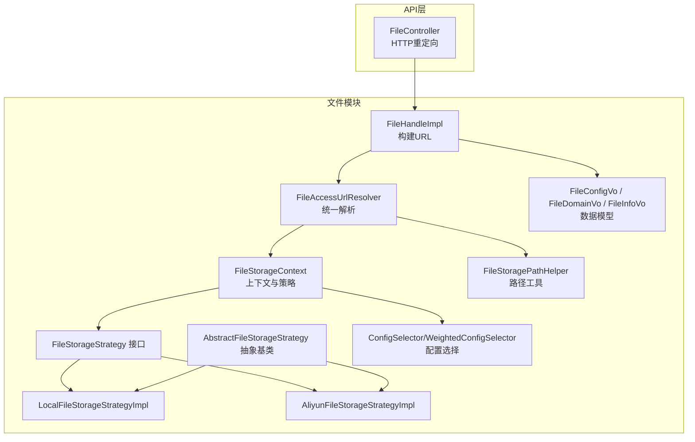
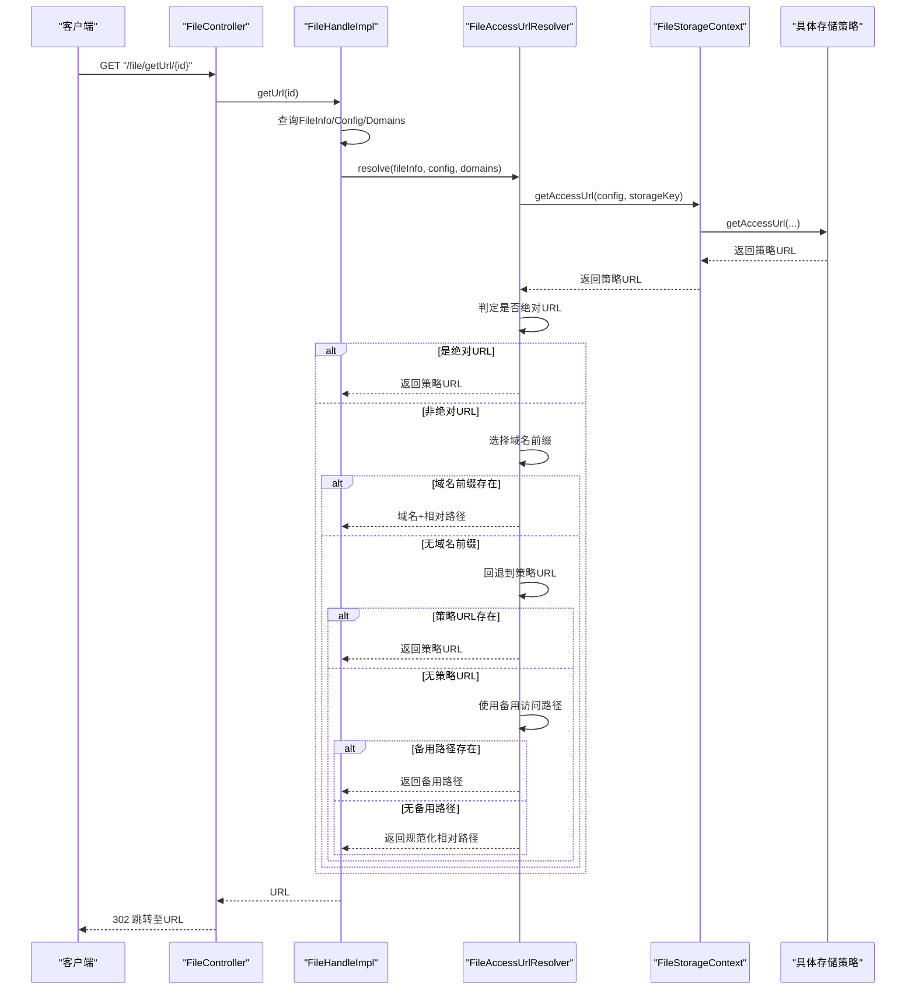
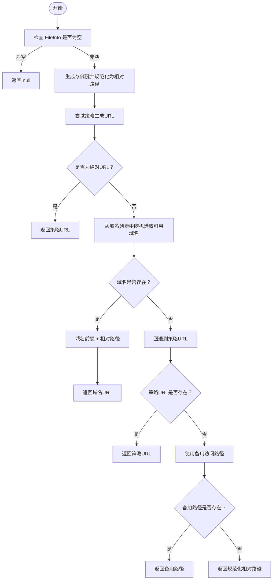
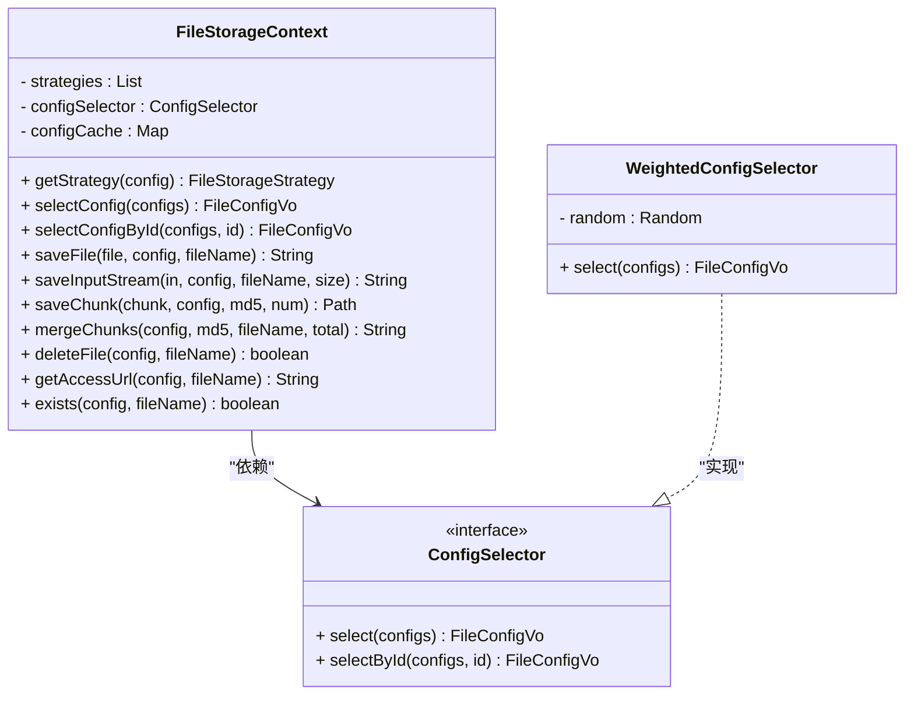
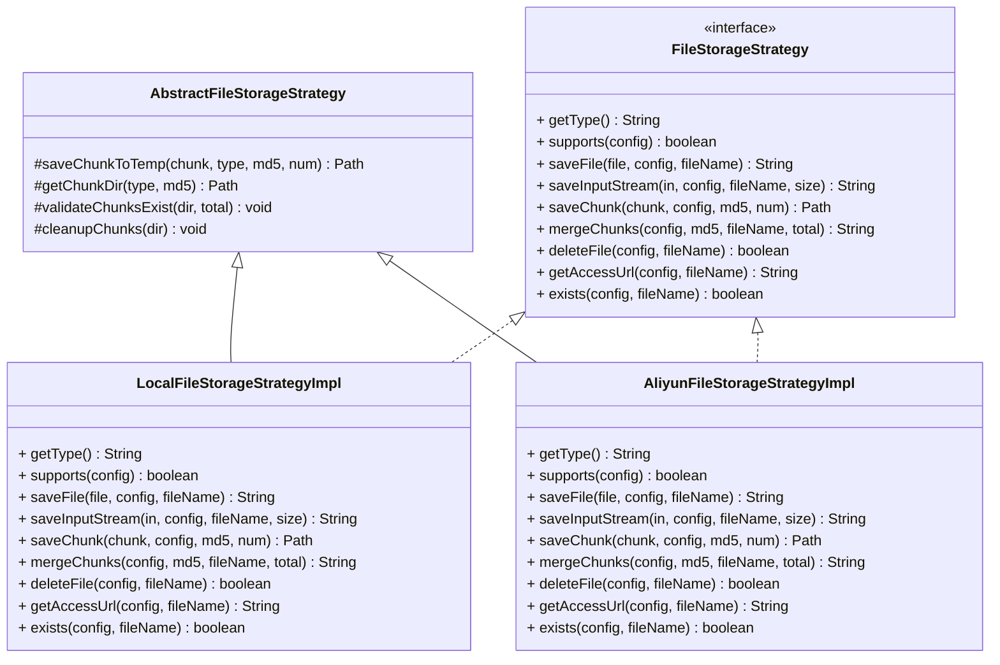
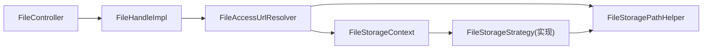

# 文件URL解析器

<cite>
**本文引用的文件**
- [FileAccessUrlResolver.java](file://file-module/src/main/java/com/fastproject/file/storage/FileAccessUrlResolver.java)
- [FileStoragePathHelper.java](file://file-module/src/main/java/com/fastproject/file/storage/FileStoragePathHelper.java)
- [FileStorageContext.java](file://file-module/src/main/java/com/fastproject/file/storage/FileStorageContext.java)
- [FileStorageStrategy.java](file://file-module/src/main/java/com/fastproject/file/storage/FileStorageStrategy.java)
- [AbstractFileStorageStrategy.java](file://file-module/src/main/java/com/fastproject/file/storage/AbstractFileStorageStrategy.java)
- [AliyunFileStorageStrategyImpl.java](file://file-module/src/main/java/com/fastproject/file/storage/impl/AliyunFileStorageStrategyImpl.java)
- [LocalFileStorageStrategyImpl.java](file://file-module/src/main/java/com/fastproject/file/storage/impl/LocalFileStorageStrategyImpl.java)
- [ConfigSelector.java](file://file-module/src/main/java/com/fastproject/file/storage/ConfigSelector.java)
- [WeightedConfigSelector.java](file://file-module/src/main/java/com/fastproject/file/storage/WeightedConfigSelector.java)
- [FileConfigVo.java](file://file-module/src/main/java/com/fastproject/file/vo/config/FileConfigVo.java)
- [FileDomainVo.java](file://file-module/src/main/java/com/fastproject/file/vo/domain/FileDomainVo.java)
- [FileInfoVo.java](file://file-module/src/main/java/com/fastproject/file/vo/info/FileInfoVo.java)
- [FileHandleImpl.java](file://file-module/src/main/java/com/fastproject/file/api/FileHandleImpl.java)
- [FileController.java](file://run-admin/src/main/java/com/fastproject/module/file/controller/FileController.java)
</cite>

## 目录
1. [引言](#引言)
2. [项目结构](#项目结构)
3. [核心组件](#核心组件)
4. [架构总览](#架构总览)
5. [详细组件分析](#详细组件分析)
6. [依赖关系分析](#依赖关系分析)
7. [性能考量](#性能考量)
8. [故障排除指南](#故障排除指南)
9. [结论](#结论)
10. [附录](#附录)

## 引言
本文件面向“文件URL解析器”的技术文档，系统阐述文件访问URL生成与解析的完整机制，重点覆盖以下方面：
- FileAccessUrlResolver 的解析流程与优先级决策
- FileStoragePathHelper 的路径规范化与连接算法
- FileStorageContext 上下文的生命周期与配置缓存策略
- 文件存储路径生成规则（相对路径、绝对路径、域名映射）
- URL安全性与有效性校验机制
- 配置参数说明、使用示例与扩展指南（新增URL生成策略与域名解析规则）

## 项目结构
围绕文件存储与URL解析的关键模块位于 file-module，并通过API层对外提供服务；运行时入口位于 run-admin。

图表来源
- [FileHandleImpl.java](file://file-module/src/main/java/com/fastproject/file/api/FileHandleImpl.java#L1-L104)
- [FileAccessUrlResolver.java](file://file-module/src/main/java/com/fastproject/file/storage/FileAccessUrlResolver.java#L1-L97)
- [FileStorageContext.java](file://file-module/src/main/java/com/fastproject/file/storage/FileStorageContext.java#L1-L128)
- [FileStorageStrategy.java](file://file-module/src/main/java/com/fastproject/file/storage/FileStorageStrategy.java#L1-L105)
- [AbstractFileStorageStrategy.java](file://file-module/src/main/java/com/fastproject/file/storage/AbstractFileStorageStrategy.java#L1-L59)
- [LocalFileStorageStrategyImpl.java](file://file-module/src/main/java/com/fastproject/file/storage/impl/LocalFileStorageStrategyImpl.java#L1-L170)
- [AliyunFileStorageStrategyImpl.java](file://file-module/src/main/java/com/fastproject/file/storage/impl/AliyunFileStorageStrategyImpl.java#L1-L284)
- [FileStoragePathHelper.java](file://file-module/src/main/java/com/fastproject/file/storage/FileStoragePathHelper.java#L1-L50)
- [ConfigSelector.java](file://file-module/src/main/java/com/fastproject/file/storage/ConfigSelector.java#L1-L38)
- [WeightedConfigSelector.java](file://file-module/src/main/java/com/fastproject/file/storage/WeightedConfigSelector.java#L1-L66)
- [FileConfigVo.java](file://file-module/src/main/java/com/fastproject/file/vo/config/FileConfigVo.java#L1-L61)
- [FileDomainVo.java](file://file-module/src/main/java/com/fastproject/file/vo/domain/FileDomainVo.java#L1-L31)
- [FileInfoVo.java](file://file-module/src/main/java/com/fastproject/file/vo/info/FileInfoVo.java#L1-L66)
- [FileController.java](file://run-admin/src/main/java/com/fastproject/module/file/controller/FileController.java#L1-L41)

章节来源
- [FileAccessUrlResolver.java](file://file-module/src/main/java/com/fastproject/file/storage/FileAccessUrlResolver.java#L1-L97)
- [FileStoragePathHelper.java](file://file-module/src/main/java/com/fastproject/file/storage/FileStoragePathHelper.java#L1-L50)
- [FileStorageContext.java](file://file-module/src/main/java/com/fastproject/file/storage/FileStorageContext.java#L1-L128)
- [FileStorageStrategy.java](file://file-module/src/main/java/com/fastproject/file/storage/FileStorageStrategy.java#L1-L105)
- [AbstractFileStorageStrategy.java](file://file-module/src/main/java/com/fastproject/file/storage/AbstractFileStorageStrategy.java#L1-L59)
- [LocalFileStorageStrategyImpl.java](file://file-module/src/main/java/com/fastproject/file/storage/impl/LocalFileStorageStrategyImpl.java#L1-L170)
- [AliyunFileStorageStrategyImpl.java](file://file-module/src/main/java/com/fastproject/file/storage/impl/AliyunFileStorageStrategyImpl.java#L1-L284)
- [ConfigSelector.java](file://file-module/src/main/java/com/fastproject/file/storage/ConfigSelector.java#L1-L38)
- [WeightedConfigSelector.java](file://file-module/src/main/java/com/fastproject/file/storage/WeightedConfigSelector.java#L1-L66)
- [FileConfigVo.java](file://file-module/src/main/java/com/fastproject/file/vo/config/FileConfigVo.java#L1-L61)
- [FileDomainVo.java](file://file-module/src/main/java/com/fastproject/file/vo/domain/FileDomainVo.java#L1-L31)
- [FileInfoVo.java](file://file-module/src/main/java/com/fastproject/file/vo/info/FileInfoVo.java#L1-L66)
- [FileHandleImpl.java](file://file-module/src/main/java/com/fastproject/file/api/FileHandleImpl.java#L1-L104)
- [FileController.java](file://run-admin/src/main/java/com/fastproject/module/file/controller/FileController.java#L1-L41)

## 核心组件
- FileAccessUrlResolver：统一解析文件访问URL，按“策略生成URL → 域名前缀 → 策略回退 → 备用访问路径 → 规范化相对路径”的优先级生成最终URL。
- FileStoragePathHelper：负责存储键规范化、相对路径标准化、URL前缀拼接与绝对URL判定。
- FileStorageContext：持有策略集合与配置选择器，提供保存、删除、访问URL获取、存在性检查等操作；内置配置缓存。
- FileStorageStrategy/AbstractFileStorageStrategy：定义存储策略接口与通用分片处理能力。
- 具体策略实现：LocalFileStorageStrategyImpl（本地）、AliyunFileStorageStrategyImpl（阿里云OSS）。
- 配置选择器：ConfigSelector/WeightedConfigSelector，支持按权重随机选择可用配置。
- 数据模型：FileConfigVo、FileDomainVo、FileInfoVo，承载存储配置、域名与文件元信息。

章节来源
- [FileAccessUrlResolver.java](file://file-module/src/main/java/com/fastproject/file/storage/FileAccessUrlResolver.java#L1-L97)
- [FileStoragePathHelper.java](file://file-module/src/main/java/com/fastproject/file/storage/FileStoragePathHelper.java#L1-L50)
- [FileStorageContext.java](file://file-module/src/main/java/com/fastproject/file/storage/FileStorageContext.java#L1-L128)
- [FileStorageStrategy.java](file://file-module/src/main/java/com/fastproject/file/storage/FileStorageStrategy.java#L1-L105)
- [AbstractFileStorageStrategy.java](file://file-module/src/main/java/com/fastproject/file/storage/AbstractFileStorageStrategy.java#L1-L59)
- [LocalFileStorageStrategyImpl.java](file://file-module/src/main/java/com/fastproject/file/storage/impl/LocalFileStorageStrategyImpl.java#L1-L170)
- [AliyunFileStorageStrategyImpl.java](file://file-module/src/main/java/com/fastproject/file/storage/impl/AliyunFileStorageStrategyImpl.java#L1-L284)
- [ConfigSelector.java](file://file-module/src/main/java/com/fastproject/file/storage/ConfigSelector.java#L1-L38)
- [WeightedConfigSelector.java](file://file-module/src/main/java/com/fastproject/file/storage/WeightedConfigSelector.java#L1-L66)
- [FileConfigVo.java](file://file-module/src/main/java/com/fastproject/file/vo/config/FileConfigVo.java#L1-L61)
- [FileDomainVo.java](file://file-module/src/main/java/com/fastproject/file/vo/domain/FileDomainVo.java#L1-L31)
- [FileInfoVo.java](file://file-module/src/main/java/com/fastproject/file/vo/info/FileInfoVo.java#L1-L66)

## 架构总览
文件URL解析的整体流程如下：

图表来源
- [FileController.java](file://run-admin/src/main/java/com/fastproject/module/file/controller/FileController.java#L1-L41)
- [FileHandleImpl.java](file://file-module/src/main/java/com/fastproject/file/api/FileHandleImpl.java#L1-L104)
- [FileAccessUrlResolver.java](file://file-module/src/main/java/com/fastproject/file/storage/FileAccessUrlResolver.java#L1-L97)
- [FileStorageContext.java](file://file-module/src/main/java/com/fastproject/file/storage/FileStorageContext.java#L1-L128)
- [LocalFileStorageStrategyImpl.java](file://file-module/src/main/java/com/fastproject/file/storage/impl/LocalFileStorageStrategyImpl.java#L1-L170)
- [AliyunFileStorageStrategyImpl.java](file://file-module/src/main/java/com/fastproject/file/storage/impl/AliyunFileStorageStrategyImpl.java#L1-L284)

## 详细组件分析

### FileAccessUrlResolver 解析逻辑
- 输入：FileInfoVo、FileConfigVo、域名列表、备用访问路径
- 关键步骤：
  1) 从 FileInfoVo 中提取存储键（filePath 或 fileId），交由 FileStoragePathHelper 规范化为相对路径
  2) 通过 FileStorageContext 尝试调用策略 getAccessUrl 生成URL
  3) 若策略返回绝对URL则直接返回
  4) 否则从域名列表中随机选取一个可用域名作为前缀
  5) 若无域名前缀，则回退到策略URL
  6) 若仍无策略URL，则使用备用访问路径
  7) 若均不可用，则返回规范化后的相对路径

图表来源
- [FileAccessUrlResolver.java](file://file-module/src/main/java/com/fastproject/file/storage/FileAccessUrlResolver.java#L24-L95)
- [FileStoragePathHelper.java](file://file-module/src/main/java/com/fastproject/file/storage/FileStoragePathHelper.java#L20-L36)

章节来源
- [FileAccessUrlResolver.java](file://file-module/src/main/java/com/fastproject/file/storage/FileAccessUrlResolver.java#L1-L97)
- [FileStoragePathHelper.java](file://file-module/src/main/java/com/fastproject/file/storage/FileStoragePathHelper.java#L1-L50)

### FileStoragePathHelper 路径处理算法
- getStorageKey：将文件名/路径规范化为存储键（去除首尾斜杠，统一斜杠方向）
- normalizeRelativePath：将存储键转换为以“/”开头的相对路径
- joinPrefix：规范化前缀（去除末尾“/”，替换反斜杠），并与相对路径拼接
- isAbsoluteUrl：判断字符串是否以 http:// 或 https:// 开头

复杂度分析：
- 规范化与拼接均为线性时间 O(n)，n为路径长度
- 内存开销主要为字符串拼接，空间复杂度 O(n)

章节来源
- [FileStoragePathHelper.java](file://file-module/src/main/java/com/fastproject/file/storage/FileStoragePathHelper.java#L1-L50)

### FileStorageContext 上下文与生命周期
- 职责：持有策略列表与配置选择器；提供保存、删除、访问URL获取、存在性检查；维护配置缓存
- 生命周期：Spring单例组件，随应用启动加载；配置缓存采用并发Map，键为配置ID
- 动态切换：通过 ConfigSelector.select/selectById 选择目标配置；再由 getStrategy 根据配置类型匹配策略
- 缓存机制：configCache 用于减少重复查询配置的成本

图表来源
- [FileStorageContext.java](file://file-module/src/main/java/com/fastproject/file/storage/FileStorageContext.java#L1-L128)
- [ConfigSelector.java](file://file-module/src/main/java/com/fastproject/file/storage/ConfigSelector.java#L1-L38)
- [WeightedConfigSelector.java](file://file-module/src/main/java/com/fastproject/file/storage/WeightedConfigSelector.java#L1-L66)

章节来源
- [FileStorageContext.java](file://file-module/src/main/java/com/fastproject/file/storage/FileStorageContext.java#L1-L128)
- [ConfigSelector.java](file://file-module/src/main/java/com/fastproject/file/storage/ConfigSelector.java#L1-L38)
- [WeightedConfigSelector.java](file://file-module/src/main/java/com/fastproject/file/storage/WeightedConfigSelector.java#L1-L66)

### 存储策略与URL生成规则
- FileStorageStrategy：定义统一接口，包括保存、分片、删除、访问URL获取、存在性检查
- AbstractFileStorageStrategy：提供分片临时目录管理与清理
- LocalFileStorageStrategyImpl：
  - 访问URL优先使用配置中的 accessDomain；若无则默认前缀为“/uploads”
- AliyunFileStorageStrategyImpl：
  - 私有桶：生成带过期时间的预签名URL
  - 公有桶：优先使用配置 accessDomain；其次 remoteUrl；最后基于endpoint构造默认访问前缀
  - URL过期时间可配置，默认1小时

图表来源
- [FileStorageStrategy.java](file://file-module/src/main/java/com/fastproject/file/storage/FileStorageStrategy.java#L1-L105)
- [AbstractFileStorageStrategy.java](file://file-module/src/main/java/com/fastproject/file/storage/AbstractFileStorageStrategy.java#L1-L59)
- [LocalFileStorageStrategyImpl.java](file://file-module/src/main/java/com/fastproject/file/storage/impl/LocalFileStorageStrategyImpl.java#L1-L170)
- [AliyunFileStorageStrategyImpl.java](file://file-module/src/main/java/com/fastproject/file/storage/impl/AliyunFileStorageStrategyImpl.java#L1-L284)

章节来源
- [FileStorageStrategy.java](file://file-module/src/main/java/com/fastproject/file/storage/FileStorageStrategy.java#L1-L105)
- [AbstractFileStorageStrategy.java](file://file-module/src/main/java/com/fastproject/file/storage/AbstractFileStorageStrategy.java#L1-L59)
- [LocalFileStorageStrategyImpl.java](file://file-module/src/main/java/com/fastproject/file/storage/impl/LocalFileStorageStrategyImpl.java#L1-L170)
- [AliyunFileStorageStrategyImpl.java](file://file-module/src/main/java/com/fastproject/file/storage/impl/AliyunFileStorageStrategyImpl.java#L1-L284)

### URL安全性与有效性验证
- 绝对URL判定：FileStoragePathHelper.isAbsoluteUrl 仅接受 http:// 或 https:// 前缀
- 策略回退链路：当策略抛出异常或未返回绝对URL时，依次尝试域名前缀、策略URL、备用访问路径
- 业务层校验：FileController 对返回URL进行非空与可定位性校验，无效则返回404

章节来源
- [FileStoragePathHelper.java](file://file-module/src/main/java/com/fastproject/file/storage/FileStoragePathHelper.java#L33-L36)
- [FileAccessUrlResolver.java](file://file-module/src/main/java/com/fastproject/file/storage/FileAccessUrlResolver.java#L78-L95)
- [FileController.java](file://run-admin/src/main/java/com/fastproject/module/file/controller/FileController.java#L22-L40)

### 配置参数说明与使用示例
- FileConfigVo 字段
  - id：配置ID
  - storagePath：本地存储根路径（本地策略必填）
  - accessDomain：访问域名（可选，优先级高于remoteUrl）
  - status：状态（1启用，null视为启用）
  - type：策略类型（如 localFileStorageStrategy、aliyunFileStorageStrategy）
  - description：描述
  - remoteUrl：远程访问URL前缀（无accessDomain时回退）
  - remoteToken：远程上传凭证（策略内部使用）
  - weight：权重（用于WeightedConfigSelector）
  - config：JSON配置串（如阿里云OSS密钥、端点、区域、Bucket等）
- 使用示例（概念性）
  - 单文件URL：FileHandleImpl.getUrl(id) → FileAccessUrlResolver.resolve(...) → FileStorageContext.getAccessUrl(...) → 策略生成URL
  - 批量URL：FileHandleImpl.getUrls(ids) → 批量查询配置与域名 → 逐个解析URL
  - 控制器跳转：FileController.getUrl(id) → 302 Found 跳转至URL

章节来源
- [FileConfigVo.java](file://file-module/src/main/java/com/fastproject/file/vo/config/FileConfigVo.java#L1-L61)
- [FileHandleImpl.java](file://file-module/src/main/java/com/fastproject/file/api/FileHandleImpl.java#L34-L102)
- [FileController.java](file://run-admin/src/main/java/com/fastproject/module/file/controller/FileController.java#L22-L40)

### 扩展指南：新增URL生成策略与域名解析规则
- 新增存储策略
  - 实现 FileStorageStrategy 或继承 AbstractFileStorageStrategy
  - 在 getAccessUrl 中实现自定义URL生成逻辑（如私有桶预签名、CDN前缀等）
  - 在 FileStorageContext 中自动注入策略（Spring组件扫描）
- 新增域名解析规则
  - 在 FileAccessUrlResolver.selectDomain 中扩展域名过滤与选择逻辑（当前为随机）
  - 或在 ConfigSelector/WeightedConfigSelector 中扩展权重/优先级策略
- 注意事项
  - 确保 getAccessUrl 返回绝对URL或与 FileStoragePathHelper.normalizeRelativePath 拼接后可访问
  - 对于私有存储，务必考虑URL有效期与安全控制

章节来源
- [FileStorageStrategy.java](file://file-module/src/main/java/com/fastproject/file/storage/FileStorageStrategy.java#L1-L105)
- [AbstractFileStorageStrategy.java](file://file-module/src/main/java/com/fastproject/file/storage/AbstractFileStorageStrategy.java#L1-L59)
- [FileAccessUrlResolver.java](file://file-module/src/main/java/com/fastproject/file/storage/FileAccessUrlResolver.java#L60-L76)
- [ConfigSelector.java](file://file-module/src/main/java/com/fastproject/file/storage/ConfigSelector.java#L1-L38)
- [WeightedConfigSelector.java](file://file-module/src/main/java/com/fastproject/file/storage/WeightedConfigSelector.java#L1-L66)

## 依赖关系分析
- FileAccessUrlResolver 依赖 FileStorageContext 与 FileStoragePathHelper
- FileStorageContext 依赖策略列表与配置选择器
- 具体策略实现依赖 FileStoragePathHelper 进行路径规范化
- API层 FileHandleImpl 依赖服务层与 FileAccessUrlResolver
- 控制器层 FileController 依赖 API层

图表来源
- [FileAccessUrlResolver.java](file://file-module/src/main/java/com/fastproject/file/storage/FileAccessUrlResolver.java#L1-L97)
- [FileStorageContext.java](file://file-module/src/main/java/com/fastproject/file/storage/FileStorageContext.java#L1-L128)
- [FileStorageStrategy.java](file://file-module/src/main/java/com/fastproject/file/storage/FileStorageStrategy.java#L1-L105)
- [AbstractFileStorageStrategy.java](file://file-module/src/main/java/com/fastproject/file/storage/AbstractFileStorageStrategy.java#L1-L59)
- [FileHandleImpl.java](file://file-module/src/main/java/com/fastproject/file/api/FileHandleImpl.java#L1-L104)
- [FileController.java](file://run-admin/src/main/java/com/fastproject/module/file/controller/FileController.java#L1-L41)

章节来源
- [FileAccessUrlResolver.java](file://file-module/src/main/java/com/fastproject/file/storage/FileAccessUrlResolver.java#L1-L97)
- [FileStorageContext.java](file://file-module/src/main/java/com/fastproject/file/storage/FileStorageContext.java#L1-L128)
- [FileStorageStrategy.java](file://file-module/src/main/java/com/fastproject/file/storage/FileStorageStrategy.java#L1-L105)
- [AbstractFileStorageStrategy.java](file://file-module/src/main/java/com/fastproject/file/storage/AbstractFileStorageStrategy.java#L1-L59)
- [FileHandleImpl.java](file://file-module/src/main/java/com/fastproject/file/api/FileHandleImpl.java#L1-L104)
- [FileController.java](file://run-admin/src/main/java/com/fastproject/module/file/controller/FileController.java#L1-L41)

## 性能考量
- 路径规范化与拼接为O(n)，建议避免在高频路径中重复构造大字符串
- FileStorageContext 的配置缓存为并发Map，适合高并发场景；注意配置变更时的缓存一致性
- 阿里云策略在私有桶场景会生成预签名URL，建议结合业务缓存降低频繁生成成本
- 域名随机选择为O(k)（k为可用域名数量），建议域名列表不宜过大

## 故障排除指南
- 现象：返回URL为空或“null”
  - 检查 FileInfo 是否存在、FileConfig 是否正确、域名列表是否为空
  - 查看 FileAccessUrlResolver 的回退链路是否命中
- 现象：302跳转失败
  - 确认控制器对URL进行非空与可定位性校验
  - 检查策略生成的URL是否为绝对URL
- 现象：本地存储路径错误
  - 确认 FileConfigVo.storagePath 末尾含分隔符且存在写权限
- 现象：阿里云私有桶无法访问
  - 检查私有桶配置与预签名URL有效期
  - 核对Bucket、Endpoint、Region、AccessKey配置

章节来源
- [FileAccessUrlResolver.java](file://file-module/src/main/java/com/fastproject/file/storage/FileAccessUrlResolver.java#L24-L54)
- [FileController.java](file://run-admin/src/main/java/com/fastproject/module/file/controller/FileController.java#L22-L40)
- [LocalFileStorageStrategyImpl.java](file://file-module/src/main/java/com/fastproject/file/storage/impl/LocalFileStorageStrategyImpl.java#L155-L167)
- [AliyunFileStorageStrategyImpl.java](file://file-module/src/main/java/com/fastproject/file/storage/impl/AliyunFileStorageStrategyImpl.java#L256-L277)

## 结论
本文档系统梳理了文件URL解析器的架构与实现要点，明确了 FileAccessUrlResolver 的解析优先级、FileStoragePathHelper 的路径处理算法、FileStorageContext 的上下文与缓存机制，以及存储策略与域名解析的扩展方法。通过严格的URL安全校验与清晰的回退链路，系统能够在多存储、多域名场景下稳定生成可访问的文件URL。

## 附录
- 关键流程图与类图已在文中给出，便于快速定位实现位置与调用关系
- 如需进一步了解各策略的详细行为，请参考对应实现文件的注释与方法签名