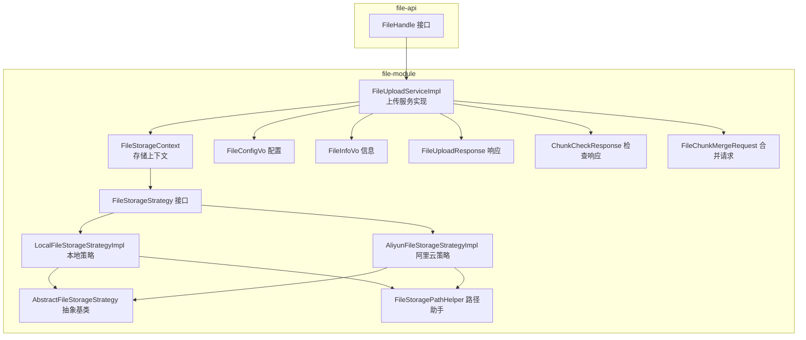
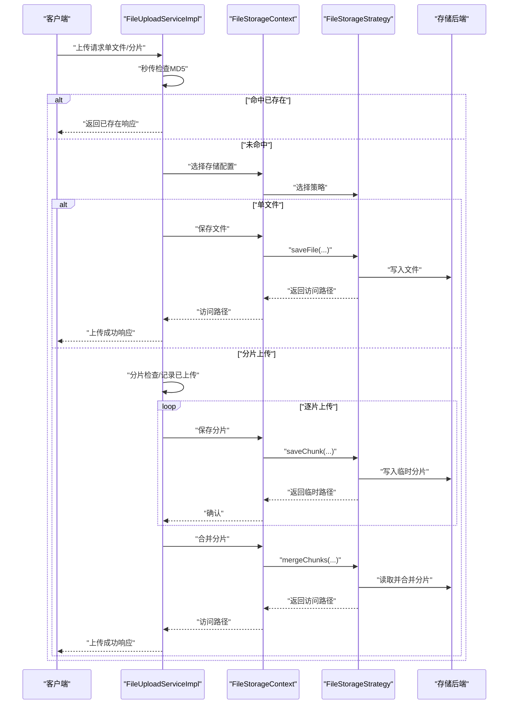
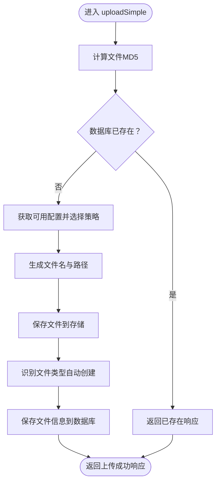
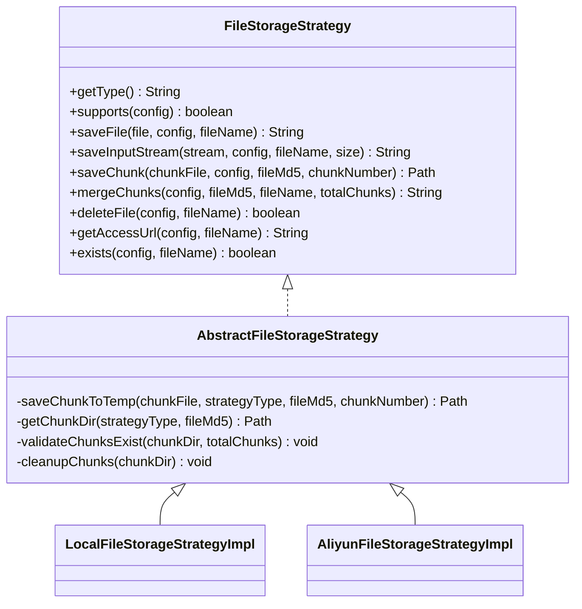
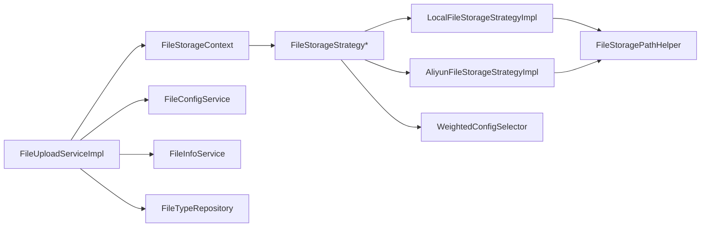

# 文件上传下载

<cite>
**本文引用的文件**
- [file-api/src/main/java/com/fastproject/file/api/FileHandle.java](file://file-api/src/main/java/com/fastproject/file/api/FileHandle.java)
- [file-module/src/main/java/com/fastproject/file/service/impl/FileUploadServiceImpl.java](file://file-module/src/main/java/com/fastproject/file/service/impl/FileUploadServiceImpl.java)
- [file-module/src/main/java/com/fastproject/file/storage/FileStorageStrategy.java](file://file-module/src/main/java/com/fastproject/file/storage/FileStorageStrategy.java)
- [file-module/src/main/java/com/fastproject/file/storage/AbstractFileStorageStrategy.java](file://file-module/src/main/java/com/fastproject/file/storage/AbstractFileStorageStrategy.java)
- [file-module/src/main/java/com/fastproject/file/storage/impl/LocalFileStorageStrategyImpl.java](file://file-module/src/main/java/com/fastproject/file/storage/impl/LocalFileStorageStrategyImpl.java)
- [file-module/src/main/java/com/fastproject/file/storage/impl/AliyunFileStorageStrategyImpl.java](file://file-module/src/main/java/com/fastproject/file/storage/impl/AliyunFileStorageStrategyImpl.java)
- [file-module/src/main/java/com/fastproject/file/storage/FileStorageContext.java](file://file-module/src/main/java/com/fastproject/file/storage/FileStorageContext.java)
- [file-module/src/main/java/com/fastproject/file/storage/FileStoragePathHelper.java](file://file-module/src/main/java/com/fastproject/file/storage/FileStoragePathHelper.java)
- [file-module/src/main/java/com/fastproject/file/vo/upload/FileUploadResponse.java](file://file-module/src/main/java/com/fastproject/file/vo/upload/FileUploadResponse.java)
- [file-module/src/main/java/com/fastproject/file/vo/upload/ChunkCheckResponse.java](file://file-module/src/main/java/com/fastproject/file/vo/upload/ChunkCheckResponse.java)
- [file-module/src/main/java/com/fastproject/file/vo/upload/FileChunkMergeRequest.java](file://file-module/src/main/java/com/fastproject/file/vo/upload/FileChunkMergeRequest.java)
- [file-module/src/main/java/com/fastproject/file/vo/config/FileConfigVo.java](file://file-module/src/main/java/com/fastproject/file/vo/config/FileConfigVo.java)
- [file-module/src/main/java/com/fastproject/file/vo/info/FileInfoVo.java](file://file-module/src/main/java/com/fastproject/file/vo/info/FileInfoVo.java)
</cite>

## 目录
1. [简介](#简介)
2. [项目结构](#项目结构)
3. [核心组件](#核心组件)
4. [架构总览](#架构总览)
5. [详细组件分析](#详细组件分析)
6. [依赖关系分析](#依赖关系分析)
7. [性能与可靠性](#性能与可靠性)
8. [故障排查指南](#故障排查指南)
9. [结论](#结论)
10. [附录：API 接口与数据模型](#附录api-接口与数据模型)

## 简介
本技术文档围绕文件上传下载功能展开，覆盖单文件上传、分片上传与断点续传、分片合并、URL 生成与访问、以及文件下载两种方式（直链与预签名 URL）。文档以代码为依据，系统梳理 FileHandle 接口设计、FileUploadServiceImpl 实现细节、存储策略抽象与具体实现、配置选择器与上下文管理、以及关键 VO 数据模型。

## 项目结构
文件上传下载相关代码主要分布在 file-api 与 file-module 两个模块中：
- file-api：对外暴露 FileHandle 接口，定义根据文件 ID 获取访问 URL 的能力。
- file-module：实现上传服务、存储策略、配置选择与上下文管理、VO 数据模型等。

图表来源
- [file-api/src/main/java/com/fastproject/file/api/FileHandle.java](file://file-api/src/main/java/com/fastproject/file/api/FileHandle.java#L1-L22)
- [file-module/src/main/java/com/fastproject/file/service/impl/FileUploadServiceImpl.java](file://file-module/src/main/java/com/fastproject/file/service/impl/FileUploadServiceImpl.java#L1-L335)
- [file-module/src/main/java/com/fastproject/file/storage/FileStorageContext.java](file://file-module/src/main/java/com/fastproject/file/storage/FileStorageContext.java#L1-L128)
- [file-module/src/main/java/com/fastproject/file/storage/FileStorageStrategy.java](file://file-module/src/main/java/com/fastproject/file/storage/FileStorageStrategy.java#L1-L105)
- [file-module/src/main/java/com/fastproject/file/storage/AbstractFileStorageStrategy.java](file://file-module/src/main/java/com/fastproject/file/storage/AbstractFileStorageStrategy.java#L1-L59)
- [file-module/src/main/java/com/fastproject/file/storage/impl/LocalFileStorageStrategyImpl.java](file://file-module/src/main/java/com/fastproject/file/storage/impl/LocalFileStorageStrategyImpl.java#L1-L170)
- [file-module/src/main/java/com/fastproject/file/storage/impl/AliyunFileStorageStrategyImpl.java](file://file-module/src/main/java/com/fastproject/file/storage/impl/AliyunFileStorageStrategyImpl.java#L1-L284)
- [file-module/src/main/java/com/fastproject/file/storage/FileStoragePathHelper.java](file://file-module/src/main/java/com/fastproject/file/storage/FileStoragePathHelper.java#L1-L50)
- [file-module/src/main/java/com/fastproject/file/vo/config/FileConfigVo.java](file://file-module/src/main/java/com/fastproject/file/vo/config/FileConfigVo.java#L1-L61)
- [file-module/src/main/java/com/fastproject/file/vo/info/FileInfoVo.java](file://file-module/src/main/java/com/fastproject/file/vo/info/FileInfoVo.java#L1-L66)
- [file-module/src/main/java/com/fastproject/file/vo/upload/FileUploadResponse.java](file://file-module/src/main/java/com/fastproject/file/vo/upload/FileUploadResponse.java#L1-L64)
- [file-module/src/main/java/com/fastproject/file/vo/upload/ChunkCheckResponse.java](file://file-module/src/main/java/com/fastproject/file/vo/upload/ChunkCheckResponse.java#L1-L48)
- [file-module/src/main/java/com/fastproject/file/vo/upload/FileChunkMergeRequest.java](file://file-module/src/main/java/com/fastproject/file/vo/upload/FileChunkMergeRequest.java#L1-L41)

章节来源
- [file-api/src/main/java/com/fastproject/file/api/FileHandle.java](file://file-api/src/main/java/com/fastproject/file/api/FileHandle.java#L1-L22)
- [file-module/src/main/java/com/fastproject/file/service/impl/FileUploadServiceImpl.java](file://file-module/src/main/java/com/fastproject/file/service/impl/FileUploadServiceImpl.java#L1-L335)

## 核心组件
- FileHandle 接口：对外提供根据文件 ID 获取单个或批量文件 URL 的能力，作为上层调用统一入口。
- FileUploadServiceImpl：实现单文件上传、分片上传检查、分片上传、分片合并、配置选择、文件类型解析与持久化等。
- FileStorageContext：存储策略与配置选择的门面，负责按配置选择策略并委派具体操作。
- FileStorageStrategy 及其实现：定义统一的存储能力契约，本地与阿里云 OSS 两种策略分别实现文件/分片保存、合并、删除、URL 生成、存在性检查等。
- VO 数据模型：FileConfigVo、FileInfoVo、FileUploadResponse、ChunkCheckResponse、FileChunkMergeRequest 等，承载配置、信息与上传过程中的数据流转。

章节来源
- [file-api/src/main/java/com/fastproject/file/api/FileHandle.java](file://file-api/src/main/java/com/fastproject/file/api/FileHandle.java#L1-L22)
- [file-module/src/main/java/com/fastproject/file/service/impl/FileUploadServiceImpl.java](file://file-module/src/main/java/com/fastproject/file/service/impl/FileUploadServiceImpl.java#L1-L335)
- [file-module/src/main/java/com/fastproject/file/storage/FileStorageContext.java](file://file-module/src/main/java/com/fastproject/file/storage/FileStorageContext.java#L1-L128)
- [file-module/src/main/java/com/fastproject/file/storage/FileStorageStrategy.java](file://file-module/src/main/java/com/fastproject/file/storage/FileStorageStrategy.java#L1-L105)
- [file-module/src/main/java/com/fastproject/file/vo/config/FileConfigVo.java](file://file-module/src/main/java/com/fastproject/file/vo/config/FileConfigVo.java#L1-L61)
- [file-module/src/main/java/com/fastproject/file/vo/info/FileInfoVo.java](file://file-module/src/main/java/com/fastproject/file/vo/info/FileInfoVo.java#L1-L66)
- [file-module/src/main/java/com/fastproject/file/vo/upload/FileUploadResponse.java](file://file-module/src/main/java/com/fastproject/file/vo/upload/FileUploadResponse.java#L1-L64)
- [file-module/src/main/java/com/fastproject/file/vo/upload/ChunkCheckResponse.java](file://file-module/src/main/java/com/fastproject/file/vo/upload/ChunkCheckResponse.java#L1-L48)
- [file-module/src/main/java/com/fastproject/file/vo/upload/FileChunkMergeRequest.java](file://file-module/src/main/java/com/fastproject/file/vo/upload/FileChunkMergeRequest.java#L1-L41)

## 架构总览
整体采用“策略模式 + 上下文门面”的架构：
- FileUploadServiceImpl 通过 FileStorageContext 选择合适的存储策略（本地或阿里云）。
- 上传流程中，先进行秒传检查；若未命中，则按单文件或分片流程处理；分片流程包含分片检查、分片上传、分片合并。
- URL 生成由具体策略负责，本地策略拼接相对路径或访问域，阿里云策略在私有桶时生成预签名 URL。

图表来源
- [file-module/src/main/java/com/fastproject/file/service/impl/FileUploadServiceImpl.java](file://file-module/src/main/java/com/fastproject/file/service/impl/FileUploadServiceImpl.java#L50-L213)
- [file-module/src/main/java/com/fastproject/file/storage/FileStorageContext.java](file://file-module/src/main/java/com/fastproject/file/storage/FileStorageContext.java#L68-L102)
- [file-module/src/main/java/com/fastproject/file/storage/FileStorageStrategy.java](file://file-module/src/main/java/com/fastproject/file/storage/FileStorageStrategy.java#L32-L76)

## 详细组件分析

### FileHandle 接口设计
- 单文件 URL 查询：根据文件 ID 返回访问 URL。
- 批量 URL 查询：根据文件 ID 集合返回 URL 列表（FileUrlVo）。
- 设计目标：为上层业务提供统一的 URL 获取入口，屏蔽底层存储差异。

章节来源
- [file-api/src/main/java/com/fastproject/file/api/FileHandle.java](file://file-api/src/main/java/com/fastproject/file/api/FileHandle.java#L1-L22)

### FileUploadServiceImpl 实现要点
- 单文件上传（uploadSimple）
  - 秒传：计算 MD5 并查询是否已存在，存在则直接返回已存在响应。
  - 配置选择：获取可用配置并由上下文按策略选择。
  - 命名与路径：基于日期生成存储路径，文件名为 MD5+扩展名。
  - 保存文件：委托存储上下文执行保存。
  - 类型识别：根据扩展名获取或自动创建文件类型。
  - 保存信息：封装 FileInfoCreate 并持久化。
- 分片上传检查（checkChunk）
  - 秒传判断。
  - 计算总分片数与已上传分片集合（内存缓存 + 临时目录扫描）。
  - 返回 needUpload 或 existed 结果。
- 分片上传（uploadChunk）
  - 保存分片到临时目录。
  - 更新已上传分片缓存。
- 分片合并（mergeChunks）
  - 校验所有分片是否齐全。
  - 选择配置并生成最终文件名与路径。
  - 委托存储上下文合并分片。
  - 保存文件信息并清理缓存。
- 辅助方法
  - 配置选择：默认从可用配置中选择，支持按 ID 指定。
  - MD5 计算、文件名生成、扩展名提取、文件类型解析与自动创建。

图表来源
- [file-module/src/main/java/com/fastproject/file/service/impl/FileUploadServiceImpl.java](file://file-module/src/main/java/com/fastproject/file/service/impl/FileUploadServiceImpl.java#L50-L106)

章节来源
- [file-module/src/main/java/com/fastproject/file/service/impl/FileUploadServiceImpl.java](file://file-module/src/main/java/com/fastproject/file/service/impl/FileUploadServiceImpl.java#L1-L335)

### 存储策略体系
- FileStorageStrategy 接口
  - 统一定义：类型标识、支持性判断、文件保存、输入流保存、分片保存、分片合并、删除、访问 URL、存在性检查。
- AbstractFileStorageStrategy 抽象基类
  - 提供通用能力：分片临时目录管理、分片存在性校验、分片清理。
- LocalFileStorageStrategyImpl（本地）
  - 保存文件/分片：写入本地磁盘，按配置存储路径组织。
  - 合并分片：顺序读取临时分片并写入目标文件。
  - URL 生成：优先使用访问域，否则拼接 /uploads 相对路径。
  - 删除与存在性检查：基于文件系统。
- AliyunFileStorageStrategyImpl（阿里云 OSS）
  - 保存文件/分片：本地暂存分片，最终通过 OSS SDK 完成分片上传合并。
  - URL 生成：私有桶生成预签名 URL；公有桶拼接默认访问前缀或自定义域名/远程地址。
  - 删除与存在性检查：通过 OSS SDK 接口实现。

图表来源
- [file-module/src/main/java/com/fastproject/file/storage/FileStorageStrategy.java](file://file-module/src/main/java/com/fastproject/file/storage/FileStorageStrategy.java#L1-L105)
- [file-module/src/main/java/com/fastproject/file/storage/AbstractFileStorageStrategy.java](file://file-module/src/main/java/com/fastproject/file/storage/AbstractFileStorageStrategy.java#L1-L59)
- [file-module/src/main/java/com/fastproject/file/storage/impl/LocalFileStorageStrategyImpl.java](file://file-module/src/main/java/com/fastproject/file/storage/impl/LocalFileStorageStrategyImpl.java#L1-L170)
- [file-module/src/main/java/com/fastproject/file/storage/impl/AliyunFileStorageStrategyImpl.java](file://file-module/src/main/java/com/fastproject/file/storage/impl/AliyunFileStorageStrategyImpl.java#L1-L284)

章节来源
- [file-module/src/main/java/com/fastproject/file/storage/FileStorageStrategy.java](file://file-module/src/main/java/com/fastproject/file/storage/FileStorageStrategy.java#L1-L105)
- [file-module/src/main/java/com/fastproject/file/storage/AbstractFileStorageStrategy.java](file://file-module/src/main/java/com/fastproject/file/storage/AbstractFileStorageStrategy.java#L1-L59)
- [file-module/src/main/java/com/fastproject/file/storage/impl/LocalFileStorageStrategyImpl.java](file://file-module/src/main/java/com/fastproject/file/storage/impl/LocalFileStorageStrategyImpl.java#L1-L170)
- [file-module/src/main/java/com/fastproject/file/storage/impl/AliyunFileStorageStrategyImpl.java](file://file-module/src/main/java/com/fastproject/file/storage/impl/AliyunFileStorageStrategyImpl.java#L1-L284)

### FileStorageContext 与路径助手
- FileStorageContext
  - 依据配置选择策略并委派保存、合并、删除、URL 生成、存在性检查等操作。
  - 提供配置选择与缓存能力。
- FileStoragePathHelper
  - 规范化存储键、相对路径与 URL 拼接，处理斜杠与协议前缀。

章节来源
- [file-module/src/main/java/com/fastproject/file/storage/FileStorageContext.java](file://file-module/src/main/java/com/fastproject/file/storage/FileStorageContext.java#L1-L128)
- [file-module/src/main/java/com/fastproject/file/storage/FileStoragePathHelper.java](file://file-module/src/main/java/com/fastproject/file/storage/FileStoragePathHelper.java#L1-L50)

### VO 数据模型
- FileConfigVo：存储配置载体，包含存储路径、访问域、类型、权重、远程 URL/Token、扩展配置等。
- FileInfoVo：文件信息载体，包含文件名、大小、类型、MD5、状态、存储类型、访问路径、文件路径、配置与类型 ID 等。
- FileUploadResponse：上传响应，包含文件 ID、名称、大小、MD5、访问路径、是否已存在、已上传分片列表等。
- ChunkCheckResponse：分片检查响应，包含是否需要上传、文件 ID（已存在时）、已上传分片列表、总分片数。
- FileChunkMergeRequest：分片合并请求，包含文件 MD5、名称、大小、类型、总分片数与可选配置 ID。

章节来源
- [file-module/src/main/java/com/fastproject/file/vo/config/FileConfigVo.java](file://file-module/src/main/java/com/fastproject/file/vo/config/FileConfigVo.java#L1-L61)
- [file-module/src/main/java/com/fastproject/file/vo/info/FileInfoVo.java](file://file-module/src/main/java/com/fastproject/file/vo/info/FileInfoVo.java#L1-L66)
- [file-module/src/main/java/com/fastproject/file/vo/upload/FileUploadResponse.java](file://file-module/src/main/java/com/fastproject/file/vo/upload/FileUploadResponse.java#L1-L64)
- [file-module/src/main/java/com/fastproject/file/vo/upload/ChunkCheckResponse.java](file://file-module/src/main/java/com/fastproject/file/vo/upload/ChunkCheckResponse.java#L1-L48)
- [file-module/src/main/java/com/fastproject/file/vo/upload/FileChunkMergeRequest.java](file://file-module/src/main/java/com/fastproject/file/vo/upload/FileChunkMergeRequest.java#L1-L41)

## 依赖关系分析
- FileUploadServiceImpl 依赖 FileInfoService、FileConfigService、FileStorageContext、FileTypeRepository。
- FileStorageContext 依赖多种 FileStorageStrategy 实现与 ConfigSelector。
- 具体策略依赖 FileStoragePathHelper 进行路径规范化与 URL 拼接。
- VO 层为上传与存储流程的数据载体，贯穿各层。

图表来源
- [file-module/src/main/java/com/fastproject/file/service/impl/FileUploadServiceImpl.java](file://file-module/src/main/java/com/fastproject/file/service/impl/FileUploadServiceImpl.java#L1-L37)
- [file-module/src/main/java/com/fastproject/file/storage/FileStorageContext.java](file://file-module/src/main/java/com/fastproject/file/storage/FileStorageContext.java#L24-L25)
- [file-module/src/main/java/com/fastproject/file/storage/impl/LocalFileStorageStrategyImpl.java](file://file-module/src/main/java/com/fastproject/file/storage/impl/LocalFileStorageStrategyImpl.java#L32)
- [file-module/src/main/java/com/fastproject/file/storage/impl/AliyunFileStorageStrategyImpl.java](file://file-module/src/main/java/com/fastproject/file/storage/impl/AliyunFileStorageStrategyImpl.java#L45)

章节来源
- [file-module/src/main/java/com/fastproject/file/service/impl/FileUploadServiceImpl.java](file://file-module/src/main/java/com/fastproject/file/service/impl/FileUploadServiceImpl.java#L1-L37)
- [file-module/src/main/java/com/fastproject/file/storage/FileStorageContext.java](file://file-module/src/main/java/com/fastproject/file/storage/FileStorageContext.java#L1-L128)

## 性能与可靠性
- 分片大小：默认 5MB，兼顾网络稳定性与服务器压力。
- 临时分片：使用系统临时目录按 fileMd5 分组，避免并发冲突。
- 缓存与持久化：内存缓存已上传分片集合，结合文件系统扫描保证一致性。
- 存储策略：本地策略适合小规模部署；阿里云策略适合高并发与跨地域访问，支持预签名 URL 降低带宽成本。
- 错误处理：统一抛出业务异常，便于上层捕获与提示。

[本节为通用建议，无需特定文件来源]

## 故障排查指南
- 上传失败
  - 检查存储路径权限与磁盘空间（本地）。
  - 检查 OSS 凭证与 Bucket 权限（阿里云）。
  - 查看日志定位具体异常来源。
- 分片合并失败
  - 确认所有分片均已上传且命名规范（chunk_0, chunk_1, ...）。
  - 检查临时目录权限与清理逻辑。
- URL 无法访问
  - 本地策略需确保访问域或 /uploads 路由正确映射。
  - 阿里云私有桶需使用预签名 URL。
- 秒传未命中
  - 确认 MD5 计算一致与数据库索引有效。

章节来源
- [file-module/src/main/java/com/fastproject/file/service/impl/FileUploadServiceImpl.java](file://file-module/src/main/java/com/fastproject/file/service/impl/FileUploadServiceImpl.java#L102-L105)
- [file-module/src/main/java/com/fastproject/file/storage/impl/LocalFileStorageStrategyImpl.java](file://file-module/src/main/java/com/fastproject/file/storage/impl/LocalFileStorageStrategyImpl.java#L122-L137)
- [file-module/src/main/java/com/fastproject/file/storage/impl/AliyunFileStorageStrategyImpl.java](file://file-module/src/main/java/com/fastproject/file/storage/impl/AliyunFileStorageStrategyImpl.java#L150-L166)

## 结论
该文件上传下载方案通过清晰的接口与策略解耦，实现了单文件上传、分片上传与断点续传、分片合并、URL 生成与访问等核心能力。FileUploadServiceImpl 作为协调者，结合 FileStorageContext 与多种存储策略，满足本地与云端场景需求。配合完善的 VO 模型与错误处理机制，具备良好的可维护性与扩展性。

[本节为总结，无需特定文件来源]

## 附录：API 接口与数据模型

### API 接口（概念说明）
- 单文件上传
  - 方法：POST
  - 路径：/file/upload/simple
  - 请求参数：multipartFile、configId
  - 响应：FileUploadResponse
- 分片上传检查
  - 方法：GET
  - 路径：/file/upload/chunk/check
  - 查询参数：fileMd5、fileSize、fileName
  - 响应：ChunkCheckResponse
- 分片上传
  - 方法：POST
  - 路径：/file/upload/chunk
  - 表单参数：chunkFile、fileMd5、fileName、fileSize、fileType、chunkNumber、totalChunks、chunkSize、configId
  - 响应：FileUploadResponse
- 分片合并
  - 方法：POST
  - 路径：/file/upload/chunk/merge
  - 请求体：FileChunkMergeRequest
  - 响应：FileUploadResponse
- 获取文件 URL
  - 方法：GET
  - 路径：/file/url/{id}
  - 响应：String（URL）
- 批量获取文件 URL
  - 方法：POST
  - 路径：/file/urls
  - 请求体：Set<String>（IDs）
  - 响应：Set<FileUrlVo>

[本节为概念说明，未直接分析具体源码文件]

### 数据模型
- FileConfigVo
  - 字段：id、storagePath、accessDomain、status、type、description、remoteUrl、remoteToken、weight、config
- FileInfoVo
  - 字段：id、fileName、fileSize、fileType、fileMd5、status、fileStorage、accessPath、filePath、configId、fileTypeId
- FileUploadResponse
  - 字段：fileId、fileName、fileSize、fileMd5、accessPath、existed、uploadedChunks
- ChunkCheckResponse
  - 字段：needUpload、fileId、uploadedChunks、totalChunks
- FileChunkMergeRequest
  - 字段：fileMd5、fileName、fileSize、fileType、totalChunks、configId

章节来源
- [file-module/src/main/java/com/fastproject/file/vo/config/FileConfigVo.java](file://file-module/src/main/java/com/fastproject/file/vo/config/FileConfigVo.java#L1-L61)
- [file-module/src/main/java/com/fastproject/file/vo/info/FileInfoVo.java](file://file-module/src/main/java/com/fastproject/file/vo/info/FileInfoVo.java#L1-L66)
- [file-module/src/main/java/com/fastproject/file/vo/upload/FileUploadResponse.java](file://file-module/src/main/java/com/fastproject/file/vo/upload/FileUploadResponse.java#L1-L64)
- [file-module/src/main/java/com/fastproject/file/vo/upload/ChunkCheckResponse.java](file://file-module/src/main/java/com/fastproject/file/vo/upload/ChunkCheckResponse.java#L1-L48)
- [file-module/src/main/java/com/fastproject/file/vo/upload/FileChunkMergeRequest.java](file://file-module/src/main/java/com/fastproject/file/vo/upload/FileChunkMergeRequest.java#L1-L41)