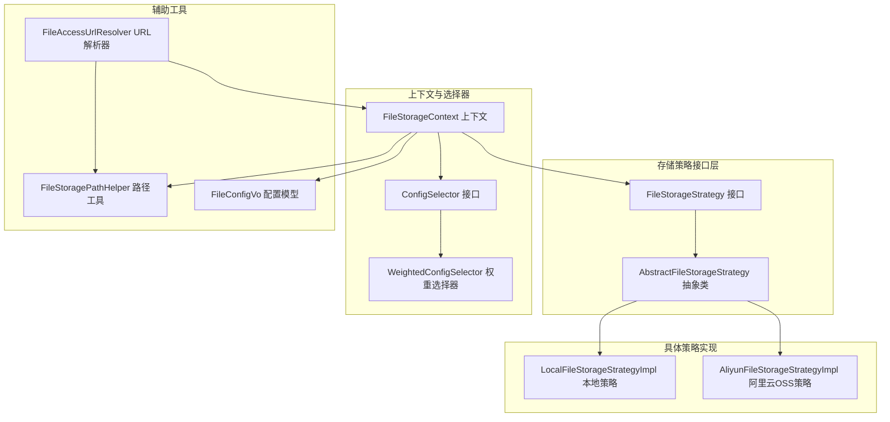
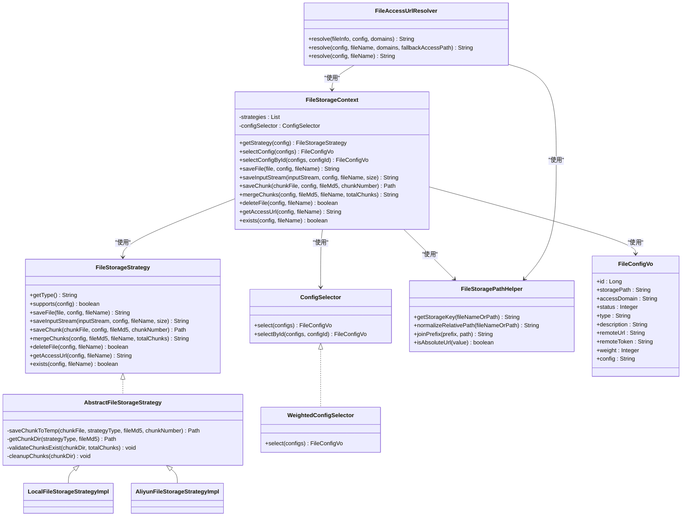
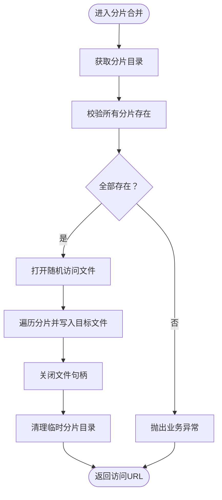
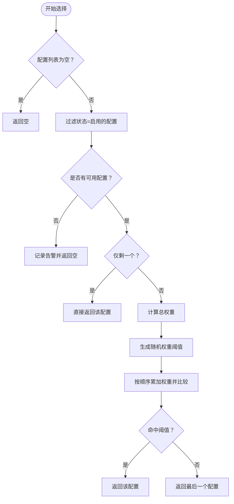
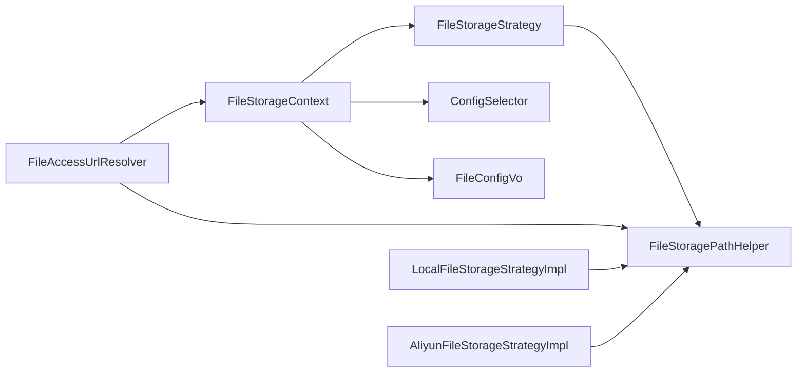

# 文件存储策略

<cite>
**本文引用的文件**
- [FileStorageStrategy.java](file://file-module/src/main/java/com/fastproject/file/storage/FileStorageStrategy.java)
- [AbstractFileStorageStrategy.java](file://file-module/src/main/java/com/fastproject/file/storage/AbstractFileStorageStrategy.java)
- [FileStorageContext.java](file://file-module/src/main/java/com/fastproject/file/storage/FileStorageContext.java)
- [ConfigSelector.java](file://file-module/src/main/java/com/fastproject/file/storage/ConfigSelector.java)
- [WeightedConfigSelector.java](file://file-module/src/main/java/com/fastproject/file/storage/WeightedConfigSelector.java)
- [LocalFileStorageStrategyImpl.java](file://file-module/src/main/java/com/fastproject/file/storage/impl/LocalFileStorageStrategyImpl.java)
- [AliyunFileStorageStrategyImpl.java](file://file-module/src/main/java/com/fastproject/file/storage/impl/AliyunFileStorageStrategyImpl.java)
- [FileStoragePathHelper.java](file://file-module/src/main/java/com/fastproject/file/storage/FileStoragePathHelper.java)
- [FileConfigVo.java](file://file-module/src/main/java/com/fastproject/file/vo/config/FileConfigVo.java)
- [FileAccessUrlResolver.java](file://file-module/src/main/java/com/fastproject/file/storage/FileAccessUrlResolver.java)
</cite>

## 目录
1. [引言](#引言)
2. [项目结构](#项目结构)
3. [核心组件](#核心组件)
4. [架构总览](#架构总览)
5. [组件详解](#组件详解)
6. [依赖关系分析](#依赖关系分析)
7. [性能考量](#性能考量)
8. [故障排查指南](#故障排查指南)
9. [结论](#结论)
10. [附录](#附录)

## 引言
本文件存储策略技术文档系统阐述了基于接口与抽象基类的插件化存储架构设计，覆盖本地存储与阿里云OSS两种策略的实现差异、配置选择器的权重负载均衡机制、统一访问URL解析流程、错误处理与性能优化建议，并提供扩展新存储策略的实践指南。

## 项目结构
围绕文件存储策略的相关模块主要位于 file-module 的 storage 包及其子包中，采用“接口 + 抽象基类 + 具体策略实现 + 上下文/选择器”的分层组织方式，辅以路径工具与访问URL解析器，形成可扩展、可维护的存储体系。

图表来源
- [FileStorageStrategy.java](file://file-module/src/main/java/com/fastproject/file/storage/FileStorageStrategy.java#L14-L104)
- [AbstractFileStorageStrategy.java](file://file-module/src/main/java/com/fastproject/file/storage/AbstractFileStorageStrategy.java#L15-L58)
- [LocalFileStorageStrategyImpl.java](file://file-module/src/main/java/com/fastproject/file/storage/impl/LocalFileStorageStrategyImpl.java#L28-L169)
- [AliyunFileStorageStrategyImpl.java](file://file-module/src/main/java/com/fastproject/file/storage/impl/AliyunFileStorageStrategyImpl.java#L41-L283)
- [FileStorageContext.java](file://file-module/src/main/java/com/fastproject/file/storage/FileStorageContext.java#L22-L127)
- [ConfigSelector.java](file://file-module/src/main/java/com/fastproject/file/storage/ConfigSelector.java#L11-L37)
- [WeightedConfigSelector.java](file://file-module/src/main/java/com/fastproject/file/storage/WeightedConfigSelector.java#L17-L65)
- [FileStoragePathHelper.java](file://file-module/src/main/java/com/fastproject/file/storage/FileStoragePathHelper.java#L7-L49)
- [FileAccessUrlResolver.java](file://file-module/src/main/java/com/fastproject/file/storage/FileAccessUrlResolver.java#L19-L96)
- [FileConfigVo.java](file://file-module/src/main/java/com/fastproject/file/vo/config/FileConfigVo.java#L9-L60)

章节来源
- [FileStorageStrategy.java](file://file-module/src/main/java/com/fastproject/file/storage/FileStorageStrategy.java#L10-L104)
- [FileStorageContext.java](file://file-module/src/main/java/com/fastproject/file/storage/FileStorageContext.java#L15-L127)

## 核心组件
- 存储策略接口：定义统一的文件操作契约，包括保存、分片、合并、删除、存在性检查、访问URL获取等。
- 抽象基类：提供分片临时目录管理、分片存在性校验、分片清理等通用能力，降低重复实现成本。
- 具体策略实现：
  - 本地存储策略：面向磁盘文件的保存、合并、删除与存在性检查；支持通过访问域名或默认前缀生成访问URL。
  - 阿里云OSS策略：基于OSS SDK进行对象上传、分片上传、合并、删除与存在性检查；支持私有桶预签名URL生成。
- 上下文：负责根据配置选择合适策略、转发调用、缓存配置、暴露统一API。
- 配置选择器：从多配置中按权重与状态选择可用配置；提供按ID强制选择能力。
- 路径工具：标准化存储键、相对路径与URL拼接。
- URL解析器：统一拼装最终访问地址，优先策略返回，其次域名池随机选择，最后回退到配置或原始路径。

章节来源
- [FileStorageStrategy.java](file://file-module/src/main/java/com/fastproject/file/storage/FileStorageStrategy.java#L14-L104)
- [AbstractFileStorageStrategy.java](file://file-module/src/main/java/com/fastproject/file/storage/AbstractFileStorageStrategy.java#L15-L58)
- [LocalFileStorageStrategyImpl.java](file://file-module/src/main/java/com/fastproject/file/storage/impl/LocalFileStorageStrategyImpl.java#L28-L169)
- [AliyunFileStorageStrategyImpl.java](file://file-module/src/main/java/com/fastproject/file/storage/impl/AliyunFileStorageStrategyImpl.java#L41-L283)
- [FileStorageContext.java](file://file-module/src/main/java/com/fastproject/file/storage/FileStorageContext.java#L22-L127)
- [ConfigSelector.java](file://file-module/src/main/java/com/fastproject/file/storage/ConfigSelector.java#L11-L37)
- [WeightedConfigSelector.java](file://file-module/src/main/java/com/fastproject/file/storage/WeightedConfigSelector.java#L17-L65)
- [FileStoragePathHelper.java](file://file-module/src/main/java/com/fastproject/file/storage/FileStoragePathHelper.java#L7-L49)
- [FileAccessUrlResolver.java](file://file-module/src/main/java/com/fastproject/file/storage/FileAccessUrlResolver.java#L19-L96)
- [FileConfigVo.java](file://file-module/src/main/java/com/fastproject/file/vo/config/FileConfigVo.java#L9-L60)

## 架构总览
整体采用“策略模式 + 工厂式选择 + 统一上下文”的架构，通过接口隔离与抽象基类复用，实现对本地与云端存储的无感切换。

图表来源
- [FileStorageStrategy.java](file://file-module/src/main/java/com/fastproject/file/storage/FileStorageStrategy.java#L14-L104)
- [AbstractFileStorageStrategy.java](file://file-module/src/main/java/com/fastproject/file/storage/AbstractFileStorageStrategy.java#L15-L58)
- [LocalFileStorageStrategyImpl.java](file://file-module/src/main/java/com/fastproject/file/storage/impl/LocalFileStorageStrategyImpl.java#L28-L169)
- [AliyunFileStorageStrategyImpl.java](file://file-module/src/main/java/com/fastproject/file/storage/impl/AliyunFileStorageStrategyImpl.java#L41-L283)
- [FileStorageContext.java](file://file-module/src/main/java/com/fastproject/file/storage/FileStorageContext.java#L22-L127)
- [ConfigSelector.java](file://file-module/src/main/java/com/fastproject/file/storage/ConfigSelector.java#L11-L37)
- [WeightedConfigSelector.java](file://file-module/src/main/java/com/fastproject/file/storage/WeightedConfigSelector.java#L17-L65)
- [FileStoragePathHelper.java](file://file-module/src/main/java/com/fastproject/file/storage/FileStoragePathHelper.java#L7-L49)
- [FileAccessUrlResolver.java](file://file-module/src/main/java/com/fastproject/file/storage/FileAccessUrlResolver.java#L19-L96)
- [FileConfigVo.java](file://file-module/src/main/java/com/fastproject/file/vo/config/FileConfigVo.java#L9-L60)

## 组件详解

### 存储策略接口与抽象基类
- 接口职责：定义统一的文件生命周期操作与访问URL生成规范，屏蔽底层差异。
- 抽象基类：封装分片临时目录创建、分片存在性校验、分片清理等通用逻辑，减少重复代码。

图表来源
- [AbstractFileStorageStrategy.java](file://file-module/src/main/java/com/fastproject/file/storage/AbstractFileStorageStrategy.java#L30-L57)
- [LocalFileStorageStrategyImpl.java](file://file-module/src/main/java/com/fastproject/file/storage/impl/LocalFileStorageStrategyImpl.java#L88-L119)
- [AliyunFileStorageStrategyImpl.java](file://file-module/src/main/java/com/fastproject/file/storage/impl/AliyunFileStorageStrategyImpl.java#L93-L148)

章节来源
- [FileStorageStrategy.java](file://file-module/src/main/java/com/fastproject/file/storage/FileStorageStrategy.java#L14-L104)
- [AbstractFileStorageStrategy.java](file://file-module/src/main/java/com/fastproject/file/storage/AbstractFileStorageStrategy.java#L15-L58)

### 本地存储策略
- 配置要点：需提供存储根路径；访问URL优先使用配置中的访问域名，否则使用默认前缀。
- 实现差异：
  - 保存：支持MultipartFile与InputStream两种输入；自动创建父目录。
  - 分片：将分片保存至系统临时目录，命名规则为“chunk_{序号}”。
  - 合并：顺序读取各分片并写入目标文件，完成后清理临时目录。
  - 删除/存在性检查：基于文件系统操作。
- 性能特点：I/O受限于磁盘吞吐；适合小规模或内网部署场景。

章节来源
- [LocalFileStorageStrategyImpl.java](file://file-module/src/main/java/com/fastproject/file/storage/impl/LocalFileStorageStrategyImpl.java#L28-L169)
- [FileStoragePathHelper.java](file://file-module/src/main/java/com/fastproject/file/storage/FileStoragePathHelper.java#L7-L49)

### 阿里云OSS存储策略
- 配置要点：通过配置字段承载JSON化的密钥信息（包含访问密钥、Endpoint、Region、Bucket等）；支持私有桶预签名URL。
- 实现差异：
  - 保存：使用OSS SDK的PutObject上传单文件。
  - 分片：先落盘到临时目录，再通过OSS Multipart Upload逐个上传分片并记录ETag，最后完成合并。
  - 删除/存在性检查：通过DeleteObject与HeadObject请求实现。
  - 访问URL：私有桶生成带过期时间的预签名URL；公有桶优先使用配置域名，其次远程URL，最后构造默认访问前缀。
- 性能特点：网络I/O与并发上传能力决定吞吐；分片上传更利于大文件与断点续传。

章节来源
- [AliyunFileStorageStrategyImpl.java](file://file-module/src/main/java/com/fastproject/file/storage/impl/AliyunFileStorageStrategyImpl.java#L41-L283)
- [FileStoragePathHelper.java](file://file-module/src/main/java/com/fastproject/file/storage/FileStoragePathHelper.java#L7-L49)

### 存储配置选择器与权重负载均衡
- 选择器接口：提供按列表选择与按ID强制选择的能力。
- 权重选择器：
  - 过滤状态为启用的配置；
  - 计算总权重，按比例随机命中；
  - 单配置时直接返回，空配置返回空。
- 适用场景：多存储后端并存时，按权重分配流量，提升资源利用率与可用性。

图表来源
- [WeightedConfigSelector.java](file://file-module/src/main/java/com/fastproject/file/storage/WeightedConfigSelector.java#L21-L64)

章节来源
- [ConfigSelector.java](file://file-module/src/main/java/com/fastproject/file/storage/ConfigSelector.java#L11-L37)
- [WeightedConfigSelector.java](file://file-module/src/main/java/com/fastproject/file/storage/WeightedConfigSelector.java#L17-L65)

### 文件访问URL解析器
- 解析优先级：策略返回绝对URL优先；其次从域名池中随机选择一个作为前缀；再次回退到策略相对URL；最后回退到配置中的访问域或远程URL；若均不可用则返回标准化后的相对路径。
- 作用：屏蔽不同存储后端的URL差异，让业务侧只关注文件信息与配置。

章节来源
- [FileAccessUrlResolver.java](file://file-module/src/main/java/com/fastproject/file/storage/FileAccessUrlResolver.java#L19-L96)
- [FileStoragePathHelper.java](file://file-module/src/main/java/com/fastproject/file/storage/FileStoragePathHelper.java#L7-L49)

### 存储上下文与统一API
- 上下文职责：持有策略集合与配置选择器；根据配置动态选择策略；提供统一的保存、分片、合并、删除、存在性检查与URL获取入口。
- 错误处理：当配置为空或不支持的类型时抛出业务异常；其余操作由具体策略捕获并包装为业务异常。

章节来源
- [FileStorageContext.java](file://file-module/src/main/java/com/fastproject/file/storage/FileStorageContext.java#L22-L127)

## 依赖关系分析
- 组件耦合：
  - 上下文依赖策略集合与选择器，策略实现依赖路径工具与配置模型。
  - URL解析器依赖上下文与路径工具，形成“策略—上下文—解析器”的链路。
- 外部依赖：
  - 阿里云OSS策略依赖OSS SDK；本地策略依赖文件系统API。
- 循环依赖：未见循环依赖迹象，层次清晰。

图表来源
- [FileStorageContext.java](file://file-module/src/main/java/com/fastproject/file/storage/FileStorageContext.java#L22-L127)
- [FileAccessUrlResolver.java](file://file-module/src/main/java/com/fastproject/file/storage/FileAccessUrlResolver.java#L19-L96)
- [FileStoragePathHelper.java](file://file-module/src/main/java/com/fastproject/file/storage/FileStoragePathHelper.java#L7-L49)
- [FileConfigVo.java](file://file-module/src/main/java/com/fastproject/file/vo/config/FileConfigVo.java#L9-L60)

## 性能考量
- 本地存储
  - 使用随机访问文件顺序写入，避免频繁IO抖动；确保磁盘空间充足与权限正确。
  - 分片合并时建议控制分片数量与大小，避免过大导致内存压力。
- 阿里云OSS
  - 分片上传建议结合并发与断点续传；合理设置分片大小以平衡吞吐与并发。
  - 私有桶预签名URL应控制有效期，避免泄露风险。
  - 利用域名池与CDN可显著提升访问速度与稳定性。
- 通用优化
  - 使用连接池与超时控制（如适用），避免阻塞与资源泄漏。
  - 对热点文件可考虑缓存访问URL，减少重复解析与SDK初始化开销。

## 故障排查指南
- 常见问题与定位
  - “不支持的存储类型”：确认配置类型与策略实现一致，检查策略supports方法匹配逻辑。
  - “存储路径不能为空”：本地策略要求配置提供有效存储根路径。
  - “阿里云 OSS 配置不完整/为空”：核对配置字段JSON结构与必填项。
  - “分片不存在，无法合并”：检查分片是否全部上传成功，临时目录是否被清理。
  - “生成临时访问地址失败”：检查私有桶权限、Endpoint与Region配置。
- 日志与异常
  - 策略实现与上下文均会记录关键操作日志；异常统一包装为业务异常，便于上层处理。
  - URL解析器在策略不可用时会回退到配置域名或远程URL，有助于快速恢复。

章节来源
- [FileStorageContext.java](file://file-module/src/main/java/com/fastproject/file/storage/FileStorageContext.java#L36-L44)
- [LocalFileStorageStrategyImpl.java](file://file-module/src/main/java/com/fastproject/file/storage/impl/LocalFileStorageStrategyImpl.java#L158-L167)
- [AliyunFileStorageStrategyImpl.java](file://file-module/src/main/java/com/fastproject/file/storage/impl/AliyunFileStorageStrategyImpl.java#L219-L237)
- [AbstractFileStorageStrategy.java](file://file-module/src/main/java/com/fastproject/file/storage/AbstractFileStorageStrategy.java#L30-L37)

## 结论
该存储策略体系通过接口与抽象基类实现了策略解耦，借助上下文与选择器完成运行时策略选择，配合URL解析器屏蔽底层差异。本地与OSS策略在实现细节上各有侧重：前者强调简单可靠与低延迟，后者强调弹性扩展与高可用。通过权重选择器与域名池，系统具备良好的可运维性与可扩展性。

## 附录

### 存储策略扩展指南
- 新增策略步骤
  - 实现接口：提供getType与supports方法，确保与配置类型匹配；实现保存、分片、合并、删除、存在性检查与URL生成。
  - 继承抽象基类：复用分片临时目录与清理逻辑，减少重复实现。
  - 注册为Spring组件：确保上下文能注入到策略集合中。
  - 配置适配：在配置模型中预留必要字段，或在策略内部解析配置字符串。
- 示例参考
  - 本地策略：参考路径构建、分片合并与删除逻辑。
  - 阿里云OSS策略：参考Multipart Upload、预签名URL与错误处理模式。

章节来源
- [FileStorageStrategy.java](file://file-module/src/main/java/com/fastproject/file/storage/FileStorageStrategy.java#L14-L104)
- [AbstractFileStorageStrategy.java](file://file-module/src/main/java/com/fastproject/file/storage/AbstractFileStorageStrategy.java#L15-L58)
- [LocalFileStorageStrategyImpl.java](file://file-module/src/main/java/com/fastproject/file/storage/impl/LocalFileStorageStrategyImpl.java#L28-L169)
- [AliyunFileStorageStrategyImpl.java](file://file-module/src/main/java/com/fastproject/file/storage/impl/AliyunFileStorageStrategyImpl.java#L41-L283)

### 配置示例与最佳实践
- 本地存储
  - 关键字段：type、storagePath、accessDomain（可选）、status（启用状态）。
  - 建议：storagePath以斜杠结尾；accessDomain提供稳定外网访问域名。
- 阿里云OSS
  - 关键字段：type、config（JSON字符串，包含accessKeyId、accessKeySecret、endpoint、region、bucket、privateBucket、urlExpireSeconds等）、status、accessDomain/remoteUrl（可选）。
  - 建议：私有桶开启预签名URL并设置合理过期时间；公有桶可直接使用默认访问前缀。
- 配置选择
  - 多配置时启用权重选择器，按资源容量与SLA设定权重，提升整体可用性。

章节来源
- [FileConfigVo.java](file://file-module/src/main/java/com/fastproject/file/vo/config/FileConfigVo.java#L9-L60)
- [WeightedConfigSelector.java](file://file-module/src/main/java/com/fastproject/file/storage/WeightedConfigSelector.java#L17-L65)
- [AliyunFileStorageStrategyImpl.java](file://file-module/src/main/java/com/fastproject/file/storage/impl/AliyunFileStorageStrategyImpl.java#L219-L237)