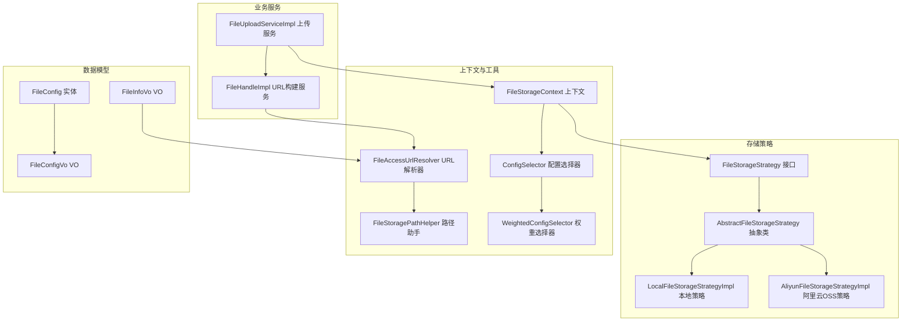
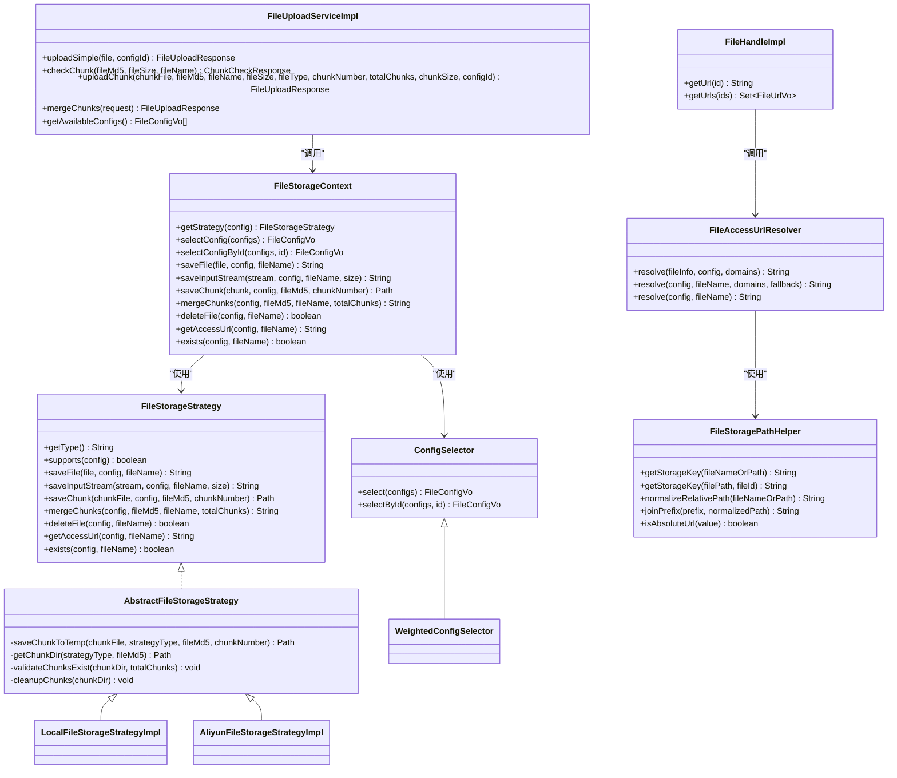
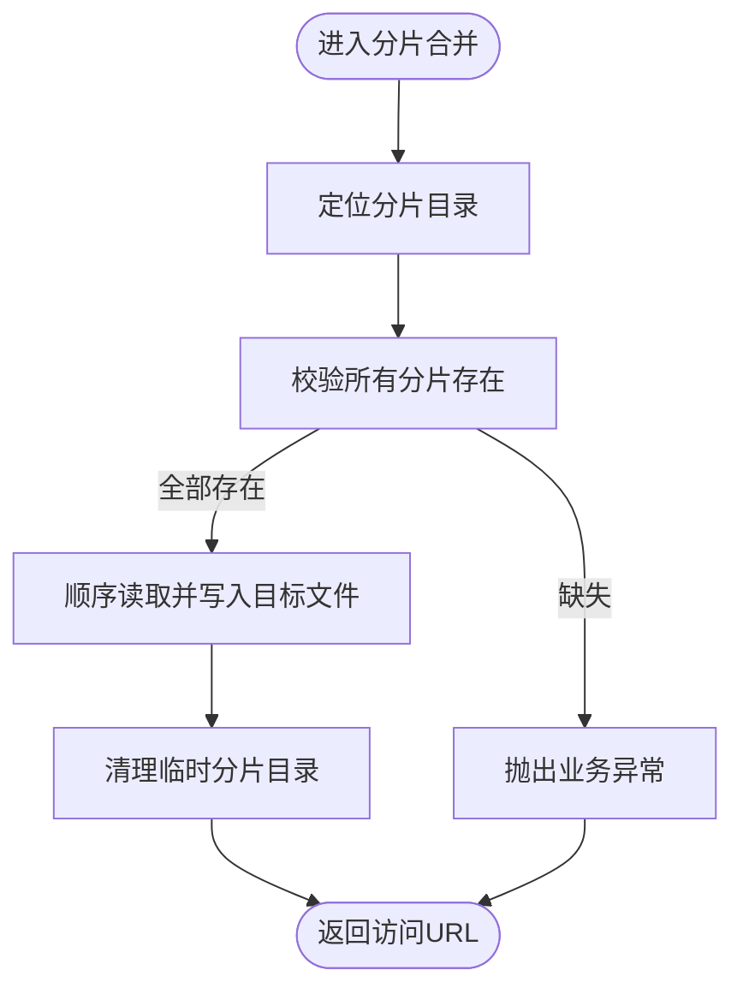
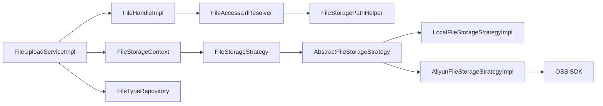

# 文件管理模块

<cite>
**本文引用的文件**
- [FileStorageStrategy.java](file://file-module/src/main/java/com/fastproject/file/storage/FileStorageStrategy.java)
- [AbstractFileStorageStrategy.java](file://file-module/src/main/java/com/fastproject/file/storage/AbstractFileStorageStrategy.java)
- [LocalFileStorageStrategyImpl.java](file://file-module/src/main/java/com/fastproject/file/storage/impl/LocalFileStorageStrategyImpl.java)
- [AliyunFileStorageStrategyImpl.java](file://file-module/src/main/java/com/fastproject/file/storage/impl/AliyunFileStorageStrategyImpl.java)
- [ConfigSelector.java](file://file-module/src/main/java/com/fastproject/file/storage/ConfigSelector.java)
- [WeightedConfigSelector.java](file://file-module/src/main/java/com/fastproject/file/storage/WeightedConfigSelector.java)
- [FileStorageContext.java](file://file-module/src/main/java/com/fastproject/file/storage/FileStorageContext.java)
- [FileStoragePathHelper.java](file://file-module/src/main/java/com/fastproject/file/storage/FileStoragePathHelper.java)
- [FileAccessUrlResolver.java](file://file-module/src/main/java/com/fastproject/file/storage/FileAccessUrlResolver.java)
- [FileUploadServiceImpl.java](file://file-module/src/main/java/com/fastproject/file/service/impl/FileUploadServiceImpl.java)
- [FileHandleImpl.java](file://file-module/src/main/java/com/fastproject/file/api/FileHandleImpl.java)
- [FileConfig.java](file://file-module/src/main/java/com/fastproject/file/domain/FileConfig.java)
- [FileConfigVo.java](file://file-module/src/main/java/com/fastproject/file/vo/config/FileConfigVo.java)
- [FileInfoVo.java](file://file-module/src/main/java/com/fastproject/file/vo/info/FileInfoVo.java)
</cite>

## 目录
1. [简介](#简介)
2. [项目结构](#项目结构)
3. [核心组件](#核心组件)
4. [架构总览](#架构总览)
5. [详细组件分析](#详细组件分析)
6. [依赖关系分析](#依赖关系分析)
7. [性能考量](#性能考量)
8. [故障排查指南](#故障排查指南)
9. [结论](#结论)
10. [附录](#附录)

## 简介
本文件管理模块采用插件化存储策略架构，支持本地存储与阿里云OSS两种后端，并通过统一的上下文与路径助手屏蔽底层差异，提供文件上传、分片上传、断点续传、文件访问URL解析与域名配置、文件类型统计、配置权重选择等能力。模块强调可扩展性与安全性，允许通过新增策略实现对更多存储后端的支持。

## 项目结构
模块位于 file-module 中，主要由以下层次组成：
- 存储策略接口与抽象实现：定义统一能力边界与通用分片逻辑
- 具体存储策略：本地文件系统与阿里云OSS
- 上下文与选择器：策略路由、配置选择与缓存
- 路径与URL解析：标准化存储键、相对路径与访问前缀
- 业务服务：上传、分片、类型识别与URL构建
- 数据模型与VO：数据库实体与对外传输对象

**图表来源**
- [FileStorageStrategy.java](file://file-module/src/main/java/com/fastproject/file/storage/FileStorageStrategy.java#L1-L105)
- [AbstractFileStorageStrategy.java](file://file-module/src/main/java/com/fastproject/file/storage/AbstractFileStorageStrategy.java#L1-L59)
- [LocalFileStorageStrategyImpl.java](file://file-module/src/main/java/com/fastproject/file/storage/impl/LocalFileStorageStrategyImpl.java#L1-L170)
- [AliyunFileStorageStrategyImpl.java](file://file-module/src/main/java/com/fastproject/file/storage/impl/AliyunFileStorageStrategyImpl.java#L1-L283)
- [FileStorageContext.java](file://file-module/src/main/java/com/fastproject/file/storage/FileStorageContext.java#L1-L128)
- [FileStoragePathHelper.java](file://file-module/src/main/java/com/fastproject/file/storage/FileStoragePathHelper.java#L1-L50)
- [FileAccessUrlResolver.java](file://file-module/src/main/java/com/fastproject/file/storage/FileAccessUrlResolver.java#L1-L97)
- [ConfigSelector.java](file://file-module/src/main/java/com/fastproject/file/storage/ConfigSelector.java#L1-L38)
- [WeightedConfigSelector.java](file://file-module/src/main/java/com/fastproject/file/storage/WeightedConfigSelector.java#L1-L66)
- [FileUploadServiceImpl.java](file://file-module/src/main/java/com/fastproject/file/service/impl/FileUploadServiceImpl.java#L1-L335)
- [FileHandleImpl.java](file://file-module/src/main/java/com/fastproject/file/api/FileHandleImpl.java#L1-L104)
- [FileConfig.java](file://file-module/src/main/java/com/fastproject/file/domain/FileConfig.java#L1-L66)
- [FileConfigVo.java](file://file-module/src/main/java/com/fastproject/file/vo/config/FileConfigVo.java#L1-L61)
- [FileInfoVo.java](file://file-module/src/main/java/com/fastproject/file/vo/info/FileInfoVo.java#L1-L66)

**章节来源**
- [FileStorageStrategy.java](file://file-module/src/main/java/com/fastproject/file/storage/FileStorageStrategy.java#L1-L105)
- [FileStorageContext.java](file://file-module/src/main/java/com/fastproject/file/storage/FileStorageContext.java#L1-L128)
- [FileUploadServiceImpl.java](file://file-module/src/main/java/com/fastproject/file/service/impl/FileUploadServiceImpl.java#L1-L335)

## 核心组件
- 存储策略接口与抽象实现：定义统一的文件操作契约（保存、分片、合并、删除、存在性检查、访问URL），并提供分片临时目录与校验清理等通用能力
- 本地存储策略：基于文件系统，负责路径规范化、目录创建、分片合并与删除
- 阿里云OSS策略：基于OSS SDK，支持直传、分片上传与合并、私有桶预签名URL、存在性检查与删除
- 配置选择器与权重选择器：根据状态与权重动态选择存储配置
- 存储上下文：聚合策略与选择器，提供统一的保存、分片、合并、删除、URL获取与存在性检查入口
- 路径助手：标准化存储键、相对路径与URL前缀拼接
- URL解析器：结合策略与域名配置，统一输出可访问URL
- 上传服务：实现秒传、分片检查、分片上传、分片合并、文件类型识别与持久化
- URL构建服务：批量查询文件信息、配置与域名，统一构建访问URL

**章节来源**
- [FileStorageStrategy.java](file://file-module/src/main/java/com/fastproject/file/storage/FileStorageStrategy.java#L1-L105)
- [AbstractFileStorageStrategy.java](file://file-module/src/main/java/com/fastproject/file/storage/AbstractFileStorageStrategy.java#L1-L59)
- [LocalFileStorageStrategyImpl.java](file://file-module/src/main/java/com/fastproject/file/storage/impl/LocalFileStorageStrategyImpl.java#L1-L170)
- [AliyunFileStorageStrategyImpl.java](file://file-module/src/main/java/com/fastproject/file/storage/impl/AliyunFileStorageStrategyImpl.java#L1-L283)
- [ConfigSelector.java](file://file-module/src/main/java/com/fastproject/file/storage/ConfigSelector.java#L1-L38)
- [WeightedConfigSelector.java](file://file-module/src/main/java/com/fastproject/file/storage/WeightedConfigSelector.java#L1-L66)
- [FileStorageContext.java](file://file-module/src/main/java/com/fastproject/file/storage/FileStorageContext.java#L1-L128)
- [FileStoragePathHelper.java](file://file-module/src/main/java/com/fastproject/file/storage/FileStoragePathHelper.java#L1-L50)
- [FileAccessUrlResolver.java](file://file-module/src/main/java/com/fastproject/file/storage/FileAccessUrlResolver.java#L1-L97)
- [FileUploadServiceImpl.java](file://file-module/src/main/java/com/fastproject/file/service/impl/FileUploadServiceImpl.java#L1-L335)
- [FileHandleImpl.java](file://file-module/src/main/java/com/fastproject/file/api/FileHandleImpl.java#L1-L104)

## 架构总览
模块采用“策略+上下文+选择器+解析器”的分层架构，业务侧仅面向统一接口与上下文，无需感知具体存储实现；路径助手与URL解析器统一处理访问前缀与域名拼接，确保跨存储的一致性。

**图表来源**
- [FileStorageStrategy.java](file://file-module/src/main/java/com/fastproject/file/storage/FileStorageStrategy.java#L1-L105)
- [AbstractFileStorageStrategy.java](file://file-module/src/main/java/com/fastproject/file/storage/AbstractFileStorageStrategy.java#L1-L59)
- [LocalFileStorageStrategyImpl.java](file://file-module/src/main/java/com/fastproject/file/storage/impl/LocalFileStorageStrategyImpl.java#L1-L170)
- [AliyunFileStorageStrategyImpl.java](file://file-module/src/main/java/com/fastproject/file/storage/impl/AliyunFileStorageStrategyImpl.java#L1-L283)
- [FileStorageContext.java](file://file-module/src/main/java/com/fastproject/file/storage/FileStorageContext.java#L1-L128)
- [ConfigSelector.java](file://file-module/src/main/java/com/fastproject/file/storage/ConfigSelector.java#L1-L38)
- [WeightedConfigSelector.java](file://file-module/src/main/java/com/fastproject/file/storage/WeightedConfigSelector.java#L1-L66)
- [FileStoragePathHelper.java](file://file-module/src/main/java/com/fastproject/file/storage/FileStoragePathHelper.java#L1-L50)
- [FileAccessUrlResolver.java](file://file-module/src/main/java/com/fastproject/file/storage/FileAccessUrlResolver.java#L1-L97)
- [FileUploadServiceImpl.java](file://file-module/src/main/java/com/fastproject/file/service/impl/FileUploadServiceImpl.java#L1-L335)
- [FileHandleImpl.java](file://file-module/src/main/java/com/fastproject/file/api/FileHandleImpl.java#L1-L104)

## 详细组件分析

### 存储策略接口与抽象实现
- FileStorageStrategy 定义了统一的文件操作契约，涵盖保存、分片、合并、删除、存在性检查与访问URL生成
- AbstractFileStorageStrategy 提供分片临时目录创建、分片存在性校验与清理等通用能力，降低各策略重复实现成本

**图表来源**
- [AbstractFileStorageStrategy.java](file://file-module/src/main/java/com/fastproject/file/storage/AbstractFileStorageStrategy.java#L30-L57)

**章节来源**
- [FileStorageStrategy.java](file://file-module/src/main/java/com/fastproject/file/storage/FileStorageStrategy.java#L1-L105)
- [AbstractFileStorageStrategy.java](file://file-module/src/main/java/com/fastproject/file/storage/AbstractFileStorageStrategy.java#L1-L59)

### 本地存储策略
- 负责将文件保存到本地磁盘，自动创建父目录，支持输入流与MultipartFile两种输入
- 分片上传时将分片暂存至系统临时目录，合并时顺序读取并写入目标文件
- 访问URL优先使用配置中的访问域名，否则回退到默认前缀

**章节来源**
- [LocalFileStorageStrategyImpl.java](file://file-module/src/main/java/com/fastproject/file/storage/impl/LocalFileStorageStrategyImpl.java#L1-L170)

### 阿里云OSS策略
- 支持直传与分片上传/合并，分片合并完成后提交CompleteMultipartUpload
- 私有桶自动生成带过期时间的预签名URL；公有桶优先使用配置域名或远程URL，否则自动生成默认访问前缀
- 存在性检查通过HEAD请求判断，异常中包含特定关键字时视为对象不存在

**章节来源**
- [AliyunFileStorageStrategyImpl.java](file://file-module/src/main/java/com/fastproject/file/storage/impl/AliyunFileStorageStrategyImpl.java#L1-L283)

### 配置选择器与权重选择器
- ConfigSelector 定义基础选择能力，支持按ID精确选择
- WeightedConfigSelector 基于权重进行随机选择，过滤状态为启用的配置，权重越大被选中概率越高

**章节来源**
- [ConfigSelector.java](file://file-module/src/main/java/com/fastproject/file/storage/ConfigSelector.java#L1-L38)
- [WeightedConfigSelector.java](file://file-module/src/main/java/com/fastproject/file/storage/WeightedConfigSelector.java#L1-L66)

### 存储上下文
- FileStorageContext 聚合策略与选择器，提供统一入口；内部维护配置缓存，按需选择策略并执行对应操作

**章节来源**
- [FileStorageContext.java](file://file-module/src/main/java/com/fastproject/file/storage/FileStorageContext.java#L1-L128)

### 路径助手与URL解析器
- FileStoragePathHelper 负责标准化存储键、相对路径与URL前缀拼接，支持绝对URL判定
- FileAccessUrlResolver 统一解析访问URL：优先策略返回的URL，其次域名池随机选择，再次回退到配置域或远程URL，最后回退到相对路径

**章节来源**
- [FileStoragePathHelper.java](file://file-module/src/main/java/com/fastproject/file/storage/FileStoragePathHelper.java#L1-L50)
- [FileAccessUrlResolver.java](file://file-module/src/main/java/com/fastproject/file/storage/FileAccessUrlResolver.java#L1-L97)

### 上传服务与URL构建服务
- FileUploadServiceImpl 实现秒传检测、分片检查、分片上传、分片合并、文件类型识别与持久化
- FileHandleImpl 批量查询文件信息、配置与域名，统一构建访问URL

**章节来源**
- [FileUploadServiceImpl.java](file://file-module/src/main/java/com/fastproject/file/service/impl/FileUploadServiceImpl.java#L1-L335)
- [FileHandleImpl.java](file://file-module/src/main/java/com/fastproject/file/api/FileHandleImpl.java#L1-L104)

## 依赖关系分析
- 上传流程依赖存储上下文与路径助手，最终通过URL解析器输出访问URL
- URL构建服务依赖配置、文件信息与域名服务，再委托URL解析器
- 阿里云策略依赖OSS SDK与JSON工具，本地策略依赖NIO与文件系统

**图表来源**
- [FileUploadServiceImpl.java](file://file-module/src/main/java/com/fastproject/file/service/impl/FileUploadServiceImpl.java#L1-L335)
- [FileHandleImpl.java](file://file-module/src/main/java/com/fastproject/file/api/FileHandleImpl.java#L1-L104)
- [FileAccessUrlResolver.java](file://file-module/src/main/java/com/fastproject/file/storage/FileAccessUrlResolver.java#L1-L97)
- [FileStoragePathHelper.java](file://file-module/src/main/java/com/fastproject/file/storage/FileStoragePathHelper.java#L1-L50)
- [FileStorageContext.java](file://file-module/src/main/java/com/fastproject/file/storage/FileStorageContext.java#L1-L128)
- [FileStorageStrategy.java](file://file-module/src/main/java/com/fastproject/file/storage/FileStorageStrategy.java#L1-L105)
- [AbstractFileStorageStrategy.java](file://file-module/src/main/java/com/fastproject/file/storage/AbstractFileStorageStrategy.java#L1-L59)
- [LocalFileStorageStrategyImpl.java](file://file-module/src/main/java/com/fastproject/file/storage/impl/LocalFileStorageStrategyImpl.java#L1-L170)
- [AliyunFileStorageStrategyImpl.java](file://file-module/src/main/java/com/fastproject/file/storage/impl/AliyunFileStorageStrategyImpl.java#L1-L283)

**章节来源**
- [FileUploadServiceImpl.java](file://file-module/src/main/java/com/fastproject/file/service/impl/FileUploadServiceImpl.java#L1-L335)
- [FileHandleImpl.java](file://file-module/src/main/java/com/fastproject/file/api/FileHandleImpl.java#L1-L104)

## 性能考量
- 分片大小：默认5MB，可根据网络与存储特性调整
- 临时分片清理：合并完成后清理临时目录，避免磁盘占用
- 配置缓存：上下文中对配置进行缓存，减少重复查找
- 权重选择：在多配置场景下按权重分配流量，提升整体吞吐
- URL生成：OSS私有桶使用预签名URL，避免明文URL泄露风险

[本节为通用指导，不直接分析具体文件]

## 故障排查指南
- 上传失败：检查存储配置是否正确、存储路径权限、OSS凭证与网络连通性
- 分片合并失败：确认所有分片均已上传且编号连续，查看临时目录是否存在
- URL不可访问：核对域名配置、访问前缀与OSS私有桶设置
- 文件类型识别异常：确认扩展名解析与类型表是否存在，必要时自动创建类型记录

**章节来源**
- [AliyunFileStorageStrategyImpl.java](file://file-module/src/main/java/com/fastproject/file/storage/impl/AliyunFileStorageStrategyImpl.java#L172-L184)
- [FileUploadServiceImpl.java](file://file-module/src/main/java/com/fastproject/file/service/impl/FileUploadServiceImpl.java#L167-L171)

## 结论
该模块通过插件化存储策略与统一上下文，实现了对本地与OSS存储的无缝集成；配合路径助手与URL解析器，保证了跨存储的一致性与可扩展性。上传服务提供了秒传、分片与类型识别等实用功能，适合在高并发与多存储场景下稳定运行。

[本节为总结性内容，不直接分析具体文件]

## 附录

### API接口文档
- 小文件上传
  - 方法：POST
  - 路径：/file/upload/simple
  - 请求体：multipart/form-data，字段包括 file、configId
  - 返回：文件ID、名称、大小、MD5、访问URL
- 分片上传检查
  - 方法：GET
  - 路径：/file/upload/check-chunk
  - 查询参数：fileMd5、fileSize、fileName
  - 返回：是否已存在、已上传分片集合、总分片数
- 上传分片
  - 方法：POST
  - 路径：/file/upload/chunk
  - 请求体：multipart/form-data，字段包括 chunkFile、fileMd5、fileName、fileSize、fileType、chunkNumber、totalChunks、chunkSize、configId
  - 返回：分片上传状态
- 合并分片
  - 方法：POST
  - 路径：/file/upload/merge
  - 请求体：JSON，字段包括 fileMd5、fileName、fileSize、totalChunks、configId
  - 返回：文件ID、名称、大小、MD5、访问URL
- 获取文件URL
  - 方法：GET
  - 路径：/file/url/{id}
  - 返回：文件访问URL
- 批量获取文件URL
  - 方法：POST
  - 路径：/file/urls
  - 请求体：JSON，字段包括 ids（字符串集合）
  - 返回：文件ID与URL映射集合

**章节来源**
- [FileUploadServiceImpl.java](file://file-module/src/main/java/com/fastproject/file/service/impl/FileUploadServiceImpl.java#L50-L213)
- [FileHandleImpl.java](file://file-module/src/main/java/com/fastproject/file/api/FileHandleImpl.java#L33-L83)

### 配置参数说明
- 存储配置（FileConfigVo）
  - id：配置ID
  - storagePath：本地存储根路径（本地策略）
  - accessDomain：访问域名（优先使用）
  - remoteUrl：远程URL前缀（备用）
  - remoteToken：远程上传凭证（如需要）
  - type：存储类型标识（如 localFileStorageStrategy、aliyunFileStorageStrategy）
  - weight：权重（用于多配置选择）
  - status：状态（启用/禁用）
  - config：存储后端配置（JSON格式，如OSS凭证与端点）

**章节来源**
- [FileConfigVo.java](file://file-module/src/main/java/com/fastproject/file/vo/config/FileConfigVo.java#L1-L61)
- [FileConfig.java](file://file-module/src/main/java/com/fastproject/file/domain/FileConfig.java#L1-L66)

### 数据模型
- 文件信息（FileInfoVo）：文件ID、名称、大小、类型、MD5、状态、存储类型、访问路径、文件路径、配置ID、类型ID
- 文件配置（FileConfigVo）：同上配置参数说明

**章节来源**
- [FileInfoVo.java](file://file-module/src/main/java/com/fastproject/file/vo/info/FileInfoVo.java#L1-L66)
- [FileConfigVo.java](file://file-module/src/main/java/com/fastproject/file/vo/config/FileConfigVo.java#L1-L61)

### 扩展性与安全性设计
- 扩展性：新增存储策略只需实现 FileStorageStrategy 并注册为Spring Bean，即可被 FileStorageContext 自动发现
- 安全性：OSS私有桶通过预签名URL生成临时访问链接，默认过期时间可配置；本地策略通过访问域名与相对路径组合，避免暴露真实存储路径

**章节来源**
- [FileStorageStrategy.java](file://file-module/src/main/java/com/fastproject/file/storage/FileStorageStrategy.java#L1-L105)
- [AliyunFileStorageStrategyImpl.java](file://file-module/src/main/java/com/fastproject/file/storage/impl/AliyunFileStorageStrategyImpl.java#L256-L277)