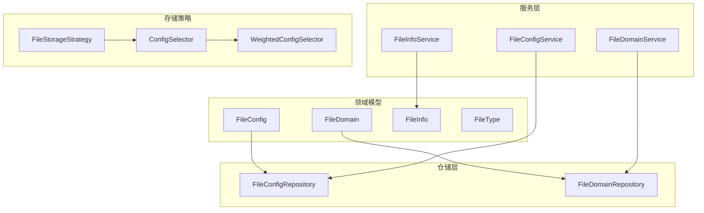
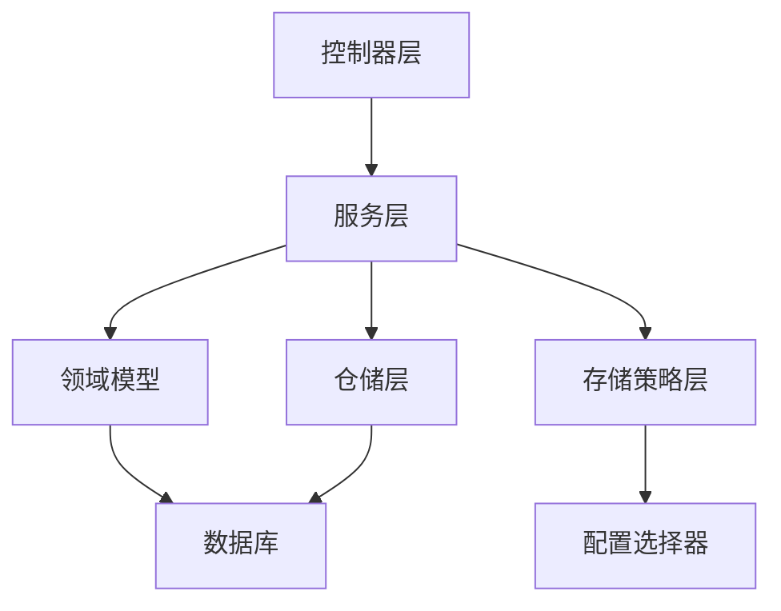
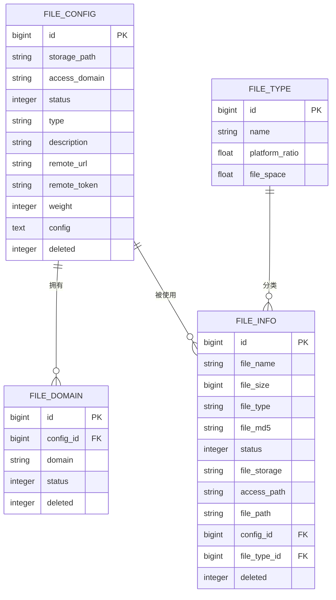
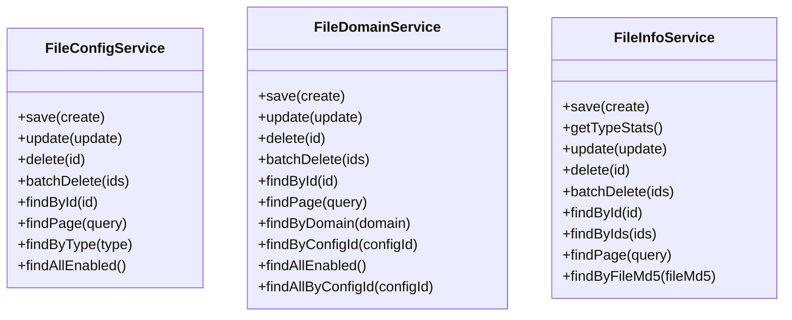
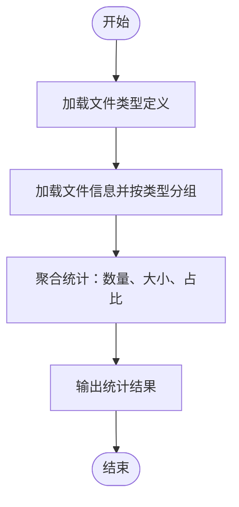
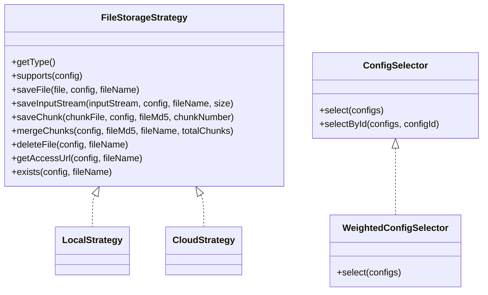
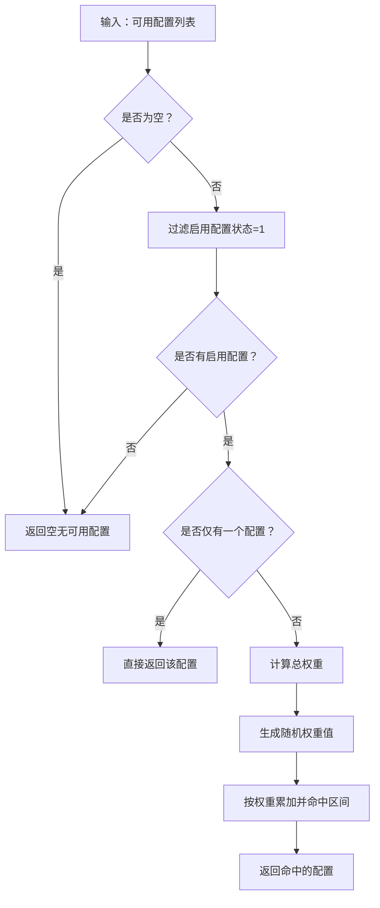
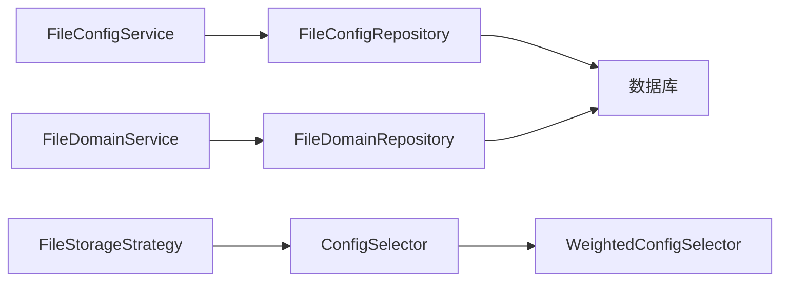

# 文件配置管理

<cite>
**本文引用的文件**
- [FileConfig.java](file://file-module/src/main/java/com/fastproject/file/domain/FileConfig.java)
- [FileDomain.java](file://file-module/src/main/java/com/fastproject/file/domain/FileDomain.java)
- [FileInfo.java](file://file-module/src/main/java/com/fastproject/file/domain/FileInfo.java)
- [FileType.java](file://file-module/src/main/java/com/fastproject/file/domain/FileType.java)
- [FileConfigService.java](file://file-module/src/main/java/com/fastproject/file/service/FileConfigService.java)
- [FileDomainService.java](file://file-module/src/main/java/com/fastproject/file/service/FileDomainService.java)
- [FileInfoService.java](file://file-module/src/main/java/com/fastproject/file/service/FileInfoService.java)
- [FileConfigRepository.java](file://file-module/src/main/java/com/fastproject/file/repository/db/FileConfigRepository.java)
- [FileDomainRepository.java](file://file-module/src/main/java/com/fastproject/file/repository/db/FileDomainRepository.java)
- [FileStorageStrategy.java](file://file-module/src/main/java/com/fastproject/file/storage/FileStorageStrategy.java)
- [ConfigSelector.java](file://file-module/src/main/java/com/fastproject/file/storage/ConfigSelector.java)
- [WeightedConfigSelector.java](file://file-module/src/main/java/com/fastproject/file/storage/WeightedConfigSelector.java)
</cite>

## 目录
1. [简介](#简介)
2. [项目结构](#项目结构)
3. [核心组件](#核心组件)
4. [架构总览](#架构总览)
5. [详细组件分析](#详细组件分析)
6. [依赖分析](#依赖分析)
7. [性能考虑](#性能考虑)
8. [故障排查指南](#故障排查指南)
9. [结论](#结论)
10. [附录](#附录)

## 简介
本文件配置管理子系统围绕“文件配置”“文件域名”“文件信息”“文件类型”四大核心实体展开，提供配置管理服务的完整能力，包括增删改查、分页查询、按类型/域名检索、启用配置筛选等；同时提供文件类型统计与存储策略选择机制，支撑本地与多种云存储的统一接入。

## 项目结构
- 领域模型层：FileConfig、FileDomain、FileInfo、FileType 四个实体，均继承通用基类并采用软删除注解，确保数据安全与审计可追溯。
- 仓储层：FileConfigRepository、FileDomainRepository 提供基于 JPA 的查询扩展，支持按状态排序、按类型/域名唯一性校验等。
- 服务层：FileConfigService、FileDomainService、FileInfoService 定义对外接口，封装业务规则与事务边界。
- 存储策略层：FileStorageStrategy 抽象统一的存储接口，ConfigSelector 与 WeightedConfigSelector 实现多配置选择与加权随机选择。
- 控制器层：通过模块化控制器调用服务层，完成对外 API 的暴露（本节不展开具体控制器代码）。

**图表来源**
- [FileConfig.java](file://file-module/src/main/java/com/fastproject/file/domain/FileConfig.java#L12-L65)
- [FileDomain.java](file://file-module/src/main/java/com/fastproject/file/domain/FileDomain.java#L11-L34)
- [FileInfo.java](file://file-module/src/main/java/com/fastproject/file/domain/FileInfo.java#L12-L78)
- [FileType.java](file://file-module/src/main/java/com/fastproject/file/domain/FileType.java#L11-L35)
- [FileConfigRepository.java](file://file-module/src/main/java/com/fastproject/file/repository/db/FileConfigRepository.java#L14-L35)
- [FileDomainRepository.java](file://file-module/src/main/java/com/fastproject/file/repository/db/FileDomainRepository.java#L14-L42)
- [FileConfigService.java](file://file-module/src/main/java/com/fastproject/file/service/FileConfigService.java#L14-L55)
- [FileDomainService.java](file://file-module/src/main/java/com/fastproject/file/service/FileDomainService.java#L14-L66)
- [FileInfoService.java](file://file-module/src/main/java/com/fastproject/file/service/FileInfoService.java#L15-L61)
- [FileStorageStrategy.java](file://file-module/src/main/java/com/fastproject/file/storage/FileStorageStrategy.java#L14-L104)
- [ConfigSelector.java](file://file-module/src/main/java/com/fastproject/file/storage/ConfigSelector.java#L11-L37)
- [WeightedConfigSelector.java](file://file-module/src/main/java/com/fastproject/file/storage/WeightedConfigSelector.java#L17-L64)

**章节来源**
- [FileConfig.java](file://file-module/src/main/java/com/fastproject/file/domain/FileConfig.java#L12-L65)
- [FileDomain.java](file://file-module/src/main/java/com/fastproject/file/domain/FileDomain.java#L11-L34)
- [FileInfo.java](file://file-module/src/main/java/com/fastproject/file/domain/FileInfo.java#L12-L78)
- [FileType.java](file://file-module/src/main/java/com/fastproject/file/domain/FileType.java#L11-L35)
- [FileConfigRepository.java](file://file-module/src/main/java/com/fastproject/file/repository/db/FileConfigRepository.java#L14-L35)
- [FileDomainRepository.java](file://file-module/src/main/java/com/fastproject/file/repository/db/FileDomainRepository.java#L14-L42)
- [FileConfigService.java](file://file-module/src/main/java/com/fastproject/file/service/FileConfigService.java#L14-L55)
- [FileDomainService.java](file://file-module/src/main/java/com/fastproject/file/service/FileDomainService.java#L14-L66)
- [FileInfoService.java](file://file-module/src/main/java/com/fastproject/file/service/FileInfoService.java#L15-L61)
- [FileStorageStrategy.java](file://file-module/src/main/java/com/fastproject/file/storage/FileStorageStrategy.java#L14-L104)
- [ConfigSelector.java](file://file-module/src/main/java/com/fastproject/file/storage/ConfigSelector.java#L11-L37)
- [WeightedConfigSelector.java](file://file-module/src/main/java/com/fastproject/file/storage/WeightedConfigSelector.java#L17-L64)

## 核心组件
- FileConfig：文件配置实体，记录存储路径、访问域名、类型（本地/远程）、远程凭证、权重、状态、描述及扩展配置等字段，支持按类型唯一性校验与按权重降序查询。
- FileDomain：文件域名实体，关联配置ID，记录域名与状态，支持按域名唯一性校验、按配置ID查询域名列表、按状态排序查询。
- FileInfo：文件信息实体，记录文件名、大小、类型、MD5、状态、存储位置、访问路径、物理路径、配置ID与类型ID等，支持按MD5查询、分页查询、批量删除等。
- FileType：文件类型实体，记录类型名称、平台占比、文件空间等，用于文件类型统计与空间管理。
- 服务接口：FileConfigService、FileDomainService、FileInfoService 提供标准 CRUD、分页、条件查询与统计等能力。
- 存储策略：FileStorageStrategy 统一抽象存储接口；ConfigSelector 与 WeightedConfigSelector 实现配置选择与加权随机选择。

**章节来源**
- [FileConfig.java](file://file-module/src/main/java/com/fastproject/file/domain/FileConfig.java#L18-L65)
- [FileDomain.java](file://file-module/src/main/java/com/fastproject/file/domain/FileDomain.java#L17-L34)
- [FileInfo.java](file://file-module/src/main/java/com/fastproject/file/domain/FileInfo.java#L18-L78)
- [FileType.java](file://file-module/src/main/java/com/fastproject/file/domain/FileType.java#L17-L35)
- [FileConfigService.java](file://file-module/src/main/java/com/fastproject/file/service/FileConfigService.java#L14-L55)
- [FileDomainService.java](file://file-module/src/main/java/com/fastproject/file/service/FileDomainService.java#L14-L66)
- [FileInfoService.java](file://file-module/src/main/java/com/fastproject/file/service/FileInfoService.java#L15-L61)
- [FileStorageStrategy.java](file://file-module/src/main/java/com/fastproject/file/storage/FileStorageStrategy.java#L14-L104)
- [ConfigSelector.java](file://file-module/src/main/java/com/fastproject/file/storage/ConfigSelector.java#L11-L37)
- [WeightedConfigSelector.java](file://file-module/src/main/java/com/fastproject/file/storage/WeightedConfigSelector.java#L17-L64)

## 架构总览
下图展示文件配置管理的高层架构：控制器通过服务层调用仓储层持久化，存储策略与配置选择器为上传与访问路径解析提供统一抽象。

**图表来源**
- [FileConfigService.java](file://file-module/src/main/java/com/fastproject/file/service/FileConfigService.java#L14-L55)
- [FileDomainService.java](file://file-module/src/main/java/com/fastproject/file/service/FileDomainService.java#L14-L66)
- [FileInfoService.java](file://file-module/src/main/java/com/fastproject/file/service/FileInfoService.java#L15-L61)
- [FileConfigRepository.java](file://file-module/src/main/java/com/fastproject/file/repository/db/FileConfigRepository.java#L14-L35)
- [FileDomainRepository.java](file://file-module/src/main/java/com/fastproject/file/repository/db/FileDomainRepository.java#L14-L42)
- [FileStorageStrategy.java](file://file-module/src/main/java/com/fastproject/file/storage/FileStorageStrategy.java#L14-L104)
- [ConfigSelector.java](file://file-module/src/main/java/com/fastproject/file/storage/ConfigSelector.java#L11-L37)
- [WeightedConfigSelector.java](file://file-module/src/main/java/com/fastproject/file/storage/WeightedConfigSelector.java#L17-L64)

## 详细组件分析

### 数据模型设计与业务含义
- FileConfig（文件配置）
  - 字段要点：存储路径、访问域名、状态、类型（本地/远程）、描述、远程URL、远程上传凭证、权重、扩展配置。
  - 约束关系：按类型唯一性校验，支持按状态排序与按权重降序查询，权重用于多配置选择时的优先级。
  - 业务规则：软删除，启用状态为1；远程配置需提供凭证与URL；权重越大优先级越高。
- FileDomain（文件域名）
  - 字段要点：配置ID、域名、状态。
  - 约束关系：按域名唯一性校验，支持按配置ID查询域名列表，按状态排序。
  - 业务规则：软删除；启用状态为1；域名与配置ID构成业务关联。
- FileInfo（文件信息）
  - 字段要点：文件名、大小、类型、MD5、状态、存储位置、访问路径、物理路径、配置ID、类型ID。
  - 约束关系：支持按MD5查询、分页查询、批量删除；物理路径长度较大，适配复杂目录结构。
  - 业务规则：软删除；状态字段控制文件可用性；配置ID与类型ID关联配置与类型。
- FileType（文件类型）
  - 字段要点：名称、平台占比、文件空间。
  - 约束关系：用于统计与空间管理，支持按名称查询。
  - 业务规则：平台占比与文件空间用于统计分析与容量规划。

**图表来源**
- [FileConfig.java](file://file-module/src/main/java/com/fastproject/file/domain/FileConfig.java#L18-L65)
- [FileDomain.java](file://file-module/src/main/java/com/fastproject/file/domain/FileDomain.java#L17-L34)
- [FileInfo.java](file://file-module/src/main/java/com/fastproject/file/domain/FileInfo.java#L18-L78)
- [FileType.java](file://file-module/src/main/java/com/fastproject/file/domain/FileType.java#L17-L35)

**章节来源**
- [FileConfig.java](file://file-module/src/main/java/com/fastproject/file/domain/FileConfig.java#L18-L65)
- [FileDomain.java](file://file-module/src/main/java/com/fastproject/file/domain/FileDomain.java#L17-L34)
- [FileInfo.java](file://file-module/src/main/java/com/fastproject/file/domain/FileInfo.java#L18-L78)
- [FileType.java](file://file-module/src/main/java/com/fastproject/file/domain/FileType.java#L17-L35)

### 配置管理服务实现机制
- FileConfigService
  - 能力：新增、修改、删除、批量删除、按ID查询、分页查询、按类型查询、查询所有启用配置。
  - 查询优化：按状态排序与按权重降序查询，便于前端快速获取默认配置。
  - 缓存策略：未见显式缓存实现，建议对“按类型查询”结果进行短期缓存以降低数据库压力。
- FileDomainService
  - 能力：新增、修改、删除、批量删除、按ID查询、分页查询、按域名查询、按配置ID查询域名列表、查询所有启用域名。
  - 查询优化：按状态排序，域名唯一性校验，避免重复配置。
- FileInfoService
  - 能力：新增、类型统计、修改、删除、批量删除、按ID查询、按ID列表批量查询、分页查询、按MD5查询。
  - 统计能力：getTypeStats 返回文件类型统计，用于报表与容量分析。

**图表来源**
- [FileConfigService.java](file://file-module/src/main/java/com/fastproject/file/service/FileConfigService.java#L14-L55)
- [FileDomainService.java](file://file-module/src/main/java/com/fastproject/file/service/FileDomainService.java#L14-L66)
- [FileInfoService.java](file://file-module/src/main/java/com/fastproject/file/service/FileInfoService.java#L15-L61)

**章节来源**
- [FileConfigService.java](file://file-module/src/main/java/com/fastproject/file/service/FileConfigService.java#L14-L55)
- [FileDomainService.java](file://file-module/src/main/java/com/fastproject/file/service/FileDomainService.java#L14-L66)
- [FileInfoService.java](file://file-module/src/main/java/com/fastproject/file/service/FileInfoService.java#L15-L61)

### 文件类型统计功能
- 统计入口：FileInfoService.getTypeStats 提供文件类型统计。
- 统计对象：结合 FileType 名称与 FileInfo 的类型字段进行聚合。
- 输出形态：返回类型统计视图对象列表，便于前端展示占比与空间占用。

**图表来源**
- [FileInfoService.java](file://file-module/src/main/java/com/fastproject/file/service/FileInfoService.java#L24-L25)
- [FileType.java](file://file-module/src/main/java/com/fastproject/file/domain/FileType.java#L17-L35)
- [FileInfo.java](file://file-module/src/main/java/com/fastproject/file/domain/FileInfo.java#L18-L78)

**章节来源**
- [FileInfoService.java](file://file-module/src/main/java/com/fastproject/file/service/FileInfoService.java#L24-L25)
- [FileType.java](file://file-module/src/main/java/com/fastproject/file/domain/FileType.java#L17-L35)
- [FileInfo.java](file://file-module/src/main/java/com/fastproject/file/domain/FileInfo.java#L18-L78)

### 存储策略与配置选择
- FileStorageStrategy：统一抽象本地与云存储的保存、删除、存在性检查、访问URL生成等能力。
- ConfigSelector：定义配置选择接口，默认提供按ID选择的便捷方法。
- WeightedConfigSelector：基于权重的随机选择算法，优先选择启用配置，权重越大被选中概率越高。

**图表来源**
- [FileStorageStrategy.java](file://file-module/src/main/java/com/fastproject/file/storage/FileStorageStrategy.java#L14-L104)
- [ConfigSelector.java](file://file-module/src/main/java/com/fastproject/file/storage/ConfigSelector.java#L11-L37)
- [WeightedConfigSelector.java](file://file-module/src/main/java/com/fastproject/file/storage/WeightedConfigSelector.java#L17-L64)

**章节来源**
- [FileStorageStrategy.java](file://file-module/src/main/java/com/fastproject/file/storage/FileStorageStrategy.java#L14-L104)
- [ConfigSelector.java](file://file-module/src/main/java/com/fastproject/file/storage/ConfigSelector.java#L11-L37)
- [WeightedConfigSelector.java](file://file-module/src/main/java/com/fastproject/file/storage/WeightedConfigSelector.java#L17-L64)

### 配置选择流程（加权随机）

**图表来源**
- [WeightedConfigSelector.java](file://file-module/src/main/java/com/fastproject/file/storage/WeightedConfigSelector.java#L21-L64)

**章节来源**
- [WeightedConfigSelector.java](file://file-module/src/main/java/com/fastproject/file/storage/WeightedConfigSelector.java#L21-L64)

### API 接口规范（配置管理）
以下为配置管理相关接口的规范说明（以服务接口为准），具体控制器实现由模块化控制器调用对应服务。

- 创建文件配置
  - 方法：POST（由控制器映射）
  - 参数：FileConfigCreate
  - 返回：Long（配置ID）
  - 业务规则：类型唯一性校验，远程配置需提供凭证与URL，权重默认为较小值或按需设置。
- 更新文件配置
  - 方法：PUT（由控制器映射）
  - 参数：FileConfigUpdate
  - 返回：void
  - 业务规则：类型唯一性校验（排除自身ID），远程配置更新需同步凭证与URL。
- 删除文件配置
  - 方法：DELETE（由控制器映射）
  - 参数：Long（配置ID）
  - 返回：void
  - 业务规则：软删除，不影响已关联文件信息。
- 批量删除文件配置
  - 方法：DELETE（由控制器映射）
  - 参数：List<Long>
  - 返回：void
- 查询文件配置详情
  - 方法：GET（由控制器映射）
  - 参数：Long（配置ID）
  - 返回：FileConfigVo
- 分页查询文件配置
  - 方法：GET（由控制器映射）
  - 参数：FileConfigQuery
  - 返回：PageVo<List<FileConfigVo>>
  - 业务规则：支持按状态排序与按权重降序查询。
- 按类型查询文件配置
  - 方法：GET（由控制器映射）
  - 参数：String（类型）
  - 返回：FileConfigVo
  - 业务规则：用于快速定位默认或指定类型的存储配置。
- 查询所有启用的文件配置
  - 方法：GET（由控制器映射）
  - 返回：List<FileConfigVo>
  - 业务规则：按权重降序排列，便于前端选择默认配置。

- 创建文件域名
  - 方法：POST（由控制器映射）
  - 参数：FileDomainCreate
  - 返回：Long（域名ID）
  - 业务规则：域名唯一性校验，状态为启用时生效。
- 更新文件域名
  - 方法：PUT（由控制器映射）
  - 参数：FileDomainUpdate
  - 返回：void
- 删除文件域名
  - 方法：DELETE（由控制器映射）
  - 参数：Long（域名ID）
  - 返回：void
- 批量删除文件域名
  - 方法：DELETE（由控制器映射）
  - 参数：List<Long>
  - 返回：void
- 查询文件域名详情
  - 方法：GET（由控制器映射）
  - 参数：Long（域名ID）
  - 返回：FileDomainVo
- 分页查询文件域名
  - 方法：GET（由控制器映射）
  - 参数：FileDomainQuery
  - 返回：PageVo<List<FileDomainVo>>
- 按域名查询文件域名
  - 方法：GET（由控制器映射）
  - 参数：String（域名）
  - 返回：FileDomainVo
- 按配置ID查询域名列表
  - 方法：GET（由控制器映射）
  - 参数：Long（配置ID）
  - 返回：List<FileDomainVo>
- 查询所有启用的域名
  - 方法：GET（由控制器映射）
  - 返回：List<FileDomainVo>
- 按配置ID查询域名列表（含状态）
  - 方法：GET（由控制器映射）
  - 参数：Long（配置ID）
  - 返回：List<FileDomainVo>

- 新增文件信息
  - 方法：POST（由控制器映射）
  - 参数：FileInfoCreate
  - 返回：Long（文件ID）
- 获取文件类型统计
  - 方法：GET（由控制器映射）
  - 返回：List<FileTypeStatVo>
- 修改文件信息
  - 方法：PUT（由控制器映射）
  - 参数：FileInfoUpdate
  - 返回：void
- 删除文件信息
  - 方法：DELETE（由控制器映射）
  - 参数：Long（文件ID）
  - 返回：void
- 批量删除文件信息
  - 方法：DELETE（由控制器映射）
  - 参数：List<Long>
  - 返回：void
- 按ID查询文件信息
  - 方法：GET（由控制器映射）
  - 参数：Long（文件ID）
  - 返回：FileInfoVo
- 按ID列表批量查询文件信息
  - 方法：GET（由控制器映射）
  - 参数：List<Long>
  - 返回：List<FileInfoVo>
- 分页查询文件信息
  - 方法：GET（由控制器映射）
  - 参数：FileInfoQuery
  - 返回：PageVo<List<FileInfoVo>>
- 按MD5查询文件信息
  - 方法：GET（由控制器映射）
  - 参数：String（文件MD5）
  - 返回：FileInfoVo

**章节来源**
- [FileConfigService.java](file://file-module/src/main/java/com/fastproject/file/service/FileConfigService.java#L14-L55)
- [FileDomainService.java](file://file-module/src/main/java/com/fastproject/file/service/FileDomainService.java#L14-L66)
- [FileInfoService.java](file://file-module/src/main/java/com/fastproject/file/service/FileInfoService.java#L15-L61)

## 依赖分析
- FileConfigRepository 与 FileDomainRepository 基于 JPA Specification 扩展查询，提供类型/域名唯一性校验与状态排序能力。
- 服务层通过仓储层实现业务逻辑，避免直接操作数据库。
- 存储策略与配置选择器解耦上传与访问路径解析，便于扩展新的存储后端与选择策略。

**图表来源**
- [FileConfigRepository.java](file://file-module/src/main/java/com/fastproject/file/repository/db/FileConfigRepository.java#L14-L35)
- [FileDomainRepository.java](file://file-module/src/main/java/com/fastproject/file/repository/db/FileDomainRepository.java#L14-L42)
- [FileStorageStrategy.java](file://file-module/src/main/java/com/fastproject/file/storage/FileStorageStrategy.java#L14-L104)
- [ConfigSelector.java](file://file-module/src/main/java/com/fastproject/file/storage/ConfigSelector.java#L11-L37)
- [WeightedConfigSelector.java](file://file-module/src/main/java/com/fastproject/file/storage/WeightedConfigSelector.java#L17-L64)

**章节来源**
- [FileConfigRepository.java](file://file-module/src/main/java/com/fastproject/file/repository/db/FileConfigRepository.java#L14-L35)
- [FileDomainRepository.java](file://file-module/src/main/java/com/fastproject/file/repository/db/FileDomainRepository.java#L14-L42)
- [FileStorageStrategy.java](file://file-module/src/main/java/com/fastproject/file/storage/FileStorageStrategy.java#L14-L104)
- [ConfigSelector.java](file://file-module/src/main/java/com/fastproject/file/storage/ConfigSelector.java#L11-L37)
- [WeightedConfigSelector.java](file://file-module/src/main/java/com/fastproject/file/storage/WeightedConfigSelector.java#L17-L64)

## 性能考虑
- 查询优化
  - 对 FileConfig 与 FileDomain 的按状态排序与按权重降序查询，减少前端二次处理。
  - 对类型/域名唯一性校验使用 exists 接口，避免不必要的对象加载。
- 缓存策略
  - 对“按类型查询配置”与“按域名查询域名”结果进行短期缓存，降低热点查询压力。
  - 对“启用配置/域名列表”进行缓存，配合定时刷新策略。
- 存储策略
  - 使用 WeightedConfigSelector 在多配置场景下实现负载均衡与优先级控制。
  - 对大文件分片上传，合理设置分片大小与合并策略，避免频繁IO。
- 统计性能
  - 文件类型统计建议按天/周聚合，避免全表扫描；必要时引入物化视图或定时任务预计算。

[本节为通用性能建议，无需特定文件来源]

## 故障排查指南
- 配置无法生效
  - 检查状态字段是否为启用（1），权重是否合理。
  - 确认远程配置的凭证与URL是否正确。
- 域名冲突
  - 使用域名唯一性校验接口确认是否存在重复域名。
- 文件无法访问
  - 检查访问路径与存储位置是否一致，确认存储策略是否正确选择。
- 统计异常
  - 核对文件类型字段与类型ID是否匹配，确认统计聚合逻辑是否正确。

**章节来源**
- [FileConfig.java](file://file-module/src/main/java/com/fastproject/file/domain/FileConfig.java#L18-L65)
- [FileDomain.java](file://file-module/src/main/java/com/fastproject/file/domain/FileDomain.java#L17-L34)
- [FileInfo.java](file://file-module/src/main/java/com/fastproject/file/domain/FileInfo.java#L18-L78)
- [FileStorageStrategy.java](file://file-module/src/main/java/com/fastproject/file/storage/FileStorageStrategy.java#L14-L104)

## 结论
本文件配置管理子系统通过清晰的领域模型、完善的仓储与服务接口、可扩展的存储策略与配置选择机制，实现了对文件配置、域名、文件信息与类型的统一管理与高效统计。建议在生产环境中结合缓存与聚合策略进一步提升性能与稳定性。

[本节为总结性内容，无需特定文件来源]

## 附录
- 最佳实践
  - 配置管理：统一通过服务层进行CRUD与查询，避免绕过业务规则。
  - 域名管理：严格进行唯一性校验，启用状态与配置ID强关联。
  - 文件信息：按MD5去重，合理设置存储路径与访问路径，便于后续清理与迁移。
  - 统计分析：定期聚合统计，结合平台占比与空间占用制定容量规划。
- 常见问题
  - 配置未生效：检查状态与权重，确认远程凭证。
  - 域名冲突：使用唯一性校验接口排查。
  - 文件不可访问：核对访问URL与存储策略选择。
  - 统计不准：核对类型字段与聚合逻辑。

[本节为通用建议，无需特定文件来源]