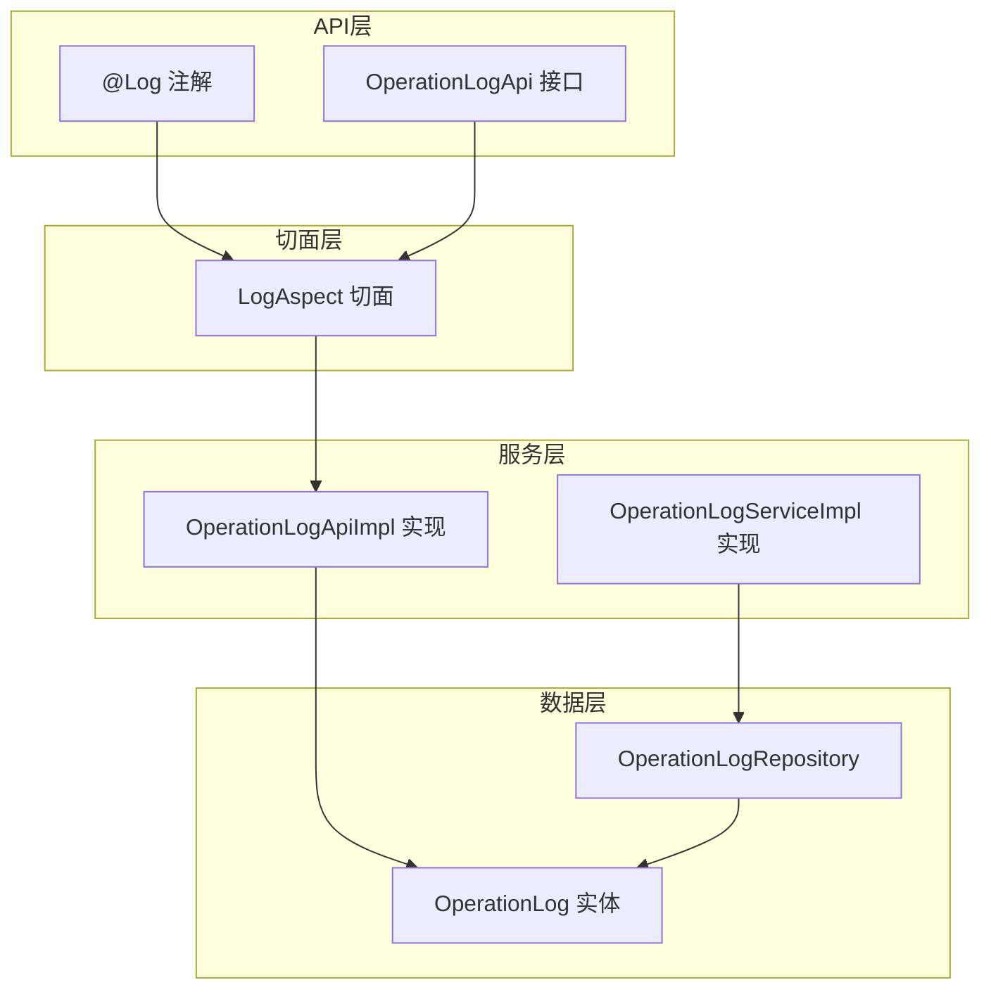
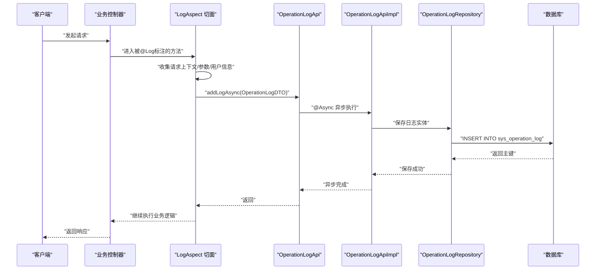
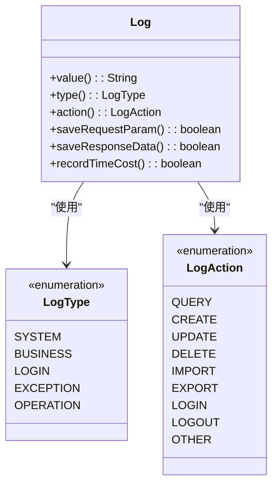
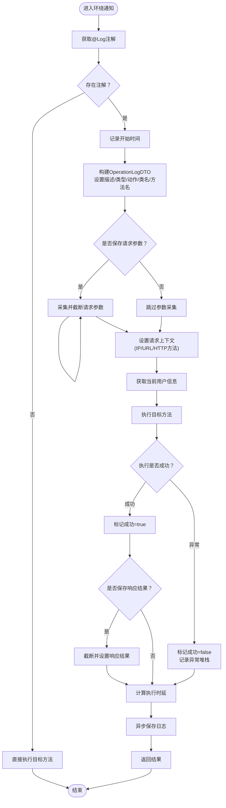
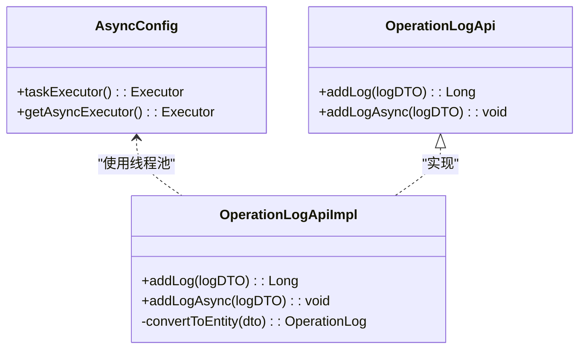
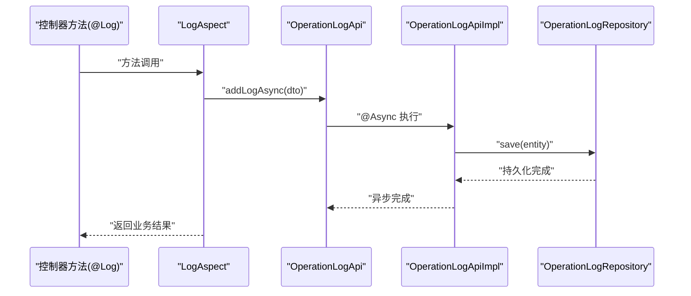
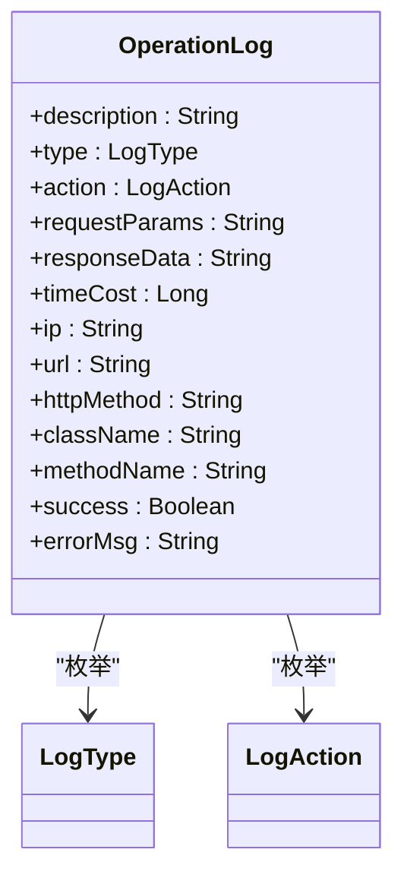
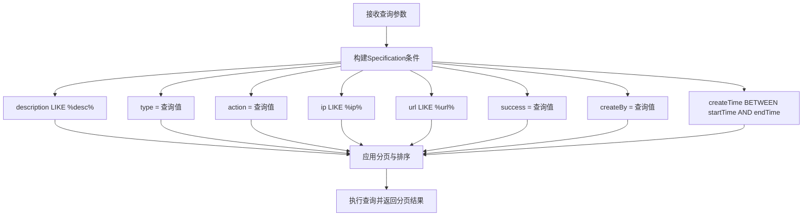
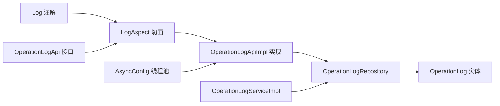

# 日志管理模块

<cite>
**本文档引用的文件**
- [Log.java](file://logs-api/src/main/java/com/fastproject/logs/annotation/Log.java)
- [LogAspect.java](file://logs-api/src/main/java/com/fastproject/logs/aspect/LogAspect.java)
- [LogType.java](file://logs-api/src/main/java/com/fastproject/logs/enums/LogType.java)
- [LogAction.java](file://logs-api/src/main/java/com/fastproject/logs/enums/LogAction.java)
- [OperationLogDTO.java](file://logs-api/src/main/java/com/fastproject/logs/dto/OperationLogDTO.java)
- [OperationLogApi.java](file://logs-api/src/main/java/com/fastproject/logs/api/OperationLogApi.java)
- [OperationLogApiImpl.java](file://logs-module/src/main/java/com/fastproject/logs/service/impl/OperationLogApiImpl.java)
- [OperationLogServiceImpl.java](file://logs-module/src/main/java/com/fastproject/logs/service/impl/OperationLogServiceImpl.java)
- [OperationLog.java](file://logs-module/src/main/java/com/fastproject/logs/domain/OperationLog.java)
- [OperationLogRepository.java](file://logs-module/src/main/java/com/fastproject/logs/repository/OperationLogRepository.java)
- [OperationLogQuery.java](file://logs-module/src/main/java/com/fastproject/logs/vo/OperationLogQuery.java)
- [OperationLogVo.java](file://logs-module/src/main/java/com/fastproject/logs/vo/OperationLogVo.java)
- [AsyncConfig.java](file://common/src/main/java/com/fastproject/config/AsyncConfig.java)
</cite>

## 目录
1. [简介](#简介)
2. [项目结构](#项目结构)
3. [核心组件](#核心组件)
4. [架构总览](#架构总览)
5. [详细组件分析](#详细组件分析)
6. [依赖关系分析](#依赖关系分析)
7. [性能考虑](#性能考虑)
8. [故障排查指南](#故障排查指南)
9. [结论](#结论)
10. [附录](#附录)

## 简介
本模块提供基于注解的统一日志记录能力，通过AOP切面自动采集请求上下文、操作人信息与执行时延，并以异步方式落库，兼顾性能与可观测性。支持多种日志类型与操作动作分类，提供完善的查询统计能力，并内置安全脱敏策略，满足审计追踪与合规要求。

## 项目结构
日志管理模块采用分层设计：
- API层：定义对外接口（OperationLogApi）与注解（@Log）
- 切面层：通过LogAspect拦截带@Log的方法，构建OperationLogDTO并异步提交
- 服务层：OperationLogApiImpl负责异步持久化；OperationLogServiceImpl提供查询与统计
- 数据层：OperationLog实体映射数据库表sys_operation_log，Repository提供数据访问

**图表来源**
- [Log.java](file://logs-api/src/main/java/com/fastproject/logs/annotation/Log.java#L1-L46)
- [OperationLogApi.java](file://logs-api/src/main/java/com/fastproject/logs/api/OperationLogApi.java#L1-L25)
- [LogAspect.java](file://logs-api/src/main/java/com/fastproject/logs/aspect/LogAspect.java#L1-L242)
- [OperationLogApiImpl.java](file://logs-module/src/main/java/com/fastproject/logs/service/impl/OperationLogApiImpl.java#L1-L70)
- [OperationLogServiceImpl.java](file://logs-module/src/main/java/com/fastproject/logs/service/impl/OperationLogServiceImpl.java#L1-L125)
- [OperationLog.java](file://logs-module/src/main/java/com/fastproject/logs/domain/OperationLog.java#L1-L93)
- [OperationLogRepository.java](file://logs-module/src/main/java/com/fastproject/logs/repository/OperationLogRepository.java#L1-L14)

**章节来源**
- [Log.java](file://logs-api/src/main/java/com/fastproject/logs/annotation/Log.java#L1-L46)
- [OperationLogApi.java](file://logs-api/src/main/java/com/fastproject/logs/api/OperationLogApi.java#L1-L25)
- [LogAspect.java](file://logs-api/src/main/java/com/fastproject/logs/aspect/LogAspect.java#L1-L242)
- [OperationLogApiImpl.java](file://logs-module/src/main/java/com/fastproject/logs/service/impl/OperationLogApiImpl.java#L1-L70)
- [OperationLogServiceImpl.java](file://logs-module/src/main/java/com/fastproject/logs/service/impl/OperationLogServiceImpl.java#L1-L125)
- [OperationLog.java](file://logs-module/src/main/java/com/fastproject/logs/domain/OperationLog.java#L1-L93)
- [OperationLogRepository.java](file://logs-module/src/main/java/com/fastproject/logs/repository/OperationLogRepository.java#L1-L14)

## 核心组件
- @Log注解：声明式标注，控制日志描述、类型、动作、是否保存请求/响应参数、是否记录耗时等
- LogAspect切面：环绕通知收集请求上下文、操作人、异常堆栈、执行时延，并异步提交
- OperationLogApi：对外暴露同步/异步写入接口
- OperationLogApiImpl：异步实现，使用线程池执行持久化
- OperationLogServiceImpl：提供分页查询、条件过滤、统计等能力
- OperationLog实体：映射sys_operation_log表，字段覆盖请求上下文、执行结果与审计信息

**章节来源**
- [Log.java](file://logs-api/src/main/java/com/fastproject/logs/annotation/Log.java#L1-L46)
- [LogAspect.java](file://logs-api/src/main/java/com/fastproject/logs/aspect/LogAspect.java#L1-L242)
- [OperationLogApi.java](file://logs-api/src/main/java/com/fastproject/logs/api/OperationLogApi.java#L1-L25)
- [OperationLogApiImpl.java](file://logs-module/src/main/java/com/fastproject/logs/service/impl/OperationLogApiImpl.java#L1-L70)
- [OperationLogServiceImpl.java](file://logs-module/src/main/java/com/fastproject/logs/service/impl/OperationLogServiceImpl.java#L1-L125)
- [OperationLog.java](file://logs-module/src/main/java/com/fastproject/logs/domain/OperationLog.java#L1-L93)

## 架构总览
下图展示从控制器到持久化的完整链路，以及异步写入策略：

**图表来源**
- [LogAspect.java](file://logs-api/src/main/java/com/fastproject/logs/aspect/LogAspect.java#L47-L119)
- [OperationLogApi.java](file://logs-api/src/main/java/com/fastproject/logs/api/OperationLogApi.java#L17-L24)
- [OperationLogApiImpl.java](file://logs-module/src/main/java/com/fastproject/logs/service/impl/OperationLogApiImpl.java#L38-L41)
- [OperationLogRepository.java](file://logs-module/src/main/java/com/fastproject/logs/repository/OperationLogRepository.java#L1-L14)
- [OperationLog.java](file://logs-module/src/main/java/com/fastproject/logs/domain/OperationLog.java#L1-L93)

## 详细组件分析

### 注解式日志记录系统
- 设计要点
  - 使用@Log标注在方法上，声明式启用日志采集
  - 支持自定义描述、日志类型、操作动作
  - 可选择是否保存请求参数、响应结果与执行时延
- 关键属性
  - value：日志描述，默认取方法名
  - type：日志类型（系统/业务/登录/异常/操作）
  - action：操作动作（查询/新增/修改/删除/导入/导出/登录/登出/其他）
  - saveRequestParam/saveResponseData：参数与响应的保存开关
  - recordTimeCost：是否记录执行时延

**图表来源**
- [Log.java](file://logs-api/src/main/java/com/fastproject/logs/annotation/Log.java#L15-L46)
- [LogType.java](file://logs-api/src/main/java/com/fastproject/logs/enums/LogType.java#L6-L32)
- [LogAction.java](file://logs-api/src/main/java/com/fastproject/logs/enums/LogAction.java#L6-L52)

**章节来源**
- [Log.java](file://logs-api/src/main/java/com/fastproject/logs/annotation/Log.java#L1-L46)
- [LogType.java](file://logs-api/src/main/java/com/fastproject/logs/enums/LogType.java#L1-L33)
- [LogAction.java](file://logs-api/src/main/java/com/fastproject/logs/enums/LogAction.java#L1-L53)

### 日志切面处理逻辑
- 切点定义：拦截所有带@Log注解的方法
- 环绕通知：在方法前后注入日志采集与异步落库
- 上下文采集：
  - 请求参数：对参数进行截断与安全处理
  - 用户信息：通过TokenUtils获取当前操作人
  - IP地址：兼容多级代理头，取首个有效IP
  - URL/HTTP方法：从请求对象获取
- 异常处理：捕获异常并记录堆栈，同时保持原异常抛出
- 性能指标：可选记录执行时延

**图表来源**
- [LogAspect.java](file://logs-api/src/main/java/com/fastproject/logs/aspect/LogAspect.java#L47-L119)
- [OperationLogDTO.java](file://logs-api/src/main/java/com/fastproject/logs/dto/OperationLogDTO.java#L11-L87)

**章节来源**
- [LogAspect.java](file://logs-api/src/main/java/com/fastproject/logs/aspect/LogAspect.java#L1-L242)
- [OperationLogDTO.java](file://logs-api/src/main/java/com/fastproject/logs/dto/OperationLogDTO.java#L1-L88)

### 异步日志写入策略
- 线程池配置：核心线程2，最大10，队列100，拒绝策略CallerRunsPolicy，优雅关闭等待60秒
- 异步入门：@Async("taskExecutor")标注异步方法
- 写入流程：DTO转实体，Repository持久化，异常记录但不影响主流程

**图表来源**
- [AsyncConfig.java](file://common/src/main/java/com/fastproject/config/AsyncConfig.java#L15-L47)
- [OperationLogApiImpl.java](file://logs-module/src/main/java/com/fastproject/logs/service/impl/OperationLogApiImpl.java#L19-L70)
- [OperationLogApi.java](file://logs-api/src/main/java/com/fastproject/logs/api/OperationLogApi.java#L9-L25)

**章节来源**
- [AsyncConfig.java](file://common/src/main/java/com/fastproject/config/AsyncConfig.java#L1-L48)
- [OperationLogApiImpl.java](file://logs-module/src/main/java/com/fastproject/logs/service/impl/OperationLogApiImpl.java#L1-L70)
- [OperationLogApi.java](file://logs-api/src/main/java/com/fastproject/logs/api/OperationLogApi.java#L1-L25)

### 操作日志自动记录流程
- 控制器方法标注@Log
- 进入LogAspect环绕通知
- 构建OperationLogDTO并异步提交
- 后台线程池执行持久化
- 主流程无阻塞，保证接口性能

**图表来源**
- [LogAspect.java](file://logs-api/src/main/java/com/fastproject/logs/aspect/LogAspect.java#L114-L116)
- [OperationLogApiImpl.java](file://logs-module/src/main/java/com/fastproject/logs/service/impl/OperationLogApiImpl.java#L38-L41)
- [OperationLogRepository.java](file://logs-module/src/main/java/com/fastproject/logs/repository/OperationLogRepository.java#L1-L14)

**章节来源**
- [LogAspect.java](file://logs-api/src/main/java/com/fastproject/logs/aspect/LogAspect.java#L1-L242)
- [OperationLogApiImpl.java](file://logs-module/src/main/java/com/fastproject/logs/service/impl/OperationLogApiImpl.java#L1-L70)

### 日志类型定义与内容格式化
- 日志类型：系统、业务、登录、异常、操作
- 操作动作：查询、新增、修改、删除、导入、导出、登录、登出、其他
- 内容格式化：
  - 请求参数：按位置拼接，单值截断，异常参数标记不可序列化
  - 响应结果：可选截断，避免超长文本
  - 异常堆栈：截断输出，便于检索
  - IP解析：兼容多级代理头，取首个IP
- 存储策略：TEXT字段存储长文本，时间成本以毫秒存储

**图表来源**
- [OperationLog.java](file://logs-module/src/main/java/com/fastproject/logs/domain/OperationLog.java#L21-L93)
- [LogType.java](file://logs-api/src/main/java/com/fastproject/logs/enums/LogType.java#L6-L32)
- [LogAction.java](file://logs-api/src/main/java/com/fastproject/logs/enums/LogAction.java#L6-L52)

**章节来源**
- [OperationLog.java](file://logs-module/src/main/java/com/fastproject/logs/domain/OperationLog.java#L1-L93)
- [LogType.java](file://logs-api/src/main/java/com/fastproject/logs/enums/LogType.java#L1-L33)
- [LogAction.java](file://logs-api/src/main/java/com/fastproject/logs/enums/LogAction.java#L1-L53)

### 日志查询统计与审计追踪
- 查询条件：描述模糊匹配、类型/动作精确匹配、IP/URL过滤、成功与否、创建人、时间范围
- 分页排序：按ID倒序分页
- 审计追踪：结合createBy与时间范围，支持跨模块审计

**图表来源**
- [OperationLogServiceImpl.java](file://logs-module/src/main/java/com/fastproject/logs/service/impl/OperationLogServiceImpl.java#L82-L123)
- [OperationLogQuery.java](file://logs-module/src/main/java/com/fastproject/logs/vo/OperationLogQuery.java#L16-L62)

**章节来源**
- [OperationLogServiceImpl.java](file://logs-module/src/main/java/com/fastproject/logs/service/impl/OperationLogServiceImpl.java#L1-L125)
- [OperationLogQuery.java](file://logs-module/src/main/java/com/fastproject/logs/vo/OperationLogQuery.java#L1-L63)

### 性能监控集成
- 执行时延：可选记录方法耗时，便于性能分析
- 异步写入：避免IO阻塞主业务线程
- 线程池参数：合理配置核心/最大线程、队列容量与拒绝策略，保障峰值稳定性

**章节来源**
- [LogAspect.java](file://logs-api/src/main/java/com/fastproject/logs/aspect/LogAspect.java#L110-L112)
- [AsyncConfig.java](file://common/src/main/java/com/fastproject/config/AsyncConfig.java#L20-L41)

### 安全特性与配置管理
- 敏感信息脱敏：
  - 请求参数与响应结果按长度截断，避免泄露
  - 参数序列化异常时标记不可序列化，防止异常扩散
- 日志级别控制：异步实现中使用DEBUG/ERROR级别记录关键事件
- 配置管理：通过AsyncConfig集中管理线程池，支持扩展与调优

**章节来源**
- [LogAspect.java](file://logs-api/src/main/java/com/fastproject/logs/aspect/LogAspect.java#L152-L175)
- [LogAspect.java](file://logs-api/src/main/java/com/fastproject/logs/aspect/LogAspect.java#L222-L240)
- [OperationLogApiImpl.java](file://logs-module/src/main/java/com/fastproject/logs/service/impl/OperationLogApiImpl.java#L25-L35)
- [AsyncConfig.java](file://common/src/main/java/com/fastproject/config/AsyncConfig.java#L1-L48)

## 依赖关系分析

**图表来源**
- [Log.java](file://logs-api/src/main/java/com/fastproject/logs/annotation/Log.java#L1-L46)
- [LogAspect.java](file://logs-api/src/main/java/com/fastproject/logs/aspect/LogAspect.java#L1-L242)
- [OperationLogApi.java](file://logs-api/src/main/java/com/fastproject/logs/api/OperationLogApi.java#L1-L25)
- [OperationLogApiImpl.java](file://logs-module/src/main/java/com/fastproject/logs/service/impl/OperationLogApiImpl.java#L1-L70)
- [OperationLogRepository.java](file://logs-module/src/main/java/com/fastproject/logs/repository/OperationLogRepository.java#L1-L14)
- [OperationLog.java](file://logs-module/src/main/java/com/fastproject/logs/domain/OperationLog.java#L1-L93)
- [AsyncConfig.java](file://common/src/main/java/com/fastproject/config/AsyncConfig.java#L1-L48)
- [OperationLogServiceImpl.java](file://logs-module/src/main/java/com/fastproject/logs/service/impl/OperationLogServiceImpl.java#L1-L125)

**章节来源**
- [LogAspect.java](file://logs-api/src/main/java/com/fastproject/logs/aspect/LogAspect.java#L1-L242)
- [OperationLogApiImpl.java](file://logs-module/src/main/java/com/fastproject/logs/service/impl/OperationLogApiImpl.java#L1-L70)
- [OperationLogRepository.java](file://logs-module/src/main/java/com/fastproject/logs/repository/OperationLogRepository.java#L1-L14)
- [OperationLog.java](file://logs-module/src/main/java/com/fastproject/logs/domain/OperationLog.java#L1-L93)
- [AsyncConfig.java](file://common/src/main/java/com/fastproject/config/AsyncConfig.java#L1-L48)
- [OperationLogServiceImpl.java](file://logs-module/src/main/java/com/fastproject/logs/service/impl/OperationLogServiceImpl.java#L1-L125)

## 性能考虑
- 异步写入：通过独立线程池避免阻塞主业务线程
- 参数截断：限制请求/响应长度，降低存储与网络开销
- 条件过滤：查询时使用多维条件，减少不必要的扫描
- 线程池调优：根据QPS与峰值合理调整核心线程、队列与拒绝策略

[本节为通用指导，无需列出具体文件来源]

## 故障排查指南
- 异步写入失败
  - 检查线程池配置与拒绝策略
  - 查看异步实现中的错误日志
- 参数序列化异常
  - 观察请求参数采集是否出现“不可序列化”标记
  - 调整saveRequestParam开关或优化参数结构
- IP解析异常
  - 检查代理头配置，确认是否正确传递真实IP
- 查询性能问题
  - 为常用查询字段建立索引，优化时间范围与模糊匹配

**章节来源**
- [AsyncConfig.java](file://common/src/main/java/com/fastproject/config/AsyncConfig.java#L1-L48)
- [OperationLogApiImpl.java](file://logs-module/src/main/java/com/fastproject/logs/service/impl/OperationLogApiImpl.java#L25-L35)
- [LogAspect.java](file://logs-api/src/main/java/com/fastproject/logs/aspect/LogAspect.java#L152-L175)
- [LogAspect.java](file://logs-api/src/main/java/com/fastproject/logs/aspect/LogAspect.java#L180-L202)

## 结论
该日志管理模块通过注解驱动与AOP切面实现了低侵入、高扩展的日志采集与落库能力。异步策略确保了接口性能，完善的查询与审计能力满足运营与合规需求。建议在生产环境中结合业务特点调优线程池参数，并持续关注日志字段的索引与归档策略。

[本节为总结性内容，无需列出具体文件来源]

## 附录

### API接口文档
- OperationLogApi
  - addLog(logDTO): 同步写入，返回日志ID
  - addLogAsync(logDTO): 异步写入，无返回值

**章节来源**
- [OperationLogApi.java](file://logs-api/src/main/java/com/fastproject/logs/api/OperationLogApi.java#L1-L25)

### 使用示例
- 在控制器方法上添加@Log注解，设置描述、类型与动作
- 调用后日志将自动采集并异步落库
- 通过OperationLogServiceImpl提供的查询接口进行检索与统计

**章节来源**
- [Log.java](file://logs-api/src/main/java/com/fastproject/logs/annotation/Log.java#L1-L46)
- [LogAspect.java](file://logs-api/src/main/java/com/fastproject/logs/aspect/LogAspect.java#L1-L242)
- [OperationLogServiceImpl.java](file://logs-module/src/main/java/com/fastproject/logs/service/impl/OperationLogServiceImpl.java#L1-L125)

### 最佳实践
- 对敏感接口关闭saveRequestParam或saveResponseData
- 合理设置recordTimeCost，平衡可观测性与开销
- 为高频查询字段建立索引，优化分页查询
- 结合业务场景选择合适的日志类型与动作

[本节为通用指导，无需列出具体文件来源]