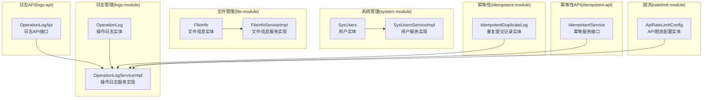
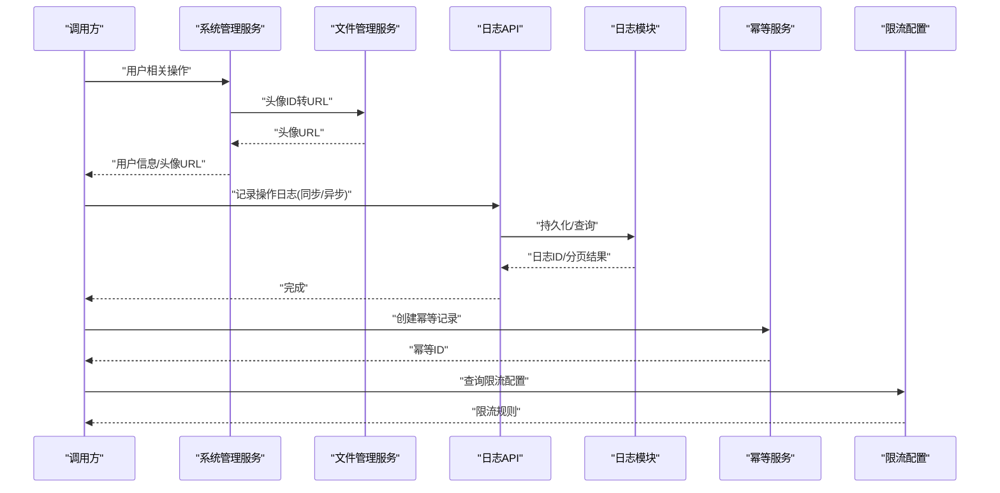
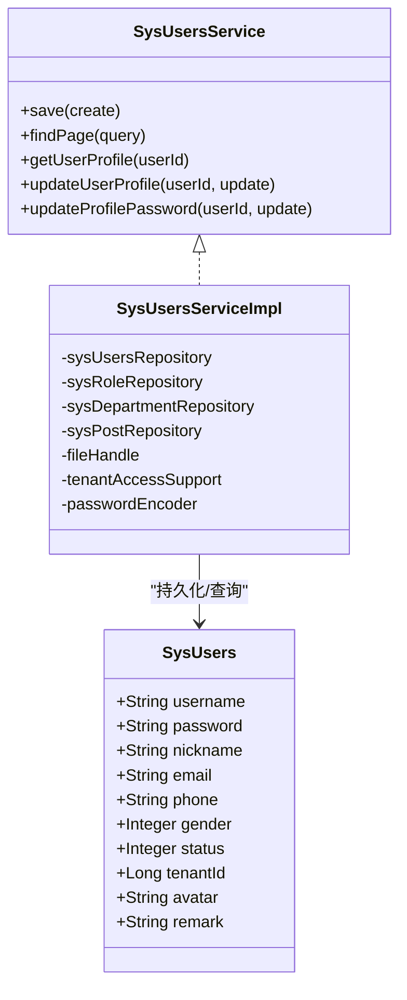
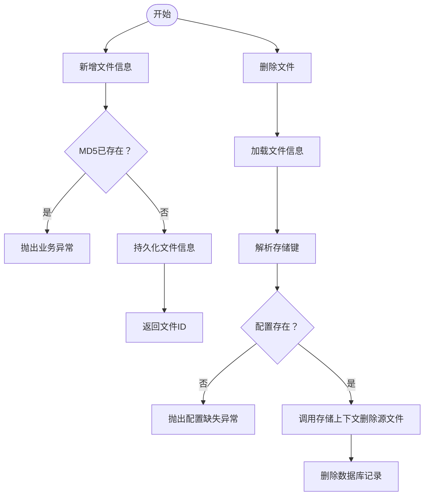
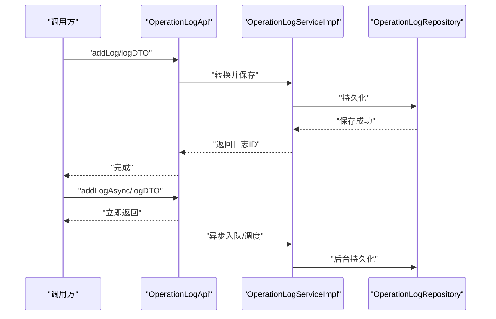
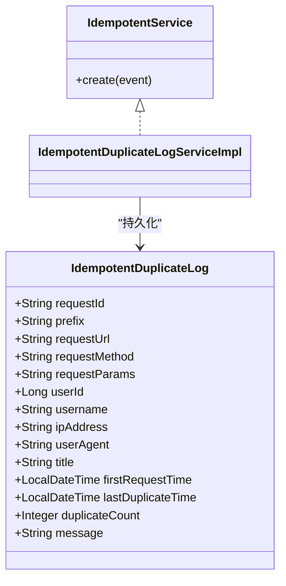
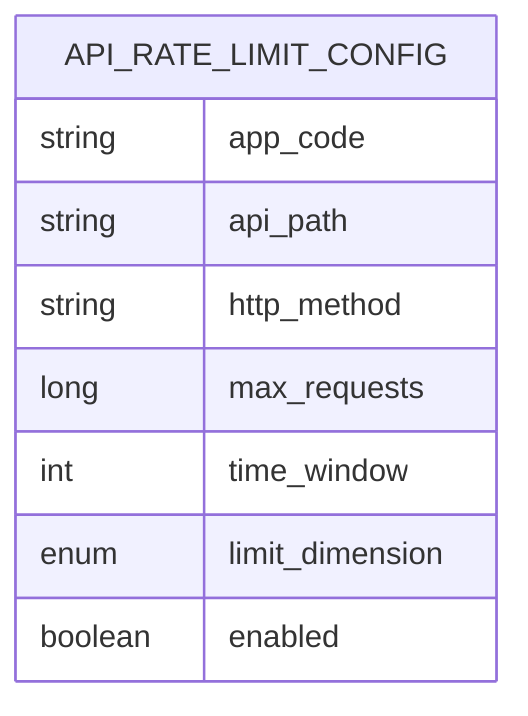
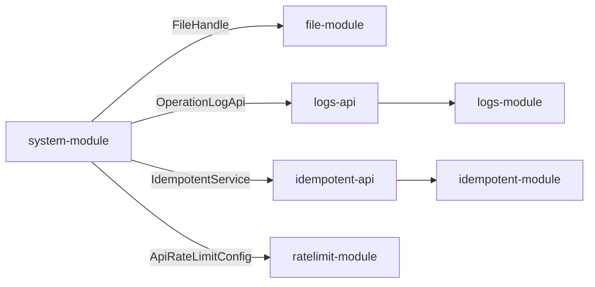

# 核心模块

<cite>
**本文引用的文件**
- [SysUsers.java](file://system-module/src/main/java/com/fastproject/system/domain/SysUsers.java)
- [SysUsersService.java](file://system-module/src/main/java/com/fastproject/system/service/SysUsersService.java)
- [SysUsersServiceImpl.java](file://system-module/src/main/java/com/fastproject/system/service/impl/SysUsersServiceImpl.java)
- [FileInfo.java](file://file-module/src/main/java/com/fastproject/file/domain/FileInfo.java)
- [FileInfoService.java](file://file-module/src/main/java/com/fastproject/file/service/FileInfoService.java)
- [FileInfoServiceImpl.java](file://file-module/src/main/java/com/fastproject/file/service/impl/FileInfoServiceImpl.java)
- [OperationLog.java](file://logs-module/src/main/java/com/fastproject/logs/domain/OperationLog.java)
- [OperationLogApi.java](file://logs-api/src/main/java/com/fastproject/logs/api/OperationLogApi.java)
- [OperationLogServiceImpl.java](file://logs-module/src/main/java/com/fastproject/logs/service/impl/OperationLogServiceImpl.java)
- [IdempotentDuplicateLog.java](file://idempotent-module/src/main/java/com/fastproject/idempotent/domain/IdempotentDuplicateLog.java)
- [IdempotentService.java](file://idempotent-api/src/main/java/com/fastproject/idempotent/api/IdempotentService.java)
- [ApiRateLimitConfig.java](file://ratelimit-module/src/main/java/com/fastproject/ratelimit/domain/ApiRateLimitConfig.java)
</cite>

## 目录
1. [引言](#引言)
2. [项目结构](#项目结构)
3. [核心组件](#核心组件)
4. [架构总览](#架构总览)
5. [详细组件分析](#详细组件分析)
6. [依赖分析](#依赖分析)
7. [性能考虑](#性能考虑)
8. [故障排查指南](#故障排查指南)
9. [结论](#结论)
10. [附录](#附录)

## 引言
本文件聚焦Fast项目的五大核心业务模块：系统管理、文件管理、日志管理、幂等性控制与限流控制。文档从设计理念、职责边界、接口定义、内部协作机制、模块间依赖与数据流转等方面进行系统化梳理，并提供扩展点、插件化设计思路、最佳实践与性能优化建议，以及模块级使用指南与集成示例。

## 项目结构
Fast项目采用多模块分层架构，核心模块按功能域划分：
- system-module：系统管理（用户、角色、部门、岗位、配置等）
- file-module：文件管理（文件信息、存储策略、访问URL解析）
- logs-module：日志管理（操作日志持久化与查询）
- logs-api：日志对外API（供其他模块异步/同步记录）
- idempotent-module：幂等性控制（重复提交检测与记录）
- idempotent-api：幂等性对外API（注解驱动与切面拦截）
- ratelimit-module：限流控制（API/全局/IP/用户限流配置与记录）

图表来源
- [SysUsers.java](file://system-module/src/main/java/com/fastproject/system/domain/SysUsers.java#L1-L95)
- [SysUsersServiceImpl.java](file://system-module/src/main/java/com/fastproject/system/service/impl/SysUsersServiceImpl.java#L1-L390)
- [FileInfo.java](file://file-module/src/main/java/com/fastproject/file/domain/FileInfo.java#L1-L79)
- [FileInfoServiceImpl.java](file://file-module/src/main/java/com/fastproject/file/service/impl/FileInfoServiceImpl.java#L1-L239)
- [OperationLog.java](file://logs-module/src/main/java/com/fastproject/logs/domain/OperationLog.java#L1-L93)
- [OperationLogApi.java](file://logs-api/src/main/java/com/fastproject/logs/api/OperationLogApi.java#L1-L25)
- [OperationLogServiceImpl.java](file://logs-module/src/main/java/com/fastproject/logs/service/impl/OperationLogServiceImpl.java#L1-L125)
- [IdempotentDuplicateLog.java](file://idempotent-module/src/main/java/com/fastproject/idempotent/domain/IdempotentDuplicateLog.java#L1-L97)
- [IdempotentService.java](file://idempotent-api/src/main/java/com/fastproject/idempotent/api/IdempotentService.java#L1-L19)
- [ApiRateLimitConfig.java](file://ratelimit-module/src/main/java/com/fastproject/ratelimit/domain/ApiRateLimitConfig.java#L1-L64)

章节来源
- [SysUsers.java](file://system-module/src/main/java/com/fastproject/system/domain/SysUsers.java#L1-L95)
- [FileInfo.java](file://file-module/src/main/java/com/fastproject/file/domain/FileInfo.java#L1-L79)
- [OperationLog.java](file://logs-module/src/main/java/com/fastproject/logs/domain/OperationLog.java#L1-L93)
- [IdempotentDuplicateLog.java](file://idempotent-module/src/main/java/com/fastproject/idempotent/domain/IdempotentDuplicateLog.java#L1-L97)
- [ApiRateLimitConfig.java](file://ratelimit-module/src/main/java/com/fastproject/ratelimit/domain/ApiRateLimitConfig.java#L1-L64)

## 核心组件
本节概述五大核心模块的职责与边界：
- 系统管理（system-module）
  - 职责：用户、角色、部门、岗位、配置等基础数据的增删改查与权限约束；支持租户隔离与头像URL转换。
  - 关键接口：SysUsersService；关键实现：SysUsersServiceImpl。
- 文件管理（file-module）
  - 职责：文件元数据管理、文件类型统计、存储路径解析与删除；与存储策略上下文解耦。
  - 关键接口：FileInfoService；关键实现：FileInfoServiceImpl。
- 日志管理（logs-module）
  - 职责：操作日志的持久化、查询与分页；通过OperationLogApi对外提供统一入口。
  - 关键接口：OperationLogApi；关键实现：OperationLogServiceImpl。
- 幂等性控制（idempotent-module）
  - 职责：记录重复提交请求，防止业务重复执行；结合注解与切面在调用层拦截。
  - 关键实体：IdempotentDuplicateLog；关键接口：IdempotentService。
- 限流控制（ratelimit-module）
  - 职责：API/全局/IP/用户维度的限流配置与生效；提供配置实体与查询能力。
  - 关键实体：ApiRateLimitConfig。

章节来源
- [SysUsersService.java](file://system-module/src/main/java/com/fastproject/system/service/SysUsersService.java#L1-L75)
- [SysUsersServiceImpl.java](file://system-module/src/main/java/com/fastproject/system/service/impl/SysUsersServiceImpl.java#L1-L390)
- [FileInfoService.java](file://file-module/src/main/java/com/fastproject/file/service/FileInfoService.java#L1-L62)
- [FileInfoServiceImpl.java](file://file-module/src/main/java/com/fastproject/file/service/impl/FileInfoServiceImpl.java#L1-L239)
- [OperationLogApi.java](file://logs-api/src/main/java/com/fastproject/logs/api/OperationLogApi.java#L1-L25)
- [OperationLogServiceImpl.java](file://logs-module/src/main/java/com/fastproject/logs/service/impl/OperationLogServiceImpl.java#L1-L125)
- [IdempotentService.java](file://idempotent-api/src/main/java/com/fastproject/idempotent/api/IdempotentService.java#L1-L19)
- [IdempotentDuplicateLog.java](file://idempotent-module/src/main/java/com/fastproject/idempotent/domain/IdempotentDuplicateLog.java#L1-L97)
- [ApiRateLimitConfig.java](file://ratelimit-module/src/main/java/com/fastproject/ratelimit/domain/ApiRateLimitConfig.java#L1-L64)

## 架构总览
下图展示核心模块在运行时的交互关系与数据流向：

图表来源
- [SysUsersServiceImpl.java](file://system-module/src/main/java/com/fastproject/system/service/impl/SysUsersServiceImpl.java#L183-L190)
- [FileInfoServiceImpl.java](file://file-module/src/main/java/com/fastproject/file/service/impl/FileInfoServiceImpl.java#L207-L227)
- [OperationLogApi.java](file://logs-api/src/main/java/com/fastproject/logs/api/OperationLogApi.java#L1-L25)
- [OperationLogServiceImpl.java](file://logs-module/src/main/java/com/fastproject/logs/service/impl/OperationLogServiceImpl.java#L83-L123)
- [IdempotentService.java](file://idempotent-api/src/main/java/com/fastproject/idempotent/api/IdempotentService.java#L1-L19)
- [ApiRateLimitConfig.java](file://ratelimit-module/src/main/java/com/fastproject/ratelimit/domain/ApiRateLimitConfig.java#L1-L64)

## 详细组件分析

### 系统管理模块（用户与租户）
- 设计理念
  - 用户实体继承通用基类并支持软删除与租户过滤；通过多对一/多对多关联部门、岗位、角色，实现灵活的组织与权限模型。
  - 服务层在新增/修改时进行字段唯一性校验与租户访问校验，确保数据一致性与安全。
- 数据模型与复杂度
  - 实体关系：用户-部门（多对一）、用户-岗位（多对一）、用户-角色（多对多）。
  - 查询复杂度：分页查询基于Specification动态拼接条件，时间复杂度O(n)拼接谓词+数据库分页。
- 内部协作
  - SysUsersServiceImpl依赖仓储、映射器、租户访问支持、文件URL转换器与BCrypt加密器。
- 扩展点
  - 支持自定义租户访问策略（TenantAccessSupport）与头像URL解析策略。
- 使用指南
  - 新增用户：传入用户名/手机/邮箱唯一性检查；可绑定角色、部门、岗位；返回用户ID。
  - 分页查询：支持按用户名、昵称、邮箱、电话、性别筛选；自动注入头像URL。
  - 个人中心：支持头像ID到URL的转换与密码更新（含旧密码校验）。

图表来源
- [SysUsers.java](file://system-module/src/main/java/com/fastproject/system/domain/SysUsers.java#L1-L95)
- [SysUsersService.java](file://system-module/src/main/java/com/fastproject/system/service/SysUsersService.java#L1-L75)
- [SysUsersServiceImpl.java](file://system-module/src/main/java/com/fastproject/system/service/impl/SysUsersServiceImpl.java#L1-L390)

章节来源
- [SysUsers.java](file://system-module/src/main/java/com/fastproject/system/domain/SysUsers.java#L1-L95)
- [SysUsersService.java](file://system-module/src/main/java/com/fastproject/system/service/SysUsersService.java#L1-L75)
- [SysUsersServiceImpl.java](file://system-module/src/main/java/com/fastproject/system/service/impl/SysUsersServiceImpl.java#L50-L246)

### 文件管理模块（文件信息与存储）
- 设计理念
  - 文件信息实体包含文件名、大小、类型、MD5、状态、存储位置、访问路径、文件路径、配置ID、类型ID等字段。
  - 服务层提供分页查询、类型统计、MD5去重、删除时联动删除存储源文件。
- 数据模型与复杂度
  - FileInfo实体字段覆盖文件元数据与存储定位；类型统计为O(n)聚合与排序。
- 内部协作
  - FileInfoServiceImpl依赖仓储、查询帮助器、映射器、文件配置服务与存储上下文。
- 扩展点
  - 存储策略上下文可替换具体实现；支持多种存储后端与权重选择器。
- 使用指南
  - 新增文件：可选MD5去重；返回文件ID。
  - 统计类型：按文件类型聚合数量占比与空间占用（MB）。
  - 删除文件：先解析存储键，再调用存储上下文删除源文件，最后删除记录。

图表来源
- [FileInfo.java](file://file-module/src/main/java/com/fastproject/file/domain/FileInfo.java#L1-L79)
- [FileInfoService.java](file://file-module/src/main/java/com/fastproject/file/service/FileInfoService.java#L1-L62)
- [FileInfoServiceImpl.java](file://file-module/src/main/java/com/fastproject/file/service/impl/FileInfoServiceImpl.java#L51-L237)

章节来源
- [FileInfo.java](file://file-module/src/main/java/com/fastproject/file/domain/FileInfo.java#L1-L79)
- [FileInfoService.java](file://file-module/src/main/java/com/fastproject/file/service/FileInfoService.java#L1-L62)
- [FileInfoServiceImpl.java](file://file-module/src/main/java/com/fastproject/file/service/impl/FileInfoServiceImpl.java#L51-L237)

### 日志管理模块（操作日志）
- 设计理念
  - 操作日志实体包含描述、类型、动作、请求参数、响应数据、耗时、IP、URL、HTTP方法、类名、方法名、成功标志、错误信息等字段。
  - 通过OperationLogApi对外提供同步与异步记录能力，便于在业务流程中解耦日志采集。
- 数据模型与复杂度
  - 查询基于Specification动态拼接条件，支持描述、类型、动作、IP、URL、成功标志、时间范围等筛选。
- 内部协作
  - OperationLogServiceImpl负责持久化与分页查询；与映射器、仓储、查询帮助器协作。
- 扩展点
  - 可在切面或控制器层通过注解触发日志记录；也可直接调用OperationLogApi。
- 使用指南
  - 同步记录：传入OperationLogDTO，返回日志ID。
  - 异步记录：传入OperationLogDTO，立即返回，后台异步落库。
  - 分页查询：支持多维条件筛选与时间范围查询。

图表来源
- [OperationLogApi.java](file://logs-api/src/main/java/com/fastproject/logs/api/OperationLogApi.java#L1-L25)
- [OperationLogServiceImpl.java](file://logs-module/src/main/java/com/fastproject/logs/service/impl/OperationLogServiceImpl.java#L41-L123)
- [OperationLog.java](file://logs-module/src/main/java/com/fastproject/logs/domain/OperationLog.java#L1-L93)

章节来源
- [OperationLogApi.java](file://logs-api/src/main/java/com/fastproject/logs/api/OperationLogApi.java#L1-L25)
- [OperationLogServiceImpl.java](file://logs-module/src/main/java/com/fastproject/logs/service/impl/OperationLogServiceImpl.java#L41-L123)
- [OperationLog.java](file://logs-module/src/main/java/com/fastproject/logs/domain/OperationLog.java#L1-L93)

### 幂等性控制模块（重复提交防护）
- 设计理念
  - 通过注解与切面在方法调用前创建幂等记录，记录请求ID、路径、方法、参数、用户、IP、UA、标题、首次与重复时间、重复次数与提示消息等。
  - 服务接口提供幂等ID创建能力，便于在业务层进行二次校验与处理。
- 数据模型与复杂度
  - IdempotentDuplicateLog实体记录重复提交的关键信息，查询与统计可基于ID/请求ID/时间范围等维度。
- 内部协作
  - 切面在目标方法执行前后发布重复事件，服务层负责创建与持久化。
- 扩展点
  - 可自定义幂等键前缀、重复阈值、提示消息与持久化策略。
- 使用指南
  - 在需要防重复提交的方法上添加幂等注解；框架自动拦截并创建幂等记录；可在业务层根据幂等ID进行二次判断与处理。

图表来源
- [IdempotentDuplicateLog.java](file://idempotent-module/src/main/java/com/fastproject/idempotent/domain/IdempotentDuplicateLog.java#L1-L97)
- [IdempotentService.java](file://idempotent-api/src/main/java/com/fastproject/idempotent/api/IdempotentService.java#L1-L19)

章节来源
- [IdempotentDuplicateLog.java](file://idempotent-module/src/main/java/com/fastproject/idempotent/domain/IdempotentDuplicateLog.java#L1-L97)
- [IdempotentService.java](file://idempotent-api/src/main/java/com/fastproject/idempotent/api/IdempotentService.java#L1-L19)

### 限流控制模块（API/全局/IP/用户）
- 设计理念
  - 限流配置实体支持应用代码、API路径、HTTP方法、最大请求数、时间窗口、限流维度与启用状态。
  - 通过仓储按应用+路径+方法查询配置，结合维度（如API/IP/用户/全局）进行限流判定。
- 数据模型与复杂度
  - 配置实体字段覆盖限流关键要素；查询按复合键匹配，时间复杂度O(1)。
- 内部协作
  - 服务层提供分页查询与更新能力；仓储负责按复合键检索。
- 扩展点
  - 可扩展新的限流维度枚举与策略实现；支持动态配置热更新。
- 使用指南
  - 新增/更新限流配置：指定应用代码、API路径、HTTP方法、最大请求数、时间窗口、维度与启用状态。
  - 分页查询：按应用、路径、方法、启用状态等条件筛选。

图表来源
- [ApiRateLimitConfig.java](file://ratelimit-module/src/main/java/com/fastproject/ratelimit/domain/ApiRateLimitConfig.java#L1-L64)

章节来源
- [ApiRateLimitConfig.java](file://ratelimit-module/src/main/java/com/fastproject/ratelimit/domain/ApiRateLimitConfig.java#L1-L64)

## 依赖分析
- 模块内聚与耦合
  - system-module与file-module存在弱耦合：用户头像ID通过FileHandle转换为URL，体现“面向接口”的低耦合设计。
  - logs-module与logs-api形成清晰的对外API边界，便于跨模块复用。
  - idempotent-module与idempotent-api通过注解与切面解耦业务方法与幂等逻辑。
  - ratelimit-module提供独立的配置实体与仓储查询，便于在网关或服务层复用。
- 外部依赖与集成点
  - 系统管理模块依赖租户访问支持与密码加密器，确保多租户隔离与安全。
  - 文件管理模块依赖存储上下文与配置服务，支持多存储后端切换。
  - 日志模块依赖分页查询帮助器与映射器，保证查询灵活性与数据转换一致性。
- 循环依赖
  - 当前模块间无明显循环依赖；若后续扩展，需避免在service层直接互相调用导致的环。

图表来源
- [SysUsersServiceImpl.java](file://system-module/src/main/java/com/fastproject/system/service/impl/SysUsersServiceImpl.java#L183-L190)
- [OperationLogApi.java](file://logs-api/src/main/java/com/fastproject/logs/api/OperationLogApi.java#L1-L25)
- [IdempotentService.java](file://idempotent-api/src/main/java/com/fastproject/idempotent/api/IdempotentService.java#L1-L19)
- [ApiRateLimitConfig.java](file://ratelimit-module/src/main/java/com/fastproject/ratelimit/domain/ApiRateLimitConfig.java#L1-L64)

章节来源
- [SysUsersServiceImpl.java](file://system-module/src/main/java/com/fastproject/system/service/impl/SysUsersServiceImpl.java#L1-L390)
- [OperationLogApi.java](file://logs-api/src/main/java/com/fastproject/logs/api/OperationLogApi.java#L1-L25)
- [IdempotentService.java](file://idempotent-api/src/main/java/com/fastproject/idempotent/api/IdempotentService.java#L1-L19)
- [ApiRateLimitConfig.java](file://ratelimit-module/src/main/java/com/fastproject/ratelimit/domain/ApiRateLimitConfig.java#L1-L64)

## 性能考虑
- 分页查询
  - 使用Specification动态拼接条件，避免全表扫描；合理设置分页大小与排序字段，减少数据库压力。
- 缓存与批量处理
  - 用户头像URL批量转换：在分页查询时收集头像ID集合，一次性批量获取URL映射，降低多次远程调用开销。
  - 文件类型统计：在内存中聚合与排序，避免复杂SQL分组带来的性能问题。
- 存储删除
  - 删除文件前先解析存储键并校验配置，失败时快速抛错，避免无效IO操作。
- 日志异步
  - 通过异步接口将日志写入后台队列，避免阻塞主业务流程。
- 幂等与限流
  - 幂等记录仅在重复提交时创建，正常路径无额外开销；限流配置按复合键查询，命中率高且延迟低。

## 故障排查指南
- 用户相关
  - 唯一性冲突：新增/修改时若用户名/手机号/邮箱重复，会抛出业务异常；检查输入参数与现有数据。
  - 租户访问：跨租户修改/查看会触发访问校验异常；确认当前租户上下文与实体租户ID一致。
  - 头像URL：若头像ID未转换为URL，检查FileHandle实现与存储配置。
- 文件相关
  - MD5重复：新增文件时若MD5已存在，抛出业务异常；确认上传策略与去重逻辑。
  - 删除失败：存储配置缺失或源文件删除失败会抛出异常；检查配置ID与存储后端可用性。
- 日志相关
  - 分页查询无结果：检查筛选条件与时间范围；确认索引与查询条件匹配。
- 幂等相关
  - 重复提交：检查请求ID与幂等前缀；确认重复次数与提示消息是否符合预期。
- 限流相关
  - 配置缺失：按应用+路径+方法查询不到配置时，确认配置是否正确录入；检查启用状态与维度设置。

章节来源
- [SysUsersServiceImpl.java](file://system-module/src/main/java/com/fastproject/system/service/impl/SysUsersServiceImpl.java#L54-L62)
- [SysUsersServiceImpl.java](file://system-module/src/main/java/com/fastproject/system/service/impl/SysUsersServiceImpl.java#L136-L141)
- [FileInfoServiceImpl.java](file://file-module/src/main/java/com/fastproject/file/service/impl/FileInfoServiceImpl.java#L56-L58)
- [FileInfoServiceImpl.java](file://file-module/src/main/java/com/fastproject/file/service/impl/FileInfoServiceImpl.java#L214-L226)
- [OperationLogServiceImpl.java](file://logs-module/src/main/java/com/fastproject/logs/service/impl/OperationLogServiceImpl.java#L83-L123)
- [IdempotentDuplicateLog.java](file://idempotent-module/src/main/java/com/fastproject/idempotent/domain/IdempotentDuplicateLog.java#L1-L97)
- [ApiRateLimitConfig.java](file://ratelimit-module/src/main/java/com/fastproject/ratelimit/domain/ApiRateLimitConfig.java#L1-L64)

## 结论
Fast项目的五大核心模块在职责、接口与协作上保持清晰边界：系统管理负责用户与租户治理，文件管理负责文件元数据与存储解耦，日志管理提供统一的异步/同步记录能力，幂等性控制保障业务幂等，限流控制提供多维度的流量治理。模块间通过API与仓储解耦，具备良好的扩展性与可维护性。建议在生产环境中结合缓存、批量处理与异步化进一步提升性能，并完善监控与告警体系。

## 附录
- 最佳实践
  - 统一分页查询规范与排序字段，避免N+1查询。
  - 对外API统一使用OperationLogApi，确保日志采集一致性。
  - 幂等注解与切面配合使用，避免在业务层重复校验。
  - 限流配置定期审计，结合监控指标动态调整。
- 性能优化建议
  - 用户头像URL批量转换，减少远程调用次数。
  - 文件类型统计在内存聚合，避免复杂SQL分组。
  - 日志异步写入，降低主流程延迟。
  - 存储删除前置校验，失败早返回。
- 使用指南与集成示例
  - 系统管理：通过SysUsersService进行用户增删改查与个人中心操作；在分页查询中自动注入头像URL。
  - 文件管理：通过FileInfoService新增/删除/统计文件；删除时自动清理源文件。
  - 日志管理：通过OperationLogApi进行同步/异步日志记录；在业务流程中统一埋点。
  - 幂等性控制：在关键业务方法上添加幂等注解；根据幂等ID进行重复提交防护。
  - 限流控制：通过ApiRateLimitConfig进行限流配置管理；在网关或服务层按维度执行限流策略。