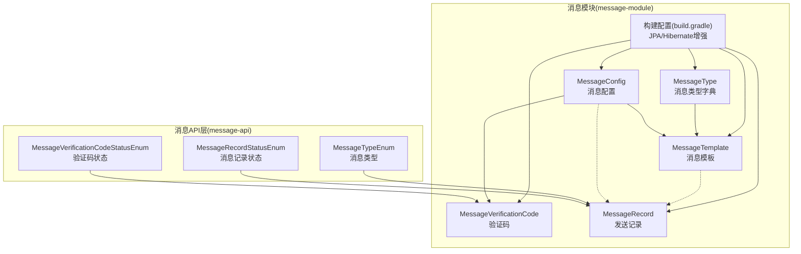
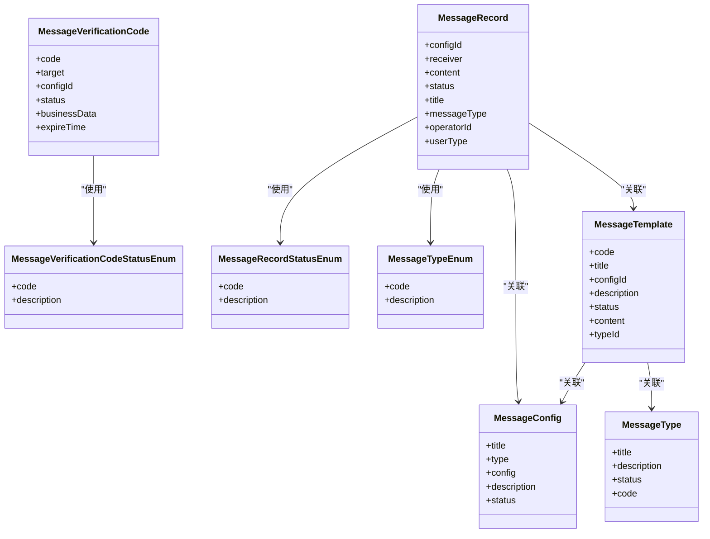
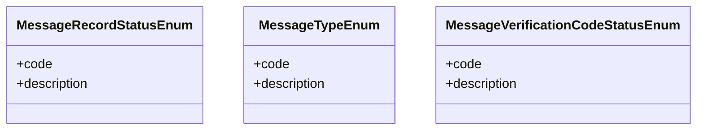
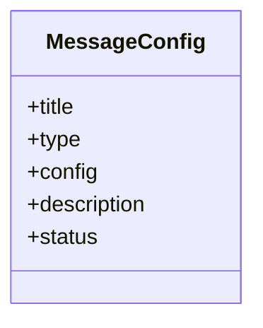
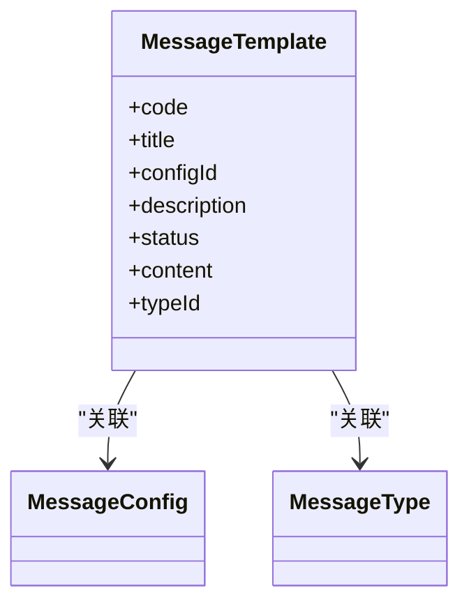
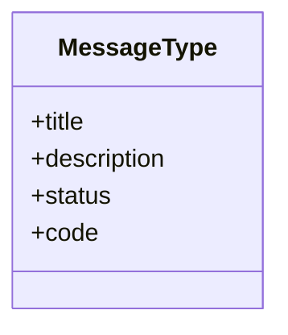
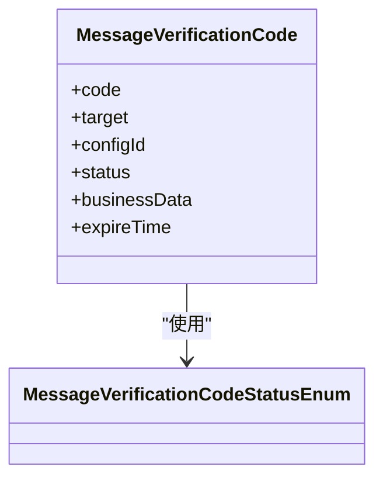
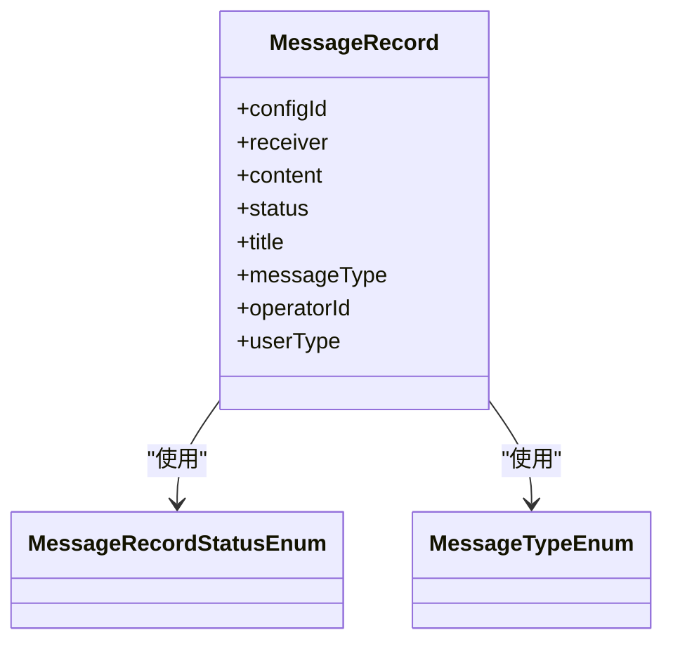
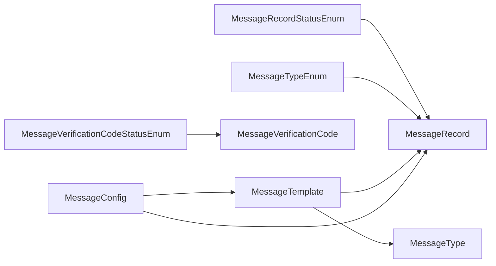

# 消息服务模块

<cite>
**本文引用的文件**
- [message-api 枚举：MessageRecordStatusEnum.java](file://message-api/src/main/java/com/ fastproject/message/enums/MessageRecordStatusEnum.java)
- [message-api 枚举：MessageTypeEnum.java](file://message-api/src/main/java/com/ fastproject/message/enums/MessageTypeEnum.java)
- [message-api 枚举：MessageVerificationCodeStatusEnum.java](file://message-api/src/main/java/com/ fastproject/message/enums/MessageVerificationCodeStatusEnum.java)
- [message-module 实体：MessageConfig.java](file://message-module/src/main/java/com/ fastproject/message/domain/MessageConfig.java)
- [message-module 实体：MessageRecord.java](file://message-module/src/main/java/com/ fastproject/message/domain/MessageRecord.java)
- [message-module 实体：MessageTemplate.java](file://message-module/src/main/java/com/ fastproject/message/domain/MessageTemplate.java)
- [message-module 实体：MessageType.java](file://message-module/src/main/java/com/ fastproject/message/domain/MessageType.java)
- [message-module 实体：MessageVerificationCode.java](file://message-module/src/main/java/com/ fastproject/message/domain/MessageVerificationCode.java)
- [message-module 构建脚本：build.gradle](file://message-module/build.gradle)
</cite>

## 目录
1. [简介](#简介)
2. [项目结构](#项目结构)
3. [核心组件](#核心组件)
4. [架构总览](#架构总览)
5. [详细组件分析](#详细组件分析)
6. [依赖关系分析](#依赖关系分析)
7. [性能与可扩展性](#性能与可扩展性)
8. [故障排查指南](#故障排查指南)
9. [结论](#结论)
10. [附录](#附录)

## 简介
本文件为“消息服务模块”的系统化技术文档，聚焦消息发送系统的架构设计与实现要点，覆盖邮件、短信等多消息类型的发送机制；涵盖消息模板管理、消息配置管理、发送记录跟踪等核心能力；阐述消息发送服务的抽象设计、具体实现策略与错误处理机制；并提供消息队列集成、发送状态监控、失败重试策略等高级特性建议。同时给出配置参数说明与集成示例思路，解释模块的安全性设计、性能优化与扩展性考虑。

## 项目结构
消息服务模块由两部分组成：
- message-api：定义消息相关枚举（消息记录状态、消息类型、验证码状态），作为跨模块的契约层。
- message-module：基于 JPA 的持久化层与构建配置，包含消息配置、模板、类型、验证码、发送记录等实体及对应仓库/映射/服务的基础骨架。

图表来源
- [message-api 枚举：MessageRecordStatusEnum.java](file://message-api/src/main/java/com/ fastproject/message/enums/MessageRecordStatusEnum.java#L1-L27)
- [message-api 枚举：MessageTypeEnum.java](file://message-api/src/main/java/com/ fastproject/message/enums/MessageTypeEnum.java#L1-L26)
- [message-api 枚举：MessageVerificationCodeStatusEnum.java](file://message-api/src/main/java/com/ fastproject/message/enums/MessageVerificationCodeStatusEnum.java#L1-L31)
- [message-module 实体：MessageConfig.java](file://message-module/src/main/java/com/ fastproject/message/domain/MessageConfig.java#L1-L45)
- [message-module 实体：MessageTemplate.java](file://message-module/src/main/java/com/ fastproject/message/domain/MessageTemplate.java#L1-L55)
- [message-module 实体：MessageType.java](file://message-module/src/main/java/com/ fastproject/message/domain/MessageType.java#L1-L39)
- [message-module 实体：MessageVerificationCode.java](file://message-module/src/main/java/com/ fastproject/message/domain/MessageVerificationCode.java#L1-L49)
- [message-module 实体：MessageRecord.java](file://message-module/src/main/java/com/ fastproject/message/domain/MessageRecord.java#L1-L59)
- [message-module 构建脚本：build.gradle](file://message-module/build.gradle#L1-L19)

章节来源
- [message-api 枚举：MessageRecordStatusEnum.java](file://message-api/src/main/java/com/ fastproject/message/enums/MessageRecordStatusEnum.java#L1-L27)
- [message-api 枚举：MessageTypeEnum.java](file://message-api/src/main/java/com/ fastproject/message/enums/MessageTypeEnum.java#L1-L26)
- [message-api 枚举：MessageVerificationCodeStatusEnum.java](file://message-api/src/main/java/com/ fastproject/message/enums/MessageVerificationCodeStatusEnum.java#L1-L31)
- [message-module 实体：MessageConfig.java](file://message-module/src/main/java/com/ fastproject/message/domain/MessageConfig.java#L1-L45)
- [message-module 实体：MessageTemplate.java](file://message-module/src/main/java/com/ fastproject/message/domain/MessageTemplate.java#L1-L55)
- [message-module 实体：MessageType.java](file://message-module/src/main/java/com/ fastproject/message/domain/MessageType.java#L1-L39)
- [message-module 实体：MessageVerificationCode.java](file://message-module/src/main/java/com/ fastproject/message/domain/MessageVerificationCode.java#L1-L49)
- [message-module 实体：MessageRecord.java](file://message-module/src/main/java/com/ fastproject/message/domain/MessageRecord.java#L1-L59)
- [message-module 构建脚本：build.gradle](file://message-module/build.gradle#L1-L19)

## 核心组件
- 消息记录状态：用于标记发送结果（已发送/发送失败）。
- 消息类型：区分验证码与通知两类消息。
- 验证码状态：区分有效、已使用、已过期三态。
- 消息配置：承载不同通道（如邮件/短信）的配置项与开关。
- 消息模板：按模板代码与类型管理内容，支持启用/停用。
- 消息类型字典：维护消息类型编码与状态。
- 验证码：记录目标、配置、业务数据与过期时间。
- 发送记录：记录每次发送的接收人、内容、状态、类型、操作者等。

章节来源
- [message-api 枚举：MessageRecordStatusEnum.java](file://message-api/src/main/java/com/ fastproject/message/enums/MessageRecordStatusEnum.java#L1-L27)
- [message-api 枚举：MessageTypeEnum.java](file://message-api/src/main/java/com/ fastproject/message/enums/MessageTypeEnum.java#L1-L26)
- [message-api 枚举：MessageVerificationCodeStatusEnum.java](file://message-api/src/main/java/com/ fastproject/message/enums/MessageVerificationCodeStatusEnum.java#L1-L31)
- [message-module 实体：MessageConfig.java](file://message-module/src/main/java/com/ fastproject/message/domain/MessageConfig.java#L1-L45)
- [message-module 实体：MessageTemplate.java](file://message-module/src/main/java/com/ fastproject/message/domain/MessageTemplate.java#L1-L55)
- [message-module 实体：MessageType.java](file://message-module/src/main/java/com/ fastproject/message/domain/MessageType.java#L1-L39)
- [message-module 实体：MessageVerificationCode.java](file://message-module/src/main/java/com/ fastproject/message/domain/MessageVerificationCode.java#L1-L49)
- [message-module 实体：MessageRecord.java](file://message-module/src/main/java/com/ fastproject/message/domain/MessageRecord.java#L1-L59)

## 架构总览
消息服务采用“API 契约 + 持久化模块”的分层设计：
- API 层提供消息状态与类型枚举，确保跨模块一致性。
- 模块层通过 JPA 实体与 Hibernate 增强，提供配置、模板、类型、验证码、记录等数据模型。
- 通过仓库/映射/服务层的组合，支撑模板管理、配置管理、验证码校验与发送记录追踪。
- 可扩展点：在服务层引入适配器模式对接不同消息通道（邮件/SMS），并在记录表中统一追踪状态。

图表来源
- [message-api 枚举：MessageRecordStatusEnum.java](file://message-api/src/main/java/com/ fastproject/message/enums/MessageRecordStatusEnum.java#L1-L27)
- [message-api 枚举：MessageTypeEnum.java](file://message-api/src/main/java/com/ fastproject/message/enums/MessageTypeEnum.java#L1-L26)
- [message-api 枚举：MessageVerificationCodeStatusEnum.java](file://message-api/src/main/java/com/ fastproject/message/enums/MessageVerificationCodeStatusEnum.java#L1-L31)
- [message-module 实体：MessageConfig.java](file://message-module/src/main/java/com/ fastproject/message/domain/MessageConfig.java#L1-L45)
- [message-module 实体：MessageTemplate.java](file://message-module/src/main/java/com/ fastproject/message/domain/MessageTemplate.java#L1-L55)
- [message-module 实体：MessageType.java](file://message-module/src/main/java/com/ fastproject/message/domain/MessageType.java#L1-L39)
- [message-module 实体：MessageVerificationCode.java](file://message-module/src/main/java/com/ fastproject/message/domain/MessageVerificationCode.java#L1-L49)
- [message-module 实体：MessageRecord.java](file://message-module/src/main/java/com/ fastproject/message/domain/MessageRecord.java#L1-L59)

## 详细组件分析

### 消息记录状态与类型
- 消息记录状态：用于标识发送是否成功，便于后续重试与审计。
- 消息类型：区分验证码与通知，便于模板选择与通道策略差异化。
- 验证码状态：区分有效、已使用、已过期，支撑验证码校验流程。

图表来源
- [message-api 枚举：MessageRecordStatusEnum.java](file://message-api/src/main/java/com/ fastproject/message/enums/MessageRecordStatusEnum.java#L1-L27)
- [message-api 枚举：MessageTypeEnum.java](file://message-api/src/main/java/com/ fastproject/message/enums/MessageTypeEnum.java#L1-L26)
- [message-api 枚举：MessageVerificationCodeStatusEnum.java](file://message-api/src/main/java/com/ fastproject/message/enums/MessageVerificationCodeStatusEnum.java#L1-L31)

章节来源
- [message-api 枚举：MessageRecordStatusEnum.java](file://message-api/src/main/java/com/ fastproject/message/enums/MessageRecordStatusEnum.java#L1-L27)
- [message-api 枚举：MessageTypeEnum.java](file://message-api/src/main/java/com/ fastproject/message/enums/MessageTypeEnum.java#L1-L26)
- [message-api 枚举：MessageVerificationCodeStatusEnum.java](file://message-api/src/main/java/com/ fastproject/message/enums/MessageVerificationCodeStatusEnum.java#L1-L31)

### 消息配置（MessageConfig）
- 职责：存储各通道（邮件/短信等）的配置信息、类型与状态。
- 关键字段：标题、类型、配置JSON、描述、状态。
- 设计要点：软删除与查询限制，保证历史数据可追溯且默认过滤已删除项。

图表来源
- [message-module 实体：MessageConfig.java](file://message-module/src/main/java/com/ fastproject/message/domain/MessageConfig.java#L1-L45)

章节来源
- [message-module 实体：MessageConfig.java](file://message-module/src/main/java/com/ fastproject/message/domain/MessageConfig.java#L1-L45)

### 消息模板（MessageTemplate）
- 职责：按模板代码与类型管理内容，支持启用/停用。
- 关键字段：模板代码、标题、配置ID、描述、状态、内容、类型ID。
- 设计要点：与消息配置、消息类型关联，便于按通道与类型选择模板。

图表来源
- [message-module 实体：MessageTemplate.java](file://message-module/src/main/java/com/ fastproject/message/domain/MessageTemplate.java#L1-L55)
- [message-module 实体：MessageType.java](file://message-module/src/main/java/com/ fastproject/message/domain/MessageType.java#L1-L39)
- [message-module 实体：MessageConfig.java](file://message-module/src/main/java/com/ fastproject/message/domain/MessageConfig.java#L1-L45)

章节来源
- [message-module 实体：MessageTemplate.java](file://message-module/src/main/java/com/ fastproject/message/domain/MessageTemplate.java#L1-L55)
- [message-module 实体：MessageType.java](file://message-module/src/main/java/com/ fastproject/message/domain/MessageType.java#L1-L39)
- [message-module 实体：MessageConfig.java](file://message-module/src/main/java/com/ fastproject/message/domain/MessageConfig.java#L1-L45)

### 消息类型字典（MessageType）
- 职责：维护消息类型编码与状态，供模板与记录使用。
- 关键字段：标题、描述、状态、代码。

图表来源
- [message-module 实体：MessageType.java](file://message-module/src/main/java/com/ fastproject/message/domain/MessageType.java#L1-L39)

章节来源
- [message-module 实体：MessageType.java](file://message-module/src/main/java/com/ fastproject/message/domain/MessageType.java#L1-L39)

### 验证码（MessageVerificationCode）
- 职责：生成与校验验证码，记录目标、配置、业务数据与过期时间。
- 关键字段：验证码、目标、配置ID、状态、业务数据、过期时间。
- 设计要点：结合验证码状态枚举进行生命周期管理。

图表来源
- [message-module 实体：MessageVerificationCode.java](file://message-module/src/main/java/com/ fastproject/message/domain/MessageVerificationCode.java#L1-L49)
- [message-api 枚举：MessageVerificationCodeStatusEnum.java](file://message-api/src/main/java/com/ fastproject/message/enums/MessageVerificationCodeStatusEnum.java#L1-L31)

章节来源
- [message-module 实体：MessageVerificationCode.java](file://message-module/src/main/java/com/ fastproject/message/domain/MessageVerificationCode.java#L1-L49)
- [message-api 枚举：MessageVerificationCodeStatusEnum.java](file://message-api/src/main/java/com/ fastproject/message/enums/MessageVerificationCodeStatusEnum.java#L1-L31)

### 发送记录（MessageRecord）
- 职责：记录每次发送的接收人、内容、状态、类型、操作者等，用于审计与重试。
- 关键字段：配置ID、接收人、内容、状态、标题、消息类型、操作用户、用户类型。
- 设计要点：与消息配置、模板、类型关联，统一追踪发送结果。

图表来源
- [message-module 实体：MessageRecord.java](file://message-module/src/main/java/com/ fastproject/message/domain/MessageRecord.java#L1-L59)
- [message-api 枚举：MessageRecordStatusEnum.java](file://message-api/src/main/java/com/ fastproject/message/enums/MessageRecordStatusEnum.java#L1-L27)
- [message-api 枚举：MessageTypeEnum.java](file://message-api/src/main/java/com/ fastproject/message/enums/MessageTypeEnum.java#L1-L26)

章节来源
- [message-module 实体：MessageRecord.java](file://message-module/src/main/java/com/ fastproject/message/domain/MessageRecord.java#L1-L59)
- [message-api 枚举：MessageRecordStatusEnum.java](file://message-api/src/main/java/com/ fastproject/message/enums/MessageRecordStatusEnum.java#L1-L27)
- [message-api 枚举：MessageTypeEnum.java](file://message-api/src/main/java/com/ fastproject/message/enums/MessageTypeEnum.java#L1-L26)

## 依赖关系分析
- 枚举层（message-api）为所有业务实体提供统一的状态/类型语义，降低耦合。
- 实体层（message-module）通过 JPA 注解与 Hibernate 增强，实现软删除与查询限制。
- 发送记录与模板、配置、类型存在外键式关联，便于按通道与类型筛选模板并追踪发送结果。

图表来源
- [message-api 枚举：MessageRecordStatusEnum.java](file://message-api/src/main/java/com/ fastproject/message/enums/MessageRecordStatusEnum.java#L1-L27)
- [message-api 枚举：MessageTypeEnum.java](file://message-api/src/main/java/com/ fastproject/message/enums/MessageTypeEnum.java#L1-L26)
- [message-api 枚举：MessageVerificationCodeStatusEnum.java](file://message-api/src/main/java/com/ fastproject/message/enums/MessageVerificationCodeStatusEnum.java#L1-L31)
- [message-module 实体：MessageConfig.java](file://message-module/src/main/java/com/ fastproject/message/domain/MessageConfig.java#L1-L45)
- [message-module 实体：MessageTemplate.java](file://message-module/src/main/java/com/ fastproject/message/domain/MessageTemplate.java#L1-L55)
- [message-module 实体：MessageType.java](file://message-module/src/main/java/com/ fastproject/message/domain/MessageType.java#L1-L39)
- [message-module 实体：MessageVerificationCode.java](file://message-module/src/main/java/com/ fastproject/message/domain/MessageVerificationCode.java#L1-L49)
- [message-module 实体：MessageRecord.java](file://message-module/src/main/java/com/ fastproject/message/domain/MessageRecord.java#L1-L59)

章节来源
- [message-api 枚举：MessageRecordStatusEnum.java](file://message-api/src/main/java/com/ fastproject/message/enums/MessageRecordStatusEnum.java#L1-L27)
- [message-api 枚举：MessageTypeEnum.java](file://message-api/src/main/java/com/ fastproject/message/enums/MessageTypeEnum.java#L1-L26)
- [message-api 枚举：MessageVerificationCodeStatusEnum.java](file://message-api/src/main/java/com/ fastproject/message/enums/MessageVerificationCodeStatusEnum.java#L1-L31)
- [message-module 实体：MessageConfig.java](file://message-module/src/main/java/com/ fastproject/message/domain/MessageConfig.java#L1-L45)
- [message-module 实体：MessageTemplate.java](file://message-module/src/main/java/com/ fastproject/message/domain/MessageTemplate.java#L1-L55)
- [message-module 实体：MessageType.java](file://message-module/src/main/java/com/ fastproject/message/domain/MessageType.java#L1-L39)
- [message-module 实体：MessageVerificationCode.java](file://message-module/src/main/java/com/ fastproject/message/domain/MessageVerificationCode.java#L1-L49)
- [message-module 实体：MessageRecord.java](file://message-module/src/main/java/com/ fastproject/message/domain/MessageRecord.java#L1-L59)

## 性能与可扩展性
- 性能优化
  - 使用软删除与查询限制，避免全表扫描，提升读取效率。
  - 为常用查询字段建立索引（如模板代码、配置ID、验证码目标与状态）。
  - 分页查询与批量写入，减少单次事务压力。
- 扩展性
  - 通过消息类型与模板类型解耦，新增消息类型只需扩展类型字典与模板。
  - 通过消息配置抽象不同通道（邮件/SMS），便于接入第三方通道或自建通道。
  - 发送记录统一追踪，便于扩展重试、监控与审计。

[本节为通用指导，不直接分析具体文件]

## 故障排查指南
- 发送失败追踪
  - 检查发送记录状态是否为失败，并核对消息类型与配置ID。
- 验证码问题
  - 校验验证码状态是否为有效；检查过期时间与业务数据一致性。
- 模板与配置
  - 确认模板状态为启用；核对模板代码与类型ID是否匹配。
- 通道配置
  - 检查消息配置状态与通道参数是否正确。

[本节为通用指导，不直接分析具体文件]

## 结论
消息服务模块以清晰的枚举契约与完善的实体模型为基础，提供了模板、配置、类型、验证码与发送记录的完整数据骨架。通过状态与类型枚举的统一语义，以及软删除与查询限制的设计，模块具备良好的可维护性与可扩展性。建议在服务层引入适配器与消息队列，完善异步发送、失败重试与监控告警，进一步提升可靠性与吞吐量。

[本节为总结性内容，不直接分析具体文件]

## 附录

### API 接口与集成示例（概念性说明）
- 模板管理
  - 新增/更新模板：传入模板代码、标题、配置ID、描述、状态、内容、类型ID。
  - 查询模板：按模板代码与状态查询，返回模板详情。
- 配置管理
  - 新增/更新配置：传入标题、类型、配置JSON、描述、状态。
  - 查询配置：按状态与类型筛选，返回可用配置列表。
- 验证码管理
  - 生成验证码：传入目标、配置ID、业务数据、过期时间。
  - 校验验证码：传入目标与验证码，校验状态与过期时间。
- 发送记录
  - 新增发送记录：传入配置ID、接收人、内容、标题、消息类型、操作用户、用户类型。
  - 查询发送记录：按状态、类型、时间范围分页查询。

[本节为概念性说明，不直接分析具体文件]

### 配置参数说明（概念性说明）
- 消息配置
  - 类型：通道类型（如邮件/短信）
  - 配置JSON：通道参数（如SMTP凭据、短信签名、模板ID映射）
  - 状态：启用/停用
- 消息模板
  - 模板代码：模板唯一标识
  - 内容：模板内容（支持变量占位符）
  - 状态：启用/停用
- 验证码
  - 过期时间：单位秒
  - 业务数据：附加业务上下文

[本节为概念性说明，不直接分析具体文件]