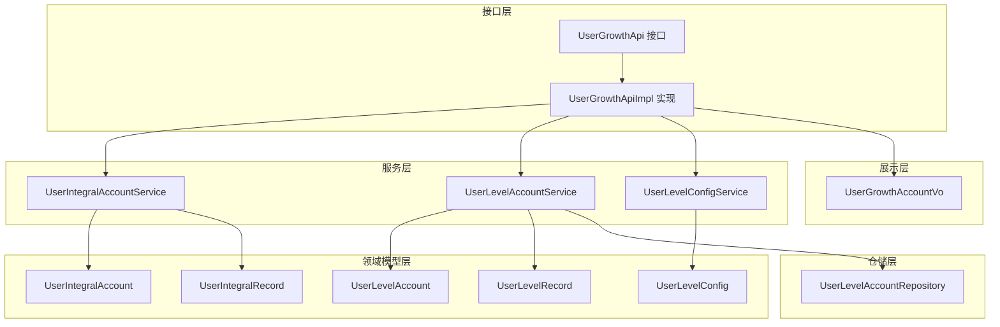
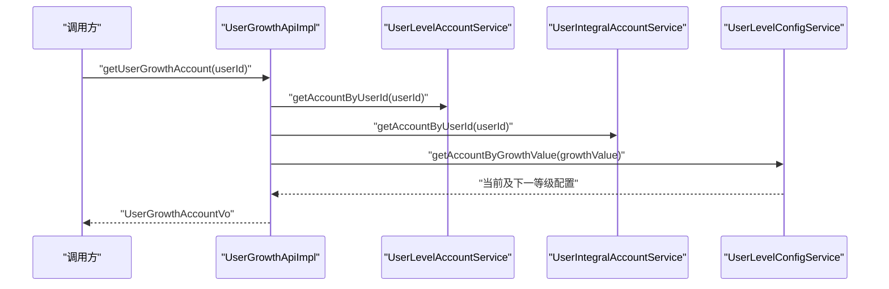
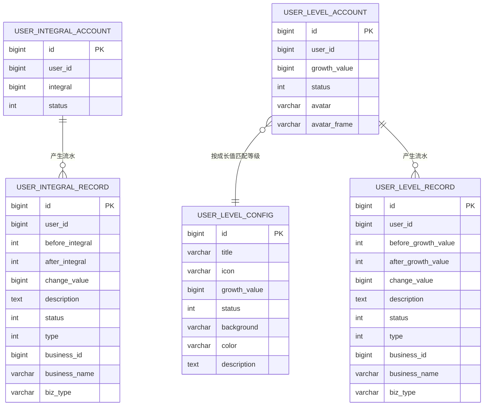
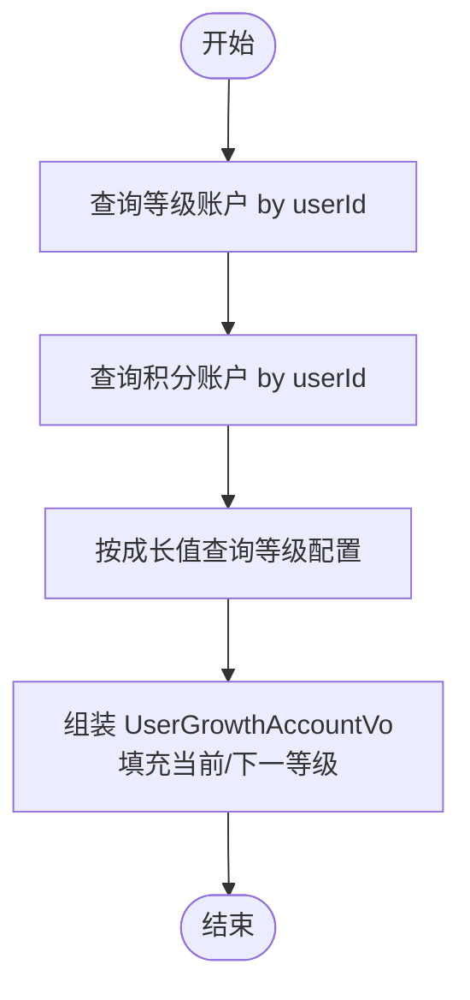
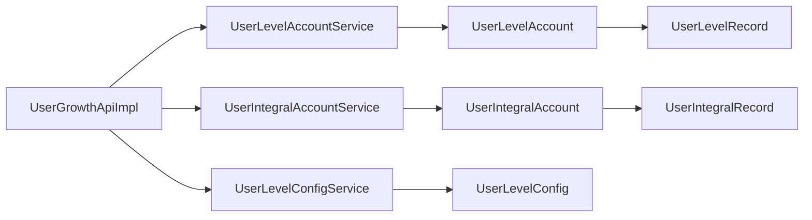

# 用户成长模块

<cite>
**本文引用的文件**
- [UserGrowthApi.java](file://user-growth-api/src/main/java/com/fastproject/usergrowth/api/UserGrowthApi.java)
- [UserGrowthApiImpl.java](file://user-growth-module/src/main/java/com/fastproject/usergrowth/api/UserGrowthApiImpl.java)
- [UserGrowthAccountVo.java](file://user-growth-api/src/main/java/com/fastproject/usergrowth/vo/UserGrowthAccountVo.java)
- [UserIntegralAccount.java](file://user-growth-module/src/main/java/com/fastproject/usergrowth/domain/UserIntegralAccount.java)
- [UserLevelAccount.java](file://user-growth-module/src/main/java/com/fastproject/usergrowth/domain/UserLevelAccount.java)
- [UserLevelConfig.java](file://user-growth-module/src/main/java/com/fastproject/usergrowth/domain/UserLevelConfig.java)
- [UserIntegralRecord.java](file://user-growth-module/src/main/java/com/fastproject/usergrowth/domain/UserIntegralRecord.java)
- [UserLevelRecord.java](file://user-growth-module/src/main/java/com/fastproject/usergrowth/domain/UserLevelRecord.java)
- [UserIntegralAccountService.java](file://user-growth-module/src/main/java/com/fastproject/usergrowth/service/UserIntegralAccountService.java)
- [UserLevelAccountService.java](file://user-growth-module/src/main/java/com/fastproject/usergrowth/service/UserLevelAccountService.java)
- [UserLevelConfigService.java](file://user-growth-module/src/main/java/com/fastproject/usergrowth/service/UserLevelConfigService.java)
- [UserLevelAccountRepository.java](file://user-growth-module/src/main/java/com/fastproject/usergrowth/repository/db/UserLevelAccountRepository.java)
</cite>

## 目录
1. [简介](#简介)
2. [项目结构](#项目结构)
3. [核心组件](#核心组件)
4. [架构总览](#架构总览)
5. [详细组件分析](#详细组件分析)
6. [依赖关系分析](#依赖关系分析)
7. [性能与扩展性](#性能与扩展性)
8. [故障排查指南](#故障排查指南)
9. [结论](#结论)
10. [附录：业务流程与配置参数](#附录业务流程与配置参数)

## 简介
本技术文档围绕“用户成长模块”展开，系统化阐述用户积分与等级体系的设计架构与实现细节。内容涵盖：
- 积分与等级的数据模型与业务规则
- 账户管理（积分账户、等级账户）与配置管理（等级配置）
- 成长API设计理念、接口定义与调用方式
- 扩展特性：积分流水、等级变更历史、权益管理
- 完整业务流程、配置参数说明与集成示例
- 模块在用户运营与留存策略中的作用与价值

## 项目结构
用户成长模块由“API接口层”“服务层”“领域模型层”“仓储层”“VO/DTO展示层”组成，采用清晰的分层架构，职责分离明确。

图表来源
- [UserGrowthApi.java](file://user-growth-api/src/main/java/com/fastproject/usergrowth/api/UserGrowthApi.java#L1-L13)
- [UserGrowthApiImpl.java](file://user-growth-module/src/main/java/com/fastproject/usergrowth/api/UserGrowthApiImpl.java#L1-L50)
- [UserGrowthAccountVo.java](file://user-growth-api/src/main/java/com/fastproject/usergrowth/vo/UserGrowthAccountVo.java#L1-L70)
- [UserIntegralAccount.java](file://user-growth-module/src/main/java/com/fastproject/usergrowth/domain/UserIntegralAccount.java#L1-L34)
- [UserLevelAccount.java](file://user-growth-module/src/main/java/com/fastproject/usergrowth/domain/UserLevelAccount.java#L1-L45)
- [UserLevelConfig.java](file://user-growth-module/src/main/java/com/fastproject/usergrowth/domain/UserLevelConfig.java#L1-L57)
- [UserIntegralRecord.java](file://user-growth-module/src/main/java/com/fastproject/usergrowth/domain/UserIntegralRecord.java#L1-L70)
- [UserLevelRecord.java](file://user-growth-module/src/main/java/com/fastproject/usergrowth/domain/UserLevelRecord.java#L1-L71)
- [UserLevelAccountRepository.java](file://user-growth-module/src/main/java/com/fastproject/usergrowth/repository/db/UserLevelAccountRepository.java#L1-L13)

章节来源
- [UserGrowthApi.java](file://user-growth-api/src/main/java/com/fastproject/usergrowth/api/UserGrowthApi.java#L1-L13)
- [UserGrowthApiImpl.java](file://user-growth-module/src/main/java/com/fastproject/usergrowth/api/UserGrowthApiImpl.java#L1-L50)
- [UserGrowthAccountVo.java](file://user-growth-api/src/main/java/com/fastproject/usergrowth/vo/UserGrowthAccountVo.java#L1-L70)

## 核心组件
- 成长API接口与实现：对外暴露统一查询入口，聚合积分账户、等级账户与等级配置，返回用户当前成长数据。
- 账户与配置领域模型：积分账户、等级账户、等级配置，以及对应的流水记录实体。
- 服务接口：面向业务操作的账户与配置管理能力。
- 仓储接口：基于Spring Data JPA的账户查询能力。

章节来源
- [UserGrowthApi.java](file://user-growth-api/src/main/java/com/fastproject/usergrowth/api/UserGrowthApi.java#L1-L13)
- [UserGrowthApiImpl.java](file://user-growth-module/src/main/java/com/fastproject/usergrowth/api/UserGrowthApiImpl.java#L1-L50)
- [UserGrowthAccountVo.java](file://user-growth-api/src/main/java/com/fastproject/usergrowth/vo/UserGrowthAccountVo.java#L1-L70)
- [UserIntegralAccount.java](file://user-growth-module/src/main/java/com/fastproject/usergrowth/domain/UserIntegralAccount.java#L1-L34)
- [UserLevelAccount.java](file://user-growth-module/src/main/java/com/fastproject/usergrowth/domain/UserLevelAccount.java#L1-L45)
- [UserLevelConfig.java](file://user-growth-module/src/main/java/com/fastproject/usergrowth/domain/UserLevelConfig.java#L1-L57)
- [UserIntegralRecord.java](file://user-growth-module/src/main/java/com/fastproject/usergrowth/domain/UserIntegralRecord.java#L1-L70)
- [UserLevelRecord.java](file://user-growth-module/src/main/java/com/fastproject/usergrowth/domain/UserLevelRecord.java#L1-L71)
- [UserIntegralAccountService.java](file://user-growth-module/src/main/java/com/fastproject/usergrowth/service/UserIntegralAccountService.java#L1-L27)
- [UserLevelAccountService.java](file://user-growth-module/src/main/java/com/fastproject/usergrowth/service/UserLevelAccountService.java#L1-L27)
- [UserLevelConfigService.java](file://user-growth-module/src/main/java/com/fastproject/usergrowth/service/UserLevelConfigService.java#L1-L24)
- [UserLevelAccountRepository.java](file://user-growth-module/src/main/java/com/fastproject/usergrowth/repository/db/UserLevelAccountRepository.java#L1-L13)

## 架构总览
用户成长模块遵循“接口-实现-服务-仓储-领域”的分层设计，通过API聚合器组合多账户信息，并以等级配置驱动等级计算与展示。

图表来源
- [UserGrowthApiImpl.java](file://user-growth-module/src/main/java/com/fastproject/usergrowth/api/UserGrowthApiImpl.java#L24-L48)
- [UserGrowthApi.java](file://user-growth-api/src/main/java/com/fastproject/usergrowth/api/UserGrowthApi.java#L10-L10)
- [UserLevelAccountService.java](file://user-growth-module/src/main/java/com/fastproject/usergrowth/service/UserLevelAccountService.java#L25-L25)
- [UserIntegralAccountService.java](file://user-growth-module/src/main/java/com/fastproject/usergrowth/service/UserIntegralAccountService.java#L25-L25)
- [UserLevelConfigService.java](file://user-growth-module/src/main/java/com/fastproject/usergrowth/service/UserLevelConfigService.java#L22-L22)

## 详细组件分析

### 数据模型与关系
用户成长涉及以下核心实体：
- 积分账户：记录用户的可用积分与状态
- 等级账户：记录用户的成长值、状态与个性化字段
- 等级配置：定义等级标题、图标、成长值门槛、背景、颜色、描述等
- 积分流水：记录积分变动明细（交易前后、变更值、业务标识）
- 等级变更流水：记录成长值变动明细（交易前后、变更值、业务标识）

图表来源
- [UserIntegralAccount.java](file://user-growth-module/src/main/java/com/fastproject/usergrowth/domain/UserIntegralAccount.java#L17-L33)
- [UserLevelAccount.java](file://user-growth-module/src/main/java/com/fastproject/usergrowth/domain/UserLevelAccount.java#L17-L44)
- [UserLevelConfig.java](file://user-growth-module/src/main/java/com/fastproject/usergrowth/domain/UserLevelConfig.java#L19-L56)
- [UserIntegralRecord.java](file://user-growth-module/src/main/java/com/fastproject/usergrowth/domain/UserIntegralRecord.java#L18-L69)
- [UserLevelRecord.java](file://user-growth-module/src/main/java/com/fastproject/usergrowth/domain/UserLevelRecord.java#L18-L70)

章节来源
- [UserIntegralAccount.java](file://user-growth-module/src/main/java/com/fastproject/usergrowth/domain/UserIntegralAccount.java#L1-L34)
- [UserLevelAccount.java](file://user-growth-module/src/main/java/com/fastproject/usergrowth/domain/UserLevelAccount.java#L1-L45)
- [UserLevelConfig.java](file://user-growth-module/src/main/java/com/fastproject/usergrowth/domain/UserLevelConfig.java#L1-L57)
- [UserIntegralRecord.java](file://user-growth-module/src/main/java/com/fastproject/usergrowth/domain/UserIntegralRecord.java#L1-L70)
- [UserLevelRecord.java](file://user-growth-module/src/main/java/com/fastproject/usergrowth/domain/UserLevelRecord.java#L1-L71)

### 成长API与聚合逻辑
- 接口职责：根据用户ID返回其成长值、积分、当前等级与下一等级信息
- 聚合流程：分别查询等级账户、积分账户，再依据成长值查询等级配置（含当前与下一等级）
- 返回对象：封装成长值、积分与两个等级视图对象（当前与下一）

图表来源
- [UserGrowthApiImpl.java](file://user-growth-module/src/main/java/com/fastproject/usergrowth/api/UserGrowthApiImpl.java#L24-L48)
- [UserGrowthApi.java](file://user-growth-api/src/main/java/com/fastproject/usergrowth/api/UserGrowthApi.java#L10-L10)
- [UserGrowthAccountVo.java](file://user-growth-api/src/main/java/com/fastproject/usergrowth/vo/UserGrowthAccountVo.java#L17-L32)

章节来源
- [UserGrowthApi.java](file://user-growth-api/src/main/java/com/fastproject/usergrowth/api/UserGrowthApi.java#L1-L13)
- [UserGrowthApiImpl.java](file://user-growth-module/src/main/java/com/fastproject/usergrowth/api/UserGrowthApiImpl.java#L1-L50)
- [UserGrowthAccountVo.java](file://user-growth-api/src/main/java/com/fastproject/usergrowth/vo/UserGrowthAccountVo.java#L1-L70)

### 服务接口与职责边界
- 积分账户服务：提供积分账户的增删改查与分页查询，按用户ID查询账户
- 等级账户服务：提供等级账户的增删改查与分页查询，按用户ID查询账户
- 等级配置服务：提供等级配置的增删改查与分页查询，按成长值查询当前及下一等级配置

章节来源
- [UserIntegralAccountService.java](file://user-growth-module/src/main/java/com/fastproject/usergrowth/service/UserIntegralAccountService.java#L1-L27)
- [UserLevelAccountService.java](file://user-growth-module/src/main/java/com/fastproject/usergrowth/service/UserLevelAccountService.java#L1-L27)
- [UserLevelConfigService.java](file://user-growth-module/src/main/java/com/fastproject/usergrowth/service/UserLevelConfigService.java#L1-L24)

### 仓储与查询能力
- 等级账户仓储：提供按用户ID查询等级账户的能力，支撑API聚合逻辑

章节来源
- [UserLevelAccountRepository.java](file://user-growth-module/src/main/java/com/fastproject/usergrowth/repository/db/UserLevelAccountRepository.java#L1-L13)

## 依赖关系分析
- API实现依赖服务接口，服务接口依赖仓储接口与领域模型
- 等级账户与等级配置之间存在“成长值阈值”关联，用于确定当前与下一等级
- 流水实体与账户实体形成一对多关系，支撑审计与对账

图表来源
- [UserGrowthApiImpl.java](file://user-growth-module/src/main/java/com/fastproject/usergrowth/api/UserGrowthApiImpl.java#L20-L22)
- [UserLevelAccountService.java](file://user-growth-module/src/main/java/com/fastproject/usergrowth/service/UserLevelAccountService.java#L1-L27)
- [UserIntegralAccountService.java](file://user-growth-module/src/main/java/com/fastproject/usergrowth/service/UserIntegralAccountService.java#L1-L27)
- [UserLevelConfigService.java](file://user-growth-module/src/main/java/com/fastproject/usergrowth/service/UserLevelConfigService.java#L1-L24)
- [UserLevelAccount.java](file://user-growth-module/src/main/java/com/fastproject/usergrowth/domain/UserLevelAccount.java#L1-L45)
- [UserIntegralAccount.java](file://user-growth-module/src/main/java/com/fastproject/usergrowth/domain/UserIntegralAccount.java#L1-L34)
- [UserLevelConfig.java](file://user-growth-module/src/main/java/com/fastproject/usergrowth/domain/UserLevelConfig.java#L1-L57)
- [UserLevelRecord.java](file://user-growth-module/src/main/java/com/fastproject/usergrowth/domain/UserLevelRecord.java#L1-L71)
- [UserIntegralRecord.java](file://user-growth-module/src/main/java/com/fastproject/usergrowth/domain/UserIntegralRecord.java#L1-L70)

## 性能与扩展性
- 查询路径优化：API聚合仅进行三次数据库访问（等级账户、积分账户、等级配置），建议在等级配置表上建立按成长值的索引以加速查询
- 分页与过滤：账户与流水均支持分页查询，建议在高频查询场景下增加复合索引与缓存策略
- 扩展点：可引入异步任务处理批量积分/等级变更，或引入事件总线解耦业务变更与通知

## 故障排查指南
- 常见问题
  - 等级配置缺失：当成长值未命中任何等级配置时，API将不返回下一等级；需检查等级配置是否覆盖全量区间
  - 账户不存在：按用户ID查询账户为空时，需确认账户初始化流程是否完成
  - 流水异常：若发现积分/成长值与流水不一致，应核对业务变更是否正确写入流水
- 排查步骤
  - 核对等级配置表的区间与顺序
  - 校验账户表与流水表的业务ID一致性
  - 关注服务日志与事务提交情况

## 结论
用户成长模块通过清晰的分层设计与稳定的领域模型，实现了积分与等级的统一管理与可视化展示。模块具备良好的扩展性与可维护性，能够支撑多样化的用户运营策略，如签到、消费、任务等场景下的积分与等级激励，从而提升用户活跃度与留存率。

## 附录：业务流程与配置参数

### 业务流程
- 用户成长数据查询
  - 输入：用户ID
  - 步骤：查询等级账户、积分账户；按成长值查询等级配置；组装返回对象
  - 输出：成长值、积分、当前等级与下一等级信息
- 等级配置管理
  - 新增/更新等级配置：设置标题、图标、成长值门槛、状态、背景、颜色、描述
  - 查询：按分页与条件查询，按成长值查询当前与下一等级
- 账户与流水
  - 积分账户：按用户维度管理积分余额与状态
  - 等级账户：按用户维度管理成长值与状态，支持个性化字段
  - 流水记录：记录每次积分/成长值变动的明细，便于审计与核对

章节来源
- [UserGrowthApiImpl.java](file://user-growth-module/src/main/java/com/fastproject/usergrowth/api/UserGrowthApiImpl.java#L24-L48)
- [UserLevelConfig.java](file://user-growth-module/src/main/java/com/fastproject/usergrowth/domain/UserLevelConfig.java#L19-L56)
- [UserIntegralRecord.java](file://user-growth-module/src/main/java/com/fastproject/usergrowth/domain/UserIntegralRecord.java#L18-L69)
- [UserLevelRecord.java](file://user-growth-module/src/main/java/com/fastproject/usergrowth/domain/UserLevelRecord.java#L18-L70)

### 配置参数说明
- 等级配置字段
  - 标题：等级显示名称
  - 图标：等级图标URL
  - 成长值门槛：达到该成长值即为该等级
  - 状态：启用/停用
  - 背景：等级背景图片
  - 颜色：等级主题色
  - 描述：等级说明
- 等级账户字段
  - 用户ID：归属用户
  - 成长值：当前成长值
  - 状态：启用/停用
  - 个性图标/头像框：个性化展示字段
- 积分账户字段
  - 用户ID：归属用户
  - 积分：当前可用积分
  - 状态：启用/停用

章节来源
- [UserLevelConfig.java](file://user-growth-module/src/main/java/com/fastproject/usergrowth/domain/UserLevelConfig.java#L19-L56)
- [UserLevelAccount.java](file://user-growth-module/src/main/java/com/fastproject/usergrowth/domain/UserLevelAccount.java#L17-L44)
- [UserIntegralAccount.java](file://user-growth-module/src/main/java/com/fastproject/usergrowth/domain/UserIntegralAccount.java#L17-L33)

### API 设计理念与使用方法
- 设计理念
  - 单一职责：API仅负责聚合与返回，具体业务逻辑由服务层承担
  - 易扩展：通过服务接口抽象，便于替换实现与扩展新功能
  - 可观测：返回对象包含当前与下一等级，便于前端展示与运营分析
- 使用方法
  - 调用入口：调用方通过接口方法传入用户ID，获取成长数据
  - 返回对象：包含成长值、积分、当前等级与下一等级信息

章节来源
- [UserGrowthApi.java](file://user-growth-api/src/main/java/com/fastproject/usergrowth/api/UserGrowthApi.java#L1-L13)
- [UserGrowthApiImpl.java](file://user-growth-module/src/main/java/com/fastproject/usergrowth/api/UserGrowthApiImpl.java#L24-L48)
- [UserGrowthAccountVo.java](file://user-growth-api/src/main/java/com/fastproject/usergrowth/vo/UserGrowthAccountVo.java#L17-L32)